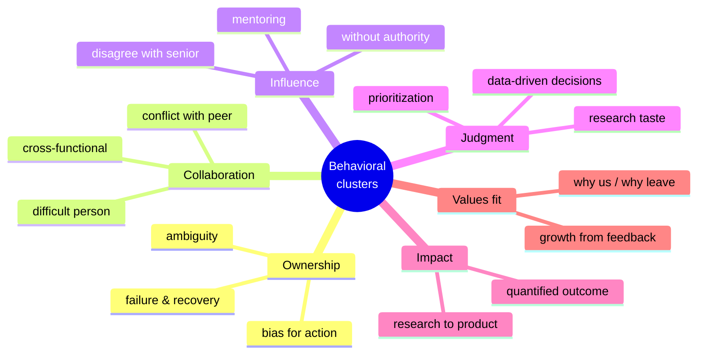
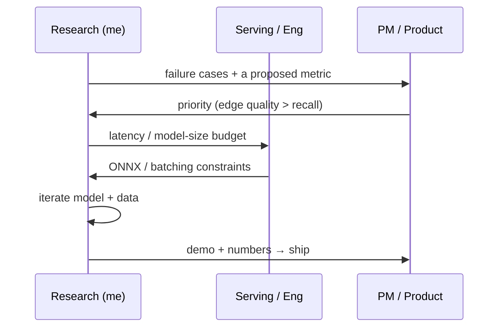

# Common Questions & Answers

question bankwhat they testanswer skeletonscompany signals

> [!TIP] 이 bank 활용법
> 스크립트를 외우지 마세요. **각 질문이 무엇을 시험하는지**, 그리고 **당신의 [matrix](#/behavioral/star)에서 어떤 story가 발화되는지**를 외우세요. 그런 다음 현장에서 STAR-L로 잘라내세요. 아래 모든 질문은 (1) 밑바탕의 signal, (2) skeleton, (3) 앞에 있는 조직에 맞춰 같은 story를 재구성할 수 있도록 회사 signal 노트를 함께 제공합니다.

이들은 여섯 개의 역량 클러스터로 묶입니다. 면접관은 교과서적 이름으로 묻는 일이 거의 없습니다. *"~했던 때를 말해보세요"*라고 묻고, 당신은 그게 어느 클러스터를 겨냥하는지 알아채야 합니다.

## 클러스터 1 — Ownership

"실패했던 경험을 말해보세요."

**시험하는 것:** 정직함, 자기 인식, 그리고 남 탓이 아니라 *진단 → pivot → 학습* loop을 돌리는지.

**Skeleton:** 당신이 맡았던 진짜이고 범위가 명확한 실패를 고르고 → 어떻게 *진단*했는지(느낌이 아니라 증거) → pivot 결정과 그 타이밍 → 최종 결과 → 깔끔한 교훈 하나. **ownership**으로 착지하고, 절대 남에게 착지하지 마세요.

**Story:** ZIM 초기의 "SAM head만 손보면 된다" 접근이 alpha boundary에서 실패한 것, 병목이 decoder가 아니라 data + loss였다고 재진단한 것, pivot한 것, 그리고 ICCV Highlight로 끝난 것.

**Signal 노트:** *Amazon 스타일* — 이건 **Dive Deep** + **Ownership**, pivot을 정량화하세요 ("~N주차에 멈추고 ablation을 다시 돌렸습니다"). *Microsoft* — **growth mindset**으로 프레이밍, 학습으로 시작. *NVIDIA* — intellectual honesty, 무엇을 틀렸는지 솔직하게 말할 것.

"완전히 모호한 요구사항으로 일했던 경험을 설명해보세요."

**시험하는 것:** 시키지 않아도 모호함을 측정 가능한 문제로 바꿀 수 있는가? 핵심 RS 스킬.

**Skeleton:** 모호한 요청 → *첫 수*(지표 + 제약 정의) → 그 정의에 이해관계자를 정렬 → 반복 → 결과.

**Story:** 지표가 없는 "편집을 더 예쁘게"(CLOVA-X) 또는 "폰에서 좋고 빠르게"(on-device) → *제가* eval set과 latency/품질 기준을 제안.

**Signal 노트:** *Meta* — "요구사항이 백지일 때의 ownership"과 함께. *Apple* — 현실 제약(on-device, 배터리, privacy)을 강조. *Mistral* — "먼저 범위를 data 큐레이션과 pipeline으로 줄였습니다", 로드맵 없이 출시하는 그들의 문화에 부합.

"주도적으로 나선 / 아무도 시키지 않은 걸 출시한 경험을 말해보세요."

**시험하는 것:** bias for action, 자기 권한을 넘어선 ownership.

**Skeleton:** 당신이 발견한 gap → 왜 중요했는지 → 시키지 않았는데 무엇을 만들었는지 → 채택.

**Story:** on-device human-segmentation 모델과 그 ONNX serving 경로를 독립적으로 구축한 것, 또는 foreground 모델을 상용 대안을 능가하는 재사용 가능한 내부 API로 만든 것.

**Signal 노트:** *Amazon* — **Bias for Action** + **Deliver Results**. *ByteDance* — 속도와 OKR 형태의 impact.

## 클러스터 2 — Collaboration

"팀원과의 갈등, 그리고 어떻게 해결했는지 말해보세요."

**시험하는 것:** *증거와 공감*으로 해결하는가, 아니면 에스컬레이션과 에고로 해결하는가? 관계가 유지되는가?

**Skeleton:** 본질적인 의견 충돌(성격 충돌이 아니라) → 그것을 결정 규칙으로 재구성한 방법 → 그걸 종결시킨 데이터 → disagree-and-commit → 관계 유지.

**Story:** serving 엔지니어와의 ZIM 품질-vs-latency 논쟁, 처음부터 공유 eval set과 latency 예산에 합의한 것.

**Signal 노트:** *Amazon* — **Have Backbone; Disagree and Commit** + **Earn Trust**. *Meta* — direct communication, low ego. 연차로 "이긴" story는 피하세요.

"강력한 cross-functional 협업의 예를 들어보세요."

**시험하는 것:** research를 PM/serving/security의 언어로 번역하고, 팀 경계를 넘어 결정을 움직일 수 있는가?

**Skeleton:** 상대 팀의 목표와 어휘(SLA, p99, false-accept) → 다리를 놓기 위해 *당신이* 한 것(공유 지표, demo, 문서) → 공동의 결과.

**Story:** ZIM → CLOVA-X (research↔product), foreground-API (research↔serving), FaceSign (research↔security↔product).

**Signal 노트:** *Meta / Adobe / NVIDIA* — 모두 research→product 전이를 명시적으로 중시, 출시된 결과물로 시작. *Apple* — *기밀 속에서* 하드웨어/product와의 협업.

"까다로운 사람과 일했던 경험을 말해보세요."

**시험하는 것:** 공감, 프로페셔널리즘, 마찰 뒤에 있는 정당한 우려를 찾아낼 수 있는가.

**Skeleton:** 사람이 아니라 *행동*을 묘사 → 당신이 밝혀낸 밑바탕의 이해관계 → 어떻게 커뮤니케이션을 조정했는지 → 결과. 관대함을 유지하고, 절대 험담하지 마세요.

**Signal 노트:** 모든 회사가 이걸 성숙도 체크로 읽습니다. 절대 실명을 말하지 말고, 기밀 맥락은 추상화하세요 ("한 serving 엔지니어", "내부 사진 서비스").

## 클러스터 3 — Influence & leadership

"공식 권한 없이 이끌었던 경험을 말해보세요."

**시험하는 것:** 핵심 RS/AS 역량 — 부하 없는 IC로서 데이터, demo, 신뢰로 결정을 움직이는 것.

**Skeleton:** 내려야 할 결정 → 강제할 권한은 없었음 → 어떻게 합의를 만들었는지(증거, 프로토타입, 인센티브 정렬) → 결정이 당신 뜻대로 됨 → 출시.

**Story:** 매니저가 아니라 1저자로서 serving 엔지니어와 PM을 아우르며 ZIM의 architecture/data 방향을 주도한 것.

**Signal 노트:** *Microsoft* — 비관리자에게도 영향력을 통한 리더십이 요구됨 ("Model, Coach, Care"). *Meta* — "earn trust" + 정량화된 impact.

"강한 시니어 연구자나 매니저와의 의견 충돌은 어떻게 다루나요?"

**시험하는 것:** backbone *과 함께* 겸손, 증거로 밀어붙인 뒤 우아하게 commit할 수 있는가?

**Skeleton:** 의견 충돌 → 데이터 / 작은 파일럿으로 주장 → 결정(당신의 것이든 상대의 것이든) → **disagree and commit** → 누가 옳았는지 알기 위해 무엇을 측정했을지.

**Story:** "예쁘지만 배포 불가한" 모델의 출시를 거절한 것, 또는 특정 ablation은 양보하면서 마감 압박에 맞서 품질 기준을 지킨 것.

**Signal 노트:** *Amazon* — 교과서적 **Have Backbone; Disagree and Commit**. *NVIDIA* — 자기 입장의 한계에 대한 intellectual honesty.

"누군가를 멘토링했던 경험을 말해보세요."

**시험하는 것:** 타인을 성장시킬 수 있는가? Meta와 Adobe의 JD는 멘토십을 명시적으로 요구합니다.

**Skeleton:** 누구 + 그의 출발점 → 당신이 한 것(주간 1:1, 실패한 실험 해석 돕기, code review, baseline 재현) → 당신이 아니라 *그의* 결과(첫 PR, 첫 논문 기여).

**Story:** baseline 재현과 실험 추적에 대해 주니어/인턴을 온보딩한 것, 또는 당신의 리뷰 습관(CVPR/ICCV/NeurIPS/TPAMI)이 팀 내 건설적 피드백을 형성한 것.

**Signal 노트:** *멘티의* 성장을 측정하세요. "제가 대신 해줬어요"는 anti-signal입니다.

## 클러스터 4 — Judgment & research taste

"접기로 결정한 research 방향에 대해 말해보세요."

**시험하는 것:** research taste — 증거를 근거로 손실을 끊고 자원을 재배분할 수 있는가?

**Skeleton:** 유망해 보이던 방향 → 작동하지 않는다는 signal(val에서 유지되지 않는 지표, diminishing returns) → 접기 결정과 그 비용 → 노력을 어디로 재배치했는지.

**Story:** "pseudo-label을 더 넣을수록 train mIoU는 계속 올랐지만 val에서 무너졌다 → data-filtering 정책으로 pivot", 또는 ablation 후 포기한 weak/semi-supervised 접근.

**Signal 노트:** 보편적인 RS signal. sunk cost가 아니라 **novelty vs. impact vs. feasibility**를 저울질했음을 강조하세요.

"주로 데이터에 근거해 내린 결정을 설명해보세요."

**시험하는 것:** rigor — 직관이나 정치가 아니라 통제된 비교.

**Skeleton:** 경쟁하는 두 설계 + 팀의 분열 → 돌리기 *전에* primary 지표와 공정한 비교(같은 seed/split)를 정의 → 숫자가 결론을 냄 → 감정적 논쟁 종료.

**Story:** 공유 split에서의 ablation이 ZIM / PointWSSIS의 설계 논쟁을 해결한 것.

**Signal 노트:** *Amazon* — **Dive Deep**. δ를 준비해두세요 ("Y를 해치지 않으면서 X가 ~N포인트 개선됐습니다").

"모든 게 급할 때 어떻게 우선순위를 정하나요?"

**시험하는 것:** 부하 상태의 판단력, 프레임워크를 쓰는가 아니면 그냥 주말에 일하는가?

**Skeleton:** 경쟁하는 요구들 → 당신이 쓴 *기준*(impact × 되돌릴 수 있음, 또는 남을 막는 것 먼저) → 무엇을 **의도적으로 미뤘고** 왜 그랬는지 → PM/지도교수와 기대치를 재조정.

**Story:** 정규직 + 파트타임 PhD를 병행하며 학회 마감 + product 일정 — 영웅담이 아니라 *우선순위 매트릭스와 범위 축소*를 이야기하세요.

**Signal 노트:** *ByteDance / Meta* — 속도, 하지만 미룬 것이 *결정*이었음을 보여줄 것. 밤샘을 미화하지 마세요.

## 클러스터 5 — Impact & delivery

"가장 impactful했던 프로젝트에 대해 말해보세요."

**시험하는 것:** 중요성부터 이야기할 수 있는가(문제 → 결과), 그리고 impact가 실제이고 측정됐는가?

**Skeleton:** 왜 그 문제가 중요했는지 → 당신의 구체적 기여 → 정량화된 과학적 *그리고* product 결과. impact로 시작하고, 파고들면 그때 method를 채우세요.

**Story:** ZIM — Highlight + 오픈소스 + CLOVA-X를 통해 수백만 명에게 출시, 내부적으로 상용 API를 능가.

**Signal 노트:** 이것이 [job talk](#/research/job-talk)로 이어지는 다리입니다. I-vs-we를 면도날처럼 날카롭게 유지하세요.

"research를 production으로 옮긴 경험을 말해보세요."

**시험하는 것:** RS→AS 차별점 — serving, latency, product 제약을 이해하는가?

**Skeleton:** research 결과 → production까지의 gap(latency, robustness, edge case) → 무엇을 바꿨는지(distillation, ONNX, data 큐레이션) → 출시 + 채택.

**Story:** ZIM → CLOVA-X, on-device seg → ~10 ms ONNX serving, Photoroom/Remove.bg/Adobe를 능가한 foreground-API.

**Signal 노트:** *Adobe / Meta / NVIDIA / Apple* 모두 이걸 크게 가중합니다. Apple이라면 on-device/privacy 제약을 전면에 내세우세요.

## 클러스터 6 — Values & fit

"왜 우리 회사인가 / 왜 지금 자리를 떠나는가?"

**시험하는 것:** 진정한 동기, 그리고 사전 조사를 했는가.

**Skeleton:** push(30%)가 아니라 pull(70%) → 그들의 실제 공개 논문/product를 인용 → 첫날 당길 레버. 절대 연봉만, 절대 현재 팀 탓하지 말 것.

**Signal 노트:** [HM 스크리닝 챕터](#/process/recruiter-hm)와 [Questions to Ask Them](#/playbook/questions-to-ask)에서 깊게 다룹니다. 타겟 조직마다 정직한 *"저는 ___를 존경했는데 ___ 때문입니다"* 하나씩 준비하세요.

"받았던 비판적 피드백에 대해 말해보세요."

**시험하는 것:** growth mindset, 에고의 강함.

**Skeleton:** 피드백(구체적이고 약간 껄끄러운) → 솔직한 첫 반응 → 무엇을 바꿨는지 → 개선된 결과.

**Story:** 더 날카로운 ablation을 강제한 논문 리뷰, 범위를 과하게 잡았다는 매니저의 지적, 지금 eval을 일찍 정의하게 만든 피드백.

**Signal 노트:** *Microsoft* — 여기서는 **growth mindset**이 전부입니다. 단순 수용이 아니라 행동 변화를 보여주세요.

## 회사 signal 빠른 지도

| 회사 | Behavioral 성향 | story를 시작할 때 앞세울 것 |
| --- | --- | --- |
| **Amazon 스타일 LP** | 명시적 LP, STAR + 확실한 숫자 | Ownership, Dive Deep, Disagree & Commit, 정량화된 결과 |
| **Meta** | Move fast, 모호함 속 ownership, direct comms, PhD 면접관이 trajectory를 파고듦 | research→product 속도, 정량화된 impact, low ego |
| **Apple** | **기밀** 속 협업, product craft, on-device/privacy | 신중함, 제약 아래에서의 출시, 미공개 product에 대해 추측하지 말 것 |
| **Microsoft / MSR** | Growth mindset, **Model/Coach/Care**, One Microsoft | 실패로부터의 학습, 멘토링, 조직 간 영향력 |
| **NVIDIA** | Intellectual honesty, One Team, "mission is the boss" | 모르는 것을 인정, 시스템/GPU 실용주의 |
| **Adobe** | 논문 친화적 + product 감각 | 크리에이티브 product에 출시된 research, 멘토십 |
| **ByteDance Seed** | 빠름, OKR 주도, 산출 지향 | 속도, 모호함, 시간대를 넘는 ownership |
| **Mistral** | Low-ego, 깔끔한 코드, "왜 미국 lab이 아니라 Mistral인가" | 로드맵 없이 출시, open-weights 신념, EN+KR |

> [!DANGER] 전방위 anti-signal
> "저는 실패한 적 없어요" · 팀원/지도교수 탓 · 전부 "we"라 당신의 역할이 안 보임 · 숫자 없음 · 현재 고용주에 대한 불평 독백 · 회사의 미공개 product 추측(Apple에서 치명적). [Common Mistakes](#/playbook/mistakes)를 참고하세요.

## *어떤* 답변에도 예상해야 할 후속 질문

- *"구체적으로 **당신은** 뭘 했나요?"* — I-vs-we 탐침. 항상 미리 장전.
- *"무엇을 다르게 하겠나요?"* — 진짜 변화 + 이유.
- *"상대방은 그것에 대해 어떻게 느꼈나요?"* — 관계가 유지됐는가?
- *"측정 가능한 결과는 무엇이었나요?"* — story를 절대 숫자 없이 끝내지 말 것.
- *"왜 그 선택이고 대안은 아니었나요?"* — 당신이 기각한 trade-off.

## 치트시트

| 클러스터 | 대표 story | signal |
| --- | --- | --- |
| Ownership | ZIM failure→pivot, on-device 주도 | 진단→pivot→학습, bias for action |
| Collaboration | ZIM 품질-vs-latency 갈등, CLOVA-X | 에고보다 증거, cross-functional 다리 놓기 |
| Influence | 권한 없이 ZIM 주도, 멘토링 | 데이터 & 신뢰로 결정을 움직임 |
| Judgment | pseudo-label 방향 접음, ablation | research taste, 직관보다 데이터 |
| Impact | ZIM 수백만 명에게 출시, 상용 API 능가 | 중요성부터, 정량화 |
| Values | why-us pull 70/30, feedback→변화 | 진정한 동기, growth mindset |

**관련:** [STAR & The Story Bank](#/behavioral/star) · [Recruiter & HM Screens](#/process/recruiter-hm) · [Company Playbooks](#/process/companies) · [The Research Job Talk](#/research/job-talk) · [Questions to Ask Them](#/playbook/questions-to-ask) · [Common Mistakes & Red Flags](#/playbook/mistakes) · [Your CV → Interview Map](#/resume/overview)
