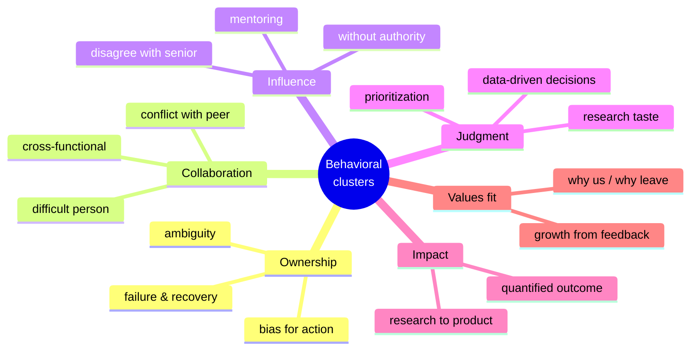
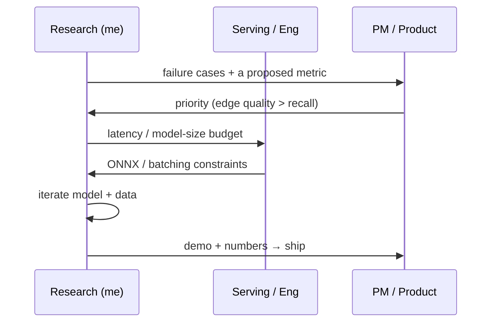

# Common Questions & Answers

question bankwhat they testanswer skeletonsrole-specific prompts

> [!TIP] 이 bank 활용법
> 스크립트를 외우지 마세요. **각 질문이 무엇을 시험하는지** 파악하고, [story matrix](#/behavioral/star)에서 검증된 경험을 고른 뒤 STAR-L로 구성하세요. 아래 노트는 회사 고정관념이 아니라 최신 공고·공식 values·recruiter가 확인한 rubric에 맞춰 강조점을 고르는 방법을 제시합니다.

> [!WARNING] 개인 story 표시는 검증 전 후보입니다
> 아래 `개인 패킷 후보`는 이력서에서 추론한 routing hint입니다. 실제로 겪지 않은 갈등·실패·의사결정을 답변으로 만들지 마세요. 내부 수치·고객·동료 정보는 공개 범위를 확인하고, 회사별 signal은 최신 job description·공식 values·recruiter 설명으로 다시 검증합니다.

이들은 여섯 개의 역량 클러스터로 묶입니다. 면접관은 교과서적 이름으로 묻는 일이 거의 없습니다. *"~했던 때를 말해보세요"*라고 묻고, 당신은 그게 어느 클러스터를 겨냥하는지 알아채야 합니다.

## 클러스터 1 — Ownership

"실패했던 경험을 말해보세요."

**시험하는 것:** 정직함, 자기 인식, 그리고 남 탓이 아니라 *진단 → pivot → 학습* loop을 돌리는지.

**Skeleton:** 당신이 맡았던 진짜이고 범위가 명확한 실패를 고르고 → 어떻게 *진단*했는지(느낌이 아니라 증거) → pivot 결정과 그 타이밍 → 최종 결과 → 깔끔한 교훈 하나. **ownership**으로 착지하고, 절대 남에게 착지하지 마세요.

→ **개인 패킷 후보:** 실제 초기 실패가 확인된다면 ZIM의 hypothesis → 반증 → pivot; 아니면 본인이 기록한 실패 사례 — [STAR & 스토리 뱅크](#/behavioral/star) 참조.

**역할별 조정:** 공고나 공식 rubric이 ownership·deep dive·growth를 강조한다면, pivot 시점·진단 근거·이후 행동 변화를 앞세우세요. 확인되지 않은 회사식 표현을 억지로 붙이지 않습니다.

"완전히 모호한 요구사항으로 일했던 경험을 설명해보세요."

**시험하는 것:** 시키지 않아도 모호함을 측정 가능한 문제로 바꿀 수 있는가? 핵심 RS 스킬.

**Skeleton:** 모호한 요청 → *첫 수*(지표 + 제약 정의) → 그 정의에 이해관계자를 정렬 → 반복 → 결과.

→ **개인 패킷 후보:** 실제 요구사항과 ownership을 확인한 CLOVA-X 또는 on-device 평가 정의 사례 — [STAR & 스토리 뱅크](#/behavioral/star) 참조.

**역할별 조정:** JD가 on-device·privacy·빠른 iteration을 명시한다면 실제로 다룬 제약과 범위 축소 근거를 강조하세요. 지원 회사의 문화를 추정해 사건을 각색하지 않습니다.

"주도적으로 나선 / 아무도 시키지 않은 걸 출시한 경험을 말해보세요."

**시험하는 것:** bias for action, 자기 권한을 넘어선 ownership.

**Skeleton:** 당신이 발견한 gap → 왜 중요했는지 → 시키지 않았는데 무엇을 만들었는지 → 채택.

→ **개인 패킷 후보:** on-device human-seg/ONNX 또는 foreground API에서 본인이 제안하고 끝까지 소유한 범위 — [STAR & 스토리 뱅크](#/behavioral/star) 참조.

**역할별 조정:** 공식 평가 기준이 initiative·delivery를 강조할 때는 발견한 gap, 승인 없이도 안전하게 시작할 수 있었던 범위, 채택 결과를 명확히 합니다.

## 클러스터 2 — Collaboration

"팀원과의 갈등, 그리고 어떻게 해결했는지 말해보세요."

**시험하는 것:** *증거와 공감*으로 해결하는가, 아니면 에스컬레이션과 에고로 해결하는가? 관계가 유지되는가?

**Skeleton:** 본질적인 의견 충돌(성격 충돌이 아니라) → 그것을 결정 규칙으로 재구성한 방법 → 그걸 종결시킨 데이터 → disagree-and-commit → 관계 유지.

→ **개인 패킷 후보:** 실제 관계·결정이 확인되는 품질↔지연 trade-off 사례. 갈등이 없었다면 ZIM을 억지로 쓰지 않습니다.

**역할별 조정:** disagreement·trust가 명시된 rubric이라면 결정 전 반대 근거와 결정 후 실행을 분리하세요. 연차로 "이긴" story는 피합니다.

"강력한 cross-functional 협업의 예를 들어보세요."

**시험하는 것:** research를 PM/serving/security의 언어로 번역하고, 팀 경계를 넘어 결정을 움직일 수 있는가?

**Skeleton:** 상대 팀의 목표와 어휘(SLA, p99, false-accept) → 다리를 놓기 위해 *당신이* 한 것(공유 지표, demo, 문서) → 공동의 결과.

→ **개인 패킷 후보:** ZIM→CLOVA-X, foreground API, FaceSign 중 본인과 상대 팀의 역할을 정확히 분리할 수 있는 사례.

**역할별 조정:** research-to-product·hardware·privacy가 JD에 있으면 상대 팀의 제약을 어떤 metric·artifact로 번역했는지 강조합니다. 기밀을 회사 특성처럼 추정하지 말고 실제 공개 범위를 지킵니다.

"까다로운 사람과 일했던 경험을 말해보세요."

**시험하는 것:** 공감, 프로페셔널리즘, 마찰 뒤에 있는 정당한 우려를 찾아낼 수 있는가.

**Skeleton:** 사람이 아니라 *행동*을 묘사 → 당신이 밝혀낸 밑바탕의 이해관계 → 어떻게 커뮤니케이션을 조정했는지 → 결과. 관대함을 유지하고, 절대 험담하지 마세요.

**역할별 조정:** 협업 성숙도를 보는 질문일 가능성이 큽니다. 불필요한 실명과 기밀 맥락은 빼고 역할·행동·이해관계로 설명하세요.

## 클러스터 3 — Influence & leadership

"공식 권한 없이 이끌었던 경험을 말해보세요."

**시험하는 것:** 핵심 RS/AS 역량 — 부하 없는 IC로서 데이터, demo, 신뢰로 결정을 움직이는 것.

**Skeleton:** 내려야 할 결정 → 강제할 권한은 없었음 → 어떻게 합의를 만들었는지(증거, 프로토타입, 인센티브 정렬) → 결정이 당신 뜻대로 됨 → 출시.

→ **개인 패킷 후보:** ZIM에서 본인이 실제로 주도한 architecture/data/협업 결정. 1저자 지위만으로 product leadership을 추론하지 않습니다.

**역할별 조정:** IC leadership·influence가 명시된 직무라면 직함이 아니라 증거·prototype·합의 과정으로 결정을 움직인 부분을 앞세우세요.

"강한 시니어 연구자나 매니저와의 의견 충돌은 어떻게 다루나요?"

**시험하는 것:** backbone *과 함께* 겸손, 증거로 밀어붙인 뒤 우아하게 commit할 수 있는가?

**Skeleton:** 의견 충돌 → 데이터 / 작은 파일럿으로 주장 → 결정(당신의 것이든 상대의 것이든) → **disagree and commit** → 누가 옳았는지 알기 위해 무엇을 측정했을지.

→ **개인 패킷 후보:** 실제로 반대 의견을 제시하고 결정 후 commit한 사례. 누가 무엇을 결정했는지 확인합니다.

**역할별 조정:** 공식 rubric이 constructive disagreement나 judgment를 강조한다면, 반대 근거와 불확실성, 최종 결정 이후의 commit을 함께 말하세요.

"누군가를 멘토링했던 경험을 말해보세요."

**시험하는 것:** 타인을 성장시키고 자신의 지식을 팀 역량으로 전환할 수 있는가. 멘토십 비중은 지원 직무의 JD에서 확인하세요.

**Skeleton:** 누구 + 그의 출발점 → 당신이 한 것(주간 1:1, 실패한 실험 해석 돕기, code review, baseline 재현) → 당신이 아니라 *그의* 결과(첫 PR, 첫 논문 기여).

→ **개인 패킷 후보:** 실제 멘티의 출발점·본인 행동·멘티 결과를 확인할 수 있는 온보딩/리뷰 사례.

**Signal 노트:** *멘티의* 성장을 측정하세요. "제가 대신 해줬어요"는 anti-signal입니다.

## 클러스터 4 — Judgment & research taste

"접기로 결정한 research 방향에 대해 말해보세요."

**시험하는 것:** research taste — 증거를 근거로 손실을 끊고 자원을 재배분할 수 있는가?

**Skeleton:** 유망해 보이던 방향 → 작동하지 않는다는 signal(val에서 유지되지 않는 지표, diminishing returns) → 접기 결정과 그 비용 → 노력을 어디로 재배치했는지.

→ **개인 패킷 후보:** 실제 실험 로그로 설명할 수 있는, 중단한 weak/semi-supervised 방향이나 다른 research bet.

**Signal 노트:** 보편적인 RS signal. sunk cost가 아니라 **novelty vs. impact vs. feasibility**를 저울질했음을 강조하세요.

"주로 데이터에 근거해 내린 결정을 설명해보세요."

**시험하는 것:** rigor — 직관이나 정치가 아니라 통제된 비교.

**Skeleton:** 경쟁하는 두 설계 + 팀의 분열 → 돌리기 *전에* primary 지표와 공정한 비교(같은 seed/split)를 정의 → 숫자가 결론을 냄 → 감정적 논쟁 종료.

→ **개인 패킷 후보:** ZIM/PointWSSIS 중 비교 조건과 결정 영향을 실제로 설명할 수 있는 ablation 사례.

**역할별 조정:** rigor·deep dive가 명시된 역할이라면 비교 protocol과 의사결정을 바꾼 delta를 준비하세요. 공개할 수 없는 수치는 지어내지 않습니다.

"모든 게 급할 때 어떻게 우선순위를 정하나요?"

**시험하는 것:** 부하 상태의 판단력, 프레임워크를 쓰는가 아니면 그냥 주말에 일하는가?

**Skeleton:** 경쟁하는 요구들 → 당신이 쓴 *기준*(impact × 되돌릴 수 있음, 또는 남을 막는 것 먼저) → 무엇을 **의도적으로 미뤘고** 왜 그랬는지 → PM/지도교수와 기대치를 재조정.

→ **개인 패킷 후보:** 정규직 + part-time PhD 병행 중 범위를 의도적으로 줄이고 기대치를 조정한 실제 사례. 밤샘 영웅담은 피합니다.

**역할별 조정:** 속도·execution을 강조하는 역할이라도 무엇을 의도적으로 미뤘고 위험을 어떻게 알렸는지 보여주세요. 밤샘을 판단력의 증거로 삼지 않습니다.

## 클러스터 5 — Impact & delivery

"가장 impactful했던 프로젝트에 대해 말해보세요."

**시험하는 것:** 중요성부터 이야기할 수 있는가(문제 → 결과), 그리고 impact가 실제이고 측정됐는가?

**Skeleton:** 왜 그 문제가 중요했는지 → 당신의 구체적 기여 → 정량화된 과학적 *그리고* product 결과. impact로 시작하고, 파고들면 그때 method를 채우세요.

→ **개인 패킷 후보:** ZIM의 공개된 Highlight/open-source/product integration. 사용자 수와 내부 비교는 승인된 표현만 사용합니다.

**Signal 노트:** 이것이 [job talk](#/research/job-talk)로 이어지는 다리입니다. I-vs-we를 면도날처럼 날카롭게 유지하세요.

"research를 production으로 옮긴 경험을 말해보세요."

**시험하는 것:** RS→AS 차별점 — serving, latency, product 제약을 이해하는가?

**Skeleton:** research 결과 → production까지의 gap(latency, robustness, edge case) → 무엇을 바꿨는지(distillation, ONNX, data 큐레이션) → 출시 + 채택.

→ **개인 패킷 후보:** ZIM product integration 또는 on-device ~10 ms/ONNX 사례. 내부 경쟁사 비교는 공개 허가가 있을 때만 사용합니다.

**역할별 조정:** JD에 productization·serving·on-device·privacy가 명시됐을 때, 본인이 실제로 다룬 제약만 연결하세요. 회사 이름만으로 평가 비중을 단정하지 않습니다.

## 클러스터 6 — Values & fit

"왜 우리 회사인가 / 왜 지금 자리를 떠나는가?"

**시험하는 것:** 진정한 동기, 그리고 사전 조사를 했는가.

**Skeleton:** 현재 팀을 탓하기보다 지원 조직으로 끌리는 구체적 이유를 중심에 둡니다 → 최근 공식 논문·product·JD를 인용 → 본인의 증거와 기여 가설을 연결합니다. `30/70` 같은 비율은 규칙이 아니라 리허설용 감각입니다.

**Signal 노트:** [HM 스크리닝 챕터](#/process/recruiter-hm)와 [Questions to Ask Them](#/playbook/questions-to-ask)에서 깊게 다룹니다. 타겟 조직마다 정직한 *"저는 ___를 존경했는데 ___ 때문입니다"* 하나씩 준비하세요.

"받았던 비판적 피드백에 대해 말해보세요."

**시험하는 것:** growth mindset, 에고의 강함.

**Skeleton:** 피드백(구체적이고 약간 껄끄러운) → 솔직한 첫 반응 → 무엇을 바꿨는지 → 개선된 결과.

→ **개인 패킷 후보:** 실제 받은 피드백과 그 뒤 관찰 가능한 행동 변화가 있는 사례.

**역할별 조정:** growth·learning이 공식 기준에 있으면 피드백 수용 자체보다 그 뒤의 관찰 가능한 행동 변화를 보여주세요.

## 회사별 조정 방법

지원할 때마다 `공식 value/JD의 문장 → 이 loop에서 확인된 역량 → 내 검증된 story → 질문할 불확실성`의 네 열로 날짜가 붙은 표를 만드세요. 조사와 확인 절차는 [회사 조사 플레이북](#/process/companies), story 구성은 [STAR & 스토리 뱅크](#/behavioral/star)를 참고합니다.

> [!DANGER] 전방위 anti-signal
> "저는 실패한 적 없어요" · 팀원/지도교수 탓 · 전부 "we"라 역할이 안 보임 · 검증 가능한 결과 없음 · 현재 고용주에 대한 불평 독백 · 지원 회사의 미공개 product 추측. [Common Mistakes](#/playbook/mistakes)를 참고하세요.

## *어떤* 답변에도 예상해야 할 후속 질문

- *"구체적으로 **당신은** 뭘 했나요?"* — I-vs-we 탐침. 항상 미리 장전.
- *"무엇을 다르게 하겠나요?"* — 진짜 변화 + 이유.
- *"상대방은 그것에 대해 어떻게 느꼈나요?"* — 관계가 유지됐는가?
- *"측정 가능한 결과는 무엇이었나요?"* — 공개 가능한 숫자가 있으면 protocol과 함께, 없으면 관찰 가능한 산출물·결정·학습으로 답할 것.
- *"왜 그 선택이고 대안은 아니었나요?"* — 당신이 기각한 trade-off.

## 치트시트

| 클러스터 | 대표 story | signal |
| --- | --- | --- |
| Ownership | 검증된 실패→진단→pivot 사례 | 남 탓 없이 결정과 학습을 소유 |
| Collaboration | 실제 품질-vs-제약 갈등, cross-functional 출시 | 에고보다 증거, 상대 팀 목표 번역 |
| Influence | 권한 없이 방향을 움직인 사례, 멘토링 | 데이터·prototype·신뢰로 결정 이동 |
| Judgment | 중단한 research bet, 공정한 ablation | 직관보다 증거, sunk cost 회피 |
| Impact | 공개 가능한 research→product 결과 | 중요성부터, protocol이 붙은 근거 |
| Values | 근거 있는 why-us, feedback→변화 | 진정한 동기, growth mindset |

**관련:** [STAR & The Story Bank](#/behavioral/star) · [이력서 기반 단계별 예시 답변](#/resume/interview-stage-answers) · [Recruiter & HM Screens](#/process/recruiter-hm) · [Company Playbooks](#/process/companies) · [The Research Job Talk](#/research/job-talk) · [Questions to Ask Them](#/playbook/questions-to-ask) · [Common Mistakes & Red Flags](#/playbook/mistakes) · [Your CV → Interview Map](#/resume/overview)
