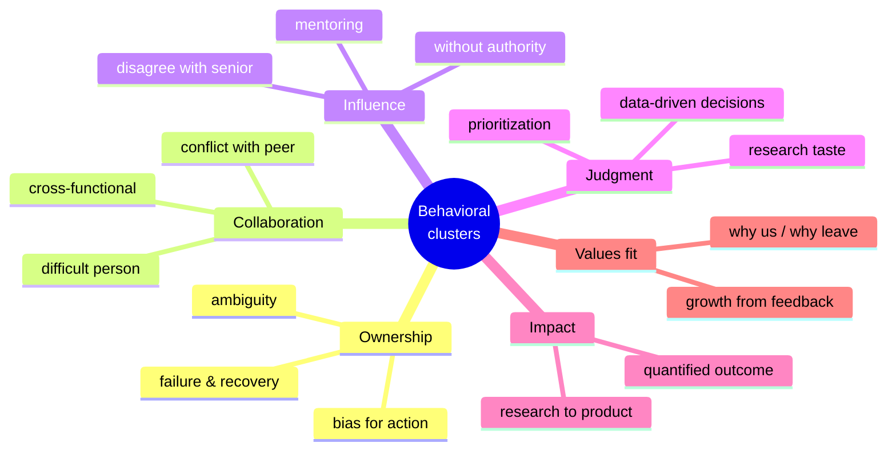
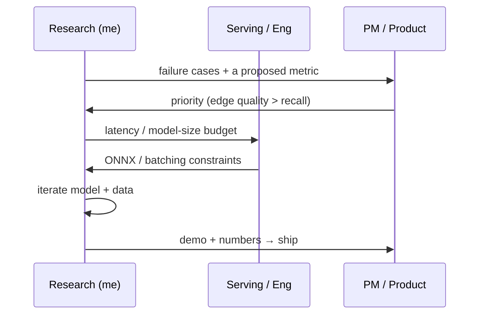

# Common Questions & Answers

question bankwhat they testanswer skeletonscompany signals

> [!TIP] How to use this bank
> Don't memorize scripts — memorize **what each question tests** and **which story from your [matrix](#/behavioral/star) fires**. Then cut it live with STAR-L. Every question below lists (1) the underlying signal, (2) a skeleton, and (3) a company-signal note so you can re-frame the same story for the org in front of you.

These group into six competency clusters. Interviewers rarely ask them by the textbook name — they ask *"tell me about a time…"* and you must recognize which cluster it targets.

## Cluster 1 — Ownership

"Tell me about a time you failed."

**Tests:** honesty, self-awareness, and whether you run a *diagnose → pivot → learn* loop (not blame).

**Skeleton:** pick a real, bounded failure you owned → how you *diagnosed* it (evidence, not vibes) → the pivot decision and its timing → the eventual result → one crisp lesson. Land on **ownership**, never on someone else.

**Story:** ZIM's early "just tweak the SAM head" approach failing on alpha boundaries; re-diagnosing that the bottleneck was data + loss, not the decoder; pivoting; ending at the ICCV Highlight.

**Signal notes:** *Amazon-style* — this is **Dive Deep** + **Ownership**; quantify the pivot ("~N weeks in, I stopped and re-ran the ablation"). *Microsoft* — frame as **growth mindset**, lead with the learning. *NVIDIA* — intellectual honesty: state plainly what you got wrong.

"Describe a time you worked with completely ambiguous requirements."

**Tests:** can you convert vagueness into a measurable problem without being told to? Core RS skill.

**Skeleton:** the vague ask → the *first move* (define a metric + constraint) → aligning stakeholders on that definition → iterate → result.

**Story:** "make edits look nicer" (CLOVA-X) or "good, fast on a phone" (on-device) with no metric → *I* proposed the eval set and the latency/quality bar.

**Signal notes:** *Meta* — pair with "ownership when requirements are blank." *Apple* — emphasize the real-world constraint (on-device, battery, privacy). *Mistral* — "I cut the scope to data curation and pipeline first," matching their ship-without-roadmap culture.

"Tell me about a time you took initiative / shipped something nobody asked for."

**Tests:** bias for action, ownership beyond your mandate.

**Skeleton:** gap you noticed → why it mattered → what you built without being told → adoption.

**Story:** independently building the on-device human-segmentation model and its ONNX serving path; or turning the foreground model into a reusable internal API that beat commercial alternatives.

**Signal notes:** *Amazon* — **Bias for Action** + **Deliver Results**. *ByteDance* — velocity and OKR-shaped impact.

## Cluster 2 — Collaboration

"Tell me about a conflict with a teammate and how you resolved it."

**Tests:** do you resolve by *evidence and empathy*, or by escalation and ego? Does the relationship survive?

**Skeleton:** the substantive disagreement (not a personality clash) → how you reframed it as a decision rule → the data that settled it → disagree-and-commit → relationship intact.

**Story:** ZIM quality-vs-latency debate with the serving engineer; agreeing on a shared eval set and latency budget up front.

**Signal notes:** *Amazon* — **Have Backbone; Disagree and Commit** + **Earn Trust**. *Meta* — direct communication, low ego. Avoid any story where you "won" by seniority.

"Give an example of strong cross-functional collaboration."

**Tests:** can you translate research into the language of PM/serving/security and move a decision across team boundaries?

**Skeleton:** the other team's goals & vocabulary (SLA, p99, false-accept) → what *you* did to bridge (shared metric, demo, doc) → the joint outcome.

**Story:** ZIM → CLOVA-X (research↔product), foreground-API (research↔serving), FaceSign (research↔security↔product).

**Signal notes:** *Meta / Adobe / NVIDIA* — all explicitly value research→product transfer; lead with the shipped artifact. *Apple* — collaboration with hardware/product *under secrecy*.

"Tell me about working with someone difficult."

**Tests:** empathy, professionalism, whether you can find the legitimate concern behind friction.

**Skeleton:** describe the *behavior* not the person → the underlying interest you uncovered → how you adapted your communication → outcome. Stay generous; never trash-talk.

**Signal notes:** all companies read this as a maturity check. Never name names; abstract confidential context ("a serving engineer," "internal photo service").

## Cluster 3 — Influence & leadership

"Tell me about a time you led without formal authority."

**Tests:** the core RS/AS competency — moving decisions through data, demos, and trust as an IC with no reports.

**Skeleton:** the decision that needed to be made → you had no authority to mandate it → how you built consensus (evidence, prototype, aligning incentives) → the decision went your way → shipped.

**Story:** driving ZIM's architecture/data direction across a serving engineer and a PM as first author, not as a manager.

**Signal notes:** *Microsoft* — leadership-through-influence is required even for non-managers ("Model, Coach, Care"). *Meta* — "earn trust" + quantified impact.

"How do you handle disagreement with a strong senior researcher or your manager?"

**Tests:** backbone *plus* humility; can you push back with evidence and then commit gracefully?

**Skeleton:** the disagreement → you made your case with data / a small pilot → the decision (yours or theirs) → **disagree and commit** → what you'd have measured to know who was right.

**Story:** refusing to ship a "pretty but undeployable" model; or holding a quality bar against a deadline push while conceding a specific ablation.

**Signal notes:** *Amazon* — textbook **Have Backbone; Disagree and Commit**. *NVIDIA* — intellectual honesty about the limits of your own position.

"Tell me about a time you mentored someone."

**Tests:** can you grow others? Meta and Adobe JDs explicitly ask for mentorship.

**Skeleton:** who + their starting point → what you did (weekly 1:1s, helping interpret failed experiments, code review, baseline reproduction) → *their* outcome (first PR, first paper contribution), not yours.

**Story:** onboarding a junior/intern on baseline reproduction and experiment tracking; or your reviewing habit (CVPR/ICCV/NeurIPS/TPAMI) shaping constructive feedback inside the team.

**Signal notes:** measure the *mentee's* growth. "I did the work for them" is an anti-signal.

## Cluster 4 — Judgment & research taste

"Tell me about a research direction you decided to kill."

**Tests:** research taste — can you cut your losses on evidence and reallocate?

**Skeleton:** the promising-looking direction → the signal that it wasn't working (a metric that didn't hold on val, diminishing returns) → the kill decision and its cost → where you redirected effort.

**Story:** "more pseudo-labels kept raising train mIoU but collapsed on val → I pivoted to a data-filtering policy"; or a weak/semi-supervised approach abandoned after ablation.

**Signal notes:** universal RS signal. Emphasize you balanced **novelty vs. impact vs. feasibility**, not sunk cost.

"Describe a decision you made primarily from data."

**Tests:** rigor — controlled comparison over intuition or politics.

**Skeleton:** two competing designs + team split → you defined the primary metric and a fair comparison (same seed/split) *before* running → the number settled it → emotional debate ended.

**Story:** an ablation on a shared split resolving a design argument on ZIM / PointWSSIS.

**Signal notes:** *Amazon* — **Dive Deep**. Have the δ ready ("X improved by ~N points without hurting Y").

"How do you prioritize when everything is urgent?"

**Tests:** judgment under load; do you use a framework or just work weekends?

**Skeleton:** the competing demands → the *criterion* you used (impact × reversibility, or blocking-others-first) → what you **deliberately deferred** and why → renegotiating expectations with PM/advisor.

**Story:** conference deadline + product timeline while full-time + part-time PhD — talk *priority matrix and scope-cutting*, not heroics.

**Signal notes:** *ByteDance / Meta* — velocity, but show the deferral was a *decision*. Don't glorify all-nighters.

## Cluster 5 — Impact & delivery

"Tell me about your most impactful project."

**Tests:** can you tell significance-first (problem → outcome), and is the impact real and measured?

**Skeleton:** why the problem mattered → your specific contribution → the quantified scientific *and* product result. Lead with impact, backfill method only if they dig.

**Story:** ZIM — Highlight + open-source + shipped in CLOVA-X to millions; beat commercial APIs internally.

**Signal notes:** this is the bridge into the [job talk](#/research/job-talk). Keep I-vs-we razor-sharp.

"Tell me about transferring research into production."

**Tests:** the RS→AS differentiator — do you understand serving, latency, and product constraints?

**Skeleton:** research result → the gap to production (latency, robustness, edge cases) → what you changed (distillation, ONNX, data curation) → shipped + adoption.

**Story:** ZIM → CLOVA-X; on-device seg → ~10 ms ONNX serving; foreground-API beating Photoroom/Remove.bg/Adobe.

**Signal notes:** *Adobe / Meta / NVIDIA / Apple* all weight this heavily. For Apple, foreground the on-device/privacy constraint.

## Cluster 6 — Values & fit

"Why this company / why leave your current role?"

**Tests:** genuine motivation and whether you did the reading.

**Skeleton:** pull (70%) not push (30%) → cite a real public paper/product of theirs → the lever you'd pull day one. Never comp-only, never blame your current team.

**Signal notes:** covered in depth in the [HM screen chapter](#/process/recruiter-hm) and [Questions to Ask Them](#/playbook/questions-to-ask). Have one honest *"I admired ___ because ___"* per target org.

"Tell me about critical feedback you received."

**Tests:** growth mindset, ego strength.

**Skeleton:** the feedback (specific, slightly unflattering) → your honest first reaction → what you changed → the improved outcome.

**Story:** paper reviews forcing a sharper ablation; a manager noting you over-scoped; feedback that shaped how you now define evals early.

**Signal notes:** *Microsoft* — **growth mindset** is the whole game here. Show behavior change, not just acceptance.

## Company-signal quick map

| Company | Behavioral flavor | Lead your stories with |
| --- | --- | --- |
| **Amazon-style LP** | Explicit LPs; STAR + hard numbers | Ownership, Dive Deep, Disagree & Commit, quantified results |
| **Meta** | Move fast, ownership in ambiguity, direct comms; PhD interviewer probes trajectory | research→product velocity, quantified impact, low ego |
| **Apple** | Collaboration under **secrecy**, product craft, on-device/privacy | discretion, shipping under constraints; don't speculate on unreleased products |
| **Microsoft / MSR** | Growth mindset, **Model/Coach/Care**, One Microsoft | learning from failure, mentoring, cross-org influence |
| **NVIDIA** | Intellectual honesty, One Team, "mission is the boss" | admit what you don't know; systems/GPU pragmatism |
| **Adobe** | Publication-friendly + product sense | research that shipped to a creative product; mentorship |
| **ByteDance Seed** | Fast, OKR-driven, output-oriented | velocity, ambiguity, cross-timezone ownership |
| **Mistral** | Low-ego, clean code, "why Mistral not a US lab" | ship-without-roadmap, open-weights conviction, EN+KR |

> [!DANGER] Cross-cutting anti-signals
> "I never failed" · blaming teammates/advisor · all-"we" so your role is invisible · no numbers · a grievance monologue about your current employer · speculating about a company's unreleased products (fatal at Apple). See [Common Mistakes](#/playbook/mistakes).

## Follow-ups you should expect on *any* answer

- *"What did **you** do, specifically?"* — the I-vs-we probe. Always pre-loaded.
- *"What would you do differently?"* — a real change + reason.
- *"How did the other person feel about it?"* — relationship survived?
- *"What was the measurable result?"* — never leave a story without a number.
- *"Why that choice and not the alternative?"* — the trade-off you rejected.

## Cheat-sheet

| Cluster | Flagship story | The signal |
| --- | --- | --- |
| Ownership | ZIM failure→pivot; on-device initiative | diagnose→pivot→learn; bias for action |
| Collaboration | ZIM quality-vs-latency conflict; CLOVA-X | evidence over ego; cross-functional bridging |
| Influence | led ZIM w/o authority; mentoring | move decisions via data & trust |
| Judgment | killed a pseudo-label direction; ablation | research taste; data over intuition |
| Impact | ZIM shipped to millions; beat commercial APIs | significance-first, quantified |
| Values | why-us pull 70/30; feedback→change | genuine motivation, growth mindset |

**Related:** [STAR & The Story Bank](#/behavioral/star) · [Recruiter & HM Screens](#/process/recruiter-hm) · [Company Playbooks](#/process/companies) · [The Research Job Talk](#/research/job-talk) · [Questions to Ask Them](#/playbook/questions-to-ask) · [Common Mistakes & Red Flags](#/playbook/mistakes) · [Your CV → Interview Map](#/resume/overview)
