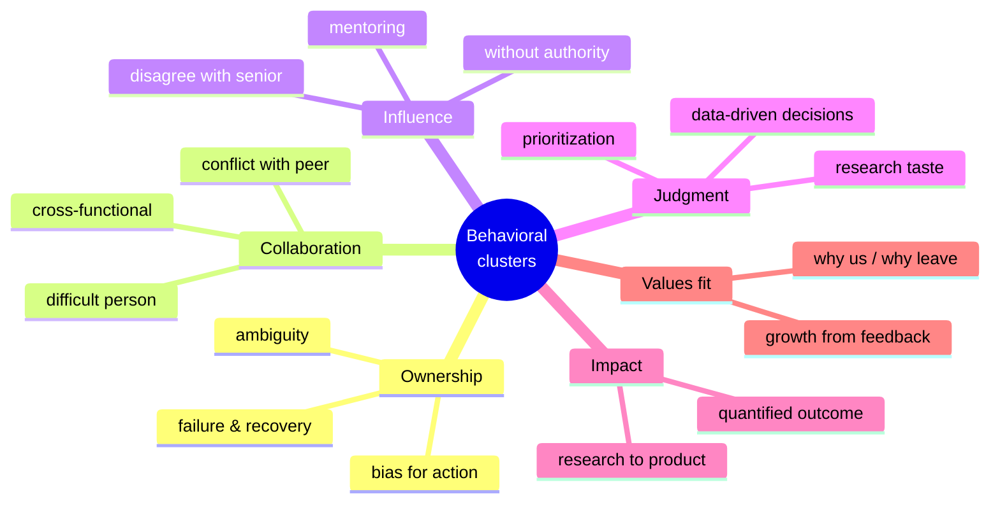
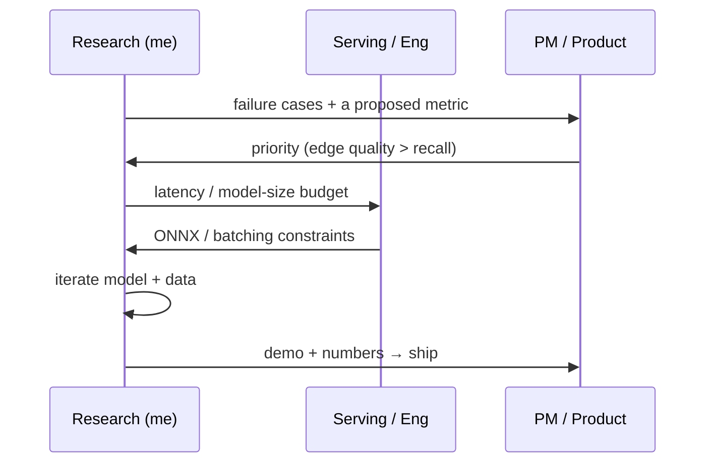

# Common Questions & Answers

question bankwhat they testanswer skeletonsrole-specific prompts

> [!TIP] How to use this bank
> Don't memorize scripts. Identify **what each question tests**, choose a verified experience from your [story matrix](#/behavioral/star), and structure it with STAR-L. The notes below show how to choose emphasis from the current job posting, official values, and a recruiter-confirmed rubric—not from company stereotypes.

> [!WARNING] Personal-story labels are unverified candidates
> The `personal packet candidate` entries below are routing hints inferred from the résumé. Do not invent a conflict, failure, or decision you did not experience. Confirm what internal metrics, customers, and colleague information you may disclose, and revalidate company-specific signals against the current job description, official values, and recruiter guidance.

These group into six competency clusters. Interviewers rarely ask them by the textbook name — they ask *"tell me about a time…"* and you must recognize which cluster it targets.

## Cluster 1 — Ownership

"Tell me about a time you failed."

**Tests:** honesty, self-awareness, and whether you run a *diagnose → pivot → learn* loop (not blame).

**Skeleton:** pick a real, bounded failure you owned → how you *diagnosed* it (evidence, not vibes) → the pivot decision and its timing → the eventual result → one crisp lesson. Land on **ownership**, never on someone else.

→ **Personal packet candidate:** if the initial failure is confirmed, ZIM's hypothesis → disconfirmation → pivot; otherwise, use a failure you have documented. See [STAR & The Story Bank](#/behavioral/star).

**Role-specific adjustment:** if the posting or official rubric emphasizes ownership, deep dives, or growth, foreground the timing of the pivot, the diagnostic evidence, and how your behavior changed afterward. Do not force unverified company language onto the story.

"Describe a time you worked with completely ambiguous requirements."

**Tests:** can you convert vagueness into a measurable problem without being told to? Core RS skill.

**Skeleton:** the vague ask → the *first move* (define a metric + constraint) → aligning stakeholders on that definition → iterate → result.

→ **Personal packet candidate:** a CLOVA-X or on-device evaluation-definition example whose actual requirements and your ownership have been confirmed. See [STAR & The Story Bank](#/behavioral/star).

**Role-specific adjustment:** if the JD explicitly mentions on-device work, privacy, or rapid iteration, emphasize the constraints you actually handled and the evidence for narrowing the scope. Do not reshape events around an assumed company culture.

"Tell me about a time you took initiative / shipped something nobody asked for."

**Tests:** bias for action, ownership beyond your mandate.

**Skeleton:** gap you noticed → why it mattered → what you built without being told → adoption.

→ **Personal packet candidate:** the scope you proposed and owned end to end in the on-device human-segmentation/ONNX or foreground-API work. See [STAR & The Story Bank](#/behavioral/star).

**Role-specific adjustment:** when the official evaluation criteria emphasize initiative or delivery, make the gap you found, the portion you could safely start without approval, and the adoption outcome explicit.

## Cluster 2 — Collaboration

"Tell me about a conflict with a teammate and how you resolved it."

**Tests:** do you resolve by *evidence and empathy*, or by escalation and ego? Does the relationship survive?

**Skeleton:** the substantive disagreement (not a personality clash) → how you reframed it as a decision rule → the data that settled it → disagree-and-commit → relationship intact.

→ **Personal packet candidate:** a quality↔latency trade-off whose actual relationship and decision are confirmed. If there was no conflict, do not force ZIM into this prompt.

**Role-specific adjustment:** if the rubric explicitly names disagreement or trust, separate the evidence you presented before the decision from your execution after it. Avoid any story where you "won" by seniority.

"Give an example of strong cross-functional collaboration."

**Tests:** can you translate research into the language of PM/serving/security and move a decision across team boundaries?

**Skeleton:** the other team's goals & vocabulary (SLA, p99, false-accept) → what *you* did to bridge (shared metric, demo, doc) → the joint outcome.

→ **Personal packet candidate:** among ZIM→CLOVA-X, the foreground API, and FaceSign, choose an example where you can accurately separate your role from the other team's role.

**Role-specific adjustment:** if the JD mentions research-to-product transfer, hardware, or privacy, explain which metric or artifact you used to translate the other team's constraints. Do not infer confidentiality from a company's reputation; follow the disclosure boundary that actually applies.

"Tell me about working with someone difficult."

**Tests:** empathy, professionalism, whether you can find the legitimate concern behind friction.

**Skeleton:** describe the *behavior* not the person → the underlying interest you uncovered → how you adapted your communication → outcome. Stay generous; never trash-talk.

**Role-specific adjustment:** this question likely probes collaboration maturity. Omit unnecessary names and confidential context; describe roles, behavior, and underlying interests instead.

## Cluster 3 — Influence & leadership

"Tell me about a time you led without formal authority."

**Tests:** the core RS/AS competency — moving decisions through data, demos, and trust as an IC with no reports.

**Skeleton:** the decision that needed to be made → you had no authority to mandate it → how you built consensus (evidence, prototype, aligning incentives) → the decision went your way → shipped.

→ **Personal packet candidate:** an architecture, data, or collaboration decision you actually drove on ZIM. Do not infer product leadership from first-author status alone.

**Role-specific adjustment:** if the role explicitly calls for IC leadership or influence, foreground how evidence, a prototype, and consensus—not your title—moved the decision.

"How do you handle disagreement with a strong senior researcher or your manager?"

**Tests:** backbone *plus* humility; can you push back with evidence and then commit gracefully?

**Skeleton:** the disagreement → you made your case with data / a small pilot → the decision (yours or theirs) → **disagree and commit** → what you'd have measured to know who was right.

→ **Personal packet candidate:** an actual example where you raised a dissenting view and committed after the decision. Confirm who made which decision.

**Role-specific adjustment:** if the official rubric emphasizes constructive disagreement or judgment, cover the basis for your objection, the uncertainty in your own view, and your commitment after the final decision.

"Tell me about a time you mentored someone."

**Tests:** can you grow others and turn your knowledge into team capability? Check the target role's JD for how heavily it weighs mentorship.

**Skeleton:** who + their starting point → what you did (weekly 1:1s, helping interpret failed experiments, code review, baseline reproduction) → *their* outcome (first PR, first paper contribution), not yours.

→ **Personal packet candidate:** an onboarding or review example where you can verify the mentee's starting point, your actions, and the mentee's outcome.

**Signal notes:** measure the *mentee's* growth. "I did the work for them" is an anti-signal.

## Cluster 4 — Judgment & research taste

"Tell me about a research direction you decided to kill."

**Tests:** research taste — can you cut your losses on evidence and reallocate?

**Skeleton:** the promising-looking direction → the signal that it wasn't working (a metric that didn't hold on val, diminishing returns) → the kill decision and its cost → where you redirected effort.

→ **Personal packet candidate:** a discontinued weak/semi-supervised direction—or another research bet—that you can explain from actual experiment logs.

**Signal notes:** universal RS signal. Emphasize you balanced **novelty vs. impact vs. feasibility**, not sunk cost.

"Describe a decision you made primarily from data."

**Tests:** rigor — controlled comparison over intuition or politics.

**Skeleton:** two competing designs + team split → you defined the primary metric and a fair comparison (same seed/split) *before* running → the number settled it → emotional debate ended.

→ **Personal packet candidate:** an ablation from ZIM or PointWSSIS for which you can explain both the comparison conditions and the effect on the decision.

**Role-specific adjustment:** if the role explicitly emphasizes rigor or deep dives, prepare the comparison protocol and the delta that changed the decision. Do not invent a number you cannot disclose.

"How do you prioritize when everything is urgent?"

**Tests:** judgment under load; do you use a framework or just work weekends?

**Skeleton:** the competing demands → the *criterion* you used (impact × reversibility, or blocking-others-first) → what you **deliberately deferred** and why → renegotiating expectations with PM/advisor.

→ **Personal packet candidate:** a real example of deliberately reducing scope and renegotiating expectations while balancing full-time work with a part-time PhD. Avoid all-nighter heroics.

**Role-specific adjustment:** even for a role that emphasizes speed or execution, show what you deliberately deferred and how you communicated the risk. Do not use all-nighters as evidence of judgment.

## Cluster 5 — Impact & delivery

"Tell me about your most impactful project."

**Tests:** can you tell significance-first (problem → outcome), and is the impact real and measured?

**Skeleton:** why the problem mattered → your specific contribution → the quantified scientific *and* product result. Lead with impact, backfill method only if they dig.

→ **Personal packet candidate:** ZIM's public Highlight, open-source release, and product integration. Use user counts and internal comparisons only in approved wording.

**Signal notes:** this is the bridge into the [job talk](#/research/job-talk). Keep I-vs-we razor-sharp.

"Tell me about transferring research into production."

**Tests:** the RS→AS differentiator — do you understand serving, latency, and product constraints?

**Skeleton:** research result → the gap to production (latency, robustness, edge cases) → what you changed (distillation, ONNX, data curation) → shipped + adoption.

→ **Personal packet candidate:** the ZIM product integration or the on-device ~10 ms/ONNX example. Use internal competitor comparisons only if disclosure is authorized.

**Role-specific adjustment:** when the JD explicitly mentions productization, serving, on-device work, or privacy, connect only the constraints you actually handled. Do not infer evaluation weights from the company name alone.

## Cluster 6 — Values & fit

"Why this company / why leave your current role?"

**Tests:** genuine motivation and whether you did the reading.

**Skeleton:** center specific reasons that draw you toward the target organization rather than blaming your current team → cite a recent official paper, product, or JD → connect your evidence to a hypothesis about how you could contribute. Treat ratios such as `30/70` as rehearsal intuition, not a rule.

**Signal notes:** covered in depth in the [HM screen chapter](#/process/recruiter-hm) and [Questions to Ask Them](#/playbook/questions-to-ask). Have one honest *"I admired ___ because ___"* per target org.

"Tell me about critical feedback you received."

**Tests:** growth mindset, ego strength.

**Skeleton:** the feedback (specific, slightly unflattering) → your honest first reaction → what you changed → the improved outcome.

→ **Personal packet candidate:** an example with feedback you actually received and an observable change in your behavior afterward.

**Role-specific adjustment:** if growth or learning appears in the official criteria, show the observable behavior change after the feedback, not merely that you accepted it.

## How to tailor by company

For every application, create a dated four-column table: `wording from the official values/JD → competency confirmed for this loop → my verified story → uncertainty to ask about`. See the [company-research playbook](#/process/companies) for the research and verification process and [STAR & The Story Bank](#/behavioral/star) for story construction.

> [!DANGER] Cross-cutting anti-signals
> "I never failed" · blaming teammates or your advisor · using only "we" so your role is invisible · no verifiable outcome · a grievance monologue about your current employer · speculating about a target company's unreleased products. See [Common Mistakes](#/playbook/mistakes).

## Follow-ups you should expect on *any* answer

- *"What did **you** do, specifically?"* — the I-vs-we probe. Always pre-loaded.
- *"What would you do differently?"* — a real change + reason.
- *"How did the other person feel about it?"* — relationship survived?
- *"What was the measurable result?"* — if you have a disclosable number, give it with the protocol; otherwise use an observable artifact, decision, or learning outcome.
- *"Why that choice and not the alternative?"* — the trade-off you rejected.

## Cheat-sheet

| Cluster | Flagship story | The signal |
| --- | --- | --- |
| Ownership | verified failure→diagnosis→pivot example | own the decision and learning without blaming others |
| Collaboration | actual quality-vs-constraint disagreement; cross-functional launch | evidence over ego; translate the other team's goals |
| Influence | moved a direction without authority; mentorship | move decisions through data, prototypes, and trust |
| Judgment | discontinued research bet; fair ablation | evidence over intuition; avoid sunk cost |
| Impact | disclosable research→product outcome | significance first; evidence with its protocol |
| Values | evidence-based why-us; feedback→change | genuine motivation; growth mindset |

**Related:** [STAR & The Story Bank](#/behavioral/star) · [Résumé-Based Answers by Interview Stage](#/resume/interview-stage-answers) · [Recruiter & HM Screens](#/process/recruiter-hm) · [Company Playbooks](#/process/companies) · [The Research Job Talk](#/research/job-talk) · [Questions to Ask Them](#/playbook/questions-to-ask) · [Common Mistakes & Red Flags](#/playbook/mistakes) · [Your CV → Interview Map](#/resume/overview)
