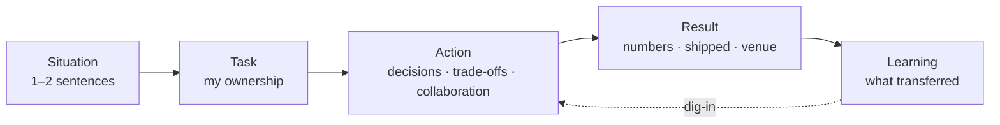
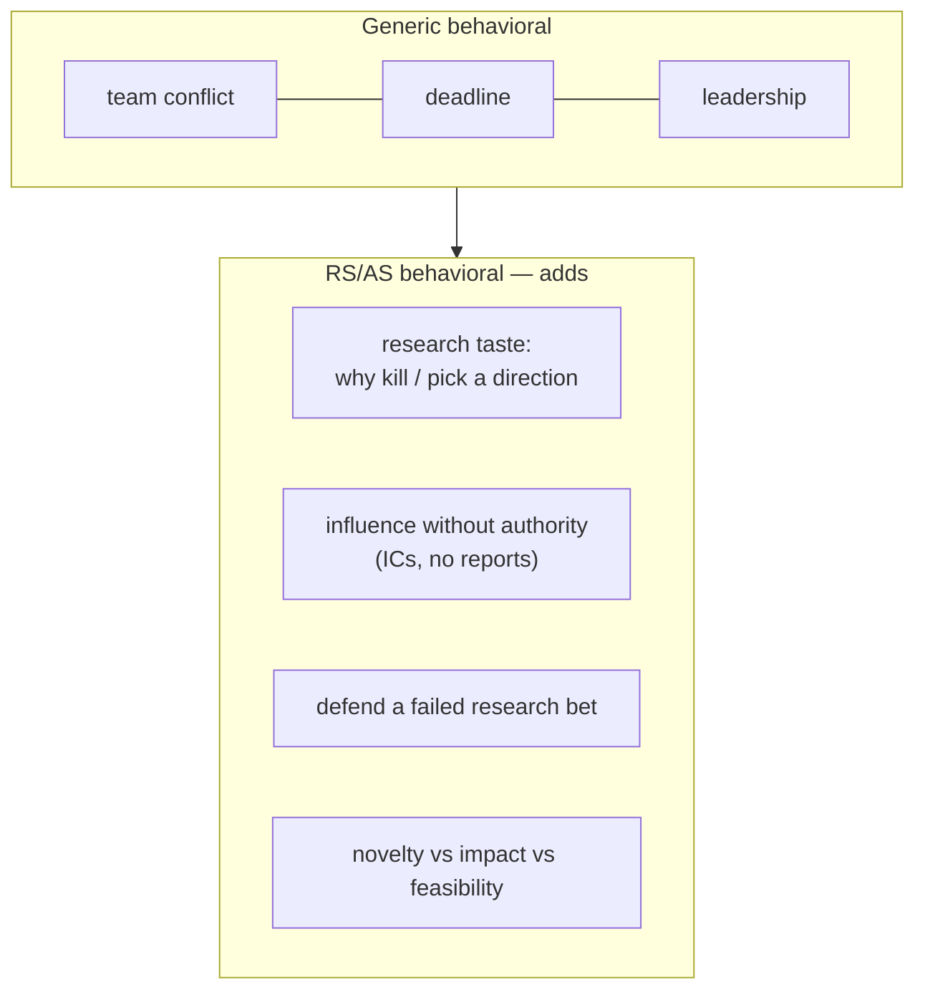

# STAR & The Story Bank

<div class="tag-row"><span class="tag">STAR / STAR-L</span><span class="tag">story bank matrix</span><span class="tag">I vs we</span><span class="tag">quantifying impact</span><span class="tag">research-scientist behavioral</span></div>

> [!TIP] 이것부터 말하세요
> behavioral 라운드는 **연기 시험이 아니라, 당신의 이력서를 구조적으로 깊게 파고드는 자리**입니다. 면접관은 과거 행동을 근거로 앞으로의 협업, ownership, 판단력을 예측합니다. 당신이 할 일은 그 예측을 *쉽게* 만들어주는 것입니다. 적절한 story를 고르고, STAR로 잘라내고, 결과를 정량화하고, *당신의* 기여를 모호하지 않게 드러내세요. story bank를 한 번 제대로 준비해두면 같은 재료를 다시 잘라내는 것만으로 거의 모든 질문에 답할 수 있습니다.

behavioral은 RS/AS에서 형식적인 절차가 아니라 실질적인 관문 라운드입니다. 시니어 레벨에서는 [HM 스크리닝](#/process/recruiter-hm)이나 [job talk](#/research/job-talk)과 섞이고, Meta에서는 종종 PhD 면접관이 당신의 *research trajectory*를 파고들며 가치관을 함께 확인합니다. 뛰어난 후보라도 구체적인 결과가 없거나, 회고가 없거나, 기여가 가려져 있으면 no-hire를 받습니다. [Common Mistakes](#/playbook/mistakes)를 참고하세요.

## STAR, 그리고 과학자가 STAR-L을 써야 하는 이유

**STAR = Situation → Task → Action → Result.** research 후보라면 여기에 **L(Learning)** — 명시적인 회고 단계 — 를 추가하세요. 이는 성장 마인드셋을 보여주고, 실패조차 생산적인 loop으로 재구성해줍니다. 이것이 바로 패널이 찾는 "research taste"입니다.

| Slot | 담는 내용 | 시간 (약 2~3분 답변 기준) | 피해야 할 함정 |
| --- | --- | --- | --- |
| **S**ituation | 맥락, 제약, 이해관계자 | 15~20% | 상황 설명에 1분을 쓰지 말 것. 한두 문장이면 충분 |
| **T**ask | *당신의* 책임과 목표 | 10% | "팀이 마주한 것"과 "내가 맡은 것"을 분리 |
| **A**ction | 구체적 결정, trade-off, 협업 | **50~60%** | 여기가 답의 핵심. 무엇을 했는지가 아니라 *왜* 골랐는지를 말할 것 |
| **R**esult | 정량화된 결과 + 비즈니스/과학적 impact | 15~20% | 항상 숫자나 출시된 결과물로 착지 |
| **L**earning | 다르게 했을 것, 무엇이 전이됐는지 | 5~10% | 고백이 아니라 한 문장으로 깔끔하게 |



> [!WARNING] 1순위 실패 요인: Situation을 앞에 몰아넣기
> PhD는 뉘앙스와 단서 조건을 앞세우도록 훈련받습니다. 하지만 면접은 **명확한 결정과 측정 가능한 결과**에 보상을 줍니다. 답변의 40%가 맥락이라면 signal을 묻어버린 것입니다. 시계를 놓고 연습하세요. Action이 가장 긴 slot이 아니라면 다시 잘라내야 합니다.

### 세 가지 길이 — 라운드에 맞추세요

- **60~90초 (스크리닝 / 워밍업):** S+T를 한 문장으로 → Action 2~3개 → Result 한 문장.
- **2~3분 (온사이트 behavioral):** 완전한 STAR-L, Action을 순서 있는 beat으로 확장.
- **5분 이상 (dig-in / Jam):** 면접관이 파고듭니다. 숫자, 당신이 기각한 대안, 갈등의 세부사항을 *미리 장전*해서 절대 멈칫하지 않도록.

## "I" vs "we" —가장 많이 채점되는 단 하나의 습관

패널은 **당신이 한 것과 팀이 한 것**을 분리하려고 명시적으로 노력합니다. "we"를 남용하는 것은 research 직군에서 문서화된 탈락 사유입니다. 패널이 당신을 채점할 방법 자체가 없어지기 때문입니다. 하지만 반대로 전부 "I"로 몰아가면 자기중심적이고 협업이 부족하다는 인상을 줍니다.

> [!EXAMPLE] 균형 잡기
> **"we"**로 공동의 목표를 설정하고 협업자에게 공을 돌린 뒤, 당신이 맡은 모든 결정에서는 **"I"로 전환**하세요.
> - ✗ "We improved the matting quality and shipped it."
> - ✓ "The team's goal was production-grade matting. *I* owned the architecture, the loss design, and the data pipeline. *I* decided to... My collaborators handled serving and the demo."

유용한 비율: *설정과 공로*에는 "we", *Action 동사*에는 "I". 면접관이 그래도 "그래서 **당신은** 뭘 했나요?"라고 묻는다면, 당신의 컷이 너무 무른 것입니다. 이것이 라운드 전체에서 가장 흔한 후속 질문입니다.

## impact 정량화 (RS/AS 버전)

숫자는 주장을 증거로 바꿉니다. research 후보는 대부분의 사람보다 풍부한 지표를 가지고 있으니 활용하세요.

<dl class="kv">
<dt>Scientific</dt><dd>venue + 경쟁률 (ICCV Highlight ≈ 상위 3%), 지표 delta (mIoU / mAP / alpha-matte error), ablation 크기, dataset 규모 (~100만 장).</dd>
<dt>Product</dt><dd>latency (mobile CPU에서 ~10 ms), 모델 크기, p99, 도달한 사용자 수 ("수백만 명이 사용"), 정면 승부 승리 (내부적으로 Photoroom / Remove.bg / Adobe를 능가).</dd>
<dt>Process</dt><dd>pivot까지 걸린 시간, 투입한 GPU/주 수, 리뷰 반환 시간, 멘티 온보딩 시간.</dd>
</dl>

> [!TIP] 정확한 숫자가 기억나지 않을 때
> 절대 지어내지 마세요. 이렇게 말하세요. *"정확한 수치는 기억나지 않지만, 자릿수로는 대략 X 정도였고, 정확한 숫자는 이후에 확인해서 알려드리겠습니다."* 여기서의 정직함 자체가 채점되는 signal입니다 (NVIDIA는 이를 *intellectual honesty*라고 부릅니다).

## Story Bank Matrix

**6~8개의 story**를 준비해서, 다시 잘라 쓰는 것만으로 모든 역량을 커버하세요. 행 = 면접관이 파고드는 역량이며, 같은 프로젝트가 여러 칸을 채울 수 있습니다. 이걸 한 번 채우고 각각을 90초 녹음으로 리허설해두면 거의 모든 질문에 대비된 것입니다.

| 역량 (무엇을 시험하는가) | 주력 story | 백업 | 착지시킬 핵심 숫자 |
| --- | --- | --- | --- |
| **동료와의 갈등 / 의견 충돌** | ZIM: matting 품질 vs. inference latency & 배포 비용 | Foreground-API: research mIoU vs. product edge 품질 KPI | 공유 eval set에 대한 합의된 결정 규칙 |
| **실패 / 좌절** | ZIM 초기 접근 ("SAM head만 손보면 된다")이 alpha boundary에서 실패 → 재진단 → pivot | SSUL / continual: catastrophic forgetting 급증 | pivot까지의 주 수, 최종 Highlight |
| **리더십 / 권한 없는 영향력** | ZIM을 1저자 겸 프로젝트 오너로 끝까지 주도 | 주니어 멘토링, CVPR/ICCV/NeurIPS 리뷰어 | 멘티의 첫 PR/논문, ICCV Highlight |
| **모호함** | "편집을 더 예쁘게" (CLOVA-X)에 지표가 없었음 → 내가 eval을 정의 | Grounded-VLM 범위: 먼저 data + pipeline으로 축소 | *내가* 제안한 proxy 지표 |
| **impact / research → product** | ZIM → CLOVA-X Image Editing (DAN 24 발표) | On-device seg → ONNX serving, FaceSign 출시 | 도달한 사용자 수, ~10 ms, 정면 승부 승리 |
| **매니저 / 시니어와의 의견 충돌** | "예쁘지만 배포 불가한" 모델을 거절, disagree-and-commit | 마감: 제출을 맞추기 위해 ablation 하나를 잘라냄 | 무엇을 양보했고, 무엇을 지켰는지 |
| **데이터 기반 의사결정** | 공유 split에서의 ablation이 설계 논쟁을 종결 | "pseudo-label을 더 많이"가 val을 떨어뜨림 → data filtering pivot | 논쟁을 끝낸 지표 δ |
| **마감 / 우선순위** | 학회 마감 + product 일정, 정규직 + 파트타임 PhD 병행 | 보안 기준 아래에서의 FaceSign 출시 | 무엇을 *의도적으로 미뤘고* 왜 그랬는지 |

> [!NOTE] loop 전에 story를 회사 가치관에 매핑하세요
> 같은 story라도 프레임이 다릅니다. **Amazon 스타일** LP (Ownership, Dive Deep, Have Backbone) → 당신이 맡은 결정으로 시작. **Meta** (move fast, impact, direct communication) → research→product 속도로 시작. **Microsoft** (growth mindset, Model/Coach/Care) → 무엇을 배웠고 어떻게 코칭했는지로 시작. **Apple** → 기밀 속 협업과 product craft. 회사별 프레이밍은 [Common Questions](#/behavioral/questions)를 참고하세요.

## research-scientist behavioral은 무엇이 다른가



- **권한 없는 영향력이 핵심 역량입니다.** 연구자는 직속 부하가 거의 없습니다. 패널은 당신이 직함이 아니라 데이터, demo, 신뢰로 결정을 움직였다는 증거를 원합니다.
- **research 판단력은 behavioral signal입니다.** "Tell me about a direction you killed"는 taste를 시험합니다. *왜* 멈췄고, 어떤 근거였고, novelty vs. impact vs. feasibility를 어떻게 저울질했는지.
- **failure story는 위험한 게 아니라 기대되는 것입니다.** research 경력은 *곧* 실패한 실험의 연속입니다. "저는 실패한 적이 없습니다"는 부정직하거나 야망이 낮다는 인상을 줍니다. 진단→pivot loop을 보여주세요.
- **behavioral은 [job talk](#/research/job-talk)로 번져 들어갑니다.** "'we'라고 했는데 — *당신은* 뭘 했나요?"는 두 라운드 모두의 핵심 질문입니다. 여기서 연습한 I-vs-we 분리가 거기서도 빛을 발합니다.

## 예제 1 — 갈등 / trade-off (ZIM 제품화)

> **질문:** *"기술적 결정에서 동료와 의견이 충돌했던 때를 말해보세요."*

<details class="qa"><summary>완전한 STAR-L 답변 (약 2.5분)</summary>
<div class="qa-body">

**Situation (S):** "SAM 기반으로 만든 promptable zero-shot matting 모델인 ZIM에서, 팀의 목표는 이미지 편집 product를 위한 production 수준의 alpha matte였습니다. serving 엔지니어와 저는 방향을 두고 의견이 갈렸습니다. 저는 머리카락과 반투명 경계를 고치기 위해 더 무거운 decoder와 더 풍부한 training set을 원했고, 그는 라이브 서비스의 inference latency와 배포 복잡도를 걱정했습니다."

**Task (T):** "1저자이자 프로젝트 오너로서 *제가* architecture, loss, data-pipeline 결정을 맡았지만, 그의 serving 제약을 충족하지 못하면 출시할 수 없었습니다. 그래서 진짜 과제는 이걸 연차가 아니라 데이터로 해결하는 것이었습니다."

**Action (A):**
- "먼저 *저는* 논쟁을 의견 대립에서 **결정 규칙**으로 재구성했습니다. 어떤 변경이든 boundary alpha error를 의미 있는 폭으로 개선하되 latency를 product 예산 밖으로 밀어내지 *않아야* 한다는 데 합의했습니다.
- 그다음 *저는* 공유 eval set에서 통제된 ablation을 돌렸습니다. 같은 seed, 같은 split으로 decoder 변경과 data 변경을 분리했습니다.
- *저는* boundary 개선의 대부분이 raw decoder 크기가 아니라 **data pipeline과 loss**에서 온다는 걸 발견했고, 그의 latency 범위 안에서 품질 기준을 맞추는 더 가벼운 architecture를 제안했습니다.
- *저는* 또한 실패 사례 갤러리(머리카락, 유리, 얇은 구조)를 만들어서 PM과 serving이 추상론이 아니라 같은 증거를 놓고 논의하게 했습니다."

**Result (R):** "출시했습니다. ZIM은 **ICCV 2025 Highlight**(상위 ~3%)가 되었고, public demo와 함께 오픈소스로 공개되었으며, 수백만 명이 사용하는 CLOVA-X 이미지 편집 서비스에 통합되었습니다. 내부적으로 matting 품질은 serving 예산 안에 머물면서도 기존 baseline을 우리 eval set에서 능가했습니다."

**Learning (L):** "저는 의견 충돌을 처음부터 *공유된 결정 규칙*으로 전환하는 법을 배웠습니다. 자칫 서열 다툼이 될 뻔한 것을 약 하루 만에 끝냈습니다."

</div></details>

**왜 점수가 잘 나오는가:** 명확한 I-vs-we 분리, 진짜 trade-off(품질 vs. latency), *데이터 기반* 해결, 정량화되고 출시된 결과, 그리고 회고. 이 하나로 갈등, 권한 없는 영향력, research→product를 동시에 답합니다.

## 예제 2 — 모호함 → 측정 가능한 impact (on-device + 교차 팀 API)

> **질문:** *"요구사항이 모호해서 성공의 기준을 직접 정의해야 했던 때를 설명해보세요."*

<details class="qa"><summary>완전한 STAR-L 답변 (약 2분)</summary>
<div class="qa-body">

**S:** "Product 쪽에서 모바일 기능용 on-device human-segmentation 모델을 요청했습니다. 유일한 '스펙'은 '품질 좋고, 폰에서 충분히 빠르게'였고 — 지표도, latency 숫자도, eval set도 없었습니다."

**T:** "*저는* 모델을 끝까지 맡았고, 우선 그것을 측정 가능한 무언가로 바꿔야 했습니다."

**A:**
- "*저는* 엔지니어들과 함께 구체적인 목표를 제안했습니다. mobile CPU에서의 p99 latency 예산과, 제가 실제 product 이미지에서 큐레이션한 작은 내부 eval set에 대한 boundary 품질 기준입니다.
- *저는* serving 쪽과 배포 경로(ONNX 기반 인하우스 serving)를 일찍 맞춰서, GPU proxy가 아니라 *실제* 런타임에 맞춰 최적화했습니다.
- *저는* 그 예산에 맞춰 architecture와 distillation을 반복하며, 그 안에서 품질을 유지하지 못하는 건 무엇이든 잘라냈습니다."

**R:** "*저는* mobile CPU에서 대략 **10 ms inference**로, 빡빡한 연산 예산 아래에서 견고한 품질을 내는 모델을 출시했습니다. 별개로, 제가 구축한 foreground-segmentation 모델과 dataset은 내부 API가 되어 우리 내부 평가에서 **Photoroom, Remove.bg, Adobe를 능가**했습니다."

**L:** "교훈은 이렇습니다. 요청이 모호할 때 가장 레버리지 큰 첫 수는 *지표와 배포 제약을 정의하는 것*입니다. 그 정렬이 어떤 모델링 기교보다 더 큰 효과를 냈습니다."

</div></details>

## 비원어민을 위한 영어 템플릿

이 후보는 한국어 원어민이자 업무용 영어 구사자입니다. 목표는 완벽한 문법이 아니라 **들리는 구조**입니다. 한 문장에 한 아이디어, 주어 = "I", 단순 과거시제, connector로 이정표 삼기.

```text
Situation: In [year/project], the team faced [constraint].
Task:      I was responsible for [ownership].
Action:    First, I [1]. Then I [2]. I also aligned with [role] by [3].
Result:    We achieved [metric / venue / shipped feature]. 
Learning:  I learned [one lesson].
```

안전한 connector 세트: *First / Then / After that* · *The trade-off was…* · *I decided to… because…* · *Looking back, I would…*. filler(*um, like, kind of, you know*)는 잘라내세요. filler보다는 0.5초의 침묵이 낫습니다. 전달에 관한 더 많은 내용은 [Communication & Whiteboarding](#/playbook/communication)에 있습니다.

## 후속 질문 (더 날카로운 두 번째 질문들)

- *"'we'를 많이 썼는데 — 구체적으로 **당신은** 뭘 했나요?"* → 깔끔한 결정 목록을 준비해두세요 (ZIM에서의 architecture / loss / data-pipeline).
- *"왜 X를 안 해봤나요?"* → "X도 고려했습니다. 위험은 ___이었습니다. latency 예산을 고려해 ___일 동안 파일럿했는데 ___에서 성능이 떨어져서 Y로 확정했습니다."
- *"무엇을 다르게 하겠나요?"* → 이유가 있는 진짜 변화여야지, 겸손을 가장한 자랑이면 안 됩니다 ("eval set을 일주일 더 일찍 정의했을 겁니다").
- *"상대방은 어떻게 반응했나요?"* → 관계가 유지됐음을 보여주세요. 이견을 내고, 근거로 결정하고, commit하고, 계속 협업자로 남았다.

## 치트시트

| 질문 | 한 줄 답 |
| --- | --- |
| 프레임워크 | STAR-**L** — Learning 추가, 과학자는 회고로 채점됨 |
| 시간 배분 | Action = 50~60%, Situation ≤ 20%, 항상 Result 숫자로 착지 |
| I vs we | 목표 + 공로에는 "we", 모든 결정 동사에는 "I" |
| story bank | 6~8개 story × 역량 matrix, 각각 90초 오디오로 리허설 |
| 핵심 RS 역량 | **권한 없는** 영향력, research taste (왜 방향을 접었는지) |
| failure story | 위험이 아니라 기대되는 것 — 진단 → pivot → 학습을 보여줄 것 |
| 숫자가 기억 안 날 때 | 자릿수 + 이후 확인 제안, 절대 지어내지 말 것 |
| 회사별 | *같은* story를 Amazon LP / Meta / MSFT / Apple 가치관으로 재구성 |
| 최대 자책골 | 맥락을 앞에 몰아넣기, "저는 실패한 적 없어요", 남 탓하기 |

**관련:** [Common Questions & Answers](#/behavioral/questions) · [Recruiter & HM Screens](#/process/recruiter-hm) · [The Research Job Talk](#/research/job-talk) · [Failure & Negative Results](#/research/failure) · [Communication & Whiteboarding](#/playbook/communication) · [Common Mistakes & Red Flags](#/playbook/mistakes) · [Your CV → Interview Map](#/resume/overview) · [Deep-Dive: ZIM](#/resume/zim)
