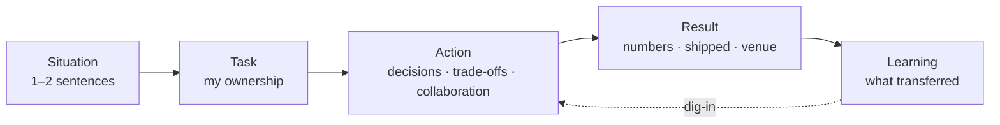
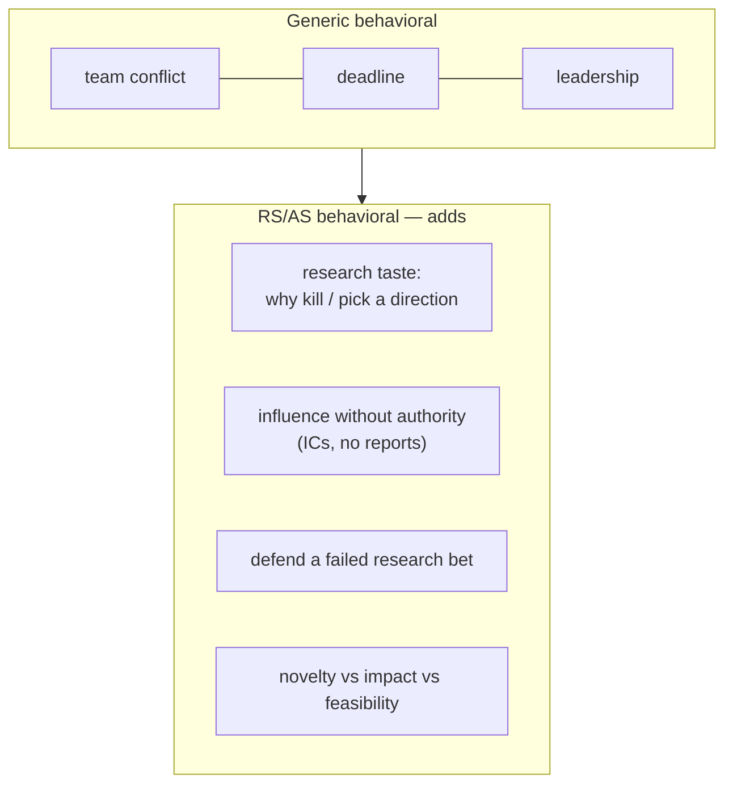

# STAR & The Story Bank

<div class="tag-row"><span class="tag">STAR / STAR-L</span><span class="tag">story bank matrix</span><span class="tag">I vs we</span><span class="tag">quantifying impact</span><span class="tag">research-scientist behavioral</span></div>

> [!TIP] 이것부터 말하세요
> behavioral 라운드는 <strong>연기 시험이 아니라, 과거 행동을 근거로 협업·ownership·판단력을 확인하는 자리</strong>입니다. 적절한 story를 고르고, STAR로 잘라내고, 공개 가능한 결과와 *당신의* 기여를 모호하지 않게 드러내세요. 검증된 story bank를 준비하면 같은 경험을 질문 의도에 맞게 다시 구성할 수 있습니다.

behavioral은 RS/AS에서도 실질적인 평가 축입니다. 시니어 role에서는 [HM 스크리닝](#/process/recruiter-hm)이나 [job talk](#/research/job-talk)의 follow-up으로 research trajectory·판단·협업을 함께 확인하기도 합니다. 구체적인 결과가 없거나, 회고가 없거나, 기여가 가려져 있으면 기술력이 강해도 signal을 주기 어렵습니다. [Common Mistakes](#/playbook/mistakes)를 참고하세요.

## STAR, 그리고 과학자가 STAR-L을 써야 하는 이유

**STAR = Situation → Task → Action → Result.** research 후보라면 여기에 **L(Learning)** — 명시적인 회고 단계 — 를 추가하세요. 이는 성장 마인드셋을 보여주고, 실패조차 생산적인 loop으로 재구성해줍니다. 이것이 바로 패널이 찾는 "research taste"입니다.

| Slot | 담는 내용 | 시간 (약 2~3분 답변 기준) | 피해야 할 함정 |
| --- | --- | --- | --- |
| **S**ituation | 맥락, 제약, 이해관계자 | 15~20% | 상황 설명에 1분을 쓰지 말 것. 한두 문장이면 충분 |
| **T**ask | *당신의* 책임과 목표 | 10% | "팀이 마주한 것"과 "내가 맡은 것"을 분리 |
| **A**ction | 구체적 결정, trade-off, 협업 | **50~60%** | 여기가 답의 핵심. 무엇을 했는지가 아니라 *왜* 골랐는지를 말할 것 |
| **R**esult | 검증 가능한 결과 + 비즈니스/과학적 impact | 15~20% | 숫자가 없거나 비공개면 관찰 가능한 산출물·의사결정으로 착지 |
| **L**earning | 다르게 했을 것, 무엇이 전이됐는지 | 5~10% | 고백이 아니라 한 문장으로 깔끔하게 |



> [!WARNING] 1순위 실패 요인: Situation을 앞에 몰아넣기
> PhD는 뉘앙스와 단서 조건을 앞세우도록 훈련받습니다. 하지만 면접은 <strong>명확한 결정과 측정 가능한 결과</strong>에 보상을 줍니다. 답변의 40%가 맥락이라면 signal을 묻어버린 것입니다. 시계를 놓고 연습하세요. Action이 가장 긴 slot이 아니라면 다시 잘라내야 합니다.

### 세 가지 길이 — 라운드에 맞추세요

- **60~90초 (스크리닝 / 워밍업):** S+T를 한 문장으로 → Action 2~3개 → Result 한 문장.
- **2~3분 (온사이트 behavioral):** 완전한 STAR-L, Action을 순서 있는 beat으로 확장.
- **5분 이상 (dig-in / Jam):** 면접관이 파고듭니다. 공개 가능한 숫자, 기각한 대안, 실제 이해관계와 follow-up evidence를 준비하세요. 모르면 범위를 밝히고 확인합니다.

## "I" vs "we" — 가장 많이 채점되는 단 하나의 습관

패널은 <strong>당신이 한 것과 팀이 한 것</strong>을 분리합니다. 공동 목표·결과에는 "we"를, 본인이 실제로 소유한 결정·행동에는 "I"를 쓰세요. "we"만 쓰면 기여 범위를 평가하기 어렵고, 모든 공로를 "I"로 돌리면 협업이 가려집니다.

> [!EXAMPLE] 균형 잡기
> <strong>"we"</strong>로 공동의 목표를 설정하고 협업자에게 공을 돌린 뒤, 본인이 맡은 결정에서는 <strong>"I"로 전환</strong>하세요.
> - ✗ "We improved the matting quality and shipped it."
> - ✓ "The team's goal was production-grade matting. *I* owned the architecture, the loss design, and the data pipeline. *I* decided to... My collaborators handled serving and the demo."

전달·발화 측면의 세부 연습(말하기 속도, 후속 대응)은 [커뮤니케이션 & 화이트보딩](#/playbook/communication)을 참고하세요.

## impact 정량화 (RS/AS 버전)

숫자는 주장을 증거로 바꿉니다. research 후보는 대부분의 사람보다 풍부한 지표를 가지고 있으니 활용하세요.

<dl class="kv">
<dt>Scientific</dt><dd>공식 venue designation, 지표 delta(mIoU / mAP / alpha-matte error), ablation 크기, 공개된 dataset 규모. 서로 다른 protocol의 숫자는 직접 비교하지 않습니다.</dd>
<dt>Product</dt><dd>공개 가능한 latency, 모델 크기, p99, rollout 범위와 채택. 내부 경쟁사 비교나 사용자 수는 회사의 공개·NDA 정책이 허용할 때만 말합니다.</dd>
<dt>Process</dt><dd>pivot까지 걸린 시간, 투입한 GPU/주 수, 리뷰 반환 시간, 멘티 온보딩 시간.</dd>
</dl>

> [!TIP] 정확한 숫자가 기억나지 않을 때
> 절대 지어내지 마세요. 이렇게 말할 수 있습니다. *"정확한 수치는 지금 확인할 수 없지만, 공개 자료상 범위는 X였고 정확한 값은 다시 확인하겠습니다."* 자릿수조차 확실하지 않다면 추정하지 말고 평가 protocol이나 정성적 결과로 답하세요.

> [!WARNING] 공개 범위가 먼저입니다
> NDA·미공개 customer·내부 benchmark는 좋은 story보다 중요합니다. 공개된 수치, 이력서에 승인된 표현, 논문 결과를 우선하고, 나머지는 문제 정의·평가 설계·trade-off와 본인의 결정만 설명하세요. 회사명·동료·데이터 source는 필요하면 익명화합니다.

## 개인 Story Bank 초안

<strong>6~8개의 story</strong>를 준비해서, 다시 잘라 쓰는 것만으로 여러 역량을 커버하세요. 아래 표는 현재 이력서에서 뽑은 <strong>후보 초안</strong>이지 사실 확인이 끝난 답변이 아닙니다. 실제로 겪지 않은 갈등·실패·결정은 삭제하고, 본인이 설명할 수 있는 기록과 공개 가능한 결과로 채우세요. 전체 프로젝트 근거는 [개인 이력서 맵](#/resume/overview)에서 확인합니다.

| 역량 (무엇을 시험하는가) | 주력 story | 백업 | 착지시킬 핵심 숫자 |
| --- | --- | --- | --- |
| **동료와의 갈등 / 의견 충돌** | 실제 당사자·쟁점·결정 규칙을 확인한 프로젝트 | 성격이 아니라 기술·우선순위 이견이 있었던 사례 | 합의한 기준과 관계가 유지된 결과 |
| **실패 / 좌절** | 실험 로그로 반증과 pivot을 설명할 수 있는 가설 | 본인이 책임진 일정·품질 실패 | pivot 시점, 회복 결과 또는 남은 한계 |
| **리더십 / 권한 없는 영향력** | 직함이 아니라 증거·prototype으로 움직인 실제 결정 | 확인 가능한 멘토링·review 사례 | 상대 또는 팀의 관찰 가능한 변화 |
| **모호함** | 요구사항을 metric·constraint로 바꾼 실제 사례 | 범위를 줄여 실행 가능하게 만든 research bet | 본인이 제안한 기준과 채택 여부 |
| **impact / research → product** | 공개된 ZIM integration 등 역할을 분리해 말할 수 있는 사례 | on-device segmentation·FaceSign 중 확인된 기여 | 공개된 venue·latency·출시 결과만 사용 |
| **매니저 / 시니어와의 의견 충돌** | 실제로 반대하고 결정 후 commit한 사례 | 우선순위나 scope를 협상한 사례 | 무엇을 양보·보호했고 이후 무엇을 측정했는지 |
| **데이터 기반 의사결정** | 동일 조건 ablation이 실제 결정을 바꾼 사례 | data/filtering 방향을 중단한 검증된 사례 | 비교 protocol과 의사결정 영향 |
| **마감 / 우선순위** | 여러 일정 사이에서 scope를 의도적으로 줄인 실제 사례 | 품질·보안·속도 중 우선순위를 정한 사례 | 미룬 일, 공유 방식, 최종 결과 |

> [!NOTE] loop 전에 story를 회사 가치관에 매핑하세요
> 같은 story도 공고와 현재 공개된 평가 기준에 맞춰 시작점을 바꿀 수 있습니다. 회사 문화에 대한 인터넷식 고정관념을 외우지 말고, recruiter가 알려준 rubric·job description·공식 values에 근거하세요. [회사별 플레이북](#/process/companies)을 참고하세요.

## research-scientist behavioral은 무엇이 다른가



- **권한 없는 영향력이 핵심 역량입니다.** 연구자는 직속 부하가 거의 없습니다. 패널은 당신이 직함이 아니라 데이터, demo, 신뢰로 결정을 움직였다는 증거를 원합니다.
- **research 판단력은 behavioral signal입니다.** "Tell me about a direction you killed"는 taste를 시험합니다. *왜* 멈췄고, 어떤 근거였고, novelty vs. impact vs. feasibility를 어떻게 저울질했는지.
- **failure story는 위험한 게 아니라 기대되는 것입니다.** research 경력은 *곧* 실패한 실험의 연속입니다. "저는 실패한 적이 없습니다"는 부정직하거나 야망이 낮다는 인상을 줍니다. 진단→pivot loop을 보여주세요.
- **behavioral은 [job talk](#/research/job-talk)로 번져 들어갑니다.** "'we'라고 했는데 — *당신은* 뭘 했나요?"는 두 라운드 모두의 핵심 질문입니다. 여기서 연습한 I-vs-we 분리가 거기서도 빛을 발합니다.

## 예제 1 — 갈등 / trade-off 답변 골격

> [!IMPORTANT] 검증 전 답변 초안
> ZIM의 논문·venue·공개 integration만으로 팀 내부 갈등이나 본인 ownership을 알 수 없습니다. 아래 대괄호를 실제 경험으로 채울 수 있을 때만 사용하세요.

> **질문:** *"기술적 결정에서 동료와 의견이 충돌했던 때를 말해보세요."*

<details class="qa"><summary>채워 넣는 STAR-L 초안 (약 2.5분)</summary>
<div class="qa-body">

**Situation (S):** "[연도·프로젝트]에서 팀은 [공동 목표]를 추진했습니다. [역할 A]와 저는 [성격이 아닌 기술·우선순위 쟁점]에 대해 의견이 달랐습니다."

**Task (T):** "제가 실제로 맡은 범위는 [검증된 ownership]이었고, 공동으로 지켜야 할 제약은 [품질·지연·일정 등]이었습니다."

**Action (A):**
- "먼저 저는 쟁점을 [측정 가능한 결정 규칙]으로 바꾸자고 제안했습니다."
- "그다음 [본인이 실제로 수행한 실험·분석·조율]로 대안을 같은 조건에서 비교했습니다."
- "결과를 [상대 역할]과 공유하고, [채택한 선택과 양보한 조건]에 합의했습니다."

**Result (R):** "[공개 가능한 metric·출시·의사결정]을 얻었고, 상대와 [이후 협업 상태]를 유지했습니다." ZIM을 쓴다면 ICCV 2025 Highlight·공개 demo·공개적으로 확인되는 integration과 본인의 내부 행동을 구분합니다.

**Learning (L):** "이후에는 [실제로 바꾼 행동]을 프로젝트 초기에 적용했습니다."

</div></details>

**검토 기준:** I-vs-we가 분리되는가, 실제 이견과 결정 규칙이 있는가, 관계가 유지됐는가, 결과·회고를 증명할 수 있는가. 하나라도 채우지 못하면 다른 경험을 고릅니다.

## 예제 2 — 모호함 → 측정 가능한 impact 답변 골격

> [!IMPORTANT] 이력서 기반 초안
> 이력서에 적힌 약 10 ms와 ONNX deployment는 출발점일 뿐입니다. 요구사항, 측정 device·runtime, latency statistic, distillation 사용 여부, 본인 ownership은 각각 확인해야 합니다.

> **질문:** *"요구사항이 모호해서 성공의 기준을 직접 정의해야 했던 때를 설명해보세요."*

<details class="qa"><summary>채워 넣는 STAR-L 초안 (약 2분)</summary>
<div class="qa-body">

**S:** "[이해관계자]가 [기능]을 요청했지만, [실제로 빠져 있던 요구사항]이 정해지지 않았습니다."

**T:** "제가 맡은 범위는 [모델·평가·deployment 중 확인된 범위]였고, 첫 과제는 성공 조건을 합의하는 것이었습니다."

**A:**
- "저는 [실제로 제안한 metric·latency budget·eval slice]를 문서화해 합의를 받았습니다."
- "[실제 device·runtime]에서 [warm-up, thread 수, batch, statistic]을 고정해 측정했습니다."
- "[실제로 사용한 최적화]를 각각 ablate하고 품질·지연 trade-off를 공유했습니다."

**R:** "이력서에 공개된 결과는 mobile CPU에서 약 <strong>10 ms</strong>와 ONNX deployment입니다. 실제 protocol을 설명할 수 있을 때만 이 숫자를 쓰고, 별도 foreground API나 내부 비교는 승인된 범위만 말합니다."

**L:** "이후 [실제로 바꾼 요구사항·평가 합의 절차]를 더 일찍 적용했습니다."

</div></details>

## 비원어민을 위한 영어 템플릿

목표는 완벽한 문법이 아니라 <strong>들리는 구조</strong>입니다 — 한 문장에 한 아이디어, 주어 = "I", 단순 과거시제. STAR-L를 아래 골격에 얹으세요.

```text
Situation: In [year/project], the team faced [constraint].
Task:      I was responsible for [ownership].
Action:    First, I [1]. Then I [2]. I also aligned with [role] by [3].
Result:    We achieved [metric / venue / shipped feature]. 
Learning:  I learned [one lesson].
```

안전한 connector, filler 제거, 침묵 활용 등 전달 연습은 [커뮤니케이션 & 화이트보딩](#/playbook/communication)에서 다룹니다.

## 후속 질문 (더 날카로운 두 번째 질문들)

- *"'we'를 많이 썼는데 — 구체적으로 **당신은** 뭘 했나요?"* → 프로젝트마다 본인이 소유한 결정과 협업자가 맡은 부분을 분리한 목록을 준비하세요.
- *"왜 X를 안 해봤나요?"* → "X도 고려했습니다. 위험은 ___이었습니다. latency 예산을 고려해 ___일 동안 파일럿했는데 ___에서 성능이 떨어져서 Y로 확정했습니다."
- *"무엇을 다르게 하겠나요?"* → 이유가 있는 진짜 변화여야지, 겸손을 가장한 자랑이면 안 됩니다 ("eval set을 일주일 더 일찍 정의했을 겁니다").
- *"상대방은 어떻게 반응했나요?"* → 관계가 유지됐음을 보여주세요. 이견을 내고, 근거로 결정하고, commit하고, 계속 협업자로 남았다.

## 치트시트

| 질문 | 한 줄 답 |
| --- | --- |
| 프레임워크 | STAR-**L** — Learning 추가, 과학자는 회고로 채점됨 |
| 시간 배분 | 2~3분 답변의 시작점은 Action 50~60%, Situation 20% 이하; 질문에 맞게 조정 |
| I vs we | 공동 목표·결과에는 "we", 실제로 소유한 결정·행동에는 "I" |
| story bank | 6~8개 story × 역량 matrix, 각각 90초 오디오로 리허설 |
| 핵심 RS 역량 | **권한 없는** 영향력, research taste (왜 방향을 접었는지) |
| failure story | 위험이 아니라 기대되는 것 — 진단 → pivot → 학습을 보여줄 것 |
| 숫자가 기억 안 날 때 | 추정하지 말고 확인 가능한 범위·protocol로 답한 뒤 재확인 |
| 회사별 | 현재 공고·공식 values·recruiter가 확인한 rubric에 맞춰 같은 story의 강조점 조정 |
| 최대 자책골 | 맥락을 앞에 몰아넣기, "저는 실패한 적 없어요", 남 탓하기 |

**관련:** [Common Questions & Answers](#/behavioral/questions) · [이력서 기반 단계별 예시 답변](#/resume/interview-stage-answers) · [Recruiter & HM Screens](#/process/recruiter-hm) · [The Research Job Talk](#/research/job-talk) · [Failure & Negative Results](#/research/failure) · [Communication & Whiteboarding](#/playbook/communication) · [Common Mistakes & Red Flags](#/playbook/mistakes) · [Your CV → Interview Map](#/resume/overview) · [Deep-Dive: ZIM](#/resume/zim)
