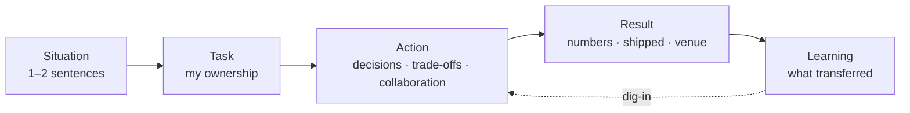
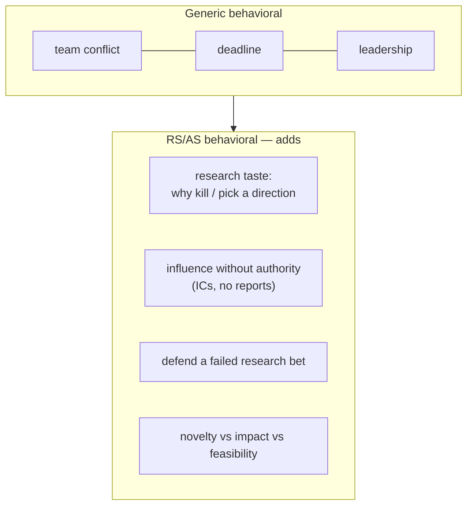

# STAR & The Story Bank

<div class="tag-row"><span class="tag">STAR / STAR-L</span><span class="tag">story bank matrix</span><span class="tag">I vs we</span><span class="tag">quantifying impact</span><span class="tag">research-scientist behavioral</span></div>

> [!TIP] Say this first
> The behavioral round is **not an acting test — it's a structured deep-dive into your résumé.** Interviewers use past behavior to predict future collaboration, ownership, and judgment. Your job is to make that prediction *easy*: pick the right story, cut it with STAR, quantify the result, and keep *your* contribution unambiguous. Prepare a small bank of stories once and you can answer almost any prompt by re-cutting the same material.

Behavioral is a real gating round for RS/AS, not a formality. At senior levels it blends into the [HM screen](#/process/recruiter-hm) and the [job talk](#/research/job-talk); at Meta it is often run by a PhD who probes your *research trajectory* while checking values. A brilliant candidate with no concrete results, no reflection, or an obscured contribution gets a no-hire — see [Common Mistakes](#/playbook/mistakes).

## STAR, and why scientists should use STAR-L

**STAR = Situation → Task → Action → Result.** For research candidates, add **L (Learning)** — an explicit reflection step. It signals a growth mindset and reframes even a failure as a productive loop, which is exactly the "research taste" panels look for.

| Slot | What it carries | Time (of a ~2–3 min answer) | Trap to avoid |
| --- | --- | --- | --- |
| **S**ituation | Context, constraint, stakeholders | 15–20% | Don't set the scene for a minute; one or two sentences |
| **T**ask | *Your* responsibility & the goal | 10% | Separate "what the team faced" from "what I owned" |
| **A**ction | Concrete decisions, trade-offs, collaboration | **50–60%** | This is the answer. Say *why* you chose, not just what |
| **R**esult | Quantified outcome + business/scientific impact | 15–20% | Always land a number or a shipped artifact |
| **L**earning | What you'd do differently; what transferred | 5–10% | One crisp sentence, not a confession |



> [!WARNING] The #1 failure: front-loading Situation
> PhDs are trained to lead with nuance and caveats. Interviews reward **clear decisions and measurable outcomes.** If 40% of your answer is context, you've buried the signal. Rehearse with a clock: if Action isn't the longest slot, re-cut.

### Three lengths — match the round

- **60–90 s (screen / warm-up):** S+T in one sentence → 2–3 Action beats → one Result sentence.
- **2–3 min (onsite behavioral):** the full STAR-L, Action expanded into ordered beats.
- **5 min+ (dig-in / Jam):** interviewer drills. Have the numbers, the alternative you rejected, and the conflict detail *pre-loaded* so you never stall.

## "I" vs "we" — the single most-scored habit

Panels explicitly try to isolate **what *you* did versus the team.** Over-using "we" is a documented rejection reason for research roles: the panel literally cannot score you. But swinging to all-"I" reads as an ego problem and poor collaboration.

> [!EXAMPLE] The calibration
> Use **"we"** to frame the shared goal and credit collaborators — then **switch to "I"** for every decision you owned.
> - ✗ "We improved the matting quality and shipped it."
> - ✓ "The team's goal was production-grade matting. *I* owned the architecture, the loss design, and the data pipeline. *I* decided to... My collaborators handled serving and the demo."

A useful ratio: "we" for the *setup and credit*, "I" for the *Action verbs*. If an interviewer still asks "but what did **you** do?", your cut was too soft — that's the most common follow-up in the whole round.

## Quantifying impact (the RS/AS version)

Numbers convert a claim into evidence. Research candidates have richer metrics than most — use them.

<dl class="kv">
<dt>Scientific</dt><dd>venue + selectivity (ICCV Highlight ≈ top 3%), metric deltas (mIoU / mAP / alpha-matte error), ablation magnitudes, dataset size (~1M images).</dd>
<dt>Product</dt><dd>latency (~10 ms on mobile CPU), model size, p99, users reached ("used by millions"), a head-to-head win (beat Photoroom / Remove.bg / Adobe internally).</dd>
<dt>Process</dt><dd>time-to-pivot, GPUs/weeks spent, review turnaround, onboarding time of a mentee.</dd>
</dl>

> [!TIP] When you don't remember the exact number
> Never invent one. Say: *"I don't recall the exact figure; the order of magnitude was about X, and I can follow up with the precise number."* Honesty here is itself a scored signal (NVIDIA calls it *intellectual honesty*).

## The Story Bank Matrix

Prepare **6–8 stories** that, re-cut, cover every competency. Rows = competencies interviewers probe; the same project can fill several cells. Fill this once, rehearse each as a 90-second recording, and you're ready for almost any prompt.

| Competency (what's tested) | Primary story | Backup | Key number to land |
| --- | --- | --- | --- |
| **Conflict / disagreement with peer** | ZIM: matting quality vs. inference latency & deploy cost | Foreground-API: research mIoU vs. product edge-quality KPI | agreed decision rule on a shared eval set |
| **Failure / setback** | ZIM early approach ("just tweak the SAM head") failed on alpha boundaries → re-diagnosed → pivoted | SSUL / continual: catastrophic forgetting spike | weeks-to-pivot; final Highlight |
| **Leadership / influence w/o authority** | Led ZIM end-to-end as 1st author + project owner | Mentoring a junior; reviewer for CVPR/ICCV/NeurIPS | mentee's first PR/paper; ICCV Highlight |
| **Ambiguity** | "Make edits look nicer" (CLOVA-X) had no metric → I defined the eval | Grounded-VLM scope: cut to data + pipeline first | the proxy metric *I* proposed |
| **Impact / research → product** | ZIM → CLOVA-X Image Editing (DAN 24 talk) | On-device seg → ONNX serving; FaceSign shipped | users reached; ~10 ms; head-to-head win |
| **Disagreement with manager / senior** | Refused a "pretty but undeployable" model; disagree-and-commit | Deadline: cut an ablation to hit a submission | what I conceded, what I held |
| **Data-driven decision** | Ablation on a shared split settled a design debate | "More pseudo-labels" hurt val → data filtering pivot | metric δ that ended the argument |
| **Deadline / prioritization** | Conference deadline + product timeline, full-time + part-time PhD | FaceSign launch under a security bar | what I *deliberately deferred* and why |

> [!NOTE] Map stories to company values before the loop
> Same story, different frame. **Amazon-style** LPs (Ownership, Dive Deep, Have Backbone) → lead with the decision you owned. **Meta** (move fast, impact, direct communication) → lead with research→product velocity. **Microsoft** (growth mindset, Model/Coach/Care) → lead with what you learned and how you coached. **Apple** → collaboration under secrecy and product craft. See [Common Questions](#/behavioral/questions) for per-company framing.

## How research-scientist behavioral differs



- **Influence without authority is the core competency.** Researchers rarely have direct reports; the panel wants evidence you moved decisions through data, demos, and trust — not a title.
- **Research judgment is a behavioral signal.** "Tell me about a direction you killed" tests taste: *why* you stopped, what evidence, how you balanced novelty vs. impact vs. feasibility.
- **The failure story is expected, not risky.** A research career *is* failed experiments. "I never failed" reads as either dishonest or low-ambition. Show the diagnosis→pivot loop.
- **Behavioral bleeds into the [job talk](#/research/job-talk).** "You said 'we' — what did *you* do?" is the hinge question in both rounds. The I-vs-we split you rehearse here pays off there too.

## Worked example 1 — Conflict / trade-off (ZIM productization)

> **Prompt:** *"Tell me about a time you disagreed with a colleague on a technical decision."*

<details class="qa"><summary>Full STAR-L answer (≈ 2.5 min)</summary>
<div class="qa-body">

**Situation (S):** "On ZIM — a promptable zero-shot matting model built on SAM — the team's goal was production-grade alpha mattes for our image-editing product. A serving engineer and I disagreed on direction: I wanted a heavier decoder and a richer training set to fix hair and semi-transparent boundaries; he was worried about inference latency and deployment complexity for the live service."

**Task (T):** "As first author and project owner, *I* owned the architecture, loss, and data-pipeline decisions — but I couldn't ship without his serving constraints being met. So the real task was to resolve this with data, not seniority."

**Action (A):**
- "First, *I* reframed the argument from opinions to a **decision rule**: we agreed that any change had to improve boundary alpha error by a meaningful margin *without* pushing latency past the product's budget.
- Then *I* ran a controlled ablation on a shared eval set — same seeds, same split — isolating the decoder change from the data change.
- *I* found most of the boundary win came from the **data pipeline and loss**, not raw decoder size, so *I* proposed a lighter architecture that hit the quality bar within his latency envelope.
- *I* also built a failure-case gallery (hair, glass, thin structures) so PM and serving were reasoning about the same evidence, not abstractions."

**Result (R):** "We shipped it. ZIM became an **ICCV 2025 Highlight** (top ~3%), was open-sourced with a public demo, and was integrated into the CLOVA-X image-editing service used by millions. Internally the matting quality beat the previous baseline on our eval set while staying inside the serving budget."

**Learning (L):** "I learned to convert a disagreement into a *shared decision rule* up front. It ended what could have been a status argument in about a day."

</div></details>

**Why it scores:** clear I-vs-we split, a real trade-off (quality vs. latency), a *data-driven* resolution, a quantified + shipped result, and a reflection. It simultaneously answers conflict, influence-without-authority, and research→product.

## Worked example 2 — Ambiguity → measurable impact (on-device + cross-team API)

> **Prompt:** *"Describe a time the requirements were vague and you had to define success yourself."*

<details class="qa"><summary>Full STAR-L answer (≈ 2 min)</summary>
<div class="qa-body">

**S:** "Product asked for an on-device human-segmentation model for a mobile feature. The only 'spec' was 'good quality, fast enough on a phone' — no metric, no latency number, no eval set."

**T:** "*I* owned the model end-to-end and first had to turn that into something measurable."

**A:**
- "*I* proposed a concrete target with the engineers: a p99 latency budget on mobile CPU and a boundary-quality bar on a small internal eval set I curated from real product images.
- *I* aligned with serving on the deployment path early — ONNX-based in-house serving — so I optimized against the *actual* runtime, not a GPU proxy.
- *I* iterated architecture and distillation against that budget, cutting anything that couldn't hold quality within it."

**R:** "*I* shipped a model at roughly **10 ms inference on mobile CPU** with robust quality under a tight compute budget. Separately, the foreground-segmentation model and dataset I built became an internal API that **outperformed Photoroom, Remove.bg, and Adobe** on our internal evaluation."

**L:** "The lesson: when a request is ambiguous, the highest-leverage first move is to *define the metric and the deployment constraint* — that alignment did more than any modeling trick."

</div></details>

## An English template for non-native speakers

The candidate is a Korean native with professional English. The goal is **audible structure**, not perfect grammar. One idea per sentence; subject = "I"; simple past tense; connectors do the signposting.

```text
Situation: In [year/project], the team faced [constraint].
Task:      I was responsible for [ownership].
Action:    First, I [1]. Then I [2]. I also aligned with [role] by [3].
Result:    We achieved [metric / venue / shipped feature]. 
Learning:  I learned [one lesson].
```

Safe connector set: *First / Then / After that* · *The trade-off was…* · *I decided to… because…* · *Looking back, I would…*. Cut fillers (*um, like, kind of, you know*) — a half-second of silence beats a filler. More on delivery in [Communication & Whiteboarding](#/playbook/communication).

## Follow-ups (the sharper second questions)

- *"You said 'we' a lot — what did **you** specifically do?"* → Have the crisp decision list ready (architecture / loss / data-pipeline on ZIM).
- *"Why didn't you try X?"* → "We considered X. The risk was ___. Given the latency budget, I piloted it for ___ days; it underperformed on ___, so I committed to Y."
- *"What would you do differently?"* → A real change with a reason, not a humblebrag ("I'd have defined the eval set a week earlier").
- *"How did the other person react?"* → Show the relationship survived: disagree, decide by evidence, commit, stay collaborators.

## Cheat-sheet

| Ask | One-liner |
| --- | --- |
| Framework | STAR-**L** — add Learning; scientists get scored on reflection |
| Time budget | Action = 50–60%; Situation ≤ 20%; always land a Result number |
| I vs we | "we" for goal + credit, "I" for every decision verb |
| Story bank | 6–8 stories × competency matrix; rehearse each as 90 s audio |
| Core RS competency | influence **without authority**; research taste (why kill a direction) |
| Failure story | expected, not risky — show diagnose → pivot → learn |
| Don't remember a number | give order of magnitude + offer to follow up; never invent |
| Per-company | re-frame the *same* story to Amazon LP / Meta / MSFT / Apple values |
| Biggest own-goal | front-loading context; "I never failed"; blaming others |

**Related:** [Common Questions & Answers](#/behavioral/questions) · [Recruiter & HM Screens](#/process/recruiter-hm) · [The Research Job Talk](#/research/job-talk) · [Failure & Negative Results](#/research/failure) · [Communication & Whiteboarding](#/playbook/communication) · [Common Mistakes & Red Flags](#/playbook/mistakes) · [Your CV → Interview Map](#/resume/overview) · [Deep-Dive: ZIM](#/resume/zim)
