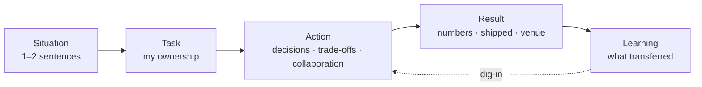
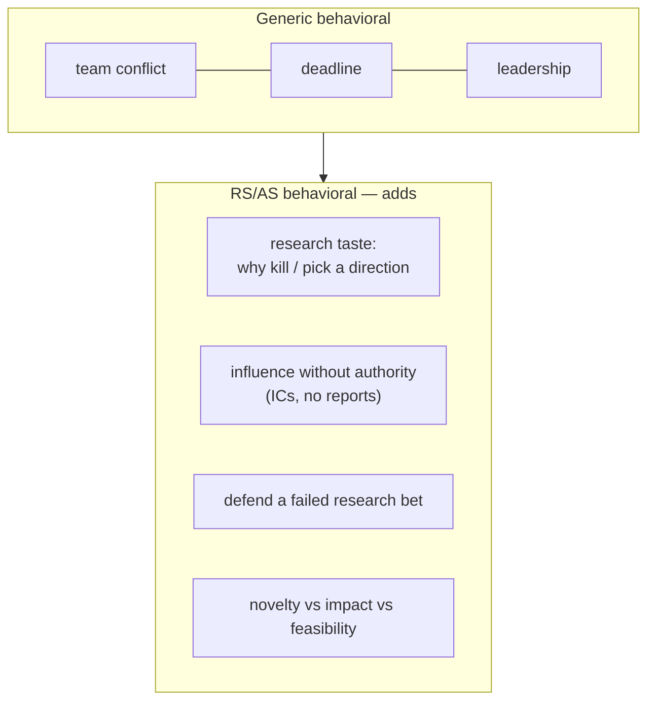

# STAR & The Story Bank

<div class="tag-row"><span class="tag">STAR / STAR-L</span><span class="tag">story bank matrix</span><span class="tag">I vs we</span><span class="tag">quantifying impact</span><span class="tag">research-scientist behavioral</span></div>

> [!TIP] Say this first
> The behavioral round is <strong>not an acting test; it uses past behavior to assess collaboration, ownership, and judgment</strong>. Choose an appropriate story, structure it with STAR, and make both the disclosable outcome and *your* contribution unambiguous. A verified story bank lets you reshape the same experiences around each question's intent.

Behavioral is a substantive evaluation axis for RS/AS roles too. In senior roles, follow-ups in the [HM screen](#/process/recruiter-hm) or [job talk](#/research/job-talk) may probe research trajectory, judgment, and collaboration together. Without concrete outcomes, reflection, or a visible contribution, even strong technical work is difficult to evaluate. See [Common Mistakes](#/playbook/mistakes).

## STAR, and why scientists should use STAR-L

**STAR = Situation → Task → Action → Result.** For research candidates, add **L (Learning)** — an explicit reflection step. It signals a growth mindset and reframes even a failure as a productive loop, which is exactly the "research taste" panels look for.

| Slot | What it carries | Time (of a ~2–3 min answer) | Trap to avoid |
| --- | --- | --- | --- |
| **S**ituation | Context, constraint, stakeholders | 15–20% | Don't set the scene for a minute; one or two sentences |
| **T**ask | *Your* responsibility & the goal | 10% | Separate "what the team faced" from "what I owned" |
| **A**ction | Concrete decisions, trade-offs, collaboration | **50–60%** | This is the answer. Say *why* you chose, not just what |
| **R**esult | Verifiable outcome + business/scientific impact | 15–20% | If numbers are unavailable or confidential, land on an observable artifact or decision |
| **L**earning | What you'd do differently; what transferred | 5–10% | One crisp sentence, not a confession |



> [!WARNING] The #1 failure: front-loading Situation
> PhDs are trained to lead with nuance and caveats. Interviews reward <strong>clear decisions and measurable outcomes</strong>. If 40% of your answer is context, you've buried the signal. Rehearse with a clock: if Action isn't the longest slot, re-cut.

### Three lengths — match the round

- **60–90 s (screen / warm-up):** S+T in one sentence → 2–3 Action beats → one Result sentence.
- **2–3 min (onsite behavioral):** the full STAR-L, Action expanded into ordered beats.
- **5 min+ (dig-in / Jam):** the interviewer drills down. Prepare disclosable numbers, rejected alternatives, the real stakeholder interests, and follow-up evidence. If you do not know something, state the boundary and verify it.

## "I" vs "we" — the single most-scored habit

Panels distinguish <strong>what you did from what the team did</strong>. Use "we" for shared goals and outcomes, and "I" for decisions and actions you actually owned. Using only "we" makes the scope of your contribution hard to evaluate; claiming every outcome with "I" hides the collaboration.

> [!EXAMPLE] The calibration
> Use <strong>"we"</strong> to frame the shared goal and credit collaborators, then <strong>switch to "I"</strong> for decisions you owned.
> - ✗ "We improved the matting quality and shipped it."
> - ✓ "The team's goal was production-grade matting. *I* owned the architecture, the loss design, and the data pipeline. *I* decided to... My collaborators handled serving and the demo."

For detailed delivery practice—speaking pace and handling follow-ups—see [Communication & Whiteboarding](#/playbook/communication).

## Quantifying impact (the RS/AS version)

Numbers convert a claim into evidence. Research candidates have richer metrics than most — use them.

<dl class="kv">
<dt>Scientific</dt><dd>official venue designation, metric deltas (mIoU / mAP / alpha-matte error), ablation magnitudes, and public dataset scale. Do not directly compare numbers from different protocols.</dd>
<dt>Product</dt><dd>disclosable latency, model size, p99, rollout scope, and adoption. Mention internal competitor comparisons or user counts only when company disclosure and NDA policies permit it.</dd>
<dt>Process</dt><dd>time-to-pivot, GPUs/weeks spent, review turnaround, onboarding time of a mentee.</dd>
</dl>

> [!TIP] When you don't remember the exact number
> Never invent one. You can say: *"I cannot verify the exact figure right now, but the public source gives a range of X, and I will confirm the precise value."* If you are not even sure of the order of magnitude, do not estimate; answer with the evaluation protocol or a qualitative result.

> [!WARNING] Disclosure boundaries come first
> An NDA, an unreleased customer, or an internal benchmark matters more than a good story. Prefer public metrics, résumé wording approved for disclosure, and published results. For everything else, explain only the problem definition, evaluation design, trade-off, and your decision. Anonymize company names, colleagues, and data sources when needed.

## Personal Story Bank Draft

Prepare <strong>6–8 stories</strong> that you can re-cut to cover multiple competencies. The table below is a <strong>candidate draft</strong> drawn from the current résumé, not a set of fact-checked answers. Delete any conflict, failure, or decision you did not actually experience, and fill the table with records you can explain and outcomes you may disclose. Verify the full project evidence in the [personal résumé map](#/resume/overview).

| Competency (what's tested) | Primary story | Backup | Key number to land |
| --- | --- | --- | --- |
| **Conflict / disagreement with peer** | A project whose actual parties, issue, and decision rule are confirmed | An example of a technical or priority disagreement, not a personality clash | the agreed criterion and evidence that the relationship remained intact |
| **Failure / setback** | A hypothesis whose disconfirmation and pivot you can explain from experiment logs | A schedule or quality failure you owned | pivot timing, recovery outcome, or remaining limitation |
| **Leadership / influence w/o authority** | A real decision moved by evidence or a prototype rather than title | A verifiable mentorship or review example | an observable change in the other person or team |
| **Ambiguity** | A real example of turning a requirement into a metric and constraint | A research bet you narrowed until it became executable | the criterion you proposed and whether it was adopted |
| **Impact / research → product** | A public ZIM integration or another example where roles can be separated | A confirmed contribution to on-device segmentation or FaceSign | only public venue, latency, and launch outcomes |
| **Disagreement with manager / senior** | An actual case where you objected and committed after the decision | A case where you negotiated priority or scope | what you conceded and protected, and what you measured afterward |
| **Data-driven decision** | A same-condition ablation that actually changed a decision | A verified example of stopping a data/filtering direction | comparison protocol and effect on the decision |
| **Deadline / prioritization** | A real case where you deliberately reduced scope across competing timelines | A case prioritizing among quality, security, and speed | what you deferred, how you communicated it, and the final outcome |

> [!NOTE] Map stories to company values before the loop
> You can change where the same story starts based on the posting and current public evaluation criteria. Do not memorize internet stereotypes about company culture; use the recruiter-confirmed rubric, job description, and official values. See the [company playbooks](#/process/companies).

## How research-scientist behavioral differs



- **Influence without authority is the core competency.** Researchers rarely have direct reports; the panel wants evidence you moved decisions through data, demos, and trust — not a title.
- **Research judgment is a behavioral signal.** "Tell me about a direction you killed" tests taste: *why* you stopped, what evidence, how you balanced novelty vs. impact vs. feasibility.
- **The failure story is expected, not risky.** A research career *is* failed experiments. "I never failed" reads as either dishonest or low-ambition. Show the diagnosis→pivot loop.
- **Behavioral bleeds into the [job talk](#/research/job-talk).** "You said 'we' — what did *you* do?" is the hinge question in both rounds. The I-vs-we split you rehearse here pays off there too.

## Worked example 1 — Conflict / trade-off answer skeleton

> [!IMPORTANT] Unverified answer draft
> ZIM's paper, venue, and public integration do not reveal an internal team conflict or your ownership. Use the template below only if you can fill every bracket from your actual experience.

> **Prompt:** *"Tell me about a time you disagreed with a colleague on a technical decision."*

<details class="qa"><summary>Fill-in STAR-L draft (≈ 2.5 min)</summary>
<div class="qa-body">

**Situation (S):** "In [year/project], the team was pursuing [shared goal]. [Role A] and I disagreed about [technical or priority issue, not personality]."

**Task (T):** "My verified scope was [actual ownership], and our shared constraint was [quality, latency, schedule, etc.]."

**Action (A):**
- "First, I proposed converting the issue into [measurable decision rule]."
- "Then I compared the alternatives under the same conditions through [experiment, analysis, or coordination I actually performed]."
- "I shared the result with [other role], and we agreed on [adopted choice and concession]."

**Result (R):** "We achieved [disclosable metric, launch, or decision], and I maintained [subsequent collaboration state] with the other person." If you use ZIM, separate the ICCV 2025 Highlight, public demo, and publicly verifiable integration from your internal actions.

**Learning (L):** "I later applied [behavior I actually changed] earlier in subsequent projects."

</div></details>

**Review criteria:** Is I-vs-we separated? Was there a real disagreement and a decision rule? Did the relationship survive? Can you substantiate the outcome and reflection? If any answer is no, choose another experience.

## Worked example 2 — Ambiguity → measurable-impact answer skeleton

> [!IMPORTANT] Résumé-based draft
> The résumé's approximately 10 ms result and ONNX deployment are only starting points. Verify the requirements, measurement device and runtime, latency statistic, whether distillation was used, and your ownership separately.

> **Prompt:** *"Describe a time the requirements were vague and you had to define success yourself."*

<details class="qa"><summary>Fill-in STAR-L draft (≈ 2 min)</summary>
<div class="qa-body">

**S:** "[Stakeholder] requested [feature], but [requirement that was actually missing] had not been defined."

**T:** "My confirmed scope was [model, evaluation, and/or deployment], and the first task was to agree on the success criteria."

**A:**
- "I documented [metric, latency budget, or evaluation slice I actually proposed] and obtained agreement."
- "I fixed [warm-up, thread count, batch, and statistic] and measured on [actual device and runtime]."
- "I ablated [optimizations actually used] separately and shared the quality–latency trade-off."

**R:** "The public résumé result is approximately <strong>10 ms</strong> on mobile CPU with ONNX deployment. Use that number only if you can explain the actual protocol, and mention a separate foreground API or internal comparison only within the approved disclosure boundary."

**L:** "I later applied [requirements or evaluation-alignment procedure I actually changed] earlier."

</div></details>

## An English template for non-native speakers

The goal is <strong>audible structure</strong>, not perfect grammar: one idea per sentence, subject = "I," simple past tense. Put STAR-L into the skeleton below.

```text
Situation: In [year/project], the team faced [constraint].
Task:      I was responsible for [ownership].
Action:    First, I [1]. Then I [2]. I also aligned with [role] by [3].
Result:    We achieved [metric / venue / shipped feature]. 
Learning:  I learned [one lesson].
```

For safe connectors, removing fillers, and using pauses, see [Communication & Whiteboarding](#/playbook/communication).

## Follow-ups (the sharper second questions)

- *"You said 'we' a lot — what did **you** specifically do?"* → For each project, prepare a list separating decisions you owned from work your collaborators handled.
- *"Why didn't you try X?"* → "We considered X. The risk was ___. Given the latency budget, I piloted it for ___ days; it underperformed on ___, so I committed to Y."
- *"What would you do differently?"* → A real change with a reason, not a humblebrag ("I'd have defined the eval set a week earlier").
- *"How did the other person react?"* → Show the relationship survived: disagree, decide by evidence, commit, stay collaborators.

## Cheat-sheet

| Ask | One-liner |
| --- | --- |
| Framework | STAR-**L** — add Learning; scientists get scored on reflection |
| Time budget | For a 2–3 minute answer, start with Action at 50–60% and Situation at ≤20%; adjust to the prompt |
| I vs we | "we" for shared goals and outcomes; "I" for decisions and actions you actually owned |
| Story bank | 6–8 stories × competency matrix; rehearse each as 90 s audio |
| Core RS competency | influence **without authority**; research taste (why kill a direction) |
| Failure story | expected, not risky — show diagnose → pivot → learn |
| Don't remember a number | do not estimate; answer with the verifiable range and protocol, then reconfirm |
| Per-company | adjust the emphasis of the same story to the current posting, official values, and recruiter-confirmed rubric |
| Biggest own-goal | front-loading context; "I never failed"; blaming others |

**Related:** [Common Questions & Answers](#/behavioral/questions) · [Résumé-Based Answers by Interview Stage](#/resume/interview-stage-answers) · [Recruiter & HM Screens](#/process/recruiter-hm) · [The Research Job Talk](#/research/job-talk) · [Failure & Negative Results](#/research/failure) · [Communication & Whiteboarding](#/playbook/communication) · [Common Mistakes & Red Flags](#/playbook/mistakes) · [Your CV → Interview Map](#/resume/overview) · [Deep-Dive: ZIM](#/resume/zim)
