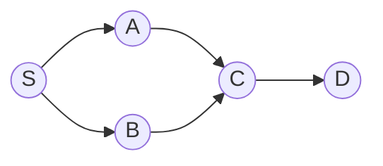

# Graphs (BFS / DFS)

> [!TIP] 이 말부터 시작하세요
> "거의 모든 graph 문제는 `adjacency list + visited`입니다. BFS는 **unweighted** graph에서 최단 경로를 주고, DFS는 연결성, 사이클, topological order를 줍니다. priority queue를 더하면 Dijkstra가 됩니다." 표현 방식과 traversal 선택을 먼저 언급하는 것이 신호의 절반입니다.

Grid, dependency DAG, social graph는 같은 추상화입니다. 면접 스킬은 traversal을 고르고, `visited`를 정확히 추적하고, 네 가지 확장을 아는 것입니다: BFS → Dijkstra (가중치), DFS → topo-sort / cycle 감지, 컴포넌트 union → [Union-Find](#/coding/union-find).

## 어떤 traversal을 언제 꺼내 쓰나

| 신호 | 사용 |
| --- | --- |
| 최단 경로, **단위** edge 가중치 | BFS (레벨 카운트) |
| 최단 경로, **음이 아닌** 가중치 | Dijkstra (heap) |
| 연결 컴포넌트 개수 / flood fill | DFS 혹은 BFS (혹은 Union-Find) |
| "선수 과목," "빌드 순서," 제약하의 순서 정하기 | Topological sort |
| 사이클 감지 (directed) | DFS 3-color, 혹은 Kahn "모든 노드가 emit됐나?" |
| 사이클 감지 (undirected) | Union-Find, 혹은 parent edge를 무시하는 DFS |
| Grid의 섬 / 영역 / 부패 확산 | grid에서 DFS / multi-source BFS |

## 표현

```python
from collections import defaultdict, deque

# Adjacency list — default choice, O(V+E) space, fast neighbor iteration.
graph = defaultdict(list)
for u, v in edges:
    graph[u].append(v)
    graph[v].append(u)          # drop this line for a directed graph

# Grid: implicit graph, neighbors are the 4 (or 8) offsets.
DIRS = [(1, 0), (-1, 0), (0, 1), (0, -1)]
```

Adjacency **matrix**는 graph가 밀집(dense)이거나 `O(1)` edge 조회가 필요할 때만; `O(V²)` 공간이 듭니다.

## BFS와 DFS 템플릿


`S`에서 시작한 BFS는 layer `{S} → {A,B} → {C} → {D}`를 발견합니다 — layer 인덱스가 최단 단위-거리입니다.

```python
def bfs_shortest(graph, src, dst):
    q = deque([(src, 0)])
    seen = {src}
    while q:
        node, dist = q.popleft()
        if node == dst:
            return dist
        for nxt in graph[node]:
            if nxt not in seen:
                seen.add(nxt)                 # mark on ENQUEUE, not dequeue
                q.append((nxt, dist + 1))
    return -1

def dfs(graph, node, seen):
    seen.add(node)
    for nxt in graph[node]:
        if nxt not in seen:
            dfs(graph, nxt, seen)
```

> [!WARNING] Enqueue 시점에 표시
> BFS에서는 pop할 때가 아니라 **push**할 때 `seen`에 추가합니다. pop할 때 표시하면 같은 노드가 큐에 여러 번 들어와 → 폭발적으로 커지고, 가중치 변형에서는 틀린 답이 나옵니다.

## Practice — 직접 구현하고 실행·테스트

> [!TIP] 이 섹션 사용법
> 아래 각 문제에는 **라이브 Python 에디터**가 있습니다. 직접 풀이를 작성하고 **▶ Run tests**를 누르면 어떤 케이스가 통과하는지 보여줍니다. 막히면 참고용 **Solution**을 열어볼 수 있지만, 먼저 직접 시도하세요 — 그 씨름이 곧 연습입니다. 첫 Run에서 작은 Python 런타임(~10 MB)을 내려받고, 이후 실행은 즉시입니다. 본인 에디터가 편하면 각 문제의 **LeetCode** 링크로 이동하세요. 각 lab은 평범한 grid / edge 리스트 / adjacency 리스트를 받습니다 — 따로 만들 graph 객체가 없습니다.

순서대로 진행하세요 — grid flood-fill과 multi-source BFS를 먼저, 그다음 topological sort, cycle 감지, Dijkstra입니다.

### 1. Number of Islands <span class="badge badge-med">Medium</span> · [LeetCode ↗](https://leetcode.com/problems/number-of-islands/)
방문하지 않은 각 land 셀이 자신의 컴포넌트 전체를 가라앉히는 DFS를 시작합니다.

<div class="widget" data-widget="code">
<script type="application/json" class="code-config">
{"func":"num_islands","starter":"def num_islands(grid):\n    # each unvisited '1' launches a DFS that sinks its whole component\n    pass","tests":[{"args":[[["1","1","1","1","0"],["1","1","0","1","0"],["1","1","0","0","0"],["0","0","0","0","0"]]],"expect":1},{"args":[[["1","1","0","0","0"],["1","1","0","0","0"],["0","0","1","0","0"],["0","0","0","1","1"]]],"expect":3},{"args":[[["1","0","1"]]],"expect":2},{"args":[[["0"]]],"expect":0}],"solution":"def num_islands(grid):\n    DIRS = [(1, 0), (-1, 0), (0, 1), (0, -1)]\n    rows, cols = len(grid), len(grid[0])\n    def sink(r, c):\n        if not (0 <= r < rows and 0 <= c < cols) or grid[r][c] != \"1\":\n            return\n        grid[r][c] = \"0\"\n        for dr, dc in DIRS:\n            sink(r + dr, c + dc)\n    count = 0\n    for r in range(rows):\n        for c in range(cols):\n            if grid[r][c] == \"1\":\n                count += 1\n                sink(r, c)\n    return count"}
</script>
</div>

`O(R·C)` 시간. grid를 변형하는 게 금지되면 별도의 `visited` 집합을 유지하세요.

### 2. Rotting Oranges <span class="badge badge-med">Medium</span> · [LeetCode ↗](https://leetcode.com/problems/rotting-oranges/)
큐를 **모든** 썩은 셀로 시드하고 layer당 1분씩 확장합니다.

<div class="widget" data-widget="code">
<script type="application/json" class="code-config">
{"func":"oranges_rotting","starter":"from collections import deque\n\ndef oranges_rotting(grid):\n    # multi-source BFS: seed the queue with all rotten cells, expand one minute per layer\n    pass","tests":[{"args":[[[2,1,1],[1,1,0],[0,1,1]]],"expect":4},{"args":[[[2,1,1],[0,1,1],[1,0,1]]],"expect":-1},{"args":[[[0,2]]],"expect":0},{"args":[[[1]]],"expect":-1},{"args":[[[2,2],[1,1]]],"expect":1}],"solution":"from collections import deque\n\ndef oranges_rotting(grid):\n    DIRS = [(1, 0), (-1, 0), (0, 1), (0, -1)]\n    rows, cols = len(grid), len(grid[0])\n    q, fresh = deque(), 0\n    for r in range(rows):\n        for c in range(cols):\n            if grid[r][c] == 2:\n                q.append((r, c))\n            elif grid[r][c] == 1:\n                fresh += 1\n    minutes = 0\n    while q and fresh:\n        for _ in range(len(q)):\n            r, c = q.popleft()\n            for dr, dc in DIRS:\n                nr, nc = r + dr, c + dc\n                if 0 <= nr < rows and 0 <= nc < cols and grid[nr][nc] == 1:\n                    grid[nr][nc] = 2\n                    fresh -= 1\n                    q.append((nr, nc))\n        minutes += 1\n    return minutes if fresh == 0 else -1"}
</script>
</div>

`O(R·C)`. Multi-source BFS는 "여러 출발점에서 동시에 퍼진다" 패턴입니다 — *walls and gates*, *shortest bridge*도 마찬가지입니다.

### 3. Course Schedule II <span class="badge badge-med">Medium</span> · [LeetCode ↗](https://leetcode.com/problems/course-schedule-ii/)
Kahn's algorithm: in-degree가 0인 노드를 반복적으로 emit합니다. 전부 emit할 수 없다면 사이클이 있는 것입니다.

<div class="widget" data-widget="code">
<script type="application/json" class="code-config">
{"func":"find_order","starter":"from collections import defaultdict, deque\n\ndef find_order(n, prereqs):\n    # Kahn's algorithm: repeatedly emit an in-degree-0 node; incomplete => cycle\n    pass","tests":[{"args":[2,[[1,0]]],"expect":[0,1]},{"args":[4,[[1,0],[2,0],[3,1],[3,2]]],"expect":[0,1,2,3]},{"args":[1,[]],"expect":[0]},{"args":[2,[[0,1],[1,0]]],"expect":[]}],"solution":"from collections import defaultdict, deque\n\ndef find_order(n, prereqs):\n    graph = defaultdict(list)\n    indeg = [0] * n\n    for course, need in prereqs:\n        graph[need].append(course)\n        indeg[course] += 1\n    q = deque(c for c in range(n) if indeg[c] == 0)\n    order = []\n    while q:\n        cur = q.popleft()\n        order.append(cur)\n        for nxt in graph[cur]:\n            indeg[nxt] -= 1\n            if indeg[nxt] == 0:\n                q.append(nxt)\n    return order if len(order) == n else []"}
</script>
</div>

`O(V+E)`. `len(order) == n` 체크가 사이클 감지기 *그 자체*입니다. DFS 대안은 3-color 마킹(white/gray/black)을 씁니다; gray 노드로 가는 back-edge가 사이클입니다.

### 4. Cycle Detection in a Directed Graph <span class="badge badge-med">Medium</span> · [LeetCode ↗](https://leetcode.com/problems/course-schedule/)
3-color DFS: gray(in-stack) 노드로 가는 back-edge가 사이클입니다. adjacency list는 이웃 리스트의 평범한 리스트입니다.

<div class="widget" data-widget="code">
<script type="application/json" class="code-config">
{"func":"has_cycle","starter":"def has_cycle(n, graph):\n    # 3-color DFS: a back-edge to an in-stack (gray) node means a cycle\n    pass","tests":[{"args":[3,[[1],[2],[]]],"expect":false},{"args":[3,[[1],[2],[0]]],"expect":true},{"args":[2,[[],[]]],"expect":false},{"args":[4,[[1],[2],[3],[1]]],"expect":true},{"args":[1,[[]]],"expect":false}],"solution":"def has_cycle(n, graph):\n    state = [0] * n\n    def dfs(u):\n        if state[u] == 1:\n            return True\n        if state[u] == 2:\n            return False\n        state[u] = 1\n        if any(dfs(v) for v in graph[u]):\n            return True\n        state[u] = 2\n        return False\n    return any(dfs(u) for u in range(n) if state[u] == 0)"}
</script>
</div>

### 5. Network Delay Time <span class="badge badge-med">Medium</span> · [LeetCode ↗](https://leetcode.com/problems/network-delay-time/)
source에서 음이 아닌 가중 최단 경로; min-heap은 항상 아직 확정되지 않은 노드 중 가장 가까운 것을 finalize합니다.

<div class="widget" data-widget="code">
<script type="application/json" class="code-config">
{"func":"network_delay_time","starter":"import heapq\nfrom collections import defaultdict\n\ndef network_delay_time(times, n, k):\n    # Dijkstra from k; a min-heap finalizes the closest unsettled node each pop\n    pass","tests":[{"args":[[[2,1,1],[2,3,1],[3,4,1]],4,2],"expect":2},{"args":[[[1,2,1]],2,1],"expect":1},{"args":[[[1,2,1]],2,2],"expect":-1},{"args":[[[1,2,1],[2,3,2],[1,3,4]],3,1],"expect":3}],"solution":"import heapq\nfrom collections import defaultdict\n\ndef network_delay_time(times, n, k):\n    graph = defaultdict(list)\n    for u, v, w in times:\n        graph[u].append((v, w))\n    dist = {}\n    pq = [(0, k)]\n    while pq:\n        d, u = heapq.heappop(pq)\n        if u in dist:\n            continue\n        dist[u] = d\n        for v, w in graph[u]:\n            if v not in dist:\n                heapq.heappush(pq, (d + w, v))\n    return max(dist.values()) if len(dist) == n else -1"}
</script>
</div>

`O(E log V)`. 음의 edge는 Dijkstra를 깨뜨립니다 → **Bellman-Ford** `O(VE)` 사용; all-pairs → **Floyd-Warshall** `O(V³)`.

## 언급할 변형

- **0-1 BFS:** edge 가중치가 `{0,1}` → deque, 0-cost는 앞에 push, Dijkstra 대신 `O(V+E)`.
- **A\*:** grid/geometry 최단 경로를 위한 Dijkstra + admissible heuristic.
- **Bidirectional BFS:** 양 끝에서 탐색(Word Ladder)해 frontier를 대략 제곱근으로 줄임.
- **Union-Find:** 동적 연결성 / MST — edge가 online으로 도착할 때 교차 연결.
- **SCC / bridges:** 고급 graph 라운드를 위한 Tarjan/Kosaraju.

## 함정

- **Directed vs undirected** edge 삽입 (한 줄 vs 두 줄).
- BFS에서 **visited 표시를 늦게** 하거나(경고 참조) 아예 잊음 → 사이클에서 무한 루프.
- topo-sort에서 **잘못된 edge 방향** (`need → course`); DAG를 그려보세요.
- 큰 grid에서의 **recursion 깊이** → DFS를 explicit 스택으로 변환하거나 BFS 사용.
- **음의 가중치를 가진 Dijkstra** — 조용히 틀림; 알아채고 알고리즘을 바꾸세요.
- Word-Ladder류 문제에서 **매 스텝 이웃을 재구축** → 패턴 map을 미리 계산해 `O(N²)`을 피하세요.

## Q&A

<details class="qa"><summary>최단 경로에 BFS냐 DFS냐 — 그리고 언제 둘 다 부족한가요?</summary>
<div class="qa-body">

**짧게:** 단위 가중치는 BFS(레벨 = 거리). 가중된 음이 아닌 graph는 Dijkstra. 음의 edge → Bellman-Ford; 음의 사이클 → 감지하고 거부.

**깊게:** BFS가 단위 가중치에서 정확한 이유는 정확히 노드를 non-decreasing 거리 순으로 확정하기 때문입니다. 임의의 음이 아닌 가중치를 더하면 그 순서에는 priority queue(Dijkstra)가 필요한데, 이는 heap을 쓴 같은 greedy 불변식입니다. `{0,1}` 가중치가 끼어들면 deque를 쓴 0-1 BFS가 Dijkstra의 `log` 항을 이깁니다.
</div></details>

<details class="qa"><summary>사이클을 감지하는 두 가지 방법 — 각각 언제 쓰나요?</summary>
<div class="qa-body">

**짧게:** Directed graph → DFS 3-coloring(gray 노드로의 back-edge) 혹은 Kahn(topo-order가 모든 노드를 덮지 못하면). Undirected → Union-Find(기존 집합에서 union 실패) 혹은 parent로 돌아가는 edge를 무시하는 DFS.

**깊게:** Kahn은 사이클 감지 *와* 유효한 순서를 공짜로 주므로 스케줄링 문제에는 기본으로 씁니다. Union-Find는 edge가 online으로 도착하거나 컴포넌트 개수도 필요할 때 빛납니다. Undirected DFS는 직전 parent를 건너뛰어야 합니다, 안 그러면 모든 edge가 2-cycle처럼 보입니다.
</div></details>

**예상되는 후속 질문**
- "길이뿐 아니라 경로를 복원하세요." → `parent[]`를 저장하고 backtrack.
- "이제 edge에 가중치가 있습니다." → Dijkstra; 그다음 "일부는 음수" → Bellman-Ford.
- "노드가 수백만 개입니다." → iterative DFS, adjacency list, recursion 한계 회피.
- "여기선 Union-Find가 더 나은가요?" → 동적 연결성 / MST에는 그렇다; trade-off를 설명하세요.

## Cheat-sheet

| 사실 | 세부 |
| --- | --- |
| 기본 표현 | adjacency list, `O(V+E)` |
| BFS | unweighted 최단 경로; enqueue 시 표시 |
| DFS | 연결성, 사이클, topo-order |
| Topological sort | Kahn (in-degree 큐) 혹은 DFS post-order 뒤집기 |
| Directed 사이클 | 3-color DFS, 혹은 Kahn이 `< V`개 노드 emit |
| Undirected 사이클 | Union-Find, 혹은 parent를 건너뛰는 DFS |
| Dijkstra | 음이 아닌 가중치, `O(E log V)` |
| Bellman-Ford / Floyd | 음의 edge `O(VE)` / all-pairs `O(V³)` |
| Multi-source BFS | 큐를 모든 source로 시드 (확산) |
| Grid | implicit graph, 4/8 방향 offset |

**관련:** [Trees & BSTs](#/coding/trees-bst) · [Union-Find](#/coding/union-find) · [Heaps & Priority Queues](#/coding/heap-priority-queue) · 다시 [The Core Patterns](#/coding/patterns)와 [Coding Round Strategy](#/coding/strategy)로.
