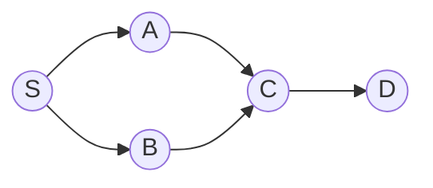

# Graphs (BFS / DFS)

> [!TIP] Say this first
> “Many basic graph problems start with `adjacency list + visited`. BFS finds the minimum number of edges in an **unweighted** graph; DFS supplies the machinery for connectivity, cycles, and topological ordering. For non-negative weighted shortest paths, consider Dijkstra with a priority queue.” Stating the representation and traversal choice up front is half the signal.

Grids, dependency DAGs, and social graphs are the same abstraction. The interview skill is choosing the traversal, tracking `visited` correctly, and knowing the four escalations: BFS → Dijkstra (weights), DFS → topo-sort / cycle detection, union of components → [Union-Find](#/coding/union-find).

## When to reach for which traversal

| Cue | Use |
| --- | --- |
| Shortest path, **unit** edge weights | BFS (level count) |
| Shortest path, **non-negative** weights | Dijkstra (heap) |
| Count connected components / flood fill | DFS or BFS (or Union-Find) |
| "Prerequisites," "build order," ordering under constraints | Topological sort |
| Detect a cycle (directed) | DFS 3-color, or Kahn "did all nodes emit?" |
| Detect a cycle (undirected) | Union-Find, or DFS ignoring the parent edge |
| Grid islands / regions / rotting spread | DFS / multi-source BFS on the grid |

## Representations

```python
from collections import defaultdict, deque

# Adjacency list — default choice, O(V+E) space, fast neighbor iteration.
graph = defaultdict(list)
for u, v in edges:
    graph[u].append(v)
    graph[v].append(u)          # drop this line for a directed graph

# Grid: implicit graph, neighbors are the 4 (or 8) offsets.
DIRS = [(1, 0), (-1, 0), (0, 1), (0, -1)]
```

Adjacency **matrix** only when the graph is dense or you need `O(1)` edge lookups; it costs `O(V²)` space.

## BFS and DFS templates


BFS from `S` discovers layers `{S} → {A,B} → {C} → {D}` — the layer index is the shortest unit-distance.

```python
def bfs_shortest(graph, src, dst):
    q = deque([(src, 0)])
    seen = {src}
    while q:
        node, dist = q.popleft()
        if node == dst:
            return dist
        for nxt in graph[node]:
            if nxt not in seen:
                seen.add(nxt)                 # mark on ENQUEUE, not dequeue
                q.append((nxt, dist + 1))
    return -1

def dfs(graph, node, seen):
    seen.add(node)
    for nxt in graph[node]:
        if nxt not in seen:
            dfs(graph, nxt, seen)
```

> [!WARNING] Mark-on-enqueue
> In BFS, add to `seen` when you **push**, not when you pop. Marking on pop lets the same node enter the queue many times → blow-up and, on weighted variants, wrong answers.

## Practice — implement, run, test

> [!TIP] How to use this section
> Each problem below has a **live Python editor**. Write your solution, hit **▶ Run tests**, and see which cases pass. Stuck? Reveal a reference **Solution** — but attempt first; the struggle *is* the practice. The first Run downloads a small Python runtime (~10 MB); later runs are instant. Prefer your own editor? Each problem links out to **LeetCode**. Each lab takes a plain grid / edge list / adjacency list — no graph object to build.

Work them in order — grid flood-fill and multi-source BFS first, then topological sort, cycle detection, and Dijkstra.

### 1. Number of Islands <span class="badge badge-med">Medium</span> · [LeetCode ↗](https://leetcode.com/problems/number-of-islands/)
Each unvisited land cell launches a DFS that sinks its whole component.

<div class="widget" data-widget="code">
<script type="application/json" class="code-config">
{"func":"num_islands","starter":"def num_islands(grid):\n    # each unvisited '1' launches a DFS that sinks its whole component\n    pass","tests":[{"args":[[["1","1","1","1","0"],["1","1","0","1","0"],["1","1","0","0","0"],["0","0","0","0","0"]]],"expect":1},{"args":[[["1","1","0","0","0"],["1","1","0","0","0"],["0","0","1","0","0"],["0","0","0","1","1"]]],"expect":3},{"args":[[["1","0","1"]]],"expect":2},{"args":[[["0"]]],"expect":0}],"solution":"def num_islands(grid):\n    DIRS = [(1, 0), (-1, 0), (0, 1), (0, -1)]\n    rows, cols = len(grid), len(grid[0])\n    def sink(r, c):\n        if not (0 <= r < rows and 0 <= c < cols) or grid[r][c] != \"1\":\n            return\n        grid[r][c] = \"0\"\n        for dr, dc in DIRS:\n            sink(r + dr, c + dc)\n    count = 0\n    for r in range(rows):\n        for c in range(cols):\n            if grid[r][c] == \"1\":\n                count += 1\n                sink(r, c)\n    return count"}
</script>
</div>

`O(R·C)` time. If mutating the grid is disallowed, keep a separate `visited` set.

### 2. Rotting Oranges <span class="badge badge-med">Medium</span> · [LeetCode ↗](https://leetcode.com/problems/rotting-oranges/)
Seed the queue with **all** rotten cells and expand one minute per layer.

<div class="widget" data-widget="code">
<script type="application/json" class="code-config">
{"func":"oranges_rotting","starter":"from collections import deque\n\ndef oranges_rotting(grid):\n    # multi-source BFS: seed the queue with all rotten cells, expand one minute per layer\n    pass","tests":[{"args":[[[2,1,1],[1,1,0],[0,1,1]]],"expect":4},{"args":[[[2,1,1],[0,1,1],[1,0,1]]],"expect":-1},{"args":[[[0,2]]],"expect":0},{"args":[[[1]]],"expect":-1},{"args":[[[2,2],[1,1]]],"expect":1}],"solution":"from collections import deque\n\ndef oranges_rotting(grid):\n    DIRS = [(1, 0), (-1, 0), (0, 1), (0, -1)]\n    rows, cols = len(grid), len(grid[0])\n    q, fresh = deque(), 0\n    for r in range(rows):\n        for c in range(cols):\n            if grid[r][c] == 2:\n                q.append((r, c))\n            elif grid[r][c] == 1:\n                fresh += 1\n    minutes = 0\n    while q and fresh:\n        for _ in range(len(q)):\n            r, c = q.popleft()\n            for dr, dc in DIRS:\n                nr, nc = r + dr, c + dc\n                if 0 <= nr < rows and 0 <= nc < cols and grid[nr][nc] == 1:\n                    grid[nr][nc] = 2\n                    fresh -= 1\n                    q.append((nr, nc))\n        minutes += 1\n    return minutes if fresh == 0 else -1"}
</script>
</div>

`O(R·C)`. Multi-source BFS is the "spread simultaneously from many origins" pattern — also *walls and gates*, *shortest bridge*.

### 3. Course Schedule II <span class="badge badge-med">Medium</span> · [LeetCode ↗](https://leetcode.com/problems/course-schedule-ii/)
Kahn's algorithm: repeatedly emit an in-degree-0 node. If you can't emit them all, there's a cycle.

<div class="widget" data-widget="code">
<script type="application/json" class="code-config">
{"func":"find_order","starter":"from collections import defaultdict, deque\n\ndef find_order(n, prereqs):\n    # Kahn's algorithm: repeatedly emit an in-degree-0 node; incomplete => cycle\n    pass","tests":[{"args":[2,[[1,0]]],"expect":[0,1]},{"args":[4,[[1,0],[2,0],[3,1],[3,2]]],"expect":[0,1,2,3]},{"args":[1,[]],"expect":[0]},{"args":[2,[[0,1],[1,0]]],"expect":[]}],"solution":"from collections import defaultdict, deque\n\ndef find_order(n, prereqs):\n    graph = defaultdict(list)\n    indeg = [0] * n\n    for course, need in prereqs:\n        graph[need].append(course)\n        indeg[course] += 1\n    q = deque(c for c in range(n) if indeg[c] == 0)\n    order = []\n    while q:\n        cur = q.popleft()\n        order.append(cur)\n        for nxt in graph[cur]:\n            indeg[nxt] -= 1\n            if indeg[nxt] == 0:\n                q.append(nxt)\n    return order if len(order) == n else []"}
</script>
</div>

`O(V+E)`. The `len(order) == n` check *is* the cycle detector. The DFS alternative uses 3-color marking (white/gray/black); a back-edge to a gray node is a cycle.

### 4. Cycle Detection in a Directed Graph <span class="badge badge-med">Medium</span> · [LeetCode ↗](https://leetcode.com/problems/course-schedule/)
3-color DFS: a back-edge to a gray (in-stack) node means a cycle. The adjacency list is a plain list of neighbor lists.

<div class="widget" data-widget="code">
<script type="application/json" class="code-config">
{"func":"has_cycle","starter":"def has_cycle(n, graph):\n    # 3-color DFS: a back-edge to an in-stack (gray) node means a cycle\n    pass","tests":[{"args":[3,[[1],[2],[]]],"expect":false},{"args":[3,[[1],[2],[0]]],"expect":true},{"args":[2,[[],[]]],"expect":false},{"args":[4,[[1],[2],[3],[1]]],"expect":true},{"args":[1,[[]]],"expect":false}],"solution":"def has_cycle(n, graph):\n    state = [0] * n\n    def dfs(u):\n        if state[u] == 1:\n            return True\n        if state[u] == 2:\n            return False\n        state[u] = 1\n        if any(dfs(v) for v in graph[u]):\n            return True\n        state[u] = 2\n        return False\n    return any(dfs(u) for u in range(n) if state[u] == 0)"}
</script>
</div>

### 5. Network Delay Time <span class="badge badge-med">Medium</span> · [LeetCode ↗](https://leetcode.com/problems/network-delay-time/)
Non-negative weighted shortest paths from a source; a min-heap always finalizes the closest unsettled node.

<div class="widget" data-widget="code">
<script type="application/json" class="code-config">
{"func":"network_delay_time","starter":"import heapq\nfrom collections import defaultdict\n\ndef network_delay_time(times, n, k):\n    # Dijkstra from k; a min-heap finalizes the closest unsettled node each pop\n    pass","tests":[{"args":[[[2,1,1],[2,3,1],[3,4,1]],4,2],"expect":2},{"args":[[[1,2,1]],2,1],"expect":1},{"args":[[[1,2,1]],2,2],"expect":-1},{"args":[[[1,2,1],[2,3,2],[1,3,4]],3,1],"expect":3}],"solution":"import heapq\nfrom collections import defaultdict\n\ndef network_delay_time(times, n, k):\n    graph = defaultdict(list)\n    for u, v, w in times:\n        graph[u].append((v, w))\n    dist = {}\n    pq = [(0, k)]\n    while pq:\n        d, u = heapq.heappop(pq)\n        if u in dist:\n            continue\n        dist[u] = d\n        for v, w in graph[u]:\n            if v not in dist:\n                heapq.heappush(pq, (d + w, v))\n    return max(dist.values()) if len(dist) == n else -1"}
</script>
</div>

`O(E log V)`. Negative edges break Dijkstra → use **Bellman-Ford** `O(VE)`; all-pairs → **Floyd-Warshall** `O(V³)`.

## Variations to name

- **0-1 BFS:** edge weights in `{0,1}` → deque, push 0-cost to front, `O(V+E)` instead of Dijkstra.
- **A\*:** Dijkstra + admissible heuristic for grid/geometry shortest paths.
- **Bidirectional BFS:** search from both ends (Word Ladder) to roughly square-root the frontier.
- **Union-Find:** dynamic connectivity / MST — cross-link when edges arrive online.
- **SCC / bridges:** Tarjan/Kosaraju for advanced-graph rounds.

## Pitfalls

- **Directed vs undirected** edge insertion (one line vs two).
- **Marking visited late** in BFS (see warning) or forgetting it entirely → infinite loops on cycles.
- **Wrong edge direction** in topo-sort (`need → course`); draw the DAG.
- **Recursion depth** on large grids → convert DFS to an explicit stack or use BFS.
- **Dijkstra with negative weights** — silently wrong; recognize and switch algorithms.
- **Rebuilding neighbors each step** in Word-Ladder-style problems → precompute a pattern map to avoid `O(N²)`.

## Q&A

<details class="qa"><summary>BFS or DFS for shortest path — and when is neither enough?</summary>
<div class="qa-body">

**Short:** BFS for unit weights (level = distance). For weighted non-negative graphs, Dijkstra. Negative edges → Bellman-Ford; negative cycles → detect and reject.

**Deep:** BFS is correct for unit weights precisely because it settles nodes in non-decreasing distance order. Add arbitrary non-negative weights and that order needs a priority queue (Dijkstra), which is the same greedy invariant with a heap. If a `{0,1}` weighting sneaks in, 0-1 BFS with a deque beats Dijkstra's `log` factor.
</div></details>

<details class="qa"><summary>Two ways to detect a cycle — when do you use each?</summary>
<div class="qa-body">

**Short:** Directed graph → DFS 3-coloring (back-edge to a gray node) or Kahn (if topo-order can't cover all nodes). Undirected → Union-Find (union fails on an existing set) or DFS ignoring the edge back to the parent.

**Deep:** Kahn gives cycle detection *and* a valid order for free, so I default to it for scheduling problems. Union-Find shines when edges arrive online or you also need component counts. The undirected DFS must skip the immediate parent, else every edge looks like a 2-cycle.
</div></details>

**Follow-ups you should expect**
- "Reconstruct the path, not just its length." → store `parent[]` and backtrack.
- "Edges have weights now." → Dijkstra; then "some are negative" → Bellman-Ford.
- "Millions of nodes." → iterative DFS, adjacency list, avoid recursion limits.
- "Is Union-Find better here?" → yes for dynamic connectivity / MST; explain the trade-off.

## Cheat-sheet

| Fact | Detail |
| --- | --- |
| Default representation | adjacency list, `O(V+E)` |
| BFS | unweighted shortest path; mark on enqueue |
| DFS | connectivity, cycles, topo-order |
| Topological sort | Kahn (in-degree queue) or DFS post-order reversed |
| Directed cycle | 3-color DFS, or Kahn emits `< V` nodes |
| Undirected cycle | Union-Find, or DFS skipping parent |
| Dijkstra | non-negative weights, `O(E log V)` |
| Bellman-Ford / Floyd | negative edges `O(VE)` / all-pairs `O(V³)` |
| Multi-source BFS | seed queue with all sources (spread) |
| Grid | implicit graph, 4/8 direction offsets |

**Related:** [Trees & BSTs](#/coding/trees-bst) · [Union-Find](#/coding/union-find) · [Heaps & Priority Queues](#/coding/heap-priority-queue) · back to [The Core Patterns](#/coding/patterns) and [Coding Round Strategy](#/coding/strategy).
