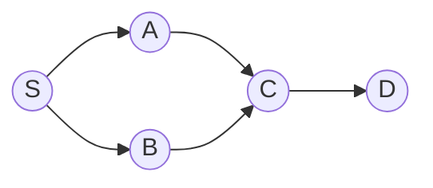

# Graphs (BFS / DFS)

> [!TIP] Say this first
> "Almost every graph problem is `adjacency list + visited`. BFS gives shortest paths on **unweighted** graphs; DFS gives connectivity, cycles, and topological order. Add a priority queue and it's Dijkstra." Stating the representation and the traversal choice up front is half the signal.

Grids, dependency DAGs, and social graphs are the same abstraction. The interview skill is choosing the traversal, tracking `visited` correctly, and knowing the four escalations: BFS → Dijkstra (weights), DFS → topo-sort / cycle detection, union of components → [Union-Find](#/coding/union-find).

## When to reach for which traversal

| Cue | Use |
| --- | --- |
| Shortest path, **unit** edge weights | BFS (level count) |
| Shortest path, **non-negative** weights | Dijkstra (heap) |
| Count connected components / flood fill | DFS or BFS (or Union-Find) |
| "Prerequisites," "build order," ordering under constraints | Topological sort |
| Detect a cycle (directed) | DFS 3-color, or Kahn "did all nodes emit?" |
| Detect a cycle (undirected) | Union-Find, or DFS ignoring the parent edge |
| Grid islands / regions / rotting spread | DFS / multi-source BFS on the grid |

## Representations

```python
from collections import defaultdict, deque

# Adjacency list — default choice, O(V+E) space, fast neighbor iteration.
graph = defaultdict(list)
for u, v in edges:
    graph[u].append(v)
    graph[v].append(u)          # drop this line for a directed graph

# Grid: implicit graph, neighbors are the 4 (or 8) offsets.
DIRS = [(1, 0), (-1, 0), (0, 1), (0, -1)]
```

Adjacency **matrix** only when the graph is dense or you need `O(1)` edge lookups; it costs `O(V²)` space.

## BFS and DFS templates


BFS from `S` discovers layers `{S} → {A,B} → {C} → {D}` — the layer index is the shortest unit-distance.

```python
def bfs_shortest(graph, src, dst):
    q = deque([(src, 0)])
    seen = {src}
    while q:
        node, dist = q.popleft()
        if node == dst:
            return dist
        for nxt in graph[node]:
            if nxt not in seen:
                seen.add(nxt)                 # mark on ENQUEUE, not dequeue
                q.append((nxt, dist + 1))
    return -1

def dfs(graph, node, seen):
    seen.add(node)
    for nxt in graph[node]:
        if nxt not in seen:
            dfs(graph, nxt, seen)
```

> [!WARNING] Mark-on-enqueue
> In BFS, add to `seen` when you **push**, not when you pop. Marking on pop lets the same node enter the queue many times → blow-up and, on weighted variants, wrong answers.

## Representative problems

### 1. Number of Islands (Medium) — flood fill
Each unvisited land cell launches a DFS that sinks its whole component.

```python
def num_islands(grid: list[list[str]]) -> int:
    rows, cols = len(grid), len(grid[0])
    def sink(r, c):
        if not (0 <= r < rows and 0 <= c < cols) or grid[r][c] != "1":
            return
        grid[r][c] = "0"                       # mark visited in place
        for dr, dc in DIRS:
            sink(r + dr, c + dc)
    count = 0
    for r in range(rows):
        for c in range(cols):
            if grid[r][c] == "1":
                count += 1
                sink(r, c)
    return count
```
`O(R·C)` time. If mutating the grid is disallowed, keep a separate `visited` set.

### 2. Rotting Oranges (Medium) — multi-source BFS
Seed the queue with **all** rotten cells and expand one minute per layer.

```python
def oranges_rotting(grid: list[list[int]]) -> int:
    rows, cols = len(grid), len(grid[0])
    q, fresh = deque(), 0
    for r in range(rows):
        for c in range(cols):
            if grid[r][c] == 2: q.append((r, c))
            elif grid[r][c] == 1: fresh += 1
    minutes = 0
    while q and fresh:
        for _ in range(len(q)):
            r, c = q.popleft()
            for dr, dc in DIRS:
                nr, nc = r + dr, c + dc
                if 0 <= nr < rows and 0 <= nc < cols and grid[nr][nc] == 1:
                    grid[nr][nc] = 2
                    fresh -= 1
                    q.append((nr, nc))
        minutes += 1
    return minutes if fresh == 0 else -1
```
`O(R·C)`. Multi-source BFS is the "spread simultaneously from many origins" pattern — also *walls and gates*, *shortest bridge*.

### 3. Course Schedule II — topological sort (Medium)
Kahn's algorithm: repeatedly emit an in-degree-0 node. If you can't emit them all, there's a cycle.

```python
def find_order(n: int, prereqs: list[list[int]]) -> list[int]:
    graph = defaultdict(list)
    indeg = [0] * n
    for course, need in prereqs:
        graph[need].append(course)              # need -> course
        indeg[course] += 1
    q = deque(c for c in range(n) if indeg[c] == 0)
    order = []
    while q:
        cur = q.popleft()
        order.append(cur)
        for nxt in graph[cur]:
            indeg[nxt] -= 1
            if indeg[nxt] == 0:
                q.append(nxt)
    return order if len(order) == n else []      # incomplete ⇒ cycle
```
`O(V+E)`. The `len(order) == n` check *is* the cycle detector. The DFS alternative uses 3-color marking (white/gray/black); a back-edge to a gray node is a cycle.

### 4. Cycle detection in a directed graph (DFS, 3-color)
```python
def has_cycle(n, graph):
    state = [0] * n                 # 0 unvisited, 1 in-stack, 2 done
    def dfs(u):
        if state[u] == 1: return True    # back-edge → cycle
        if state[u] == 2: return False
        state[u] = 1
        if any(dfs(v) for v in graph[u]): return True
        state[u] = 2
        return False
    return any(dfs(u) for u in range(n) if state[u] == 0)
```

### 5. Network Delay Time — Dijkstra (Medium)
Non-negative weighted shortest paths from a source; a min-heap always finalizes the closest unsettled node.

```python
import heapq

def network_delay_time(times, n, k) -> int:
    graph = defaultdict(list)
    for u, v, w in times:
        graph[u].append((v, w))
    dist = {}
    pq = [(0, k)]                              # (distance, node)
    while pq:
        d, u = heapq.heappop(pq)
        if u in dist:                          # already finalized
            continue
        dist[u] = d
        for v, w in graph[u]:
            if v not in dist:
                heapq.heappush(pq, (d + w, v))
    return max(dist.values()) if len(dist) == n else -1
```
`O(E log V)`. Negative edges break Dijkstra → use **Bellman-Ford** `O(VE)`; all-pairs → **Floyd-Warshall** `O(V³)`.

## Variations to name

- **0-1 BFS:** edge weights in `{0,1}` → deque, push 0-cost to front, `O(V+E)` instead of Dijkstra.
- **A\*:** Dijkstra + admissible heuristic for grid/geometry shortest paths.
- **Bidirectional BFS:** search from both ends (Word Ladder) to roughly square-root the frontier.
- **Union-Find:** dynamic connectivity / MST — cross-link when edges arrive online.
- **SCC / bridges:** Tarjan/Kosaraju for advanced-graph rounds.

## Pitfalls

- **Directed vs undirected** edge insertion (one line vs two).
- **Marking visited late** in BFS (see warning) or forgetting it entirely → infinite loops on cycles.
- **Wrong edge direction** in topo-sort (`need → course`); draw the DAG.
- **Recursion depth** on large grids → convert DFS to an explicit stack or use BFS.
- **Dijkstra with negative weights** — silently wrong; recognize and switch algorithms.
- **Rebuilding neighbors each step** in Word-Ladder-style problems → precompute a pattern map to avoid `O(N²)`.

## Q&A

<details class="qa"><summary>BFS or DFS for shortest path — and when is neither enough?</summary>
<div class="qa-body">

**Short:** BFS for unit weights (level = distance). For weighted non-negative graphs, Dijkstra. Negative edges → Bellman-Ford; negative cycles → detect and reject.

**Deep:** BFS is correct for unit weights precisely because it settles nodes in non-decreasing distance order. Add arbitrary non-negative weights and that order needs a priority queue (Dijkstra), which is the same greedy invariant with a heap. If a `{0,1}` weighting sneaks in, 0-1 BFS with a deque beats Dijkstra's `log` factor.
</div></details>

<details class="qa"><summary>Two ways to detect a cycle — when do you use each?</summary>
<div class="qa-body">

**Short:** Directed graph → DFS 3-coloring (back-edge to a gray node) or Kahn (if topo-order can't cover all nodes). Undirected → Union-Find (union fails on an existing set) or DFS ignoring the edge back to the parent.

**Deep:** Kahn gives cycle detection *and* a valid order for free, so I default to it for scheduling problems. Union-Find shines when edges arrive online or you also need component counts. The undirected DFS must skip the immediate parent, else every edge looks like a 2-cycle.
</div></details>

**Follow-ups you should expect**
- "Reconstruct the path, not just its length." → store `parent[]` and backtrack.
- "Edges have weights now." → Dijkstra; then "some are negative" → Bellman-Ford.
- "Millions of nodes." → iterative DFS, adjacency list, avoid recursion limits.
- "Is Union-Find better here?" → yes for dynamic connectivity / MST; explain the trade-off.

## Cheat-sheet

| Fact | Detail |
| --- | --- |
| Default representation | adjacency list, `O(V+E)` |
| BFS | unweighted shortest path; mark on enqueue |
| DFS | connectivity, cycles, topo-order |
| Topological sort | Kahn (in-degree queue) or DFS post-order reversed |
| Directed cycle | 3-color DFS, or Kahn emits `< V` nodes |
| Undirected cycle | Union-Find, or DFS skipping parent |
| Dijkstra | non-negative weights, `O(E log V)` |
| Bellman-Ford / Floyd | negative edges `O(VE)` / all-pairs `O(V³)` |
| Multi-source BFS | seed queue with all sources (spread) |
| Grid | implicit graph, 4/8 direction offsets |

**Related:** [Trees & BSTs](#/coding/trees-bst) · [Union-Find](#/coding/union-find) · [Heaps & Priority Queues](#/coding/heap-priority-queue) · back to [The Core Patterns](#/coding/patterns) and [Coding Round Strategy](#/coding/strategy).
