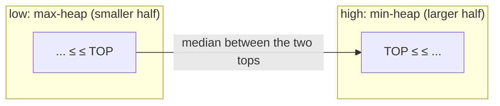

# Heaps & Priority Queues

> [!TIP] 이 말부터 시작하세요
> "문제가 전체 정렬이 아니라 **k번째 / top-k / 다음으로 가장 극단적인** 원소에 관심을 둘 때, heap이 `O(log n)` push/pop과 `O(1)` peek을 줍니다." 전체 순서가 필요 없고 극단값만 필요하다는 걸 알아채는 것이 `O(n log n)` 정렬을 `O(n log k)`로 바꾸는 통찰입니다.

이진 heap은 root에 min(혹은 max)을 유지합니다. Python의 `heapq`는 **min-heap 전용**입니다 — max-heap이 필요하면 키를 음수화하거나 `(-key, ...)`로 저장하세요. 세 가지 관용구가 대부분의 면접을 커버합니다: **top-k**, **merge-k**, 그리고 스트리밍 median을 위한 **two-heaps**.

## 언제 꺼내 쓰나

| 신호 | Heap 관용구 |
| --- | --- |
| "k largest / smallest / most frequent" | 크기 `k`의 bounded heap |
| "스트림에서 k번째로 큰 값" | 크기 `k`의 min-heap, root peek |
| "k개의 정렬된 list / stream 병합" | list당 원소 하나로 된 heap |
| "running median" / 두 절반 균형 | max-heap + min-heap |
| "항상 가장 긴급한 / 가장 싼 것을 다음에 처리" | priority queue (Dijkstra, 스케줄링) |
| "작업 / 회의실 스케줄링" | end-time 혹은 가용성의 heap |

## `heapq` 관용구

```python
import heapq

h = []
heapq.heappush(h, x)              # O(log n)
smallest = heapq.heappop(h)       # O(log n)
peek = h[0]                       # O(1), min
heapq.heapify(arr)                # O(n) in place — cheaper than n pushes

# Max-heap: negate.
heapq.heappush(h, -x); top = -heapq.heappop(h)

# Tuple keys sort lexicographically; add a tiebreaker to avoid comparing payloads.
heapq.heappush(h, (priority, unique_id, payload))

# One-shot top-k without a manual loop:
heapq.nlargest(k, data)           # O(n log k)
heapq.nsmallest(k, data, key=fn)
```

> [!WARNING] 크기-k heap의 방향은 반대입니다
> **k largest**를 유지하려면 **크기 k의 min-heap**을 쓰고 `k`를 초과하면 pop하세요: 당첨자들 중 가장 작은 것이 root에 앉아 언제든 쫓겨날 준비가 됩니다. 여기서 max-heap을 쓰는 게 고전적인 실수입니다.

## Practice — 직접 구현하고 실행·테스트

> [!TIP] 이 섹션 사용법
> 아래 여러 문제에는 **라이브 Python 에디터**가 있습니다. 직접 풀이를 작성하고 **▶ Run tests**를 누르면 어떤 케이스가 통과하는지 보여줍니다. 막히면 참고용 **Solution**을 열어볼 수 있지만, 먼저 직접 시도하세요 — 그 씨름이 곧 연습입니다. 첫 Run에서 작은 Python 런타임(~10 MB)을 내려받고, 이후 실행은 즉시입니다. 본인 에디터가 편하면 각 lab의 **LeetCode** 링크로 이동하세요.

상태를 가진 스트림 문제(Kth Largest, Median Finder)와 linked-list 병합은 정적 참고용으로 남기고, 순수 함수 문제 두 개는 라이브 lab입니다.

### 1. Kth Largest in a Stream (Easy)
정확히 `k`개의 원소를 유지합니다; root가 답입니다.

```python
class KthLargest:
    def __init__(self, k: int, nums: list[int]):
        self.k = k
        self.h = nums[:]
        heapq.heapify(self.h)
        while len(self.h) > k:
            heapq.heappop(self.h)

    def add(self, val: int) -> int:
        heapq.heappush(self.h, val)
        if len(self.h) > self.k:
            heapq.heappop(self.h)
        return self.h[0]
```
`add`는 `O(log k)`, 공간 `O(k)`.

### 2. Top K Frequent Elements <span class="badge badge-med">Medium</span> · [LeetCode ↗](https://leetcode.com/problems/top-k-frequent-elements/)
개수를 센 뒤, 빈도를 키로 하는 크기-`k` min-heap을 유지합니다.

<div class="widget" data-widget="code">
<script type="application/json" class="code-config">
{"func":"top_k_frequent","starter":"from collections import Counter\nimport heapq\n\ndef top_k_frequent(nums: list[int], k: int) -> list[int]:\n    # count, then keep a size-k min-heap keyed by frequency\n    pass","tests":[{"args":[[1,1,1,2,2,3],2],"expect":[1,2],"unordered":true},{"args":[[1],1],"expect":[1],"unordered":true},{"args":[[4,4,4,5,5,6],2],"expect":[4,5],"unordered":true},{"args":[[7,7,8,8,9],3],"expect":[7,8,9],"unordered":true}],"solution":"from collections import Counter\nimport heapq\n\ndef top_k_frequent(nums: list[int], k: int) -> list[int]:\n    freq = Counter(nums)\n    if not 0 <= k <= len(freq):\n        raise ValueError('k must be between 0 and the number of distinct values')\n    h = []\n    for num, cnt in freq.items():\n        heapq.heappush(h, (cnt, -num, num))\n        if len(h) > k:\n            heapq.heappop(h)\n    return sorted((num for _, _, num in h), key=lambda num: (-freq[num], num))"}
</script>
</div>

`O(n log k)`. **대안을 말하세요:** 빈도별 bucket sort는 `O(n)`입니다 — `k`가 `n`에 가까울 때 엄격히 낫습니다. trade-off를 언급하는 것이 신호입니다.

### 3. K Closest Points to Origin <span class="badge badge-med">Medium</span> · [LeetCode ↗](https://leetcode.com/problems/k-closest-points-to-origin/)
제곱 거리에 대한 크기-`k` max-heap (`sqrt` 불필요).

<div class="widget" data-widget="code">
<script type="application/json" class="code-config">
{"func":"k_closest","starter":"import heapq\n\ndef k_closest(points: list[list[int]], k: int) -> list[list[int]]:\n    # size-k max-heap on squared distance (negate); no sqrt needed\n    pass","tests":[{"args":[[[1,3],[-2,2]],1],"expect":[[-2,2]],"unordered":true},{"args":[[[3,3],[5,-1],[-2,4]],2],"expect":[[3,3],[-2,4]],"unordered":true},{"args":[[[1,1],[2,2],[3,3]],1],"expect":[[1,1]],"unordered":true},{"args":[[[0,1],[1,0]],2],"expect":[[0,1],[1,0]],"unordered":true}],"solution":"import heapq\n\ndef k_closest(points: list[list[int]], k: int) -> list[list[int]]:\n    if not 0 <= k <= len(points):\n        raise ValueError('k must be between 0 and len(points)')\n    h = []\n    for x, y in points:\n        heapq.heappush(h, (-(x*x + y*y), x, y))\n        if len(h) > k:\n            heapq.heappop(h)\n    return [[x, y] for _, x, y in sorted(h, key=lambda item: (-item[0], item[1], item[2]))]"}
</script>
</div>

`O(n log k)` 시간, `O(k)` 공간. 정렬되지 않은 *집합*만 필요하면 Quickselect가 평균 `O(n)`을 줍니다.

### 4. Merge k Sorted Lists (Hard) — merge-k 관용구
list당 노드 하나를 push; 전역 min을 pop하고, 그 후속 노드를 push합니다.

```python
def merge_k_lists(lists):
    h = []
    for i, node in enumerate(lists):
        if node:
            heapq.heappush(h, (node.val, i, node))   # i breaks val ties
    dummy = tail = ListNode()
    while h:
        _, i, node = heapq.heappop(h)
        tail.next = node
        tail = node
        if node.next:
            heapq.heappush(h, (node.next.val, i, node.next))
    return dummy.next
```
전체 노드 `N`개에 대해 `O(N log k)`. 인덱스 `i`는 값이 동점일 때 Python이 `ListNode` 객체를 비교하지 못하게 막습니다 — 없으면 `TypeError`가 납니다.

### 5. Find Median from Data Stream (Hard) — two heaps
max-heap이 작은 절반을, min-heap이 큰 절반을 담고; 크기를 1 이내로 균형 맞춥니다.



```python
class MedianFinder:
    def __init__(self):
        self.low = []    # max-heap (store negatives): smaller half
        self.high = []   # min-heap: larger half

    def addNum(self, num: int) -> None:
        heapq.heappush(self.low, -num)
        heapq.heappush(self.high, -heapq.heappop(self.low))   # funnel through
        if len(self.high) > len(self.low):                    # rebalance
            heapq.heappush(self.low, -heapq.heappop(self.high))

    def findMedian(self) -> float:
        if len(self.low) > len(self.high):
            return float(-self.low[0])
        return (-self.low[0] + self.high[0]) / 2
```
`addNum` `O(log n)`, `findMedian` `O(1)`. 불변식: **`low`의 모든 원소 ≤ `high`의 모든 원소**; push 후 shift하는 이 춤사위가 이를 자동으로 유지합니다.

## 언급할 변형

- **Dijkstra / Prim:** `(cost, node)`의 priority queue가 둘 다의 심장부입니다 — [Graphs](#/coding/graphs-bfs-dfs)와 교차 연결.
- **Task Scheduler / Meeting Rooms II:** end-time의 heap, [Greedy & Intervals](#/coding/greedy-intervals)와 겹침.
- **Sliding-window median / max:** lazy deletion을 쓴 two heap, 혹은 max의 경우 monotonic deque.
- **정렬 없는 Top-k:** 정렬이 필요 없을 때 Quickselect 평균 `O(n)`이 heap을 이깁니다.
- **k-way external merge:** merge-k 관용구를 디스크로 확장 — data-pipeline 질문과 관련.

## 함정

- **`heapq`는 min 전용** — max-heap 동작을 위해 음수화하는 걸 잊음.
- 동점 시 **payload 비교**(노드, dict) → monotonic tiebreaker id를 추가.
- **`heapify` vs n번 push:** `heapify`는 `O(n)`, 하나씩 push는 `O(n log n)`.
- **크기-k 방향 반대** (top-k largest에 min-heap — 경고 참조).
- **Median heap이 균형을 잃음** — 매 삽입마다 rebalance하고 ≤ 불변식을 assert.
- **전체 정렬이 더 간단한데 heap을 꺼냄** — 어차피 전부 정렬해야 하면 그냥 정렬하세요.

## Q&A

<details class="qa"><summary>Top-k: heap, sort, quickselect 중 무엇?</summary>
<div class="qa-body">

**짧게:** 크기 `k`의 heap은 `O(n log k)`이고 스트리밍에 친화적입니다. 전체 정렬은 `O(n log n)` — `k ≈ n`이거나 데이터가 작을 때 괜찮고 가장 간단합니다. Quickselect는 k개 원소가 필요하되 정렬은 필요 없고 전부 메모리에 있을 때 평균 `O(n)`입니다.

**깊게:** 결정 요인은 (1) 스트리밍 vs 배치 — heap은 무제한 스트림을 `O(k)` 메모리로 처리; (2) 출력이 정렬되어야 하는지 — quickselect는 정렬되지 않은 partition을 반환; (3) `n` 대비 `k`. 저는 하나로 기본값을 정하기보다 이 trade-off를 언급하는데, "옳은" 답은 면접관이 설정하는 제약에 달렸기 때문입니다.
</div></details>

<details class="qa"><summary>Two-heap median은 왜 동작하고, 불변식은 무엇인가요?</summary>
<div class="qa-body">

**짧게:** 데이터를 median에서 나눕니다: max-heap이 아래 절반(top이 작은 값들 중 가장 큼)을, min-heap이 위 절반(top이 큰 값들 중 가장 작음)을 담습니다. median은 한쪽 top(홀수 개수)이거나 둘의 평균(짝수)입니다.

**깊게:** 불변식은 `max(low) ≤ min(high)`와 `|len(low) - len(high)| ≤ 1`입니다. 각 삽입은 `low`에 push하고, 즉시 `low`의 top을 `high`로 옮기고(순서 보장), 그다음 크기를 rebalance합니다. 두 연산 모두 `O(log n)`; 읽기는 `O(1)`. 크기 비율을 조정하면 임의의 스트리밍 quantile로 일반화됩니다.
</div></details>

**예상되는 후속 질문**
- "`O(n)`으로 하세요." → bucket sort(top-k-frequent) 혹은 quickselect.
- "스트림이 무제한입니다 — 메모리는?" → 크기-`k` heap은 `O(k)`.
- "Sliding-window median." → 만료된 원소를 lazy deletion하는 two heap.
- "`heapify`가 왜 `O(n log n)`이 아니라 `O(n)`인가요?" → bottom-up sift-down; 합이 telescope됨.

## Cheat-sheet

| 사실 | 세부 |
| --- | --- |
| `heapq` | min-heap 전용; max는 키를 음수화 |
| Push / pop / peek | `O(log n)` / `O(log n)` / `O(1)` |
| `heapify` | `O(n)`, `n`번 push를 이김 |
| Top-k largest | **min-heap** 크기 `k`, root evict |
| `nlargest`/`nsmallest` | `O(n log k)` 한 줄짜리 |
| Tie-break | payload가 비교되지 않도록 unique id 추가 |
| Merge-k | heap에 list당 원소 하나, `O(N log k)` |
| Streaming median | max-heap (low) + min-heap (high), 균형 |
| Priority queue 용도 | Dijkstra, Prim, 스케줄링 |
| 대안 | sort (`k≈n`) 혹은 quickselect (`O(n)` 정렬 없음) |

**관련:** [Graphs (BFS/DFS)](#/coding/graphs-bfs-dfs) · [Greedy & Intervals](#/coding/greedy-intervals) · [Hashing](#/coding/hashing) · 다시 [The Core Patterns](#/coding/patterns)와 [Coding Round Strategy](#/coding/strategy)로.
