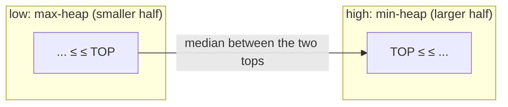

# Heaps & Priority Queues

> [!TIP] Say this first
> "When the problem cares about **the k-th / top-k / next-most-extreme** element but not the full sort, a heap gives me `O(log n)` push/pop and `O(1)` peek." Recognizing you don't need a total order — just the extremes — is the insight that turns an `O(n log n)` sort into `O(n log k)`.

A binary heap keeps the min (or max) at the root. Python's `heapq` is a **min-heap only** — negate keys or store `(-key, ...)` for a max-heap. Three idioms cover most interviews: **top-k**, **merge-k**, and **two-heaps for a streaming median**.

## When to reach for it

| Cue | Heap idiom |
| --- | --- |
| "k largest / smallest / most frequent" | bounded heap of size `k` |
| "k-th largest in a stream" | min-heap of size `k`, peek root |
| "merge k sorted lists / streams" | heap of one element per list |
| "running median" / balance two halves | max-heap + min-heap |
| "always process the most urgent / cheapest next" | priority queue (Dijkstra, scheduling) |
| "schedule tasks / meeting rooms" | heap of end-times or availability |

## `heapq` idioms

```python
import heapq

h = []
heapq.heappush(h, x)              # O(log n)
smallest = heapq.heappop(h)       # O(log n)
peek = h[0]                       # O(1), min
heapq.heapify(arr)                # O(n) in place — cheaper than n pushes

# Max-heap: negate.
heapq.heappush(h, -x); top = -heapq.heappop(h)

# Tuple keys sort lexicographically; add a tiebreaker to avoid comparing payloads.
heapq.heappush(h, (priority, unique_id, payload))

# One-shot top-k without a manual loop:
heapq.nlargest(k, data)           # O(n log k)
heapq.nsmallest(k, data, key=fn)
```

> [!WARNING] Size-k heap direction is inverted
> To keep the **k largest**, use a **min-heap of size k** and pop when it exceeds `k`: the smallest of your winners sits at the root, ready to be evicted. Using a max-heap here is the classic mistake.

## Practice — implement, run, test

> [!TIP] How to use this section
> Several problems below have a **live Python editor**. Write your solution, hit **▶ Run tests**, and see which cases pass. Stuck? Reveal a reference **Solution** — but attempt first; the struggle *is* the practice. The first Run downloads a small Python runtime (~10 MB); later runs are instant. Prefer your own editor? Each lab links out to **LeetCode**.

The stateful stream problems (Kth Largest, Median Finder) and the linked-list merge stay as static references; the two pure-function problems are live labs.

### 1. Kth Largest in a Stream (Easy)
Maintain exactly `k` elements; the root is the answer.

```python
class KthLargest:
    def __init__(self, k: int, nums: list[int]):
        self.k = k
        self.h = nums[:]
        heapq.heapify(self.h)
        while len(self.h) > k:
            heapq.heappop(self.h)

    def add(self, val: int) -> int:
        heapq.heappush(self.h, val)
        if len(self.h) > self.k:
            heapq.heappop(self.h)
        return self.h[0]
```
`add` is `O(log k)`, space `O(k)`.

### 2. Top K Frequent Elements <span class="badge badge-med">Medium</span> · [LeetCode ↗](https://leetcode.com/problems/top-k-frequent-elements/)
Count, then keep a size-`k` min-heap keyed by frequency.

<div class="widget" data-widget="code">
<script type="application/json" class="code-config">
{"func":"top_k_frequent","starter":"from collections import Counter\nimport heapq\n\ndef top_k_frequent(nums: list[int], k: int) -> list[int]:\n    # count, then keep a size-k min-heap keyed by frequency\n    pass","tests":[{"args":[[1,1,1,2,2,3],2],"expect":[1,2],"unordered":true},{"args":[[1],1],"expect":[1],"unordered":true},{"args":[[4,4,4,5,5,6],2],"expect":[4,5],"unordered":true},{"args":[[7,7,8,8,9],3],"expect":[7,8,9],"unordered":true}],"solution":"from collections import Counter\nimport heapq\n\ndef top_k_frequent(nums: list[int], k: int) -> list[int]:\n    freq = Counter(nums)\n    h = []\n    for num, cnt in freq.items():\n        heapq.heappush(h, (cnt, num))\n        if len(h) > k:\n            heapq.heappop(h)\n    return [num for _, num in h]"}
</script>
</div>

`O(n log k)`. **Say the alternative:** bucket sort by frequency is `O(n)` — strictly better when `k` approaches `n`. Naming the trade-off is the signal.

### 3. K Closest Points to Origin <span class="badge badge-med">Medium</span> · [LeetCode ↗](https://leetcode.com/problems/k-closest-points-to-origin/)
Size-`k` max-heap on squared distance (no `sqrt` needed).

<div class="widget" data-widget="code">
<script type="application/json" class="code-config">
{"func":"k_closest","starter":"import heapq\n\ndef k_closest(points: list[list[int]], k: int) -> list[list[int]]:\n    # size-k max-heap on squared distance (negate); no sqrt needed\n    pass","tests":[{"args":[[[1,3],[-2,2]],1],"expect":[[-2,2]],"unordered":true},{"args":[[[3,3],[5,-1],[-2,4]],2],"expect":[[3,3],[-2,4]],"unordered":true},{"args":[[[1,1],[2,2],[3,3]],1],"expect":[[1,1]],"unordered":true},{"args":[[[0,1],[1,0]],2],"expect":[[0,1],[1,0]],"unordered":true}],"solution":"import heapq\n\ndef k_closest(points: list[list[int]], k: int) -> list[list[int]]:\n    h = []\n    for x, y in points:\n        heapq.heappush(h, (-(x*x + y*y), x, y))\n        if len(h) > k:\n            heapq.heappop(h)\n    return [[x, y] for _, x, y in h]"}
</script>
</div>

`O(n log k)` time, `O(k)` space. Quickselect gives `O(n)` average if only the *set* (unordered) is needed.

### 4. Merge k Sorted Lists (Hard) — merge-k idiom
Push one node per list; pop the global min, push its successor.

```python
def merge_k_lists(lists):
    h = []
    for i, node in enumerate(lists):
        if node:
            heapq.heappush(h, (node.val, i, node))   # i breaks val ties
    dummy = tail = ListNode()
    while h:
        _, i, node = heapq.heappop(h)
        tail.next = node
        tail = node
        if node.next:
            heapq.heappush(h, (node.next.val, i, node.next))
    return dummy.next
```
`O(N log k)` for `N` total nodes. The index `i` prevents Python from comparing `ListNode` objects on a value tie — without it you get `TypeError`.

### 5. Find Median from Data Stream (Hard) — two heaps
A max-heap holds the smaller half, a min-heap the larger half; keep sizes balanced within 1.



```python
class MedianFinder:
    def __init__(self):
        self.low = []    # max-heap (store negatives): smaller half
        self.high = []   # min-heap: larger half

    def addNum(self, num: int) -> None:
        heapq.heappush(self.low, -num)
        heapq.heappush(self.high, -heapq.heappop(self.low))   # funnel through
        if len(self.high) > len(self.low):                    # rebalance
            heapq.heappush(self.low, -heapq.heappop(self.high))

    def findMedian(self) -> float:
        if len(self.low) > len(self.high):
            return float(-self.low[0])
        return (-self.low[0] + self.high[0]) / 2
```
`addNum` `O(log n)`, `findMedian` `O(1)`. Invariant: **every element in `low` ≤ every element in `high`**; the push-then-shift dance maintains it automatically.

## Variations to name

- **Dijkstra / Prim:** a priority queue of `(cost, node)` is the beating heart of both — cross-link [Graphs](#/coding/graphs-bfs-dfs).
- **Task Scheduler / Meeting Rooms II:** heap of end-times, overlaps with [Greedy & Intervals](#/coding/greedy-intervals).
- **Sliding-window median / max:** two heaps with lazy deletion, or a monotonic deque for the max case.
- **Top-k without order:** Quickselect `O(n)` average beats a heap when you don't need them sorted.
- **k-way external merge:** the merge-k idiom scaled to disk — relevant to data-pipeline questions.

## Pitfalls

- **`heapq` is min-only** — forgetting to negate for max-heap behavior.
- **Comparing payloads** (nodes, dicts) on tie → add a monotonic tiebreaker id.
- **`heapify` vs n pushes:** `heapify` is `O(n)`, pushing one-by-one is `O(n log n)`.
- **Size-k direction inverted** (min-heap for top-k largest — see warning).
- **Median heaps drifting out of balance** — rebalance every insert and assert the ≤ invariant.
- **Reaching for a heap when a full sort is simpler** — if you need everything sorted anyway, just sort.

## Q&A

<details class="qa"><summary>Top-k: heap, sort, or quickselect?</summary>
<div class="qa-body">

**Short:** Heap of size `k` is `O(n log k)` and streaming-friendly. Full sort is `O(n log n)` — fine and simplest when `k ≈ n` or data is small. Quickselect is `O(n)` average when I need the k elements but not in sorted order and have them all in memory.

**Deep:** The deciding factors are (1) streaming vs batch — a heap handles unbounded streams in `O(k)` memory; (2) whether output must be ordered — quickselect returns an unordered partition; (3) `k` relative to `n`. I state these trade-offs rather than defaulting to one, because the "right" answer depends on the constraints the interviewer sets.
</div></details>

<details class="qa"><summary>Why does the two-heap median work, and what's the invariant?</summary>
<div class="qa-body">

**Short:** Split the data at the median: a max-heap holds the lower half (its top is the largest small value), a min-heap holds the upper half (its top is the smallest large value). The median is one top (odd count) or the average of both (even).

**Deep:** The invariant is `max(low) ≤ min(high)` and `|len(low) - len(high)| ≤ 1`. Each insert pushes to `low`, immediately moves `low`'s top to `high` (guaranteeing the ordering), then rebalances sizes. Both operations are `O(log n)`; the read is `O(1)`. Generalizes to any streaming quantile by tuning the size ratio.
</div></details>

**Follow-ups you should expect**
- "Do it in `O(n)`." → bucket sort (top-k-frequent) or quickselect.
- "The stream is unbounded — memory?" → size-`k` heap is `O(k)`.
- "Sliding-window median." → two heaps with lazy deletion of expired elements.
- "How is `heapify` `O(n)` and not `O(n log n)`?" → bottom-up sift-down; the sum telescopes.

## Cheat-sheet

| Fact | Detail |
| --- | --- |
| `heapq` | min-heap only; negate keys for max |
| Push / pop / peek | `O(log n)` / `O(log n)` / `O(1)` |
| `heapify` | `O(n)`, beats `n` pushes |
| Top-k largest | **min-heap** of size `k`, evict root |
| `nlargest`/`nsmallest` | `O(n log k)` one-liners |
| Tie-break | add unique id so payloads aren't compared |
| Merge-k | one element per list in the heap, `O(N log k)` |
| Streaming median | max-heap (low) + min-heap (high), balanced |
| Priority queue uses | Dijkstra, Prim, scheduling |
| Alternative | sort (`k≈n`) or quickselect (`O(n)` unordered) |

**Related:** [Graphs (BFS/DFS)](#/coding/graphs-bfs-dfs) · [Greedy & Intervals](#/coding/greedy-intervals) · [Hashing](#/coding/hashing) · back to [The Core Patterns](#/coding/patterns) and [Coding Round Strategy](#/coding/strategy).
