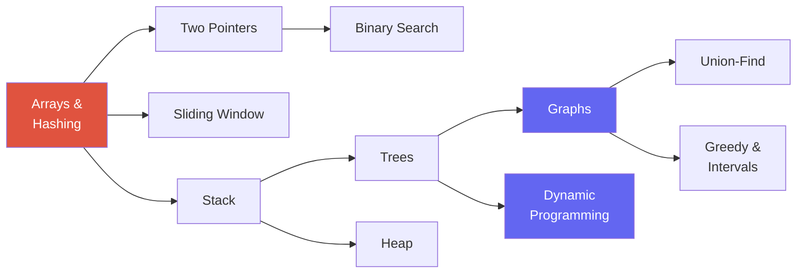

# The Core Patterns

> [!TIP] The thesis
> 문제를 암기하는 게 아닙니다 — **자주 재사용되는 pattern**을 체화하고, 각 pattern을 여러 문제에 적용한 다음, 처음 보는 문제의 구조를 빠르게 분류하는 연습입니다. 많은 코딩 면접 문제가 이 패턴들의 조합이나 변형이지만, 억지로 끼워 맞추기 전에 입력 제약·불변식·복잡도부터 확인하세요. 이 챕터가 **hub**입니다 — 여기서 시작해서 링크된 각 챕터를 반복 연습하세요.

테스트되는 능력은 *recognition*입니다. 문제가 주어지면 표면적인 **cue**("input is sorted", "top-k", "shortest path in an unweighted grid")에서 그것을 푸는 **pattern**으로 빠르게 매핑하고 싶어집니다. 아래는 그 lookup table, 그다음 각 pattern 챕터로 가는 card grid, 그리고 권장 연습 순서입니다.

## Cue → pattern lookup

문제 서술에서 cue를 읽고, pattern으로 점프하세요. sean-prashad "pattern hints" cheat sheet와 Grokking의 14 patterns에서 각색했습니다.

| If you see this cue… | Reach for | Chapter |
| --- | --- | --- |
| Input is **sorted**, find a pair / triplet summing to target | Two pointers | [Two Pointers](#/coding/two-pointers-sliding-window) |
| Input is **sorted / monotone**, find a boundary or target | Binary search | [Binary Search](#/coding/binary-search) |
| **Contiguous subarray/substring** with a constraint (max/min length, ≤ k distinct) | Sliding window | [Sliding Window](#/coding/two-pointers-sliding-window) |
| **Top / least / k-th** element, or "k largest" | Heap (size k) | [Heap](#/coding/heap-priority-queue) |
| **Median of a stream**, or two balanced halves | Two heaps | [Heap](#/coding/heap-priority-queue) |
| Seen-before? frequency? complement lookup? | Hash map / set | [Hashing](#/coding/hashing) |
| Subarray **sum/count = k** (with negatives) | Prefix sum + hash | [Hashing](#/coding/hashing) |
| **Nearest greater/smaller**, spans, histogram | Monotonic stack | [Stacks & Queues](#/coding/stack-queue) |
| **Nested / matched** structure (parens, calculator, decode) | Stack | [Stacks & Queues](#/coding/stack-queue) |
| **Level-by-level** / shortest path in **unweighted** graph or grid | BFS (queue) | [Graphs](#/coding/graphs-bfs-dfs) |
| **Connectivity / reachability / all paths**, cycle detection | DFS | [Graphs](#/coding/graphs-bfs-dfs) |
| **Ordering with prerequisites** (build order, course schedule) | Topological sort | [Graphs](#/coding/graphs-bfs-dfs) |
| **Dynamic connectivity**, "are these merged?", count components | Union-Find (DSU) | [Union-Find](#/coding/union-find) |
| Tree traversal, **BST** property, LCA, path sums | DFS/BFS on trees | [Trees & BSTs](#/coding/trees-bst) |
| **All permutations / subsets / combinations** | Backtracking | [Trees & BSTs](#/coding/trees-bst) |
| Reverse/merge/remove in a **linked list** | Pointer rewiring + dummy sentinel | [Two Pointers](#/coding/two-pointers-sliding-window) |
| **Count ways / min-max cost / can-you-reach**, overlapping subproblems | Dynamic programming | [Dynamic Programming](#/coding/dynamic-programming) |
| **Overlapping / merge intervals**, meeting rooms | Sort + sweep | [Greedy & Intervals](#/coding/greedy-intervals) |
| **Locally optimal → globally optimal**, "min number of…" | Greedy | [Greedy & Intervals](#/coding/greedy-intervals) |
| **Cycle in a linked list / find duplicate number** | Fast & slow pointers | [Two Pointers](#/coding/two-pointers-sliding-window) |
| In-place, O(1) extra space, reverse/rotate | Two pointers (in-place) | [Arrays & Strings](#/coding/arrays-strings) |

> [!NOTE] cue가 충돌할 때
> 어떤 문제는 여러 cue에 걸립니다(예: "longest substring without repeats" = sliding window *이면서* hashing). 괜찮습니다 — pattern은 조합됩니다. 바깥쪽 제어 구조(window)와 그것이 쓰는 helper(last-seen index의 hash)를 말하세요. Medium/Hard 문제에서는 조합이 기본입니다.

## The ~15 patterns

<a class="card" href="#/coding/arrays-strings">
🔢

Arrays & Strings

In-place 조작, prefix product, reversal 트릭. 워밍업이자 모든 것의 토대.
</a>
<a class="card" href="#/coding/two-pointers-sliding-window">
↔️

Two Pointers, Window & Linked List

양 끝 수렴, window 확장/축소, fast/slow와 pointer rewiring. 불변식으로 O(N)에 풉니다.
</a>
<a class="card" href="#/coding/hashing">
🗂️

Hashing

O(1) 조회를 사서 nested loop를 없앱니다. complement, frequency, prefix-sum count.
</a>
<a class="card" href="#/coding/stack-queue">
🥞

Stacks & Queues

nesting과 nearest-greater를 위한 LIFO; span과 window maxima를 위한 monotonic stack/deque.
</a>
<a class="card" href="#/coding/binary-search">
🎯

Binary Search

sorted array를 반으로 가르거나 — 임의의 monotone predicate에서 답을 binary-search.
</a>
<a class="card" href="#/coding/trees-bst">
🌳

Trees & BSTs

DFS/BFS traversal, BST invariant, subtree 재귀, 그리고 backtracking.
</a>
<a class="card" href="#/coding/graphs-bfs-dfs">
🕸️

Graphs (BFS/DFS)

Traversal, connected component, unweighted graph에서의 shortest path, topological sort.
</a>
<a class="card" href="#/coding/dynamic-programming">
🧮

Dynamic Programming

overlapping subproblem + optimal substructure. state를 정의하고, 그다음 transition을.
</a>
<a class="card" href="#/coding/heap-priority-queue">
⛰️

Heaps & Priority Queues

Top-k, k-way merge, running median. 극값에 O(log N)로 접근.
</a>
<a class="card" href="#/coding/union-find">
🔗

Union-Find

거의 O(1)인 dynamic connectivity: component, cycle detection, Kruskal's MST.
</a>
<a class="card" href="#/coding/greedy-intervals">
📏

Greedy & Intervals

sort 후 sweep; global optimum에 증명 가능하게 도달하는 local 선택.
</a>

## Where interviews concentrate

Blind 75 / NeetCode 150 분포에서 나오는 신호: **Trees + Dynamic Programming을 합치면 canonical 리스트의 대략 3분의 1**이고, **Graphs**의 비중이 큽니다. Arrays/Hashing/Two-Pointers는 가장 빈도 높은 *진입* pattern입니다. 시간을 이에 맞게 배분하세요 — tree, graph, DP에 깊이를 두는 게 시간당 효과가 가장 큽니다.

## Recommended drill order

각 주제가 다음 주제를 열어줍니다(NeetCode의 "roadmap-as-dependency-graph" 아이디어). **pattern당 5~10문제**를 easy → medium으로 풀고, 다음으로 넘어가기 전에 pattern마다 medium 최소 두 개를 *노트 없이* 다시 푸세요.

| Phase | Patterns | Why this order |
| --- | --- | --- |
| 1 · Foundations | [Arrays & Strings](#/coding/arrays-strings) → [Two Pointers, Sliding Window & Linked List](#/coding/two-pointers-sliding-window) → [Hashing](#/coding/hashing) | 가장 빈도 높은 진입 pattern; 배열 불변식과 pointer 조작을 먼저 굳힙니다. |
| 2 · Linear structures | [Stacks & Queues](#/coding/stack-queue) → [Binary Search](#/coding/binary-search) → [Heaps](#/coding/heap-priority-queue) | 핵심 자료구조; monotonic stack과 "search the answer"는 어디에나 나옵니다. |
| 3 · Non-linear | [Trees, BSTs & Backtracking](#/coding/trees-bst) → [Graphs (BFS/DFS)](#/coding/graphs-bfs-dfs) → [Union-Find](#/coding/union-find) | search tree에서 재귀·되돌리기를 굳힌 뒤 graph로 일반화. |
| 4 · Optimization | [Dynamic Programming](#/coding/dynamic-programming) → [Greedy & Intervals](#/coding/greedy-intervals) | 가장 어려움; building block으로서 앞의 구조가 필요합니다. |

> [!TIP] 반복 연습을 시작하기 전에
> [Coding Round Strategy](#/coding/strategy) 챕터를 먼저 읽으세요. pattern을 알아보는 건 절반의 싸움입니다. UMPIRE 루프를 돌리며 trade-off를 설명하는 게 나머지 절반이고 — research 루프가 가장 세게 채점하는 절반입니다.

## Cheat-sheet

| Cue | Pattern | Typical complexity |
| --- | --- | --- |
| sorted + pair/triplet | two pointers | O(N) / O(N²) |
| sorted + boundary/target | binary search | O(log N) |
| contiguous window + constraint | sliding window | O(N) |
| top-k / k-th | heap of size k | O(N log k) |
| running median | two heaps | O(log N)/op |
| complement / frequency / seen | hash map | O(N) |
| subarray sum = k | prefix sum + hash | O(N) |
| nearest greater/smaller | monotonic stack | O(N) |
| shortest path, unweighted | BFS | O(V+E) |
| prerequisites / ordering | topological sort | O(V+E) |
| dynamic connectivity | union-find | ~O(α(N)) |
| reverse/merge linked list | pointer rewiring + dummy | O(N) |
| subsets/permutations | backtracking | O(N2^N) / O(N·N!) |
| count ways / optimal cost | dynamic programming | O(states×transition) |
| merge/overlap intervals | sort + sweep | O(N log N) |

**Related:** [Coding Round Strategy](#/coding/strategy) · [ML coding round](#/ml-coding/intro) · [8-week prep plan](#/start/prep-plan)
