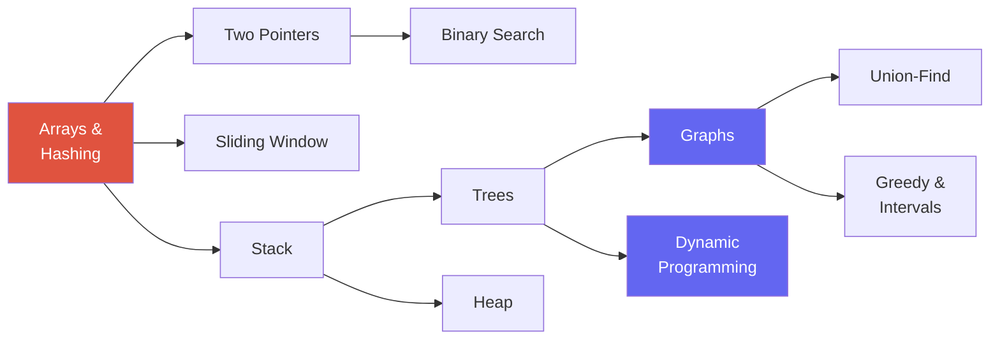

# The Core Patterns

> [!TIP] The thesis
> Do not memorize problems. Internalize **frequently reusable patterns**, apply each one across several problems, and practice classifying the structure of an unseen problem quickly. Many coding-interview questions combine or vary these patterns, but check input constraints, invariants, and complexity before forcing a fit. This chapter is the **hub**—start here, then drill each linked chapter.

The skill under test is *recognition*. Given a problem, you want a fast map from a surface **cue** ("input is sorted", "top-k", "shortest path in an unweighted grid") to the **pattern** that solves it. Below is that lookup table, then a card grid to every pattern chapter, then a recommended drill order.

## Cue → pattern lookup

Read the cue in the problem statement; jump to the pattern. Adapted from the sean-prashad "pattern hints" cheat sheet and Grokking's 14 patterns.

| If you see this cue… | Reach for | Chapter |
| --- | --- | --- |
| Input is **sorted**, find a pair / triplet summing to target | Two pointers | [Two Pointers](#/coding/two-pointers-sliding-window) |
| Input is **sorted / monotone**, find a boundary or target | Binary search | [Binary Search](#/coding/binary-search) |
| **Contiguous subarray/substring** with a constraint (max/min length, ≤ k distinct) | Sliding window | [Sliding Window](#/coding/two-pointers-sliding-window) |
| **Top / least / k-th** element, or "k largest" | Heap (size k) | [Heap](#/coding/heap-priority-queue) |
| **Median of a stream**, or two balanced halves | Two heaps | [Heap](#/coding/heap-priority-queue) |
| Seen-before? frequency? complement lookup? | Hash map / set | [Hashing](#/coding/hashing) |
| Subarray **sum/count = k** (with negatives) | Prefix sum + hash | [Hashing](#/coding/hashing) |
| **Nearest greater/smaller**, spans, histogram | Monotonic stack | [Stacks & Queues](#/coding/stack-queue) |
| **Nested / matched** structure (parens, calculator, decode) | Stack | [Stacks & Queues](#/coding/stack-queue) |
| **Level-by-level** / shortest path in **unweighted** graph or grid | BFS (queue) | [Graphs](#/coding/graphs-bfs-dfs) |
| **Connectivity / reachability / all paths**, cycle detection | DFS | [Graphs](#/coding/graphs-bfs-dfs) |
| **Ordering with prerequisites** (build order, course schedule) | Topological sort | [Graphs](#/coding/graphs-bfs-dfs) |
| **Dynamic connectivity**, "are these merged?", count components | Union-Find (DSU) | [Union-Find](#/coding/union-find) |
| Tree traversal, **BST** property, LCA, path sums | DFS/BFS on trees | [Trees & BSTs](#/coding/trees-bst) |
| **All permutations / subsets / combinations** | Backtracking | [Trees & BSTs](#/coding/trees-bst) |
| Reverse / merge / remove in a **linked list** | Pointer rewiring + dummy sentinel | [Two Pointers](#/coding/two-pointers-sliding-window) |
| **Count ways / min-max cost / can-you-reach**, overlapping subproblems | Dynamic programming | [Dynamic Programming](#/coding/dynamic-programming) |
| **Overlapping / merge intervals**, meeting rooms | Sort + sweep | [Greedy & Intervals](#/coding/greedy-intervals) |
| **Locally optimal → globally optimal**, "min number of…" | Greedy | [Greedy & Intervals](#/coding/greedy-intervals) |
| **Cycle in a linked list / find duplicate number** | Fast & slow pointers | [Two Pointers](#/coding/two-pointers-sliding-window) |
| In-place, O(1) extra space, reverse/rotate | Two pointers (in-place) | [Arrays & Strings](#/coding/arrays-strings) |

> [!NOTE] When two cues collide
> Some problems match several cues (e.g., "longest substring without repeats" = sliding window *and* hashing). That's fine — patterns compose. State the outer control structure (window) and the helper it uses (hash of last-seen index). Composition is the norm in Medium/Hard problems.

## The ~15 patterns

<a class="card" href="#/coding/arrays-strings">
🔢

Arrays & Strings

In-place manipulation, prefix products, reversal tricks. The warm-up and the base of everything.
</a>
<a class="card" href="#/coding/two-pointers-sliding-window">
↔️

Two Pointers, Window & Linked List

Converge from both ends, expand/shrink a window, or use fast/slow pointers and rewiring. Solve in O(N) through invariants.
</a>
<a class="card" href="#/coding/hashing">
🗂️

Hashing

Buy O(1) lookup to kill a nested loop. Complements, frequencies, prefix-sum counts.
</a>
<a class="card" href="#/coding/stack-queue">
🥞

Stacks & Queues

LIFO for nesting and nearest-greater; monotonic stack/deque for spans and window maxima.
</a>
<a class="card" href="#/coding/binary-search">
🎯

Binary Search

Halve a sorted array — or binary-search the answer on any monotone predicate.
</a>
<a class="card" href="#/coding/trees-bst">
🌳

Trees & BSTs

DFS/BFS traversal, BST invariants, recursion on subtrees, and backtracking.
</a>
<a class="card" href="#/coding/graphs-bfs-dfs">
🕸️

Graphs (BFS/DFS)

Traversal, connected components, shortest path in unweighted graphs, topological sort.
</a>
<a class="card" href="#/coding/dynamic-programming">
🧮

Dynamic Programming

Overlapping subproblems + optimal substructure. Define the state, then the transition.
</a>
<a class="card" href="#/coding/heap-priority-queue">
⛰️

Heaps & Priority Queues

Top-k, k-way merge, running median. O(log N) access to the extreme element.
</a>
<a class="card" href="#/coding/union-find">
🔗

Union-Find

Near-O(1) dynamic connectivity: components, cycle detection, Kruskal's MST.
</a>
<a class="card" href="#/coding/greedy-intervals">
📏

Greedy & Intervals

Sort then sweep; local choices that provably reach the global optimum.
</a>

## Where interviews concentrate

Signal from the Blind 75 / NeetCode 150 distributions: **Trees + Dynamic Programming together are roughly a third** of a canonical list, and **Graphs** are heavily weighted. Arrays/Hashing/Two-Pointers are the highest-frequency *entry* patterns. Budget your time accordingly — depth on trees, graphs, and DP has the highest payoff-per-hour.

## Recommended drill order

Each topic unlocks the next (the NeetCode "roadmap-as-dependency-graph" idea). Do **5–10 problems per pattern**, easy → medium, and re-solve at least two mediums per pattern *without notes* before moving on.

| Phase | Patterns | Why this order |
| --- | --- | --- |
| 1 · Foundations | [Arrays & Strings](#/coding/arrays-strings) → [Two Pointers, Sliding Window & Linked List](#/coding/two-pointers-sliding-window) → [Hashing](#/coding/hashing) | Highest-frequency entry patterns; establish array invariants and pointer manipulation first. |
| 2 · Linear structures | [Stacks & Queues](#/coding/stack-queue) → [Binary Search](#/coding/binary-search) → [Heaps](#/coding/heap-priority-queue) | Core data structures; monotonic stack and "search the answer" show up everywhere. |
| 3 · Non-linear | [Trees, BSTs & Backtracking](#/coding/trees-bst) → [Graphs (BFS/DFS)](#/coding/graphs-bfs-dfs) → [Union-Find](#/coding/union-find) | Establish recursion and undo steps on search trees, then generalize to graphs. |
| 4 · Optimization | [Dynamic Programming](#/coding/dynamic-programming) → [Greedy & Intervals](#/coding/greedy-intervals) | Hardest; needs the earlier structures as building blocks. |

> [!TIP] Before you start drilling
> Read the [Coding Round Strategy](#/coding/strategy) chapter first. Recognizing the pattern is half the battle; running the UMPIRE loop and narrating trade-offs is the other half — and it's the half a research loop scores hardest.

## Cheat-sheet

| Cue | Pattern | Typical complexity |
| --- | --- | --- |
| sorted + pair/triplet | two pointers | O(N) / O(N²) |
| sorted + boundary/target | binary search | O(log N) |
| contiguous window + constraint | sliding window | O(N) |
| top-k / k-th | heap of size k | O(N log k) |
| running median | two heaps | O(log N)/op |
| complement / frequency / seen | hash map | O(N) |
| subarray sum = k | prefix sum + hash | O(N) |
| nearest greater/smaller | monotonic stack | O(N) |
| shortest path, unweighted | BFS | O(V+E) |
| prerequisites / ordering | topological sort | O(V+E) |
| dynamic connectivity | union-find | ~O(α(N)) |
| reverse/merge linked list | pointer rewiring + dummy | O(N) |
| subsets/permutations | backtracking | O(N2^N) / O(N·N!) |
| count ways / optimal cost | dynamic programming | O(states×transition) |
| merge/overlap intervals | sort + sweep | O(N log N) |

**Related:** [Coding Round Strategy](#/coding/strategy) · [ML coding round](#/ml-coding/intro) · [8-week prep plan](#/start/prep-plan)
