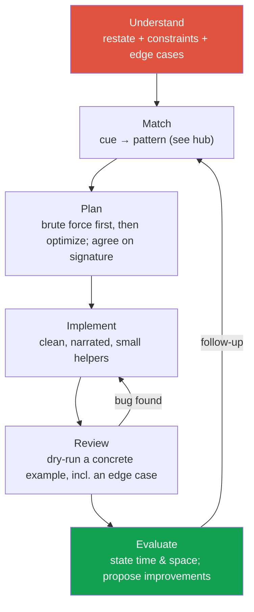

# Coding Round Strategy

> [!TIP] 항상 이 말부터 시작하세요
> "문제를 다시 정리하고, 예시를 하나 짚어본 다음, 제약 조건을 확인하고 코딩을 시작하겠습니다." 이 한 문장이 *구조*를 보여줍니다 — research/applied 지원자에게 가장 높은 배점을 받는 단일 항목이죠. 면접관은 대개 답을 이미 알고 있습니다. 그들이 채점하는 건 당신이 답에 도달하는 *과정*입니다.

Research/Applied Scientist에게 coding round는 이색적인 알고리즘을 묻는 자리가 거의 아닙니다. **컴파일러가 붙은 커뮤니케이션 테스트**죠. 낯선 문제를 깔끔하게 분해하는지, correctness와 complexity를 소리 내어 추론하는지, 동료가 믿고 쓸 코드를 작성하는지로 채점됩니다. 지엽적인 지식(난해한 DP, 무거운 template)은 순수 SWE 루프보다 *낮은* 비중입니다 — 하지만 Meta, NVIDIA, ByteDance, Apple, Microsoft에서 CS fundamentals는 여전히 기본기이고, "저는 연구자라 알고리즘은 안 합니다"는 빠른 탈락 사유입니다.

## The loop, end to end

모든 문제를 같은 파이프라인에 통과시키세요. 아래 프레임워크는 **UMPIRE**(Understand, Match, Plan, Implement, Review, Evaluate)이며, 고전적인 *clarify → examples → approach → code → test → complexity* 흐름과 결합되어 있습니다.



<dl class="kv">
<dt>Understand (2–4 min)</dt><dd>자기 말로 다시 설명하세요. 예시를 하나 더 요청하세요. 코딩 <em>전에</em> edge case를 나열하세요: empty, single element, duplicates, negatives/zero, overflow, already-sorted/reverse-sorted, 아주 큰 N. 제약 조건을 읽어 complexity 목표를 정하세요.</dd>
<dt>Match (1–2 min)</dt><dd><a href="#/coding/patterns">cue → pattern 표</a>를 이용해 cue를 pattern에 매핑하세요. cue를 소리 내어 말하세요: "input is sorted and we want a pair → two pointers."</dd>
<dt>Plan (2–4 min)</dt><dd>brute force와 그 complexity를 먼저 말하고, <em>그다음</em> 최적화를 말하세요. 타이핑 전에 function signature와 대략적인 pseudocode에 합의하세요.</dd>
<dt>Implement (10–20 min)</dt><dd>관용적인 Python을 작성하세요. 진행하면서 설명하세요. 잔재주보다 의미 있는 변수명과 작은 helper를 선호하세요.</dd>
<dt>Review (3–5 min)</dt><dd>구체적인 입력 하나를 손으로 추적하세요, edge case 포함. 버그는 추측이 아니라 여기서 잡으세요.</dd>
<dt>Evaluate (1–2 min)</dt><dd>최종 time/space와 그 <em>이유</em>를 말하세요. trade-off를 자진해서 언급하세요("O(1) space도 가능하지만 readability가 나빠집니다").</dd>
</dl>

## Constraints → complexity target

입력 bound를 먼저 읽으세요. 당신이 풀이를 떠올리기도 전에 의도된 solution class를 알려줍니다.

| Constraint on N | Safe target | Implied approach |
| --- | --- | --- |
| N ≤ 12 | O(N!) / O(2ᴺ·N) | permutations, brute force |
| N ≤ 20–25 | O(2ᴺ) | subsets, bitmask DP |
| N ≤ 500 | O(N³) | Floyd–Warshall, interval DP |
| N ≤ 5,000 | O(N²) | pairwise DP, nested scan |
| N ≤ 10⁶ | O(N log N) or O(N) | sort, heap, sliding window, hashing |
| N ≤ 10⁸ | O(N) / O(log N) | single pass, binary search, math |

## Thinking aloud without rambling

- **~10초 넘게 침묵하지 마세요.** 막히면 갈림길을 밖으로 꺼내세요: "O(N log k)인 heap과 O(N log N)인 full sort 사이에서 고르는 중인데, k ≪ N이면 heap이 이깁니다."
- **Brute force는 부끄러운 게 아니라** 체크포인트입니다. 먼저 말하고, complexity를 제시한 뒤, 개선하세요. 곧장 최적해로 뛰어드는 건 암기처럼 읽히고 면접관에게 채점할 거리를 주지 않습니다.
- **모든 자료구조 선택을 한 구절로 정당화하세요**: "O(1) membership을 위한 hash map," "nearest greater element가 필요해서 monotonic stack."
- **hint를 의도적으로 요청하세요.** hint를 잘 활용하는 건 긍정 신호입니다. 침묵 속에서 허우적대는 건 아니죠.
- **틀렸다는 걸 깨달으면 빠르게 방향을 틀고 그렇다고 말하세요.** 막다른 길을 빠르게 버리는 건 research role이 원하는 바로 그 시니어리티 신호입니다.

> [!WARNING] 가장 흔한 두 가지 즉시 탈락 사유
> (1) approach에 합의하기 전에 코드를 쓰는 것 — 면접관이 지켜보는 앞에서 스스로 궁지에 몰립니다. (2) 예시를 돌려보지 않고 "완료"를 선언하는 것. 항상 dry-run 하세요. 자기 버그를 찾는 건 *가점*이고, 조용히 넘어간 버그를 제출하는 건 감점입니다.

## What research/applied loops weight differently

<div class="proscons">
<div><div class="pros-t">Weighted up</div>

- **Communication & structure** — 분해, 설명, trade-off.
- **Correctness reasoning** — invariant, edge case, 왜 종료되는가.
- **Clean, idiomatic code** — 동료가 기꺼이 리뷰할 코드.
- **Numerical/array fluency** — NumPy 스타일 벡터화 사고에 대한 편안함(참고: [ML coding round](#/ml-coding/intro)).
</div>
<div><div class="cons-t">Weighted down (vs SWE)</div>

- 암기한 Hard 난이도 DP/graph template.
- 속도 풀이 그 자체.
- 언어/stdlib 지엽 지식.
- 명확한 준최적해 + 정직한 complexity면 충분한데 굳이 절대 최적해를 얻어내는 것.
</div>
</div>

많은 research 루프는 알고리즘 라운드 *하나*를 **ML implementation round**로 대체합니다 — IoU/NMS, softmax-attention, 또는 k-means 스텝을 처음부터 구현하는 식이죠. 이런 것도 같은 UMPIRE 규율로 다루세요. 차이는 "pattern"이 정확하고 벡터화된 코드로 옮겨야 할 수학 조각이라는 점입니다. [the ML coding round](#/ml-coding/intro)를 보세요.

## AI-assisted coding rounds (2025–2026)

이제 더 많은 회사가 **AI-allowed** 또는 **AI-collaborative** 라운드를 운영합니다 — 에디터 내 assistant를 쓸 수도 있고, 면접관이 모델 출력을 붙여넣고 당신에게 주도하라고 할 수도 있습니다. 채점 기준은 "코드를 만들어낼 수 있는가"에서 "그것을 *지휘하고 검증*할 수 있는가"로 옮겨갑니다.

> [!NOTE] AI가 허용될 때 실제로 테스트되는 것
> 문제 명세화, prompt 정밀성, 미묘하게 틀린 출력 잡아내기, 무엇을 수용하고 무엇을 다시 쓸지 선택하기, 그리고 테스트. 신호는 원초적 암기력이 아니라 *모델을 다루는 engineering judgment*입니다.

- **spec을 장악하세요.** 생성 전에 contract(inputs, outputs, invariants, complexity target)를 명시하세요. 모델은 모호한 spec을 자신만만하게 틀린 코드로 증폭시킵니다.
- **모델이 쓴 모든 줄을 읽으세요.** off-by-one, 잘못된 tie-breaking, 처리 안 된 empty input, library 호출 안에 숨은 O(N²)가 흔한 결함입니다. 리뷰를 소리 내어 설명하세요.
- **적대적으로 테스트하세요.** 자기만의 edge case를 가져오세요. 모델의 테스트를 믿지 마세요. 당신이 만든 실패 케이스가 강한 신호입니다.
- **mental model을 유지하세요.** "왜 이게 동작하나 / complexity가 얼마인가"를 물으면 assistant 없이 답해야 합니다. 생성된 코드를 당신이 책임지는 유능한 주니어의 PR처럼 다루세요.
- **규칙을 미리 확인하세요.** 애매하면 물어보세요: "assistant를 써도 되나요, 그리고 그 사용 방식도 채점 대상인가요?"

## Python tips for interviews

```python
from collections import defaultdict, Counter, deque
import heapq
from functools import lru_cache

# Counting & grouping
freq = Counter(nums)                 # {val: count}
groups = defaultdict(list); groups[k].append(v)

# Heaps are min-heaps; negate for a max-heap
heapq.heappush(h, x); smallest = heapq.heappop(h)
heapq.heappush(h, -x)                # max-heap trick

# O(1) both-ends queue for BFS / sliding window
q = deque(); q.append(x); q.popleft()

# Memoized recursion (DP) with one decorator
@lru_cache(maxsize=None)
def f(i): ...

# Sorting with a key / tuple key for tie-breaks
intervals.sort(key=lambda iv: (iv[0], -iv[1]))

# Infinity sentinels, integer division caveat
best = float("inf")
q = int(a / b)      # truncates toward zero (a // b floors — wrong for negatives)
```

- `enumerate`, comprehension, tuple unpacking(`l, r = r, l`)을 선호하세요 — 유창함으로 읽힙니다.
- `dict`/`set` 조회는 worst-case가 아니라 **average** O(1)입니다. "average"라고 소리 내어 말하세요.
- `str`과 `tuple`은 immutable하고 hashable합니다 — tuple을 dict key로 쓰세요(예: anagram용 frozen count vector).
- recursion depth를 조심하세요. Python 기본 한계는 ~1000이고, 깊은 DFS는 명시적 stack이 필요할 수 있습니다.

## Complexity cheat-sheet

| Structure / op | Time | Note |
| --- | --- | --- |
| `list` index / append | O(1) | append는 amortized; `insert(0,x)`/`pop(0)`은 O(N) |
| `list` membership `x in l` | O(N) | O(1)을 원하면 `set` 사용 |
| `dict`/`set` get/add/`in` | O(1) avg | O(N) pathological |
| Sort (`sorted`, `.sort`) | O(N log N) | Timsort, stable |
| `heapq` push/pop | O(log N) | peek min = `h[0]`, O(1) |
| `deque` append/pop both ends | O(1) | left 연산 O(1), list와 다름 |
| BFS / DFS on graph | O(V + E) | 재확장을 막는 visited set |
| Binary search | O(log N) | sorted / monotone predicate 필요 |
| 1-D / 2-D DP | O(states × transition) | 추측 말고 곱하세요 |

<details class="qa"><summary>문제 도중에 완전히 막혔을 때 어떻게 대처하나요?</summary>
<div class="qa-body">

**Short:** brute force로 돌아가 *뭐라도* 올바르게 돌아가게 만든 뒤 최적화하세요 — 그리고 그 fallback을 의도적인 선택으로 설명하세요.

**Deep:** 이렇게 말하세요: "먼저 올바른 O(N²) 풀이를 확정해서 baseline을 확보하고, 그다음 O(N) 개선을 찾아보겠습니다." 이건 세 가지를 해냅니다: 잔재주보다 correctness를 중시함을 보여주고, 면접관에게 부분 점수를 줄 동작하는 결과물을 주며, 종종 최적화를 드러냅니다(cache/hash할 수 있는 반복 계산). 최적화에서 진짜로 막히면 겨냥된 질문을 하세요: "input이 sorted인가요, 아니면 제가 sort해도 되나요?" — 그 답이 대개 pattern을 풀어줍니다.
</div></details>

<details class="qa"><summary>O(N log N)를 짰는데 면접관이 O(N)을 요구합니다. 이제 어떡하죠?</summary>
<div class="qa-body">

**Short:** sort가 당신에게 무엇을 사주고 있었는지 파악하고, 같은 속성을 선형 시간에 주는 구조로 바꾸세요.

**Deep:** sort는 대개 *ordering*이나 *grouping*을 사줍니다. grouping/frequency만 필요했다면 → hash map(`Counter`)이 O(N)입니다. top-k가 필요했다면 → heap이 O(N log k), 또는 frequency로 bucket sort하면 O(N)입니다. two-pointer 수렴을 위한 ordering이 필요했지만 값이 bounded라면 → counting/bucket 방식이 적용됩니다. 속성부터 이름 붙이고, 그다음 구조를 바꾸세요. 선형 풀이가 없으면 그렇다고 말하고 lower bound를 방어하세요(예: comparison-based sorting은 Ω(N log N)).
</div></details>

<details class="qa"><summary>예상해야 할 follow-up</summary>
<div class="qa-body">

- **"input이 streaming이거나 메모리에 안 들어가면?"** → online algorithm, reservoir sampling, size-k heap, count-min sketch.
- **"space를 O(1)로 줄일 수 있나요?"** → in-place two-pointer, output array 재사용, rolling DP variable.
- **"이걸 어떻게 테스트하겠어요?"** → edge case 나열 + 교차 검증용 randomized brute-force oracle.
- **"병렬화 / 벡터화할까요?"** → 특히 research role에서: NumPy/torch batch 연산으로 매핑하고, dependency chain이 병렬화를 막는 지점을 논의하세요.
</div></details>

## Cheat-sheet

| Do | Instead of |
| --- | --- |
| 코딩 전에 restate + edge case 나열 | 처음 읽자마자 코딩 |
| brute force → complexity → optimize 순서로 말하기 | 조용히 최적해로 점프 |
| 제약 조건 읽고 complexity 목표 고정 | 의도된 approach 추측 |
| 모든 자료구조 선택을 설명 | 조용히 타이핑 |
| "완료" 전에 구체적 예시 dry-run | 완료 선언 후 요행 바라기 |
| hash 연산에 "average O(1)"이라고 말하기 | worst-case O(1) 주장 |
| spec을 장악하고 AI 출력을 한 줄씩 검증 | 생성된 코드를 신뢰 |
| 틀리면 소리 내어 빠르게 방향 전환 | 막다른 길 방어 |

**Related:** [The Core Patterns hub](#/coding/patterns) · [ML coding round](#/ml-coding/intro) · [8-week prep plan](#/start/prep-plan)
