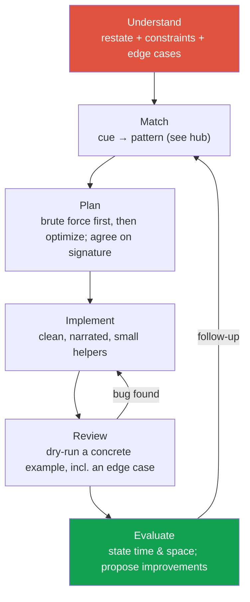

# Coding Round Strategy

> [!TIP] Say this first, always
> "Let me restate the problem, walk through an example, and check constraints before I code." That one sentence signals *structure* — the single most-scored dimension for a research/applied candidate. The interviewer usually knows the answer; they're grading how you get there.

For a Research/Applied Scientist, the coding round is rarely about exotic algorithms. It's a **communication test with a compiler attached.** You are being scored on whether you decompose an unfamiliar problem cleanly, reason about correctness and complexity out loud, and write code a collaborator would trust. Trivia (obscure DP, heavy templates) is *lower* weight than for a pure SWE loop — but CS fundamentals are still table stakes at Meta, NVIDIA, ByteDance, Apple, and Microsoft, and "I'm a researcher, I don't do algorithms" is a fast rejection.

## The loop, end to end

Run every problem through the same pipeline. The framework below is **UMPIRE** (Understand, Match, Plan, Implement, Review, Evaluate), fused with the classic *clarify → examples → approach → code → test → complexity* flow.



<dl class="kv">
<dt>Understand (2–4 min)</dt><dd>Restate in your own words. Ask for one more example. List edge cases <em>before</em> coding: empty, single element, duplicates, negatives/zero, overflow, already-sorted/reverse-sorted, huge N. Read constraints to fix a complexity target.</dd>
<dt>Match (1–2 min)</dt><dd>Map the cue to a pattern using the <a href="#/coding/patterns">cue → pattern table</a>. Say the cue out loud: "input is sorted and we want a pair → two pointers."</dd>
<dt>Plan (2–4 min)</dt><dd>State the brute force and its complexity, <em>then</em> the optimization. Agree on the function signature and rough pseudocode before typing.</dd>
<dt>Implement (10–20 min)</dt><dd>Write idiomatic Python. Narrate as you go. Prefer named variables and small helpers over cleverness.</dd>
<dt>Review (3–5 min)</dt><dd>Trace one concrete input by hand, including an edge case. Fix bugs here, not by guessing.</dd>
<dt>Evaluate (1–2 min)</dt><dd>State final time/space and <em>why</em>. Volunteer a trade-off ("O(1) space is possible but hurts readability").</dd>
</dl>

## Constraints → complexity target

Read the input bounds first; they tell you the intended solution class before you've thought of one.

| Constraint on N | Safe target | Implied approach |
| --- | --- | --- |
| N ≤ 12 | O(N!) / O(2ᴺ·N) | permutations, brute force |
| N ≤ 20–25 | O(2ᴺ) | subsets, bitmask DP |
| N ≤ 500 | O(N³) | Floyd–Warshall, interval DP |
| N ≤ 5,000 | O(N²) | pairwise DP, nested scan |
| N ≤ 10⁶ | O(N log N) or O(N) | sort, heap, sliding window, hashing |
| N ≤ 10⁸ | O(N) / O(log N) | single pass, binary search, math |

## Thinking aloud without rambling

- **Never go silent > ~10 seconds.** If stuck, externalize the fork: "I'm choosing between a heap for O(N log k) and a full sort for O(N log N); the heap wins if k ≪ N."
- **Brute force is not embarrassing** — it's a checkpoint. State it, give its complexity, then improve. Jumping straight to the optimum reads as memorization and gives the interviewer nothing to grade.
- **Justify every data-structure choice** in one clause: "hash map for O(1) membership," "monotonic stack because I need the nearest greater element."
- **Ask for hints deliberately.** Using a hint well is a positive signal; flailing in silence is not.
- **When you realize you're wrong, pivot fast and say so.** Abandoning a dead end quickly is exactly the seniority signal a research role wants.

> [!WARNING] The two most common auto-fails
> (1) Writing code before agreeing on the approach — you'll paint yourself into a corner the interviewer watched you build. (2) Declaring "done" without running an example. Always dry-run; finding your own bug is a *plus*, shipping a silent one is a minus.

## What research/applied loops weight differently

<div class="proscons">
<div><div class="pros-t">Weighted up</div>

- **Communication & structure** — decomposition, narration, trade-offs.
- **Correctness reasoning** — invariants, edge cases, why it terminates.
- **Clean, idiomatic code** — a peer would review it happily.
- **Numerical/array fluency** — comfort with NumPy-style vectorized thinking (see the [ML coding round](#/ml-coding/intro)).
</div>
<div><div class="cons-t">Weighted down (vs SWE)</div>

- Memorized Hard-tier DP/graph templates.
- Speed-solving for its own sake.
- Language/stdlib trivia.
- Getting the absolute optimum when a clear near-optimum + honest complexity is enough.
</div>
</div>

Many research loops replace *one* algorithm round with an **ML implementation round** — code IoU/NMS, softmax-attention, or a k-means step from scratch. Treat those with the same UMPIRE discipline; the difference is the "pattern" is a piece of math you must translate to correct, vectorized code. See [the ML coding round](#/ml-coding/intro).

## AI-assisted coding rounds (2025–2026)

More companies now run **AI-allowed** or **AI-collaborative** rounds — you may use an in-editor assistant, or the interviewer pastes model output and asks you to drive. The rubric shifts from "can you produce the code" to "can you *direct and vet* it."

> [!NOTE] What's actually being tested when AI is allowed
> Problem specification, prompt precision, spotting subtly wrong output, choosing what to accept vs rewrite, and testing. The signal is *engineering judgment over the model*, not raw recall.

- **Own the spec.** State the contract (inputs, outputs, invariants, complexity target) before generating; the model amplifies vague specs into confident wrong code.
- **Read every line the model writes.** Off-by-one, wrong tie-breaking, unhandled empty input, and O(N²) hidden inside a library call are the usual defects. Narrate your review.
- **Test adversarially.** Bring your own edge cases; don't trust the model's tests. A failing case you constructed is strong signal.
- **Keep the mental model.** If asked "why does this work / what's the complexity," you must answer without the assistant. Treat generated code as a fast junior's PR you're accountable for.
- **Confirm the rules up front.** If it's ambiguous, ask: "Am I allowed to use an assistant, and are you scoring my use of it?"

## Python tips for interviews

```python
from collections import defaultdict, Counter, deque
import heapq
from functools import lru_cache

# Counting & grouping
freq = Counter(nums)                 # {val: count}
groups = defaultdict(list); groups[k].append(v)

# Heaps are min-heaps; negate for a max-heap
heapq.heappush(h, x); smallest = heapq.heappop(h)
heapq.heappush(h, -x)                # max-heap trick

# O(1) both-ends queue for BFS / sliding window
q = deque(); q.append(x); q.popleft()

# Memoized recursion (DP) with one decorator
@lru_cache(maxsize=None)
def f(i): ...

# Sorting with a key / tuple key for tie-breaks
intervals.sort(key=lambda iv: (iv[0], -iv[1]))

# Infinity sentinels, integer division caveat
best = float("inf")
q = int(a / b)      # truncates toward zero (a // b floors — wrong for negatives)
```

- Prefer `enumerate`, comprehensions, and tuple unpacking (`l, r = r, l`) — they read as fluency.
- `dict`/`set` lookups are **average** O(1), not worst-case; say "average" out loud.
- `str` and `tuple` are immutable and hashable — use tuples as dict keys (e.g., frozen count vectors for anagrams).
- Guard recursion depth: Python's default limit is ~1000; deep DFS may need an explicit stack.

## Complexity cheat-sheet

| Structure / op | Time | Note |
| --- | --- | --- |
| `list` index / append | O(1) | append amortized; `insert(0,x)`/`pop(0)` is O(N) |
| `list` membership `x in l` | O(N) | use a `set` for O(1) |
| `dict`/`set` get/add/`in` | O(1) avg | O(N) pathological |
| Sort (`sorted`, `.sort`) | O(N log N) | Timsort, stable |
| `heapq` push/pop | O(log N) | peek min = `h[0]`, O(1) |
| `deque` append/pop both ends | O(1) | left ops O(1), unlike list |
| BFS / DFS on graph | O(V + E) | visited set to avoid re-expansion |
| Binary search | O(log N) | needs sorted / monotone predicate |
| 1-D / 2-D DP | O(states × transition) | multiply, don't guess |

<details class="qa"><summary>How do you handle getting completely stuck mid-problem?</summary>
<div class="qa-body">

**Short:** Fall back to brute force, get *something* correct running, then optimize — and narrate the fallback as a deliberate choice.

**Deep:** Say "Let me lock in a correct O(N²) solution first so we have a baseline, then I'll look for the O(N) improvement." This does three things: it demonstrates that you value correctness over cleverness, it gives the interviewer a working artifact to partial-credit, and it often reveals the optimization (a repeated computation you can cache/hash). If truly blocked on the optimization, ask a targeted question: "Is the input sorted, or can I sort it?" — the answer usually unlocks the pattern.
</div></details>

<details class="qa"><summary>You wrote O(N log N); the interviewer asks for O(N). What now?</summary>
<div class="qa-body">

**Short:** Identify what the sort was buying you and replace it with a structure that gives the same property in linear time.

**Deep:** Sorting usually buys *ordering* or *grouping*. If you only needed grouping/frequency → a hash map (`Counter`) is O(N). If you needed the top-k → a heap is O(N log k), or bucket sort by frequency is O(N). If you needed ordering for two-pointer convergence but values are bounded → counting/bucket approaches apply. Name the property first, then swap the structure. If no linear solution exists, say so and defend the lower bound (e.g., comparison-based sorting is Ω(N log N)).
</div></details>

<details class="qa"><summary>Follow-ups you should expect</summary>
<div class="qa-body">

- **"What if the input is streaming / doesn't fit in memory?"** → online algorithms, reservoir sampling, heap of size k, count-min sketch.
- **"Can you reduce space to O(1)?"** → in-place two-pointer, reuse output array, rolling DP variables.
- **"How would you test this?"** → enumerate edge cases + a randomized brute-force oracle for cross-checking.
- **"Parallelize / vectorize it?"** → especially for research roles: map to NumPy/torch batch ops; discuss where the dependency chain blocks parallelism.
</div></details>

## Cheat-sheet

| Do | Instead of |
| --- | --- |
| Restate + list edge cases before coding | Coding on first read |
| State brute force → complexity → optimize | Jumping to the optimum silently |
| Read constraints to fix a complexity target | Guessing the intended approach |
| Narrate every data-structure choice | Silent typing |
| Dry-run a concrete example before "done" | Declaring done, then hoping |
| Say "average O(1)" for hash ops | Claiming worst-case O(1) |
| Own the spec & vet AI output line-by-line | Trusting generated code |
| Pivot fast when wrong, out loud | Defending a dead end |

**Related:** [The Core Patterns hub](#/coding/patterns) · [ML coding round](#/ml-coding/intro) · [8-week prep plan](#/start/prep-plan)
