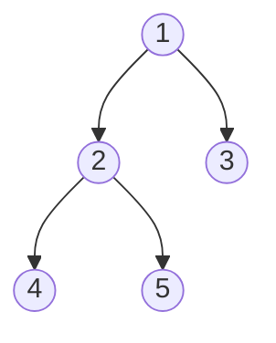

# Trees & BSTs

> [!TIP] 이 말부터 시작하세요
> "대부분의 tree 문제는 recursion입니다: 한 노드가 부모에게 무엇을 반환하는지 정의하고, base case(`None`)가 나머지를 처리하게 두면 됩니다." 그다음 문제가 **어떤 traversal 순서**를 필요로 하는지 결정합니다. Tree와 DP를 합치면 정석적인 코딩 리스트의 대략 3분의 1을 차지합니다 — 시간 대비 효율이 높은 주제입니다.

이진 tree는 recursion 머신입니다. 면접 스킬은 (1) 노드별 subproblem을 프레이밍하는 것, (2) 네 가지 traversal을 모두 iterative *하고* recursive하게 아는 것, (3) `O(H)` 연산을 위해 **BST 불변식**(`left < node < right`)을 활용하는 것입니다.

## 어떤 도구를 언제 꺼내 쓰나

<div class="proscons"><div><div class="pros-t">신호 → 기법</div>

- 높이 / 대칭 / path-sum / "경로가 존재하는가" → 값을 위로 반환하는 **DFS recursion**.
- "레벨 단위로 처리," 최단 깊이 → 큐를 쓰는 **BFS**.
- 정렬된 출력, k번째로 작은 값, range query → BST에 대한 **in-order**.
- BST에서 검증 / 탐색 / 삽입 → `(low, high)` 경계를 들고 다니거나 불변식을 따름.
- LCA, diameter, tree-DP → **post-order** (자식들의 결과가 먼저 필요).

</div><div><div class="cons-t">주의할 점</div>

- *일반* 이진 tree에 BST 해법을 적용 (LCA 235 vs 236).
- 한쪽으로 치우친 tree에서의 recursion 깊이 → `O(N)` 스택; iterative 형태를 언급하세요.
- 문제가 노드 *identity*를 요구하는데 노드 *값*을 비교.

</div></div>

```python
from collections import deque

class TreeNode:
    def __init__(self, val=0, left=None, right=None):
        self.val, self.left, self.right = val, left, right
```

## Traversal —막힘 없이 써야 하는 네 가지



위 tree에 대해: **pre** `1 2 4 5 3` (node→left→right), **in** `4 2 5 1 3` (left→node→right — BST면 정렬됨), **post** `4 5 2 3 1` (left→right→node), **level** `1 | 2 3 | 4 5`.

```python
def inorder_recursive(root, out):
    if not root: return
    inorder_recursive(root.left, out)
    out.append(root.val)
    inorder_recursive(root.right, out)

def inorder_iterative(root):                 # explicit stack, no recursion limit
    out, stack, cur = [], [], root
    while cur or stack:
        while cur:                           # go left as far as possible
            stack.append(cur)
            cur = cur.left
        cur = stack.pop()
        out.append(cur.val)                  # visit on the way back up
        cur = cur.right
    return out
```

`out.append` 위치를 바꾸면 pre-order iterative가 됩니다. post-order iterative는 **뒤집힌** `node→right→left`로 하는 게 가장 쉽습니다.

## 대표 문제

### 1. Validate BST (Medium)
각 노드는 상속받은 `(low, high)` 윈도우 안에 들어와야 합니다 — 부모하고만 비교하는 것이 고전적인 버그입니다.

```python
def is_valid_bst(root) -> bool:
    def dfs(node, low, high):
        if not node:
            return True
        if not (low < node.val < high):
            return False
        return dfs(node.left, low, node.val) and dfs(node.right, node.val, high)
    return dfs(root, float("-inf"), float("inf"))
```
`O(N)` 시간, `O(H)` 공간. 동등한 체크: in-order traversal이 순증가(strictly increasing)해야 합니다.

### 2. Kth Smallest in a BST (Medium)
In-order는 값을 정렬 순서로 방문합니다 — k번째에서 멈추세요.

```python
def kth_smallest(root, k: int) -> int:
    stack, cur = [], root
    while cur or stack:
        while cur:
            stack.append(cur)
            cur = cur.left
        cur = stack.pop()
        k -= 1
        if k == 0:
            return cur.val
        cur = cur.right
```
`O(H + k)` 시간. 후속 질문 "BST가 자주 수정됩니다" → 노드에 subtree count를 augment해 `O(H)` query로.

### 3. Lowest Common Ancestor — 일반 이진 tree (Medium)
`p`와 `q`에 대한 탐색이 만나는 노드를 반환합니다.

```python
def lca(root, p, q):
    if root is None or root is p or root is q:
        return root
    left = lca(root.left, p, q)
    right = lca(root.right, p, q)
    if left and right:      # p, q split across children → root is the LCA
        return root
    return left or right    # both on one side (or neither)
```
`O(N)`. **BST** (LC 235)라면 `O(H)`입니다: 둘 다 `< node`이면 왼쪽으로, 둘 다 `> node`이면 오른쪽으로 내려가고, 아니면 split 지점에 있는 것입니다.

### 4. Level Order Traversal (Medium)
BFS, 큐 길이를 스냅샷으로 잡아 각 레벨을 분리해 둡니다.

```python
def level_order(root):
    if not root: return []
    out, q = [], deque([root])
    while q:
        level = []
        for _ in range(len(q)):           # fix the level boundary
            node = q.popleft()
            level.append(node.val)
            if node.left:  q.append(node.left)
            if node.right: q.append(node.right)
        out.append(level)
    return out
```
`O(N)` 시간, `O(W)` 공간 (최대 너비). Zigzag, right-side-view, "레벨별 평균"은 여기에 한 줄만 고치면 됩니다.

### 5. Binary Tree Maximum Path Sum (Hard) — tree DP
각 호출은 최선의 *아래 방향* chain을 반환합니다. 전역 답은 두 자식을 모두 쓰면서 한 노드에서 **꺾일** 수 있습니다.

```python
def max_path_sum(root) -> int:
    best = float("-inf")
    def gain(node):
        nonlocal best
        if not node:
            return 0
        left = max(gain(node.left), 0)         # drop negative branches
        right = max(gain(node.right), 0)
        best = max(best, node.val + left + right)   # path bending here
        return node.val + max(left, right)          # chain to hand upward
    gain(root)
    return best
```
`O(N)`. 이 chain-반환 / global-갱신 분리는 **diameter** (LC 543), **house robber III** (LC 337), 그리고 대부분의 "tree 내부 경로" DP의 템플릿입니다.

## 흔한 tree-DP 레시피

| 문제 | 위로 반환 | 전역 갱신 |
| --- | --- | --- |
| Height / depth | `1 + max(l, r)` | — |
| Diameter | 가장 긴 아래 방향 경로 | `l + r` (노드를 지나는 edge) |
| Max path sum | `val + max(l, r, 0)` | `val + l + r` |
| Rob house III | `(rob_node, skip_node)` 쌍 | root에서 `max(pair)` |
| Balanced check | height, 혹은 불균형이면 `-1` sentinel | `-1` 전파 |

## 함정

- **부모만 확인하는 BST 체크**는 먼 조상에서 온 위반을 놓칩니다 — 항상 경계를 넘기거나 in-order를 쓰세요.
- **DP에서 post- vs pre-order:** 자식이 부모보다 *먼저* 필요 → post-order. pre-order로 작업하면 조용히 틀린 DP 답이 나옵니다.
- **치우친 tree**는 recursion을 `O(N)` 깊이로 만듭니다; 제약이 있는 런타임에서는 iterative 스택 형태로 변환하세요.
- **레벨 섞임:** `len(q)` 스냅샷 없는 BFS는 레벨을 합쳐버립니다.
- **Serialize/deserialize** (LC 297): `None`을 인코딩하는 스킴(`#`)을 고르세요 — pre-order + null 마커가 가장 깔끔합니다.

## Q&A

<details class="qa"><summary>Tree에서 언제 DFS 대신 BFS를 고르나요?</summary>
<div class="qa-body">

**짧게:** 답이 레벨 구조를 가질 때(최소 깊이, level order, right-side view) 혹은 가장 얕은 해를 먼저 원할 때 BFS를, 노드의 답이 자손에 의존하는 경로/subtree 속성에는 DFS를 씁니다.

**깊게:** BFS는 `O(W)` 메모리(너비, 균형 tree에서 최대 `N/2`)를 쓰고, DFS는 `O(H)`(높이, 균형 시 `log N`, 치우침 시 `N`)를 씁니다. 최소 깊이에서는 BFS가 첫 leaf에서 early-exit할 수 있어서 전체 DFS보다 엄격히 낫습니다.
</div></details>

<details class="qa"><summary>Max-path-sum 트릭을 일반화하세요.</summary>
<div class="qa-body">

**짧게:** "어떤 노드를 지나는 최선의 구조" 계열의 모든 tree 문제는 **부모에게 반환되는 값**(단일 chain/branch)과 현재 노드에서 두 자식을 결합할 수 있는 **전역 최선**으로 나뉩니다.

**깊게:** 미묘한 점은 반환하는 것과 기록하는 것이 다르다는 겁니다. 부모는 한 branch만 확장할 수 있으므로 `val + max(left, right)`를 반환하지만, 최적 경로가 이 노드에서 peak일 수 있으므로 `val + left + right`를 *기록*합니다. 이 둘을 혼동하는 게 1순위 버그입니다 — 꺾이는 경로를 과소 계산하게 만듭니다.
</div></details>

**예상되는 후속 질문**
- "Recursion 없이 iterative하게 해보세요." → explicit 스택(위의 in-order), 혹은 `O(1)` 공간을 위한 Morris traversal.
- "이 tree가 BST입니다 — 더 잘할 수 있나요?" → 탐색/LCA/kth에 대해 `O(N)` 대신 `O(H)`.
- "직렬화하세요." → null 마커가 있는 pre-order, 혹은 level-order.
- "N-ary tree입니다." → `children` 리스트에 대한 recursion; 레시피가 그대로 적용됩니다.

## Cheat-sheet

| 사실 | 세부 |
| --- | --- |
| 프레이밍 | 한 노드의 반환 + base case `None` 정의 |
| BST에 대한 In-order | 정렬된 값을 산출 (validate, kth, range) |
| Pre / In / Post / Level | root-first / 정렬 / children-first / 깊이순 |
| BST search/insert/LCA | `left < node < right`를 써서 `O(H)` |
| Tree DP | post-order; chain을 반환, global을 갱신 |
| DFS vs BFS 메모리 | `O(H)` vs `O(W)` |
| Iterative in-order | left-spine 스택, pop 시 방문, 오른쪽으로 |
| Validate BST | 부모만이 아니라 `(low, high)` 경계를 상속 |
| 복잡도 | traversal `O(N)`; 균형 BST 연산 `O(log N)` |

**관련:** [Graphs (BFS/DFS)](#/coding/graphs-bfs-dfs) · [Binary Search](#/coding/binary-search) · [Dynamic Programming](#/coding/dynamic-programming) · 다시 [The Core Patterns](#/coding/patterns)와 [Coding Round Strategy](#/coding/strategy)로.
