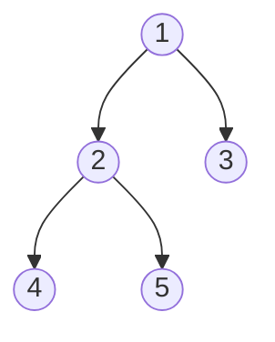

# Trees & BSTs

> [!TIP] Say this first
> "Most tree problems are a recursion: define what one node returns to its parent, and let the base case (`None`) do the rest." Then decide **which traversal order** the problem needs. Trees + DP together are roughly a third of the canonical coding lists — this is high payoff-per-hour.

A binary tree is a recursion machine. The interview skill is (1) framing the per-node subproblem, (2) knowing all four traversals iteratively *and* recursively, and (3) exploiting the **BST invariant** (`left < node < right`) for `O(H)` operations.

## When to reach for which tool

<div class="proscons"><div><div class="pros-t">Cues → technique</div>

- Height / symmetry / path-sum / "does a path exist" → **DFS recursion** returning a value up.
- "Process level by level," shortest depth → **BFS** with a queue.
- Sorted output, k-th smallest, range queries → **in-order** on a BST.
- Validate / search / insert in a BST → carry a `(low, high)` bound or follow the invariant.
- LCA, diameter, tree-DP → **post-order** (need children's results first).

</div><div><div class="cons-t">Watch for</div>

- BST solutions applied to a *general* binary tree (LCA 235 vs 236).
- Recursion depth on a skewed tree → `O(N)` stack; mention the iterative form.
- Comparing node *values* when the problem needs node *identity*.

</div></div>

```python
from collections import deque

class TreeNode:
    def __init__(self, val=0, left=None, right=None):
        self.val, self.left, self.right = val, left, right
```

## Traversals — the four you must write cold



For the tree above: **pre** `1 2 4 5 3` (node→left→right), **in** `4 2 5 1 3` (left→node→right — sorted for a BST), **post** `4 5 2 3 1` (left→right→node), **level** `1 | 2 3 | 4 5`.

```python
def inorder_recursive(root, out):
    if not root: return
    inorder_recursive(root.left, out)
    out.append(root.val)
    inorder_recursive(root.right, out)

def inorder_iterative(root):                 # explicit stack, no recursion limit
    out, stack, cur = [], [], root
    while cur or stack:
        while cur:                           # go left as far as possible
            stack.append(cur)
            cur = cur.left
        cur = stack.pop()
        out.append(cur.val)                  # visit on the way back up
        cur = cur.right
    return out
```

Swap the `out.append` position to get pre-order iterative; post-order iterative is easiest as **reversed** `node→right→left`.

## Representative problems

### 1. Validate BST (Medium)
Each node must fall inside an inherited `(low, high)` window — comparing to the parent alone is the classic bug.

```python
def is_valid_bst(root) -> bool:
    def dfs(node, low, high):
        if not node:
            return True
        if not (low < node.val < high):
            return False
        return dfs(node.left, low, node.val) and dfs(node.right, node.val, high)
    return dfs(root, float("-inf"), float("inf"))
```
`O(N)` time, `O(H)` space. Equivalent check: an in-order traversal is strictly increasing.

### 2. Kth Smallest in a BST (Medium)
In-order visits values in sorted order — stop at the k-th.

```python
def kth_smallest(root, k: int) -> int:
    stack, cur = [], root
    while cur or stack:
        while cur:
            stack.append(cur)
            cur = cur.left
        cur = stack.pop()
        k -= 1
        if k == 0:
            return cur.val
        cur = cur.right
```
`O(H + k)` time. Follow-up "the BST is modified often" → augment nodes with subtree counts for `O(H)` queries.

### 3. Lowest Common Ancestor — general binary tree (Medium)
Return the node where the searches for `p` and `q` meet.

```python
def lca(root, p, q):
    if root is None or root is p or root is q:
        return root
    left = lca(root.left, p, q)
    right = lca(root.right, p, q)
    if left and right:      # p, q split across children → root is the LCA
        return root
    return left or right    # both on one side (or neither)
```
`O(N)`. For a **BST** (LC 235) it's `O(H)`: descend left while both `< node`, right while both `> node`, else you're at the split.

### 4. Level Order Traversal (Medium)
BFS, snapshotting the queue length so each level stays separate.

```python
def level_order(root):
    if not root: return []
    out, q = [], deque([root])
    while q:
        level = []
        for _ in range(len(q)):           # fix the level boundary
            node = q.popleft()
            level.append(node.val)
            if node.left:  q.append(node.left)
            if node.right: q.append(node.right)
        out.append(level)
    return out
```
`O(N)` time, `O(W)` space (max width). Zigzag, right-side-view, and "average per level" are one-line edits on this.

### 5. Binary Tree Maximum Path Sum (Hard) — tree DP
Each call returns the best *downward* chain; the global answer may **bend** at a node using both children.

```python
def max_path_sum(root) -> int:
    best = float("-inf")
    def gain(node):
        nonlocal best
        if not node:
            return 0
        left = max(gain(node.left), 0)         # drop negative branches
        right = max(gain(node.right), 0)
        best = max(best, node.val + left + right)   # path bending here
        return node.val + max(left, right)          # chain to hand upward
    gain(root)
    return best
```
`O(N)`. This return-a-chain / update-a-global split is the template for **diameter** (LC 543), **house robber III** (LC 337), and most "path within a tree" DPs.

## Common tree-DP recipes

| Problem | Return upward | Global update |
| --- | --- | --- |
| Height / depth | `1 + max(l, r)` | — |
| Diameter | longest downward path | `l + r` (edges through node) |
| Max path sum | `val + max(l, r, 0)` | `val + l + r` |
| Rob house III | `(rob_node, skip_node)` pair | `max(pair)` at root |
| Balanced check | height, or `-1` sentinel if unbalanced | propagate `-1` |

## Pitfalls

- **Parent-only BST check** misses violations from a distant ancestor — always pass bounds or use in-order.
- **Post- vs pre-order for DP:** you need children *before* the parent → post-order. Doing work pre-order silently gives wrong DP answers.
- **Skewed trees** make recursion `O(N)` deep; on constrained runtimes convert to the iterative stack form.
- **Level mixing:** BFS without the `len(q)` snapshot merges levels.
- **Serialize/deserialize** (LC 297): pick a scheme that encodes `None` (`#`) — pre-order + null markers is cleanest.

## Q&A

<details class="qa"><summary>When do you pick BFS over DFS on a tree?</summary>
<div class="qa-body">

**Short:** BFS when the answer is level-structured (min depth, level order, right-side view) or you want the shallowest solution first; DFS for path/subtree properties where a node's answer depends on its descendants.

**Deep:** BFS uses `O(W)` memory (width, up to `N/2` in a balanced tree); DFS uses `O(H)` (height, `log N` balanced, `N` skewed). For minimum-depth, BFS can early-exit at the first leaf, so it's strictly better than a full DFS.
</div></details>

<details class="qa"><summary>Generalize the max-path-sum trick.</summary>
<div class="qa-body">

**Short:** Any "best structure passing through some node" tree problem splits into a value **returned to the parent** (a single chain/branch) and a **global best** that may combine both children at the current node.

**Deep:** The subtlety is that what you return is not what you record. You return `val + max(left, right)` because a parent can only extend one branch, but you *record* `val + left + right` because the optimal path may peak at this node. Conflating them is the #1 bug — it makes the answer under-count bending paths.
</div></details>

**Follow-ups you should expect**
- "Do it iteratively / without recursion." → explicit stack (in-order shown above), or Morris traversal for `O(1)` space.
- "The tree is a BST — can you do better?" → `O(H)` instead of `O(N)` for search/LCA/kth.
- "Serialize it." → pre-order with null markers, or level-order.
- "It's an N-ary tree." → recursion over a `children` list; the recipes carry over.

## Cheat-sheet

| Fact | Detail |
| --- | --- |
| Framing | define one node's return + base case `None` |
| In-order on BST | yields sorted values (validate, kth, range) |
| Pre / In / Post / Level | root-first / sorted / children-first / by depth |
| BST search/insert/LCA | `O(H)` using `left < node < right` |
| Tree DP | post-order; return a chain, update a global |
| DFS vs BFS memory | `O(H)` vs `O(W)` |
| Iterative in-order | left-spine stack, visit on pop, go right |
| Validate BST | inherit `(low, high)` bounds, not parent-only |
| Complexity | traversal `O(N)`; balanced BST ops `O(log N)` |

**Related:** [Graphs (BFS/DFS)](#/coding/graphs-bfs-dfs) · [Binary Search](#/coding/binary-search) · [Dynamic Programming](#/coding/dynamic-programming) · back to [The Core Patterns](#/coding/patterns) and [Coding Round Strategy](#/coding/strategy).
