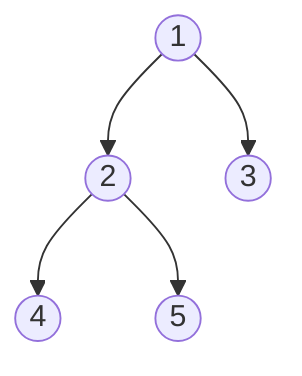

# Trees & BSTs

> [!TIP] Say this first
> "Most tree problems are a recursion: define what one node returns to its parent, and let the base case (`None`) do the rest." Then decide **which traversal order** the problem needs. Trees + DP together are roughly a third of the canonical coding lists — this is high payoff-per-hour.

A binary tree is a recursion machine. The interview skill is (1) framing the per-node subproblem, (2) knowing all four traversals iteratively *and* recursively, and (3) exploiting the **BST invariant** (`left < node < right`) for `O(H)` operations.

## When to reach for which tool

<div class="proscons"><div><div class="pros-t">Cues → technique</div>

- Height / symmetry / path-sum / "does a path exist" → **DFS recursion** returning a value up.
- "Process level by level," shortest depth → **BFS** with a queue.
- Sorted output, k-th smallest, range queries → **in-order** on a BST.
- Validate / search / insert in a BST → carry a `(low, high)` bound or follow the invariant.
- LCA, diameter, tree-DP → **post-order** (need children's results first).

</div><div><div class="cons-t">Watch for</div>

- BST solutions applied to a *general* binary tree (LCA 235 vs 236).
- Recursion depth on a skewed tree → `O(N)` stack; mention the iterative form.
- Comparing node *values* when the problem needs node *identity*.

</div></div>

```python
from collections import deque

class TreeNode:
    def __init__(self, val=0, left=None, right=None):
        self.val, self.left, self.right = val, left, right
```

## Traversals — the four you must write cold



For the tree above: **pre** `1 2 4 5 3` (node→left→right), **in** `4 2 5 1 3` (left→node→right — sorted for a BST), **post** `4 5 2 3 1` (left→right→node), **level** `1 | 2 3 | 4 5`.

```python
def inorder_recursive(root, out):
    if not root: return
    inorder_recursive(root.left, out)
    out.append(root.val)
    inorder_recursive(root.right, out)

def inorder_iterative(root):                 # explicit stack, no recursion limit
    out, stack, cur = [], [], root
    while cur or stack:
        while cur:                           # go left as far as possible
            stack.append(cur)
            cur = cur.left
        cur = stack.pop()
        out.append(cur.val)                  # visit on the way back up
        cur = cur.right
    return out
```

Swap the `out.append` position to get pre-order iterative; post-order iterative is easiest as **reversed** `node→right→left`.

## Practice — implement, run, test

> [!TIP] How to use this section
> Each problem below has a **live Python editor**. Write your solution, hit **▶ Run tests**, and see which cases pass. Stuck? Reveal a reference **Solution** — but attempt first; the struggle *is* the practice. The first Run downloads a small Python runtime (~10 MB); later runs are instant. Prefer your own editor? Each problem links out to **LeetCode**. Each lab feeds the tree in as a **level-order list** (`None` marks a missing child) and builds the `TreeNode` for you.

Work them in order — BST validation and traversal first, then the general-tree LCA and the tree-DP finale.

### 1. Validate BST <span class="badge badge-med">Medium</span> · [LeetCode ↗](https://leetcode.com/problems/validate-binary-search-tree/)
Each node must fall inside an inherited `(low, high)` window — comparing to the parent alone is the classic bug.

<div class="widget" data-widget="code">
<script type="application/json" class="code-config">
{"func":"is_valid_bst","starter":"from collections import deque\n\nclass TreeNode:\n    def __init__(self, val=0, left=None, right=None):\n        self.val, self.left, self.right = val, left, right\n\ndef build_tree(vals):\n    if not vals:\n        return None\n    root = TreeNode(vals[0])\n    q = deque([root])\n    i = 1\n    while q and i < len(vals):\n        node = q.popleft()\n        if i < len(vals) and vals[i] is not None:\n            node.left = TreeNode(vals[i])\n            q.append(node.left)\n        i += 1\n        if i < len(vals) and vals[i] is not None:\n            node.right = TreeNode(vals[i])\n            q.append(node.right)\n        i += 1\n    return root\n\ndef is_valid_bst(vals) -> bool:\n    root = build_tree(vals)\n    # inherit a (low, high) window down the tree; equal values are invalid\n    pass","tests":[{"args":[[2,1,3]],"expect":true},{"args":[[5,1,4,null,null,3,6]],"expect":false},{"args":[[2,2,2]],"expect":false},{"args":[[10,5,15,null,null,6,20]],"expect":false},{"args":[[]],"expect":true},{"args":[[1]],"expect":true}],"solution":"from collections import deque\n\nclass TreeNode:\n    def __init__(self, val=0, left=None, right=None):\n        self.val, self.left, self.right = val, left, right\n\ndef build_tree(vals):\n    if not vals:\n        return None\n    root = TreeNode(vals[0])\n    q = deque([root])\n    i = 1\n    while q and i < len(vals):\n        node = q.popleft()\n        if i < len(vals) and vals[i] is not None:\n            node.left = TreeNode(vals[i])\n            q.append(node.left)\n        i += 1\n        if i < len(vals) and vals[i] is not None:\n            node.right = TreeNode(vals[i])\n            q.append(node.right)\n        i += 1\n    return root\n\ndef is_valid_bst(vals) -> bool:\n    root = build_tree(vals)\n    def dfs(node, low, high):\n        if not node:\n            return True\n        if not (low < node.val < high):\n            return False\n        return dfs(node.left, low, node.val) and dfs(node.right, node.val, high)\n    return dfs(root, float(\"-inf\"), float(\"inf\"))"}
</script>
</div>

`O(N)` time, `O(H)` space. Equivalent check: an in-order traversal is strictly increasing.

### 2. Kth Smallest in a BST <span class="badge badge-med">Medium</span> · [LeetCode ↗](https://leetcode.com/problems/kth-smallest-element-in-a-bst/)
In-order visits values in sorted order — stop at the k-th.

<div class="widget" data-widget="code">
<script type="application/json" class="code-config">
{"func":"kth_smallest","starter":"from collections import deque\n\nclass TreeNode:\n    def __init__(self, val=0, left=None, right=None):\n        self.val, self.left, self.right = val, left, right\n\ndef build_tree(vals):\n    if not vals:\n        return None\n    root = TreeNode(vals[0])\n    q = deque([root])\n    i = 1\n    while q and i < len(vals):\n        node = q.popleft()\n        if i < len(vals) and vals[i] is not None:\n            node.left = TreeNode(vals[i])\n            q.append(node.left)\n        i += 1\n        if i < len(vals) and vals[i] is not None:\n            node.right = TreeNode(vals[i])\n            q.append(node.right)\n        i += 1\n    return root\n\ndef kth_smallest(vals, k: int) -> int:\n    root = build_tree(vals)\n    # in-order visits values in sorted order; stop at the k-th\n    pass","tests":[{"args":[[3,1,4,null,2],1],"expect":1},{"args":[[5,3,6,2,4,null,null,1],3],"expect":3},{"args":[[1],1],"expect":1},{"args":[[2,1,3],2],"expect":2},{"args":[[2,1,3],3],"expect":3}],"solution":"from collections import deque\n\nclass TreeNode:\n    def __init__(self, val=0, left=None, right=None):\n        self.val, self.left, self.right = val, left, right\n\ndef build_tree(vals):\n    if not vals:\n        return None\n    root = TreeNode(vals[0])\n    q = deque([root])\n    i = 1\n    while q and i < len(vals):\n        node = q.popleft()\n        if i < len(vals) and vals[i] is not None:\n            node.left = TreeNode(vals[i])\n            q.append(node.left)\n        i += 1\n        if i < len(vals) and vals[i] is not None:\n            node.right = TreeNode(vals[i])\n            q.append(node.right)\n        i += 1\n    return root\n\ndef kth_smallest(vals, k: int) -> int:\n    root = build_tree(vals)\n    stack, cur = [], root\n    while cur or stack:\n        while cur:\n            stack.append(cur)\n            cur = cur.left\n        cur = stack.pop()\n        k -= 1\n        if k == 0:\n            return cur.val\n        cur = cur.right"}
</script>
</div>

`O(H + k)` time. Follow-up "the BST is modified often" → augment nodes with subtree counts for `O(H)` queries.

### 3. Lowest Common Ancestor <span class="badge badge-med">Medium</span> · [LeetCode ↗](https://leetcode.com/problems/lowest-common-ancestor-of-a-binary-tree/)
Return the value of the node where the searches for `p` and `q` meet (values are unique).

<div class="widget" data-widget="code">
<script type="application/json" class="code-config">
{"func":"lca","starter":"from collections import deque\n\nclass TreeNode:\n    def __init__(self, val=0, left=None, right=None):\n        self.val, self.left, self.right = val, left, right\n\ndef build_tree(vals):\n    if not vals:\n        return None\n    root = TreeNode(vals[0])\n    q = deque([root])\n    i = 1\n    while q and i < len(vals):\n        node = q.popleft()\n        if i < len(vals) and vals[i] is not None:\n            node.left = TreeNode(vals[i])\n            q.append(node.left)\n        i += 1\n        if i < len(vals) and vals[i] is not None:\n            node.right = TreeNode(vals[i])\n            q.append(node.right)\n        i += 1\n    return root\n\ndef lca(vals, p, q):\n    root = build_tree(vals)\n    # return the value of the node where the searches for p and q meet\n    pass","tests":[{"args":[[3,5,1,6,2,0,8,null,null,7,4],5,1],"expect":3},{"args":[[3,5,1,6,2,0,8,null,null,7,4],5,4],"expect":5},{"args":[[3,5,1,6,2,0,8,null,null,7,4],6,4],"expect":5},{"args":[[1,2],1,2],"expect":1},{"args":[[2,1,3],1,3],"expect":2}],"solution":"from collections import deque\n\nclass TreeNode:\n    def __init__(self, val=0, left=None, right=None):\n        self.val, self.left, self.right = val, left, right\n\ndef build_tree(vals):\n    if not vals:\n        return None\n    root = TreeNode(vals[0])\n    q = deque([root])\n    i = 1\n    while q and i < len(vals):\n        node = q.popleft()\n        if i < len(vals) and vals[i] is not None:\n            node.left = TreeNode(vals[i])\n            q.append(node.left)\n        i += 1\n        if i < len(vals) and vals[i] is not None:\n            node.right = TreeNode(vals[i])\n            q.append(node.right)\n        i += 1\n    return root\n\ndef lca(vals, p, q):\n    root = build_tree(vals)\n    def dfs(node):\n        if node is None or node.val == p or node.val == q:\n            return node\n        left = dfs(node.left)\n        right = dfs(node.right)\n        if left and right:\n            return node\n        return left or right\n    ans = dfs(root)\n    return ans.val if ans else None"}
</script>
</div>

`O(N)`. For a **BST** (LC 235) it's `O(H)`: descend left while both `< node`, right while both `> node`, else you're at the split.

### 4. Level Order Traversal <span class="badge badge-med">Medium</span> · [LeetCode ↗](https://leetcode.com/problems/binary-tree-level-order-traversal/)
BFS, snapshotting the queue length so each level stays separate.

<div class="widget" data-widget="code">
<script type="application/json" class="code-config">
{"func":"level_order","starter":"from collections import deque\n\nclass TreeNode:\n    def __init__(self, val=0, left=None, right=None):\n        self.val, self.left, self.right = val, left, right\n\ndef build_tree(vals):\n    if not vals:\n        return None\n    root = TreeNode(vals[0])\n    q = deque([root])\n    i = 1\n    while q and i < len(vals):\n        node = q.popleft()\n        if i < len(vals) and vals[i] is not None:\n            node.left = TreeNode(vals[i])\n            q.append(node.left)\n        i += 1\n        if i < len(vals) and vals[i] is not None:\n            node.right = TreeNode(vals[i])\n            q.append(node.right)\n        i += 1\n    return root\n\ndef level_order(vals):\n    root = build_tree(vals)\n    # BFS; snapshot len(q) so each level stays separate\n    pass","tests":[{"args":[[3,9,20,null,null,15,7]],"expect":[[3],[9,20],[15,7]]},{"args":[[1]],"expect":[[1]]},{"args":[[]],"expect":[]},{"args":[[1,2,3,4,5]],"expect":[[1],[2,3],[4,5]]}],"solution":"from collections import deque\n\nclass TreeNode:\n    def __init__(self, val=0, left=None, right=None):\n        self.val, self.left, self.right = val, left, right\n\ndef build_tree(vals):\n    if not vals:\n        return None\n    root = TreeNode(vals[0])\n    q = deque([root])\n    i = 1\n    while q and i < len(vals):\n        node = q.popleft()\n        if i < len(vals) and vals[i] is not None:\n            node.left = TreeNode(vals[i])\n            q.append(node.left)\n        i += 1\n        if i < len(vals) and vals[i] is not None:\n            node.right = TreeNode(vals[i])\n            q.append(node.right)\n        i += 1\n    return root\n\ndef level_order(vals):\n    root = build_tree(vals)\n    if not root:\n        return []\n    out, q = [], deque([root])\n    while q:\n        level = []\n        for _ in range(len(q)):\n            node = q.popleft()\n            level.append(node.val)\n            if node.left:\n                q.append(node.left)\n            if node.right:\n                q.append(node.right)\n        out.append(level)\n    return out"}
</script>
</div>

`O(N)` time, `O(W)` space (max width). Zigzag, right-side-view, and "average per level" are one-line edits on this.

### 5. Binary Tree Maximum Path Sum <span class="badge badge-hard">Hard</span> · [LeetCode ↗](https://leetcode.com/problems/binary-tree-maximum-path-sum/)
Each call returns the best *downward* chain; the global answer may **bend** at a node using both children.

<div class="widget" data-widget="code">
<script type="application/json" class="code-config">
{"func":"max_path_sum","starter":"from collections import deque\n\nclass TreeNode:\n    def __init__(self, val=0, left=None, right=None):\n        self.val, self.left, self.right = val, left, right\n\ndef build_tree(vals):\n    if not vals:\n        return None\n    root = TreeNode(vals[0])\n    q = deque([root])\n    i = 1\n    while q and i < len(vals):\n        node = q.popleft()\n        if i < len(vals) and vals[i] is not None:\n            node.left = TreeNode(vals[i])\n            q.append(node.left)\n        i += 1\n        if i < len(vals) and vals[i] is not None:\n            node.right = TreeNode(vals[i])\n            q.append(node.right)\n        i += 1\n    return root\n\ndef max_path_sum(vals) -> int:\n    root = build_tree(vals)\n    # each call returns the best downward chain; the global answer may bend at a node\n    pass","tests":[{"args":[[1,2,3]],"expect":6},{"args":[[-10,9,20,null,null,15,7]],"expect":42},{"args":[[-3]],"expect":-3},{"args":[[2,-1]],"expect":2},{"args":[[-2,-1]],"expect":-1}],"solution":"from collections import deque\n\nclass TreeNode:\n    def __init__(self, val=0, left=None, right=None):\n        self.val, self.left, self.right = val, left, right\n\ndef build_tree(vals):\n    if not vals:\n        return None\n    root = TreeNode(vals[0])\n    q = deque([root])\n    i = 1\n    while q and i < len(vals):\n        node = q.popleft()\n        if i < len(vals) and vals[i] is not None:\n            node.left = TreeNode(vals[i])\n            q.append(node.left)\n        i += 1\n        if i < len(vals) and vals[i] is not None:\n            node.right = TreeNode(vals[i])\n            q.append(node.right)\n        i += 1\n    return root\n\ndef max_path_sum(vals) -> int:\n    root = build_tree(vals)\n    best = float(\"-inf\")\n    def gain(node):\n        nonlocal best\n        if not node:\n            return 0\n        left = max(gain(node.left), 0)\n        right = max(gain(node.right), 0)\n        best = max(best, node.val + left + right)\n        return node.val + max(left, right)\n    gain(root)\n    return best"}
</script>
</div>

`O(N)`. This return-a-chain / update-a-global split is the template for **diameter** (LC 543), **house robber III** (LC 337), and most "path within a tree" DPs.

## Canonical backtracking—choose, explore, undo

Backtracking is not an explicit tree data structure. It is DFS over a **search tree of choices**. Each call defines the path selected so far and the range of next candidates; add a choice, recurse, and then restore the state.

```python
def subsets(nums):
    """All subsets of positionally distinct input elements."""
    out, path = [], []

    def dfs(start):
        out.append(path.copy())      # storing path itself aliases one mutable object
        for i in range(start, len(nums)):
            path.append(nums[i])     # choose
            dfs(i + 1)               # explore: never revisit an earlier index
            path.pop()               # unchoose

    dfs(0)
    return out


def unique_permutations(nums):
    """Return distinct permutations even when values repeat."""
    nums = sorted(nums)
    out, path = [], []
    used = [False] * len(nums)

    def dfs():
        if len(path) == len(nums):
            out.append(path.copy())
            return
        for i, value in enumerate(nums):
            if used[i]:
                continue
            # At one depth, use an equal value as the starting choice only once.
            if i > 0 and nums[i] == nums[i - 1] and not used[i - 1]:
                continue
            used[i] = True
            path.append(value)
            dfs()
            path.pop()
            used[i] = False

    dfs()
    return out


assert subsets([]) == [[]]
assert sorted(subsets([1, 2])) == [[], [1], [1, 2], [2]]
assert unique_permutations([1, 1, 2]) == [
    [1, 1, 2], [1, 2, 1], [2, 1, 1]
]
```

| Problem form | State and candidates | Typical pruning |
| --- | --- | --- |
| Subset / combination | `path`, next `start` index | stop when the remaining suffix cannot fill the target length |
| Permutation | `path`, `used[]` | sort, then skip duplicates at the same depth |
| Sum to target | current sum or remainder, `start` | with sorted positive candidates, stop at `candidate > remaining` |
| Grid word search | coordinates, character index, visited state | stop immediately on bounds or character mismatch; restore visited |

There are $2^N$ subsets, so copying every answer takes about $O(N2^N)$ time. There are $N!$ permutations, requiring $O(N\cdot N!)$ including output copies. Do not merely say “exponential”: explain that this is close to optimal relative to the output size, and justify each pruning condition. Repeated identical states when only an optimum or count is needed are a signal to switch to memoization or dynamic programming.

> [!WARNING] Backtracking traps
> Common bugs include forgetting to `return` at the base case and exploring invalid lengths; storing `path` instead of `path.copy()`; or returning early on success without restoring visited state. With duplicate inputs, distinguish “skip an equal candidate at the same depth” from “skip it at every depth.”

## Common tree-DP recipes

| Problem | Return upward | Global update |
| --- | --- | --- |
| Height / depth | `1 + max(l, r)` | — |
| Diameter | longest downward path | `l + r` (edges through node) |
| Max path sum | `val + max(l, r, 0)` | `val + l + r` |
| Rob house III | `(rob_node, skip_node)` pair | `max(pair)` at root |
| Balanced check | height, or `-1` sentinel if unbalanced | propagate `-1` |

## Pitfalls

- **Parent-only BST check** misses violations from a distant ancestor — always pass bounds or use in-order.
- **Post- vs pre-order for DP:** you need children *before* the parent → post-order. Doing work pre-order silently gives wrong DP answers.
- **Skewed trees** make recursion `O(N)` deep; on constrained runtimes convert to the iterative stack form.
- **Level mixing:** BFS without the `len(q)` snapshot merges levels.
- **Serialize/deserialize** (LC 297): pick a scheme that encodes `None` (`#`) — pre-order + null markers is cleanest.

## Q&A

<details class="qa"><summary>When do you pick BFS over DFS on a tree?</summary>
<div class="qa-body">

**Short:** BFS when the answer is level-structured (min depth, level order, right-side view) or you want the shallowest solution first; DFS for path/subtree properties where a node's answer depends on its descendants.

**Deep:** BFS uses `O(W)` memory (width, up to `N/2` in a balanced tree); DFS uses `O(H)` (height, `log N` balanced, `N` skewed). For minimum-depth, BFS can early-exit at the first leaf, so it's strictly better than a full DFS.
</div></details>

<details class="qa"><summary>Generalize the max-path-sum trick.</summary>
<div class="qa-body">

**Short:** Any "best structure passing through some node" tree problem splits into a value **returned to the parent** (a single chain/branch) and a **global best** that may combine both children at the current node.

**Deep:** The subtlety is that what you return is not what you record. You return `val + max(left, right)` because a parent can only extend one branch, but you *record* `val + left + right` because the optimal path may peak at this node. Conflating them is the #1 bug — it makes the answer under-count bending paths.
</div></details>

**Follow-ups you should expect**
- "Do it iteratively / without recursion." → explicit stack (in-order shown above), or Morris traversal for `O(1)` space.
- "The tree is a BST — can you do better?" → `O(H)` instead of `O(N)` for search/LCA/kth.
- "Serialize it." → pre-order with null markers, or level-order.
- "It's an N-ary tree." → recursion over a `children` list; the recipes carry over.

## Cheat-sheet

| Fact | Detail |
| --- | --- |
| Framing | define one node's return + base case `None` |
| In-order on BST | yields sorted values (validate, kth, range) |
| Pre / In / Post / Level | root-first / sorted / children-first / by depth |
| BST search/insert/LCA | `O(H)` using `left < node < right` |
| Tree DP | post-order; return a chain, update a global |
| DFS vs BFS memory | `O(H)` vs `O(W)` |
| Iterative in-order | left-spine stack, visit on pop, go right |
| Validate BST | inherit `(low, high)` bounds, not parent-only |
| Backtracking | choose → explore → unchoose; store `path.copy()` in answers |
| Duplicate pruning | sort, then skip equal candidates only at the same depth |
| Complexity | traversal `O(N)`; balanced BST ops `O(log N)` |

**Related:** [Graphs (BFS/DFS)](#/coding/graphs-bfs-dfs) · [Binary Search](#/coding/binary-search) · [Dynamic Programming](#/coding/dynamic-programming) · back to [The Core Patterns](#/coding/patterns) and [Coding Round Strategy](#/coding/strategy).
