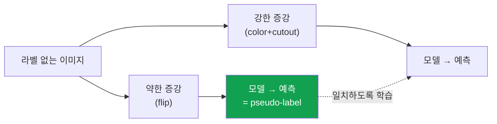

# 비전 데이터 증강

> [!NOTE] 이 챕터의 목표
> 데이터 증강(data augmentation)은 이미 가진 이미지에 label-preserving 변환을 표본화해 **학습 분포를 넓히는** 기법입니다. 새 독립 정보를 공짜로 만드는 것은 아니지만, 유용한 inductive bias를 주입합니다. 어떤 변형들이 있는지, 그리고 라벨(박스·마스크)을 어떻게 함께 변형하는지를 그림으로 잡습니다. 구현 코드는 [Dataloader & 증강](#/ml-coding/dataloader-augmentation)에서 직접 실행해 볼 수 있습니다.

## 무엇을 / 왜

딥러닝 모델은 데이터가 많을수록 잘 일반화합니다([Regularization & 일반화](#/foundations/regularization-generalization) 참고). 하지만 라벨링된 이미지는 비쌉니다. **데이터 증강**은 한 장의 이미지를 좌우로 뒤집거나(flip), 일부를 잘라내거나(crop), 색을 살짝 바꿔서 **"같은 정답을 가진 새로운 변형"** 을 만들어 냅니다.

핵심 직관: 분류에서는 고양이를 **좌우로 뒤집어도 고양이**이고, 조금 어둡거나 확대해도 label이 유지될 수 있습니다. 모델은 이런 변환에 대한 **불변성(invariance)** 을 배웁니다. 반면 detection·segmentation의 위치 출력은 이미지 변환과 함께 움직여야 하므로 목표는 **등변성(equivariance)** 입니다. 적절한 증강은 훈련 데이터의 우연한 상관을 덜 쓰게 하지만, 실제 배포 분포와 동떨어진 변환은 오히려 해롭습니다.

<figure>
<svg viewBox="0 0 640 180" xmlns="http://www.w3.org/2000/svg" font-family="Inter, sans-serif" font-size="12">
  <g>
    <text x="70" y="18" text-anchor="middle" fill="#98a3b2">원본</text>
    <rect x="30" y="28" width="80" height="80" rx="6" fill="none" stroke="#98a3b2" stroke-width="1.5"/>
    <circle cx="60" cy="70" r="16" fill="#0ea5e9"/><circle cx="88" cy="58" r="9" fill="#e0533f"/>
    <text x="70" y="128" text-anchor="middle" fill="#12a150">고양이 ✓</text>
  </g>
  <g>
    <text x="200" y="18" text-anchor="middle" fill="#98a3b2">좌우 반전</text>
    <rect x="160" y="28" width="80" height="80" rx="6" fill="none" stroke="#98a3b2" stroke-width="1.5"/>
    <circle cx="210" cy="70" r="16" fill="#0ea5e9"/><circle cx="182" cy="58" r="9" fill="#e0533f"/>
    <text x="200" y="128" text-anchor="middle" fill="#12a150">고양이 ✓</text>
  </g>
  <g>
    <text x="330" y="18" text-anchor="middle" fill="#98a3b2">랜덤 크롭+확대</text>
    <rect x="290" y="28" width="80" height="80" rx="6" fill="none" stroke="#98a3b2" stroke-width="1.5"/>
    <circle cx="326" cy="74" r="24" fill="#0ea5e9"/><circle cx="358" cy="56" r="13" fill="#e0533f"/>
    <text x="330" y="128" text-anchor="middle" fill="#12a150">고양이 ✓</text>
  </g>
  <g>
    <text x="460" y="18" text-anchor="middle" fill="#98a3b2">색 변형</text>
    <rect x="420" y="28" width="80" height="80" rx="6" fill="none" stroke="#98a3b2" stroke-width="1.5"/>
    <circle cx="450" cy="70" r="16" fill="#6366f1"/><circle cx="478" cy="58" r="9" fill="#d97706"/>
    <text x="460" y="128" text-anchor="middle" fill="#12a150">고양이 ✓</text>
  </g>
  <g>
    <text x="590" y="18" text-anchor="middle" fill="#98a3b2">회전</text>
    <rect x="550" y="28" width="80" height="80" rx="6" fill="none" stroke="#98a3b2" stroke-width="1.5" transform="rotate(12 590 68)"/>
    <circle cx="580" cy="72" r="16" fill="#0ea5e9"/><circle cx="606" cy="56" r="9" fill="#e0533f"/>
    <text x="590" y="128" text-anchor="middle" fill="#12a150">고양이 ✓</text>
  </g>
</svg>
<figcaption>한 장의 이미지 → 여러 변형. 모두 정답은 그대로 "고양이"입니다. 모델은 이런 변형을 겪으며 위치·색·크기 변화에 <b>강건(robust)</b>해집니다.</figcaption>
</figure>

## 자주 쓰는 변형들

<dl class="kv">
<dt>Flip (반전)</dt><dd>좌우(가장 흔함) 또는 상하. 좌우 반전은 대부분의 자연 이미지에서 안전합니다. <b>단, 글자·숫자·좌우 의미가 있는 것(예: 표지판)에는 쓰면 안 됩니다.</b></dd>
<dt>Crop & Resize (크롭·리사이즈)</dt><dd>이미지 일부를 무작위로 잘라 원래 크기로 확대. 모델이 객체의 일부만 봐도 인식하도록 훈련. (RandomResizedCrop이 표준)</dd>
<dt>Color jitter (색 변형)</dt><dd>밝기·대비·채도·색조를 살짝 흔들기. 조명 변화에 강건해짐.</dd>
<dt>Rotation / Affine (회전·기하 변형)</dt><dd>작은 각도 회전, 이동, 확대/축소. 과하면 라벨이 깨지니 범위를 작게.</dd>
<dt>Normalize (정규화)</dt><dd>엄밀히는 증강이 아니라 전처리지만 항상 함께 다님 — 채널별 평균/표준편차로 스케일 통일. ([구현](#/ml-coding/dataloader-augmentation))</dd>
</dl>

> [!WARNING] 증강은 "정답을 바꾸지 않아야" 합니다
> 첫 번째 규칙은 **변환 뒤의 target이 정확히 정의되어야 한다**는 것입니다. 분류 label은 그대로일 수 있지만 박스·마스크·keypoint·flow·depth는 함께 변환하거나 유효 영역을 다시 계산해야 합니다. 손글씨 '6'을 180° 돌리면 '9'가 되고, 의료 영상의 색 변형은 병변 신호를 지울 수 있습니다. 도메인마다 안전한 변환과 강도를 validation으로 확인하세요.

## 라벨도 함께 변형해야 한다

분류(classification)는 이미지를 뒤집어도 라벨("고양이")이 그대로입니다. 하지만 **검출(박스)** 이나 **분할(마스크)** 은 이미지를 뒤집으면 **박스·마스크 좌표도 똑같이 뒤집어야** 합니다. 안 그러면 정답이 이미지와 어긋납니다.

<figure>
<svg viewBox="0 0 640 170" xmlns="http://www.w3.org/2000/svg" font-family="Inter, sans-serif" font-size="12">
  <text x="150" y="18" text-anchor="middle" fill="#98a3b2">원본 (박스 = 왼쪽 객체)</text>
  <rect x="60" y="30" width="180" height="110" rx="6" fill="none" stroke="#98a3b2" stroke-width="1.5"/>
  <circle cx="105" cy="90" r="26" fill="#0ea5e9" opacity="0.6"/>
  <rect x="78" y="62" width="55" height="56" rx="3" fill="none" stroke="#e0533f" stroke-width="2.5"/>
  <path d="M260 85 H320" stroke="#98a3b2" stroke-width="1.5" marker-end="url(#af)"/>
  <text x="290" y="76" text-anchor="middle" fill="#98a3b2">flip</text>
  <text x="490" y="18" text-anchor="middle" fill="#98a3b2">반전 (박스도 함께 반전 ✓)</text>
  <rect x="400" y="30" width="180" height="110" rx="6" fill="none" stroke="#98a3b2" stroke-width="1.5"/>
  <circle cx="535" cy="90" r="26" fill="#0ea5e9" opacity="0.6"/>
  <rect x="507" y="62" width="55" height="56" rx="3" fill="none" stroke="#12a150" stroke-width="2.5"/>
  <defs><marker id="af" markerWidth="8" markerHeight="8" refX="6" refY="3" orient="auto"><path d="M0 0 L6 3 L0 6" fill="#98a3b2"/></marker></defs>
</svg>
<figcaption>이미지를 좌우 반전하면 박스도 같은 좌표 convention으로 옮겨야 합니다. 반열린 좌표 <code>[x1,x2)</code>라면 <code>x1′=W−x2, x2′=W−x1</code>입니다. Inclusive pixel index라면 식이 달라집니다. 이 "라벨 동기화"와 convention 혼용이 단골 버그입니다 — <a href="#/ml-coding/dataloader-augmentation">flip_boxes 구현</a> 참고.</figcaption>
</figure>

> **개념 코드 — 기하 변환은 한 번 뽑아 모든 target에 재사용**

```python
params = sample_geometric_transform(rng)       # crop/flip/resize를 한 번 샘플
image = warp_image(image, params)              # image: [C,H,W]
boxes = warp_boxes_xyxy(boxes, params)         # boxes: [N,4], 같은 좌표 convention
masks = warp_masks(masks, params, mode="nearest")  # class-id mask에 bilinear 금지
keypoints = warp_keypoints(keypoints, params)

boxes, keep = clip_and_filter_boxes(boxes, image.shape[-2:])
labels, masks = labels[keep], masks[keep]       # 제거된 객체의 target도 함께 제거
keypoints = keypoints[keep]
```

## 약한 증강 vs 강한 증강 (weak vs strong)

이 구분은 준지도학습에서 핵심입니다. **약한 증강(weak)** = 살짝만(flip, 작은 crop). **강한 증강(strong)** = 세게(강한 색 변형, RandAugment, Cutout 등).

**FixMatch** 같은 방법은 이 둘을 영리하게 씁니다: 라벨 없는 이미지에 **약한 증강**을 걸어 나온 예측을 "가짜 정답(pseudo-label)"으로 삼고, 같은 이미지의 **강한 증강** 버전이 그 가짜 정답을 맞히도록 훈련합니다. "쉬운 버전으로 답을 정하고, 어려운 버전이 그 답에 일치하도록" 만드는 것이죠. 자세히는 [Weak & Semi-Supervised](#/cv/weak-semi-supervised).



## Mixup & CutMix — 이미지를 섞기

더 공격적인 증강은 **두 이미지를 섞습니다.**

- **Mixup**: 두 이미지를 픽셀 단위로 $\lambda$ 비율로 섞고, 라벨도 같은 비율로 섞습니다. 예: 고양이 70% + 개 30% 이미지 → 라벨도 (고양이 0.7, 개 0.3).
- **CutMix**: 한 이미지의 사각형 영역을 다른 이미지 조각으로 붙이고, 라벨은 붙인 넓이 비율로 섞습니다.

효과: 모델이 지나치게 날카로운 결정 경계를 쓰지 않도록 하는 regularizer가 될 수 있습니다. 정확도와 [calibration](#/foundations/evaluation-metrics) 변화는 데이터·loss·강도에 따라 달라 반드시 따로 측정해야 합니다.

아래에서 mixup의 픽셀 혼합을 직접 구현해 보세요. 규칙은 `out = λ·x1 + (1−λ)·x2`.

<div class="widget" data-widget="code">
<script type="application/json" class="code-config">
{"func":"mixup","packages":["numpy"],"approx":true,"starter":"def mixup(x1, x2, lam):\n    # 두 이미지(벡터) x1, x2 를 lam 비율로 섞어 리스트로 반환.\n    # out = lam * x1 + (1 - lam) * x2  (원소별)\n    pass","tests":[{"args":[[0,0],[10,10],0.3],"expect":[7.0,7.0]},{"args":[[2,4],[6,8],0.5],"expect":[4.0,6.0]},{"args":[[1,1],[9,9],1.0],"expect":[1.0,1.0]},{"args":[[[0,2],[4,6]],[[10,12],[14,16]],0.25],"expect":[[7.5,9.5],[11.5,13.5]]}],"solution":"import numpy as np\n\ndef mixup(x1, x2, lam):\n    a = np.asarray(x1, dtype=float)\n    b = np.asarray(x2, dtype=float)\n    if a.shape != b.shape:\n        raise ValueError(\"x1 and x2 must have the same shape\")\n    if not np.isscalar(lam) or not np.isfinite(lam) or not 0.0 <= lam <= 1.0:\n        raise ValueError(\"lam must be a finite scalar in [0, 1]\")\n    if not np.all(np.isfinite(a)) or not np.all(np.isfinite(b)):\n        raise ValueError(\"inputs must be finite\")\n    return (lam * a + (1.0 - lam) * b).tolist()"}
</script>
</div>

> [!TIP] 면접 한 줄
> "증강은 데이터 분포에 대한 **사전 지식(불변성)** 을 주입하는 값싼 정규화다." 강한 답은 여기에 **도메인 의존성**(어떤 변형이 라벨을 깨는가), **약/강 증강의 준지도 활용**(FixMatch), 그리고 **테스트 시점 증강(TTA)** 까지 연결합니다.

## Q&A

<details class="qa"><summary>증강은 훈련할 때만 하나요, 테스트할 때도 하나요?</summary>
<div class="qa-body">

**짧게:** 보통 훈련할 때만 합니다. 테스트에는 결정적(deterministic) 전처리만 씁니다.

**깊게:** 훈련 시 무작위 증강으로 다양성을 주지만, 평가/추론에서는 재현성을 위해 고정된 리사이즈+정규화를 적용하는 것이 보통입니다. 예외가 **TTA(Test-Time Augmentation)입니다.** 여러 view의 예측을 합치되, detection box·segmentation mask처럼 공간 출력은 먼저 원래 좌표계로 inverse-transform해야 합니다. 이득은 보장되지 않고 latency가 view 수만큼 늘 수 있습니다.
</div></details>

<details class="qa"><summary>증강을 아무리 세게 해도 좋은가요?</summary>
<div class="qa-body">

**짧게:** 아니요 — 라벨을 깨거나 실제 분포에서 너무 벗어나면 오히려 해롭습니다.

**깊게:** 증강 강도는 하이퍼파라미터입니다. 너무 약하면 효과가 없고, 너무 강하면 학습을 방해합니다. **AutoAugment**는 별도 search로 policy를 찾고, **RandAugment**는 연산 개수와 공통 magnitude로 search space를 단순화합니다. 데이터가 많아도 desired invariance·robustness 때문에 증강이 유용할 수 있으므로 효과가 사라진다고 단정할 수 없습니다.
</div></details>

## Cheat-sheet

| 개념 | 한 줄 |
| --- | --- |
| 증강이 하는 일 | 이미지를 변형해 데이터를 늘려 과대적합↓, 일반화↑ |
| 핵심 규칙 | 변형 후에도 **라벨이 유효**해야 함 |
| 라벨 동기화 | 검출/분할은 박스·마스크 좌표도 함께 변형 |
| weak vs strong | 약한=flip 등, 강한=RandAugment/Cutout; FixMatch가 둘을 함께 사용 |
| Mixup/CutMix | 두 이미지+라벨을 비율로 섞음 → overconfidence↓ |
| 테스트 시점 | 보통 증강 안 함(고정 전처리); 예외는 TTA |

**다음:** [자기지도학습 입문](#/cv/self-supervised) · [Dataloader & 증강 구현](#/ml-coding/dataloader-augmentation) · [Regularization & 일반화](#/foundations/regularization-generalization)
