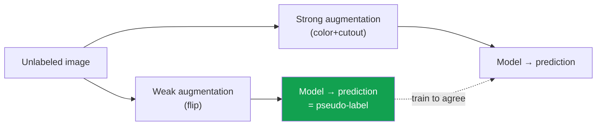

# Data Augmentation for Vision

> [!NOTE] Goal of this chapter
> Data augmentation samples label-preserving transformations of existing images to **broaden the training distribution**. It does not create independent information for free, but it injects useful inductive biases. This chapter illustrates the common transformations and shows how to transform labels—boxes and masks—along with the image. You can run the implementations in [Data Loaders & Augmentation](#/ml-coding/dataloader-augmentation).

## What it is and why it works

Deep learning models generally generalize better with more data; see [Regularization & Generalization](#/foundations/regularization-generalization). Labeled images, however, are expensive. **Data augmentation** flips an image, crops part of it, or changes its colors slightly to create **another variation with the same target**.

The core intuition for classification is that a cat is **still a cat after a horizontal flip**, and the label can also remain valid after modest darkening or zooming. The model learns **invariance** to these transformations. For detection and segmentation, spatial outputs must move along with the transformed image, so the desired property is **equivariance**. Appropriate augmentation discourages reliance on accidental correlations in the training set, but transformations far outside the deployment distribution can hurt instead.

<figure>
<svg viewBox="0 0 640 180" xmlns="http://www.w3.org/2000/svg" font-family="Inter, sans-serif" font-size="12">
  <g>
    <text x="70" y="18" text-anchor="middle" fill="#98a3b2">original</text>
    <rect x="30" y="28" width="80" height="80" rx="6" fill="none" stroke="#98a3b2" stroke-width="1.5"/>
    <circle cx="60" cy="70" r="16" fill="#0ea5e9"/><circle cx="88" cy="58" r="9" fill="#e0533f"/>
    <text x="70" y="128" text-anchor="middle" fill="#12a150">cat ✓</text>
  </g>
  <g>
    <text x="200" y="18" text-anchor="middle" fill="#98a3b2">horizontal flip</text>
    <rect x="160" y="28" width="80" height="80" rx="6" fill="none" stroke="#98a3b2" stroke-width="1.5"/>
    <circle cx="210" cy="70" r="16" fill="#0ea5e9"/><circle cx="182" cy="58" r="9" fill="#e0533f"/>
    <text x="200" y="128" text-anchor="middle" fill="#12a150">cat ✓</text>
  </g>
  <g>
    <text x="330" y="18" text-anchor="middle" fill="#98a3b2">random crop + zoom</text>
    <rect x="290" y="28" width="80" height="80" rx="6" fill="none" stroke="#98a3b2" stroke-width="1.5"/>
    <circle cx="326" cy="74" r="24" fill="#0ea5e9"/><circle cx="358" cy="56" r="13" fill="#e0533f"/>
    <text x="330" y="128" text-anchor="middle" fill="#12a150">cat ✓</text>
  </g>
  <g>
    <text x="460" y="18" text-anchor="middle" fill="#98a3b2">color jitter</text>
    <rect x="420" y="28" width="80" height="80" rx="6" fill="none" stroke="#98a3b2" stroke-width="1.5"/>
    <circle cx="450" cy="70" r="16" fill="#6366f1"/><circle cx="478" cy="58" r="9" fill="#d97706"/>
    <text x="460" y="128" text-anchor="middle" fill="#12a150">cat ✓</text>
  </g>
  <g>
    <text x="590" y="18" text-anchor="middle" fill="#98a3b2">rotation</text>
    <rect x="550" y="28" width="80" height="80" rx="6" fill="none" stroke="#98a3b2" stroke-width="1.5" transform="rotate(12 590 68)"/>
    <circle cx="580" cy="72" r="16" fill="#0ea5e9"/><circle cx="606" cy="56" r="9" fill="#e0533f"/>
    <text x="590" y="128" text-anchor="middle" fill="#12a150">cat ✓</text>
  </g>
</svg>
<figcaption>One image becomes several variations, all with the same “cat” target. Experiencing these variations teaches the model to be <b>robust</b> to changes in position, color, and scale.</figcaption>
</figure>

## Common transformations

<dl class="kv">
<dt>Flip</dt><dd>Horizontal (most common) or vertical. Horizontal flips are safe for many natural images. <b>Do not use them blindly for text, digits, or objects whose left/right orientation carries meaning, such as signs.</b></dd>
<dt>Crop & resize</dt><dd>Randomly crop part of an image and resize it to the original dimensions. This trains the model to recognize an object even when only part of it is visible. RandomResizedCrop is a standard example.</dd>
<dt>Color jitter</dt><dd>Perturb brightness, contrast, saturation, and hue slightly to improve robustness to lighting changes.</dd>
<dt>Rotation / affine transform</dt><dd>Apply small rotations, translations, or scale changes. Keep the range modest because an excessive transform can invalidate the target.</dd>
<dt>Normalize</dt><dd>Strictly speaking, this is preprocessing rather than augmentation, but the two usually appear together. Subtract a per-channel mean and divide by a per-channel standard deviation to standardize scale. See the [implementation](#/ml-coding/dataloader-augmentation).</dd>
</dl>

> [!WARNING] Augmentation must preserve the target
> The first rule is that the target after transformation must be precisely defined. A classification label may remain unchanged, but boxes, masks, keypoints, optical flow, and depth must be transformed as well or have their valid regions recomputed. Rotating a handwritten “6” by 180° can turn it into a “9,” and color jitter in medical imaging can erase a lesion signal. Validate the safe transformations and their strengths for each domain.

## Transform the labels too

For classification, flipping an image does not change its “cat” label. For **detection boxes** or **segmentation masks**, however, flipping the image requires flipping the **box or mask coordinates in exactly the same way**. Otherwise, the target no longer aligns with the image.

<figure>
<svg viewBox="0 0 640 170" xmlns="http://www.w3.org/2000/svg" font-family="Inter, sans-serif" font-size="12">
  <text x="150" y="18" text-anchor="middle" fill="#98a3b2">original (box = object on the left)</text>
  <rect x="60" y="30" width="180" height="110" rx="6" fill="none" stroke="#98a3b2" stroke-width="1.5"/>
  <circle cx="105" cy="90" r="26" fill="#0ea5e9" opacity="0.6"/>
  <rect x="78" y="62" width="55" height="56" rx="3" fill="none" stroke="#e0533f" stroke-width="2.5"/>
  <path d="M260 85 H320" stroke="#98a3b2" stroke-width="1.5" marker-end="url(#af)"/>
  <text x="290" y="76" text-anchor="middle" fill="#98a3b2">flip</text>
  <text x="490" y="18" text-anchor="middle" fill="#98a3b2">flipped (box flipped too ✓)</text>
  <rect x="400" y="30" width="180" height="110" rx="6" fill="none" stroke="#98a3b2" stroke-width="1.5"/>
  <circle cx="535" cy="90" r="26" fill="#0ea5e9" opacity="0.6"/>
  <rect x="507" y="62" width="55" height="56" rx="3" fill="none" stroke="#12a150" stroke-width="2.5"/>
  <defs><marker id="af" markerWidth="8" markerHeight="8" refX="6" refY="3" orient="auto"><path d="M0 0 L6 3 L0 6" fill="#98a3b2"/></marker></defs>
</svg>
<figcaption>When an image is flipped horizontally, its box must move under the same coordinate convention. For half-open coordinates <code>[x1,x2)</code>, use <code>x1′=W−x2, x2′=W−x1</code>. The formula differs for inclusive pixel indices. Mixing conventions and failing to synchronize labels are common bugs; see the <a href="#/ml-coding/dataloader-augmentation">flip_boxes implementation</a>.</figcaption>
</figure>

> **Concept code — sample one geometric transform and reuse it for every target**

```python
params = sample_geometric_transform(rng)       # sample crop/flip/resize once
image = warp_image(image, params)              # image: [C,H,W]
boxes = warp_boxes_xyxy(boxes, params)         # boxes: [N,4], same coordinate convention
masks = warp_masks(masks, params, mode="nearest")  # never bilinear-interpolate a class-ID mask
keypoints = warp_keypoints(keypoints, params)

boxes, keep = clip_and_filter_boxes(boxes, image.shape[-2:])
labels, masks = labels[keep], masks[keep]       # also remove targets for discarded objects
keypoints = keypoints[keep]
```

## Weak vs strong augmentation

This distinction is central to semi-supervised learning. **Weak augmentation** perturbs an image only slightly, with transforms such as a flip or small crop. **Strong augmentation** changes it more aggressively, with strong color jitter, RandAugment, Cutout, and similar methods.

Methods such as **FixMatch** combine the two cleverly. They apply weak augmentation to an unlabeled image and use the model's prediction as a **pseudo-label**. They then train the model to predict the same pseudo-label for a strongly augmented version of that image. In short: decide the answer from an easy view, then make a difficult view agree with it. Continue to [Weak & Semi-Supervised Learning](#/cv/weak-semi-supervised).



## Mixup & CutMix — combine images

More aggressive augmentations **combine two images**.

- **Mixup** blends two images pixel by pixel according to a ratio $\lambda$, and blends their labels by the same ratio. For example, a 70% cat + 30% dog image receives the soft label (cat 0.7, dog 0.3).
- **CutMix** pastes a rectangular patch from one image into another and mixes the labels according to the pasted area.

These methods can regularize the model away from overly sharp decision boundaries. Their effects on accuracy and [calibration](#/foundations/evaluation-metrics) depend on the data, loss, and augmentation strength, so measure each separately.

Implement Mixup's pixel blend below. The rule is `out = λ·x1 + (1−λ)·x2`.

<div class="widget" data-widget="code">
<script type="application/json" class="code-config">
{"func":"mixup","packages":["numpy"],"approx":true,"starter":"def mixup(x1, x2, lam):\n    # Blend two images (vectors) x1 and x2 by lam, and return the result as a list.\n    # out = lam * x1 + (1 - lam) * x2  (elementwise)\n    pass","tests":[{"args":[[0,0],[10,10],0.3],"expect":[7.0,7.0]},{"args":[[2,4],[6,8],0.5],"expect":[4.0,6.0]},{"args":[[1,1],[9,9],1.0],"expect":[1.0,1.0]},{"args":[[[0,2],[4,6]],[[10,12],[14,16]],0.25],"expect":[[7.5,9.5],[11.5,13.5]]}],"solution":"import numpy as np\n\ndef mixup(x1, x2, lam):\n    a = np.asarray(x1, dtype=float)\n    b = np.asarray(x2, dtype=float)\n    if a.shape != b.shape:\n        raise ValueError(\"x1 and x2 must have the same shape\")\n    if not np.isscalar(lam) or not np.isfinite(lam) or not 0.0 <= lam <= 1.0:\n        raise ValueError(\"lam must be a finite scalar in [0, 1]\")\n    if not np.all(np.isfinite(a)) or not np.all(np.isfinite(b)):\n        raise ValueError(\"inputs must be finite\")\n    return (lam * a + (1.0 - lam) * b).tolist()"}
</script>
</div>

> [!TIP] Interview one-liner
> “Augmentation is an inexpensive regularizer that injects **prior knowledge about invariances** into the data distribution.” A strong answer also covers **domain dependence**—which transforms break the target—**weak/strong augmentation in semi-supervised learning** such as FixMatch, and **test-time augmentation (TTA)**.

## Q&A

<details class="qa"><summary>Is augmentation only for training, or do we use it at test time too?</summary>
<div class="qa-body">

**Short answer:** Usually only during training. At test time, use deterministic preprocessing.

**In depth:** Random augmentation adds diversity during training, while evaluation and inference normally use a fixed resize and normalization for reproducibility. The exception is **test-time augmentation (TTA)**: aggregate predictions from several views. For spatial outputs such as detection boxes and segmentation masks, inverse-transform each prediction back into the original coordinate system before combining them. Gains are not guaranteed, and latency can grow in proportion to the number of views.
</div></details>

<details class="qa"><summary>Is stronger augmentation always better?</summary>
<div class="qa-body">

**Short answer:** No. It can break the target or move samples too far from the real distribution.

**In depth:** Augmentation strength is a hyperparameter. Too little has no effect; too much disrupts learning. **AutoAugment** searches for a policy in a separate optimization process, while **RandAugment** simplifies the search space to the number of operations and a shared magnitude. Even with abundant data, augmentation can still provide desired invariance and robustness, so do not assume its benefit disappears.
</div></details>

## Cheat sheet

| Concept | In one line |
| --- | --- |
| What augmentation does | Transform images to reduce overfitting and improve generalization |
| Core rule | The **target must remain valid** after the transform |
| Label synchronization | For detection/segmentation, transform box and mask coordinates too |
| Weak vs strong | Weak = flips, etc.; strong = RandAugment/Cutout; FixMatch uses both |
| Mixup/CutMix | Mix two images and labels proportionally → less overconfidence |
| Test time | Usually no augmentation (fixed preprocessing); TTA is the exception |

**Next:** [Self-Supervised Learning](#/cv/self-supervised) · [Data Loaders & Augmentation](#/ml-coding/dataloader-augmentation) · [Regularization & Generalization](#/foundations/regularization-generalization)
