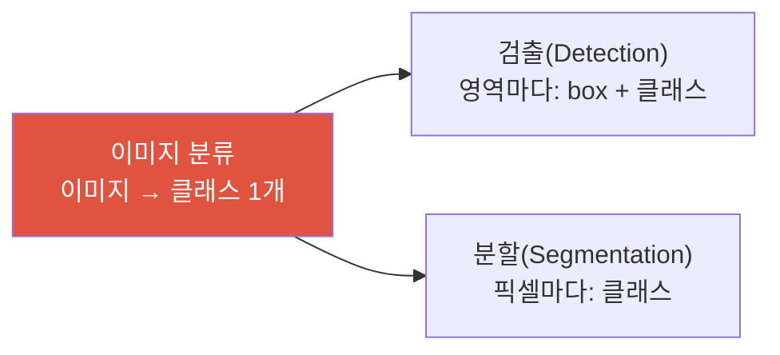

# 이미지 분류

> [!NOTE] 이 챕터의 목표
> 컴퓨터 비전의 **가장 기본이 되는 작업**인 이미지 분류(image classification)를 잡습니다. "이 사진은 무엇인가?"에 하나의 라벨로 답하는 일이죠. 검출(detection)·분할(segmentation) 같은 더 복잡한 작업도 결국 내부에 이 **분류 head**를 품고 있으니, 여기가 비전 여정의 출발점입니다.

## 무엇을, 왜

이미지 분류는 **이미지 한 장 → 클래스 라벨 하나**로 대응시키는 작업입니다. 예: 사진 → "고양이". [머신러닝이란?](#/foundations/what-is-ml)에서 본 지도학습의 전형적인 예입니다 — (이미지, 정답 라벨) 쌍으로 학습합니다.

- **MNIST**: 손글씨 숫자 0~9 (28×28 흑백). 딥러닝의 "Hello World".
- **ImageNet-1k**: 1000개 클래스, 약 128만 장의 train 이미지. 오랫동안 표준 분류 benchmark·사전학습 원천이었지만, 오늘날에는 더 큰 지도/자기지도/이미지-텍스트 사전학습도 흔합니다([백본 & 전이학습](#/cv/backbones-transfer) 참고).

> [!TIP] 면접 한 줄
> "분류는 비전의 원자 단위다 — detection은 '어디에(box) + 무엇(분류)', segmentation은 '픽셀마다 분류'다." 이렇게 상위 작업을 분류로 환원해 설명하면 계보를 이해한 것으로 들립니다.

## 파이프라인: 이미지 → 확률 → 클래스

분류 모델은 이미지에서 **특징(feature)** 을 뽑고 클래스마다 점수(**logit**)를 냅니다. 다중 클래스 추론에서는 `argmax`로 class를 고를 수 있고, softmax로 합이 1인 score를 만들 수 있습니다. 이 score가 실제 정답 빈도와 맞는 **보정된 확률**인지는 별도 문제입니다.

<figure>
<svg viewBox="0 0 660 200" xmlns="http://www.w3.org/2000/svg" font-family="Inter, sans-serif" font-size="12">
  <text x="55" y="24" text-anchor="middle" fill="#98a3b2">입력 이미지</text>
  <g stroke="#0ea5e9" stroke-width="1.2" fill="none">
    <rect x="25" y="35" width="60" height="60" rx="4"/>
    <line x1="45" y1="35" x2="45" y2="95"/><line x1="65" y1="35" x2="65" y2="95"/>
    <line x1="25" y1="55" x2="85" y2="55"/><line x1="25" y1="75" x2="85" y2="75"/>
  </g>
  <path d="M92 65 H130" stroke="#98a3b2" stroke-width="1.5" marker-end="url(#a)"/>
  <rect x="132" y="45" width="96" height="40" rx="8" fill="#6366f1"/>
  <text x="180" y="62" text-anchor="middle" fill="#fff" font-size="11">특징 추출</text>
  <text x="180" y="77" text-anchor="middle" fill="#fff" font-size="11">(CNN/ViT)</text>
  <path d="M228 65 H266" stroke="#98a3b2" stroke-width="1.5" marker-end="url(#a)"/>
  <text x="315" y="24" text-anchor="middle" fill="#98a3b2">logit (점수)</text>
  <g fill="#98a3b2"><rect x="278" y="70" width="16" height="25"/><rect x="298" y="45" width="16" height="50"/><rect x="318" y="80" width="16" height="15"/><rect x="338" y="88" width="16" height="7"/></g>
  <path d="M362 65 H400" stroke="#98a3b2" stroke-width="1.5" marker-end="url(#a)"/>
  <text x="381" y="58" text-anchor="middle" fill="#12a150" font-size="10">softmax</text>
  <text x="452" y="24" text-anchor="middle" fill="#98a3b2">확률 (합=1)</text>
  <g fill="#12a150"><rect x="415" y="72" width="16" height="23"/><rect x="435" y="40" width="16" height="55"/><rect x="455" y="82" width="16" height="13"/><rect x="475" y="86" width="16" height="9"/></g>
  <text x="443" y="36" text-anchor="middle" fill="#12a150" font-size="10">0.7</text>
  <path d="M498 65 H536" stroke="#98a3b2" stroke-width="1.5" marker-end="url(#a)"/>
  <text x="600" y="58" text-anchor="middle" fill="#e0533f" font-size="10">argmax</text>
  <rect x="548" y="48" width="96" height="34" rx="8" fill="#e0533f"/>
  <text x="596" y="70" text-anchor="middle" fill="#fff">🐱 "고양이"</text>
  <text x="330" y="150" text-anchor="middle" fill="#98a3b2">logit은 임의의 실수 · softmax가 0~1 확률로 정규화 · 가장 큰 확률의 클래스를 예측</text>
  <defs><marker id="a" markerWidth="8" markerHeight="8" refX="6" refY="3" orient="auto"><path d="M0 0 L6 3 L0 6" fill="#98a3b2"/></marker></defs>
</svg>
<figcaption>분류 파이프라인. 특징 추출부(CNN 또는 ViT)가 이미지를 벡터로 요약하고, 마지막 <b>분류 head</b>가 클래스별 logit을 냅니다. Class만 필요하면 logit에서 바로 argmax해도 같고, softmax는 합이 1인 score가 필요할 때 적용합니다.</figcaption>
</figure>

학습은 **cross-entropy(교차 엔트로피) 손실**을 줄이는 방향으로 진행됩니다. `torch.nn.CrossEntropyLoss`처럼 수치적으로 안정적인 구현은 raw logits에서 `log_softmax`와 negative log-likelihood를 결합하므로, 모델에서 softmax를 먼저 적용하면 안 됩니다. 유도·구현은 [손실 & gradient](#/ml-coding/losses-gradients)에서 다룹니다.

## 얼마나 잘하나: top-1 / top-5 정확도

- **top-1 accuracy(정확도)**: 가장 확률 높은 예측이 정답과 같은 비율.
- **top-5 accuracy**: 확률 상위 5개 안에 정답이 있으면 맞은 것으로 침. ImageNet처럼 클래스가 많고 "말라뮤트 vs 허스키"처럼 헷갈리는 클래스가 있을 때 관대하게 재는 지표입니다.

정확도 하나로 부족한 경우(클래스 불균형 등)와 precision/recall 이야기는 [평가 지표](#/foundations/evaluation-metrics)에서 이어집니다.

## 직접 돌려보기 — top-k 정확도

logit과 정답 라벨이 주어졌을 때 **top-k 정확도**를 계산해 봅시다. 각 행에서 확률(=logit 순서) 상위 $k$개 안에 정답이 있으면 맞은 것으로 셉니다.

softmax를 통과시키지 않아도 됩니다. 각 logit에 같은 양의 분모가 적용되므로 순서가 유지되어, 정확도만 잴 때는 raw logit의 argmax/top-k로 충분합니다. 확률처럼 해석하려면 softmax score의 calibration과 분포 이동을 별도로 확인해야 합니다.

## 분류 head는 어디에나 있다

분류를 익혀두면 이후 작업들이 "분류의 변주"로 보입니다:

- **검출**: "어디에(bounding box) 무엇이(분류) 있나" → [객체 검출](#/cv/detection)
- **분할**: "픽셀 하나하나가 어느 클래스인가" → [Segmentation](#/cv/segmentation)

즉 강력한 **특징 추출부(백본)** 를 분류로 사전학습한 뒤, 뒤에 붙는 head만 바꿔 다른 작업에 재사용합니다 — 이것이 [전이학습](#/cv/backbones-transfer)의 핵심입니다.

## Q&A

왜 logit에 바로 argmax 하지 않고 softmax를 거치나요?

**짧게:** 예측 클래스만 필요하면 raw logit의 argmax로 충분합니다. Softmax는 합이 1인 score가 필요할 때 쓰지만, 그 값이 자동으로 보정된 신뢰도는 아닙니다.

**깊게:** $e^{z_i}/\sum_j e^{z_j}$는 logit의 순서를 보존하므로 argmax 결과를 바꾸지 않습니다. Cross-entropy는 수치 안정성을 위해 logits에서 log-sum-exp 형태로 직접 계산합니다. Softmax score를 의사결정 confidence로 쓴다면 reliability diagram·ECE·NLL과 temperature scaling을 검토하고, out-of-distribution 입력에서는 높은 score가 신뢰성을 보장하지 않는다는 점을 기억하세요. 자세한 내용은 [손실 & gradient](#/ml-coding/losses-gradients)와 [평가 지표](#/foundations/evaluation-metrics).

multi-class와 multi-label 분류는 어떻게 다른가요?

**짧게:** multi-class는 정답이 **정확히 하나**(softmax + CE), multi-label은 **여러 개 동시**(각 클래스에 독립 sigmoid + BCE).

**깊게:** "개 vs 고양이 vs 새" 중 하나를 고르는 것은 multi-class — 확률의 합이 1이 되도록 softmax를 씁니다. 반면 "이 사진에 하늘·나무·사람이 있나?"처럼 여러 라벨이 동시에 참일 수 있으면 multi-label — 클래스마다 독립적으로 sigmoid를 적용하고 BCE로 학습합니다.

## Cheat-sheet

| 개념 | 한 줄 |
| --- | --- |
| 이미지 분류 | 이미지 → 클래스 라벨 1개 (지도학습) |
| 파이프라인 | 이미지 → 특징 → logit → softmax → argmax |
| 손실 | raw logits에 cross-entropy (`log_softmax`와 NLL의 안정적 결합) |
| top-1 / top-5 | 1위 정답 / 상위 5개 안에 정답 |
| multi-class vs multi-label | softmax+CE (하나) vs sigmoid+BCE (여러 개) |
| 왜 중요 | detection·segmentation의 내부 분류 head |

**다음:** [비전을 위한 CNN](#/cv/cnns-for-vision) · [평가 지표](#/foundations/evaluation-metrics) · [손실 & gradient](#/ml-coding/losses-gradients)
