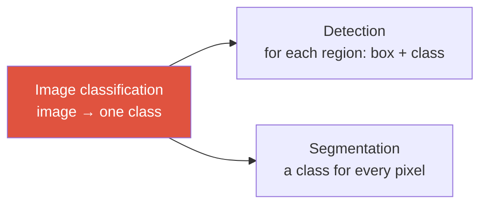

# Image Classification

> [!NOTE] Goal of this chapter
> Image classification is the **most fundamental task in computer vision**. It answers “What is in this image?” with a single label. More complex tasks such as detection and segmentation still contain this kind of **classification head**, so this is the starting point for the vision journey.

## What it is and why it matters

Image classification maps **one image to one class label**. For example: photograph → “cat.” It is a classic example of the supervised learning introduced in [What Is Machine Learning?](#/foundations/what-is-ml): the model learns from (image, ground-truth label) pairs.

- **MNIST**: handwritten digits 0–9 in 28×28 grayscale images—the “Hello, World!” of deep learning.
- **ImageNet-1k**: 1,000 classes and roughly 1.28 million training images. It was long the standard classification benchmark and source of pretrained weights, although larger supervised, self-supervised, and image–text pretraining datasets are also common today. See [Backbones & Transfer Learning](#/cv/backbones-transfer).

> [!TIP] Interview one-liner
> “Classification is the atomic unit of vision: detection asks *where* (a box) plus *what* (classification), while segmentation performs classification at every pixel.” Reducing higher-level tasks to classification like this shows that you understand their lineage.

## Pipeline: image → probability → class

A classification model extracts **features** from an image and produces a score, or **logit**, for each class. During multiclass inference, `argmax` selects the class, while softmax can turn the scores into values that sum to 1. Whether those scores are **calibrated probabilities** that match empirical correctness frequencies is a separate question.

<figure>
<svg viewBox="0 0 660 200" xmlns="http://www.w3.org/2000/svg" font-family="Inter, sans-serif" font-size="12">
  <text x="55" y="24" text-anchor="middle" fill="#98a3b2">Input image</text>
  <g stroke="#0ea5e9" stroke-width="1.2" fill="none">
    <rect x="25" y="35" width="60" height="60" rx="4"/>
    <line x1="45" y1="35" x2="45" y2="95"/><line x1="65" y1="35" x2="65" y2="95"/>
    <line x1="25" y1="55" x2="85" y2="55"/><line x1="25" y1="75" x2="85" y2="75"/>
  </g>
  <path d="M92 65 H130" stroke="#98a3b2" stroke-width="1.5" marker-end="url(#a)"/>
  <rect x="132" y="45" width="96" height="40" rx="8" fill="#6366f1"/>
  <text x="180" y="62" text-anchor="middle" fill="#fff" font-size="11">Feature extraction</text>
  <text x="180" y="77" text-anchor="middle" fill="#fff" font-size="11">(CNN/ViT)</text>
  <path d="M228 65 H266" stroke="#98a3b2" stroke-width="1.5" marker-end="url(#a)"/>
  <text x="315" y="24" text-anchor="middle" fill="#98a3b2">Logits (scores)</text>
  <g fill="#98a3b2"><rect x="278" y="70" width="16" height="25"/><rect x="298" y="45" width="16" height="50"/><rect x="318" y="80" width="16" height="15"/><rect x="338" y="88" width="16" height="7"/></g>
  <path d="M362 65 H400" stroke="#98a3b2" stroke-width="1.5" marker-end="url(#a)"/>
  <text x="381" y="58" text-anchor="middle" fill="#12a150" font-size="10">softmax</text>
  <text x="452" y="24" text-anchor="middle" fill="#98a3b2">Scores (sum = 1)</text>
  <g fill="#12a150"><rect x="415" y="72" width="16" height="23"/><rect x="435" y="40" width="16" height="55"/><rect x="455" y="82" width="16" height="13"/><rect x="475" y="86" width="16" height="9"/></g>
  <text x="443" y="36" text-anchor="middle" fill="#12a150" font-size="10">0.7</text>
  <path d="M498 65 H536" stroke="#98a3b2" stroke-width="1.5" marker-end="url(#a)"/>
  <text x="600" y="58" text-anchor="middle" fill="#e0533f" font-size="10">argmax</text>
  <rect x="548" y="48" width="96" height="34" rx="8" fill="#e0533f"/>
  <text x="596" y="70" text-anchor="middle" fill="#fff">🐱 “cat”</text>
  <text x="330" y="150" text-anchor="middle" fill="#98a3b2">logits: any real values · softmax: scores sum to 1 · argmax: largest score wins</text>
  <defs><marker id="a" markerWidth="8" markerHeight="8" refX="6" refY="3" orient="auto"><path d="M0 0 L6 3 L0 6" fill="#98a3b2"/></marker></defs>
</svg>
<figcaption>The classification pipeline. A feature extractor (CNN or ViT) summarizes the image into a vector, and the final <b>classification head</b> produces one logit per class. If you only need the class, taking argmax over the logits gives the same result; apply softmax when you need scores that sum to 1.</figcaption>
</figure>

Training minimizes the **cross-entropy loss**. Numerically stable implementations such as `torch.nn.CrossEntropyLoss` combine `log_softmax` and negative log-likelihood directly on raw logits, so do not apply softmax in the model first. See [Losses & Gradients](#/ml-coding/losses-gradients) for the derivation and implementation.

## How well does it work? Top-1 / top-5 accuracy

- **Top-1 accuracy**: the fraction of examples for which the highest-scoring prediction matches the target.
- **Top-5 accuracy**: an example counts as correct if the target is among the five highest-scoring classes. This is a more permissive metric when there are many classes and fine-grained distinctions, such as “Malamute vs husky” in ImageNet.

For cases where accuracy alone is insufficient—such as class imbalance—and for precision/recall, continue to [Evaluation Metrics](#/foundations/evaluation-metrics).

## Try it yourself — top-k accuracy

Given logits and ground-truth labels, compute **top-k accuracy**. For each row, count the prediction as correct when the target is among the $k$ largest scores, then return the fraction correct.

There is no need to apply softmax first. Every logit in a row receives the same positive denominator, so its ranking is preserved; raw-logit argmax/top-k is sufficient for accuracy. If you want to interpret the outputs as probabilities, separately evaluate calibration and behavior under distribution shift.

## Classification heads are everywhere

Once you understand classification, later tasks look like variations on it:

- **Detection**: “Where is it?” (a bounding box) plus “What is it?” (classification) → [Object Detection](#/cv/detection)
- **Segmentation**: “Which class does each individual pixel belong to?” → [Segmentation](#/cv/segmentation)

In other words, we can pretrain a strong **feature extractor (backbone)** on classification, then reuse it for other tasks by replacing only the head. That is the essence of [transfer learning](#/cv/backbones-transfer).

## Q&A

Why apply softmax instead of taking argmax directly over the logits?

**Short answer:** If you only need the predicted class, argmax over raw logits is enough. Softmax is useful when you need scores that sum to 1, but those values are not automatically calibrated confidence estimates.

**In depth:** $e^{z_i}/\sum_j e^{z_j}$ preserves the ordering of the logits, so it does not change the argmax. Cross-entropy is computed directly from logits in a numerically stable log-sum-exp form. If you use softmax scores as decision confidence, evaluate reliability diagrams, ECE, and NLL; consider temperature scaling; and remember that a high score on an out-of-distribution input does not guarantee reliability. See [Losses & Gradients](#/ml-coding/losses-gradients) and [Evaluation Metrics](#/foundations/evaluation-metrics).

How do multiclass and multilabel classification differ?

**Short answer:** Multiclass has **exactly one** target (softmax + CE); multilabel can have **several at once** (an independent sigmoid + BCE for each class).

**In depth:** Choosing exactly one of “dog vs cat vs bird” is multiclass classification, so softmax makes the scores sum to 1. When several labels can be true simultaneously—“Does this image contain sky, trees, or people?”—the task is multilabel classification, so each class receives an independent sigmoid and the model is trained with BCE.

## Cheat sheet

| Concept | In one line |
| --- | --- |
| Image classification | Image → one class label (supervised learning) |
| Pipeline | Image → features → logits → softmax → argmax |
| Loss | Cross-entropy on raw logits (stable combination of `log_softmax` and NLL) |
| Top-1 / top-5 | Target is ranked first / target appears among the top five |
| Multiclass vs multilabel | softmax+CE (one) vs sigmoid+BCE (many) |
| Why it matters | The internal classification head in detection and segmentation |

**Next:** [CNNs for Vision](#/cv/cnns-for-vision) · [Evaluation Metrics](#/foundations/evaluation-metrics) · [Losses & Gradients](#/ml-coding/losses-gradients)
