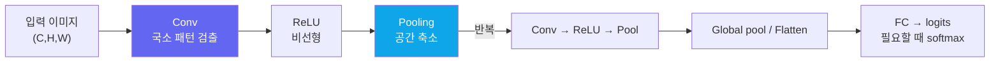

# 비전을 위한 CNN

> [!NOTE] 이 챕터의 목표
> [신경망 첫걸음](#/foundations/neural-networks-basics)의 MLP는 이미지를 다루기엔 부족합니다. 왜 **CNN(합성곱 신경망)** 이 이미지에 딱 맞는지 — 그리고 conv·pooling을 쌓으면 어떻게 "픽셀 → 물체" 인식으로 이어지는지를 그림으로 잡습니다. 합성곱 자체의 계산은 [CNN·RNN·Transformer](#/foundations/architectures)와 [Conv & Pooling 밑바닥 구현](#/ml-coding/conv-pooling)에서 이어집니다.

## 왜 MLP로는 부족한가

28×28 흑백 이미지를 MLP에 넣으려면 784개 픽셀을 한 줄로 펴야 합니다. 문제 두 가지:

1. **공간 inductive bias가 없음.** Flatten은 좌표 순서를 보존하므로 정보가 즉시 사라지는 것은 아닙니다. 하지만 fully connected layer는 이웃 픽셀과 먼 픽셀을 똑같이 취급해 locality·이동에 대한 규칙을 데이터에서 다시 배워야 합니다.
2. **파라미터 폭발.** 첫 은닉층 뉴런 1개가 784개 가중치를 가집니다. 224×224 컬러(150,528개)를 hidden 4096개에 연결하면 첫 층만 약 6.2억 개입니다. 불가능하다고 단정하기보다, 데이터·메모리·계산 면에서 매우 비효율적입니다.

CNN은 이미지의 성질을 활용해 이 둘을 동시에 해결합니다.

<figure>
<svg viewBox="0 0 640 210" xmlns="http://www.w3.org/2000/svg" font-family="Inter, sans-serif" font-size="12">
  <!-- input -->
  <rect x="20" y="70" width="70" height="70" rx="4" fill="none" stroke="#0ea5e9" stroke-width="2"/>
  <text x="55" y="60" text-anchor="middle" fill="#0ea5e9">입력</text>
  <text x="55" y="160" text-anchor="middle" fill="#98a3b2">224² · 3ch</text>
  <!-- block 1 -->
  <g fill="none" stroke="#6366f1" stroke-width="1.6">
    <rect x="140" y="78" width="54" height="54" rx="3"/><rect x="146" y="72" width="54" height="54" rx="3"/><rect x="152" y="66" width="54" height="54" rx="3"/>
  </g>
  <text x="178" y="160" text-anchor="middle" fill="#98a3b2">112² · 64ch</text>
  <!-- block 2 -->
  <g fill="none" stroke="#6366f1" stroke-width="1.6">
    <rect x="260" y="84" width="38" height="38" rx="3"/><rect x="266" y="78" width="38" height="38" rx="3"/><rect x="272" y="72" width="38" height="38" rx="3"/><rect x="278" y="66" width="38" height="38" rx="3"/>
  </g>
  <text x="292" y="160" text-anchor="middle" fill="#98a3b2">56² · 128ch</text>
  <!-- block 3 -->
  <g fill="none" stroke="#6366f1" stroke-width="1.6">
    <rect x="370" y="90" width="24" height="24" rx="2"/><rect x="375" y="85" width="24" height="24" rx="2"/><rect x="380" y="80" width="24" height="24" rx="2"/><rect x="385" y="75" width="24" height="24" rx="2"/><rect x="390" y="70" width="24" height="24" rx="2"/>
  </g>
  <text x="392" y="160" text-anchor="middle" fill="#98a3b2">14² · 512ch</text>
  <!-- classifier head -->
  <line x1="430" y1="100" x2="470" y2="100" stroke="#98a3b2" stroke-width="1.5" marker-end="url(#ar)"/>
  <g fill="#e0533f"><circle cx="490" cy="80" r="5"/><circle cx="490" cy="100" r="5"/><circle cx="490" cy="120" r="5"/></g>
  <text x="490" y="160" text-anchor="middle" fill="#e0533f">FC</text>
  <line x1="505" y1="100" x2="545" y2="100" stroke="#98a3b2" stroke-width="1.5" marker-end="url(#ar)"/>
  <rect x="550" y="82" width="72" height="36" rx="6" fill="#12a150"/><text x="586" y="105" text-anchor="middle" fill="#fff" font-size="11">softmax</text>
  <text x="586" y="160" text-anchor="middle" fill="#98a3b2">"고양이"</text>
  <text x="320" y="24" text-anchor="middle" fill="currentColor">공간(H×W)은 줄고 ↓ &nbsp;&nbsp; 채널(의미의 개수)은 늘고 ↑</text>
  <defs><marker id="ar" markerWidth="8" markerHeight="8" refX="6" refY="3" orient="auto"><path d="M0 0 L6 3 L0 6" fill="#98a3b2"/></marker></defs>
</svg>
<figcaption>CNN의 전형적 흐름: conv+pooling을 거치며 <b>공간 해상도는 작아지고 채널 수는 늘어납니다.</b> 앞쪽은 "어디에 무엇이 있나"(위치), 뒤쪽은 "무엇인가"(의미)를 담고, 마지막에 FC+softmax가 클래스를 고릅니다.</figcaption>
</figure>

## CNN이 이미지에 맞는 세 가지 이유

<dl class="kv">
<dt>지역성(locality)</dt><dd>물체의 특징(모서리, 눈)은 <b>가까운 픽셀</b>들 사이의 패턴입니다. conv는 작은 창(kernel)만 보므로 이 국소 패턴을 자연스럽게 잡습니다.</dd>
<dt>가중치 공유(weight sharing)</dt><dd>같은 kernel을 이미지 <b>전체에 슬라이딩</b>합니다. "모서리 검출기"를 한 번 배우면 모든 위치에 재사용해 파라미터 수가 입력 해상도와 독립적입니다.</dd>
<dt>이동 등변성(translation equivariance)</dt><dd>이상적인 stride-1 convolution에서는 입력이 이동하면 feature map도 함께 이동합니다. Pooling·stride·padding·경계 효과 때문에 exact equivariance는 깨질 수 있고, global pooling과 augmentation을 거치며 분류 출력이 이동에 <b>강인하거나 불변</b>해지도록 학습합니다.</dd>
</dl>

> [!TIP] 면접 한 줄
> "MLP는 이미지를 평평하게 펴서 공간 구조와 파라미터 효율을 둘 다 잃는다. CNN은 **지역성 + 가중치 공유**라는 inductive bias(귀납 편향)로 둘을 되찾는다." kernel이 실제로 어떻게 슬라이딩하는지는 [architectures 챕터의 애니메이션](#/foundations/architectures)으로 보여줄 수 있으면 좋습니다.

## 기본 블록: conv → 활성화 → pooling

CNN은 이 세 가지를 한 묶음으로 여러 번 쌓습니다.



<dl class="kv">
<dt>Conv(합성곱)</dt><dd>학습되는 kernel을 슬라이딩해 <b>feature map(특징 맵)</b>을 만듭니다. kernel 하나 = 특징 하나. 출력 채널 수 = 배우는 특징의 개수.</dd>
<dt>활성화(ReLU)</dt><dd>비선형성을 넣어 복잡한 패턴을 표현. 없으면 [층을 쌓아도 선형 1개](#/foundations/neural-networks-basics)와 같습니다.</dd>
<dt>Pooling(풀링)</dt><dd>작은 창에서 최댓값(max) 또는 평균(avg)을 모아 <b>공간을 줄이고</b> 일부 작은 위치 변화에 덜 민감하게 만들 수 있습니다. 예: kernel=stride=2인 2×2 pooling은 짝수 크기를 절반으로 줄입니다.</dd>
</dl>

**왜 뒤로 갈수록 채널이 늘까?** 앞쪽 층은 단순한 특징(모서리·색), 뒤쪽 층은 그것들을 조합한 복잡한 특징(눈·바퀴·얼굴)을 배웁니다. 조합의 가짓수가 많으니 채널(특징 종류)을 늘려 담습니다 — 대신 공간은 pooling으로 줄여 계산량을 유지합니다.

## 출력 크기 계산 — 직접 해보기

conv/pool을 지날 때마다 공간 크기가 어떻게 변하는지 아는 것은 CNN 설계의 기본입니다. 공식:

$$
H_\text{out} = \left\lfloor \frac{H + 2p - d(k-1)-1}{s} \right\rfloor + 1
$$

($k$ = kernel 크기, $s$ = stride, $p$ = 양쪽 padding, $d$ = dilation)

<div class="widget" data-widget="code">
<script type="application/json" class="code-config">
{"func":"conv_out_size","packages":[],"starter":"def conv_out_size(H, k, stride, padding, dilation=1):\n    # floor((H + 2*padding - dilation*(k-1) - 1) / stride) + 1\n    pass","tests":[{"args":[32,3,1,1],"expect":32},{"args":[32,3,2,1],"expect":16},{"args":[28,5,1,0],"expect":24},{"args":[7,3,2,0],"expect":3},{"args":[7,3,1,0,2],"expect":3}],"solution":"def conv_out_size(H, k, stride, padding, dilation=1):\n    values = (H, k, stride, padding, dilation)\n    if any(not isinstance(v, int) for v in values):\n        raise TypeError(\"all arguments must be integers\")\n    if H <= 0 or k <= 0 or stride <= 0 or padding < 0 or dilation <= 0:\n        raise ValueError(\"invalid convolution parameters\")\n    effective_k = dilation * (k - 1) + 1\n    if H + 2 * padding < effective_k:\n        raise ValueError(\"effective kernel is larger than the padded input\")\n    return (H + 2 * padding - effective_k) // stride + 1"}
</script>
</div>

`stride=1`이고 $d(k-1)$이 짝수일 때 `padding=d*(k-1)/2`면 크기가 유지됩니다. 일반적인 `"same"`의 stride가 1보다 크면 출력은 보통 $\lceil H/s\rceil$이 되도록 좌우 padding이 비대칭일 수 있습니다.

## 최소한의 CNN (PyTorch)

실무에서는 프레임워크가 conv를 처리합니다. 작은 분류기 하나:

```python
import torch.nn as nn

class TinyCNN(nn.Module):
    def __init__(self, num_classes=10):
        super().__init__()
        self.features = nn.Sequential(
            nn.Conv2d(3, 32, 3, padding=1), nn.ReLU(), nn.MaxPool2d(2),   # 32×32 → 16×16
            nn.Conv2d(32, 64, 3, padding=1), nn.ReLU(), nn.MaxPool2d(2),  # 16×16 → 8×8
        )
        self.pool = nn.AdaptiveAvgPool2d(1)
        self.head = nn.Linear(64, num_classes)

    def forward(self, x):
        x = self.features(x)
        x = self.pool(x).flatten(1)
        return self.head(x)                       # raw logits; softmax는 loss 전에 금지
```

conv의 내부(im2col→GEMM)를 직접 짜 보려면 [Conv & Pooling 밑바닥 구현](#/ml-coding/conv-pooling)으로 가세요.

## Q&A

<details class="qa"><summary>Pooling은 왜 쓰나요? 없으면 안 되나요?</summary>
<div class="qa-body">

**짧게:** 공간을 줄여 계산량을 아끼고, 작은 위치 변화에 강인하게 만듭니다.

**깊게:** max-pooling은 창 안에서 "가장 강한 반응"만 남기므로 일부 작은 위치 변화에 출력이 덜 민감할 수 있지만, 1픽셀 이동만으로 pooling cell 경계가 바뀌어 값이 크게 달라질 수도 있습니다. 현대 아키텍처는 pooling 대신 **stride-2 conv**로 다운샘플링하기도 합니다. 둘 다 공간 크기와 계산을 줄이고 receptive field를 키우지만 정보 손실·aliasing 특성은 다릅니다.
</div></details>

<details class="qa"><summary>CNN이 MLP보다 파라미터가 왜 훨씬 적나요?</summary>
<div class="qa-body">

**짧게:** 가중치 공유 때문입니다.

**깊게:** MLP는 입력 픽셀마다 별도 가중치를 두지만, conv는 **작은 kernel 하나를 전체 이미지에 재사용**합니다. 3×3 conv에 입력 3채널·출력 64채널이면 파라미터는 $3\times3\times3\times64 = 1{,}728$개뿐이고, 이미지 크기와 무관합니다. 같은 일을 MLP로 하면 픽셀 수 × 뉴런 수로 폭발합니다.
</div></details>

## Cheat-sheet

| 개념 | 한 줄 |
| --- | --- |
| CNN을 쓰는 이유 | 지역성 + 가중치 공유 + 이동 등변성(분류 출력은 불변성을 학습) |
| 기본 블록 | 전통적 예: conv → activation → downsample; 현대 block은 norm/residual 포함 |
| 공간 vs 채널 | 뒤로 갈수록 공간↓ 채널↑ (단순 특징→복잡 특징) |
| 출력 크기 | $\lfloor (H+2p-k)/s \rfloor + 1$ |
| pooling | 공간 축소 + 위치 강인성 (또는 stride-2 conv) |
| 파라미터 | kernel 하나를 전체에 재사용 → 이미지 크기와 무관 |

**다음:** [백본 & 전이학습](#/cv/backbones-transfer) · [Conv & Pooling 밑바닥 구현](#/ml-coding/conv-pooling) · [CNN·RNN·Transformer](#/foundations/architectures)
