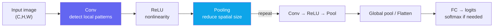

# CNNs for Vision

> [!NOTE] Goal of this chapter
> The MLP from [Neural Networks: The Basics](#/foundations/neural-networks-basics) is poorly suited to images. This chapter builds a visual intuition for **why convolutional neural networks (CNNs)** fit images so well—and how stacking convolution and pooling turns “pixels” into object recognition. For the mechanics of convolution itself, continue to [CNNs, RNNs, and Transformers](#/foundations/architectures) and [Implementing Convolution & Pooling from Scratch](#/ml-coding/conv-pooling).

## Why an MLP is not enough

To feed a 28×28 grayscale image into an MLP, we first flatten its 784 pixels into one line. This creates two problems:

1. **No spatial inductive bias.** Flattening preserves the coordinate order, so the information does not instantly disappear. However, a fully connected layer treats neighboring and distant pixels alike, forcing the model to relearn locality and translation-related rules from data.
2. **An explosion in parameters.** Every neuron in the first hidden layer needs 784 weights. Connecting a 224×224 color image (150,528 values) to 4,096 hidden units requires roughly 620 million weights in the first layer alone. It is not strictly impossible, but it is extremely inefficient in data, memory, and computation.

CNNs exploit the structure of images to address both problems at once.

<figure>
<svg viewBox="0 0 640 210" xmlns="http://www.w3.org/2000/svg" font-family="Inter, sans-serif" font-size="12">
  <!-- input -->
  <rect x="20" y="70" width="70" height="70" rx="4" fill="none" stroke="#0ea5e9" stroke-width="2"/>
  <text x="55" y="60" text-anchor="middle" fill="#0ea5e9">input</text>
  <text x="55" y="160" text-anchor="middle" fill="#98a3b2">224² · 3ch</text>
  <!-- block 1 -->
  <g fill="none" stroke="#6366f1" stroke-width="1.6">
    <rect x="140" y="78" width="54" height="54" rx="3"/><rect x="146" y="72" width="54" height="54" rx="3"/><rect x="152" y="66" width="54" height="54" rx="3"/>
  </g>
  <text x="178" y="160" text-anchor="middle" fill="#98a3b2">112² · 64ch</text>
  <!-- block 2 -->
  <g fill="none" stroke="#6366f1" stroke-width="1.6">
    <rect x="260" y="84" width="38" height="38" rx="3"/><rect x="266" y="78" width="38" height="38" rx="3"/><rect x="272" y="72" width="38" height="38" rx="3"/><rect x="278" y="66" width="38" height="38" rx="3"/>
  </g>
  <text x="292" y="160" text-anchor="middle" fill="#98a3b2">56² · 128ch</text>
  <!-- block 3 -->
  <g fill="none" stroke="#6366f1" stroke-width="1.6">
    <rect x="370" y="90" width="24" height="24" rx="2"/><rect x="375" y="85" width="24" height="24" rx="2"/><rect x="380" y="80" width="24" height="24" rx="2"/><rect x="385" y="75" width="24" height="24" rx="2"/><rect x="390" y="70" width="24" height="24" rx="2"/>
  </g>
  <text x="392" y="160" text-anchor="middle" fill="#98a3b2">14² · 512ch</text>
  <!-- classifier head -->
  <line x1="430" y1="100" x2="470" y2="100" stroke="#98a3b2" stroke-width="1.5" marker-end="url(#ar)"/>
  <g fill="#e0533f"><circle cx="490" cy="80" r="5"/><circle cx="490" cy="100" r="5"/><circle cx="490" cy="120" r="5"/></g>
  <text x="490" y="160" text-anchor="middle" fill="#e0533f">FC</text>
  <line x1="505" y1="100" x2="545" y2="100" stroke="#98a3b2" stroke-width="1.5" marker-end="url(#ar)"/>
  <rect x="550" y="82" width="72" height="36" rx="6" fill="#12a150"/><text x="586" y="105" text-anchor="middle" fill="#fff" font-size="11">softmax</text>
  <text x="586" y="160" text-anchor="middle" fill="#98a3b2">“cat”</text>
  <text x="320" y="24" text-anchor="middle" fill="currentColor">Spatial size (H×W) shrinks ↓ &nbsp;&nbsp; channels (types of meaning) grow ↑</text>
  <defs><marker id="ar" markerWidth="8" markerHeight="8" refX="6" refY="3" orient="auto"><path d="M0 0 L6 3 L0 6" fill="#98a3b2"/></marker></defs>
</svg>
<figcaption>A typical CNN flow: through convolution and pooling, <b>spatial resolution decreases while the number of channels increases.</b> Early layers retain “what is where” (location), later layers encode “what it is” (semantics), and a final FC layer plus softmax selects the class.</figcaption>
</figure>

## Three reasons CNNs fit images

<dl class="kv">
<dt>Locality</dt><dd>Object features such as edges and eyes are patterns among <b>nearby pixels</b>. A convolution looks only through a small window, or kernel, so it naturally captures these local patterns.</dd>
<dt>Weight sharing</dt><dd>The same kernel <b>slides across the entire image</b>. Once the model learns an “edge detector,” it reuses it at every location, making the parameter count independent of input resolution.</dd>
<dt>Translation equivariance</dt><dd>For an ideal stride-1 convolution, shifting the input shifts the feature map along with it. Pooling, stride, padding, and boundary effects can break exact equivariance; global pooling and augmentation help the classifier learn outputs that are <b>robust or invariant</b> to translation.</dd>
</dl>

> [!TIP] Interview one-liner
> “An MLP flattens an image and loses both spatial bias and parameter efficiency. A CNN restores both through the inductive biases of **locality and weight sharing**.” It is even better if you can show how a kernel slides using the [animation in the architectures chapter](#/foundations/architectures).

## Basic block: convolution → activation → pooling

A traditional CNN stacks this three-part block several times.



<dl class="kv">
<dt>Convolution</dt><dd>Slide learned kernels to produce a <b>feature map</b>. One kernel corresponds to one feature; the number of output channels is the number of learned feature types.</dd>
<dt>Activation (ReLU)</dt><dd>Adds nonlinearity so the network can represent complex patterns. Without it, [stacking layers is equivalent to one linear map](#/foundations/neural-networks-basics).</dd>
<dt>Pooling</dt><dd>Aggregate a small window by its maximum or average to <b>reduce spatial size</b> and potentially make the representation less sensitive to some small position changes. For example, 2×2 pooling with kernel=stride=2 halves an even-sized dimension.</dd>
</dl>

**Why do channel counts grow deeper in the network?** Early layers learn simple features such as edges and colors; later layers combine them into complex features such as eyes, wheels, and faces. There are more kinds of combinations to represent, so we allocate more channels—while pooling reduces the spatial dimensions to keep computation manageable.

## Computing output size — try it yourself

Knowing how spatial dimensions change after a convolution or pooling layer is a basic CNN design skill. The formula is:

$$
H_\text{out} = \left\lfloor \frac{H + 2p - d(k-1)-1}{s} \right\rfloor + 1
$$

where $k$ is kernel size, $s$ is stride, $p$ is padding on each side, and $d$ is dilation.

<div class="widget" data-widget="code">
<script type="application/json" class="code-config">
{"func":"conv_out_size","packages":[],"starter":"def conv_out_size(H, k, stride, padding, dilation=1):\n    # floor((H + 2*padding - dilation*(k-1) - 1) / stride) + 1\n    pass","tests":[{"args":[32,3,1,1],"expect":32},{"args":[32,3,2,1],"expect":16},{"args":[28,5,1,0],"expect":24},{"args":[7,3,2,0],"expect":3},{"args":[7,3,1,0,2],"expect":3}],"solution":"def conv_out_size(H, k, stride, padding, dilation=1):\n    values = (H, k, stride, padding, dilation)\n    if any(not isinstance(v, int) for v in values):\n        raise TypeError(\"all arguments must be integers\")\n    if H <= 0 or k <= 0 or stride <= 0 or padding < 0 or dilation <= 0:\n        raise ValueError(\"invalid convolution parameters\")\n    effective_k = dilation * (k - 1) + 1\n    if H + 2 * padding < effective_k:\n        raise ValueError(\"effective kernel is larger than the padded input\")\n    return (H + 2 * padding - effective_k) // stride + 1"}
</script>
</div>

With `stride=1`, when $d(k-1)$ is even, `padding=d*(k-1)/2` preserves the size. For a common `"same"` convention with stride greater than 1, the left and right padding may be asymmetric so that the output is typically $\lceil H/s\rceil$.

## A minimal CNN in PyTorch

In practice, a framework handles the convolution. Here is a small classifier:

```python
import torch.nn as nn

class TinyCNN(nn.Module):
    def __init__(self, num_classes=10):
        super().__init__()
        self.features = nn.Sequential(
            nn.Conv2d(3, 32, 3, padding=1), nn.ReLU(), nn.MaxPool2d(2),   # 32×32 → 16×16
            nn.Conv2d(32, 64, 3, padding=1), nn.ReLU(), nn.MaxPool2d(2),  # 16×16 → 8×8
        )
        self.pool = nn.AdaptiveAvgPool2d(1)
        self.head = nn.Linear(64, num_classes)

    def forward(self, x):
        x = self.features(x)
        x = self.pool(x).flatten(1)
        return self.head(x)                       # raw logits; do not apply softmax before the loss
```

To implement convolution internally via im2col→GEMM, continue to [Implementing Convolution & Pooling from Scratch](#/ml-coding/conv-pooling).

## Q&A

<details class="qa"><summary>Why use pooling? Can a CNN work without it?</summary>
<div class="qa-body">

**Short answer:** It reduces spatial size to save computation and can make features more robust to small position changes.

**In depth:** Max pooling retains only the strongest response in a window, so its output may be less sensitive to some small shifts. However, even a one-pixel shift can move values across pooling-cell boundaries and cause a large change. Modern architectures sometimes downsample with a **stride-2 convolution** instead. Both reduce spatial dimensions and computation while enlarging the receptive field, but their information-loss and aliasing properties differ.
</div></details>

<details class="qa"><summary>Why does a CNN have so many fewer parameters than an MLP?</summary>
<div class="qa-body">

**Short answer:** Weight sharing.

**In depth:** An MLP assigns a separate weight to every input pixel, while a convolution **reuses one small kernel across the whole image**. A 3×3 convolution with 3 input channels and 64 output channels has only $3\times3\times3\times64 = 1{,}728$ weights, independent of image size. An MLP that tries to do the same job scales with pixels × neurons and quickly explodes in size.
</div></details>

## Cheat sheet

| Concept | In one line |
| --- | --- |
| Why CNNs? | Locality + weight sharing + translation equivariance (the classifier learns invariance) |
| Basic block | Traditional example: conv → activation → downsample; modern blocks also include normalization and residual paths |
| Space vs channels | Deeper means spatial size↓ and channels↑ (simple features→complex features) |
| Output size | $\lfloor (H+2p-k)/s \rfloor + 1$ |
| Pooling | Spatial reduction + position robustness (or use a stride-2 convolution) |
| Parameters | Reuse each kernel across the image → independent of image size |

**Next:** [Backbones & Transfer Learning](#/cv/backbones-transfer) · [Implementing Convolution & Pooling from Scratch](#/ml-coding/conv-pooling) · [CNNs, RNNs, and Transformers](#/foundations/architectures)
