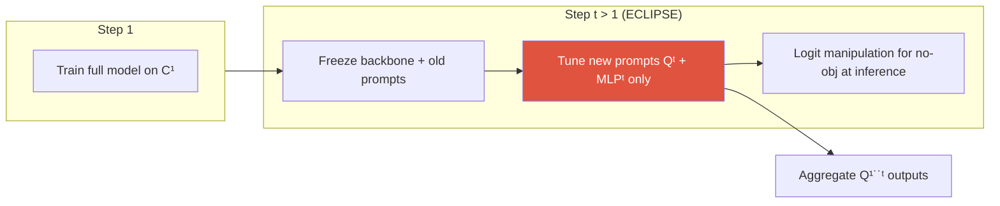

# Continual Learning

catastrophic forgettingstability–plasticityregularization / replay / isolationclass-incremental segprompt tuningECLIPSE

> [!TIP] 이 챕터가 중요한 이유
> 지원자는 여기서 두 편의 1저자/공동저자 논문을 갖고 있습니다: **SSUL** (NeurIPS 2021, exemplar class-incremental semantic seg) → **ECLIPSE** (CVPR 2024, visual prompt tuning을 통한 continual *panoptic* seg). 면접에서의 강점은 일반적인 **stability–plasticity** 프레이밍과 segmentation 특유의 **background / no-object shift**를 결합하고, *distillation-free, prompt-based* 방법이 replay/KD를 언제 이기는지 논증하는 것입니다.

## The problem

step $t = 1..T$에서 데이터 $\mathcal{D}^t$는 현재 클래스 $\mathcal{C}^t$에 대해서만 레이블링됩니다. 과거 클래스는 사라졌고; 미래 클래스는 이미지에 등장할 수 있지만 *background*로 레이블링됩니다. 목표: 예전 데이터를 저장하지 않고 (또는 아주 작은 exemplar set으로) $\mathcal{C}^{1:t}$ 전부를 segment하는 것.

## 1 · Catastrophic forgetting & stability–plasticity

**Catastrophic forgetting:** 새 task를 학습하면 과거 task를 인코딩하던 공유 weight를 덮어써서 과거 task의 정확도가 무너집니다. 이는 **stability–plasticity dilemma**의 첨예한 끝입니다:

<figure>
<svg viewBox="0 0 620 130" xmlns="http://www.w3.org/2000/svg" font-family="Inter, sans-serif" font-size="12">
  <line x1="60" y1="70" x2="560" y2="70" stroke="#98a3b2" stroke-width="2"/>
  <circle cx="60" cy="70" r="6" fill="#0ea5e9"/><text x="60" y="100" text-anchor="middle" fill="#0ea5e9">max stability</text>
  <text x="60" y="45" text-anchor="middle" fill="#6b7686">frozen: no forgetting,</text>
  <text x="60" y="30" text-anchor="middle" fill="#6b7686">no learning</text>
  <circle cx="560" cy="70" r="6" fill="#e0533f"/><text x="560" y="100" text-anchor="middle" fill="#e0533f">max plasticity</text>
  <text x="560" y="45" text-anchor="middle" fill="#6b7686">fine-tune: learns new,</text>
  <text x="560" y="30" text-anchor="middle" fill="#6b7686">forgets old</text>
  <circle cx="360" cy="70" r="7" fill="#12a150"/><text x="360" y="100" text-anchor="middle" fill="#12a150">good CL method</text>
</svg>
<figcaption>너무 stable하면 → 새 클래스를 못 배우고; 너무 plastic하면 → 잊습니다. 방법이 어디에 위치하는지 보려면 base / new / all metric을 따로 보고하세요.</figcaption>
</figure>

Segmentation은 classification보다 더 심하게 잊습니다: per-pixel인 데다, "background"의 정의 자체가 step마다 바뀌기 때문입니다.

## 2 · The three method families

| Family | Idea | Representatives | Cost / weakness |
| --- | --- | --- | --- |
| **Regularization** | protect important weights / outputs | EWC, LwF, MiB, PLOP | constraints conflict; degrades over long sequences |
| **Replay** | rehearse old samples/features | iCaRL, RECALL, exemplar sets | storage + **privacy**; hard to design for panoptic |
| **Parameter isolation** | add small task-specific params, freeze the rest | PNN, VPT, **ECLIPSE** | more modules; multi-forward inference |

<dl class="kv">
<dt>EWC</dt><dd>중요한 weight를 과거 값 근처에 유지하는 Fisher-information 가중 quadratic penalty: $\mathcal{L}=\mathcal{L}_t+\tfrac{\lambda}{2}\sum_i F_i(\theta_i-\theta_i^{*})^2$.</dd>
<dt>LwF / KD</dt><dd>새 데이터에 대한 예전 모델의 출력을 distill합니다 (예전 데이터 불필요). Seg 변형: <b>MiB</b> (background를 모델링), <b>PLOP</b> (multi-scale feature distillation), <b>CoMFormer</b> (panoptic용 query distillation).</dd>
<dt>Replay</dt><dd>소수의 exemplar를 저장 (iCaRL herding)하거나 generative/feature replay를 씁니다. 종종 가장 강력하지만, 이미지 저장이 금지될 수 있습니다.</dd>
</dl>

## 3 · Class-incremental vs task-incremental (and the seg twist)

- **Task-incremental:** test 시점에 task ID가 주어집니다 (더 쉬움).
- **Class-incremental:** task ID 없이 지금까지 본 *모든* 클래스에 대해 예측합니다 (더 어려움) — 표준 seg 세팅.
- **Disjoint vs overlap (MiB):** 현실적인 **overlap** 세팅에서는 미래-클래스 픽셀이 *이미지에 존재*하지만 지금은 background로 레이블링됩니다. 이것이 background shift의 씨앗입니다.

## 4 · Background / no-object shift (segmentation-specific)

> [!QUESTION] "What makes continual *segmentation* special vs. continual classification?"
> **Short:** "background" (또는 Mask2Former의 "no-object") 레이블이 매 step마다 조용히 의미가 바뀝니다. **Deep:** step $t$에서 과거와 미래 클래스의 픽셀이 background로 레이블링되므로, background classifier는 나중에 *받아들여야* 할 것을 지금 *거부하도록* 학습됩니다 — 학습 신호를 오염시킵니다. MiB는 이를 명시적으로 모델링하고; SSUL은 **Unknown** 레이블 + exemplar를 도입하며; ECLIPSE는 no-object MLP를 아예 제거하고 inference에서 재구성합니다.

ECLIPSE의 **logit manipulation**: drift하는 학습된 no-object head 대신, inference에서 다른 step들의 logit으로부터 no-object score를 계산합니다:

$$s^{\text{no-obj}}_t = \delta\Big(\sum_{k<t} s^{\mathcal{C}^k}_t + \sum_{k>t} s^{\mathcal{C}^k}_t\Big)$$

$\delta$는 *재학습 없이* 튜닝되는 post-hoc scalar (기본 ~0.5)입니다 — no-object는 본질적으로 모든 step의 class score의 함수이기 때문입니다.

## 5 · ECLIPSE — visual prompt tuning for panoptic CL

> [!EXAMPLE] The mechanism
> Step 1: $\mathcal{C}^1$에 대해 전체 **Mask2Former**를 학습한 뒤 **전부 freeze**합니다. Step $t>1$: 작은 **prompt set** $\mathbf{Q}^t$ (query) + step별 **MLP$^t$**만 학습하며, $N^t \approx |\mathcal{C}^t|$ (최소 10)입니다. inference에서는 $\mathbf{Q}^{1:t}$의 출력을 집계합니다. 학습 가능 파라미터 ≈ 모델의 **1.3%** (논문: ~0.6M vs ~44.9M). Distillation-free, replay-free.

중요한 설계 선택: **deep** prompt (여러 decoder 레이어에 주입)가 new-class 품질에서 shallow를 이깁니다; softmax 대신 **sigmoid** (클래스별 독립 logit)를 써서 클래스들이 step 간에 파괴적으로 경쟁하지 않게 합니다; frozen Mask2Former query가 거의 완벽한 **stability**를 주고 새 prompt가 **plasticity**를 공급합니다. 전체 ablation, FLOPs, CoMFormer 비교는 **[ECLIPSE deep-dive](#/resume/eclipse)**에.

Why prompt-tuning wins here

튜닝할 distillation weight / pseudo-label threshold이 없고; 학습 가능한 footprint와 메모리가 아주 작으며; forgetting에 극도로 강하고; 자연스럽게 distillation-free이자 replay-free입니다 (privacy 친화적).

Costs

step-1 feature가 약하면 frozen backbone이 plasticity를 제한합니다 (강한 pretraining, 예: Swin-L / COCO로 완화); inference가 여러 번의 prompt forward를 수행하고; step-1 오분류가 고정됩니다.

## 6 · Prompt-based continual learning (the general trend)

강한 pretrained backbone을 freeze하고 prompt만 학습하는 것은 이제 지배적인 CL recipe입니다:

- **Classification:** **L2P** (prompt *pool*을 학습하고 입력마다 선택), **DualPrompt** (general + expert prompt), CODA-Prompt.
- **Segmentation:** **ECLIPSE** (Mask2Former 위의 step별 visual prompt).
- **Why it works:** prompt는 task마다 저장이 저렴하고 공유 weight를 건드리지 않으므로 forgetting이 구조적으로 제한됩니다. **Ceiling risk:** frozen backbone의 품질을 물려받습니다 — 그래서 2026년의 수는 *foundation-scale* backbone (DINOv3, SAM)을 freeze하고 prompt/LoRA로 adapt하는 것입니다. [Vision Foundation Models](#/cv/foundation-models) 참고.

## 7 · Why panoptic continual is the hard mode

Things (instance matching) + stuff + no-object drift가 한꺼번에 오고, PQ는 recognition 오류 (RQ)에 가차없습니다. **CoMFormer**가 query distillation으로 panoptic CL을 개척했고; ECLIPSE는 최초의 *distillation-free* panoptic-CL 결과를 주장하며 **long sequence** (많은 짧은 step)에서 격차를 벌립니다 — regularization/KD 방법이 무너지는 영역입니다.

## 7b · Benchmarks & protocols you should name

| Benchmark | Task | Typical protocols (base-step) |
| --- | --- | --- |
| Pascal VOC | semantic CL | 15-5, 15-1, 10-1 (disjoint / overlap) |
| ADE20K | semantic & panoptic CL | 100-50, 100-10, 100-5, 50-50 |
| Cityscapes (domain-incremental) | semantic | city/condition shifts |

표기 "X-Y" = X개 base 클래스, 이후 Y개씩 증분. 작은 Y와 많은 step (예: 100-5, 11 task)은 forgetting이 누적되고 ECLIPSE의 KD/regularization 대비 격차가 벌어지는 *long-sequence* 스트레스 테스트입니다.

> [!EXAMPLE] Reading a stability–plasticity result
> ADE20K 100-5에서 ECLIPSE 스타일 수치에 대한 유용한 사고 모델: 순진한 fine-tuning은 base-class PQ를 **0**으로 몰아가지만 (순수 plasticity, 완전한 forgetting), ECLIPSE는 base PQ를 step-1 값 근처로 유지하면서 (stability) 여전히 새 클래스를 합리적인 PQ로 배우고 (plasticity), "all" PQ를 joint-training oracle과 적당한 격차 이내로 안착시킵니다. 항상 FT 하한과 joint-training 상한 둘 다에 비교하세요.

## 8 · Q&A

When would you NOT use prompt-tuning and prefer replay or KD?

**Short:** 데이터를 저장할 수 있고, 최대 plasticity가 필요하며, backbone이 약할 때.

**Deep:** replay는 종종 가장 강력한 raw 성능을 내고 네트워크 전체를 adapt하게 합니다 (높은 plasticity); privacy/storage가 문제가 안 되고 소수의 큰 step이 예상된다면, 작은 exemplar buffer + KD가 new-class 정확도에서 prompt-tuning을 이길 수 있습니다. Prompt-tuning은 privacy 제약, long sequence, 빠듯한 compute, 강한 frozen backbone에서 빛납니다.

Freezing prevents forgetting — what does it cost?

**Short:** step-1 오류를 고정하고 plasticity를 제한합니다.

**Deep:** step 1이 "car"만 알았다면, frozen path에서 "bus"는 "car"로 고정됩니다. ECLIPSE는 logit manipulation으로 이를 완화하지만 (이후 step의 logit이 상호 경쟁을 통해 잘못된 클래스를 억제), 일반적인 교훈은 stability와 plasticity가 trade-off라는 것입니다 — frozen 모델은 plasticity를 내주고 stability를 삽니다.

How do the three families degrade differently over long sequences?

**Short:** regularization이 먼저 무너지고 (constraint 충돌), replay는 buffer에 묶이며, isolation이 가장 견고하지만 커집니다.

**Deep:** step이 많아지면 EWC/LwF penalty가 누적되어 서로 다투기 시작하므로 stability와 plasticity가 모두 감소합니다; replay 품질은 고정된 buffer에 의해 제한되므로 클래스별 rehearsal이 얇아집니다; parameter isolation은 예전 param이 절대 움직이지 않으므로 forgetting을 거의 0으로 유지하되, 커지는 파라미터/inference 예산을 대가로 치릅니다 (ECLIPSE가 지적한 미해결 문제: 클래스가 폭증할 때의 prompt-count 최적화).

Why put no-object handling at inference (δ) instead of in the training loss?

**Short:** no-object는 *모든* step의 클래스로 정의되는데, 이는 어느 단일 step의 학습 중에도 이용할 수 없습니다.

**Deep:** step $t$ 동안에는 다른 step의 클래스를 올바르게 반영하는 no-object head를 학습할 수 없습니다 — 그 정보는 aggregation 시점에만 존재합니다. 그래서 ECLIPSE는 이를 집계된 logit의 post-hoc 함수로 계산하며, 재학습 없이 튜닝 가능합니다 (ablation: δ ≈ 0.5가 0.3–0.7 중 최적).

### Follow-ups
- *"Metrics?"* stability와 plasticity를 분리하려면 **base / new / all** (PQ 또는 mIoU)을 보고하세요; long sequence에는 *forgetting* 측정치 (최고점 대비 하락)를 추가하세요.
- *"Overlap vs disjoint?"* Overlap (미래 클래스가 보이지만 bg)은 현실적이고 더 어렵습니다; 여기서 background shift가 물어뜯습니다.
- *"Product angle?"* On-device 기능은 no-replay (privacy) 제약 하에서 시간이 지나며 클래스 커버리지를 확장합니다 → isolation/prompt 방법이 자연스러운 선택입니다.

## Cheat-sheet

| Term | One-liner |
| --- | --- |
| Catastrophic forgetting | new-task learning erases old-task performance |
| Stability–plasticity | retain old vs learn new; the core trade-off |
| EWC / LwF | Fisher penalty / output distillation (regularization) |
| Replay | rehearse stored exemplars or features |
| Isolation / VPT | add & train small prompts, freeze the rest |
| Background shift | "background/no-obj" meaning changes per step |
| Logit manipulation | reconstruct no-obj from other steps' logits (ECLIPSE) |
| base/new/all | report separately to expose the trade-off |

**Related:** [Segmentation](#/cv/segmentation) · [Weak & Semi-Supervised](#/cv/weak-semi-supervised) · [Vision Foundation Models](#/cv/foundation-models) · [ECLIPSE deep-dive](#/resume/eclipse) · [The 2026 Landscape](#/start/landscape-2026)
