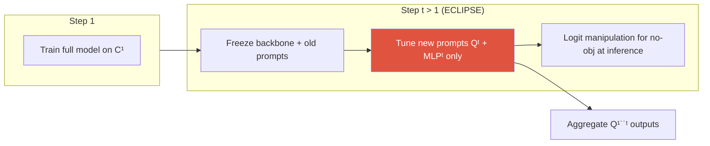

# Continual Learning

catastrophic forgettingstability–plasticityregularization / replay / isolationclass-incremental segprompt tuningECLIPSE

> [!TIP] Why this chapter matters
> The candidate owns two first-/co-author papers here: **SSUL** (NeurIPS 2021, exemplar class-incremental semantic seg) → **ECLIPSE** (CVPR 2024, continual *panoptic* seg via visual prompt tuning). The interview edge is combining the general **stability–plasticity** framing with the segmentation-specific **background / no-object shift**, and arguing when a *distillation-free, prompt-based* method beats replay/KD.

## The problem

At steps $t = 1..T$, data $\mathcal{D}^t$ is labeled only for the current classes $\mathcal{C}^t$. Past classes are gone; future classes may appear in the image but are labeled *background*. Goal: segment all of $\mathcal{C}^{1:t}$ without storing old data (or with a tiny exemplar set).

## 1 · Catastrophic forgetting & stability–plasticity

**Catastrophic forgetting:** learning a new task overwrites the shared weights that encoded old tasks, collapsing old-task accuracy. It is the sharp end of the **stability–plasticity dilemma**:

<figure>
<svg viewBox="0 0 620 130" xmlns="http://www.w3.org/2000/svg" font-family="Inter, sans-serif" font-size="12">
  <line x1="60" y1="70" x2="560" y2="70" stroke="#98a3b2" stroke-width="2"/>
  <circle cx="60" cy="70" r="6" fill="#0ea5e9"/><text x="60" y="100" text-anchor="middle" fill="#0ea5e9">max stability</text>
  <text x="60" y="45" text-anchor="middle" fill="#6b7686">frozen: no forgetting,</text>
  <text x="60" y="30" text-anchor="middle" fill="#6b7686">no learning</text>
  <circle cx="560" cy="70" r="6" fill="#e0533f"/><text x="560" y="100" text-anchor="middle" fill="#e0533f">max plasticity</text>
  <text x="560" y="45" text-anchor="middle" fill="#6b7686">fine-tune: learns new,</text>
  <text x="560" y="30" text-anchor="middle" fill="#6b7686">forgets old</text>
  <circle cx="360" cy="70" r="7" fill="#12a150"/><text x="360" y="100" text-anchor="middle" fill="#12a150">good CL method</text>
</svg>
<figcaption>Too stable → can't learn new classes; too plastic → forgets. Report base / new / all metrics separately to see where a method sits.</figcaption>
</figure>

Segmentation forgets harder than classification: it's per-pixel, and the very definition of "background" shifts across steps.

## 2 · The three method families

| Family | Idea | Representatives | Cost / weakness |
| --- | --- | --- | --- |
| **Regularization** | protect important weights / outputs | EWC, LwF, MiB, PLOP | constraints conflict; degrades over long sequences |
| **Replay** | rehearse old samples/features | iCaRL, RECALL, exemplar sets | storage + **privacy**; hard to design for panoptic |
| **Parameter isolation** | add small task-specific params, freeze the rest | PNN, VPT, **ECLIPSE** | more modules; multi-forward inference |

<dl class="kv">
<dt>EWC</dt><dd>Fisher-information-weighted quadratic penalty keeping important weights near their old values: $\mathcal{L}=\mathcal{L}_t+\tfrac{\lambda}{2}\sum_i F_i(\theta_i-\theta_i^{*})^2$.</dd>
<dt>LwF / KD</dt><dd>Distill the old model's outputs on new data (no old data needed). Seg variants: <b>MiB</b> (models the background), <b>PLOP</b> (multi-scale feature distillation), <b>CoMFormer</b> (query distillation for panoptic).</dd>
<dt>Replay</dt><dd>Store a few exemplars (iCaRL herding) or generative/feature replay. Often the strongest, but storing images can be disallowed.</dd>
</dl>

## 3 · Class-incremental vs task-incremental (and the seg twist)

- **Task-incremental:** the task ID is given at test time (easier).
- **Class-incremental:** predict over *all* classes seen so far, no task ID (harder) — the standard seg setting.
- **Disjoint vs overlap (MiB):** in the realistic **overlap** setting, future-class pixels are *present in the image* but labeled background now. This is the seed of background shift.

## 4 · Background / no-object shift (segmentation-specific)

> [!QUESTION] "What makes continual *segmentation* special vs. continual classification?"
> **Short:** the "background" (or Mask2Former "no-object") label silently changes meaning every step. **Deep:** at step $t$, pixels of past and future classes are labeled background, so the background classifier is trained to *reject* things it will later need to *accept* — corrupting the learning signal. MiB models this explicitly; SSUL introduces an **Unknown** label + exemplars; ECLIPSE removes the no-object MLP entirely and reconstructs it at inference.

ECLIPSE's **logit manipulation**: instead of a learned no-object head that drifts, compute the no-object score from the other steps' logits at inference:

$$s^{\text{no-obj}}_t = \delta\Big(\sum_{k<t} s^{\mathcal{C}^k}_t + \sum_{k>t} s^{\mathcal{C}^k}_t\Big)$$

with $\delta$ a post-hoc scalar (default ~0.5) tuned *without retraining* — because no-object is inherently a function of all steps' class scores.

## 5 · ECLIPSE — visual prompt tuning for panoptic CL

> [!EXAMPLE] The mechanism
> Step 1: train the full **Mask2Former** on $\mathcal{C}^1$, then **freeze everything**. Step $t>1$: learn only a small **prompt set** $\mathbf{Q}^t$ (queries) + a per-step **MLP$^t$**, with $N^t \approx |\mathcal{C}^t|$ (min 10). At inference, aggregate the outputs of $\mathbf{Q}^{1:t}$. Trainable params ≈ **1.3%** of the model (paper: ~0.6M vs ~44.9M). Distillation-free, replay-free.

Design choices that matter: **deep** prompts (injected at multiple decoder layers) beat shallow for new-class quality; **sigmoid** (independent per-class logits) over softmax so classes don't compete destructively across steps; frozen Mask2Former queries give near-perfect **stability** while new prompts supply **plasticity**. Full ablations, FLOPs, and the CoMFormer comparison in the **[ECLIPSE deep-dive](#/resume/eclipse)**.

Why prompt-tuning wins here

No distillation weight / pseudo-label threshold to tune; tiny trainable footprint and memory; extremely strong against forgetting; naturally distillation- and replay-free (privacy-friendly).

Costs

Frozen backbone caps plasticity if step-1 features are weak (mitigate with strong pretraining, e.g. Swin-L / COCO); inference does multiple prompt forwards; step-1 misclassifications are locked in.

## 6 · Prompt-based continual learning (the general trend)

Freezing a strong pretrained backbone and learning only prompts is now a dominant CL recipe:

- **Classification:** **L2P** (learn a prompt *pool*, select per input), **DualPrompt** (general + expert prompts), CODA-Prompt.
- **Segmentation:** **ECLIPSE** (per-step visual prompts on Mask2Former).
- **Why it works:** prompts are cheap to store per task and don't touch shared weights, so forgetting is structurally limited. **Ceiling risk:** you inherit the frozen backbone's quality — so the 2026 move is to freeze *foundation-scale* backbones (DINOv3, SAM) and adapt via prompts/LoRA. See [Vision Foundation Models](#/cv/foundation-models).

## 7 · Why panoptic continual is the hard mode

Things (instance matching) + stuff + no-object drift, all at once, and PQ is unforgiving of recognition errors (RQ). **CoMFormer** pioneered panoptic CL via query distillation; ECLIPSE claims the first *distillation-free* panoptic-CL result and widens its lead on **long sequences** (many short steps) — the regime where regularization/KD methods erode.

## 7b · Benchmarks & protocols you should name

| Benchmark | Task | Typical protocols (base-step) |
| --- | --- | --- |
| Pascal VOC | semantic CL | 15-5, 15-1, 10-1 (disjoint / overlap) |
| ADE20K | semantic & panoptic CL | 100-50, 100-10, 100-5, 50-50 |
| Cityscapes (domain-incremental) | semantic | city/condition shifts |

Notation "X-Y" = X base classes, then increments of Y. Small Y and many steps (e.g. 100-5, 11 tasks) is the *long-sequence* stress test where forgetting compounds and ECLIPSE's gap over KD/regularization widens.

> [!EXAMPLE] Reading a stability–plasticity result
> A useful mental model of ECLIPSE-style numbers on ADE20K 100-5: naive fine-tuning drives base-class PQ toward **0** (pure plasticity, total forgetting), while ECLIPSE keeps base PQ near its step-1 value (stability) and still learns new classes at a reasonable PQ (plasticity), landing "all" PQ within a modest gap of the joint-training oracle. Always compare against both the FT floor and the joint-training ceiling.

## 8 · Q&A

When would you NOT use prompt-tuning and prefer replay or KD?

**Short:** when you can store data, need maximum plasticity, and the backbone is weak.

**Deep:** replay is often the strongest raw performer and lets the whole network adapt (high plasticity); if privacy/storage are non-issues and few, large steps are expected, a small exemplar buffer + KD can beat prompt-tuning on new-class accuracy. Prompt-tuning shines under privacy constraints, long sequences, tight compute, and a strong frozen backbone.

Freezing prevents forgetting — what does it cost?

**Short:** it locks in step-1 errors and caps plasticity.

**Deep:** if step 1 only knew "car," a "bus" gets locked as "car" in the frozen path. ECLIPSE mitigates this via logit manipulation (later steps' logits suppress the mistaken class through mutual competition), but the general lesson is that stability and plasticity trade off — a frozen model buys stability with plasticity.

How do the three families degrade differently over long sequences?

**Short:** regularization erodes first (conflicting constraints), replay is buffer-bound, isolation is the most robust but grows.

**Deep:** with many steps, EWC/LwF penalties accumulate and start fighting each other, so both stability and plasticity decay; replay quality is capped by a fixed buffer, so per-class rehearsal thins out; parameter isolation keeps forgetting near-zero because old params never move, at the price of a growing parameter/inference budget (the open problem ECLIPSE flags: prompt-count optimization when classes explode).

Why put no-object handling at inference (δ) instead of in the training loss?

**Short:** no-object is defined by *all* steps' classes, which aren't available during any single step's training.

**Deep:** during step $t$ you can't train a no-object head that correctly accounts for classes from other steps — that information only exists at aggregation time. So ECLIPSE computes it as a post-hoc function of the aggregated logits, tunable without retraining (ablation: δ ≈ 0.5 best in 0.3–0.7).

### Follow-ups
- *"Metrics?"* Report **base / new / all** (PQ or mIoU) to separate stability from plasticity; add a *forgetting* measure (drop from best) for long sequences.
- *"Overlap vs disjoint?"* Overlap (future classes visible-but-bg) is realistic and harder; it's where background shift bites.
- *"Product angle?"* On-device features expand class coverage over time under no-replay (privacy) constraints → isolation/prompt methods are the natural fit.

## Cheat-sheet

| Term | One-liner |
| --- | --- |
| Catastrophic forgetting | new-task learning erases old-task performance |
| Stability–plasticity | retain old vs learn new; the core trade-off |
| EWC / LwF | Fisher penalty / output distillation (regularization) |
| Replay | rehearse stored exemplars or features |
| Isolation / VPT | add & train small prompts, freeze the rest |
| Background shift | "background/no-obj" meaning changes per step |
| Logit manipulation | reconstruct no-obj from other steps' logits (ECLIPSE) |
| base/new/all | report separately to expose the trade-off |

**Related:** [Segmentation](#/cv/segmentation) · [Weak & Semi-Supervised](#/cv/weak-semi-supervised) · [Vision Foundation Models](#/cv/foundation-models) · [ECLIPSE deep-dive](#/resume/eclipse) · [The 2026 Landscape](#/start/landscape-2026)
