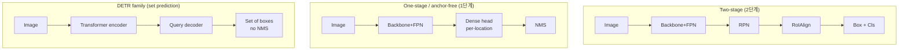

# 객체 검출 (Object Detection)

> [!NOTE] 한 줄 정의
> **객체 검출 = 위치 찾기(localization) + 분류(classification).** 이미지 안에서 "**무엇이(what) 어디에(where)** 있는가"를 동시에 답합니다. 분류([이미지 분류](#/cv/classification))가 사진 한 장에 라벨 하나를 붙였다면, 검출은 각 객체마다 **경계 상자(bounding box)** + 라벨을 여러 개 내놓습니다.

## 무엇을 / 왜

자율주행이 "앞에 사람이 있다"만으로는 부족하고 "사람이 **화면 어디에** 있다"를 알아야 하듯, 많은 응용은 위치가 필요합니다. 검출기의 출력은 객체마다 이런 형태입니다:

- **경계 상자(bounding box)**: 보통 네 숫자 `(x1, y1, x2, y2)` — 좌상단·우하단 좌표(xyxy 형식). `(cx, cy, w, h)`(중심+크기)를 쓰기도 합니다.
- **클래스 라벨**: person, car … + ranking에 쓰는 **score**. 이 값은 objectness와 class score의 조합일 수 있고, 보정된 확률이라고 가정하면 안 됩니다.

<figure>
<svg viewBox="0 0 480 260" xmlns="http://www.w3.org/2000/svg" font-family="Inter, sans-serif" font-size="12">
  <rect x="10" y="20" width="460" height="220" rx="8" fill="none" stroke="#98a3b2" stroke-width="1"/>
  <text x="240" y="15" text-anchor="middle" fill="#98a3b2">입력 이미지</text>
  <!-- object 1 -->
  <rect x="60" y="80" width="90" height="140" fill="none" stroke="#e0533f" stroke-width="2.5"/>
  <rect x="60" y="64" width="70" height="18" fill="#e0533f"/><text x="66" y="77" fill="#fff" font-size="11">person 0.98</text>
  <!-- object 2 -->
  <rect x="200" y="140" width="150" height="80" fill="none" stroke="#6366f1" stroke-width="2.5"/>
  <rect x="200" y="124" width="58" height="18" fill="#6366f1"/><text x="205" y="137" fill="#fff" font-size="11">car 0.93</text>
  <!-- object 3 -->
  <rect x="370" y="70" width="70" height="70" fill="none" stroke="#12a150" stroke-width="2.5"/>
  <rect x="370" y="54" width="66" height="18" fill="#12a150"/><text x="374" y="67" fill="#fff" font-size="11">dog 0.87</text>
</svg>
<figcaption>검출기의 출력 예시: 객체마다 상자 + 클래스 + 점수. 상자는 <b>어디에(위치)</b>, 라벨은 <b>무엇(분류)</b>을 답합니다.</figcaption>
</figure>

위치와 분류를 어떻게 얻느냐가 검출 설계의 핵심입니다. **Anchor-based/anchor-free dense prediction**, **proposal refinement**, **query 기반 set prediction**, **open-vocabulary conditioning**은 서로 완전히 대체한 한 줄 계보라기보다 조합 가능한 축입니다. 예를 들어 open-vocabulary detector도 dense 또는 query decoder일 수 있습니다.

> [!TIP] 면접 한 줄
> Detection은 지원자의 segmentation 작업의 **upstream**입니다: proposal(후보 영역)이 mask를 좌우하고(PointWSSIS의 핵심 논지), open-vocabulary detector(Grounding DINO)는 Grounded-SAM/grounded VLM의 box provider입니다. 면접관은 *개념적 흐름* — dense prior → anchor-free → set prediction → open-vocabulary — 을 듣고 싶어 합니다.

## 검출의 두 가지 하위 문제

<div class="proscons"><div><div class="pros-t">위치(localization)</div>

상자 좌표를 **회귀(regression)** 로 맞힙니다. L1/Smooth-L1과 IoU/GIoU 계열을 단독 또는 함께 사용합니다.

</div><div><div class="cons-t">분류(classification)</div>

그 후보가 무슨 클래스인지 예측합니다. Two-stage/DETR의 softmax + background/no-object도 있고, dense/open-vocabulary detector의 class별 sigmoid + 별도 objectness도 있습니다. Loss contract에 따라 target과 score 해석이 달라집니다.

</div></div>

핵심 난점은 **"객체가 몇 개인지 미리 모른다"** 는 것입니다. 그래서 검출기는 (a) 수많은 후보를 촘촘히 깔고 걸러내거나, (b) 고정된 개수의 "슬롯(query)"에 객체를 하나씩 배정합니다. 이 두 철학이 아래 설계 축을 만듭니다.

## 설계 축

| 축 | 대표 모델 | 성격 |
| --- | --- | --- |
| **Two-stage(2단계)** | Faster R-CNN, Cascade R-CNN | proposal 생성 → RoI refine; 정확도·latency trade-off |
| **One-stage anchor(1단계)** | SSD, RetinaNet, 초기 YOLO 계열 | anchor 위에서 dense 예측; 높은 병렬성 |
| **Anchor-free** | FCOS, CenterNet, YOLOX | point/center에서 회귀; anchor shape 설계 감소 |
| **Set prediction(집합 예측)** | DETR, Deformable/DN/DINO-DETR, RT-DETR | Hungarian 매칭 query; 표준 설정은 inference NMS 불필요 |
| **Open-vocabulary** | GLIP, Grounding DINO, OWLv2, YOLO-World | 텍스트 조건부 label space; novel concept 일반화는 평가 필요 |



## 1 · Two-stage vs one-stage

<div class="proscons"><div><div class="pros-t">Two-stage (Faster R-CNN)</div>
<b>RPN</b>이 class-agnostic proposal을 내보내고; <b>RoIAlign</b>이 각 후보의 feature를 sampling하며; head가 box + class를 다듬습니다. Cascade R-CNN은 IoU threshold를 높여가며 head를 쌓습니다. Proposal별 연산 때문에 latency가 높을 수 있지만 작은·밀집 객체 성능은 backbone/FPN/resolution과 구현에 따라 달라집니다.
</div><div><div class="cons-t">One-stage</div>
한 번의 dense head로 box + class를 예측해 병렬화와 낮은 latency에 유리할 수 있습니다. RetinaNet의 <b>focal loss</b>는 많은 쉬운 background가 loss를 지배하는 문제를 완화해 one-stage detector의 정확도 경쟁력을 크게 높였습니다(§7).
</div></div>

경계는 흐려졌습니다. 특정 benchmark에서 RT-DETR/YOLO 계열이 강한 latency–accuracy trade-off를 보이지만 hardware·input size·batch·export runtime이 바뀌면 순위도 바뀝니다. 같은 배포 경로에서 end-to-end latency, memory, AP_S/M/L을 측정해 고르세요.

> [!NOTE] 관련 연구
> 경량 face detection에서 *standard convolution*의 재조명(EResFD) — depthwise 일색이 늘 효율의 승리는 아님. [이력서 개요](#/resume/overview).

## 2 · Anchor-based vs anchor-free

- **Anchor-based:** 각 위치에 미리 정한 크기/비율의 상자(anchor(앵커))를 깔고 offset을 회귀합니다. dataset에 의존하는 hyperparameter(크기, 비율, IoU-match threshold)가 많이 생깁니다.
- **Anchor-free:** **FCOS**는 각 foreground 위치에서 상자까지의 $(l,t,r,b)$ 거리 + *centerness*를 회귀하고; **CenterNet**은 객체 중심 heatmap + 크기를 예측합니다. Anchor shape hyperparameter는 줄지만 label assignment·scale range·center prior 같은 설계 선택은 남습니다. 일반화 우위가 자동으로 보장되지는 않습니다.
- **Label assignment(정답 배정)** 이 진짜 지렛대입니다: static IoU → **ATSS**(통계 기반 adaptive threshold) → **OTA/SimOTA**(optimal-transport 배정, YOLOX). anchor냐 아니냐보다 **positive를 제대로 고르는 것**이 더 중요합니다.

> [!NOTE] 관련 연구
> Oriented(회전) detection은 회전 객체(항공·문서·주차)를 각진 상자 대신 2D Gaussian 유사 커널로 표현하며(TricubeNet), IoU/NMS를 **rotated** 변형으로 바꿉니다. [이력서 개요](#/resume/overview).

## 3 · NMS, Soft-NMS, NMS-free

촘촘히 예측하면 **같은 객체에 상자가 여러 개** 겹칩니다. **NMS**(Non-Max Suppression, 비최대 억제)가 중복을 정리합니다: 점수 순으로 정렬하고, 이미 유지한 더 높은 점수 상자와 IoU > τ인 상자를 버립니다.

- **실패 모드:** 실제로 겹치는 진짜 객체(군중, 겹쳐 세운 차)가 함께 억제됨.
- **Soft-NMS:** 삭제 대신 점수 감쇠 — $s_i \leftarrow s_i \cdot e^{-\text{IoU}^2/\sigma}$ — 붐비는 positive를 살립니다.
- **NMS-free (DETR):** *학습* 때 one-to-one 매칭으로 중복을 안 내도록 가르치므로 inference에서 NMS가 불필요.

구현은 전형적 ML-coding 라운드입니다 — **[IoU & NMS 직접 구현](#/ml-coding/nms-iou)** 에서 코드로 직접 짜 봅니다.

## 4 · DETR과 집합 예측(set prediction)

DETR은 검출을 **직접 집합 예측**으로 재구성합니다: `N`개의 학습된 query(슬롯) → transformer decoder → `N`개의 (box, class) 예측을, 매칭 비용을 최소화하는 **Hungarian 알고리즘**으로 정답에 1:1 매칭한 뒤 학습합니다:

$$\mathcal{L}=\sum_i \Big[\lambda_{\text{cls}}\mathcal{L}_{\text{cls}}(p_i,c_i)+\mathbb{1}_{c_i\neq\varnothing}\big(\lambda_{\text{L1}}\|b_i-\hat b_i\|_1+\lambda_{\text{giou}}\mathcal{L}_{\text{GIoU}}(b_i,\hat b_i)\big)\Big]$$

> **PyTorch식 pseudocode — DETR의 matching과 loss는 별도 단계**

```python
class_logits, pred_boxes = detr(images)       # [B,N,C+1], [B,N,4]
B, N, _ = class_logits.shape
total_loss = 0.0
for b in range(B):
    cost = class_cost(class_logits[b], gt_cls[b]) \
         + l1_cost(pred_boxes[b], gt_box[b]) \
         + giou_cost(pred_boxes[b], gt_box[b])    # [N,M]
    q_idx, gt_idx = hungarian(cost.detach())       # discrete assignment, no grad

    target_cls = torch.full((N,), NO_OBJECT, dtype=torch.long,
                            device=class_logits.device)
    target_cls[q_idx] = gt_cls[b][gt_idx]          # unmatched query -> ∅
    total_loss += ce(class_logits[b], target_cls)
    total_loss += box_loss(pred_boxes[b][q_idx], gt_box[b][gt_idx])
total_loss.backward()                              # matched predictions에는 grad
```

<figure>
<svg viewBox="0 0 640 170" xmlns="http://www.w3.org/2000/svg" font-family="Inter, sans-serif" font-size="11">
  <text x="60" y="20" text-anchor="middle" fill="#6366f1">예측 (N개 query)</text>
  <text x="320" y="20" text-anchor="middle" fill="#e0533f">1:1 Hungarian 매칭</text>
  <text x="580" y="20" text-anchor="middle" fill="#12a150">정답 (GT)</text>
  <g fill="#6366f1"><circle cx="60" cy="50" r="8"/><circle cx="60" cy="85" r="8"/><circle cx="60" cy="120" r="8"/><circle cx="60" cy="150" r="8"/></g>
  <g fill="#12a150"><circle cx="580" cy="60" r="8"/><circle cx="580" cy="110" r="8"/></g>
  <path d="M68 50 L572 60" stroke="#12a150" stroke-width="2"/>
  <path d="M68 120 L572 110" stroke="#12a150" stroke-width="2"/>
  <path d="M68 85 L560 40" stroke="#98a3b2" stroke-width="1" stroke-dasharray="3"/>
  <text x="120" y="150" fill="#98a3b2">매칭 안 됨 → ∅ (객체 아님)</text>
</svg>
<figcaption>각 query는 최대 하나의 정답에 매칭되고 나머지는 "객체 아님(∅)"이 됩니다. 이 1:1 매칭이 바로 NMS를 불필요하게 만드는 핵심입니다.</figcaption>
</figure>

Vanilla DETR은 수렴이 느리고 작은 객체에 약했습니다. 그 해법들이 이 계열을 정의합니다:

<dl class="kv">
<dt>Deformable DETR</dt><dd>몇 개 점만 sampling하는 sparse <b>deformable attention</b> → 빠른 수렴, multi-scale.</dd>
<dt>DN-DETR / DINO detector</dt><dd><b>Denoising training</b>: noise를 준 GT 상자를 보조 query로 넣어 매칭을 안정화. 여기의 DINO는 self-supervised vision DINO와 다른 detector 이름입니다.</dd>
<dt>RT-DETR</dt><dd>실시간 NMS-free transformer detector; 효율적 hybrid encoder.</dd>
<dt>Grounding DINO</dt><dd><b>open-set</b> 검출을 위한 language-conditioned DINO — Grounded-SAM의 box provider.</dd>
</dl>

## 5 · FPN — 그리고 weak-supervision 함정

**FPN(Feature Pyramid Network)** 은 backbone의 bottom-up multi-scale feature에 top-down upsampling과 lateral connection을 더해, 고해상도 level에도 강한 semantic feature를 공급합니다. 보통 높은 해상도 level은 작은 객체에, 낮은 해상도 level은 큰 객체에 배정하지만 exact range는 detector의 assignment 규칙에 달려 있습니다.

> [!QUESTION] "point supervision에서 FPN의 미묘한 점은?"
> **point** 하나는 크기 정보를 담지 않으므로 어느 pyramid level이 그 객체를 맡을지 모릅니다. PointWSSIS는 **Adaptive Pyramid-Level Selection**(level 간 confidence의 arg-max)을 도입합니다 — 잘못된 level을 고르면 noisy pseudo-mask가 나오기 때문입니다. [PointWSSIS & BESTIE deep-dive](#/resume/pointwssis-bestie).

## 6 · 회귀 손실: L1 → IoU 계열

상자 좌표에 대한 순수 L1은 겹침(overlap)을 직접 최적화하지 않고 scale-invariant도 아닙니다. IoU 계열이 이를 고칩니다:

| Loss | 추가하는 것 |
| --- | --- |
| IoU | 직접적 겹침, scale-invariant; 상자가 안 겹치면 gradient 0 |
| GIoU | 감싸는 상자 항 → 안 겹쳐도 gradient 생김 |
| DIoU | 중심 거리 항 → 빠른 수렴 |
| CIoU | + 종횡비 일관성 |

DETR은 **L1 + GIoU**를 함께 씁니다(거친 배치엔 L1, 겹침엔 GIoU). *평가 기하를 목적함수에 새겨 넣는다*는 점에서 mask loss에 boundary 항을 넣는 것과 철학이 같습니다.

## 7 · Focal loss (one-stage를 가능케 한 열쇠)

$$\text{FL}(p_t)=-\alpha_t(1-p_t)^\gamma \log p_t$$

Dense detector는 쉬운 background 후보의 홍수를 봅니다. $(1-p_t)^\gamma$ 항은 이미 잘 분류된 예제의 가중치를 낮춰 **어려운 positive와 negative**에 학습을 집중합니다. RetinaNet에서 이 class-imbalance 완화가 강한 one-stage 성능의 핵심이었습니다.

## 8 · Open-vocabulary 검출 (2026)

Open-vocabulary 검출은 **텍스트** 또는 예시 이미지를 조건으로 label space를 실행 시점에 넓힙니다. 많은 방법이 region과 text representation을 정렬하지만, “학습 때 못 본 이름”을 입력할 수 있다는 것과 그 concept을 정확히 localize한다는 것은 다릅니다. Base/novel split, synonym·prompt sensitivity, calibration을 따로 평가합니다.

- **GLIP** — 검출을 phrase grounding으로 재구성(검출 + grounding 공동학습).
- **Grounding DINO 1.5/1.6, DINO-X** — DINO decoder + language; 강한 zero-shot(vendor 수치는 조심).
- **OWL-ViT / OWLv2** — CLIP ViT + detection head; open-vocab이자 one-shot.
- **YOLO-World** — vision-language fusion을 **실시간** open-vocab으로.
- **SAM 3 PCS** — open-vocabulary *검출 + 분할 + 추적*을 presence head를 가진 하나의 promptable 모델로 통합. **SAM 3.1**은 Object Multiplex로 multi-object video 실행을 개선한 후속 업데이트입니다. [Vision Foundation Models](#/cv/foundation-models).

> [!NOTE] Grounding은 VLM으로 가는 다리
> region-text 매칭이 곧 open-vocab 검출의 "언어 쪽"이며, grounded multimodal reasoning의 닻입니다 — [Grounding & Region Reasoning](#/vlm/grounding).

## 9 · Q&A

<details class="qa"><summary>DETR은 왜 NMS를 없앴고, 정말 사라진 건가요?</summary>
<div class="qa-body">

**짧게:** 1:1 매칭이 중복을 안 만들도록 모델을 학습시키므로 inference에 NMS가 불필요합니다.

**깊게:** Hungarian 배정은 각 정답에 정확히 하나의 책임 query를 줍니다; 중복은 학습 중 false positive로 벌점받습니다. 실무에선 일부 실시간 변형이 여전히 가벼운 NMS를 더하거나 one-to-many 보조 head로 수렴을 가속한 뒤 inference에서 버립니다. 그래서 "NMS-free"는 학습 속성이지 확고한 보장은 아닙니다.
</div></details>

<details class="qa"><summary>"Detection이 instance segmentation의 병목"이라는 말을 설명하세요.</summary>
<div class="qa-body">

**짧게:** proposal/query가 없으면 mask도 없습니다 — mask head가 아무리 좋아도.

**깊게:** Proposal 기반 instance segmentation에서는 false-negative proposal이 생기면 mask head가 그 객체를 볼 기회가 없습니다. Query 기반 mask-classification 모델에도 제한된 query와 matching에서 생기는 recognition miss가 있습니다. PointWSSIS는 값싼 **point**로 proposal의 spatial support를 보강해 proposal 문제와 mask 문제를 분리해 다룹니다.
</div></details>

<details class="qa"><summary>AP50만 보고했습니다. 날카로운 리뷰어는 뭘 물을까요?</summary>
<div class="qa-body">

**짧게:** AP75, IoU 전반의 AP(0.50:0.05:0.95), 그리고 AP_S/M/L.

**깊게:** AP50은 느슨한 localization에 관대합니다; COCO 주 metric은 IoU threshold를 평균 내 tight한 상자에 점수를 줍니다. AP_S는 작은 객체 약점을 드러냅니다(FPN·two-stage가 도움). detection box-AP ≠ mask-AP임도 유의(후자는 mask IoU로 매칭). 평가 지표는 [mAP & mIoU](#/ml-coding/metrics-map-miou).
</div></details>

### 후속 질문
- *"이미지당 positive anchor가 너무 적음 — 해법은?"* Focal loss, ATSS, OTA/SimOTA.
- *"검출에 distillation?"* Logit + feature + relation KD; forward 두 번이라 비쌈 — 그래서 ECLIPSE가 KD를 피함(freeze + prompt).
- *"에이전트 tool로서의 latency?"* VLM 에이전트가 detector를 tool로 호출하면(ViperGPT/VisProg) detector latency가 전체 시간을 지배 — YOLO-World/RT-DETR 급 선호.

## Cheat-sheet

| 용어 | 뜻 |
| --- | --- |
| RPN | region proposal network(후보영역 생성, two-stage) |
| ATSS / OTA | adaptive / optimal-transport 정답 배정 |
| Hungarian matching | DETR의 예측↔정답 1:1 배정 |
| Soft-NMS | 삭제 대신 점수 감쇠 |
| Focal loss | 쉬운 negative 가중치↓ → one-stage 정확도 도달 |
| GIoU/DIoU/CIoU | 겹침 인식 상자 회귀 |
| FPN | 크기별 특화 특징 피라미드 |
| Open-vocabulary | 텍스트/예시 조건 카테고리(Grounding DINO, YOLO-World) |

**다음:** [Segmentation](#/cv/segmentation) · [IoU & NMS 구현](#/ml-coding/nms-iou) · [mAP & mIoU](#/ml-coding/metrics-map-miou) · [Vision Foundation Models](#/cv/foundation-models) · [Grounding & Region Reasoning](#/vlm/grounding)
