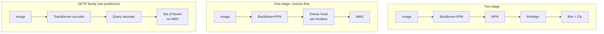

# Object Detection

two-stage vs one-stageanchor-freeDETR / set predictionNMS-freeFPNopen-vocabulary

> [!TIP] 이 챕터가 중요한 이유
> Detection은 지원자의 segmentation 작업의 **upstream**입니다: proposal이 mask를 좌우하고 (PointWSSIS의 핵심 논지), open-vocabulary detector (Grounding DINO)는 Grounded-SAM / Grounded-ZIM과 grounded VLM을 위한 box provider입니다. 면접관은 *개념적 흐름*을 원합니다: dense prior → anchor-free → **set prediction** → open-vocabulary.

## The design axes

| Axis | Representatives | Character |
| --- | --- | --- |
| **Two-stage** | Faster R-CNN, Cascade R-CNN | RPN proposals → RoI refine; accurate, strong on small objects, slower |
| **One-stage anchor** | SSD, RetinaNet, YOLOv2–v7 | dense predictions over anchor priors; fast |
| **Anchor-free** | FCOS, CenterNet, YOLOX, FCOS-heads | regress from center/keypoints; simpler, fewer hyperparameters |
| **Set prediction** | DETR, Deformable/DN/DINO-DETR, RT-DETR | Hungarian-matched queries; **NMS-free** end-to-end |
| **Open-vocabulary** | GLIP, Grounding DINO, OWLv2, YOLO-World | text-conditioned; detect unseen categories |

## 1 · Two-stage vs one-stage

Two-stage (Faster R-CNN)

RPN이 class-agnostic proposal을 내보내고; RoIAlign이 feature를 pooling하며; head가 box + class를 refine합니다. Cascade R-CNN은 IoU threshold를 높여가며 head를 쌓습니다. <b>최고 정확도, small/dense 객체에 강함.</b> latency는 더 높습니다.

One-stage

한 번의 forward로 box + class를 densely 예측합니다. <b>낮은 latency</b>, 배포에 유리. RetinaNet의 <b>focal loss</b>는 foreground/background 불균형을 고쳐 정확도 격차를 대부분 좁혔습니다.

경계는 흐려졌습니다: RT-DETR과 최신 YOLO들은 one-stage 속도로 two-stage 정확도에 도달합니다. 제약으로 선택하세요 — server batch/accuracy → two-stage나 DETR; mobile/real-time → 경량 one-stage/anchor-free.

> [!NOTE] Candidate link
> **EResFD** (WACV 2024, 공저)는 경량 face detection을 위해 *standard convolution*을 재조명했습니다 — architecture 유행(depthwise 일색)이 항상 효율성의 승리는 아니라는 것을 상기시킵니다.

## 2 · Anchor-based vs anchor-free

- **Anchor-based:** 각 위치에 미리 정한 scale/aspect ratio의 box를 깔고; offset을 regress합니다. dataset에 의존하는 많은 hyperparameter(크기, 비율, IoU-match threshold)를 도입합니다.
- **Anchor-free:** **FCOS**는 각 foreground 위치에서 box까지의 $(l,t,r,b)$ 거리 + *centerness* score를 regress하고; **CenterNet**은 object-center heatmap + 크기를 예측합니다. 더 단순하고 일반화가 잘 되지만, 극단적 aspect ratio / 심한 crowding에서 고전할 수 있습니다.
- **Label assignment**이 진짜 지렛대입니다: static IoU → **ATSS** (통계 기반 adaptive threshold) → **OTA/SimOTA** (optimal-transport assignment, YOLOX에서 사용). anchor냐 anchor-free냐보다 positive를 제대로 잡는 것이 더 중요합니다.

> [!NOTE] Candidate link
> **TricubeNet** (WACV 2022, 제1저자)은 *oriented* 객체를 각진 box 대신 2D Gaussian 유사 커널로 표현합니다 — 약하게 가려지고 회전된 객체(항공, 문서, 주차)에 유용합니다. Oriented detection은 IoU와 NMS를 **rotated** 변형으로 바꿉니다.

## 3 · NMS, Soft-NMS, and NMS-free

Greedy **NMS**: score로 정렬하고, 유지된 더 높은 score의 box와 IoU > τ인 box를 버립니다.

- **Failure mode:** 실제로 겹치는 진짜 객체들(군중, 겹쳐 세운 차)이 suppress됩니다.
- **Soft-NMS:** 삭제 대신 감쇠 — $s_i \leftarrow s_i \cdot e^{-\text{IoU}^2/\sigma}$ (Gaussian) — 붐비는 positive를 되살립니다.
- **Matrix/Fast NMS:** 속도를 위해 vectorize.
- **NMS-free (DETR):** *학습* 시점의 one-to-one Hungarian matching이 중복을 내보내지 않도록 모델을 가르치므로 inference에서 NMS가 필요 없습니다.

구현은 전형적인 ML-coding 라운드입니다 — [IoU & Non-Max Suppression](#/ml-coding/nms-iou) 참고.

## 4 · DETR and set prediction

DETR은 detection을 **direct set prediction**으로 재구성합니다: `N`개 learned query → transformer decoder → `N`개 (box, class) 예측을, matching cost를 최소화하는 Hungarian 알고리즘으로 GT에 매칭한 뒤 다음으로 supervise합니다:

$$\mathcal{L}=\sum_i \Big[\lambda_{\text{cls}}\mathcal{L}_{\text{cls}}(p_i,c_i)+\mathbb{1}_{c_i\neq\varnothing}\big(\lambda_{\text{L1}}\|b_i-\hat b_i\|_1+\lambda_{\text{giou}}\mathcal{L}_{\text{GIoU}}(b_i,\hat b_i)\big)\Big]$$

<figure>
<svg viewBox="0 0 640 170" xmlns="http://www.w3.org/2000/svg" font-family="Inter, sans-serif" font-size="11">
  <text x="60" y="20" text-anchor="middle" fill="#6366f1">predictions</text>
  <text x="320" y="20" text-anchor="middle" fill="#e0533f">bipartite (Hungarian) matching</text>
  <text x="580" y="20" text-anchor="middle" fill="#12a150">ground truth</text>
  <g fill="#6366f1"><circle cx="60" cy="50" r="8"/><circle cx="60" cy="85" r="8"/><circle cx="60" cy="120" r="8"/><circle cx="60" cy="150" r="8"/></g>
  <g fill="#12a150"><circle cx="580" cy="60" r="8"/><circle cx="580" cy="110" r="8"/></g>
  <path d="M68 50 L572 60" stroke="#12a150" stroke-width="2"/>
  <path d="M68 120 L572 110" stroke="#12a150" stroke-width="2"/>
  <path d="M68 85 L560 40" stroke="#98a3b2" stroke-width="1" stroke-dasharray="3"/>
  <text x="120" y="150" fill="#98a3b2">unmatched → ∅ (no-object)</text>
</svg>
<figcaption>각 query는 최대 하나의 GT에 매칭됩니다; 나머지는 "no-object"가 됩니다. One-to-one matching이 바로 NMS를 불필요하게 만드는 요소입니다.</figcaption>
</figure>

Vanilla DETR은 수렴이 느리고 small 객체에서 고전했습니다. 그 해법들이 이 family를 정의합니다:

<dl class="kv">
<dt>Deformable DETR</dt><dd>몇 개 점을 sampling하는 sparse <b>deformable attention</b> → 빠른 수렴, multi-scale.</dd>
<dt>DN-DETR / DINO</dt><dd><b>Denoising training</b>: noise를 준 GT box를 auxiliary query로 넣어 matching을 안정화; DINO는 contrastive denoising + mixed query selection을 더해 → SOTA급 정확도.</dd>
<dt>RT-DETR</dt><dd>Real-time NMS-free transformer detector; 효율적인 hybrid encoder.</dd>
<dt>Grounding DINO</dt><dd><b>open-set</b> detection을 위한 language-conditioned DINO — Grounded-SAM / Grounded-ZIM의 box provider.</dd>
</dl>

## 5 · FPN — and why it hides a weak-supervision trap

**Feature Pyramid Network:** top-down semantic feature와 bottom-up 고해상도 feature를 결합해 각 level(P2…P6)이 객체 scale별로 특화되게 합니다 (고해상도 → small, 저해상도 → large).

> [!QUESTION] "What's subtle about FPN under point supervision?"
> 하나의 **point**는 scale 정보를 담지 않으므로, 어느 pyramid level이 그 객체를 담당해야 하는지 알 수 없습니다. PointWSSIS는 **Adaptive Pyramid-Level Selection**을 도입합니다 — level 간 confidence의 arg-max로 level을 고름 — 잘못된 level을 고르면 noisy pseudo-mask가 나오기 때문입니다. 멋진 "weak supervision을 물어뜯는 detection 디테일" 이야기입니다. [PointWSSIS & BESTIE deep-dive](#/resume/pointwssis-bestie) 참고.

## 6 · Regression losses: L1 → IoU family

box 좌표에 대한 순수 L1은 overlap을 직접 최적화하지 않고 scale-invariant하지도 않습니다. IoU family가 이를 고칩니다:

| Loss | Adds |
| --- | --- |
| IoU | direct overlap, scale-invariant; zero gradient when boxes disjoint |
| GIoU | enclosing-box term → gradient even when disjoint |
| DIoU | center-distance term → faster convergence |
| CIoU | + aspect-ratio consistency |

DETR은 **L1 + GIoU**를 함께 사용합니다 (거친 배치에는 L1, overlap에는 GIoU). 철학적으로 mask loss에 boundary/Grad 항을 넣는 것과 동일합니다: *평가 geometry를 objective에 새겨 넣는다*.

## 7 · Focal loss (the one-stage enabler)

$$\text{FL}(p_t)=-\alpha_t(1-p_t)^\gamma \log p_t$$

Dense detector는 쉬운 background anchor의 홍수를 봅니다; $(1-p_t)^\gamma$ 항이 쉬운 예제의 가중치를 낮춰 어려운 positive가 gradient를 지배하게 합니다. 이것이 RetinaNet이 two-stage 정확도에 도달하게 했습니다. segmentation의 Dice/BCE, matting의 L1+Grad와 대비하세요: 각 분야는 *무엇이 드물고 무엇이 어려운지*에 맞는 reweighting을 고릅니다.

## 8 · Open-vocabulary detection (2026)

2026년의 헤드라인: **text**(또는 exemplar 이미지)를 받아 box label로 본 적 없는 category를 localize하는 detector들 — region feature를 CLIP/text embedding 공간에 정렬하는 방식입니다.

- **GLIP** — detection을 phrase grounding으로 재구성 (detection + grounding co-training).
- **Grounding DINO 1.5/1.6, DINO-X** — DINO decoder + language; 강력한 zero-shot COCO/LVIS (vendor-reported AP — 정확한 수치는 조심).
- **OWL-ViT / OWLv2** — CLIP ViT + detection head; open-vocab이자 one-shot (image-conditioned).
- **YOLO-World** — re-parameterizable vision-language fusion을 통해 open-vocab을 **real-time**으로 가져옵니다.
- **SAM 3 PCS** — open-vocab *detection + segmentation + tracking*을 presence head를 가진 하나의 promptable 모델로 접습니다. [Vision Foundation Models](#/cv/foundation-models) 참고.

> [!NOTE] Grounding is the bridge to VLMs
> region-text match는 바로 open-vocab detection의 "언어 쪽"입니다. 이것이 grounded multimodal reasoning의 닻입니다 — [Grounding & Region Reasoning](#/vlm/grounding) 참고.

## 9 · Q&A

Why does DETR remove NMS, and is NMS truly gone?

**Short:** one-to-one matching이 중복을 만들지 않도록 모델을 학습시키므로 inference에 NMS가 필요 없습니다.

**Deep:** Hungarian assignment는 각 GT에 정확히 하나의 책임 query를 부여합니다; 중복은 학습 중 false positive로 penalize됩니다. 실무에서는 일부 real-time 변형이 여전히 가벼운 NMS를 더하거나 one-to-many auxiliary head(예: hybrid matching)로 수렴을 가속한 뒤 inference에서 이를 버립니다. 그래서 "NMS-free"는 학습 속성이지 확고한 보장은 아닙니다.

Detection is the bottleneck of instance segmentation — explain.

**Short:** proposal/query가 없으면 → mask도 없습니다, mask head가 아무리 좋아도.

**Deep:** 최신 instance/panoptic 파이프라인은 *탐지된 객체별로* mask를 만듭니다. false-negative proposal은 객체를 통째로 지워버리고; mask branch는 기회조차 얻지 못합니다. PointWSSIS는 이를 활용합니다: 값싼 **point**가 proposal을 true-positive만 남기도록 걸러내므로, 잘 학습된 mask head가 중요한 곳에 적용됩니다 — *proposal* 문제와 *mask* 문제를 분리하는 것입니다.

You report AP50 only. What will a sharp reviewer ask?

**Short:** AP75, IoU 전반의 AP (0.50:0.05:0.95), 그리고 AP_S/M/L.

**Deep:** AP50은 느슨한 localization에 보상을 줍니다; COCO 주요 metric은 IoU threshold를 평균 내므로 tight한 box에 점수를 줍니다. AP_S는 small-object 약점을 드러냅니다 (여기서 FPN과 two-stage가 도움이 됩니다). 항상 엄격한 metric과 크기별 분해를 보고하고, detection box-AP ≠ mask-AP임을 명심하세요 (후자는 mask IoU로 매칭합니다).

### Follow-ups
- *"Anchors: too few positives per image — fixes?"* Focal loss, ATSS, OTA/SimOTA assignment.
- *"Distillation for detection?"* Logit + feature + relation KD; forward를 두 번 하기 때문에 비쌈 — 그래서 ECLIPSE가 KD를 아예 피했습니다 (freeze + prompt).
- *"Latency in an agent tool?"* VLM agent가 detector를 tool로 호출할 때 (ViperGPT/VisProg), detector latency가 wall-clock을 지배합니다; YOLO-World / RT-DETR 급 모델을 선호하세요.

## Cheat-sheet

| Term | Meaning |
| --- | --- |
| RPN | region proposal network (two-stage) |
| ATSS / OTA | adaptive / optimal-transport label assignment |
| Hungarian matching | DETR one-to-one prediction↔GT assignment |
| Soft-NMS | decay scores instead of deleting |
| Focal loss | down-weight easy negatives → one-stage parity |
| GIoU/DIoU/CIoU | overlap-aware box regression |
| FPN | scale-specialized feature pyramid |
| Open-vocabulary | text/exemplar-conditioned categories (Grounding DINO, YOLO-World) |

**Related:** [Segmentation](#/cv/segmentation) · [Vision Foundation Models](#/cv/foundation-models) · [Weak & Semi-Supervised](#/cv/weak-semi-supervised) · [IoU & NMS](#/ml-coding/nms-iou) · [Grounding & Region Reasoning](#/vlm/grounding) · [PointWSSIS & BESTIE deep-dive](#/resume/pointwssis-bestie)
