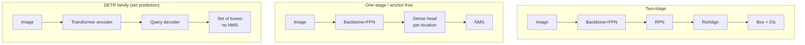

# Object Detection

two-stage vs one-stageanchor-freeDETR / set predictionNMS-freeFPNopen-vocabulary

> [!TIP] Why this chapter matters
> Detection is the **upstream** of the candidate's segmentation work: proposals gate masks (the core PointWSSIS argument), and open-vocabulary detectors (Grounding DINO) are the box provider for Grounded-SAM / Grounded-ZIM and for grounded VLMs. Interviewers want the *conceptual arc*: dense priors → anchor-free → **set prediction** → open-vocabulary.

## The design axes

| Axis | Representatives | Character |
| --- | --- | --- |
| **Two-stage** | Faster R-CNN, Cascade R-CNN | RPN proposals → RoI refine; accurate, strong on small objects, slower |
| **One-stage anchor** | SSD, RetinaNet, YOLOv2–v7 | dense predictions over anchor priors; fast |
| **Anchor-free** | FCOS, CenterNet, YOLOX, FCOS-heads | regress from center/keypoints; simpler, fewer hyperparameters |
| **Set prediction** | DETR, Deformable/DN/DINO-DETR, RT-DETR | Hungarian-matched queries; **NMS-free** end-to-end |
| **Open-vocabulary** | GLIP, Grounding DINO, OWLv2, YOLO-World | text-conditioned; detect unseen categories |

## 1 · Two-stage vs one-stage

Two-stage (Faster R-CNN)

RPN emits class-agnostic proposals; RoIAlign pools features; a head refines box + class. Cascade R-CNN stacks heads at rising IoU thresholds. <b>Best accuracy, strong on small/dense objects.</b> Higher latency.

One-stage

Predict box + class densely in a single forward. <b>Low latency</b>, deploy-friendly. RetinaNet's <b>focal loss</b> closed most of the accuracy gap by fixing foreground/background imbalance.

The boundary has blurred: RT-DETR and modern YOLOs hit two-stage accuracy at one-stage speed. Choose by constraint — server batch/accuracy → two-stage or DETR; mobile/real-time → lightweight one-stage/anchor-free.

> [!NOTE] Candidate link
> **EResFD** (WACV 2024, co-author) revisited *standard convolution* for lightweight face detection — a reminder that architecture fashion (depthwise-everything) isn't always the efficiency win.

## 2 · Anchor-based vs anchor-free

- **Anchor-based:** tile each location with boxes of preset scales/aspect ratios; regress offsets. Introduces many hyperparameters (sizes, ratios, IoU-match thresholds) that are dataset-dependent.
- **Anchor-free:** **FCOS** regresses $(l,t,r,b)$ distances to the box from each foreground location + a *centerness* score; **CenterNet** predicts an object-center heatmap + size. Simpler, generalizes better, can struggle on extreme aspect ratios / heavy crowding.
- **Label assignment** is the real lever: static IoU → **ATSS** (adaptive threshold from statistics) → **OTA/SimOTA** (optimal-transport assignment, used in YOLOX). Getting positives right matters more than anchor vs anchor-free per se.

> [!NOTE] Candidate link
> **TricubeNet** (WACV 2022, first author) represents *oriented* objects with a 2D Gaussian-like kernel rather than an angled box — useful for weakly-occluded, rotated objects (aerial, documents, parking). Oriented detection changes IoU and NMS to their **rotated** variants.

## 3 · NMS, Soft-NMS, and NMS-free

Greedy **NMS**: sort by score, drop any box with IoU > τ against a kept higher-scoring box.

- **Failure mode:** true objects that genuinely overlap (crowds, stacked cars) get suppressed.
- **Soft-NMS:** decay instead of delete — $s_i \leftarrow s_i \cdot e^{-\text{IoU}^2/\sigma}$ (Gaussian) — recovers crowded positives.
- **Matrix/Fast NMS:** vectorized for speed.
- **NMS-free (DETR):** one-to-one Hungarian matching at *training* time teaches the model not to emit duplicates, so no NMS is needed at inference.

Implementation is a classic ML-coding round — see [IoU & Non-Max Suppression](#/ml-coding/nms-iou).

## 4 · DETR and set prediction

DETR reframes detection as **direct set prediction**: `N` learned queries → transformer decoder → `N` (box, class) predictions, matched to GT by the Hungarian algorithm minimizing a matching cost, then supervised by:

$$\mathcal{L}=\sum_i \Big[\lambda_{\text{cls}}\mathcal{L}_{\text{cls}}(p_i,c_i)+\mathbb{1}_{c_i\neq\varnothing}\big(\lambda_{\text{L1}}\|b_i-\hat b_i\|_1+\lambda_{\text{giou}}\mathcal{L}_{\text{GIoU}}(b_i,\hat b_i)\big)\Big]$$

<figure>
<svg viewBox="0 0 640 170" xmlns="http://www.w3.org/2000/svg" font-family="Inter, sans-serif" font-size="11">
  <text x="60" y="20" text-anchor="middle" fill="#6366f1">predictions</text>
  <text x="320" y="20" text-anchor="middle" fill="#e0533f">bipartite (Hungarian) matching</text>
  <text x="580" y="20" text-anchor="middle" fill="#12a150">ground truth</text>
  <g fill="#6366f1"><circle cx="60" cy="50" r="8"/><circle cx="60" cy="85" r="8"/><circle cx="60" cy="120" r="8"/><circle cx="60" cy="150" r="8"/></g>
  <g fill="#12a150"><circle cx="580" cy="60" r="8"/><circle cx="580" cy="110" r="8"/></g>
  <path d="M68 50 L572 60" stroke="#12a150" stroke-width="2"/>
  <path d="M68 120 L572 110" stroke="#12a150" stroke-width="2"/>
  <path d="M68 85 L560 40" stroke="#98a3b2" stroke-width="1" stroke-dasharray="3"/>
  <text x="120" y="150" fill="#98a3b2">unmatched → ∅ (no-object)</text>
</svg>
<figcaption>Each query is matched to at most one GT; the rest become "no-object". One-to-one matching is what removes the need for NMS.</figcaption>
</figure>

Vanilla DETR converged slowly and struggled on small objects. The fixes define the family:

<dl class="kv">
<dt>Deformable DETR</dt><dd>Sparse <b>deformable attention</b> sampling a few points → faster convergence, multi-scale.</dd>
<dt>DN-DETR / DINO</dt><dd><b>Denoising training</b>: feed noised GT boxes as auxiliary queries to stabilize matching; DINO adds contrastive denoising + mixed query selection → SOTA-class accuracy.</dd>
<dt>RT-DETR</dt><dd>Real-time NMS-free transformer detector; efficient hybrid encoder.</dd>
<dt>Grounding DINO</dt><dd>Language-conditioned DINO for <b>open-set</b> detection — the box provider for Grounded-SAM / Grounded-ZIM.</dd>
</dl>

## 5 · FPN — and why it hides a weak-supervision trap

**Feature Pyramid Network:** fuse top-down semantic features with bottom-up high-resolution features so each level (P2…P6) specializes by object scale (high-res → small, low-res → large).

> [!QUESTION] "What's subtle about FPN under point supervision?"
> A single **point** carries no scale, so you don't know which pyramid level should own the object. PointWSSIS introduces **Adaptive Pyramid-Level Selection** — pick the level by arg-max confidence across levels — because choosing the wrong level yields a noisy pseudo-mask. This is a nice "detection detail that bites weak supervision" story. See the [PointWSSIS & BESTIE deep-dive](#/resume/pointwssis-bestie).

## 6 · Regression losses: L1 → IoU family

Plain L1 on box coordinates doesn't directly optimize overlap and isn't scale-invariant. The IoU family fixes this:

| Loss | Adds |
| --- | --- |
| IoU | direct overlap, scale-invariant; zero gradient when boxes disjoint |
| GIoU | enclosing-box term → gradient even when disjoint |
| DIoU | center-distance term → faster convergence |
| CIoU | + aspect-ratio consistency |

DETR uses **L1 + GIoU** together (L1 for coarse placement, GIoU for overlap). Philosophically identical to putting a boundary/Grad term in a mask loss: *bake the evaluation geometry into the objective*.

## 7 · Focal loss (the one-stage enabler)

$$\text{FL}(p_t)=-\alpha_t(1-p_t)^\gamma \log p_t$$

Dense detectors see a flood of easy background anchors; the $(1-p_t)^\gamma$ factor down-weights easy examples so hard positives dominate the gradient. This let RetinaNet match two-stage accuracy. Contrast with segmentation's Dice/BCE and matting's L1+Grad: each field picks the reweighting that matches *what is rare and what is hard*.

## 8 · Open-vocabulary detection (2026)

The 2026 headline: detectors that take **text** (or an exemplar image) and localize categories never seen with box labels, by aligning region features to a CLIP/text embedding space.

- **GLIP** — reformulates detection as phrase grounding (detection + grounding co-training).
- **Grounding DINO 1.5/1.6, DINO-X** — DINO decoder + language; strong zero-shot COCO/LVIS (vendor-reported AP — hedge exact numbers).
- **OWL-ViT / OWLv2** — CLIP ViT + detection head; open-vocab and one-shot (image-conditioned).
- **YOLO-World** — brings open-vocab to **real-time** via re-parameterizable vision-language fusion.
- **SAM 3 PCS** — folds open-vocab *detection + segmentation + tracking* into one promptable model with a presence head. See [Vision Foundation Models](#/cv/foundation-models).

> [!NOTE] Grounding is the bridge to VLMs
> A region-text match is exactly the "language side" of open-vocab detection. This is the anchor of grounded multimodal reasoning — see [Grounding & Region Reasoning](#/vlm/grounding).

## 9 · Q&A

Why does DETR remove NMS, and is NMS truly gone?

**Short:** one-to-one matching trains the model to not duplicate, so inference needs no NMS.

**Deep:** the Hungarian assignment gives each GT exactly one responsible query; duplicates are penalized as false positives during training. In practice some real-time variants still add light NMS or use one-to-many auxiliary heads (e.g. hybrid matching) to speed convergence, then drop them at inference. So "NMS-free" is a training property, not a hard guarantee.

Detection is the bottleneck of instance segmentation — explain.

**Short:** no proposal/query → no mask, regardless of how good the mask head is.

**Deep:** modern instance/panoptic pipelines mask *per detected object*. A false-negative proposal deletes the object entirely; the mask branch never gets a chance. PointWSSIS exploits this: a cheap **point** filters proposals to true-positives only, so the well-trained mask head is applied where it counts — decoupling the *proposal* problem from the *mask* problem.

You report AP50 only. What will a sharp reviewer ask?

**Short:** AP75, AP across IoU (0.50:0.05:0.95), and AP_S/M/L.

**Deep:** AP50 rewards loose localization; the COCO primary metric averages IoU thresholds so it credits tight boxes. AP_S exposes small-object weakness (where FPN and two-stage help). Always report the strict metric and the size breakdown, and note detection box-AP ≠ mask-AP (the latter matches on mask IoU).

### Follow-ups
- *"Anchors: too few positives per image — fixes?"* Focal loss, ATSS, OTA/SimOTA assignment.
- *"Distillation for detection?"* Logit + feature + relation KD; expensive because of two forward passes — why ECLIPSE avoided KD entirely (freeze + prompts).
- *"Latency in an agent tool?"* When a VLM agent calls a detector as a tool (ViperGPT/VisProg), detector latency dominates wall-clock; prefer YOLO-World / RT-DETR class models.

## Cheat-sheet

| Term | Meaning |
| --- | --- |
| RPN | region proposal network (two-stage) |
| ATSS / OTA | adaptive / optimal-transport label assignment |
| Hungarian matching | DETR one-to-one prediction↔GT assignment |
| Soft-NMS | decay scores instead of deleting |
| Focal loss | down-weight easy negatives → one-stage parity |
| GIoU/DIoU/CIoU | overlap-aware box regression |
| FPN | scale-specialized feature pyramid |
| Open-vocabulary | text/exemplar-conditioned categories (Grounding DINO, YOLO-World) |

**Related:** [Segmentation](#/cv/segmentation) · [Vision Foundation Models](#/cv/foundation-models) · [Weak & Semi-Supervised](#/cv/weak-semi-supervised) · [IoU & NMS](#/ml-coding/nms-iou) · [Grounding & Region Reasoning](#/vlm/grounding) · [PointWSSIS & BESTIE deep-dive](#/resume/pointwssis-bestie)
