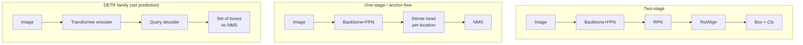

# Object Detection

> [!NOTE] One-line definition
> **Object detection = localization + classification.** It answers both **what** is in an image and **where** it is. While [Image Classification](#/cv/classification) attaches one label to an entire image, detection returns several **bounding boxes** and labels, one for each object.

## What it is and why it matters

An autonomous vehicle needs more than "there is a person ahead"; it must know **where in the image** that person appears. A detector produces the following for each object:

- **Bounding box:** usually four numbers `(x1, y1, x2, y2)`, the top-left and bottom-right coordinates in xyxy format. Another representation is `(cx, cy, w, h)`, center plus size.
- **Class label:** person, car, and so on, plus a **score** used for ranking. The score may combine objectness and a class score, and should not automatically be interpreted as a calibrated probability.

<figure>
<svg viewBox="0 0 480 260" xmlns="http://www.w3.org/2000/svg" font-family="Inter, sans-serif" font-size="12">
  <rect x="10" y="20" width="460" height="220" rx="8" fill="none" stroke="#98a3b2" stroke-width="1"/>
  <text x="240" y="15" text-anchor="middle" fill="#98a3b2">input image</text>
  <!-- object 1 -->
  <rect x="60" y="80" width="90" height="140" fill="none" stroke="#e0533f" stroke-width="2.5"/>
  <rect x="60" y="64" width="70" height="18" fill="#e0533f"/><text x="66" y="77" fill="#fff" font-size="11">person 0.98</text>
  <!-- object 2 -->
  <rect x="200" y="140" width="150" height="80" fill="none" stroke="#6366f1" stroke-width="2.5"/>
  <rect x="200" y="124" width="58" height="18" fill="#6366f1"/><text x="205" y="137" fill="#fff" font-size="11">car 0.93</text>
  <!-- object 3 -->
  <rect x="370" y="70" width="70" height="70" fill="none" stroke="#12a150" stroke-width="2.5"/>
  <rect x="370" y="54" width="66" height="18" fill="#12a150"/><text x="374" y="67" fill="#fff" font-size="11">dog 0.87</text>
</svg>
<figcaption>Example detector output: a box, class, and score for every object. The box answers <b>where</b>; the label answers <b>what</b>.</figcaption>
</figure>

How a system obtains localization and classification is the central design question. **Anchor-based or anchor-free dense prediction**, **proposal refinement**, **query-based set prediction**, and **open-vocabulary conditioning** are composable axes rather than a single lineage in which each completely replaces the last. An open-vocabulary detector, for example, can use either a dense or query decoder.

> [!TIP] Interview one-liner
> Detection is **upstream** of the candidate's segmentation work: proposals determine masks—the central argument of PointWSSIS—and an open-vocabulary detector such as Grounding DINO supplies boxes to Grounded-SAM and grounded VLMs. Interviewers want the *conceptual progression*: dense priors → anchor-free → set prediction → open vocabulary.

## Two subproblems of detection

<div class="proscons"><div><div class="pros-t">Localization</div>

Fit box coordinates through **regression**. Use L1 or Smooth L1 and an IoU/GIoU-family loss, either alone or together.

</div><div><div class="cons-t">Classification</div>

Predict what class each candidate belongs to. Two-stage models and DETR may use softmax with a background or no-object class, while dense and open-vocabulary detectors may use a per-class sigmoid plus separate objectness. The target and score interpretation depend on the loss contract.

</div></div>

The central difficulty is that **the number of objects is not known in advance**. A detector therefore either (a) lays down many dense candidates and filters them, or (b) assigns each object to one of a fixed number of slots, or queries. These two philosophies produce the following design axes.

## Design axes

| Axis | Representative models | Character |
| --- | --- | --- |
| **Two-stage** | Faster R-CNN, Cascade R-CNN | generate proposals → refine RoIs; accuracy–latency trade-off |
| **One-stage anchor** | SSD, RetinaNet, early YOLO family | dense prediction over anchors; highly parallel |
| **Anchor-free** | FCOS, CenterNet, YOLOX | regress from points or centers; less anchor-shape design |
| **Set prediction** | DETR, Deformable/DN/DINO-DETR, RT-DETR | Hungarian-matched queries; standard inference needs no NMS |
| **Open vocabulary** | GLIP, Grounding DINO, OWLv2, YOLO-World | text-conditioned label space; evaluate generalization to novel concepts |



## 1 · Two-stage vs one-stage

<div class="proscons"><div><div class="pros-t">Two-stage (Faster R-CNN)</div>
The <b>RPN</b> proposes class-agnostic regions, <b>RoIAlign</b> samples features for each candidate, and a head refines its box and class. Cascade R-CNN stacks heads at increasing IoU thresholds. Per-proposal operations can increase latency, while performance on small and crowded objects still depends on the backbone, FPN, resolution, and implementation.
</div><div><div class="cons-t">One-stage</div>
A single dense head predicts boxes and classes, which can favor parallel execution and low latency. RetinaNet's <b>focal loss</b> reduces the domination of the loss by abundant easy background examples and made one-stage accuracy much more competitive (§7).
</div></div>

The boundary has blurred. RT-DETR and the YOLO family show strong latency–accuracy trade-offs on particular benchmarks, but rankings change with hardware, input size, batch size, and export runtime. Choose by measuring end-to-end latency, memory, and AP_S/M/L through the same deployment path.

> [!NOTE] Related research
> Reconsidering *standard convolution* for lightweight face detection in EResFD is a reminder that an architecture trend dominated by depthwise convolution does not always win in efficiency. See the [Resume Overview](#/resume/overview).

## 2 · Anchor-based vs anchor-free

- **Anchor-based:** place boxes of predefined sizes and aspect ratios at every location, then regress offsets. This introduces dataset-dependent hyperparameters such as size, ratio, and IoU matching threshold.
- **Anchor-free:** **FCOS** regresses the $(l,t,r,b)$ distances from each foreground point to a box plus *centerness*; **CenterNet** predicts an object-center heatmap and size. Anchor-shape hyperparameters decrease, but label assignment, scale ranges, and center priors remain design choices. Better generalization is not automatic.
- **Label assignment** is the real lever: static IoU → **ATSS**, with statistically adaptive thresholds → **OTA/SimOTA**, based on optimal-transport assignment in YOLOX. Selecting the right **positives** matters more than whether anchors exist.

> [!NOTE] Related research
> Oriented detection represents rotated objects in aerial images, documents, or parking scenes with a 2D Gaussian-like kernel rather than an axis-aligned box in TricubeNet, and replaces IoU and NMS with **rotated** variants. See the [Resume Overview](#/resume/overview).

## 3 · NMS, Soft-NMS, and NMS-free detection

Dense prediction produces **several overlapping boxes for the same object**. **Non-Maximum Suppression (NMS)** removes duplicates: sort by score and discard any box whose IoU with a previously kept, higher-scoring box exceeds $\tau$.

- **Failure mode:** two truly overlapping objects, such as people in a crowd or parked cars, can suppress each other.
- **Soft-NMS:** decay the score instead of deleting the box, $s_i \leftarrow s_i \cdot e^{-\text{IoU}^2/\sigma}$, preserving crowded positives.
- **NMS-free DETR:** one-to-one matching during *training* teaches the model not to produce duplicates, so inference does not require NMS.

This is a classic ML coding exercise. Implement it in **[IoU & NMS from Scratch](#/ml-coding/nms-iou)**.

## 4 · DETR and set prediction

DETR reframes detection as **direct set prediction**: `N` learned queries, or slots, pass through a Transformer decoder to produce `N` box and class predictions. The Hungarian algorithm assigns them one to one to ground truth by minimizing a matching cost, then supervises them with

$$\mathcal{L}=\sum_i \Big[\lambda_{\text{cls}}\mathcal{L}_{\text{cls}}(p_i,c_i)+\mathbb{1}_{c_i\neq\varnothing}\big(\lambda_{\text{L1}}\|b_i-\hat b_i\|_1+\lambda_{\text{giou}}\mathcal{L}_{\text{GIoU}}(b_i,\hat b_i)\big)\Big]$$

> **PyTorch-style pseudocode—matching and loss are separate DETR stages**

```python
class_logits, pred_boxes = detr(images)       # [B,N,C+1], [B,N,4]
B, N, _ = class_logits.shape
total_loss = 0.0
for b in range(B):
    cost = class_cost(class_logits[b], gt_cls[b]) \
         + l1_cost(pred_boxes[b], gt_box[b]) \
         + giou_cost(pred_boxes[b], gt_box[b])    # [N,M]
    q_idx, gt_idx = hungarian(cost.detach())       # discrete assignment, no grad

    target_cls = torch.full((N,), NO_OBJECT, dtype=torch.long,
                            device=class_logits.device)
    target_cls[q_idx] = gt_cls[b][gt_idx]          # unmatched query -> ∅
    total_loss += ce(class_logits[b], target_cls)
    total_loss += box_loss(pred_boxes[b][q_idx], gt_box[b][gt_idx])
total_loss.backward()                              # gradients reach matched predictions
```

<figure>
<svg viewBox="0 0 640 170" xmlns="http://www.w3.org/2000/svg" font-family="Inter, sans-serif" font-size="11">
  <text x="60" y="20" text-anchor="middle" fill="#6366f1">predictions (N queries)</text>
  <text x="320" y="20" text-anchor="middle" fill="#e0533f">1:1 Hungarian matching</text>
  <text x="580" y="20" text-anchor="middle" fill="#12a150">ground truth</text>
  <g fill="#6366f1"><circle cx="60" cy="50" r="8"/><circle cx="60" cy="85" r="8"/><circle cx="60" cy="120" r="8"/><circle cx="60" cy="150" r="8"/></g>
  <g fill="#12a150"><circle cx="580" cy="60" r="8"/><circle cx="580" cy="110" r="8"/></g>
  <path d="M68 50 L572 60" stroke="#12a150" stroke-width="2"/>
  <path d="M68 120 L572 110" stroke="#12a150" stroke-width="2"/>
  <path d="M68 85 L560 40" stroke="#98a3b2" stroke-width="1" stroke-dasharray="3"/>
  <text x="120" y="150" fill="#98a3b2">unmatched → ∅ (no object)</text>
</svg>
<figcaption>Each query matches at most one ground-truth object; every other query becomes "no object" (∅). This one-to-one assignment is the key reason NMS is unnecessary.</figcaption>
</figure>

Vanilla DETR converged slowly and struggled with small objects. The following solutions define the family:

<dl class="kv">
<dt>Deformable DETR</dt><dd>Sparse <b>deformable attention</b> samples only a few points, enabling faster convergence and multi-scale processing.</dd>
<dt>DN-DETR / DINO detector</dt><dd><b>Denoising training</b> adds noisy ground-truth boxes as auxiliary queries to stabilize matching. This DINO is the name of a detector and differs from the self-supervised vision model DINO.</dd>
<dt>RT-DETR</dt><dd>A real-time NMS-free Transformer detector with an efficient hybrid encoder.</dd>
<dt>Grounding DINO</dt><dd>A language-conditioned DINO for <b>open-set</b> detection and the box provider for Grounded-SAM.</dd>
</dl>

## 5 · FPN—and the weak-supervision trap

A **Feature Pyramid Network (FPN)** adds top-down upsampling and lateral connections to a backbone's bottom-up multi-scale features, giving high-resolution levels stronger semantic features. High-resolution levels are usually assigned to smaller objects and low-resolution levels to larger objects, but the exact ranges depend on the detector's assignment rules.

> [!QUESTION] "What is subtle about FPN under point supervision?"
> A single **point** contains no size information, so it does not reveal which pyramid level should own the object. PointWSSIS introduces **Adaptive Pyramid-Level Selection**, the argmax of confidence across levels, because choosing the wrong level creates a noisy pseudo-mask. See the [PointWSSIS & BESTIE deep dive](#/resume/pointwssis-bestie).

## 6 · Regression losses: L1 → the IoU family

Plain L1 on box coordinates neither optimizes overlap directly nor is scale-invariant. The IoU family addresses these limitations:

| Loss | What it adds |
| --- | --- |
| IoU | direct overlap, scale-invariant; zero gradient when boxes do not overlap |
| GIoU | enclosing-box term → gradient even when disjoint |
| DIoU | center-distance term → faster convergence |
| CIoU | + aspect-ratio consistency |

DETR combines **L1 + GIoU**: L1 encourages coarse placement and GIoU rewards overlap. Philosophically, this is the same as adding a boundary term to a mask loss: *encode evaluation geometry in the objective*.

## 7 · Focal loss—the key that enabled one-stage detection

$$\text{FL}(p_t)=-\alpha_t(1-p_t)^\gamma \log p_t$$

A dense detector sees a flood of easy background candidates. The $(1-p_t)^\gamma$ term downweights examples that are already well classified, focusing learning on **hard positives and negatives**. In RetinaNet, this treatment of class imbalance was central to strong one-stage performance.

## 8 · Open-vocabulary detection (2026)

Open-vocabulary detection conditions on **text** or an example image and expands the label space at inference time. Many methods align region and text representations, but accepting a name unseen during training is not the same as localizing its concept accurately. Evaluate base and novel splits, synonym and prompt sensitivity, and calibration separately.

- **GLIP:** reframes detection as phrase grounding and co-trains detection with grounding.
- **Grounding DINO 1.5/1.6 and DINO-X:** DINO decoder + language; strong zero-shot results, with care around vendor-reported figures.
- **OWL-ViT / OWLv2:** CLIP ViT + detection head; open vocabulary and one shot.
- **YOLO-World:** brings vision–language fusion to **real-time** open-vocabulary detection.
- **SAM 3 PCS:** integrates open-vocabulary *detection + segmentation + tracking* in one promptable model with a presence head. **SAM 3.1** follows with Object Multiplex for improved multi-object video execution. See [Vision Foundation Models](#/cv/foundation-models).

> [!NOTE] Grounding is the bridge to VLMs
> Region–text matching is the language side of open-vocabulary detection and an anchor for grounded multimodal reasoning. See [Grounding & Region Reasoning](#/vlm/grounding).

## 9 · Q&A

<details class="qa"><summary>Why does DETR remove NMS, and is NMS truly gone?</summary>
<div class="qa-body">

**Short:** One-to-one matching trains the model not to produce duplicates, so inference does not require NMS.

**Deep:** Hungarian assignment gives each ground-truth object exactly one responsible query; duplicate predictions are penalized as false positives during training. In practice, some real-time variants still add lightweight NMS or accelerate convergence with a one-to-many auxiliary head—such as hybrid matching—that is removed at inference. "NMS-free" is therefore a training property, not an unconditional guarantee.
</div></details>

<details class="qa"><summary>Explain the claim that detection is the bottleneck of instance segmentation.</summary>
<div class="qa-body">

**Short:** Without a proposal or query, there is no mask, no matter how good the mask head is.

**Deep:** In proposal-based instance segmentation, a false-negative proposal means the mask head never sees that object. Query-based mask-classification models also suffer recognition misses from a limited query set and matching. PointWSSIS uses inexpensive **points** to strengthen the spatial support of proposals, treating the proposal and mask problems separately.
</div></details>

<details class="qa"><summary>You report only AP50. What will a sharp reviewer ask?</summary>
<div class="qa-body">

**Short:** AP75, AP averaged over IoU 0.50:0.05:0.95, and AP_S/M/L.

**Deep:** AP50 tolerates loose localization, while the primary COCO metric averages IoU thresholds and rewards tighter boxes. AP_S reveals weaknesses on small objects, where FPN and two-stage approaches can help. Also remember that detection box AP differs from mask AP, which matches by mask IoU. See [mAP & mIoU](#/ml-coding/metrics-map-miou) for the evaluation metrics.
</div></details>

### Follow-ups

- *Too few positive anchors per image—fixes?* Focal loss, ATSS, and OTA/SimOTA.
- *Distillation for detection?* Logit, feature, and relation KD; two forward passes make it expensive, which is why ECLIPSE avoids KD through freeze + prompt.
- *Latency as an agent tool?* When a VLM agent calls a detector through ViperGPT or VisProg, detector latency can dominate wall-clock time; prefer models in the YOLO-World or RT-DETR class.

## Cheat sheet

| Term | Meaning |
| --- | --- |
| RPN | region proposal network for two-stage detection |
| ATSS / OTA | adaptive / optimal-transport ground-truth assignment |
| Hungarian matching | DETR's one-to-one prediction–ground-truth assignment |
| Soft-NMS | decay scores instead of deleting boxes |
| Focal loss | downweight easy negatives → competitive one-stage accuracy |
| GIoU/DIoU/CIoU | overlap-aware box regression |
| FPN | scale-specialized feature pyramid |
| Open vocabulary | categories conditioned on text or examples, as in Grounding DINO and YOLO-World |

**Next:** [Segmentation](#/cv/segmentation) · [Implement IoU & NMS](#/ml-coding/nms-iou) · [mAP & mIoU](#/ml-coding/metrics-map-miou) · [Vision Foundation Models](#/cv/foundation-models) · [Grounding & Region Reasoning](#/vlm/grounding)
