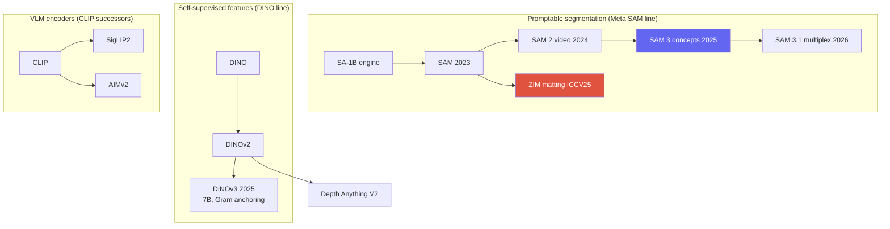
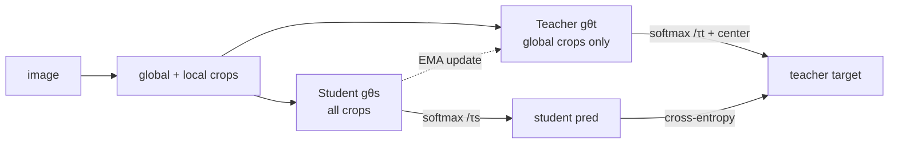

# Vision Foundation Models

<div class="tag-row"><span class="tag">SAM / SAM 2 / SAM 3.1</span><span class="tag">DINOv3</span><span class="tag">SigLIP2 / AIMv2</span><span class="tag">Depth Anything</span><span class="tag">promptable</span><span class="tag">frozen backbone</span></div>

> [!NOTE] 이 챕터의 목표
> **파운데이션 모델(foundation model)** 이 무엇이고 왜 2026년 비전의 중심이 됐는지를 잡습니다. 앞 챕터들([전이학습](#/cv/backbones-transfer), [자기지도학습](#/cv/self-supervised))에서 "한 번 잘 학습한 백본을 재사용한다"는 아이디어를 봤다면, 이 챕터는 그것을 극한까지 밀어붙인 이야기입니다.

## 파운데이션 모델이란?

**한 줄 정의:** 넓은 데이터와 비교적 범용적인 목적함수로 대규모 사전학습되어, 여러 downstream task에 적응할 수 있는 기반 모델입니다. “Foundation model”은 규모·재사용 범위를 나타내는 우산 개념이지 아래 속성을 모두 만족해야 하는 엄밀한 architecture 이름은 아닙니다.

- **동결 백본(frozen backbone)** 또는 **fine-tuning/adapter**: 적응 방법은 예산과 domain shift에 따라 고릅니다.
- **가벼운 head/prompt**: 재사용 비용을 낮추는 흔한 방식이지만 필수 조건은 아닙니다.
- **promptable**: 점·박스·텍스트 같은 조건을 받는 일부 모델의 interface입니다.
- **open-vocabulary**: 고정 class head보다 넓은 text label space를 다루지만 모든 foundation model이 지원하지 않습니다.
- **zero-shot**: 해당 task/data에 추가 학습 없이 평가하는 protocol입니다. Foundation model이라고 zero-shot 성능이 자동으로 좋은 것은 아닙니다.

<figure>
<svg viewBox="0 0 640 220" xmlns="http://www.w3.org/2000/svg" font-family="Inter, sans-serif" font-size="12">
  <text x="120" y="26" text-anchor="middle" fill="#98a3b2">방대한 데이터로 한 번 학습</text>
  <rect x="40" y="70" width="160" height="80" rx="12" fill="#6366f1"/>
  <text x="120" y="105" text-anchor="middle" fill="#fff" font-weight="700">동결 백본</text>
  <text x="120" y="126" text-anchor="middle" fill="#dfe3ff" font-size="11">frozen backbone ❄</text>
  <!-- fan-out to many heads -->
  <g stroke="#98a3b2" stroke-width="1.5" fill="none">
    <path d="M200 90 C 280 90, 300 45, 380 45" marker-end="url(#fh)"/>
    <path d="M200 105 C 280 105, 300 95, 380 95" marker-end="url(#fh)"/>
    <path d="M200 120 C 280 120, 300 145, 380 145" marker-end="url(#fh)"/>
    <path d="M200 135 C 280 135, 300 195, 380 195" marker-end="url(#fh)"/>
  </g>
  <g font-size="12">
    <rect x="380" y="30" width="220" height="30" rx="6" fill="none" stroke="#e0533f" stroke-width="1.6"/><text x="490" y="50" text-anchor="middle" fill="#e0533f">+ head → 분류</text>
    <rect x="380" y="80" width="220" height="30" rx="6" fill="none" stroke="#0ea5e9" stroke-width="1.6"/><text x="490" y="100" text-anchor="middle" fill="#0ea5e9">+ head → 검출/분할</text>
    <rect x="380" y="130" width="220" height="30" rx="6" fill="none" stroke="#12a150" stroke-width="1.6"/><text x="490" y="150" text-anchor="middle" fill="#12a150">+ head → 깊이(depth)</text>
    <rect x="380" y="180" width="220" height="30" rx="6" fill="none" stroke="#d97706" stroke-width="1.6"/><text x="490" y="200" text-anchor="middle" fill="#d97706">+ prompt → matting · 로봇</text>
  </g>
  <defs><marker id="fh" markerWidth="8" markerHeight="8" refX="6" refY="3" orient="auto"><path d="M0 0 L6 3 L0 6" fill="#98a3b2"/></marker></defs>
</svg>
<figcaption>한 frozen backbone의 feature를 여러 head가 재사용하는 대표적 배치 형태입니다. 이것은 foundation model 적응법 중 하나이며, full fine-tuning·partial unfreezing·LoRA·distillation도 비용과 성능에 따라 선택합니다.</figcaption>
</figure>

> [!TIP] 면접 한 줄
> 현재의 중요한 설계 축은 **promptable/open-vocabulary interface**, **강한 self-supervised 또는 multimodal backbone**, **freeze–adapter–fine-tune 선택**입니다. 이를 하나의 필수 recipe처럼 말하기보다 zero-shot 보존, domain adaptation, latency와 data governance의 trade-off로 답하세요.

## 큰 그림: 세 갈래 계보

> 아래는 서로 다른 세 모델 계열을 비교하는 지도입니다. Promptable segmentation, self-supervised feature, vision-language encoder는 교차할 수 있지만 같은 개념이 아니며 specialist를 항상 대체하지도 않습니다.



## 1 · SAM: promptable segmentation

**SAM** (Meta, ICCV 2023) = 무거운 **image encoder** (ViT, 한 번 실행) + 가벼운 **prompt encoder** (point/box/mask) + class-agnostic mask를 만드는 **two-way transformer decoder**. model-in-the-loop **data engine**을 통해 **SA-1B** (11M 이미지, ~1B mask)로 학습했습니다.

> **PyTorch식 pseudocode — interactive inference에서 재사용하는 것**

```python
sam.eval()
with torch.inference_mode():
    image_in, meta = preprocess(image)               # resize/pad 정보 보존
    image_embed = sam.image_encoder(image_in)        # 이미지마다 한 번

    for prompt in user_interactions:
        prompt = map_to_encoder_coords(prompt, meta) # 원본 -> encoder 좌표
        sparse, dense = sam.prompt_encoder(prompt)
        low_res_masks, quality = sam.mask_decoder(
            image_embed, sparse, dense)              # prompt마다 가볍게 반복
        masks = postprocess(low_res_masks, meta)      # unpad + 원본 크기 복원
```

<figure>
<svg viewBox="0 0 640 170" xmlns="http://www.w3.org/2000/svg" font-family="Inter, sans-serif" font-size="11">
  <rect x="20" y="60" width="120" height="46" rx="8" fill="#6366f1"/><text x="80" y="80" text-anchor="middle" fill="#fff">Image encoder</text><text x="80" y="96" text-anchor="middle" fill="#dfe3ff">ViT (run once)</text>
  <rect x="20" y="118" width="120" height="34" rx="8" fill="none" stroke="#0ea5e9" stroke-width="2"/><text x="80" y="139" text-anchor="middle" fill="#0ea5e9">Prompt encoder</text>
  <text x="80" y="30" text-anchor="middle" fill="#6b7686">point / box / mask / (text→SAM3)</text>
  <path d="M80 40 V56" stroke="#98a3b2" marker-end="url(#s)"/>
  <path d="M140 83 H210" stroke="#98a3b2" stroke-width="1.5" marker-end="url(#s)"/>
  <path d="M140 135 C 180 135, 190 100, 210 92" stroke="#98a3b2" stroke-width="1.5" marker-end="url(#s)"/>
  <rect x="210" y="66" width="150" height="46" rx="8" fill="none" stroke="#e0533f" stroke-width="2"/><text x="285" y="86" text-anchor="middle" fill="#e0533f">Two-way decoder</text><text x="285" y="102" text-anchor="middle" fill="#6b7686">(light, iterate cheaply)</text>
  <path d="M360 89 H430" stroke="#98a3b2" stroke-width="1.5" marker-end="url(#s)"/>
  <rect x="430" y="66" width="180" height="46" rx="8" fill="#12a150"/><text x="520" y="86" text-anchor="middle" fill="#fff">Masks (multi-output)</text><text x="520" y="102" text-anchor="middle" fill="#dcffe8">embedding · pixel-embed</text>
  <defs><marker id="s" markerWidth="8" markerHeight="8" refX="6" refY="3" orient="auto"><path d="M0 0 L6 3 L0 6" fill="#98a3b2"/></marker></defs>
</svg>
<figcaption>무거운 image feature는 한 번만 encode하고; 가벼운 prompt encoder + decoder가 상호작용마다 실행됩니다. ZIM은 이 골격을 유지하되 hierarchical pixel decoder와 soft-α 출력으로 교체합니다.</figcaption>
</figure>

<dl class="kv">
<dt>Promptable 인터페이스</dt><dd><i>what</i>이 아니라 <i>where</i>에 집중; multi-mask 출력으로 모호성(shirt vs person)을 해소합니다.</dd>
<dt>설계상 인터랙티브</dt><dd>이미지를 한 번 encode하고; 저렴한 prompt를 반복 → real-time UX.</dd>
<dt>자동 mask 생성</dt><dd>point prompt grid + NMS → 모든 것을 segment.</dd>
<dt>알려진 한계</dt><dd>Stride-4 얕은 pixel decoder → checkerboard, 거친 미세 구조; 다소 hard한 mask; text/concept 이해 없음 (SAM1).</dd>
</dl>

> [!NOTE] 관련 연구
> SAM의 거친 경계야말로 **ZIM**이 matting 수준의 $\alpha$에 도달하기 위해 고친 부분입니다 — 동일한 promptable interface, hierarchical decoder, soft 출력, 그리고 data-granularity 수정. [Image Matting](#/cv/matting)과 [ZIM deep-dive](#/resume/zim)를 참고하세요.

## 2 · SAM 2 → SAM 3 → SAM 3.1

- **SAM 2** (2024): **streaming memory bank**가 video frame 전반에 걸쳐 객체 정체성을 전파해 거의 real-time 상호작용 video segmentation을 가능하게 합니다; **SA-V** dataset. Hiera backbone.
- **[SAM 3](https://ai.meta.com/research/publications/sam-3-segment-anything-with-concepts/)** (Meta, 2025-11-19): **Promptable Concept Segmentation (PCS)** — 짧은 noun phrase나 exemplar가 detect + segment + track을 조건화합니다. Image detector와 memory 기반 video tracker가 backbone을 공유하고, recognition과 localization을 분리하는 presence head를 둡니다. 공식 공개에는 SA-Co benchmark/data engine이 함께 소개됐습니다.
- **[SAM 3.1](https://github.com/facebookresearch/sam3/blob/main/RELEASE_SAM3p1.md)** (2026-03-27): 새 세대의 semantic capability라기보다 video multi-object tracking 실행을 위한 **Object Multiplex**와 checkpoint/inference 최적화 업데이트입니다. 공식 표에서도 benchmark별 변화가 섞여 있으므로 “항상 더 정확하다”가 아니라 객체 수가 클 때의 throughput·memory와 task score를 함께 비교합니다.

> [!QUESTION] "SAM 3의 PCS는 SAM 2와 아키텍처적으로 어떻게 다르며, 왜 recognition과 localization을 분리하나요?"
> **Short:** SAM 2는 *prompt된 region*을 track하고; SAM 3는 text/exemplar로부터 *한 concept의 모든 instance*를 찾은 뒤 track합니다. **Deep:** open-vocab detection은 두 가지 어려운 문제 — *concept이 존재하는가*와 *정확히 어디인가* — 를 결합하는데, 이를 함께 최적화하면 recognition 오류가 localization을 오염시킵니다. **presence head**가 concept 존재 여부를 별도로 예측하므로 mask decoder는 localization에 특화됩니다; 이는 open-vocab precision/recall을 깔끔하게 개선합니다. grounding과 promptable segmentation이 하나의 모델로 수렴한 것입니다.

## 3 · DINO family: self-supervised dense features

**DINO → DINOv2 → DINOv3.** 사람 라벨 없이 하는 self-**di**stillation: student가 augment된 view 전반에서 momentum-teacher의 출력을 맞춥니다. 그 결과 attention·patch feature에 객체 구조가 나타나 추가 수동 annotation 없이 localization 단서로 활용할 수 있지만, 곧바로 완전한 detector가 생긴다는 뜻은 아닙니다.

### DINO는 어떻게 학습하나 (self-distillation, 레이블 없음, negative 없음)

**같은 architecture**를 가진 두 네트워크: gradient descent로 갱신되는 **student** $g_{\theta_s}$, 그리고 student의 **EMA**로서 절대 back-propagation되지 않는 **teacher** $g_{\theta_t}$. **Multi-crop** augmentation은 한 이미지에서 여러 개의 **global** crop(큰 것)과 여러 개의 **local** crop(작은 것)을 만듭니다. student는 *모든* crop을 보고; teacher는 global crop만 봅니다. student는 자신의 출력 분포가 **teacher의 것과 일치하도록** 학습됩니다 — "다른 view로부터 이 이미지에 대한 teacher의 view를 예측하라":

두 global crop 집합을 $\mathcal G$, student가 보는 모든 crop을 $\mathcal V$라 하면 핵심 loss는 다음처럼 씁니다. 같은 view 쌍은 제외해 서로 다른 관점을 맞춥니다.

$$
\min_{\theta_s}\ \sum_{u\in\mathcal G}\sum_{\substack{v\in\mathcal V\\v\ne u}}
H\!\left(p_t(u),p_s(v)\right),\qquad
p_s(v)=\operatorname{softmax}\!\left(g_{\theta_s}(v)/\tau_s\right),\quad
p_t(u)=\operatorname{softmax}\!\left((g_{\theta_t}(u)-c)/\tau_t\right)
$$

($H$ = cross-entropy; teacher temperature $\tau_t$가 작으면 = sharp, student는 $\tau_s$). 결정적으로 여기엔 **negative pair가 없습니다** — 그렇다면 무엇이 상수로의 collapse를 막을까요? teacher에 작용하는 두 가지 대립하는 힘:

- **Centering** — teacher의 logit에서 EMA mean을 빼서, 어떤 단일 출력 차원도 지배하지 못하게 합니다 (one-hot collapse 방지).
- **Sharpening** — 작은 teacher temperature가 target을 뾰족하게 유지합니다 (uniform collapse 방지).

Centering과 sharpening은 서로 다른 collapse 경향을 상쇄하는 실전 장치입니다. 이것만으로 모든 조건에서 non-collapse를 수학적으로 보장한다고 말하지는 마세요. Teacher는 $\theta_t\leftarrow\lambda\theta_t+(1-\lambda)\theta_s$로 student를 추종하고 gradient는 teacher로 흐르지 않습니다. 일부 head의 self-attention이 foreground object에 정렬되는 현상이 관찰됐지만, attention map 자체가 supervised segmentation mask는 아닙니다.

<details class="concept-code"><summary>개념 코드로 보기</summary>

> **PyTorch식 pseudocode — DINO의 stop-gradient와 EMA 순서**

```python
student.train(); teacher.eval()
global_views, local_views = multi_crop(images)

with torch.no_grad():                              # teacher target은 detach
    t_logits = [teacher(v) for v in global_views]
    t_prob = [softmax((z - center) / tau_t) for z in t_logits]

s_logits = [student(v) for v in global_views + local_views]
loss = cross_view_ce(s_logits, t_prob, exclude_same_view=True)
optimizer.zero_grad(set_to_none=True)
loss.backward(); optimizer.step()                  # student만 gradient update

with torch.no_grad():
    for pt, ps in zip(teacher.parameters(), student.parameters()):
        pt.mul_(momentum).add_(ps, alpha=1 - momentum)
    center = ema(center, batch_mean(t_logits))      # distributed면 global mean
```

</details>



- **DINOv2** (2023): 여기에 **iBOT 스타일의 patch-level masked prediction**(global objective 위에 얹은 dense/local objective) + KoLeo feature-spreading + 대대적인 data curation을 더해 scaling → depth·segmentation·robotics 등에서 널리 재사용되는 범용 *frozen* feature.
- **[DINOv3](https://ai.meta.com/research/publications/dinov3/)** (Meta, 2025-08-14): 공개 보고 기준 최대 **7B parameters, 약 1.7B images**로 self-supervised pretraining하고 더 작은 ViT/ConvNeXt variant로 distill합니다. 핵심 기법은 **Gram anchoring**입니다.

> [!QUESTION] "DINOv3는 완전히 self-supervised인데도 *frozen* dense prediction에서 supervised 모델을 능가합니다. Gram anchoring은 무엇을 해결하나요?"
> **Short:** DINOv3 학습에서 긴 schedule·큰 모델의 patch-level consistency가 저하되는 현상을 Gram anchoring이 완화합니다. **Deep:** L2-normalized student patch matrix를 $X_S$, dense property가 좋은 earlier/high-resolution Gram teacher의 patch matrix를 $X_G$라 하면 $\|X_SX_S^\top-X_GX_G^\top\|_F^2$로 patch 간 유사도 구조를 맞춥니다. Feature 자체를 좌표별로 복사하는 대신 관계를 anchor합니다. Frozen-backbone 우위는 논문이 명시한 benchmark·head protocol의 결과이므로 모든 도메인 specialist에 대한 보편적 우월성으로 확대하지 않습니다.

## 4 · CLIP → SigLIP 2 / AIMv2

Vision-language encoder는 contrastive CLIP을 넘어 (detection, grounding, VLM이 필요로 하는) 더 나은 **dense / localization** feature 쪽으로 이동했습니다:

| Encoder | 목적함수 | 얻는 것 |
| --- | --- | --- |
| CLIP | batch-wise softmax contrastive | 강한 global image-text alignment; batch negative 구성에 민감 |
| **SigLIP 2** | **sigmoid** loss + self-distillation + masked prediction + online curation | 더 나은 localization/dense feature; multilingual; native-aspect variant |
| **AIMv2** | **autoregressive** multimodal pretraining | 강한 frozen-trunk feature (native resolution) |

Sigmoid loss는 각 image–text pair를 독립 binary term으로 다뤄 global softmax normalization을 없애지만 negative pair 자체를 없애지는 않습니다. SigLIP 2의 dense/localization 성질은 sigmoid 하나가 아니라 self-distillation·masked prediction·data recipe의 결합 결과입니다. AIMv2는 autoregressive multimodal objective를 사용합니다. Objective 이름만으로 downstream 우위를 정하지 말고 동일 resolution·layer extraction·fine-tuning protocol로 비교하세요. VLM 쪽 세부는 [VLM Pretraining](#/vlm/pretraining)에 있습니다.

## 5 · Open-vocabulary 검출 & Depth Anything

- **Open-vocab detection:** Grounding DINO (1.5/1.6, DINO-X), OWL-ViT/OWLv2, **YOLO-World** (real-time), APE (detect+segment+ground를 sentence-object matching으로 통합). 전체 내용은 [Object Detection](#/cv/detection)에; language 쪽은 [Grounding & Region Reasoning](#/vlm/grounding)으로 연결됩니다.
- **Depth Anything V2** (NeurIPS 2024): **DPT head + DINOv2 backbone**; 핵심 발견이 **synthetic-GT depth가 noisy한 real pseudo-label을 능가한다**는 teacher-student pipeline. Metric variant; Prompt Depth Anything (LiDAR-prompted, 4K metric); Video Depth Anything.

> [!QUESTION] "Depth Anything V2는 synthetic GT가 real pseudo-label을 능가함을 발견했습니다 — 파이프라인을 설명해 보세요."
> **정밀한 synthetic** depth로 teacher를 학습 → teacher로 방대한 **real unlabeled** 이미지 풀에 레이블 → 그 pseudo-label로 student 학습. Synthetic GT는 dense하고 정확하므로 (센서 noise/구멍 없음) teacher가 깨끗한 구조를 배우고; real 이미지가 다양성/커버리지를 공급합니다. Trade-off: synthetic-only teacher는 domain gap 위험이 있는데, 대규모 real pseudo-labeled set이 이를 메웁니다. 같은 **synthetic + distillation** recipe가 이제 dense-prediction foundation model 전반으로 퍼지고 있습니다.

## 6 · 제품화 플레이북 (지원자의 전문 영역)

> [!EXAMPLE] Zero-shot을 깨지 않고 특화하기
> 좁은 dataset의 full fine-tuning은 일부 설정에서 zero-shot 일반성을 떨어뜨릴 수 있지만 항상 그런 것은 아닙니다. 먼저 zero-shot/frozen baseline을 보존하고, **(1) data granularity를 target에 맞추기**, **(2) head/prompt/adapter/LoRA와 partial/full fine-tuning을 비교하기**, **(3) human QA를 포함한 data engine을 구축하기**를 ablation합니다. 일반성 보존과 in-domain 성능은 별도 지표로 보고하세요.

<dl class="kv">
<dt>Latency 계층</dt><dd>Server foundation model과 on-device specialist/압축 모델을 동일 입력·hardware에서 비교합니다. “Foundation model은 on-device 금지”가 아니라 distillation·quantization·caching 후에도 latency/memory/energy SLA를 만족하는지가 기준입니다. <a href="#/resume/on-device-segmentation">On-Device Seg</a> 참고.</dd>
<dt>Data engine</dt><dd>Model-in-the-loop annotation (SAM), label 변환 (ZIM), self-refinement (BESTIE), pseudo-label filtering (PointWSSIS) — CV 작업들의 공통 DNA.</dd>
<dt>실패 모니터링</dt><dd>모호한 prompt, domain shift, agent tool로 쓰일 때의 silent perception 오류.</dd>
</dl>

> [!NOTE] 2D를 넘어선 DINOv3의 확장성
> DINOv3 보고서는 frozen feature를 depth, segmentation, detection, geospatial 등 여러 protocol에서 평가합니다. 같은 입력에 여러 head를 실행하면 backbone 계산을 공유할 수 있다는 제품 가설이 생깁니다. 서로 다른 modality/domain에서도 하나의 trunk가 항상 최적이라는 뜻은 아니며, head 비용·feature resolution·license·serving topology까지 검증해야 합니다.

### 외워 둘 타임라인

| 연도 | Segmentation 계열 | Feature / encoder 계열 |
| --- | --- | --- |
| 2023 | SAM (SA-1B, promptable) | DINOv2; CLIP-era encoders |
| 2024 | SAM 2 (video memory); HQ-SAM, Grounded-SAM, SEEM | Depth Anything V2 |
| 2025 | **SAM 3** (concept seg, SA-Co); **ZIM** (matting) | **DINOv3** (Gram anchoring); **SigLIP 2**, **AIMv2** |
| 2026 | SAM 3.1 (multi-object tracking speedups) | frozen-backbone + prompt/adapter specialization |

## 7 · Agent tool로서의 Foundation model

VisProg / ViperGPT / VADAR는 SAM, detector, depth 모델을 **tool**로 호출합니다; mask/box 품질이 reasoning chain을 좌우하고, **silent perception failure** (LLM이 계속 추론에 쓰는 잘못된 mask)는 별개의, 탐지하기 어려운 오류 유형입니다 — 지원자의 NeurIPS-2026-심사중 diagnostic-framework 방향과 직접 관련됩니다. [Visual Reasoning Agents](#/vlm/visual-agents)와 [Grounding](#/vlm/grounding) 참고.

## 8 · Q&A

<details class="qa"><summary>언제 frozen self-supervised backbone으로 시작하고, 언제 fine-tune하나요?</summary>
<div class="qa-body">

**Short:** 작은 데이터·빠른 baseline·여러 head 공유라면 frozen부터 시작합니다. Domain gap이 크고 충분한 데이터·예산이 있으면 partial/full fine-tuning과 adapter를 비교합니다.

**Deep:** DINOv3는 특정 frozen-backbone evaluation에서 강한 결과를 보고했지만 deployment domain의 우위를 보장하지 않습니다. Frozen은 pretraining feature와 zero-shot behavior를 보존하고 학습·저장 비용을 줄이는 대신 task-specific plasticity에 ceiling이 생깁니다. Linear probe → adapter/LoRA → partial unfreeze → full fine-tune 순으로 비용을 늘리며 동일 validation split에서 비교하고, original-domain regression도 함께 측정하세요.
</div></details>

<details class="qa"><summary>Contrastive (CLIP) vs sigmoid (SigLIP 2) vs autoregressive (AIMv2) — 각각 언제 중요한가요?</summary>
<div class="qa-body">

**Short:** CLIP은 batch-wise global alignment, SigLIP 계열은 pairwise sigmoid alignment, AIMv2는 autoregressive multimodal objective입니다. Dense 성질은 auxiliary objective와 data/layer 선택까지 봐야 합니다.

**Deep:** CLIP의 in-batch softmax는 batch 구성과 negative 수에 민감하지만 큰 batch가 논리적 필수조건은 아닙니다. SigLIP의 pairwise sigmoid는 global normalization을 제거하고, SigLIP 2는 self-distillation·masked prediction 등을 추가합니다. AIMv2는 autoregressive target으로 pretrain합니다. Dense/grounding에서는 어느 이름을 선호한다고 미리 결론내리지 말고 patch feature resolution, extraction layer, text alignment, latency를 같은 benchmark에서 비교하세요.
</div></details>

<details class="qa"><summary>제품 데이터로 foundation model을 fine-tuning하면 무엇이 망가지나요?</summary>
<div class="qa-body">

**Short:** distribution/granularity 불일치로 인한 zero-shot 붕괴.

**Deep:** ZIM의 전체 동기: SAM을 작고 macro 위주의 공개 matting set에 fine-tuning하면 micro-level promptability를 잊습니다. 해법은 parameter를 더 늘리는 게 아니라 — training-data granularity를 target에 맞추거나 freeze + adapt하는 것입니다. 이를 matting 특유의 문제가 아니라 일반적인 foundation-model 위험으로 말하세요.
</div></details>

### 후속 질문
- *"SAM 3 vs Grounded-SAM?"* Grounded-SAM = 두 모델 (Grounding DINO → SAM), 오류가 전파됩니다; SAM 3는 concept detection + segmentation + tracking을 presence head를 가진 하나의 모델로 접습니다.
- *"foundation model을 어떻게 평가하나요?"* Zero-shot transfer suite, promptability robustness (point 수, noisy box), boundary metric, video J&F, concept benchmark (SA-Co) — 단일 COCO AP가 아닙니다.
- *"DINOv4 / SAM 4는 없나요?"* 확인되지 않은 버전명을 현재 사실처럼 말하지 마세요. 면접 직전 공식 publication·release repository에서 최신 공개 버전을 다시 확인하고, 이 문서의 DINOv3(2025-08)·SAM 3.1(2026-03)도 날짜가 붙은 snapshot으로 다룹니다.

## Cheat-sheet

| 모델 | 핵심 아이디어 |
| --- | --- |
| SAM | promptable zero-shot class-agnostic seg; SA-1B data engine |
| SAM 2 | streaming memory → video segmentation |
| SAM 3 | promptable **concept** seg (text/exemplar) + presence head |
| SAM 3.1 | Object Multiplex 기반 multi-object video tracking 실행 최적화 |
| DINOv2/v3 | self-supervised frozen feature; v3 = Gram anchoring, dense-safe |
| SigLIP 2 | sigmoid loss + self-distill → dense/localization feature |
| AIMv2 | autoregressive vision-encoder pretraining |
| Depth Anything V2 | DPT + DINOv2; synthetic GT > noisy real pseudo-label |
| ZIM | SAM을 zero-shot matting으로 특화 (지원자) |
| 적응 원칙 | frozen/head/adapter/full fine-tune을 성능·회귀·비용으로 비교 |

**관련:** [Segmentation](#/cv/segmentation) · [Object Detection](#/cv/detection) · [Image Matting](#/cv/matting) · [Continual Learning](#/cv/continual-learning) · [The 2026 Landscape](#/start/landscape-2026) · [VLM Grounding](#/vlm/grounding) · [ZIM deep-dive](#/resume/zim) · [ECLIPSE deep-dive](#/resume/eclipse)
