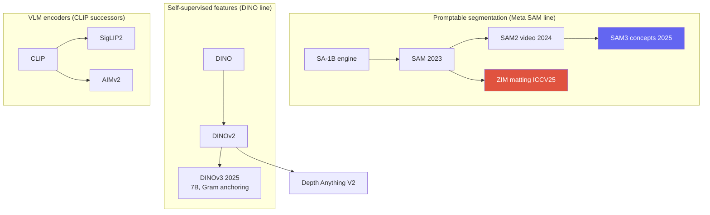
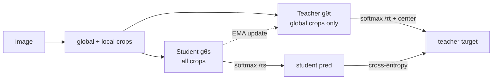

# Vision Foundation Models

SAM / SAM2 / SAM3DINOv3SigLIP2 / AIMv2Depth Anythingpromptablefrozen backbone

> [!TIP] 이 챕터가 중요한 이유
> 여기는 **ZIM**(matting으로 특화된 SAM)의 부모 세대이자, ECLIPSE/prompt-tuning 뒤에 있는 frozen-backbone 이야기입니다. 2026년 방향을 선명하게 정리하세요: **promptable, open-vocabulary, frozen self-supervised backbone**, 그리고 기본 인터페이스로서의 text/exemplar prompting. 면접관은 zero-shot 능력을 망가뜨리지 않으면서 foundation model을 어떻게 *특화하고 제품화*하는지 묻습니다.

## The 2026 direction in one line

> 하나의 promptable, open-vocabulary 모델 — frozen self-supervised backbone이 가벼운 task-specific head에 feature를 공급하는 구조 — 가 dataset별 specialist 학습을 대체합니다.

## 1 · SAM: promptable segmentation

**SAM** (Meta, ICCV 2023) = 무거운 **image encoder** (ViT, 한 번 실행) + 가벼운 **prompt encoder** (point/box/mask) + class-agnostic mask를 만드는 **two-way transformer decoder**. model-in-the-loop **data engine**을 통해 **SA-1B** (11M 이미지, ~1B mask)로 학습했습니다.

<figure>
<svg viewBox="0 0 640 170" xmlns="http://www.w3.org/2000/svg" font-family="Inter, sans-serif" font-size="11">
  <rect x="20" y="60" width="120" height="46" rx="8" fill="#6366f1"/><text x="80" y="80" text-anchor="middle" fill="#fff">Image encoder</text><text x="80" y="96" text-anchor="middle" fill="#dfe3ff">ViT (run once)</text>
  <rect x="20" y="118" width="120" height="34" rx="8" fill="none" stroke="#0ea5e9" stroke-width="2"/><text x="80" y="139" text-anchor="middle" fill="#0ea5e9">Prompt encoder</text>
  <text x="80" y="30" text-anchor="middle" fill="#6b7686">point / box / mask / (text→SAM3)</text>
  <path d="M80 40 V56" stroke="#98a3b2" marker-end="url(#s)"/>
  <path d="M140 83 H210" stroke="#98a3b2" stroke-width="1.5" marker-end="url(#s)"/>
  <path d="M140 135 C 180 135, 190 100, 210 92" stroke="#98a3b2" stroke-width="1.5" marker-end="url(#s)"/>
  <rect x="210" y="66" width="150" height="46" rx="8" fill="none" stroke="#e0533f" stroke-width="2"/><text x="285" y="86" text-anchor="middle" fill="#e0533f">Two-way decoder</text><text x="285" y="102" text-anchor="middle" fill="#6b7686">(light, iterate cheaply)</text>
  <path d="M360 89 H430" stroke="#98a3b2" stroke-width="1.5" marker-end="url(#s)"/>
  <rect x="430" y="66" width="180" height="46" rx="8" fill="#12a150"/><text x="520" y="86" text-anchor="middle" fill="#fff">Masks (multi-output)</text><text x="520" y="102" text-anchor="middle" fill="#dcffe8">embedding · pixel-embed</text>
  <defs><marker id="s" markerWidth="8" markerHeight="8" refX="6" refY="3" orient="auto"><path d="M0 0 L6 3 L0 6" fill="#98a3b2"/></marker></defs>
</svg>
<figcaption>무거운 image feature는 한 번만 encode하고; 가벼운 prompt encoder + decoder가 상호작용마다 실행됩니다. ZIM은 이 골격을 유지하되 hierarchical pixel decoder와 soft-α 출력으로 교체합니다.</figcaption>
</figure>

<dl class="kv">
<dt>Promptable interface</dt><dd><i>what</i>이 아니라 <i>where</i>에 집중; multi-mask 출력으로 모호성(shirt vs person)을 해소합니다.</dd>
<dt>Interactive by design</dt><dd>이미지를 한 번 encode하고; 저렴한 prompt를 반복 → real-time UX.</dd>
<dt>Automatic mask generation</dt><dd>point prompt grid + NMS → 모든 것을 segment.</dd>
<dt>Known limits</dt><dd>Stride-4 얕은 pixel decoder → checkerboard, 거친 미세 구조; 다소 hard한 mask; text/concept 이해 없음 (SAM1).</dd>
</dl>

> [!NOTE] Candidate link
> SAM의 거친 경계야말로 **ZIM**이 matting 수준의 $\alpha$에 도달하기 위해 고친 부분입니다 — 동일한 promptable interface, hierarchical decoder, soft 출력, 그리고 data-granularity 수정. [Image Matting](#/cv/matting)과 [ZIM deep-dive](#/resume/zim)를 참고하세요.

## 2 · SAM 2 → SAM 3

- **SAM 2** (2024): **streaming memory bank**가 video frame 전반에 걸쳐 객체 정체성을 전파해 거의 real-time 상호작용 video segmentation을 가능하게 합니다; **SA-V** dataset. Hiera backbone.
- **SAM 3** (Meta, Nov 2025; ICLR 2026): **Promptable Concept Segmentation (PCS)** — 짧은 **noun phrase**나 **exemplar**가 open-vocabulary *detect + segment + track*을 구동합니다. image detector와 memory 기반 video tracker가 하나의 backbone을 공유하고, 여기에 recognition("이 concept이 여기 있는가?")을 localization("어디에?")과 **분리하는 presence head**가 더해집니다. 대규모 **SA-Co** concept dataset으로 학습했습니다.

> [!QUESTION] "How does SAM 3's PCS differ architecturally from SAM 2, and why decouple recognition from localization?"
> **Short:** SAM 2는 *prompt된 region*을 track하고; SAM 3는 text/exemplar로부터 *한 concept의 모든 instance*를 찾은 뒤 track합니다. **Deep:** open-vocab detection은 두 가지 어려운 문제 — *concept이 존재하는가*와 *정확히 어디인가* — 를 결합하는데, 이를 함께 최적화하면 recognition 오류가 localization을 오염시킵니다. **presence head**가 concept 존재 여부를 별도로 예측하므로 mask decoder는 localization에 특화됩니다; 이는 open-vocab precision/recall을 깔끔하게 개선합니다. grounding과 promptable segmentation이 하나의 모델로 수렴한 것입니다.

## 3 · DINO family: self-supervised dense features

**DINO → DINOv2 → DINOv3.** 레이블 **no**로 하는 self-**di**stillation: student가 augment된 view 전반에서 momentum-teacher의 출력을 맞추고; emergent attention map이 객체를 공짜로 localize합니다.

### How DINO trains (self-distillation, no labels, no negatives)

**같은 architecture**를 가진 두 네트워크: gradient descent로 갱신되는 **student** $g_{\theta_s}$, 그리고 student의 **EMA**로서 절대 back-propagation되지 않는 **teacher** $g_{\theta_t}$. **Multi-crop** augmentation은 한 이미지에서 여러 개의 **global** crop(큰 것)과 여러 개의 **local** crop(작은 것)을 만듭니다. student는 *모든* crop을 보고; teacher는 global crop만 봅니다. student는 자신의 출력 분포가 **teacher의 것과 일치하도록** 학습됩니다 — "다른 view로부터 이 이미지에 대한 teacher의 view를 예측하라":

$$
\min_{\theta_s}\ \sum_{\text{views}} H\big(\,p_t(x_{\text{global}}),\ p_s(x_{\text{view}})\,\big),\qquad p(\cdot)=\mathrm{softmax}\!\big(g(\cdot)/\tau\big)
$$

($H$ = cross-entropy; teacher temperature $\tau_t$가 작으면 = sharp, student는 $\tau_s$). 결정적으로 여기엔 **negative pair가 없습니다** — 그렇다면 무엇이 상수로의 collapse를 막을까요? teacher에 작용하는 두 가지 대립하는 힘:

- **Centering** — teacher의 logit에서 EMA mean을 빼서, 어떤 단일 출력 차원도 지배하지 못하게 합니다 (one-hot collapse 방지).
- **Sharpening** — 작은 teacher temperature가 target을 뾰족하게 유지합니다 (uniform collapse 방지).

이 둘의 균형이 자명한 해들을 배제합니다. teacher는 $\theta_t\leftarrow\lambda\theta_t+(1-\lambda)\theta_s$ (stop-gradient)로 student를 추종하고, segmentation 레이블이 하나도 없이 객체를 분할하는 self-attention이 **emerge**합니다.

- **DINOv2** (2023): 여기에 **iBOT 스타일의 patch-level masked prediction**(global objective 위에 얹은 dense/local objective) + KoLeo feature-spreading + 대대적인 data curation을 더해 scaling → 범용 *frozen* feature (depth, matting 인접, robotics의 표준 backbone).
- **DINOv3** (Meta, Aug 2025): 플래그십 **7B params, ~1.7B 이미지, 완전 self-supervised**; 더 작은 ViT/ConvNeXt variant로 distill됩니다. 핵심 기법은 **Gram anchoring**입니다.

> [!QUESTION] "DINOv3 is fully self-supervised yet beats supervised models on *frozen* dense prediction. What is Gram anchoring solving?"
> **Short:** 긴 SSL 학습은 global feature가 개선되는 와중에도 *dense*(patch-level) feature를 저하시킵니다; Gram anchoring이 이를 안정화합니다. **Deep:** 학습이 길어질수록 patch feature가 drift하고 공간적 일관성을 잃습니다 (image-level에는 좋고, segmentation/depth에는 나쁨). Gram anchoring은 **patch feature의 Gram matrix**를 더 이르고 깨끗한 reference 쪽으로 regularize하여 patch 간 구조를 보존합니다. 결과: fine-tuning 없이도 dense feature가 전용 dense-task 솔루션을 능가하는 최초의 *frozen* SSL backbone — prompt/adapter 특화(ECLIPSE 스타일)를 위한 이상적인 frozen trunk입니다.

## 4 · CLIP → SigLIP 2 / AIMv2

Vision-language encoder는 contrastive CLIP을 넘어 (detection, grounding, VLM이 필요로 하는) 더 나은 **dense / localization** feature 쪽으로 이동했습니다:

| Encoder | Objective | Buys you |
| --- | --- | --- |
| CLIP | softmax contrastive (needs large negatives) | strong global image-text alignment |
| **SigLIP 2** | **sigmoid** loss + self-distillation + masked prediction + online curation | better localization/dense features; multilingual; native-aspect variants |
| **AIMv2** | **autoregressive** multimodal pretraining | strong frozen-trunk features (native resolution) |

Sigmoid loss는 쌍을 분리하고 (거대한 negative batch 불필요), self-distillation과 masked prediction이 dense 구조를 주입하며, AR pretraining (AIMv2)은 generative 수준의 feature를 학습합니다. Multi-encoder fusion이 흔합니다 (OpenVLA는 **DINOv2 + SigLIP**을 융합). VLM 쪽 세부는 [VLM Pretraining](#/vlm/pretraining)에.

## 5 · Open-vocabulary detection & Depth Anything

- **Open-vocab detection:** Grounding DINO (1.5/1.6, DINO-X), OWL-ViT/OWLv2, **YOLO-World** (real-time), APE (detect+segment+ground를 sentence-object matching으로 통합). 전체 내용은 [Object Detection](#/cv/detection)에; language 쪽은 [Grounding & Region Reasoning](#/vlm/grounding)으로 연결됩니다.
- **Depth Anything V2** (NeurIPS 2024): **DPT head + DINOv2 backbone**; 핵심 발견이 **synthetic-GT depth가 noisy한 real pseudo-label을 능가한다**는 teacher-student pipeline. Metric variant; Prompt Depth Anything (LiDAR-prompted, 4K metric); Video Depth Anything.

> [!QUESTION] "Depth Anything V2 found synthetic GT beats real pseudo-labels — walk the pipeline."
> **정밀한 synthetic** depth로 teacher를 학습 → teacher로 방대한 **real unlabeled** 이미지 풀에 레이블 → 그 pseudo-label로 student 학습. Synthetic GT는 dense하고 정확하므로 (센서 noise/구멍 없음) teacher가 깨끗한 구조를 배우고; real 이미지가 다양성/커버리지를 공급합니다. Trade-off: synthetic-only teacher는 domain gap 위험이 있는데, 대규모 real pseudo-labeled set이 이를 메웁니다. 같은 **synthetic + distillation** recipe가 이제 dense-prediction foundation model 전반으로 퍼지고 있습니다.

## 6 · The productization playbook (candidate's specialty)

> [!EXAMPLE] Zero-shot을 깨지 않고 특화하기
> ZIM/ECLIPSE 전반에서 반복되는 교훈: 좁은 dataset에 대한 순진한 fine-tuning은 foundation model의 일반성을 **파괴합니다** (ZIM: Matte-Anything 스타일 FT는 micro zero-shot을 무너뜨림). 해법: **(1) data granularity를 target에 맞추기** (ZIM의 SA1B-Matte), **(2) backbone을 freeze하고 prompt/adapter/LoRA로 적응** (ECLIPSE), **(3) 손으로 레이블링하는 대신 data engine 구축**. 모델 크기만이 아니라 data 품질/granularity가 지렛대입니다.

<dl class="kv">
<dt>Latency tiers</dt><dd>Server ViT foundation (수백 ms) vs 전용 on-device specialist (~10ms mobile CPU). 역할 분리 — foundation model을 on-device에 배포하지 마세요. <a href="#/resume/on-device-segmentation">On-Device Seg</a> 참고.</dd>
<dt>Data engine</dt><dd>Model-in-the-loop annotation (SAM), label 변환 (ZIM), self-refinement (BESTIE), pseudo-label filtering (PointWSSIS) — CV 작업들의 공통 DNA.</dd>
<dt>Failure monitoring</dt><dd>모호한 prompt, domain shift, agent tool로 쓰일 때의 silent perception 오류.</dd>
</dl>

> [!NOTE] DINOv3's reach beyond 2D
> 단일 frozen DINOv3 trunk가 depth, segmentation, robotics/manipulation, 심지어 geospatial/satellite task 전반에 적용되었습니다 — "universal feature extractor" 명제. 지원자 입장에서 이는, task마다 specialist를 학습하는 대신 하나의 강력한 backbone에 투자하면 제품 표면 전체에 걸쳐 비용이 분산된다는 논거입니다.

### Timeline to memorize

| Year | Segmentation line | Feature / encoder line |
| --- | --- | --- |
| 2023 | SAM (SA-1B, promptable) | DINOv2; CLIP-era encoders |
| 2024 | SAM 2 (video memory); HQ-SAM, Grounded-SAM, SEEM | Depth Anything V2 |
| 2025 | **SAM 3** (concept seg, SA-Co); **ZIM** (matting) | **DINOv3** (Gram anchoring); **SigLIP 2**, **AIMv2** |
| 2026 | SAM 3.1 (multi-object tracking speedups) | frozen-backbone + prompt/adapter specialization |

## 7 · Foundation models as agent tools

VisProg / ViperGPT / VADAR는 SAM, detector, depth 모델을 **tool**로 호출합니다; mask/box 품질이 reasoning chain을 좌우하고, **silent perception failure** (LLM이 계속 추론에 쓰는 잘못된 mask)는 별개의, 탐지하기 어려운 오류 유형입니다 — 지원자의 NeurIPS-2026-심사중 diagnostic-framework 방향과 직접 관련됩니다. [Visual Reasoning Agents](#/vlm/visual-agents)와 [Grounding](#/vlm/grounding) 참고.

## 8 · Q&A

Why is a frozen self-supervised backbone the 2026 default?

**Short:** 하나의 강력한 trunk + 저렴한 head가 per-task pretraining 없이 depth/matting/detection/robotics 전반에 일반화되고, freeze는 최소한의 forgetting으로 prompt/adapter 특화를 가능하게 합니다.

**Deep:** DINOv3급 feature는 *frozen* 상태로도 dense task에서 specialist를 능가할 만큼 좋아서, 한계 task 비용이 작은 head 하나나 prompt set으로 떨어집니다. 그래서 prompt-tuning (ECLIPSE)과 matting head (ZIM)가 frozen foundation 위에 자연스럽게 얹히고, 분야가 "freeze + adapt"로 수렴합니다.

Contrastive (CLIP) vs sigmoid (SigLIP 2) vs autoregressive (AIMv2) — when does each matter?

**Short:** contrastive는 global alignment를 주고; sigmoid는 거대 negative-batch 의존성을 없애고 dense 구조를 더하며; AR은 generative 수준의 frozen feature를 줍니다.

**Deep:** softmax-contrastive는 negative를 위해 거대한 batch가 필요하고 거친 공간 feature를 냅니다; SigLIP 2의 sigmoid loss + self-distillation + masked prediction은 더 나은 localization (grounding/detection)을 만들고; AIMv2의 AR objective는 강력한 native-resolution trunk를 냅니다. dense/grounding task에는 SigLIP2/AIMv2를 선호하거나 DINOv2와 융합하세요.

What breaks when you fine-tune a foundation model on your product data?

**Short:** distribution/granularity 불일치로 인한 zero-shot 붕괴.

**Deep:** ZIM의 전체 동기: SAM을 작고 macro 위주의 공개 matting set에 fine-tuning하면 micro-level promptability를 잊습니다. 해법은 parameter를 더 늘리는 게 아니라 — training-data granularity를 target에 맞추거나 freeze + adapt하는 것입니다. 이를 matting 특유의 문제가 아니라 일반적인 foundation-model 위험으로 말하세요.

### Follow-ups
- *"SAM 3 vs Grounded-SAM?"* Grounded-SAM = 두 모델 (Grounding DINO → SAM), 오류가 전파됩니다; SAM 3는 concept detection + segmentation + tracking을 presence head를 가진 하나의 모델로 접습니다.
- *"Evaluate a foundation model how?"* Zero-shot transfer suite, promptability robustness (point 수, noisy box), boundary metric, video J&F, concept benchmark (SA-Co) — 단일 COCO AP가 아닙니다.
- *"No DINOv4 / SAM 4?"* 2026년 중반 기준 맞습니다 — 인용하지 마세요; 현재 플래그십은 DINOv3와 SAM 3입니다.

## Cheat-sheet

| Model | Core idea |
| --- | --- |
| SAM | promptable zero-shot class-agnostic seg; SA-1B data engine |
| SAM 2 | streaming memory → video segmentation |
| SAM 3 | promptable **concept** seg (text/exemplar) + presence head |
| DINOv2/v3 | self-supervised frozen features; v3 = Gram anchoring, dense-safe |
| SigLIP 2 | sigmoid loss + self-distill → dense/localization features |
| AIMv2 | autoregressive vision-encoder pretraining |
| Depth Anything V2 | DPT + DINOv2; synthetic GT > noisy real pseudo-labels |
| ZIM | SAM specialized into zero-shot matting (candidate) |
| 2026 direction | promptable + open-vocab + frozen SSL backbone |

**Related:** [Segmentation](#/cv/segmentation) · [Object Detection](#/cv/detection) · [Image Matting](#/cv/matting) · [Continual Learning](#/cv/continual-learning) · [The 2026 Landscape](#/start/landscape-2026) · [VLM Grounding](#/vlm/grounding) · [ZIM deep-dive](#/resume/zim) · [ECLIPSE deep-dive](#/resume/eclipse)
