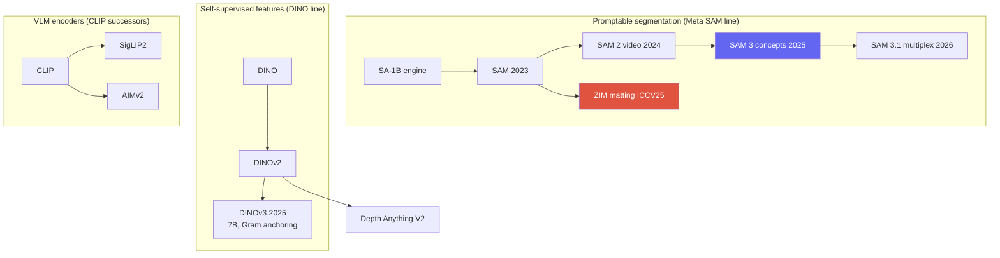
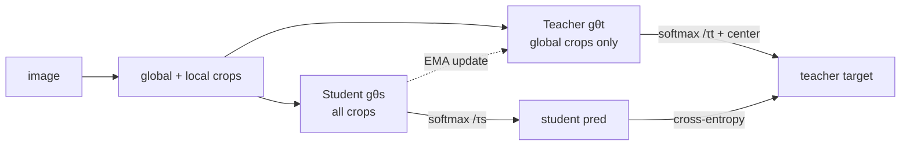

# Vision Foundation Models

<div class="tag-row"><span class="tag">SAM / SAM 2 / SAM 3.1</span><span class="tag">DINOv3</span><span class="tag">SigLIP2 / AIMv2</span><span class="tag">Depth Anything</span><span class="tag">promptable</span><span class="tag">frozen backbone</span></div>

> [!NOTE] Goal of this chapter
> This chapter explains what a **foundation model** is and why it became central to vision by 2026. Earlier chapters—[Transfer Learning](#/cv/backbones-transfer) and [Self-Supervised Learning](#/cv/self-supervised)—introduced the idea of reusing a well-trained backbone. Foundation models push that idea to its limit.

## What is a foundation model?

**One-line definition:** a base model pretrained at scale on broad data with a relatively general objective, then adapted to several downstream tasks. "Foundation model" is an umbrella term for scale and breadth of reuse, not a precise architecture name requiring every property below.

- **Frozen backbone** or **fine-tuning/adapter:** choose the adaptation method based on budget and domain shift.
- **Lightweight head or prompt:** a common way to lower reuse cost, but not a requirement.
- **Promptable:** an interface offered by some models that accepts conditions such as a point, box, or text.
- **Open vocabulary:** supports a wider text label space than a fixed class head, but not every foundation model offers it.
- **Zero-shot:** an evaluation protocol with no additional training on the target task or data. Being a foundation model does not automatically guarantee strong zero-shot performance.

<figure>
<svg viewBox="0 0 640 220" xmlns="http://www.w3.org/2000/svg" font-family="Inter, sans-serif" font-size="12">
  <text x="120" y="26" text-anchor="middle" fill="#98a3b2">train once on broad data</text>
  <rect x="40" y="70" width="160" height="80" rx="12" fill="#6366f1"/>
  <text x="120" y="105" text-anchor="middle" fill="#fff" font-weight="700">Frozen backbone</text>
  <text x="120" y="126" text-anchor="middle" fill="#dfe3ff" font-size="11">frozen backbone ❄</text>
  <!-- fan-out to many heads -->
  <g stroke="#98a3b2" stroke-width="1.5" fill="none">
    <path d="M200 90 C 280 90, 300 45, 380 45" marker-end="url(#fh)"/>
    <path d="M200 105 C 280 105, 300 95, 380 95" marker-end="url(#fh)"/>
    <path d="M200 120 C 280 120, 300 145, 380 145" marker-end="url(#fh)"/>
    <path d="M200 135 C 280 135, 300 195, 380 195" marker-end="url(#fh)"/>
  </g>
  <g font-size="12">
    <rect x="380" y="30" width="220" height="30" rx="6" fill="none" stroke="#e0533f" stroke-width="1.6"/><text x="490" y="50" text-anchor="middle" fill="#e0533f">+ head → classification</text>
    <rect x="380" y="80" width="220" height="30" rx="6" fill="none" stroke="#0ea5e9" stroke-width="1.6"/><text x="490" y="100" text-anchor="middle" fill="#0ea5e9">+ head → detection/segmentation</text>
    <rect x="380" y="130" width="220" height="30" rx="6" fill="none" stroke="#12a150" stroke-width="1.6"/><text x="490" y="150" text-anchor="middle" fill="#12a150">+ head → depth</text>
    <rect x="380" y="180" width="220" height="30" rx="6" fill="none" stroke="#d97706" stroke-width="1.6"/><text x="490" y="200" text-anchor="middle" fill="#d97706">+ prompt → matting · robotics</text>
  </g>
  <defs><marker id="fh" markerWidth="8" markerHeight="8" refX="6" refY="3" orient="auto"><path d="M0 0 L6 3 L0 6" fill="#98a3b2"/></marker></defs>
</svg>
<figcaption>A representative layout in which several heads reuse the features of one frozen backbone. This is one foundation-model adaptation method; full fine-tuning, partial unfreezing, LoRA, and distillation are also selected according to cost and performance.</figcaption>
</figure>

> [!TIP] Interview one-liner
> Important design axes today are **promptable and open-vocabulary interfaces**, **strong self-supervised or multimodal backbones**, and the choice among **freezing, adapters, and fine-tuning**. Do not present them as one mandatory recipe. Frame the answer as trade-offs among zero-shot retention, domain adaptation, latency, and data governance.

## The big picture: three lineages

> The map below compares three distinct model families. Promptable segmentation, self-supervised features, and vision-language encoders can intersect, but they are not the same concept and do not always replace specialists.



## 1 · SAM: promptable segmentation

**SAM** (Meta, ICCV 2023) consists of a heavy **image encoder**—a ViT run once—a lightweight **prompt encoder** for points, boxes, or masks, and a **two-way Transformer decoder** that produces class-agnostic masks. It was trained on **SA-1B**, containing 11 million images and roughly 1 billion masks, through a model-in-the-loop **data engine**.

> **PyTorch-style pseudocode—what interactive inference reuses**

```python
sam.eval()
with torch.inference_mode():
    image_in, meta = preprocess(image)               # preserve resize/pad metadata
    image_embed = sam.image_encoder(image_in)        # once per image

    for prompt in user_interactions:
        prompt = map_to_encoder_coords(prompt, meta) # original -> encoder coordinates
        sparse, dense = sam.prompt_encoder(prompt)
        low_res_masks, quality = sam.mask_decoder(
            image_embed, sparse, dense)              # repeat cheaply per prompt
        masks = postprocess(low_res_masks, meta)      # unpad + restore original size
```

<figure>
<svg viewBox="0 0 640 170" xmlns="http://www.w3.org/2000/svg" font-family="Inter, sans-serif" font-size="11">
  <rect x="20" y="60" width="120" height="46" rx="8" fill="#6366f1"/><text x="80" y="80" text-anchor="middle" fill="#fff">Image encoder</text><text x="80" y="96" text-anchor="middle" fill="#dfe3ff">ViT (run once)</text>
  <rect x="20" y="118" width="120" height="34" rx="8" fill="none" stroke="#0ea5e9" stroke-width="2"/><text x="80" y="139" text-anchor="middle" fill="#0ea5e9">Prompt encoder</text>
  <text x="80" y="30" text-anchor="middle" fill="#6b7686">point / box / mask / (text→SAM3)</text>
  <path d="M80 40 V56" stroke="#98a3b2" marker-end="url(#s)"/>
  <path d="M140 83 H210" stroke="#98a3b2" stroke-width="1.5" marker-end="url(#s)"/>
  <path d="M140 135 C 180 135, 190 100, 210 92" stroke="#98a3b2" stroke-width="1.5" marker-end="url(#s)"/>
  <rect x="210" y="66" width="150" height="46" rx="8" fill="none" stroke="#e0533f" stroke-width="2"/><text x="285" y="86" text-anchor="middle" fill="#e0533f">Two-way decoder</text><text x="285" y="102" text-anchor="middle" fill="#6b7686">(light, iterate cheaply)</text>
  <path d="M360 89 H430" stroke="#98a3b2" stroke-width="1.5" marker-end="url(#s)"/>
  <rect x="430" y="66" width="180" height="46" rx="8" fill="#12a150"/><text x="520" y="86" text-anchor="middle" fill="#fff">Masks (multi-output)</text><text x="520" y="102" text-anchor="middle" fill="#dcffe8">embedding · pixel-embed</text>
  <defs><marker id="s" markerWidth="8" markerHeight="8" refX="6" refY="3" orient="auto"><path d="M0 0 L6 3 L0 6" fill="#98a3b2"/></marker></defs>
</svg>
<figcaption>The heavy image features are encoded once; the lightweight prompt encoder and decoder run on every interaction. ZIM preserves this skeleton but replaces the decoder with a hierarchical pixel decoder and produces soft alpha output.</figcaption>
</figure>

<dl class="kv">
<dt>Promptable interface</dt><dd>Focuses on <i>where</i>, not <i>what</i>; multi-mask output resolves ambiguity such as shirt versus person.</dd>
<dt>Interactive by design</dt><dd>Encode the image once and repeat inexpensive prompts for a real-time user experience.</dd>
<dt>Automatic mask generation</dt><dd>A grid of point prompts plus NMS segments everything.</dd>
<dt>Known limits</dt><dd>A shallow stride-4 pixel decoder can produce checkerboard artifacts and coarse fine structure; masks are relatively hard; SAM 1 has no text or concept understanding.</dd>
</dl>

> [!NOTE] Related research
> SAM's coarse boundaries are exactly what **ZIM** changes to reach matting-quality $\alpha$: the same promptable interface, a hierarchical decoder, soft outputs, and adjusted data granularity. See [Image Matting](#/cv/matting) and the [ZIM deep dive](#/resume/zim).

## 2 · SAM 2 → SAM 3 → SAM 3.1

- **SAM 2** (2024): a **streaming memory bank** propagates object identity across video frames, enabling near-real-time interactive video segmentation; trained with the **SA-V** dataset and a Hiera backbone.
- **[SAM 3](https://ai.meta.com/research/publications/sam-3-segment-anything-with-concepts/)** (Meta, 2025-11-19): **Promptable Concept Segmentation (PCS)** conditions detect + segment + track on a short noun phrase or exemplar. An image detector and memory-based video tracker share a backbone, with a presence head separating recognition from localization. The official release also introduced the SA-Co benchmark and data engine.
- **[SAM 3.1](https://github.com/facebookresearch/sam3/blob/main/RELEASE_SAM3p1.md)** (2026-03-27): primarily an execution update for multi-object video tracking through **Object Multiplex**, plus checkpoint and inference optimizations, rather than a new generation of semantic capability. Because the official table shows mixed changes across benchmarks, compare throughput and memory at large object counts together with task scores instead of claiming that it is "always more accurate."

> [!QUESTION] "How does SAM 3's PCS differ architecturally from SAM 2, and why separate recognition from localization?"
> **Short:** SAM 2 tracks a *prompted region*; SAM 3 finds every instance of a *concept* from text or an exemplar, then tracks them. **Deep:** open-vocabulary detection combines two difficult problems—*is the concept present?* and *exactly where is it?* Optimizing them together can let recognition errors contaminate localization. A **presence head** predicts concept presence separately, letting the mask decoder specialize in localization and improving open-vocabulary precision and recall more cleanly. Grounding and promptable segmentation converge in one model.

## 3 · DINO family: self-supervised dense features

**DINO → DINOv2 → DINOv3.** Self-**di**stillation without human labels trains a student to match a momentum teacher across augmented views. Object structure then appears in attention and patch features, providing localization cues without additional manual annotation. This does not mean a complete detector appears automatically.

### How DINO trains: self-distillation, no labels, no negatives

Two networks share the **same architecture**: student $g_{\theta_s}$ is updated by gradient descent, while teacher $g_{\theta_t}$ is an EMA of the student and never receives backpropagation. **Multi-crop** augmentation produces several large **global** crops and smaller **local** crops from one image. The student sees *every* crop; the teacher sees only global crops. The student learns to make its output distribution match the teacher's—"predict the teacher's view of this image from another view."

Let $\mathcal G$ be the set of two global crops and $\mathcal V$ every crop seen by the student. The core loss can be written as follows, excluding a crop paired with itself so that different views are aligned:

$$
\min_{\theta_s}\ \sum_{u\in\mathcal G}\sum_{\substack{v\in\mathcal V\\v\ne u}}
H\!\left(p_t(u),p_s(v)\right),\qquad
p_s(v)=\operatorname{softmax}\!\left(g_{\theta_s}(v)/\tau_s\right),\quad
p_t(u)=\operatorname{softmax}\!\left((g_{\theta_t}(u)-c)/\tau_t\right)
$$

Here $H$ is cross-entropy; the teacher temperature $\tau_t$ is lower and therefore sharper than the student's $\tau_s$. Crucially, there are **no negative pairs**. What prevents collapse to a constant?

- **Centering:** subtract an EMA mean from teacher logits so no single output dimension dominates, preventing one-hot collapse.
- **Sharpening:** a low teacher temperature keeps targets peaked, preventing uniform collapse.

Centering and sharpening are practical mechanisms that counter different collapse tendencies; do not claim that they mathematically guarantee non-collapse in every setting. The teacher follows the student through $\theta_t\leftarrow\lambda\theta_t+(1-\lambda)\theta_s$, and gradients never flow into the teacher. Self-attention from some heads has been observed to align with foreground objects, but an attention map is not itself a supervised segmentation mask.

<details class="concept-code"><summary>View as concept code</summary>

> **PyTorch-style pseudocode—the order of stop-gradient and EMA in DINO**

```python
student.train(); teacher.eval()
global_views, local_views = multi_crop(images)

with torch.no_grad():                              # detach teacher targets
    t_logits = [teacher(v) for v in global_views]
    t_prob = [softmax((z - center) / tau_t) for z in t_logits]

s_logits = [student(v) for v in global_views + local_views]
loss = cross_view_ce(s_logits, t_prob, exclude_same_view=True)
optimizer.zero_grad(set_to_none=True)
loss.backward(); optimizer.step()                  # gradient update only for student

with torch.no_grad():
    for pt, ps in zip(teacher.parameters(), student.parameters()):
        pt.mul_(momentum).add_(ps, alpha=1 - momentum)
    center = ema(center, batch_mean(t_logits))      # use global mean when distributed
```

</details>



- **DINOv2** (2023): adds **iBOT-style patch-level masked prediction**, a dense/local objective layered on the global objective, plus KoLeo feature spreading and extensive data curation. The resulting general-purpose *frozen* features are widely reused in depth, segmentation, and robotics.
- **[DINOv3](https://ai.meta.com/research/publications/dinov3/)** (Meta, 2025-08-14): according to the public report, self-supervised pretraining scales up to **7B parameters and roughly 1.7B images**, then distills smaller ViT and ConvNeXt variants. The key technique is **Gram anchoring**.

> [!QUESTION] "DINOv3 is fully self-supervised yet beats supervised models on *frozen* dense prediction. What does Gram anchoring solve?"
> **Short:** Gram anchoring mitigates the degradation in patch-level consistency seen with long schedules and large models during DINOv3 training. **Deep:** Let $X_S$ be the L2-normalized student patch matrix and $X_G$ the patch matrix from an earlier or high-resolution Gram teacher with good dense properties. The objective $\|X_SX_S^\top-X_GX_G^\top\|_F^2$ aligns pairwise patch-similarity structure. It anchors relationships rather than copying feature coordinates. Frozen-backbone superiority is a result under the paper's stated benchmarks and head protocols; do not generalize it into universal superiority over every domain specialist.

## 4 · CLIP → SigLIP 2 / AIMv2

Vision-language encoders have moved beyond contrastive CLIP toward better **dense and localization features** needed for detection, grounding, and VLMs:

| Encoder | Objective | What it provides |
| --- | --- | --- |
| CLIP | batch-wise softmax contrastive | strong global image–text alignment; sensitive to batch-negative composition |
| **SigLIP 2** | **sigmoid** loss + self-distillation + masked prediction + online curation | improved localization/dense features; multilingual; native-aspect variants |
| **AIMv2** | **autoregressive** multimodal pretraining | strong frozen-trunk features at native resolution |

Sigmoid loss treats each image–text pair as an independent binary term and removes global softmax normalization, but it does not remove negative pairs. SigLIP 2's dense and localization behavior comes from the combination of sigmoid loss, self-distillation, masked prediction, and the data recipe—not sigmoid alone. AIMv2 uses an autoregressive multimodal objective. Do not infer downstream superiority from the objective's name; compare at the same resolution, extraction layer, and fine-tuning protocol. For the VLM side, see [VLM Pretraining](#/vlm/pretraining).

## 5 · Open-vocabulary detection & Depth Anything

- **Open-vocabulary detection:** Grounding DINO 1.5/1.6 and DINO-X, OWL-ViT/OWLv2, **YOLO-World** for real-time use, and APE, which unifies detection, segmentation, and grounding through sentence–object matching. See [Object Detection](#/cv/detection) for the full story and [Grounding & Region Reasoning](#/vlm/grounding) for the language side.
- **Depth Anything V2** (NeurIPS 2024): a **DPT head + DINOv2 backbone** and a teacher–student pipeline built on the finding that **synthetic ground-truth depth beats noisy real pseudo-labels**. It includes a metric variant, Prompt Depth Anything for LiDAR-prompted 4K metric depth, and Video Depth Anything.

> [!QUESTION] "Depth Anything V2 found that synthetic GT beats real pseudo-labels. Walk through the pipeline."
> Train a teacher on **precise synthetic** depth → use the teacher to label a broad pool of **real unlabeled** images → train a student on those pseudo-labels. Synthetic GT is dense and exact, without sensor noise or holes, so the teacher learns clean structure; real images supply diversity and coverage. The trade-off is a domain gap for a synthetic-only teacher, which the large real pseudo-labeled set helps close. The same **synthetic + distillation** recipe now appears across dense-prediction foundation models.

## 6 · Productization playbook

> [!EXAMPLE] Specialize without destroying zero-shot behavior
> Full fine-tuning on a narrow dataset can reduce zero-shot generality in some settings, but not always. Preserve zero-shot and frozen baselines, then ablate **(1) matching data granularity to the target**, **(2) heads, prompts, adapters, LoRA, and partial/full fine-tuning**, and **(3) a data engine with human QA**. Report generality retention and in-domain performance as separate metrics.

<dl class="kv">
<dt>Latency tiers</dt><dd>Compare server foundation models with on-device specialists or compressed models on identical inputs and hardware. The rule is not "never put a foundation model on-device"; the criterion is whether distillation, quantization, and caching still meet latency, memory, and energy SLAs. See <a href="#/resume/on-device-segmentation">On-Device Segmentation</a>.</dd>
<dt>Data engine</dt><dd>Model-in-the-loop annotation in SAM, label conversion in ZIM, self-refinement in BESTIE, and pseudo-label filtering in PointWSSIS are shared patterns across CV projects.</dd>
<dt>Failure monitoring</dt><dd>Ambiguous prompts, domain shift, and silent perception errors when the model becomes an agent tool.</dd>
</dl>

> [!NOTE] DINOv3's reach beyond 2D
> The DINOv3 report evaluates frozen features under several protocols, including depth, segmentation, detection, and geospatial tasks. Sharing backbone computation across several heads on the same input becomes a product hypothesis. It does not mean one trunk is always optimal across different modalities and domains; validate head cost, feature resolution, licensing, and serving topology as well.

### Timeline to remember

| Year | Segmentation line | Feature / encoder line |
| --- | --- | --- |
| 2023 | SAM (SA-1B, promptable) | DINOv2; CLIP-era encoders |
| 2024 | SAM 2 (video memory); HQ-SAM, Grounded-SAM, SEEM | Depth Anything V2 |
| 2025 | **SAM 3** (concept segmentation, SA-Co); **ZIM** (matting) | **DINOv3** (Gram anchoring); **SigLIP 2**, **AIMv2** |
| 2026 | SAM 3.1 (multi-object tracking speedups) | frozen-backbone + prompt/adapter specialization |

## 7 · Foundation models as agent tools

VisProg, ViperGPT, and VADAR call SAM, detectors, and depth models as **tools**. Mask and box quality affects the reasoning chain, and a **silent perception failure**—an incorrect mask that the LLM continues to reason over—is a distinct and difficult-to-detect error mode. This connects directly to the candidate's NeurIPS 2026 under-review diagnostic-framework direction. See [Visual Reasoning Agents](#/vlm/visual-agents) and [Grounding](#/vlm/grounding).

## 8 · Q&A

<details class="qa"><summary>When do you start with a frozen self-supervised backbone, and when do you fine-tune?</summary>
<div class="qa-body">

**Short:** Start frozen when data is limited, you need a fast baseline, or several heads will share features. If the domain gap is large and enough data and budget are available, compare adapters with partial and full fine-tuning.

**Deep:** DINOv3 reported strong results in specific frozen-backbone evaluations, but it does not guarantee superiority in the deployment domain. Freezing preserves pretraining features and zero-shot behavior and reduces training and storage cost, but imposes a ceiling on task-specific plasticity. Increase cost stepwise—linear probe → adapter/LoRA → partial unfreezing → full fine-tuning—on the same validation split, while measuring regressions in the original domain.
</div></details>

<details class="qa"><summary>Contrastive CLIP vs sigmoid SigLIP 2 vs autoregressive AIMv2—when does each matter?</summary>
<div class="qa-body">

**Short:** CLIP uses batch-wise global alignment, the SigLIP family uses pairwise sigmoid alignment, and AIMv2 uses an autoregressive multimodal objective. For dense behavior, examine auxiliary objectives, data, and layer selection as well.

**Deep:** CLIP's in-batch softmax is sensitive to batch composition and negative count, but a large batch is not a logical requirement. SigLIP's pairwise sigmoid removes global normalization, and SigLIP 2 adds self-distillation and masked prediction. AIMv2 pretrains with autoregressive targets. For dense or grounding tasks, do not preselect a winner by name; compare patch-feature resolution, extraction layer, text alignment, and latency on the same benchmark.
</div></details>

<details class="qa"><summary>What can break when you fine-tune a foundation model on product data?</summary>
<div class="qa-body">

**Short:** Zero-shot collapse from a distribution or granularity mismatch.

**Deep:** ZIM's motivating observation is that fine-tuning SAM on small, macro-focused public matting datasets can erase micro-level promptability. The fix is not simply adding parameters: match training-data granularity to the target or freeze and adapt. Present this as a general foundation-model risk, not only a matting issue.
</div></details>

### Follow-ups

- *SAM 3 vs Grounded-SAM?* Grounded-SAM is two models—Grounding DINO followed by SAM—so errors propagate. SAM 3 folds concept detection, segmentation, and tracking into one model with a presence head.
- *How do you evaluate a foundation model?* Use a zero-shot transfer suite, promptability robustness across point counts and noisy boxes, boundary metrics, video J&F, and concept benchmarks such as SA-Co—not one COCO AP.
- *No DINOv4 or SAM 4?* Do not state an unverified version as current fact. Re-check official publication and release repositories immediately before the interview, and treat this chapter's DINOv3 from August 2025 and SAM 3.1 from March 2026 as dated snapshots.

## Cheat sheet

| Model | Core idea |
| --- | --- |
| SAM | promptable zero-shot class-agnostic segmentation; SA-1B data engine |
| SAM 2 | streaming memory → video segmentation |
| SAM 3 | promptable **concept** segmentation from text/exemplars + presence head |
| SAM 3.1 | Object Multiplex execution optimization for multi-object video tracking |
| DINOv2/v3 | self-supervised frozen features; v3 = Gram anchoring for dense features |
| SigLIP 2 | sigmoid loss + self-distillation → dense/localization features |
| AIMv2 | autoregressive vision-encoder pretraining |
| Depth Anything V2 | DPT + DINOv2; synthetic GT > noisy real pseudo-labels |
| ZIM | specialize SAM for zero-shot matting (candidate work) |
| Adaptation principle | compare frozen head, adapter, and full fine-tuning by performance, regression, and cost |

**Related:** [Segmentation](#/cv/segmentation) · [Object Detection](#/cv/detection) · [Image Matting](#/cv/matting) · [Continual Learning](#/cv/continual-learning) · [The 2026 Landscape](#/start/landscape-2026) · [VLM Grounding](#/vlm/grounding) · [ZIM deep dive](#/resume/zim) · [ECLIPSE deep dive](#/resume/eclipse)
