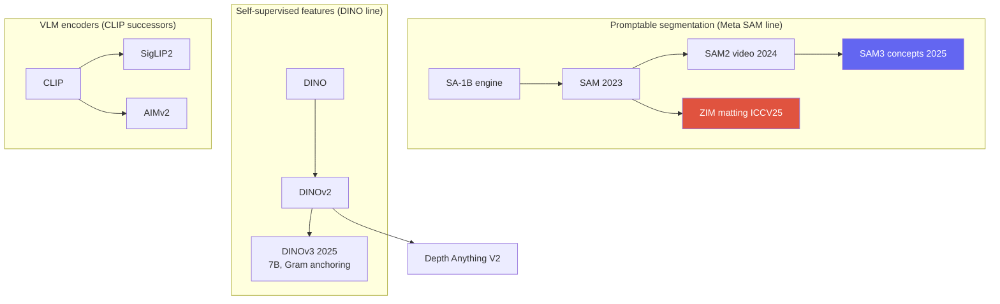
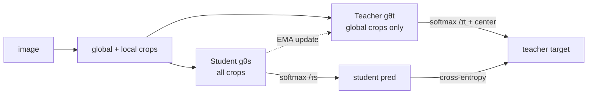

# Vision Foundation Models

SAM / SAM2 / SAM3DINOv3SigLIP2 / AIMv2Depth Anythingpromptablefrozen backbone

> [!TIP] Why this chapter matters
> This is the parent generation of **ZIM** (SAM specialized into matting) and the frozen-backbone story behind ECLIPSE/prompt-tuning. Frame the 2026 direction crisply: **promptable, open-vocabulary, frozen self-supervised backbones**, with text/exemplar prompting as the default interface. Interviewers ask how you *specialize and productize* a foundation model without destroying its zero-shot ability.

## The 2026 direction in one line

> One promptable, open-vocabulary model — a frozen self-supervised backbone feeding lightweight, task-specific heads — replacing per-dataset specialist training.

## 1 · SAM: promptable segmentation

**SAM** (Meta, ICCV 2023) = a heavy **image encoder** (ViT, run once) + a light **prompt encoder** (point/box/mask) + a **two-way transformer decoder** producing class-agnostic masks. Trained on **SA-1B** (11M images, ~1B masks) via a model-in-the-loop **data engine**.

<figure>
<svg viewBox="0 0 640 170" xmlns="http://www.w3.org/2000/svg" font-family="Inter, sans-serif" font-size="11">
  <rect x="20" y="60" width="120" height="46" rx="8" fill="#6366f1"/><text x="80" y="80" text-anchor="middle" fill="#fff">Image encoder</text><text x="80" y="96" text-anchor="middle" fill="#dfe3ff">ViT (run once)</text>
  <rect x="20" y="118" width="120" height="34" rx="8" fill="none" stroke="#0ea5e9" stroke-width="2"/><text x="80" y="139" text-anchor="middle" fill="#0ea5e9">Prompt encoder</text>
  <text x="80" y="30" text-anchor="middle" fill="#6b7686">point / box / mask / (text→SAM3)</text>
  <path d="M80 40 V56" stroke="#98a3b2" marker-end="url(#s)"/>
  <path d="M140 83 H210" stroke="#98a3b2" stroke-width="1.5" marker-end="url(#s)"/>
  <path d="M140 135 C 180 135, 190 100, 210 92" stroke="#98a3b2" stroke-width="1.5" marker-end="url(#s)"/>
  <rect x="210" y="66" width="150" height="46" rx="8" fill="none" stroke="#e0533f" stroke-width="2"/><text x="285" y="86" text-anchor="middle" fill="#e0533f">Two-way decoder</text><text x="285" y="102" text-anchor="middle" fill="#6b7686">(light, iterate cheaply)</text>
  <path d="M360 89 H430" stroke="#98a3b2" stroke-width="1.5" marker-end="url(#s)"/>
  <rect x="430" y="66" width="180" height="46" rx="8" fill="#12a150"/><text x="520" y="86" text-anchor="middle" fill="#fff">Masks (multi-output)</text><text x="520" y="102" text-anchor="middle" fill="#dcffe8">embedding · pixel-embed</text>
  <defs><marker id="s" markerWidth="8" markerHeight="8" refX="6" refY="3" orient="auto"><path d="M0 0 L6 3 L0 6" fill="#98a3b2"/></marker></defs>
</svg>
<figcaption>Encode the heavy image features once; the light prompt encoder + decoder run per interaction. ZIM keeps this skeleton but swaps in a hierarchical pixel decoder and soft-α output.</figcaption>
</figure>

<dl class="kv">
<dt>Promptable interface</dt><dd>Focus on <i>where</i> not <i>what</i>; multi-mask output resolves ambiguity (shirt vs person).</dd>
<dt>Interactive by design</dt><dd>Encode the image once; iterate cheap prompts → real-time UX.</dd>
<dt>Automatic mask generation</dt><dd>Grid of point prompts + NMS → segment everything.</dd>
<dt>Known limits</dt><dd>Stride-4 shallow pixel decoder → checkerboard, coarse fine structure; hard-ish masks; no text/concept understanding (SAM1).</dd>
</dl>

> [!NOTE] Candidate link
> SAM's coarse boundaries are exactly what **ZIM** fixed to reach matting-grade $\alpha$ — same promptable interface, hierarchical decoder, soft output, and a data-granularity fix. See [Image Matting](#/cv/matting) and the [ZIM deep-dive](#/resume/zim).

## 2 · SAM 2 → SAM 3

- **SAM 2** (2024): a **streaming memory bank** propagates object identity across video frames for near-real-time interactive video segmentation; **SA-V** dataset. Hiera backbone.
- **SAM 3** (Meta, Nov 2025; ICLR 2026): **Promptable Concept Segmentation (PCS)** — a short **noun phrase** or **exemplar** drives open-vocabulary *detect + segment + track*. An image detector and a memory-based video tracker share one backbone, plus a **presence head** that **decouples recognition** ("is this concept here?") **from localization** ("where?"). Trained on the large **SA-Co** concept dataset.

> [!QUESTION] "How does SAM 3's PCS differ architecturally from SAM 2, and why decouple recognition from localization?"
> **Short:** SAM 2 tracks a *prompted region*; SAM 3 finds *all instances of a concept* from text/exemplar, then tracks them. **Deep:** open-vocab detection couples two hard problems — *is the concept present* and *where exactly* — and jointly optimizing them lets recognition errors corrupt localization. A **presence head** predicts concept existence separately, so the mask decoder specializes in localization; this cleanly improves open-vocab precision/recall. It's the convergence of grounding and promptable segmentation into one model.

## 3 · DINO family: self-supervised dense features

**DINO → DINOv2 → DINOv3.** Self-**di**stillation with **no** labels: a student matches a momentum-teacher's output across augmented views; emergent attention maps localize objects for free.

### How DINO trains (self-distillation, no labels, no negatives)

Two networks with the **same architecture**: a **student** $g_{\theta_s}$ (updated by gradient descent) and a **teacher** $g_{\theta_t}$ (an **EMA** of the student — never back-propagated). **Multi-crop** augmentation makes several **global** crops (large) and several **local** crops (small) of one image. The student sees *all* crops; the teacher sees only the global ones. The student is trained so its output distribution **matches the teacher's** — "predict the teacher's view of this image from a different view":

$$
\min_{\theta_s}\ \sum_{\text{views}} H\big(\,p_t(x_{\text{global}}),\ p_s(x_{\text{view}})\,\big),\qquad p(\cdot)=\mathrm{softmax}\!\big(g(\cdot)/\tau\big)
$$

($H$ = cross-entropy; teacher temperature $\tau_t$ small = sharp, student $\tau_s$). Crucially it uses **no negative pairs** — so what stops it collapsing to a constant? Two opposing forces on the teacher:

- **Centering** — subtract an EMA mean from the teacher's logits, so no single output dimension can dominate (prevents one-hot collapse).
- **Sharpening** — the small teacher temperature keeps the target peaky (prevents uniform collapse).

Their balance rules out the trivial solutions. The teacher tracks the student as $\theta_t\leftarrow\lambda\theta_t+(1-\lambda)\theta_s$ (stop-gradient), and object-segmenting self-attention **emerges** with zero segmentation labels.

- **DINOv2** (2023): scales this with **iBOT-style patch-level masked prediction** (a dense/local objective on top of the global one) + KoLeo feature-spreading + heavy data curation → general-purpose *frozen* features (the standard backbone for depth, matting-adjacent, robotics).
- **DINOv3** (Meta, Aug 2025): flagship **7B params, ~1.7B images, fully self-supervised**; distilled into smaller ViT/ConvNeXt variants. Its key trick is **Gram anchoring**.

> [!QUESTION] "DINOv3 is fully self-supervised yet beats supervised models on *frozen* dense prediction. What is Gram anchoring solving?"
> **Short:** long SSL training degrades *dense* (patch-level) features even as global features improve; Gram anchoring stabilizes them. **Deep:** as training runs long, patch features drift and lose spatial consistency (good for image-level, bad for segmentation/depth). Gram anchoring regularizes the **Gram matrix of patch features** toward an earlier, cleaner reference, preserving inter-patch structure. Result: the first *frozen* SSL backbone whose dense features beat specialized dense-task solutions without fine-tuning — the ideal frozen trunk for prompt/adapter specialization (ECLIPSE-style).

## 4 · CLIP → SigLIP 2 / AIMv2

Vision-language encoders moved beyond contrastive CLIP toward better **dense / localization** features (what detection, grounding, and VLMs need):

| Encoder | Objective | Buys you |
| --- | --- | --- |
| CLIP | softmax contrastive (needs large negatives) | strong global image-text alignment |
| **SigLIP 2** | **sigmoid** loss + self-distillation + masked prediction + online curation | better localization/dense features; multilingual; native-aspect variants |
| **AIMv2** | **autoregressive** multimodal pretraining | strong frozen-trunk features (native resolution) |

Sigmoid loss decouples pairs (no giant negative batch), self-distillation and masked prediction inject dense structure, and AR pretraining (AIMv2) learns generative-quality features. Multi-encoder fusion is common (OpenVLA fuses **DINOv2 + SigLIP**). VLM-side detail in [VLM Pretraining](#/vlm/pretraining).

## 5 · Open-vocabulary detection & Depth Anything

- **Open-vocab detection:** Grounding DINO (1.5/1.6, DINO-X), OWL-ViT/OWLv2, **YOLO-World** (real-time), APE (unifies detect+segment+ground as sentence-object matching). Full treatment in [Object Detection](#/cv/detection); the language side connects to [Grounding & Region Reasoning](#/vlm/grounding).
- **Depth Anything V2** (NeurIPS 2024): **DPT head + DINOv2 backbone**; a teacher-student pipeline where the key finding is **synthetic-GT depth beats noisy real pseudo-labels**. Metric variants; Prompt Depth Anything (LiDAR-prompted, 4K metric); Video Depth Anything.

> [!QUESTION] "Depth Anything V2 found synthetic GT beats real pseudo-labels — walk the pipeline."
> Train a teacher on **precise synthetic** depth → label a huge pool of **real unlabeled** images with the teacher → train a student on those pseudo-labels. Synthetic GT is dense and exact (no sensor noise/holes), so the teacher learns clean structure; real images supply diversity/coverage. Trade-off: a synthetic-only teacher risks a domain gap, which the large real pseudo-labeled set closes. Same **synthetic + distillation** recipe now spreading across dense-prediction foundation models.

## 6 · The productization playbook (candidate's specialty)

> [!EXAMPLE] Specialize without breaking zero-shot
> The recurring lesson across ZIM/ECLIPSE: naive fine-tuning on a narrow dataset **destroys** the foundation model's generality (ZIM: Matte-Anything-style FT collapses micro zero-shot). Fixes: **(1) match data granularity** to the target (ZIM's SA1B-Matte), **(2) freeze the backbone and adapt via prompts/adapters/LoRA** (ECLIPSE), **(3) build a data engine** rather than hand-label. Data quality/granularity, not just model size, is the lever.

<dl class="kv">
<dt>Latency tiers</dt><dd>Server ViT foundation (100s of ms) vs a dedicated on-device specialist (~10ms mobile CPU). Role separation — don't ship the foundation model on-device. See <a href="#/resume/on-device-segmentation">On-Device Seg</a>.</dd>
<dt>Data engine</dt><dd>Model-in-the-loop annotation (SAM), label conversion (ZIM), self-refinement (BESTIE), pseudo-label filtering (PointWSSIS) — the shared DNA of the CV work.</dd>
<dt>Failure monitoring</dt><dd>Ambiguous prompts, domain shift, silent perception errors when used as an agent tool.</dd>
</dl>

> [!NOTE] DINOv3's reach beyond 2D
> A single frozen DINOv3 trunk has been applied across depth, segmentation, robotics/manipulation, and even geospatial/satellite tasks — the "universal feature extractor" thesis. For a candidate, this is the argument that investing in one strong backbone amortizes across an entire product surface, rather than training a specialist per task.

### Timeline to memorize

| Year | Segmentation line | Feature / encoder line |
| --- | --- | --- |
| 2023 | SAM (SA-1B, promptable) | DINOv2; CLIP-era encoders |
| 2024 | SAM 2 (video memory); HQ-SAM, Grounded-SAM, SEEM | Depth Anything V2 |
| 2025 | **SAM 3** (concept seg, SA-Co); **ZIM** (matting) | **DINOv3** (Gram anchoring); **SigLIP 2**, **AIMv2** |
| 2026 | SAM 3.1 (multi-object tracking speedups) | frozen-backbone + prompt/adapter specialization |

## 7 · Foundation models as agent tools

VisProg / ViperGPT / VADAR call SAM, detectors, and depth models as **tools**; mask/box quality gates the reasoning chain, and a **silent perception failure** (a wrong mask the LLM keeps reasoning over) is a distinct, hard-to-detect error class — directly related to the candidate's NeurIPS-2026-under-review diagnostic-framework direction. See [Visual Reasoning Agents](#/vlm/visual-agents) and [Grounding](#/vlm/grounding).

## 8 · Q&A

Why is a frozen self-supervised backbone the 2026 default?

**Short:** one strong trunk + cheap heads generalizes across depth/matting/detection/robotics without per-task pretraining, and freezing enables prompt/adapter specialization with minimal forgetting.

**Deep:** DINOv3-class features are good enough *frozen* to beat specialists on dense tasks, so the marginal task cost drops to a small head or a prompt set. This is why prompt-tuning (ECLIPSE) and matting heads (ZIM) sit naturally on frozen foundations, and why the field converges on "freeze + adapt."

Contrastive (CLIP) vs sigmoid (SigLIP 2) vs autoregressive (AIMv2) — when does each matter?

**Short:** contrastive gives global alignment; sigmoid removes the giant-negative-batch dependency and adds dense structure; AR gives generative-grade frozen features.

**Deep:** softmax-contrastive needs huge batches for negatives and yields coarse spatial features; SigLIP 2's sigmoid loss + self-distillation + masked prediction produce better localization (grounding/detection); AIMv2's AR objective yields strong native-resolution trunks. For dense/grounding tasks, prefer SigLIP2/AIMv2 or fuse with DINOv2.

What breaks when you fine-tune a foundation model on your product data?

**Short:** zero-shot collapse from distribution/granularity mismatch.

**Deep:** ZIM's whole motivation: fine-tuning SAM on the small, macro-heavy public matting sets makes it forget micro-level promptability. The fix isn't more parameters — it's matching training-data granularity to the target and/or freezing + adapting. State this as a general foundation-model risk, not a matting quirk.

### Follow-ups
- *"SAM 3 vs Grounded-SAM?"* Grounded-SAM = two models (Grounding DINO → SAM), errors propagate; SAM 3 folds concept detection + segmentation + tracking into one model with a presence head.
- *"Evaluate a foundation model how?"* Zero-shot transfer suites, promptability robustness (# points, noisy boxes), boundary metrics, video J&F, concept benchmarks (SA-Co) — not a single COCO AP.
- *"No DINOv4 / SAM 4?"* Correct as of mid-2026 — don't cite them; the current flagships are DINOv3 and SAM 3.

## Cheat-sheet

| Model | Core idea |
| --- | --- |
| SAM | promptable zero-shot class-agnostic seg; SA-1B data engine |
| SAM 2 | streaming memory → video segmentation |
| SAM 3 | promptable **concept** seg (text/exemplar) + presence head |
| DINOv2/v3 | self-supervised frozen features; v3 = Gram anchoring, dense-safe |
| SigLIP 2 | sigmoid loss + self-distill → dense/localization features |
| AIMv2 | autoregressive vision-encoder pretraining |
| Depth Anything V2 | DPT + DINOv2; synthetic GT > noisy real pseudo-labels |
| ZIM | SAM specialized into zero-shot matting (candidate) |
| 2026 direction | promptable + open-vocab + frozen SSL backbone |

**Related:** [Segmentation](#/cv/segmentation) · [Object Detection](#/cv/detection) · [Image Matting](#/cv/matting) · [Continual Learning](#/cv/continual-learning) · [The 2026 Landscape](#/start/landscape-2026) · [VLM Grounding](#/vlm/grounding) · [ZIM deep-dive](#/resume/zim) · [ECLIPSE deep-dive](#/resume/eclipse)
