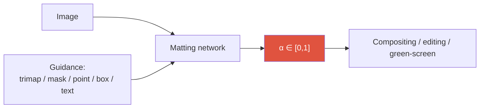
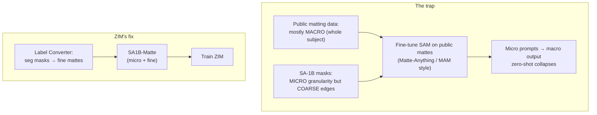

# Image Matting

<div class="tag-row"><span class="tag">alpha matte</span><span class="tag">trimap-free</span><span class="tag">SAM-guided</span><span class="tag">SAD / Grad / Conn</span><span class="tag">ZIM</span><span class="tag">BiRefNet</span></div>

> [!NOTE] 한 줄 직관
> **Matting(매팅)** 은 합성식에서 전경의 기여를 조절하는 0~1 실수 $\alpha$(opacity/coverage)를 추정하는 일입니다. $\alpha$는 “전경일 확률”이나 semantic membership가 아닙니다. 불투명 물체의 경계에서는 sub-pixel coverage를, 반투명 물체에서는 opacity를 나타낼 수 있습니다. Segmentation의 hard mask보다 **머리카락, 털, 모션 블러, 반투명 영역**을 자연스럽게 합성할 수 있습니다.

가장 쉬운 그림: 머리카락 경계를 확대하면 한 pixel footprint에 전경과 배경 coverage가 함께 들어갈 수 있습니다. 이걸 0/1로 자르면 계단이 생기고 잘못된 foreground color와 결합될 때 **후광(halo)** 이 나타납니다. 연속 $\alpha$는 이 전이를 표현하지만, 깨끗한 합성에는 foreground color estimation과 color decontamination도 중요합니다.

<figure>
<svg viewBox="0 0 640 210" xmlns="http://www.w3.org/2000/svg" font-family="Inter, sans-serif" font-size="11">
  <!-- hard mask row -->
  <text x="20" y="40" fill="#e0533f" font-weight="700">Hard mask (0/1)</text>
  <g>
    <rect x="20" y="50" width="36" height="36" fill="#e0533f"/><rect x="56" y="50" width="36" height="36" fill="#e0533f"/><rect x="92" y="50" width="36" height="36" fill="#e0533f"/>
    <rect x="128" y="50" width="36" height="36" fill="none" stroke="#98a3b2"/><rect x="164" y="50" width="36" height="36" fill="none" stroke="#98a3b2"/><rect x="200" y="50" width="36" height="36" fill="none" stroke="#98a3b2"/>
    <text x="38" y="72" text-anchor="middle" fill="#fff">1</text><text x="74" y="72" text-anchor="middle" fill="#fff">1</text><text x="110" y="72" text-anchor="middle" fill="#fff">1</text>
    <text x="146" y="72" text-anchor="middle" fill="#98a3b2">0</text><text x="182" y="72" text-anchor="middle" fill="#98a3b2">0</text><text x="218" y="72" text-anchor="middle" fill="#98a3b2">0</text>
  </g>
  <text x="130" y="108" text-anchor="middle" fill="#6b7686">경계가 뚝 끊김 → 합성 시 계단·후광</text>
  <!-- soft alpha row -->
  <text x="20" y="150" fill="#12a150" font-weight="700">Soft α (matting, 0~1)</text>
  <g>
    <rect x="20" y="158" width="36" height="36" fill="#12a150" fill-opacity="1.0"/><rect x="56" y="158" width="36" height="36" fill="#12a150" fill-opacity="0.85"/><rect x="92" y="158" width="36" height="36" fill="#12a150" fill-opacity="0.6"/>
    <rect x="128" y="158" width="36" height="36" fill="#12a150" fill-opacity="0.35"/><rect x="164" y="158" width="36" height="36" fill="#12a150" fill-opacity="0.15"/><rect x="200" y="158" width="36" height="36" fill="#12a150" fill-opacity="0.03"/>
    <text x="38" y="180" text-anchor="middle" fill="#fff">1.0</text><text x="74" y="180" text-anchor="middle" fill="#fff">.85</text><text x="110" y="180" text-anchor="middle" fill="#fff">.6</text>
    <text x="146" y="180" text-anchor="middle" fill="currentColor">.35</text><text x="182" y="180" text-anchor="middle" fill="currentColor">.15</text><text x="218" y="180" text-anchor="middle" fill="currentColor">0</text>
  </g>
  <text x="440" y="120" text-anchor="middle" fill="#6b7686">같은 경계, 같은 픽셀 —</text>
  <text x="440" y="138" text-anchor="middle" fill="#6b7686">soft α 는 opacity / coverage를</text>
  <text x="440" y="156" text-anchor="middle" fill="#6b7686">표현해 매끄러운 합성을 돕습니다.</text>
</svg>
<figcaption>경계 픽셀을 확대한 개념도. 위 hard mask는 1/0으로 잘리고, 아래 soft α는 0.85·0.6·0.35처럼 연속적인 opacity/coverage를 담습니다. 이는 class probability가 아니라 compositing coefficient입니다.</figcaption>
</figure>

> [!TIP] 면접 한 줄
> Matting은 지원자의 가장 강력한 **research × product** 교차점입니다: **ZIM**(ICCV 2025 Highlight), WSSHM(weakly-semi human matting), 상용 제품을 능가하는 foreground-segmentation API, CLOVA-X Image Editing. 지렛대는 *왜 segmentation이 matting이 아닌지*, 그리고 *왜 matting 데이터로 SAM을 순진하게 fine-tuning하면 zero-shot 능력이 무너지는지*를 또렷하게 설명하는 것입니다.

## 문제 — 왜 어려운가

관측된 이미지 $I$를 전경 $F$(foreground), 배경 $B$(background), 그리고 픽셀별 투명도 $\alpha \in [0,1]$로 분해합니다. 이 **합성 방정식(compositing equation)** 이 matting의 전부입니다:

$$I_i = \alpha_i F_i + (1-\alpha_i) B_i$$

픽셀마다 미지수는 7개($F_i, B_i \in \mathbb{R}^3$, $\alpha_i$)인데 관측값(RGB)은 3개뿐 — 이 문제는 **극도로 부족제약(under-constrained)** 입니다. 부족한 정보(**prior, 사전 정보**)는 trimap, coarse mask/prompt, 또는 학습된 foundation model에서 옵니다.



## 1 · Matting vs segmentation

| | Segmentation | Matting |
| --- | --- | --- |
| 출력 | hard label {0,1} / class-id | soft $\alpha \in [0,1]$ |
| 경계 허용오차 | 몇 px는 봐줌 (IoU) | 머리카락 / 털 / 모션 / 유리는 정확해야 |
| 지표(metric) | mIoU / AP | SAD, MSE, **Grad**, **Conn** |
| 데이터 | 비교적 풍부 | 고품질 matte는 드물고 비쌈 |
| 해상도 요구 | 보통 | 높음 — sub-pixel(픽셀 이하) 경계 |

합성 방정식이 $\alpha$가 연속이어야 하는 이유를 보여줍니다. Threshold한 segmentation mask는 partial coverage·opacity를 표현할 수 없습니다. 다만 halo와 color spill은 alpha 오차뿐 아니라 foreground RGB에 남은 배경색, premultiplication convention 오류에서도 생깁니다.

> [!QUESTION] "그냥 IoU로 matting을 평가하면 안 되나요?"
> IoU는 $\alpha$를 binary mask로 threshold하여, matting이 존재하는 이유인 soft-transition 정보를 정확히 버립니다. 몸통은 완벽히 잡되 모든 머리카락을 뭉개는 모델도 여전히 높은 IoU를 낼 수 있습니다. 크기(magnitude) 오차는 SAD/MSE로, 경계 구조는 **Grad/Conn**으로 반드시 봐야 합니다.

## 2 · Guidance 방식 — 무엇을 힌트로 주는가

<dl class="kv">
<dt>Trimap-based</dt><dd>사용자(또는 모델)가 FG / BG / <b>Unknown(미지)</b> 세 영역을 제공하고; 네트워크는 Unknown 밴드만 풉니다. 가장 정확하지만 UX 비용이 가장 큽니다. 고전: <b>Deep Image Matting (DIM)</b>.</dd>
<dt>Mask-guided</dt><dd>coarse binary mask + 이미지 (예: MGMatting). trimap보다 저렴하고; ZIM의 label converter가 이 아이디어 위에 세워집니다.</dd>
<dt>Trimap-free (auto)</dt><dd>이미지만. 화상통화용 portrait/human 전문 모델(MODNet); 일반 장면용 salient-object matting.</dd>
<dt>Promptable / zero-shot</dt><dd>trimap 없이 point/box/text prompt: <b>ZIM</b>. Interactive matting이 SAM의 UX를 물려받습니다.</dd>
</dl>

제품 현실: trimap은 프로 툴에만 존재합니다. 소비자용 편집과 API는 **trimap-free 또는 prompt-based** matting이 필요합니다 — 바로 여기에 ZIM과 foreground API가 자리합니다.

## 3 · Metrics — 무엇으로 채점하나

- $\text{SAD} = \sum_i |\alpha_i - \hat\alpha_i|$ — 절대 차이의 합 (흔히 /1000으로 보고).
- $\text{MSE} = \frac{1}{N}\sum_i (\alpha_i - \hat\alpha_i)^2$.
- **Grad** — 예측과 GT alpha의 *공간 gradient(기울기)* 차이; edge sharpness/over-smoothing에 민감.
- **Conn** — connectivity(연결성) 기반 구조 오차 (Rhemann et al.).

Grad와 Conn이 "segmented하게 보이는 것"과 "matted하게 보이는 것"을 가릅니다. ZIM의 loss가 이 때문에 의도적으로 gradient 항을 포함합니다(§6 참고).

## 4 · 왜 SAM 단독으로는 matting이 안 되는가

훌륭한 면접 서사인 ZIM의 논지:



1. SAM의 **pixel decoder(픽셀 디코더)** 는 얕은 stride-4 upsampler(transposed conv 두 개) → checkerboard artifact(체커보드 격자 잡음), fine structure 없음. (업샘플링 개념은 [업샘플링 & U-Net](#/cv/upsampling-unet) 참고.)
2. SAM은 coarse한 SA-1B 레이블 위에서 **hard-ish mask** 쪽으로 학습되었습니다.
3. 소량의 *public* matting 데이터셋(대부분 whole-object "macro") 위에서 SAM을 fine-tuning하면 **macro에 overfit(과적합)** 됩니다 — SAM의 micro/part-level promptability를 잃습니다. Zero-shot이 깨집니다.

해법은 더 큰 decoder가 아니라 **데이터 granularity(세밀도)** 입니다: micro-level *이면서* fine-boundary인 matte를 대규모로 구축하는 것.

## 5 · ZIM — 두 축의 기여

> [!EXAMPLE] ZIM = Data + Architecture
> **Data:** *label converter*(MGMatting+Hiera, L1+Grad로 학습)가 SA-1B segmentation mask를 fine matte로 바꿔 → **SA1B-Matte**. 정직함을 지키는 두 트릭: **Spatial Generalization Augmentation(SGA)** (random cut-out 쌍으로 converter가 macro를 넘어 일반화하도록) 과 **Selective Transformation Learning(STL)** (car/desk 같은 rigid object 위에는 머리카락을 hallucinate(지어냄)하지 않도록, non-transformable ADE20K 샘플 사용). **Architecture:** **Hierarchical Pixel Decoder**(multi-resolution stride 2/4/8, ~+10ms) + **Prompt-Aware Masked Attention**(box → binary attention mask; point → cross-attention에 주입되는 Gaussian soft mask).

ZIM은 SAM의 promptable interface는 유지하되 soft $\alpha$를 출력하고, 학습 데이터가 올바른 granularity를 갖기 때문에 zero-shot micro/part matting을 *유지*합니다. 전체 architecture, ablation, downstream 결과는 **[ZIM deep-dive](#/resume/zim)** 에.

## 6 · 손실 함수

$$\mathcal{L} = \mathcal{L}_{\ell_1} + \lambda\,\mathcal{L}_{\text{grad}}, \qquad \mathcal{L}_{\text{grad}} = \|\nabla_x \hat\alpha - \nabla_x \alpha\|_1 + \|\nabla_y \hat\alpha - \nabla_y \alpha\|_1$$

- $\ell_1$은 magnitude(크기)를 잡고; **gradient 항**은 edge 구조를 강제합니다 (ZIM은 $\lambda = 10$).
- Composition loss($\|\hat\alpha F + (1-\hat\alpha)B - I\|$)는 학습 시 GT/추정 $F,B$가 제공되는 설정에서 alpha를 appearance에 다시 묶습니다. $I$만으로는 $F,B,\alpha$가 동시에 식별되지 않습니다.
- multi-scale detail을 위한 Laplacian/pyramid loss; perceptual(LPIPS)이나 adversarial 항은 선명하게 만들 수 있지만 불안정성/파이프라인 비용을 더합니다.
- **Soft Dice**는 soft target에도 정의할 수 있어 “matting에 부적합”하다고 단정할 수 없습니다. 다만 region overlap을 정규화하는 목적이라 absolute alpha·gradient·connectivity 오차를 충분히 대변하지 못하므로 L1/MSE·gradient/composition 항과 task metric을 함께 봅니다. ([손실 함수](#/ml-coding/losses-gradients) 참고.)

> **PyTorch식 pseudocode — alpha는 threshold하지 않고 합성식까지 연결**

```python
alpha = matting_net(image, guidance).sigmoid()  # [B,1,H,W], 연속값 유지
loss_alpha = l1(alpha, alpha_gt)
loss_grad = l1(spatial_grad(alpha), spatial_grad(alpha_gt))

# F/B가 제공되는 학습 세트에서만 composition loss를 정의할 수 있음
recon = alpha * foreground + (1.0 - alpha) * background
loss_comp = l1(recon, image)                    # RGB [B,3,H,W]로 broadcast
loss = loss_alpha + lambda_grad * loss_grad + lambda_comp * loss_comp
loss.backward()                                 # hard mask로 threshold하지 않음
```

## 7 · 2025–2026 지형

- **BiRefNet** — 고해상도 *dichotomous image segmentation* 모델입니다. Fine boundary의 foreground mask를 내는 background-removal 용도로 유용하지만, 합성식의 연속 alpha와 foreground color를 복원하는 matting 모델과는 평가 목표가 다릅니다. Matting benchmark에 쓸 때는 hard-mask 성능을 alpha 품질로 혼동하지 마세요.
- **Matting Anything (MAM)** — SAM-guided universal matting: SAM mask를 alpha head의 guidance로. ZIM이 zero-shot 취약성으로 비판하는 원형(archetype).
- **ZIM** — promptable zero-shot *matting* foundation (ICCV 2025 Highlight); Grounded-ZIM = Grounding DINO text→box→ZIM으로 text-driven matting.
- **SAM 3 계열**은 text/exemplar로 concept mask와 video track을 얻어 matting의 초기 prompt·coarse mask로 쓸 수 있습니다. 그러나 binary/soft segmentation mask가 곧 alpha matte는 아니므로 머리카락·반투명 영역에는 여전히 전용 soft-alpha 추정과 평가가 필요합니다. [Vision Foundation Models](#/cv/foundation-models) 참고.
- **Diffusion editing coupling** — 정밀한 $\alpha$는 inpainting / generative fill / video object editing에 강력한 conditioning 신호입니다 ([2026 landscape](#/start/landscape-2026)의 편집 물결: FLUX Kontext, Nano-Banana). 깨끗한 matte가 들어가면 artifact가 덜 나옵니다.

> [!NOTE] 비디오 & 시간적 일관성
> Video matting은 **temporal coherence(시간적 일관성)** 요구를 추가합니다: 이게 없으면 per-frame matte가 깜빡입니다. 접근법은 recurrent state(RVM)부터 memory-propagation(SAM 2 스타일) + matting head까지 다양합니다. green-screen 없는 화상통화와 비디오 편집에 제품적으로 결정적이며; metric은 per-frame SAD/Grad 위에 temporal-stability 항을 더합니다.

<figure>
<svg viewBox="0 0 640 130" xmlns="http://www.w3.org/2000/svg" font-family="Inter, sans-serif" font-size="11">
  <text x="90" y="20" text-anchor="middle" fill="#12a150">soft α (matting)</text>
  <rect x="30" y="30" width="120" height="70" rx="6" fill="none" stroke="#12a150" stroke-width="2"/>
  <path d="M40 100 q40 -70 100 -55" stroke="#12a150" stroke-width="2" fill="none"/>
  <text x="90" y="118" text-anchor="middle" fill="#6b7686">clean composite, no halo</text>
  <text x="330" y="20" text-anchor="middle" fill="#e0533f">hard mask (segmentation)</text>
  <rect x="270" y="30" width="120" height="70" rx="6" fill="none" stroke="#e0533f" stroke-width="2"/>
  <path d="M280 100 L280 55 L390 45" stroke="#e0533f" stroke-width="2" fill="none"/>
  <text x="330" y="118" text-anchor="middle" fill="#6b7686">jagged edge, halo/spill</text>
  <text x="520" y="55" fill="#6b7686">Same boundary,</text>
  <text x="520" y="72" fill="#6b7686">different downstream</text>
  <text x="520" y="89" fill="#6b7686">artifact budget.</text>
</svg>
<figcaption>합성 방정식은 부분 coverage·opacity에서 연속 α를 허용합니다. Threshold된 mask는 이를 표현할 수 없으며, 실제 composite 품질은 α와 foreground color 추정·premultiplication 처리에 함께 의존합니다.</figcaption>
</figure>

## 8 · Human matting & 레이블 효율 (WSSHM)

사람은 가장 가치 높고 가장 어려운 케이스입니다: 머리카락, 손가락, 반투명 옷, 게다가 막대한 제품 수요까지. **WSSHM**(지원자, arXiv 2024)은 weakly-**semi**-supervised, trimap-free human-matting baseline입니다 — 소수의 full matte + 다수의 weak label — PointWSSIS의 label-efficiency DNA를 matting으로 이식했습니다. **foreground-segmentation API**(내부 평가에서 Photoroom / Remove.bg / Adobe를 능가)는 제품화된 형제입니다. [Weak & Semi-Supervised](#/cv/weak-semi-supervised) 참고.

## 9 · Q&A

<details class="qa"><summary>Macro vs micro matting — 왜 foundation model에서 중요한가?</summary>
<div class="qa-body">

**Short:** macro = 전체 subject; micro = part/instance(손, 가방, 머리카락). Interactive matting은 둘 다 필요하지만, 전통적 benchmark는 macro만 테스트합니다.

**Deep:** 고전적인 AIM/P3M 테스트 세트는 salient한 whole-object라서, micro가 가능한 모델은 single box prompt에서 거기서 *더 나빠* 보일 수 있지만(part를 segment할 수 있음) 실제로는 엄격히 더 유용합니다. ZIM은 그 세트들에서 macro를 복원하려면 multi-point prompt가 필요하다고 보고합니다 — 결함이 아니라 정직한 domain-shift 단서입니다. "Micro-level matte foundation"이 ZIM이 메운 공백이었습니다.
</div></details>

<details class="qa"><summary>싼 segmentation 레이블을 어떻게 '거짓 없이' matting 지도학습으로 바꾸나?</summary>
<div class="qa-body">

**Short:** label converter + 두 안전장치(SGA, STL).

**Deep:** converter는 가진 소량의 real matte 데이터로 학습되므로 macro에 과도하게 특화되고 soft edge를 *지어낼* 수 있습니다. SGA(random cut-out 쌍)는 임의 영역을 다루도록 강제하고; STL은 머리카락 같은 경계를 가지면 안 되는 rigid object 위에서 soft-edge 학습을 보류합니다. Ablation은 SGA+STL이 SA1B-Matte를 믿을 만하게 만드는 요소임을 보여줍니다.
</div></details>

<details class="qa"><summary>Matte 품질은 downstream 어디서 드러나나?</summary>
<div class="qa-body">

**Short:** compositing artifact, 그리고 editing / 3D lifting에서의 오차 증폭.

**Deep:** 나쁜 matte는 halo와 color spill을 남기고; 그것을 inpainting이나 NeRF/3D-lift에 넣으면 오차가 복리로 쌓입니다. ZIM의 downstream 실험(inpainting, SA3D NeRF, HQ-SAM 대체)은 research alpha-metric 개선이 제품 수준 artifact 감소로 이어짐을 보여줍니다 — 면접관이 좋아하는 "research metric → product metric" 다리입니다.
</div></details>

### 후속 질문
- *"투명 물체(유리, 연기)는?"* 다른 data/guidance 체제; ZIM은 open-world fine mask에 맞춰져 있어 Transparent-460으로 fine-tuning한 뒤에도 여기서는 약합니다 — 이를 솔직히 밝히는 것이 Highlight-paper의 규범입니다.
- *"Prompt: point vs box?"* Point → Gaussian soft attention(모호성은 multi-mask로); box → hard attention mask; text → Grounding DINO → box → matte.
- *"Serving?"* 서버 ViT-B matting은 V100급 GPU에서 ~수백 ms; 제품은 별도의 경량 모델을 씁니다(on-device human seg ~10ms). 역할 분리가 요점 — [On-Device Seg](#/resume/on-device-segmentation) 참고.

## Cheat-sheet

| 용어 | 뜻 |
| --- | --- |
| 합성 방정식 | $I = \alpha F + (1-\alpha)B$ |
| Trimap | FG / BG / Unknown 세 영역 |
| Trimap-free | 이미지/prompt만, trimap 없음 |
| SAD / MSE | magnitude(크기) 오차 |
| Grad / Conn | boundary-structure(경계 구조) 오차 |
| SA1B-Matte | ZIM이 변환한 micro+fine matte |
| Macro vs micro | 전체 subject vs part/instance |
| Halo / spill | hard/잘못된 soft matte에서 생기는 artifact |

**다음:** [Segmentation](#/cv/segmentation) · [Vision Foundation Models](#/cv/foundation-models) · [Weak & Semi-Supervised](#/cv/weak-semi-supervised) · [ZIM deep-dive](#/resume/zim) · [The 2026 Landscape](#/start/landscape-2026)
