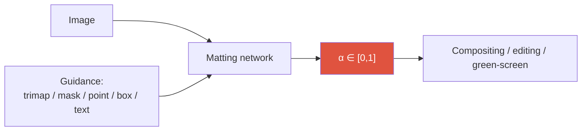
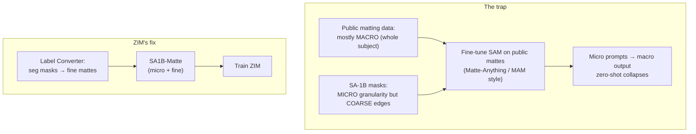

# Image Matting

alpha mattetrimap-freeSAM-guidedSAD / Grad / ConnZIMBiRefNet

> [!TIP] 이 챕터가 중요한 이유
> Matting은 지원자의 가장 강력한 **research × product** 교차점입니다: **ZIM** (ICCV 2025 Highlight), WSSHM (weakly-semi human matting), 상용 제품을 능가하는 foreground-segmentation API, 그리고 CLOVA-X Image Editing. 면접의 지렛대는 *왜 segmentation이 matting이 아닌지*, 그리고 *왜 matting 데이터로 SAM을 순진하게 fine-tuning하면 zero-shot 능력이 무너지는지*를 또렷하게 설명하는 것입니다.

## The problem

관측된 이미지 $I$를 foreground $F$, background $B$, 그리고 per-pixel opacity (alpha matte) $\alpha \in [0,1]$로 분해합니다:

$$I_i = \alpha_i F_i + (1-\alpha_i) B_i$$

픽셀마다 미지수는 7개 ($F_i, B_i \in \mathbb{R}^3$, $\alpha_i$)이고 관측값은 3개 — 이 문제는 **극도로 under-constrained**합니다. Prior는 trimap, coarse mask/prompt, 또는 학습된 foundation model에서 옵니다.

## 1 · Matting vs segmentation

| | Segmentation | Matting |
| --- | --- | --- |
| Output | hard label {0,1} / class-id | soft $\alpha \in [0,1]$ |
| Boundary tolerance | a few px forgiven (IoU) | hair / fur / motion / glass must be exact |
| Metrics | mIoU / AP | SAD, MSE, **Grad**, **Conn** |
| Data | relatively abundant | high-quality mattes are rare & expensive |
| Resolution need | moderate | high — sub-pixel edges |

composition equation이 바로 $\alpha$가 연속이어야 하는 이유 전부입니다: 머리카락 한 올에서 픽셀은 *부분적으로만* foreground입니다. threshold된 segmentation mask는 부분 coverage를 표현할 수 없으므로, compositing하면 **halo, color spill, jagged edge**가 남습니다.

> [!QUESTION] "Why can't I just evaluate matting with IoU?"
> IoU는 $\alpha$를 binary mask로 threshold하여, matting이 존재하는 이유인 soft-transition 정보를 정확히 버립니다. 몸통은 완벽히 잡되 모든 머리카락을 뭉개는 모델도 여전히 높은 IoU를 낼 수 있습니다. 크기(magnitude)는 SAD/MSE로, 경계 구조는 **Grad/Conn**으로 반드시 봐야 합니다.

## 2 · Guidance regimes

<dl class="kv">
<dt>Trimap-based</dt><dd>사용자(또는 모델)가 FG / BG / <b>Unknown</b> 영역을 제공하고; 네트워크는 Unknown 밴드만 풉니다. 가장 정확하지만 UX 비용이 가장 큽니다. 고전: <b>Deep Image Matting (DIM)</b>.</dd>
<dt>Mask-guided</dt><dd>coarse binary mask + 이미지 (예: MGMatting). trimap보다 저렴하고; ZIM의 label converter가 이 아이디어 위에 세워집니다.</dd>
<dt>Trimap-free (auto)</dt><dd>이미지만. 화상통화용 portrait/human 전문 모델(MODNet); 일반 장면용 salient-object matting.</dd>
<dt>Promptable / zero-shot</dt><dd>trimap 없이 point/box/text prompt: <b>ZIM</b>. Interactive matting이 SAM의 UX를 물려받습니다.</dd>
</dl>

제품 현실: trimap은 프로 툴에만 존재합니다. 소비자용 편집과 API는 **trimap-free 또는 prompt-based** matting이 필요합니다 — 바로 여기에 ZIM과 foreground API가 자리합니다.

## 3 · Metrics

- $\text{SAD} = \sum_i |\alpha_i - \hat\alpha_i|$ — 절대 차이의 합 (흔히 /1000으로 보고).
- $\text{MSE} = \frac{1}{N}\sum_i (\alpha_i - \hat\alpha_i)^2$.
- **Grad** — 예측과 GT alpha의 *spatial gradient* 차이; edge sharpness/over-smoothing에 민감합니다.
- **Conn** — connectivity 기반 구조 오차 (Rhemann et al.).

Grad와 Conn이 "segmented하게 보이는 것"과 "matted하게 보이는 것"을 가릅니다. ZIM의 loss가 이 때문에 의도적으로 gradient 항을 포함합니다 (§6 참고).

## 4 · Why SAM alone doesn't do matting

훌륭한 면접 서사인 ZIM의 논지:

1. SAM의 **pixel decoder**는 얕은 stride-4 upsampler (transposed conv 두 개) → checkerboard artifact, fine structure 없음.
2. SAM은 coarse한 SA-1B 레이블 위에서 **hard-ish mask** 쪽으로 학습되었습니다.
3. 소량의 *public* matting 데이터셋 (대부분 whole-object "macro") 위에서 SAM을 fine-tuning하면 **macro에 overfit**됩니다 — SAM의 micro/part-level promptability를 잃습니다. Zero-shot이 깨집니다.

해법은 더 큰 decoder가 아니라 **데이터 granularity**입니다: micro-level *이면서* fine-boundary인 matte를 대규모로 구축하는 것.

## 5 · ZIM — the two-axis contribution

> [!EXAMPLE] ZIM = Data + Architecture
> **Data:** *label converter* (MGMatting+Hiera, L1+Grad로 학습)가 SA-1B segmentation mask를 fine matte로 바꿔 → **SA1B-Matte**. 정직함을 지키는 두 가지 트릭: **Spatial Generalization Augmentation (SGA)** (random cut-out 쌍으로 converter가 macro를 넘어 일반화하도록) 과 **Selective Transformation Learning (STL)** (car/desk 같은 rigid object 위에는 머리카락을 hallucinate하지 않도록, non-transformable ADE20K 샘플 사용). **Architecture:** **Hierarchical Pixel Decoder** (multi-resolution stride 2/4/8, ~+10ms) + **Prompt-Aware Masked Attention** (box → binary attention mask; point → token-to-image cross-attention에 주입되는 Gaussian soft mask).

ZIM은 SAM의 promptable interface는 유지하되 soft $\alpha$를 출력하고, 학습 데이터가 올바른 granularity를 갖기 때문에 zero-shot micro/part matting을 *유지*합니다. 전체 architecture, ablation, downstream 결과는 **[ZIM deep-dive](#/resume/zim)**에.

## 6 · Losses

$$\mathcal{L} = \mathcal{L}_{\ell_1} + \lambda\,\mathcal{L}_{\text{grad}}, \qquad \mathcal{L}_{\text{grad}} = \|\nabla_x \hat\alpha - \nabla_x \alpha\|_1 + \|\nabla_y \hat\alpha - \nabla_y \alpha\|_1$$

- $\ell_1$은 magnitude를 잡고; **gradient 항**은 edge 구조를 강제합니다 (ZIM은 $\lambda = 10$ 사용).
- Composition loss ($\|\hat\alpha F + (1-\hat\alpha)B - I\|$)는 $\alpha$를 appearance에 다시 묶습니다.
- multi-scale detail을 위한 Laplacian/pyramid loss; perceptual (LPIPS)이나 adversarial 항은 선명하게 만들 수 있지만 불안정성/파이프라인 비용을 더합니다.
- segmentation의 **Dice**는 soft target에 맞지 않습니다 — 거의 binary인 mask를 가정하기 때문입니다.

## 7 · The 2025–2026 landscape

- **BiRefNet** — bilateral reference를 쓰는 고해상도 *dichotomous image segmentation*; fine structure에 강하고 background-removal/matting-adjacent backbone으로 인기 (dynamic-resolution 변형은 ~2K까지).
- **Matting Anything (MAM)** — SAM-guided universal matting: SAM mask를 alpha head의 guidance로. ZIM이 zero-shot 취약성으로 비판하는 원형(archetype).
- **ZIM** — promptable zero-shot *matting* foundation (ICCV 2025 Highlight); Grounded-ZIM = Grounding DINO text→box→ZIM으로 text-driven matting.
- **SAM 3**는 matting 단계로 넘겨줄 더 선명한 promptable mask/tracking을 제공하지만; matte 품질은 여전히 전용 soft-alpha head가 필요합니다. [Vision Foundation Models](#/cv/foundation-models) 참고.
- **Diffusion editing coupling** — 정밀한 $\alpha$는 inpainting / generative fill / video object editing에 강력한 conditioning 신호입니다 ([2026 landscape](#/start/landscape-2026)의 편집 물결: FLUX Kontext, Nano-Banana). 깨끗한 matte가 들어가면 artifact가 덜 나옵니다.

> [!NOTE] Video & temporal consistency
> Video matting은 **temporal coherence** 요구를 추가합니다: 이게 없으면 per-frame matte가 깜빡입니다. 접근법은 recurrent state (RVM)부터 memory-propagation (SAM 2 스타일) + matting head까지 다양합니다. green-screen 없는 화상통화와 비디오 편집에 제품적으로 결정적이며; metric은 per-frame SAD/Grad 위에 temporal-stability 항을 더합니다.

<figure>
<svg viewBox="0 0 640 130" xmlns="http://www.w3.org/2000/svg" font-family="Inter, sans-serif" font-size="11">
  <text x="90" y="20" text-anchor="middle" fill="#12a150">soft α (matting)</text>
  <rect x="30" y="30" width="120" height="70" rx="6" fill="none" stroke="#12a150" stroke-width="2"/>
  <path d="M40 100 q40 -70 100 -55" stroke="#12a150" stroke-width="2" fill="none"/>
  <text x="90" y="118" text-anchor="middle" fill="#6b7686">clean composite, no halo</text>
  <text x="330" y="20" text-anchor="middle" fill="#e0533f">hard mask (segmentation)</text>
  <rect x="270" y="30" width="120" height="70" rx="6" fill="none" stroke="#e0533f" stroke-width="2"/>
  <path d="M280 100 L280 55 L390 45" stroke="#e0533f" stroke-width="2" fill="none"/>
  <text x="330" y="118" text-anchor="middle" fill="#6b7686">jagged edge, halo/spill</text>
  <text x="520" y="55" fill="#6b7686">Same boundary,</text>
  <text x="520" y="72" fill="#6b7686">different downstream</text>
  <text x="520" y="89" fill="#6b7686">artifact budget.</text>
</svg>
<figcaption>composition equation은 반투명 경계에서 연속적인 α를 강제합니다; threshold된 mask는 부분 coverage를 표현할 수 없어 composite할 때 눈에 보이는 artifact를 남깁니다.</figcaption>
</figure>

## 8 · Human matting & label efficiency (WSSHM)

사람은 가장 가치 높고 가장 어려운 케이스입니다: 머리카락, 손가락, 반투명 옷, 게다가 막대한 제품 수요까지. **WSSHM** (지원자, arXiv 2024)은 weakly-**semi**-supervised, trimap-free human-matting baseline입니다 — 소수의 full matte + 다수의 weak label — PointWSSIS의 label-efficiency DNA를 matting으로 이식했습니다. **foreground-segmentation API** (내부 평가에서 Photoroom / Remove.bg / Adobe를 능가)는 제품화된 형제입니다. [Weak & Semi-Supervised](#/cv/weak-semi-supervised) 참고.

## 9 · Q&A

Macro vs micro matting — why does it matter for a foundation model?

**Short:** macro = 전체 subject; micro = part/instance (손, 가방, 머리카락). Interactive matting은 둘 다 필요하지만, 전통적 benchmark는 macro만 테스트합니다.

**Deep:** 고전적인 AIM/P3M 테스트 세트는 salient한 whole-object라서, micro가 가능한 모델은 single box prompt에서 거기서 *더 나빠* 보일 수 있지만 (part를 segment할 수 있음) 실제로는 엄격히 더 유용합니다. ZIM은 그 세트들에서 macro를 복원하려면 multi-point prompt가 필요하다고 보고합니다 — 결함이 아니라 정직한 domain-shift 단서입니다. "Micro-level matte foundation"이 ZIM이 메운 미해결 공백이었습니다.

How do you turn cheap segmentation labels into matting supervision without lying?

**Short:** label converter + 두 가지 안전장치 (SGA, STL).

**Deep:** converter는 가진 소량의 real matte 데이터로 학습되므로 macro에 과도하게 특화되고 soft edge를 *지어낼* 수 있습니다. SGA (random cut-out 쌍)는 임의 영역을 다루도록 강제하고; STL은 머리카락 같은 경계를 가지면 안 되는 rigid object 위에서 soft-edge 학습을 보류합니다. Ablation은 SGA+STL이 SA1B-Matte를 믿을 만하게 만드는 요소임을 보여줍니다.

Where does matte quality show up downstream?

**Short:** compositing artifact, 그리고 editing / 3D lifting에서의 오차 증폭.

**Deep:** 나쁜 matte는 halo와 color spill을 남기고; 그것을 inpainting이나 NeRF/3D-lift에 넣으면 오차가 복리로 쌓입니다. ZIM의 downstream 실험 (inpainting, SA3D NeRF, HQ-SAM 대체)은 research alpha-metric 개선이 제품 수준 artifact 감소로 이어짐을 보여줍니다 — 면접관이 좋아하는 "research metric → product metric" 다리입니다.

### Follow-ups
- *"Transparent objects (glass, smoke)?"* 다른 data/guidance 체제; ZIM은 open-world fine mask에 맞춰져 있어 Transparent-460으로 fine-tuning한 뒤에도 여기서는 약합니다 — 이를 솔직히 밝히는 것이 Highlight-paper의 규범입니다.
- *"Prompts: point vs box?"* Point → Gaussian soft attention (모호성은 multi-mask로 처리); box → hard attention mask; text → Grounding DINO → box → matte.
- *"Serving?"* 서버 ViT-B matting은 V100급 GPU에서 ~수백 ms; 제품은 별도의 경량 모델을 씁니다 (on-device human seg ~10ms). 역할 분리가 요점입니다 — [On-Device Seg](#/resume/on-device-segmentation) 참고.

## Cheat-sheet

| Term | Meaning |
| --- | --- |
| Composition eq. | $I = \alpha F + (1-\alpha)B$ |
| Trimap | FG / BG / Unknown regions |
| Trimap-free | image/prompt only, no trimap |
| SAD / MSE | magnitude error |
| Grad / Conn | boundary-structure error |
| SA1B-Matte | ZIM's converted micro+fine mattes |
| Macro vs micro | whole subject vs part/instance |
| Halo / spill | artifacts from a hard/soft-wrong matte |

**Related:** [Segmentation](#/cv/segmentation) · [Vision Foundation Models](#/cv/foundation-models) · [Weak & Semi-Supervised](#/cv/weak-semi-supervised) · [ZIM deep-dive](#/resume/zim) · [The 2026 Landscape](#/start/landscape-2026)
