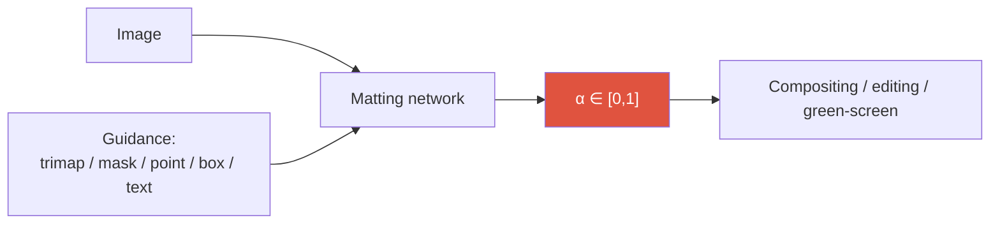
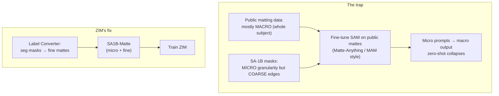

# Image Matting

<div class="tag-row"><span class="tag">alpha matte</span><span class="tag">trimap-free</span><span class="tag">SAM-guided</span><span class="tag">SAD / Grad / Conn</span><span class="tag">ZIM</span><span class="tag">BiRefNet</span></div>

> [!NOTE] One-line intuition
> **Matting** estimates a real-valued $\alpha$ (opacity/coverage) between 0 and 1 that controls the foreground's contribution in the compositing equation. Alpha is not “the probability of foreground” or semantic membership. At the boundary of an opaque object it may represent sub-pixel coverage; for a translucent object it may represent opacity. Compared with a hard segmentation mask, it enables more natural composites around **hair, fur, motion blur, and translucent regions**.

The simplest picture is a magnified hair boundary, where foreground and background can both cover part of one pixel footprint. Cutting that value to 0 or 1 creates stair-stepping and, when combined with an incorrectly estimated foreground color, a **halo**. Continuous $\alpha$ represents the transition, although clean compositing also depends on foreground-color estimation and color decontamination.

<figure>
<svg viewBox="0 0 640 210" xmlns="http://www.w3.org/2000/svg" font-family="Inter, sans-serif" font-size="11">
  <!-- hard mask row -->
  <text x="20" y="40" fill="#e0533f" font-weight="700">Hard mask (0/1)</text>
  <g>
    <rect x="20" y="50" width="36" height="36" fill="#e0533f"/><rect x="56" y="50" width="36" height="36" fill="#e0533f"/><rect x="92" y="50" width="36" height="36" fill="#e0533f"/>
    <rect x="128" y="50" width="36" height="36" fill="none" stroke="#98a3b2"/><rect x="164" y="50" width="36" height="36" fill="none" stroke="#98a3b2"/><rect x="200" y="50" width="36" height="36" fill="none" stroke="#98a3b2"/>
    <text x="38" y="72" text-anchor="middle" fill="#fff">1</text><text x="74" y="72" text-anchor="middle" fill="#fff">1</text><text x="110" y="72" text-anchor="middle" fill="#fff">1</text>
    <text x="146" y="72" text-anchor="middle" fill="#98a3b2">0</text><text x="182" y="72" text-anchor="middle" fill="#98a3b2">0</text><text x="218" y="72" text-anchor="middle" fill="#98a3b2">0</text>
  </g>
  <text x="130" y="108" text-anchor="middle" fill="#6b7686">abrupt edge → stair-steps and halos</text>
  <!-- soft alpha row -->
  <text x="20" y="150" fill="#12a150" font-weight="700">Soft α (matting, 0~1)</text>
  <g>
    <rect x="20" y="158" width="36" height="36" fill="#12a150" fill-opacity="1.0"/><rect x="56" y="158" width="36" height="36" fill="#12a150" fill-opacity="0.85"/><rect x="92" y="158" width="36" height="36" fill="#12a150" fill-opacity="0.6"/>
    <rect x="128" y="158" width="36" height="36" fill="#12a150" fill-opacity="0.35"/><rect x="164" y="158" width="36" height="36" fill="#12a150" fill-opacity="0.15"/><rect x="200" y="158" width="36" height="36" fill="#12a150" fill-opacity="0.03"/>
    <text x="38" y="180" text-anchor="middle" fill="#fff">1.0</text><text x="74" y="180" text-anchor="middle" fill="#fff">.85</text><text x="110" y="180" text-anchor="middle" fill="#fff">.6</text>
    <text x="146" y="180" text-anchor="middle" fill="currentColor">.35</text><text x="182" y="180" text-anchor="middle" fill="currentColor">.15</text><text x="218" y="180" text-anchor="middle" fill="currentColor">0</text>
  </g>
  <text x="440" y="120" text-anchor="middle" fill="#6b7686">Same edge, same pixels—</text>
  <text x="440" y="138" text-anchor="middle" fill="#6b7686">soft α represents opacity / coverage</text>
  <text x="440" y="156" text-anchor="middle" fill="#6b7686">for a smoother composite.</text>
</svg>
<figcaption>A magnified boundary. The hard mask above is cut to 1 or 0; the soft alpha below retains continuous opacity or coverage such as 0.85, 0.6, and 0.35. It is a compositing coefficient, not a class probability.</figcaption>
</figure>

> [!TIP] Interview one-liner
> Matting is the candidate's strongest **research × product** intersection: **ZIM** (ICCV 2025 Highlight), WSSHM (weakly-semi human matting), a foreground-segmentation API that beats commercial products, and CLOVA-X Image Editing. The interview lever is articulating *why segmentation is not matting* and *why naively fine-tuning SAM on matting data destroys its zero-shot ability*.

## The problem—and why it is difficult

Decompose an observed image $I$ into foreground $F$, background $B$, and a per-pixel opacity $\alpha \in [0,1]$. This **compositing equation** is the foundation of matting:

$$I_i = \alpha_i F_i + (1-\alpha_i) B_i$$

Per pixel there are seven unknowns ($F_i, B_i \in \mathbb{R}^3$, $\alpha_i$) but only three RGB observations, so the problem is **massively under-constrained**. The missing information—a **prior**—comes from a trimap, a coarse mask or prompt, or a learned foundation model.



## 1 · Matting vs segmentation

| | Segmentation | Matting |
| --- | --- | --- |
| Output | hard label {0,1} / class-id | soft $\alpha \in [0,1]$ |
| Boundary tolerance | a few px forgiven (IoU) | hair / fur / motion / glass must be exact |
| Metrics | mIoU / AP | SAD, MSE, **Grad**, **Conn** |
| Data | relatively abundant | high-quality mattes are rare & expensive |
| Resolution need | moderate | high — sub-pixel edges |

The compositing equation shows why $\alpha$ must be continuous. A thresholded segmentation mask cannot represent partial coverage or opacity. Halos and color spill, however, can arise not only from alpha error but also from background color retained in foreground RGB or from a mismatched premultiplication convention.

> [!QUESTION] "Why can't I just evaluate matting with IoU?"
> IoU thresholds $\alpha$ to a binary mask, discarding exactly the soft-transition information matting exists to model. A model that nails the torso but smears every hair strand can still post a high IoU. You must use SAD/MSE for magnitude and **Grad/Conn** for boundary structure.

## 2 · Guidance regimes

<dl class="kv">
<dt>Trimap-based</dt><dd>User (or a model) provides FG / BG / <b>Unknown</b> regions; the network only solves the Unknown band. Most accurate, highest UX cost. Classic: <b>Deep Image Matting (DIM)</b>.</dd>
<dt>Mask-guided</dt><dd>A coarse binary mask + image (e.g. MGMatting). Cheaper than a trimap; ZIM's label converter builds on this idea.</dd>
<dt>Trimap-free (auto)</dt><dd>Image only. Portrait/human specialists (MODNet) for video calls; salient-object matting for general scenes.</dd>
<dt>Promptable / zero-shot</dt><dd>Point/box/text prompts, no trimap: <b>ZIM</b>. Interactive matting inherits SAM's UX.</dd>
</dl>

Product reality: trimaps exist only in pro tools. Consumer editing and APIs need **trimap-free or prompt-based** matting — which is exactly where ZIM and the foreground API sit.

## 3 · Metrics

- $\text{SAD} = \sum_i |\alpha_i - \hat\alpha_i|$ — sum of absolute differences (often reported /1000).
- $\text{MSE} = \frac{1}{N}\sum_i (\alpha_i - \hat\alpha_i)^2$.
- **Grad** — difference of *spatial gradients* of predicted vs GT alpha; sensitive to edge sharpness/over-smoothing.
- **Conn** — connectivity-based structural error (Rhemann et al.).

Grad and Conn are what separate "looks segmented" from "looks matted." ZIM's loss deliberately includes a gradient term for this reason (see §6).

## 4 · Why SAM alone doesn't do matting

The ZIM argument, which is a great interview narrative:



1. SAM's **pixel decoder** is a shallow stride-4 upsampler (two transposed convolutions) → checkerboard artifacts and little fine structure. For the underlying operation, see [Upsampling & U-Net](#/cv/upsampling-unet).
2. SAM was trained toward **hard-ish masks** on coarse SA-1B labels.
3. Fine-tuning SAM on the small pool of *public* matting datasets (mostly whole-object "macro") makes it **overfit to macro** — it loses SAM's micro/part-level promptability. Zero-shot breaks.

The fix is **data granularity**, not just a bigger decoder: build micro-level *and* fine-boundary mattes at scale.

## 5 · ZIM — the two-axis contribution

> [!EXAMPLE] ZIM = Data + Architecture
> **Data:** a *label converter* (MGMatting+Hiera, trained with L1+Grad) turns SA-1B segmentation masks into fine mattes → **SA1B-Matte**. Two tricks keep it honest: **Spatial Generalization Augmentation (SGA)** (random cut-out pairs so the converter generalizes beyond macro) and **Selective Transformation Learning (STL)** (don't hallucinate hair on rigid objects like cars/desks, using non-transformable ADE20K samples). **Architecture:** a **Hierarchical Pixel Decoder** (multi-resolution stride 2/4/8, ~+10ms) + **Prompt-Aware Masked Attention** (box → binary attention mask; point → Gaussian soft mask injected into token-to-image cross-attention).

ZIM keeps SAM's promptable interface but outputs soft $\alpha$, and it *retains* zero-shot micro/part matting because its training data has the right granularity. Full architecture, ablations, and downstream results in the **[ZIM deep-dive](#/resume/zim)**.

## 6 · Losses

$$\mathcal{L} = \mathcal{L}_{\ell_1} + \lambda\,\mathcal{L}_{\text{grad}}, \qquad \mathcal{L}_{\text{grad}} = \|\nabla_x \hat\alpha - \nabla_x \alpha\|_1 + \|\nabla_y \hat\alpha - \nabla_y \alpha\|_1$$

- $\ell_1$ fixes magnitude; the **gradient term** enforces edge structure (ZIM uses $\lambda = 10$).
- Composition loss ($\|\hat\alpha F + (1-\hat\alpha)B - I\|$) ties alpha back to appearance when ground-truth or estimated $F,B$ are available during training. Given $I$ alone, $F,B,\alpha$ are not jointly identifiable.
- Laplacian/pyramid losses for multi-scale detail; perceptual (LPIPS) or adversarial terms can sharpen but add instability/pipeline cost.
- **Soft Dice** is well-defined for soft targets, so it is too strong to call it inherently unsuitable for matting. It normalizes region overlap, however, and does not fully represent absolute alpha, gradient, or connectivity error. Pair it with L1/MSE, gradient or composition terms, and task-specific metrics. See [Losses & Gradients](#/ml-coding/losses-gradients).

> **PyTorch-style pseudocode—the alpha remains continuous through compositing**

```python
alpha = matting_net(image, guidance).sigmoid()  # [B,1,H,W], keep continuous
loss_alpha = l1(alpha, alpha_gt)
loss_grad = l1(spatial_grad(alpha), spatial_grad(alpha_gt))

# Composition loss is defined only when F/B are available in the training set.
recon = alpha * foreground + (1.0 - alpha) * background
loss_comp = l1(recon, image)                    # broadcasts over RGB [B,3,H,W]
loss = loss_alpha + lambda_grad * loss_grad + lambda_comp * loss_comp
loss.backward()                                 # do not threshold into a hard mask
```

## 7 · The 2025–2026 landscape

- **BiRefNet** — a high-resolution *dichotomous image segmentation* model. Its fine-boundary foreground masks are useful for background removal, but its evaluation target differs from that of a matting model that recovers continuous alpha and foreground color from the compositing equation. Do not mistake hard-mask performance for alpha quality on a matting benchmark.
- **Matting Anything (MAM)** — SAM-guided universal matting: SAM mask as guidance to an alpha head. The archetype ZIM critiques for zero-shot fragility.
- **ZIM** — promptable zero-shot *matting* foundation (ICCV 2025 Highlight); Grounded-ZIM = Grounding DINO text→box→ZIM for text-driven matting.
- **The SAM 3 family** can obtain concept masks and video tracks from text or exemplars, providing initial prompts or coarse masks for matting. A binary or soft segmentation mask is not automatically an alpha matte, however; hair and translucent regions still require dedicated soft-alpha estimation and evaluation. See [Vision Foundation Models](#/cv/foundation-models).
- **Diffusion editing coupling** — precise $\alpha$ is a strong conditioning signal for inpainting / generative fill / video object editing (the [2026 landscape](#/start/landscape-2026) editing wave: FLUX Kontext, Nano-Banana). A clean matte in, fewer artifacts out.

> [!NOTE] Video & temporal consistency
> Video matting adds a **temporal coherence** requirement: per-frame mattes flicker without it. Approaches range from recurrent state (RVM) to memory-propagation (SAM 2-style) + a matting head. Product-critical for green-screen-free video calls and video editing; the metric adds temporal-stability terms on top of per-frame SAD/Grad.

<figure>
<svg viewBox="0 0 640 130" xmlns="http://www.w3.org/2000/svg" font-family="Inter, sans-serif" font-size="11">
  <text x="90" y="20" text-anchor="middle" fill="#12a150">soft α (matting)</text>
  <rect x="30" y="30" width="120" height="70" rx="6" fill="none" stroke="#12a150" stroke-width="2"/>
  <path d="M40 100 q40 -70 100 -55" stroke="#12a150" stroke-width="2" fill="none"/>
  <text x="90" y="118" text-anchor="middle" fill="#6b7686">clean composite, no halo</text>
  <text x="330" y="20" text-anchor="middle" fill="#e0533f">hard mask (segmentation)</text>
  <rect x="270" y="30" width="120" height="70" rx="6" fill="none" stroke="#e0533f" stroke-width="2"/>
  <path d="M280 100 L280 55 L390 45" stroke="#e0533f" stroke-width="2" fill="none"/>
  <text x="330" y="118" text-anchor="middle" fill="#6b7686">jagged edge, halo/spill</text>
  <text x="520" y="55" fill="#6b7686">Same boundary,</text>
  <text x="520" y="72" fill="#6b7686">different downstream</text>
  <text x="520" y="89" fill="#6b7686">artifact budget.</text>
</svg>
<figcaption>The compositing equation permits continuous alpha for partial coverage and opacity. A thresholded mask cannot represent them, while actual composite quality also depends on foreground-color estimation and correct premultiplication handling.</figcaption>
</figure>

## 8 · Human matting & label efficiency (WSSHM)

People are the highest-value, hardest case: hair, fingers, semi-transparent clothing, plus huge product demand. **WSSHM** (candidate, arXiv 2024) is a weakly-**semi**-supervised, trimap-free human-matting baseline — few full mattes + many weak labels — porting the label-efficiency DNA of PointWSSIS into matting. The **foreground-segmentation API** (beating Photoroom / Remove.bg / Adobe in internal eval) is the productized sibling. See [Weak & Semi-Supervised](#/cv/weak-semi-supervised).

## 9 · Q&A

<details class="qa"><summary>Macro vs micro matting — why does it matter for a foundation model?</summary>
<div class="qa-body">

**Short:** macro = whole subject; micro = part/instance (a hand, a bag, hair). Interactive matting needs both, and traditional benchmarks only test macro.

**Deep:** classic AIM/P3M test sets are salient whole-objects, so a micro-capable model can look *worse* there with a single box prompt (it may segment a part) yet be strictly more useful. ZIM reports needing multi-point prompts to recover macro on those sets — an honest domain-shift caveat, not a defect. "Micro-level matte foundation" was the open gap ZIM filled.
</div></details>

<details class="qa"><summary>How do you turn cheap segmentation labels into matting supervision without lying?</summary>
<div class="qa-body">

**Short:** a label converter + two safeguards (SGA, STL).

**Deep:** the converter is trained on the little real matte data you have, so it over-specializes to macro and can *invent* soft edges. SGA (random cut-out pairs) forces it to handle arbitrary regions; STL withholds soft-edge learning on rigid objects that shouldn't have hairy boundaries. Ablations show SGA+STL is what makes SA1B-Matte trustworthy.
</div></details>

<details class="qa"><summary>Where does matte quality show up downstream?</summary>
<div class="qa-body">

**Short:** compositing artifacts, and error amplification in editing / 3D lifting.

**Deep:** a bad matte leaves halos and color spill; feed that into inpainting or a NeRF/3D-lift and errors compound. ZIM's downstream experiments (inpainting, SA3D NeRF, HQ-SAM replacement) show research alpha-metric gains translate to product-level artifact reduction — the "research metric → product metric" bridge interviewers love.
</div></details>

### Follow-ups
- *"Transparent objects (glass, smoke)?"* Different data/guidance regime; ZIM is tuned for open-world fine masks and is weak here even after fine-tuning on Transparent-460 — being candid about this is the Highlight-paper norm.
- *"Prompts: point vs box?"* Point → Gaussian soft attention (ambiguity handled by multi-mask); box → hard attention mask; text → Grounding DINO → box → matte.
- *"Serving?"* Server ViT-B matting is ~100s of ms on a V100-class GPU; products use a separate lightweight model (on-device human seg ~10ms). Role separation is the point — see [On-Device Seg](#/resume/on-device-segmentation).

## Cheat-sheet

| Term | Meaning |
| --- | --- |
| Composition eq. | $I = \alpha F + (1-\alpha)B$ |
| Trimap | FG / BG / Unknown regions |
| Trimap-free | image/prompt only, no trimap |
| SAD / MSE | magnitude error |
| Grad / Conn | boundary-structure error |
| SA1B-Matte | ZIM's converted micro+fine mattes |
| Macro vs micro | whole subject vs part/instance |
| Halo / spill | artifacts from a hard/soft-wrong matte |

**Related:** [Segmentation](#/cv/segmentation) · [Vision Foundation Models](#/cv/foundation-models) · [Weak & Semi-Supervised](#/cv/weak-semi-supervised) · [ZIM deep-dive](#/resume/zim) · [The 2026 Landscape](#/start/landscape-2026)
