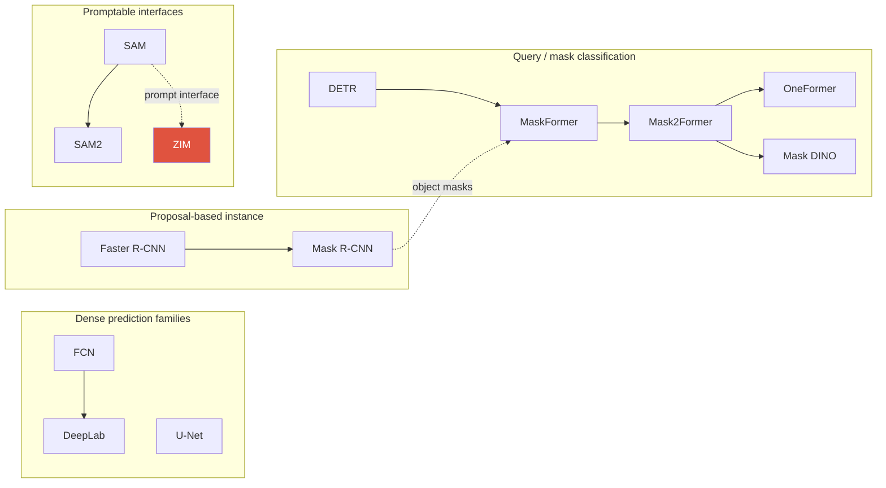

# Segmentation (분할)

> [!NOTE] 이 챕터의 목표
> Detection이 물체를 **네모 상자**로 잡았다면, segmentation은 한 걸음 더 나아가 **픽셀 하나하나에 라벨을 붙입니다**. "이 픽셀은 사람, 저 픽셀은 도로." 여기서는 그림으로 semantic/instance/panoptic의 차이부터 잡고, 그다음 현대 모델(Mask2Former, SAM)이 어떻게 이를 푸는지, 그리고 mIoU·PQ로 어떻게 채점하는지까지 갑니다.

세그멘테이션은 이 자료를 만든 사람의 **홈그라운드**입니다(ZIM·ECLIPSE·PointWSSIS·BESTIE 등). 그만큼 계보와 trade-off를 그림처럼 설명할 수 있으면 강력합니다.

## 1 · 세 가지 분할, 그림으로

같은 장면(사람 둘 + 하늘 + 도로)을 세 방식으로 라벨링한 그림입니다. **무엇이 다른지**가 핵심입니다.

<figure>
<svg viewBox="0 0 660 210" xmlns="http://www.w3.org/2000/svg" font-family="Inter, sans-serif" font-size="12">
  <!-- semantic -->
  <text x="105" y="16" text-anchor="middle" font-weight="700" fill="#0ea5e9">Semantic</text>
  <rect x="20" y="26" width="170" height="150" rx="8" fill="none" stroke="#98a3b2"/>
  <rect x="22" y="28" width="166" height="70" fill="#0ea5e9" opacity="0.25"/><text x="105" y="60" text-anchor="middle" fill="#0ea5e9">sky</text>
  <rect x="22" y="128" width="166" height="46" fill="#12a150" opacity="0.3"/><text x="105" y="158" text-anchor="middle" fill="#12a150">road</text>
  <rect x="60" y="90" width="40" height="55" rx="6" fill="#e0533f" opacity="0.6"/><rect x="115" y="95" width="40" height="50" rx="6" fill="#e0533f" opacity="0.6"/>
  <text x="105" y="196" text-anchor="middle" fill="#98a3b2">둘 다 "person" (같은 색)</text>
  <!-- instance -->
  <text x="330" y="16" text-anchor="middle" font-weight="700" fill="#e0533f">Instance</text>
  <rect x="245" y="26" width="170" height="150" rx="8" fill="none" stroke="#98a3b2"/>
  <rect x="285" y="90" width="40" height="55" rx="6" fill="#e0533f" opacity="0.7"/><text x="305" y="122" text-anchor="middle" fill="#fff">1</text>
  <rect x="340" y="95" width="40" height="50" rx="6" fill="#6366f1" opacity="0.7"/><text x="360" y="124" text-anchor="middle" fill="#fff">2</text>
  <text x="330" y="196" text-anchor="middle" fill="#98a3b2">person #1, #2 구분 · 배경 무시</text>
  <!-- panoptic -->
  <text x="555" y="16" text-anchor="middle" font-weight="700" fill="#12a150">Panoptic</text>
  <rect x="470" y="26" width="170" height="150" rx="8" fill="none" stroke="#98a3b2"/>
  <rect x="472" y="28" width="166" height="70" fill="#0ea5e9" opacity="0.25"/><text x="555" y="60" text-anchor="middle" fill="#0ea5e9">sky</text>
  <rect x="472" y="128" width="166" height="46" fill="#12a150" opacity="0.3"/><text x="555" y="158" text-anchor="middle" fill="#12a150">road</text>
  <rect x="510" y="90" width="40" height="55" rx="6" fill="#e0533f" opacity="0.7"/><text x="530" y="122" text-anchor="middle" fill="#fff">1</text>
  <rect x="565" y="95" width="40" height="50" rx="6" fill="#6366f1" opacity="0.7"/><text x="585" y="124" text-anchor="middle" fill="#fff">2</text>
  <text x="555" y="196" text-anchor="middle" fill="#98a3b2">전부 + instance 구분 (합집합)</text>
</svg>
<figcaption><b>Semantic(의미 분할)</b>: 픽셀마다 클래스만 — 같은 클래스의 개체 ID는 없음. <b>Instance(개체 분할)</b>: thing 객체를 개별로 구분(person #1 ≠ #2). <b>Panoptic(파놉틱/전장면 분할)</b>: 둘의 통합 — 평가 대상 픽셀은 겹치지 않는 하나의 segment에 속하고 thing에는 instance ID가 붙습니다. Dataset에 따라 void/ignore 영역은 평가에서 제외됩니다.</figcaption>
</figure>

<dl class="kv">
<dt>stuff (배경 물질)</dt><dd>형태가 불분명하고 셀 수 없는 영역 — sky, road, grass.</dd>
<dt>things (개체)</dt><dd>셀 수 있는 물체 — person, car, dog.</dd>
</dl>

| Task | 출력 | 개체 구분? | stuff 처리? | 지표(metric) |
| --- | --- | --- | --- | --- |
| **Semantic** | 픽셀별 클래스 맵 | ✗ (같은 클래스 병합) | ✓ | mIoU |
| **Instance** | 물체별 mask | ✓ (things만) | ✗ | mask AP (COCO) |
| **Panoptic** | 픽셀별 (클래스, id) | ✓ things · stuff 병합 | ✓ | PQ = SQ × RQ |
| **Promptable interface** | prompt → mask/segment | prompt·모델 정의에 따라 | class-agnostic 또는 concept-aware | IoU·boundary·task별 지표 |

> [!TIP] 면접 한 줄
> 정의만 나열하지 말고 **출력 표현의 변화**로 답하세요: "per-pixel class map과 object별 mask를 query 기반 **mask classification**으로 통합할 수 있게 됐다." 모든 모델이 이 방식으로 대체된 것은 아니며, mIoU와 PQ의 차이, soft alpha(matting)가 hard mask와 갈라지는 지점까지 짚으면 강합니다.

세그멘테이션은 픽셀 단위 출력이라 **해상도를 복원**하는 [업샘플링 & U-Net](#/cv/upsampling-unet)이 필수 전제입니다. 채점 구현은 [mAP & mIoU 밑바닥](#/ml-coding/metrics-map-miou)에서 직접 짜 봅니다.

## 2 · 두 가지 패러다임

<div class="proscons"><div><div class="pros-t">Per-pixel classification (픽셀별 분류)</div>
FCN, DeepLab, U-Net, PSPNet. Context를 공유하는 feature에서 각 픽셀의 <code>C</code>개 class logit을 내고 보통 pixel-wise CE로 학습합니다. 픽셀 예측이 계산적으로 독립인 것은 아니지만 출력에는 instance identity가 없어, 같은 클래스의 서로 다른 개체를 구분하지 못합니다. Closed-set head는 고정된 클래스 목록을 가정합니다.
</div><div><div class="cons-t">Mask classification (마스크 분류)</div>
MaskFormer / Mask2Former. <code>N</code>개의 binary <b>mask</b>를 예측하고 각각에 클래스 라벨을 붙입니다(집합 예측). <i>어디(mask)</i>와 <i>무엇(label)</i>을 분리해 한 구조로 semantic·instance·panoptic을 처리할 수 있습니다. 강력한 현대 패러다임이지만 CNN pixel decoder도 latency·도메인 제약에 따라 여전히 유효합니다.
</div></div>

MaskFormer의 통찰은 semantic segmentation도 class-labeled mask의 집합으로 표현할 수 있다는 것입니다. `N`개의 query가 각각 mask + class를 내고 **이분 매칭**으로 정답과 짝지으면, 별도의 per-pixel closed-set head 없이 여러 segmentation task를 통합할 수 있습니다. Instance 분리가 "공짜"인 것은 아니며 query decoder·matching·mask loss가 그 구조를 학습합니다.

## 3 · 고전 계보 (이름이 아니라 메커니즘을 아세요)



화살표는 논문 전체의 직접 계보가 아니라 **명시된 메커니즘의 영향·확장**만 나타냅니다. 특히 SAM은 Mask2Former의 단순 후속 모델이 아닙니다.

<dl class="kv">
<dt>FCN (2015)</dt><dd>분류기의 fully-connected head를 <b>1×1 conv</b>로 교체 → dense 픽셀 예측; <b>skip connection(스킵 연결)</b>으로 거친 의미 정보와 세밀한 공간 정보를 결합. dense labeling의 시초.</dd>
<dt>U-Net (2015)</dt><dd>모든 scale에 skip connection을 갖는 대칭 encoder–decoder; 의료/저데이터 분할을 장악. 그 decoder 패턴은 diffusion 등 곳곳에 재등장 — [업샘플링 & U-Net](#/cv/upsampling-unet).</dd>
<dt>DeepLab v1→v3+</dt><dd><b>Atrous(dilated) convolution(팽창 합성곱)</b>으로 해상도를 잃지 않고 수용 영역을 키우고; <b>ASPP</b>로 multi-scale context를 잡음; v3+는 경계를 위해 decoder 추가.</dd>
<dt>PSPNet</dt><dd><b>Pyramid pooling</b>으로 여러 영역 scale의 global context를 집계.</dd>
<dt>Mask R-CNN (2017)</dt><dd>Faster R-CNN + mask branch + <b>RoIAlign</b>. 수년간 사실상 표준이던 two-stage instance segmenter.</dd>
</dl>

> [!QUESTION] "Mask R-CNN은 왜 RoIPool이 아니라 RoIAlign이 필요한가?"
> **짧게:** RoIPool은 RoI 경계와 bin을 quantize해 feature와 입력 좌표의 정렬을 깨뜨릴 수 있고, mask는 이 오차에 민감합니다. **깊게:** RoIAlign은 RoI/bin 경계를 반올림하지 않고 정해진 sample point에서 bilinear interpolation을 사용합니다. Box와 mask 지표 모두 영향을 받을 수 있지만 pixel mask가 정렬 개선의 직접적인 수혜자입니다.

## 4 · Mask classification, 깊게

MaskFormer / **Mask2Former**는 query `i`마다 클래스 분포 $p_i \in \Delta^{C+1}$("no-object" $\varnothing$ 포함)와 mask embedding $\mathbf{e}_i$를 만듭니다. mask는 픽셀별 embedding $\mathbf{F}$와의 내적입니다:

$$\hat{m}_i = \sigma(\mathbf{e}_i \cdot \mathbf{F}) \in [0,1]^{H\times W}$$

학습은 **Hungarian matching(헝가리안 매칭)** 으로 `N`개 예측을 정답 segment에 짝지은 뒤 매칭별 loss를 적용:

$$\mathcal{L} = \lambda_{\text{cls}}\,\mathcal{L}_{\text{CE}}(p, c) + \lambda_{\text{dice}}\,\mathcal{L}_{\text{dice}}(\hat m, m) + \lambda_{\text{ce}}\,\mathcal{L}_{\text{mask-BCE}}(\hat m, m)$$

> **PyTorch식 pseudocode — query에서 semantic map까지**

```python
pixel = pixel_decoder(features)                    # [B,D,H,W]
query = transformer_decoder(features)              # [B,N,D]
mask_logits = torch.einsum("bnd,bdhw->bnhw", query, pixel)
class_logits = class_head(query)                    # [B,N,C+1], + no-object

costs = build_cost_per_image(class_logits, mask_logits, targets)  # [N,M_b]씩
match = [hungarian(cost.detach()) for cost in costs]
loss = matched_class_loss(class_logits, match) \
     + matched_mask_loss(mask_logits, targets, match)

# semantic inference: no-object를 버리고 query 기여를 class별로 합침
class_prob = class_logits.softmax(-1)[..., :-1]     # [B,N,C]
mask_prob = mask_logits.sigmoid()                    # [B,N,H,W]
semantic_score = torch.einsum("bnc,bnhw->bchw", class_prob, mask_prob)
```

Mask2Former의 핵심 개선은 **masked attention**: transformer decoder에서 각 query의 cross-attention을 *자기 현재 mask 예측의 foreground 영역으로 제한*합니다. attention을 국소화해 수렴을 빠르게 하고 정확도를 올립니다. **OneFormer**는 task token으로 한 세트 weight로 세 task를; **Mask DINO**는 DINO decoder에서 detection+segmentation을 통합.

> [!NOTE] 이력서 연결
> Mask2Former는 **ECLIPSE의 backbone**입니다(continual panoptic). 그 query 구조가 "step마다 prompt를 추가하고 query 출력을 집계"를 자연스럽게 만듭니다 — [ECLIPSE 딥다이브](#/resume/eclipse).

## 5 · 지표: mIoU vs PQ

**mIoU**(semantic): 클래스별 intersection-over-union의 평균.

$$\text{IoU}_c = \frac{TP_c}{TP_c + FP_c + FN_c}, \qquad \text{mIoU} = \frac{1}{C}\sum_c \text{IoU}_c$$

여기서 $C$에 background를 포함하는지, GT와 prediction 모두에 없는 class($0/0$)를 제외하는지는 benchmark 구현마다 다릅니다. Ignore label을 confusion matrix에 넣지 말고, 논문·코드에서 class set과 reduction convention을 명시하세요.

**PQ**(panoptic, Kirillov 2019)는 인식 품질과 mask 품질을 분리합니다. 같은 class의 예측/정답 panoptic segment는 IoU $>0.5$일 때 매칭됩니다. Segment들이 서로 겹치지 않는 panoptic 조건 덕분에 이 threshold에서 matching이 유일해집니다.

$$\mathrm{PQ}=\underbrace{\frac{\sum_{(p,g)\in TP}\mathrm{IoU}(p,g)}{|TP|}}_{\mathrm{SQ}\ (\text{mask quality})}\times\underbrace{\frac{|TP|}{|TP|+\tfrac12|FP|+\tfrac12|FN|}}_{\mathrm{RQ}\ (\text{F}_1)}$$

<figure>
<svg viewBox="0 0 640 150" xmlns="http://www.w3.org/2000/svg" font-family="Inter, sans-serif" font-size="12">
  <rect x="20" y="40" width="150" height="70" rx="8" fill="none" stroke="#0ea5e9" stroke-width="2"/>
  <text x="95" y="30" text-anchor="middle" fill="#0ea5e9">SQ = 매칭들의 평균 IoU</text>
  <text x="95" y="80" text-anchor="middle" fill="#98a3b2">"mask가 정밀한가?"</text>
  <text x="200" y="80" text-anchor="middle" fill="#e0533f" font-size="20">×</text>
  <rect x="240" y="40" width="170" height="70" rx="8" fill="none" stroke="#12a150" stroke-width="2"/>
  <text x="325" y="30" text-anchor="middle" fill="#12a150">RQ = segment F₁</text>
  <text x="325" y="80" text-anchor="middle" fill="#98a3b2">"제대로 찾았나?"</text>
  <text x="440" y="80" text-anchor="middle" fill="#e0533f" font-size="20">=</text>
  <rect x="470" y="40" width="150" height="70" rx="8" fill="#e0533f"/>
  <text x="545" y="80" text-anchor="middle" fill="#fff" font-size="16">PQ</text>
</svg>
<figcaption>PQ는 매칭된 segment의 mask 품질(SQ)과 recognition 품질(RQ)로 분해됩니다. SQ 높음 + RQ 낮음은 매칭된 mask 경계는 좋지만 miss·false positive·오분류가 많다는 뜻입니다. Continual background shift는 가능한 원인 중 하나입니다.</figcaption>
</figure>

> [!QUESTION] "PQ가 mIoU보다 왜 더 엄격한가?"
> mIoU는 클래스별로 픽셀을 모으므로 개체가 서로 뭉개져도 대체로 좋은 점수를 받습니다. PQ는 **IoU > 0.5의 개체 단위 매칭**을 요구합니다; 놓치면 온전한 FN, 헛된 segment는 온전한 FP이고 각각 RQ에서 절반씩 가중됩니다. 그래서 PQ는 mIoU가 숨기는 인식 오류를 처벌합니다.

## 6 · Loss 치트시트

| Loss | 형태 | 좋은 경우 | 주의 |
| --- | --- | --- | --- |
| Cross-entropy | 픽셀별 softmax | semantic 기본 | 클래스 불균형 |
| Weighted / OHEM CE | 희귀/어려운 픽셀 재가중 | 불균형 | 튜닝 |
| **Soft Dice** | $1-\frac{2\sum \hat m m+\epsilon}{\sum \hat m+\sum m+\epsilon}$ | 겹침·불균형 | empty mask·class/batch reduction convention |
| Focal | $(1-p_t)^\gamma$ CE | dense hard-neg | γ 튜닝 — [Detection](#/cv/detection) |
| Boundary / Grad | gradient 일치 | 선명한 경계 | 날카로운 GT 필요 |
| Lovász-softmax | IoU 직접 대리 | mIoU 최적화 | 느림 |

Mask2Former는 point-sampled 위치에서 **Dice + mask-BCE**(dense보다 저렴)에 분류 CE를 더합니다. Boundary-aware 항은 matting 수준 경계로 밀 때 중요 — [Image Matting](#/cv/matting).

## 7 · 2025–2026 프런티어

- **Promptable / concept segmentation.** **SAM**(2023, point/box/mask prompt) → **SAM 2**(2024, streaming video) → **SAM 3**(Meta, 2025.11, text/exemplar concept): 짧은 명사구나 exemplar가 open-vocabulary detect·segment·track을 조건화하고, *인식*과 *위치*를 분리하는 **presence head**를 갖습니다. **SAM 3.1**(2026.03)은 Object Multiplex로 multi-object video 실행을 개선한 업데이트입니다. 계보는 [Vision Foundation Models](#/cv/foundation-models).
- **Frozen SSL backbone.** **DINOv3**(2025)는 보고된 여러 frozen dense-evaluation protocol에서 강한 결과를 보였고, **Gram anchoring**은 긴 학습 중 patch-level dense feature가 저하되는 현상을 완화합니다. 모든 도메인 specialist를 보편적으로 능가한다는 뜻은 아닙니다.
- **Open-vocabulary.** CLIP/SigLIP text alignment + mask decoder(SEEM, ODISE, Grounded-SAM); novel-class mIoU로 평가.
- **Matting 수준 품질.** SAM의 거친 경계가 **ZIM**(ICCV 2025 Highlight)의 동기 — promptable interface는 유지하되 soft $\alpha$를 출력 — [ZIM 딥다이브](#/resume/zim).

## 8 · Q&A

<details class="qa"><summary>"하나의 모델로 세 task 모두"가 어떻게 가능해졌나?</summary>
<div class="qa-body">

**짧게:** per-pixel classification → **집합 예측 기반 mask classification** 전환.

**깊게:** (mask, class) 집합을 공통 표현으로 쓸 수 있고, semantic은 class별 mask score를 집계하고 instance는 thing query를 유지하며 panoptic은 겹침을 해소합니다. 실제로는 training dataset, matching cost, task token, loss와 inference threshold도 달라질 수 있어 "후처리만 다르다"고 일반화하면 과합니다. MaskFormer/Mask2Former/OneFormer는 이 통합 가능성을 서로 다른 recipe로 보였습니다.
</div></details>

<details class="qa"><summary>2026년에도 Mask R-CNN이나 DeepLab을 쓸 때가 있나?</summary>
<div class="qa-body">

**짧게:** 빠듯한 latency/compute, 소규모 팀, 또는 최고 AP보다 성숙한 학습 recipe가 중요할 때.

**깊게:** query-based transformer는 더 무겁고 수렴이 느릴 수 있어 세심한 학습이 필요합니다. 잘 튜닝된 Mask R-CNN/DeepLabv3+는 믿을 만한 production baseline이고 ONNX/TensorRT export가 깔끔하며 디버깅이 쉽습니다. on-device면 가벼운 FCN/U-Net head — [On-Device Seg](#/resume/on-device-segmentation) (~10ms mobile CPU).
</div></details>

<details class="qa"><summary>query 개수와 "no-object"는 어떻게 상호작용하나?</summary>
<div class="qa-body">

**짧게:** query가 너무 적으면 물체를 놓치고(FN); $\varnothing$ 클래스가 안 쓰인 query를 흡수합니다.

**깊게:** `N`개 query는 각각 GT segment에 매칭되거나 $\varnothing$에 할당됩니다. 표준 one-to-one matching에서는 한 이미지의 target segment 수가 `N`을 넘으면 전부 매칭할 수 없으므로 query budget을 데이터에 맞춰야 합니다. 너무 많이 두면 no-object imbalance와 계산이 늘 수 있습니다. Continual prompt/query 증설은 기존 경로를 보존하는 한 전략이지만, query만 늘린다고 forgetting이 자동으로 사라지지는 않습니다.
</div></details>

### 예상 follow-up
- *"COCO vs ADE20K panoptic — 왜 ADE20K가 더 어렵나?"* ADE20K가 더 dense하고(이미지당 클래스/개체 많음) stuff 비중이 커 RQ에 부담.
- *"SQ 높고 RQ 낮음 — 진단하라."* mask는 정밀하나 segment를 놓치거나 오라벨 — continual의 background drift 특징.
- *"Boundary IoU vs mask IoU?"* Boundary IoU는 경계 띠만 평가 — 미세 구조가 중요할 때 정직하며 matting metric(SAD/Grad)으로 가는 다리.

## Cheat-sheet

| 개념 | 한 줄 |
| --- | --- |
| mIoU | 클래스별 IoU 평균 (semantic) |
| PQ = SQ × RQ | 개체 인식형; mask 품질 × 검출 F₁ |
| per-pixel vs mask-cls | 독립 softmax vs 매칭된 (mask, class) 집합 |
| masked attention | Mask2Former가 cross-attn을 현재 mask로 제한 → 빠른 수렴 |
| RoIAlign | bilinear, 반올림 없음 → sub-pixel mask |
| stuff vs things | 셀 수 없는 영역 vs 셀 수 있는 물체 |
| promptable/concept seg | SAM은 point/box/mask prompt, SAM 3 계열은 text/exemplar concept까지 지원 |
| background shift | continual seg에서 step마다 background/no-object의 의미가 바뀌는 현상 |

**다음:** [Object Detection](#/cv/detection) · [Image Matting](#/cv/matting) · [Weak & Semi-Supervised](#/cv/weak-semi-supervised) · [Continual Learning](#/cv/continual-learning) · [Vision Foundation Models](#/cv/foundation-models) · [업샘플링 & U-Net](#/cv/upsampling-unet) · [mAP & mIoU](#/ml-coding/metrics-map-miou) · [ZIM 딥다이브](#/resume/zim) · [ECLIPSE 딥다이브](#/resume/eclipse)
