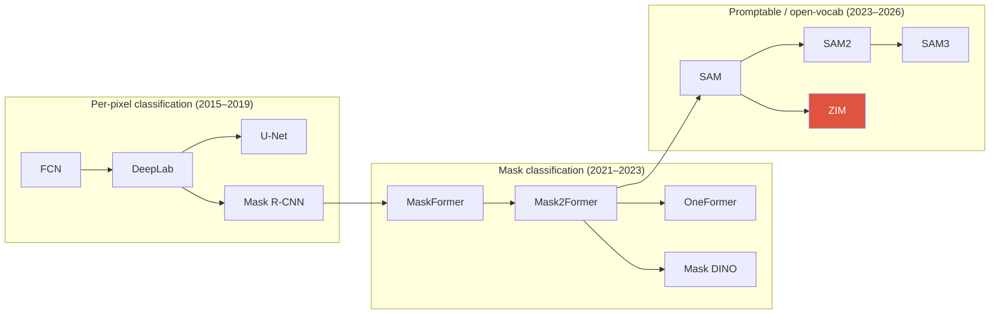

# Segmentation

semanticinstancepanopticmask classificationmIoU / PQMask2Former

> [!TIP] 이 챕터가 중요한 이유
> Segmentation은 **지원자의 홈그라운드**입니다 (DRS, BESTIE, PointWSSIS, SSUL, ECLIPSE, ZIM 전부 여기서 출발합니다). 면접관은 per-pixel classification에서 **mask classification**으로 넘어간 *패러다임 전환*, mIoU와 PQ의 차이, 그리고 soft mask(matting)가 hard mask와 갈라지는 지점을 파고들 겁니다. 정의만 나열하지 말고 계보와 trade-off로 답하세요.

## The task taxonomy in one table

| Task | Output | Instances? | `stuff` handled? | Metric |
| --- | --- | --- | --- | --- |
| **Semantic** | per-pixel class map | no (same class merges) | yes | mIoU |
| **Instance** | per-object masks | yes (things only) | no | mask AP (COCO) |
| **Panoptic** | (class, instance-id) per pixel | things yes, stuff merged | yes | PQ = SQ × RQ |
| **Promptable / foundation** | prompt → mask (class-agnostic) | per-prompt | n/a | mIoU / boundary / SAD |

- **stuff** = 형태가 불분명하고 셀 수 없는 영역 (sky, road, grass); **things** = 셀 수 있는 객체 (person, car).
- Panoptic은 이 둘을 통합합니다: 모든 픽셀이 정확히 하나의 `(class, id)`를 받고 겹침이 없습니다 — "완전한 scene parse"입니다.

## 1 · The two paradigms

Per-pixel classification

FCN, DeepLab, U-Net, PSPNet. 모든 픽셀은 <code>C</code>개 클래스에 대한 softmax를 통해 독립적으로 클래스가 할당됩니다. 단순하고 dense하지만, 같은 클래스의 <b>겹치는 instance를 분리하지 못하고</b> 마지막 레이어에 고정된 클래스 vocabulary를 강제합니다.

Mask classification

MaskFormer / Mask2Former. <code>N</code>개의 binary <b>mask</b>를 예측하고 각각에 클래스 레이블을 붙입니다 (set prediction). <i>where</i>(mask)와 <i>what</i>(label)을 분리 → 하나의 architecture로 semantic, instance, panoptic을 모두 처리합니다. 현재 지배적인 패러다임입니다.

Mask-classification의 통찰 (MaskFormer, NeurIPS 2021): per-pixel loss는 mask 예측의 특수한 경우일 뿐입니다. `N`개의 query가 각각 mask + class를 내보내고 이를 bipartite matching (DETR 스타일)으로 ground truth와 매칭하면, instance 분리를 *공짜로* 얻고 하나의 모델로 세 가지 task를 모두 할 수 있습니다.

## 2 · Classic lineage (know the mechanisms, not just names)

<dl class="kv">
<dt>FCN (2015)</dt><dd>classifier의 fully-connected head를 <b>1×1 convs</b>로 교체 → dense per-pixel 예측; <b>skip connection</b>으로 coarse-semantic feature와 fine-spatial feature를 결합합니다. dense labeling의 시초.</dd>
<dt>U-Net (2015)</dt><dd>모든 scale에서 <b>skip connection</b>을 갖는 대칭 encoder–decoder; medical / low-data segmentation을 장악합니다. 그 decoder 패턴은 (diffusion U-Net 포함) 곳곳에서 다시 등장합니다.</dd>
<dt>DeepLab v1→v3+</dt><dd><b>Atrous (dilated) convolution</b>으로 해상도를 잃지 않으면서 receptive field를 키우고; <b>ASPP</b> (atrous spatial pyramid pooling)로 multi-scale context를 잡습니다; v3+는 더 선명한 경계를 위해 decoder를 추가합니다.</dd>
<dt>PSPNet</dt><dd><b>Pyramid pooling</b> 모듈이 여러 region scale에서 global context를 집계합니다.</dd>
<dt>Mask R-CNN (2017)</dt><dd>Faster R-CNN + mask branch + <b>RoIAlign</b>. 수년간 사실상 표준이던 two-stage instance segmenter. per-RoI mask head.</dd>
</dl>

> [!QUESTION] "Why does Mask R-CNN need RoIAlign, not RoIPool?"
> **Short:** RoIPool은 RoI 좌표를 두 번 quantize (region→bin)하여 feature를 최대 한 stride만큼 어긋나게 합니다; mask는 공간적으로 정밀하므로 이게 해롭습니다. **Deep:** RoIAlign은 반올림 없이 **정확한 float 좌표에서 bilinear sampling**을 사용해 sub-pixel alignment를 보존합니다. Box AP는 이 misalignment에 꽤 관대하지만 mask AP는 크게 뛰어오릅니다 — 전형적인 "metric이 설계를 결정한다"는 이야기입니다.

## 3 · Mask classification, in depth

MaskFormer / **Mask2Former**는 query `i`마다 class distribution $p_i \in \Delta^{C+1}$ ("no-object" $\varnothing$ 포함)과 mask embedding $\mathbf{e}_i$를 만들어냅니다. mask는 per-pixel embedding $\mathbf{F}$와의 dot product입니다:

$$\hat{m}_i = \sigma(\mathbf{e}_i \cdot \mathbf{F}) \in [0,1]^{H\times W}$$

학습은 **Hungarian matching**으로 `N`개 예측을 ground-truth segment에 매칭한 뒤, 매칭별 loss를 적용합니다:

$$\mathcal{L} = \lambda_{\text{cls}}\,\mathcal{L}_{\text{CE}}(p, c) + \lambda_{\text{dice}}\,\mathcal{L}_{\text{dice}}(\hat m, m) + \lambda_{\text{ce}}\,\mathcal{L}_{\text{mask-BCE}}(\hat m, m)$$

Mask2Former가 MaskFormer 대비 핵심적으로 개선한 점은 **masked attention**입니다: transformer decoder에서 각 query의 cross-attention이 *자신의 현재 mask 예측의 foreground 영역으로 제한*됩니다. 이는 attention을 국소화하고, 수렴을 빠르게 하며, 정확도를 끌어올립니다. **OneFormer**는 task token을 추가해 한 세트의 weight로 세 task를 함께 처리하고; **Mask DINO**는 DINO decoder에서 detection + segmentation을 통합합니다.

> [!NOTE] Interview link
> Mask2Former는 **ECLIPSE의 backbone**입니다 (continual panoptic). 그 query 구조가 바로 "step마다 prompt를 추가하고 query 출력을 집계"하는 것을 자연스럽게 만듭니다 — [ECLIPSE deep-dive](#/resume/eclipse) 참고.

## 4 · Metrics: mIoU vs PQ

**mIoU** (semantic): 클래스별 intersection-over-union을 클래스에 대해 평균한 값.

$$\text{IoU}_c = \frac{TP_c}{TP_c + FP_c + FN_c}, \qquad \text{mIoU} = \frac{1}{C}\sum_c \text{IoU}_c$$

**PQ** (panoptic, Kirillov et al. CVPR 2019)는 recognition과 mask quality를 분리합니다. 예측 segment와 ground-truth segment는 IoU > 0.5일 때만 매칭됩니다 (증명 가능하게 최대 하나인 *유일한* 매칭):

$$\mathrm{PQ}=\underbrace{\frac{\sum_{(p,g)\in TP}\mathrm{IoU}(p,g)}{|TP|}}_{\mathrm{SQ}\ (\text{mask quality})}\times\underbrace{\frac{|TP|}{|TP|+\tfrac12|FP|+\tfrac12|FN|}}_{\mathrm{RQ}\ (\text{an F}_1)}$$

<figure>
<svg viewBox="0 0 640 150" xmlns="http://www.w3.org/2000/svg" font-family="Inter, sans-serif" font-size="12">
  <rect x="20" y="40" width="150" height="70" rx="8" fill="none" stroke="#0ea5e9" stroke-width="2"/>
  <text x="95" y="30" text-anchor="middle" fill="#0ea5e9">SQ = mean IoU of matches</text>
  <text x="95" y="80" text-anchor="middle" fill="#6b7686">"are the masks tight?"</text>
  <text x="200" y="80" text-anchor="middle" fill="#e0533f" font-size="20">×</text>
  <rect x="240" y="40" width="170" height="70" rx="8" fill="none" stroke="#12a150" stroke-width="2"/>
  <text x="325" y="30" text-anchor="middle" fill="#12a150">RQ = F₁ over segments</text>
  <text x="325" y="80" text-anchor="middle" fill="#6b7686">"did we detect them?"</text>
  <text x="440" y="80" text-anchor="middle" fill="#e0533f" font-size="20">=</text>
  <rect x="470" y="40" width="150" height="70" rx="8" fill="#e0533f"/>
  <text x="545" y="80" text-anchor="middle" fill="#fff" font-size="16">PQ</text>
</svg>
<figcaption>PQ는 mask quality (SQ)와 detection quality (RQ)로 분해됩니다. High SQ + low RQ = 엉뚱하거나 놓친 객체 위의 예쁜 mask — continual learning이 background shift를 통해 유발하는 실패 모드입니다.</figcaption>
</figure>

> [!QUESTION] "Why is PQ stricter than mIoU?"
> mIoU는 클래스별로 픽셀을 모으므로, instance가 서로 뭉개져도 *대체로* 맞는 클래스는 좋은 점수를 받습니다. PQ는 **IoU > 0.5에서의 instance-level bipartite match**를 요구합니다; 놓치면 온전한 FN, 헛된 segment는 온전한 FP이고 각각 RQ에서 절반씩 가중됩니다. 그래서 PQ는 mIoU가 숨기는 recognition 오류를 처벌합니다. [mAP & mIoU](#/ml-coding/metrics-map-miou)도 참고.

## 5 · Losses cheat-sheet

| Loss | Form | Good for | Watch out |
| --- | --- | --- | --- |
| Cross-entropy | per-pixel softmax | semantic baseline | class imbalance |
| Weighted / OHEM CE | reweight rare/hard pixels | imbalance | tuning |
| **Dice** | $1-\frac{2\sum \hat m m}{\sum \hat m + \sum m}$ | overlap, imbalance | unstable on tiny masks |
| Focal | $(1-p_t)^\gamma$ CE | dense hard-neg | γ tuning; see [Detection](#/cv/detection) |
| Boundary / Grad | gradient agreement | crisp edges | needs sharp GT |
| Lovász-softmax | direct IoU surrogate | mIoU optimization | slower |

Mask2Former는 point-sampled 위치에서 **Dice + mask-BCE**를 (dense보다 저렴함) 사용하고 여기에 classification CE를 더합니다. Boundary-aware 항은 matting 수준의 경계로 밀어붙일 때 가장 중요합니다 — [Image Matting](#/cv/matting) 참고.

## 6 · 2025–2026 frontier

- **Promptable / concept segmentation.** **SAM** (2023, promptable class-agnostic mask) → **SAM 2** (2024, streaming video memory) → **SAM 3** (Meta, Nov 2025): **Promptable Concept Segmentation (PCS)** — 짧은 명사구나 exemplar가 open-vocabulary detect + segment + track을 구동하며, *recognition*(이 concept이 존재하는가?)과 *localization*(어디에?)을 분리하는 **presence head**를 갖습니다. 전체 계보는 [Vision Foundation Models](#/cv/foundation-models)에.
- **Frozen SSL backbones for dense tasks.** **DINOv3** (Meta, Aug 2025, 7B, 완전 self-supervised)는 전용 dense-task 모델을 능가하는 frozen feature를 만들어냅니다; **Gram anchoring**이 긴 학습에서 dense-feature 저하를 막습니다.
- **Open-vocabulary segmentation.** CLIP/SigLIP text alignment + mask decoder (OpenSeg, SEEM, ODISE, Grounded-SAM); novel-class mIoU로 평가합니다.
- **Matting-grade quality.** SAM의 거친 경계가 **ZIM** (ICCV 2025 Highlight)의 동기가 되었는데, SAM의 promptable interface는 유지하되 soft $\alpha$를 출력합니다 — [ZIM deep-dive](#/resume/zim) 참고.

## 7 · Q&A

What changed to make "one model, all three tasks" possible?

**Short:** per-pixel classification에서 **set prediction 기반 mask classification**으로의 전환.

**Deep:** Hungarian assignment로 매칭된 (mask, class) 쌍의 *집합*을 예측하고 나면, task 간 유일한 차이는 post-processing입니다: semantic은 같은 클래스 mask를 병합하고, instance는 things를 분리해 유지하며, panoptic은 confidence로 겹침을 해소합니다. MaskFormer가 이를 보였고; Mask2Former가 masked attention으로 정확하고 빠르게 만들었으며; OneFormer가 task token으로 하나의 학습된 모델로 만들었습니다.

When would you still reach for Mask R-CNN or DeepLab in 2026?

**Short:** 빠듯한 latency/compute 예산, 소규모 팀, 또는 peak AP보다 성숙한 학습 recipe가 더 중요할 때.

**Deep:** query-based transformer는 더 무겁고 수렴이 느릴 수 있으며 더 세심한 학습이 필요합니다. 잘 튜닝된 Mask R-CNN이나 DeepLabv3+는 믿을 만한 production baseline이고, ONNX/TensorRT로 깔끔하게 export되며, 디버깅이 쉽습니다. on-device라면 가벼운 FCN/U-Net head를 쓰겠습니다 — [On-Device Seg](#/resume/on-device-segmentation) 참고 (~10ms mobile CPU).

How do query count and "no-object" interact?

**Short:** query가 너무 적으면 → 객체를 놓칩니다 (FN); $\varnothing$ 클래스가 사용되지 않은 query를 흡수합니다.

**Deep:** `N`개 query는 각각 GT segment에 매칭되거나 $\varnothing$에 할당됩니다. `N`은 이미지당 최대 객체 수를 넘어야 합니다. continual 환경에서는 step마다 query를 *늘려서* (ECLIPSE는 $N^t \approx |\mathcal{C}^t|$, 최소 10을 사용) 기존 query를 건드리지 않고 새 클래스에 capacity를 줍니다.

### Follow-ups you should expect
- *"Panoptic on COCO vs ADE20K — why is ADE20K harder?"* ADE20K가 더 dense하고 (이미지당 클래스/instance가 훨씬 많음) stuff 비중이 커서 RQ에 부담을 줍니다.
- *"SQ high, RQ low — diagnose it."* mask는 tight하지만 segment를 놓치거나 잘못 레이블링하고 있는 것 — continual learning에서 background/no-object drift의 특징입니다.
- *"Boundary IoU vs mask IoU?"* Boundary IoU는 경계 주변의 띠만 평가합니다; 미세 구조가 중요할 때 정직한 metric이며 matting metric(SAD/Grad)으로 가는 다리입니다.

## Cheat-sheet

| Concept | One-liner |
| --- | --- |
| mIoU | mean per-class IoU (semantic) |
| PQ = SQ × RQ | instance-aware; mask quality × detection F₁ |
| Per-pixel vs mask-cls | independent softmax vs matched (mask, class) set |
| Masked attention | Mask2Former restricts cross-attn to current mask → faster convergence |
| RoIAlign | bilinear, no quantization → sub-pixel masks |
| stuff vs things | uncountable regions vs countable objects |
| Promptable seg | point/box/text → class-agnostic mask (SAM→SAM3) |
| Background shift | in continual/weak seg, old/future classes collapse into bg |

**Related:** [Object Detection](#/cv/detection) · [Image Matting](#/cv/matting) · [Weak & Semi-Supervised](#/cv/weak-semi-supervised) · [Continual Learning](#/cv/continual-learning) · [Vision Foundation Models](#/cv/foundation-models) · [ZIM deep-dive](#/resume/zim) · [ECLIPSE deep-dive](#/resume/eclipse) · [mAP & mIoU](#/ml-coding/metrics-map-miou)
