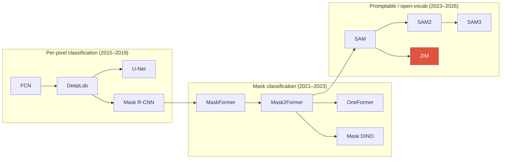

# Segmentation

semanticinstancepanopticmask classificationmIoU / PQMask2Former

> [!TIP] Why this chapter matters
> Segmentation is the **candidate's home turf** (DRS, BESTIE, PointWSSIS, SSUL, ECLIPSE, ZIM all start here). Expect an interviewer to probe the *paradigm shift* from per-pixel classification to **mask classification**, the difference between mIoU and PQ, and where soft masks (matting) diverge from hard masks. Answer with lineage and trade-offs, not just definitions.

## The task taxonomy in one table

| Task | Output | Instances? | `stuff` handled? | Metric |
| --- | --- | --- | --- | --- |
| **Semantic** | per-pixel class map | no (same class merges) | yes | mIoU |
| **Instance** | per-object masks | yes (things only) | no | mask AP (COCO) |
| **Panoptic** | (class, instance-id) per pixel | things yes, stuff merged | yes | PQ = SQ × RQ |
| **Promptable / foundation** | prompt → mask (class-agnostic) | per-prompt | n/a | mIoU / boundary / SAD |

- **stuff** = amorphous, uncountable regions (sky, road, grass); **things** = countable objects (person, car).
- Panoptic unifies the two: every pixel gets exactly one `(class, id)`, no overlaps — the "complete scene parse."

## 1 · The two paradigms

Per-pixel classification

FCN, DeepLab, U-Net, PSPNet. Every pixel is independently assigned a class via a softmax over <code>C</code> classes. Simple, dense, but <b>cannot separate overlapping instances</b> of the same class and forces a fixed class vocabulary into the final layer.

Mask classification

MaskFormer / Mask2Former. Predict <code>N</code> binary <b>masks</b>, each with a class label (set prediction). Decouples <i>where</i> (mask) from <i>what</i> (label) → one architecture handles semantic, instance, and panoptic. Now the dominant paradigm.

The mask-classification insight (MaskFormer, NeurIPS 2021): a per-pixel loss is a special case of predicting masks. If you let `N` queries each emit a mask + class and match them to ground truth with bipartite matching (DETR-style), you get instance separation *for free* and can do all three tasks with one model.

## 2 · Classic lineage (know the mechanisms, not just names)

<dl class="kv">
<dt>FCN (2015)</dt><dd>Replaced the classifier's fully-connected head with <b>1×1 convs</b> → dense per-pixel prediction; <b>skip connections</b> fuse coarse-semantic and fine-spatial features. The founding idea of dense labeling.</dd>
<dt>U-Net (2015)</dt><dd>Symmetric encoder–decoder with <b>skip connections</b> at every scale; dominates medical / low-data segmentation. Its decoder pattern reappears everywhere (incl. diffusion U-Nets).</dd>
<dt>DeepLab v1→v3+</dt><dd><b>Atrous (dilated) convolution</b> enlarges receptive field without losing resolution; <b>ASPP</b> (atrous spatial pyramid pooling) captures multi-scale context; v3+ adds a decoder for sharper boundaries.</dd>
<dt>PSPNet</dt><dd><b>Pyramid pooling</b> module aggregates global context at multiple region scales.</dd>
<dt>Mask R-CNN (2017)</dt><dd>Faster R-CNN + a mask branch + <b>RoIAlign</b>. The de-facto two-stage instance segmenter for years. Per-RoI mask head.</dd>
</dl>

> [!QUESTION] "Why does Mask R-CNN need RoIAlign, not RoIPool?"
> **Short:** RoIPool quantizes RoI coordinates twice (region→bins), misaligning features by up to a stride; masks are spatially precise so this hurts. **Deep:** RoIAlign uses **bilinear sampling at exact float coordinates** with no rounding, preserving sub-pixel alignment. Box AP is fairly tolerant of the misalignment, but mask AP jumps — a classic "the metric decides the design" story.

## 3 · Mask classification, in depth

MaskFormer / **Mask2Former** produce, per query `i`: a class distribution $p_i \in \Delta^{C+1}$ (including a "no-object" $\varnothing$) and a mask embedding $\mathbf{e}_i$. The mask is a dot product with the per-pixel embedding $\mathbf{F}$:

$$\hat{m}_i = \sigma(\mathbf{e}_i \cdot \mathbf{F}) \in [0,1]^{H\times W}$$

Training matches the `N` predictions to ground-truth segments via **Hungarian matching**, then applies a per-match loss:

$$\mathcal{L} = \lambda_{\text{cls}}\,\mathcal{L}_{\text{CE}}(p, c) + \lambda_{\text{dice}}\,\mathcal{L}_{\text{dice}}(\hat m, m) + \lambda_{\text{ce}}\,\mathcal{L}_{\text{mask-BCE}}(\hat m, m)$$

Mask2Former's key upgrade over MaskFormer is **masked attention**: in the transformer decoder, each query's cross-attention is *restricted to the foreground region of its own current mask prediction*. This localizes attention, speeds convergence, and lifts accuracy. **OneFormer** adds a task token so one set of weights serves all three tasks jointly; **Mask DINO** unifies detection + segmentation in a DINO decoder.

> [!NOTE] Interview link
> Mask2Former is the **backbone of ECLIPSE** (continual panoptic). Its query structure is exactly what makes "add prompts per step, aggregate query outputs" natural — see the [ECLIPSE deep-dive](#/resume/eclipse).

## 4 · Metrics: mIoU vs PQ

**mIoU** (semantic): per-class intersection-over-union, averaged over classes.

$$\text{IoU}_c = \frac{TP_c}{TP_c + FP_c + FN_c}, \qquad \text{mIoU} = \frac{1}{C}\sum_c \text{IoU}_c$$

**PQ** (panoptic, Kirillov et al. CVPR 2019) factorizes recognition and mask quality. A predicted and ground-truth segment match iff IoU > 0.5 (a *unique* match, provably at most one):

$$\mathrm{PQ}=\underbrace{\frac{\sum_{(p,g)\in TP}\mathrm{IoU}(p,g)}{|TP|}}_{\mathrm{SQ}\ (\text{mask quality})}\times\underbrace{\frac{|TP|}{|TP|+\tfrac12|FP|+\tfrac12|FN|}}_{\mathrm{RQ}\ (\text{an F}_1)}$$

<figure>
<svg viewBox="0 0 640 150" xmlns="http://www.w3.org/2000/svg" font-family="Inter, sans-serif" font-size="12">
  <rect x="20" y="40" width="150" height="70" rx="8" fill="none" stroke="#0ea5e9" stroke-width="2"/>
  <text x="95" y="30" text-anchor="middle" fill="#0ea5e9">SQ = mean IoU of matches</text>
  <text x="95" y="80" text-anchor="middle" fill="#6b7686">"are the masks tight?"</text>
  <text x="200" y="80" text-anchor="middle" fill="#e0533f" font-size="20">×</text>
  <rect x="240" y="40" width="170" height="70" rx="8" fill="none" stroke="#12a150" stroke-width="2"/>
  <text x="325" y="30" text-anchor="middle" fill="#12a150">RQ = F₁ over segments</text>
  <text x="325" y="80" text-anchor="middle" fill="#6b7686">"did we detect them?"</text>
  <text x="440" y="80" text-anchor="middle" fill="#e0533f" font-size="20">=</text>
  <rect x="470" y="40" width="150" height="70" rx="8" fill="#e0533f"/>
  <text x="545" y="80" text-anchor="middle" fill="#fff" font-size="16">PQ</text>
</svg>
<figcaption>PQ decomposes into mask quality (SQ) and detection quality (RQ). High SQ + low RQ = pretty masks on the wrong/missing objects — the failure mode continual learning induces via background shift.</figcaption>
</figure>

> [!QUESTION] "Why is PQ stricter than mIoU?"
> mIoU pools pixels per class, so a class that is *mostly* right scores well even if instances bleed together. PQ requires an **instance-level bipartite match at IoU > 0.5**; a miss is a full FN and a spurious segment a full FP, each half-weighted in RQ. So PQ punishes recognition errors that mIoU hides. See also [mAP & mIoU](#/ml-coding/metrics-map-miou).

## 5 · Losses cheat-sheet

| Loss | Form | Good for | Watch out |
| --- | --- | --- | --- |
| Cross-entropy | per-pixel softmax | semantic baseline | class imbalance |
| Weighted / OHEM CE | reweight rare/hard pixels | imbalance | tuning |
| **Dice** | $1-\frac{2\sum \hat m m}{\sum \hat m + \sum m}$ | overlap, imbalance | unstable on tiny masks |
| Focal | $(1-p_t)^\gamma$ CE | dense hard-neg | γ tuning; see [Detection](#/cv/detection) |
| Boundary / Grad | gradient agreement | crisp edges | needs sharp GT |
| Lovász-softmax | direct IoU surrogate | mIoU optimization | slower |

Mask2Former uses **Dice + mask-BCE** on point-sampled locations (cheaper than dense) plus classification CE. Boundary-aware terms matter most when you push toward matting-grade edges — see [Image Matting](#/cv/matting).

## 6 · 2025–2026 frontier

- **Promptable / concept segmentation.** **SAM** (2023, promptable class-agnostic masks) → **SAM 2** (2024, streaming video memory) → **SAM 3** (Meta, Nov 2025): **Promptable Concept Segmentation (PCS)** — a short noun phrase or exemplar drives open-vocabulary detect + segment + track, with a **presence head** that decouples *recognition* (is this concept present?) from *localization* (where?). Full lineage in [Vision Foundation Models](#/cv/foundation-models).
- **Frozen SSL backbones for dense tasks.** **DINOv3** (Meta, Aug 2025, 7B, fully self-supervised) produces frozen features that beat specialized dense-task models; **Gram anchoring** prevents dense-feature degradation over long training.
- **Open-vocabulary segmentation.** CLIP/SigLIP text alignment + a mask decoder (OpenSeg, SEEM, ODISE, Grounded-SAM); evaluated by novel-class mIoU.
- **Matting-grade quality.** SAM's coarse boundaries motivated **ZIM** (ICCV 2025 Highlight), which keeps SAM's promptable interface but outputs soft $\alpha$ — see the [ZIM deep-dive](#/resume/zim).

## 7 · Q&A

What changed to make "one model, all three tasks" possible?

**Short:** the move from per-pixel classification to **mask classification with set prediction**.

**Deep:** once you predict a *set* of (mask, class) pairs matched by Hungarian assignment, the only difference between tasks is post-processing: semantic merges same-class masks, instance keeps things separate, panoptic resolves overlaps by confidence. MaskFormer showed this; Mask2Former made it accurate and fast via masked attention; OneFormer made it a single trained model via a task token.

When would you still reach for Mask R-CNN or DeepLab in 2026?

**Short:** tight latency/compute budgets, small teams, or when a mature training recipe matters more than peak AP.

**Deep:** query-based transformers can be heavier and slower to converge, and need more careful training. A well-tuned Mask R-CNN or DeepLabv3+ is a dependable production baseline, exports cleanly to ONNX/TensorRT, and is easy to debug. For on-device I'd use a lightweight FCN/U-Net head — see [On-Device Seg](#/resume/on-device-segmentation) (~10ms mobile CPU).

How do query count and "no-object" interact?

**Short:** too few queries → missed objects (FN); the $\varnothing$ class absorbs unused queries.

**Deep:** each of `N` queries either matches a GT segment or is assigned $\varnothing$. `N` must exceed the max objects per image. In continual settings you *grow* queries per step (ECLIPSE uses $N^t \approx |\mathcal{C}^t|$, min 10) so new classes get capacity without disturbing old queries.

### Follow-ups you should expect
- *"Panoptic on COCO vs ADE20K — why is ADE20K harder?"* ADE20K is denser (many more classes/instances per image) and stuff-heavy, stressing RQ.
- *"SQ high, RQ low — diagnose it."* Masks are tight but you're missing/mislabeling segments — the signature of background/no-object drift in continual learning.
- *"Boundary IoU vs mask IoU?"* Boundary IoU evaluates only a band around edges; it's the honest metric when fine structure matters and the bridge to matting metrics (SAD/Grad).

## Cheat-sheet

| Concept | One-liner |
| --- | --- |
| mIoU | mean per-class IoU (semantic) |
| PQ = SQ × RQ | instance-aware; mask quality × detection F₁ |
| Per-pixel vs mask-cls | independent softmax vs matched (mask, class) set |
| Masked attention | Mask2Former restricts cross-attn to current mask → faster convergence |
| RoIAlign | bilinear, no quantization → sub-pixel masks |
| stuff vs things | uncountable regions vs countable objects |
| Promptable seg | point/box/text → class-agnostic mask (SAM→SAM3) |
| Background shift | in continual/weak seg, old/future classes collapse into bg |

**Related:** [Object Detection](#/cv/detection) · [Image Matting](#/cv/matting) · [Weak & Semi-Supervised](#/cv/weak-semi-supervised) · [Continual Learning](#/cv/continual-learning) · [Vision Foundation Models](#/cv/foundation-models) · [ZIM deep-dive](#/resume/zim) · [ECLIPSE deep-dive](#/resume/eclipse) · [mAP & mIoU](#/ml-coding/metrics-map-miou)
