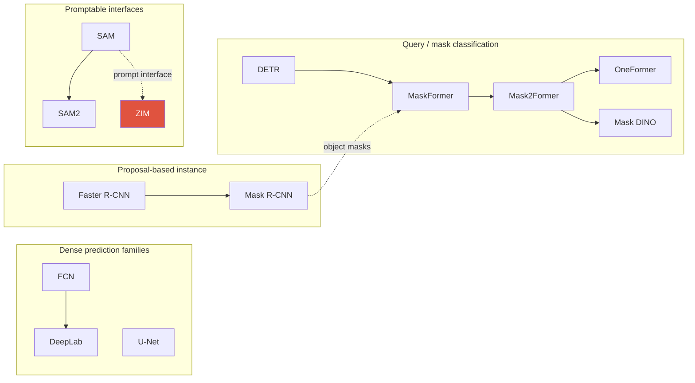

# Segmentation

> [!NOTE] Goal of this chapter
> Detection surrounds objects with **rectangles**. Segmentation goes one step further and **assigns a label to every pixel**: this pixel is a person, that pixel is road. We begin with a picture of the difference among semantic, instance, and panoptic segmentation, then cover how modern models such as Mask2Former and SAM solve them and how mIoU and PQ score the results.

Segmentation is the **home ground** of the person who created this material—ZIM, ECLIPSE, PointWSSIS, BESTIE, and more. Explaining its lineage and trade-offs clearly is therefore especially valuable.

## 1 · Three kinds of segmentation, in one picture

The scene below contains two people, sky, and road, labeled in three ways. Focus on **what differs**.

<figure>
<svg viewBox="0 0 660 210" xmlns="http://www.w3.org/2000/svg" font-family="Inter, sans-serif" font-size="12">
  <!-- semantic -->
  <text x="105" y="16" text-anchor="middle" font-weight="700" fill="#0ea5e9">Semantic</text>
  <rect x="20" y="26" width="170" height="150" rx="8" fill="none" stroke="#98a3b2"/>
  <rect x="22" y="28" width="166" height="70" fill="#0ea5e9" opacity="0.25"/><text x="105" y="60" text-anchor="middle" fill="#0ea5e9">sky</text>
  <rect x="22" y="128" width="166" height="46" fill="#12a150" opacity="0.3"/><text x="105" y="158" text-anchor="middle" fill="#12a150">road</text>
  <rect x="60" y="90" width="40" height="55" rx="6" fill="#e0533f" opacity="0.6"/><rect x="115" y="95" width="40" height="50" rx="6" fill="#e0533f" opacity="0.6"/>
  <text x="105" y="196" text-anchor="middle" fill="#98a3b2">both "person" (same color)</text>
  <!-- instance -->
  <text x="330" y="16" text-anchor="middle" font-weight="700" fill="#e0533f">Instance</text>
  <rect x="245" y="26" width="170" height="150" rx="8" fill="none" stroke="#98a3b2"/>
  <rect x="285" y="90" width="40" height="55" rx="6" fill="#e0533f" opacity="0.7"/><text x="305" y="122" text-anchor="middle" fill="#fff">1</text>
  <rect x="340" y="95" width="40" height="50" rx="6" fill="#6366f1" opacity="0.7"/><text x="360" y="124" text-anchor="middle" fill="#fff">2</text>
  <text x="330" y="196" text-anchor="middle" fill="#98a3b2">person #1 vs #2 · ignore background</text>
  <!-- panoptic -->
  <text x="555" y="16" text-anchor="middle" font-weight="700" fill="#12a150">Panoptic</text>
  <rect x="470" y="26" width="170" height="150" rx="8" fill="none" stroke="#98a3b2"/>
  <rect x="472" y="28" width="166" height="70" fill="#0ea5e9" opacity="0.25"/><text x="555" y="60" text-anchor="middle" fill="#0ea5e9">sky</text>
  <rect x="472" y="128" width="166" height="46" fill="#12a150" opacity="0.3"/><text x="555" y="158" text-anchor="middle" fill="#12a150">road</text>
  <rect x="510" y="90" width="40" height="55" rx="6" fill="#e0533f" opacity="0.7"/><text x="530" y="122" text-anchor="middle" fill="#fff">1</text>
  <rect x="565" y="95" width="40" height="50" rx="6" fill="#6366f1" opacity="0.7"/><text x="585" y="124" text-anchor="middle" fill="#fff">2</text>
  <text x="555" y="196" text-anchor="middle" fill="#98a3b2">everything + instance IDs (union)</text>
</svg>
<figcaption><b>Semantic segmentation</b>: only a class per pixel, with no object ID for instances of the same class. <b>Instance segmentation</b>: distinguish each thing, so person #1 ≠ person #2. <b>Panoptic segmentation</b>: unite both; every evaluated pixel belongs to one non-overlapping segment, and things receive instance IDs. Dataset-specific void or ignore regions are excluded from evaluation.</figcaption>
</figure>

<dl class="kv">
<dt>Stuff</dt><dd>Uncountable regions with amorphous shapes, such as sky, road, and grass.</dd>
<dt>Things</dt><dd>Countable objects such as a person, car, or dog.</dd>
</dl>

| Task | Output | Distinguishes instances? | Handles stuff? | Metric |
| --- | --- | --- | --- | --- |
| **Semantic** | per-pixel class map | no; same class merges | yes | mIoU |
| **Instance** | per-object masks | yes; things only | no | mask AP (COCO) |
| **Panoptic** | per-pixel class and ID | yes for things; stuff merges | yes | PQ = SQ × RQ |
| **Promptable interface** | prompt → mask/segment | depends on prompt and model definition | class-agnostic or concept-aware | IoU, boundary, task-specific metric |

> [!TIP] Interview one-liner
> Do not merely list definitions; explain the **change in output representation**: "A query-based **mask-classification** representation can unify a per-pixel class map with per-object masks." Not every model has been replaced by this approach. Add the distinction between mIoU and PQ and the point at which soft alpha matting diverges from a hard mask.

Because segmentation produces pixel-level output, [Upsampling & U-Net](#/cv/upsampling-unet) is essential background for restoring resolution. Implement its evaluation in [mAP & mIoU from Scratch](#/ml-coding/metrics-map-miou).

## 2 · Two paradigms

<div class="proscons"><div><div class="pros-t">Per-pixel classification</div>
FCN, DeepLab, U-Net, and PSPNet produce <code>C</code> class logits per pixel from features that share context, usually trained with pixel-wise CE. Pixel predictions are not computationally independent, but the output has no instance identity, so different objects of the same class cannot be separated. A closed-set head assumes a fixed class list.
</div><div><div class="cons-t">Mask classification</div>
MaskFormer and Mask2Former predict <code>N</code> binary <b>masks</b> and attach a class label to each one through set prediction. Separating <i>where</i> (mask) from <i>what</i> (label) lets one representation support semantic, instance, and panoptic segmentation. It is a powerful modern paradigm, but CNN pixel decoders remain useful under latency and domain constraints.
</div></div>

MaskFormer's insight is that semantic segmentation can also be represented as a set of class-labeled masks. If `N` queries each produce a mask and class and are paired with ground truth through **bipartite matching**, several segmentation tasks can share a common structure without a separate closed-set per-pixel head. Instance separation is not "free"; the query decoder, matching, and mask losses learn that structure.

## 3 · Classic lineage: know the mechanisms, not only the names



Arrows indicate only the stated influence or extension of a mechanism, not the complete direct lineage of each paper. In particular, SAM is not simply a successor to Mask2Former.

<dl class="kv">
<dt>FCN (2015)</dt><dd>Replace a classifier's fully connected head with <b>1×1 convolutions</b> for dense pixel prediction; combine coarse semantic and fine spatial information through <b>skip connections</b>. The beginning of dense labeling.</dd>
<dt>U-Net (2015)</dt><dd>A symmetric encoder–decoder with skip connections at every scale; dominant in medical and low-data segmentation. Its decoder pattern reappears throughout diffusion and elsewhere. See [Upsampling & U-Net](#/cv/upsampling-unet).</dd>
<dt>DeepLab v1→v3+</dt><dd><b>Atrous, or dilated, convolution</b> enlarges the receptive field without reducing resolution; <b>ASPP</b> captures multi-scale context; v3+ adds a decoder for boundaries.</dd>
<dt>PSPNet</dt><dd><b>Pyramid pooling</b> aggregates global context over several region scales.</dd>
<dt>Mask R-CNN (2017)</dt><dd>Faster R-CNN + a mask branch + <b>RoIAlign</b>. The de facto two-stage instance-segmentation standard for years.</dd>
</dl>

> [!QUESTION] "Why does Mask R-CNN need RoIAlign rather than RoIPool?"
> **Short:** RoIPool quantizes the RoI boundary and bins, which can break alignment between input coordinates and features; masks are sensitive to this error. **Deep:** RoIAlign does not round RoI or bin boundaries and uses bilinear interpolation at defined sample points. Both box and mask metrics can be affected, but pixel masks benefit most directly from improved alignment.

## 4 · Mask classification, in depth

For each query `i`, MaskFormer and **Mask2Former** produce a class distribution $p_i \in \Delta^{C+1}$, including a "no-object" class $\varnothing$, and mask embedding $\mathbf{e}_i$. The mask is a dot product with per-pixel embedding $\mathbf{F}$:

$$\hat{m}_i = \sigma(\mathbf{e}_i \cdot \mathbf{F}) \in [0,1]^{H\times W}$$

Training uses **Hungarian matching** to pair the `N` predictions with ground-truth segments, then applies losses to matched pairs:

$$\mathcal{L} = \lambda_{\text{cls}}\,\mathcal{L}_{\text{CE}}(p, c) + \lambda_{\text{dice}}\,\mathcal{L}_{\text{dice}}(\hat m, m) + \lambda_{\text{ce}}\,\mathcal{L}_{\text{mask-BCE}}(\hat m, m)$$

> **PyTorch-style pseudocode—from queries to a semantic map**

```python
pixel = pixel_decoder(features)                    # [B,D,H,W]
query = transformer_decoder(features)              # [B,N,D]
mask_logits = torch.einsum("bnd,bdhw->bnhw", query, pixel)
class_logits = class_head(query)                    # [B,N,C+1], + no-object

costs = build_cost_per_image(class_logits, mask_logits, targets)  # one [N,M_b] per image
match = [hungarian(cost.detach()) for cost in costs]
loss = matched_class_loss(class_logits, match) \
     + matched_mask_loss(mask_logits, targets, match)

# Semantic inference: discard no-object and sum query contributions by class
class_prob = class_logits.softmax(-1)[..., :-1]     # [B,N,C]
mask_prob = mask_logits.sigmoid()                    # [B,N,H,W]
semantic_score = torch.einsum("bnc,bnhw->bchw", class_prob, mask_prob)
```

Mask2Former's key improvement is **masked attention**: each query's cross-attention in the Transformer decoder is restricted to the foreground of its current mask prediction. This localizes attention, accelerates convergence, and improves accuracy. **OneFormer** uses a task token to handle three tasks with one set of weights; **Mask DINO** unifies detection and segmentation in a DINO decoder.

> [!NOTE] Resume connection
> Mask2Former is the **backbone of ECLIPSE** for continual panoptic segmentation. Its query structure naturally supports adding prompts at each step and aggregating query output. See the [ECLIPSE deep dive](#/resume/eclipse).

## 5 · Metrics: mIoU vs PQ

**mIoU**, for semantic segmentation, averages intersection over union across classes:

$$\text{IoU}_c = \frac{TP_c}{TP_c + FP_c + FN_c}, \qquad \text{mIoU} = \frac{1}{C}\sum_c \text{IoU}_c$$

Whether $C$ includes background and whether to exclude a class absent from both ground truth and prediction—the $0/0$ case—depends on the benchmark implementation. Keep ignore labels out of the confusion matrix, and state the class set and reduction convention in the paper and code.

**PQ**, for panoptic segmentation (Kirillov et al., 2019), separates recognition quality from mask quality. A predicted and ground-truth panoptic segment of the same class match only at IoU $>0.5$. Because panoptic segments do not overlap, matching at this threshold is unique.

$$\mathrm{PQ}=\underbrace{\frac{\sum_{(p,g)\in TP}\mathrm{IoU}(p,g)}{|TP|}}_{\mathrm{SQ}\ (\text{mask quality})}\times\underbrace{\frac{|TP|}{|TP|+\tfrac12|FP|+\tfrac12|FN|}}_{\mathrm{RQ}\ (\text{F}_1)}$$

<figure>
<svg viewBox="0 0 640 150" xmlns="http://www.w3.org/2000/svg" font-family="Inter, sans-serif" font-size="12">
  <rect x="20" y="40" width="150" height="70" rx="8" fill="none" stroke="#0ea5e9" stroke-width="2"/>
  <text x="95" y="30" text-anchor="middle" fill="#0ea5e9">SQ = mean IoU of matches</text>
  <text x="95" y="80" text-anchor="middle" fill="#98a3b2">"Are the masks precise?"</text>
  <text x="200" y="80" text-anchor="middle" fill="#e0533f" font-size="20">×</text>
  <rect x="240" y="40" width="170" height="70" rx="8" fill="none" stroke="#12a150" stroke-width="2"/>
  <text x="325" y="30" text-anchor="middle" fill="#12a150">RQ = segment F₁</text>
  <text x="325" y="80" text-anchor="middle" fill="#98a3b2">"Did we find them?"</text>
  <text x="440" y="80" text-anchor="middle" fill="#e0533f" font-size="20">=</text>
  <rect x="470" y="40" width="150" height="70" rx="8" fill="#e0533f"/>
  <text x="545" y="80" text-anchor="middle" fill="#fff" font-size="16">PQ</text>
</svg>
<figcaption>PQ decomposes into mask quality over matched segments (SQ) and recognition quality (RQ). High SQ with low RQ means matched boundaries are good, but there are many misses, false positives, or misclassifications. Continual background shift is one possible cause.</figcaption>
</figure>

> [!QUESTION] "Why is PQ stricter than mIoU?"
> mIoU pools pixels by class, so instances can merge while still receiving a generally good score. PQ requires **instance-level matching at IoU > 0.5**; a miss becomes a full FN and a spurious segment a full FP, each weighted by one half in RQ. PQ therefore penalizes recognition errors that mIoU hides.

## 6 · Loss cheat sheet

| Loss | Form | Good for | Watch out |
| --- | --- | --- | --- |
| Cross-entropy | per-pixel softmax | semantic baseline | class imbalance |
| Weighted / OHEM CE | reweight rare or difficult pixels | imbalance | tuning |
| **Soft Dice** | $1-\frac{2\sum \hat m m+\epsilon}{\sum \hat m+\sum m+\epsilon}$ | overlap and imbalance | empty masks; class/batch reduction convention |
| Focal | $(1-p_t)^\gamma$ CE | dense hard negatives | tuning γ; see [Detection](#/cv/detection) |
| Boundary / gradient | gradient agreement | crisp boundaries | needs sharp GT |
| Lovász-softmax | direct IoU surrogate | mIoU optimization | slower |

Mask2Former combines **Dice + mask BCE** at sampled points, which is cheaper than evaluating every pixel, with classification CE. Boundary-aware terms become important when pushing toward matting-level boundaries. See [Image Matting](#/cv/matting).

## 7 · 2025–2026 frontier

- **Promptable and concept segmentation.** **SAM** (2023, point/box/mask prompts) → **SAM 2** (2024, streaming video) → **SAM 3** (Meta, November 2025, text/exemplar concepts): a short noun phrase or exemplar conditions open-vocabulary detection, segmentation, and tracking, with a **presence head** separating recognition and localization. **SAM 3.1** (March 2026) improves multi-object video execution through Object Multiplex. See [Vision Foundation Models](#/cv/foundation-models).
- **Frozen SSL backbones.** **DINOv3** (2025) reported strong results across several frozen dense-evaluation protocols, and **Gram anchoring** reduces the degradation of patch-level dense features during long training. This does not imply universal superiority over every domain specialist.
- **Open vocabulary.** CLIP or SigLIP text alignment plus a mask decoder, as in SEEM, ODISE, and Grounded-SAM; evaluate with novel-class mIoU.
- **Matting-level quality.** SAM's coarse boundaries motivated **ZIM**, an ICCV 2025 Highlight that preserves the promptable interface but predicts soft $\alpha$. See the [ZIM deep dive](#/resume/zim).

## 8 · Q&A

<details class="qa"><summary>What changed to make "one model, all three tasks" possible?</summary>
<div class="qa-body">

**Short:** The transition from per-pixel classification to **set-prediction-based mask classification**.

**Deep:** A set of mask and class pairs provides a common representation: semantic inference aggregates mask scores by class, instance inference preserves thing queries, and panoptic inference resolves overlaps. In practice, training datasets, matching costs, task tokens, losses, and inference thresholds can also differ, so saying "only post-processing differs" is too broad. MaskFormer, Mask2Former, and OneFormer demonstrate this unification with different recipes.
</div></details>

<details class="qa"><summary>When would you still use Mask R-CNN or DeepLab in 2026?</summary>
<div class="qa-body">

**Short:** Under a tight latency or compute budget, with a small team, or when a mature training recipe matters more than peak AP.

**Deep:** Query-based Transformers can be heavier and slower to converge and may require more careful training. A well-tuned Mask R-CNN or DeepLabv3+ is a dependable production baseline, exports cleanly through ONNX and TensorRT, and is easy to debug. On-device, use a lightweight FCN or U-Net head; see [On-Device Segmentation](#/resume/on-device-segmentation), at roughly 10 ms on a mobile CPU.
</div></details>

<details class="qa"><summary>How do query count and "no object" interact?</summary>
<div class="qa-body">

**Short:** Too few queries miss objects and cause false negatives; the $\varnothing$ class absorbs unused queries.

**Deep:** Every one of `N` queries is either matched to a ground-truth segment or assigned $\varnothing$. Under standard one-to-one matching, a target count above `N` cannot be fully matched, so set the query budget to the data. Too many queries can increase no-object imbalance and computation. Expanding prompts or queries in continual learning is one way to preserve an old path, but adding queries alone does not automatically eliminate forgetting.
</div></details>

### Expected follow-ups

- *Why is panoptic segmentation on ADE20K harder than on COCO?* ADE20K is denser, has more classes and instances per image, and contains more stuff, which pressures RQ.
- *High SQ, low RQ—diagnose it.* Masks are precise, but segments are missed or mislabeled, a signature of background drift in continual learning.
- *Boundary IoU vs mask IoU?* Boundary IoU evaluates only a band around the boundary. It is more honest when fine structure matters and bridges toward matting metrics such as SAD and gradient error.

## Cheat sheet

| Concept | In one line |
| --- | --- |
| mIoU | mean per-class IoU for semantic segmentation |
| PQ = SQ × RQ | instance-aware mask quality × detection F₁ |
| per-pixel vs mask classification | independent softmax map vs matched set of mask and class pairs |
| masked attention | Mask2Former restricts cross-attention to the current mask → faster convergence |
| RoIAlign | bilinear sampling without boundary rounding → subpixel masks |
| stuff vs things | uncountable regions vs countable objects |
| promptable/concept segmentation | SAM accepts point/box/mask prompts; the SAM 3 family also supports text/exemplar concepts |
| background shift | the meaning of background or no-object changes at each continual-segmentation step |

**Next:** [Object Detection](#/cv/detection) · [Image Matting](#/cv/matting) · [Weak & Semi-Supervised](#/cv/weak-semi-supervised) · [Continual Learning](#/cv/continual-learning) · [Vision Foundation Models](#/cv/foundation-models) · [Upsampling & U-Net](#/cv/upsampling-unet) · [mAP & mIoU](#/ml-coding/metrics-map-miou) · [ZIM deep dive](#/resume/zim) · [ECLIPSE deep dive](#/resume/eclipse)
