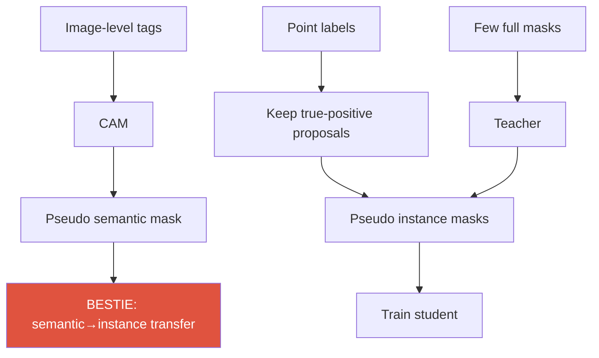
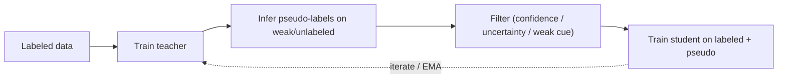

# Weak & Semi-Supervised Learning

CAMpseudo-labelspoint / box / scribbleteacher–studentconsistencylabel budget

> [!TIP] 이 챕터가 중요한 이유
> 이건 지원자의 중견 커리어를 떠받치는 축입니다: **DRS → BESTIE → PointWSSIS → WSSHM / Rethinking-Saliency**. 면접에서의 스토리는 *"label 비용 대비 성능"*입니다. 세 가지 구분을 또렷하게 장악하세요: **weak** (label *종류*가 저렴) vs **semi** (label *비율*이 작음) vs **weakly-semi** (혼합), 그리고 instance segmentation에 존재하는 **proposal bottleneck**을 값싼 point 하나가 어떻게 깨는지.

## The supervision spectrum

| Setting | Labels | Representatives |
| --- | --- | --- |
| Fully supervised | dense masks / boxes | Mask R-CNN, Mask2Former |
| **Weakly (WS)** | image-level / point / scribble / box | DRS, BESTIE, BoxInst |
| **Semi (SS)** | few full + many *unlabeled* | Mean-Teacher, CCT, FixMatch-seg |
| **Weakly-semi (WSS)** | few full + many *weak* | **PointWSSIS**, **WSSHM** |
| Self-supervised | no labels (pretext / contrastive) | DINO, MAE → see [Foundation Models](#/cv/foundation-models) |

## 1 · Label cost — always argue in ratios

절대 시간(초)은 dataset마다 다릅니다; 핵심은 *비율*입니다. 이미지당 대략적인 annotation 비용 (COCO 규모 추정, PointWSSIS appendix): full mask ≫ box > point ≈ image-level.

> [!QUESTION] "How would you spend a fixed labeling budget?"
> 초 단위를 인용하지 마세요 — **budget-vs-accuracy 곡선**을 그리세요. 소수의 full mask는 *mask shape*을 가르치고; 다수의 값싼 point는 *localization/coverage*를 가르칩니다. weakly-semi의 sweet spot은 어느 한쪽 극단에 전부 쓰는 것보다 낫습니다 (PointWSSIS Table-1의 핵심 논지).

## 2 · CAM and its limits

Class Activation Mapping: 마지막 conv feature map을 classifier의 클래스 weight로 가중 → 거친 localization heatmap.

$$M_c(x,y) = \sum_k w_k^c\, f_k(x,y)$$

WSSS pipeline: **image tags → CAM → refine → pseudo mask → segmenter 학습**. CAM의 세 가지 실패 모드가 하나의 하위 분야 전체를 이끕니다:

1. **Sparse / discriminative-only** — 가장 특징적인 부분에만 반응 (개의 얼굴, 몸통이 아님).
2. **Co-occurrence bias** — 상관된 배경에 활성화 (boat ↔ water).
3. **No instance information** — 같은 클래스 객체 둘을 분리하지 못함.

DRS (candidate, AAAI 2021)

<b>Discriminative Region Suppression</b>: 가장 두드러진 discriminative 영역을 능동적으로 억제해 활성화가 객체 전체로 <i>퍼지게</i> 함 → 더 dense하고 완전한 pseudo-mask.

BESTIE's PAM

반대 방향의 수: peak를 <i>강조</i>하여 per-instance cue를 뽑아내는 <b>Peak Attention Module</b>. "채우려면 억제" vs "분리하려면 peak" — 깔끔한 대칭 구도.

## 3 · Pseudo-labeling & self-training

teacher–student 루프와 그 핵심 위험 (confirmation bias):

- **Confirmation bias:** student가 teacher의 체계적 오류를 증폭합니다.
- **완화책:** confidence/uncertainty 필터링, **EMA teacher** (Mean-Teacher), strong-weak **consistency** (FixMatch: weak-aug pseudo-label이 strong-aug 예측을 supervise), curriculum, 그리고 — 결정적으로 — label을 고정해줄 **값싼 human oracle** (point).

> [!NOTE] Semi-seg's characteristic pain
> Class imbalance와 **noisy boundary**: pseudo-mask는 바로 경계에서 가장 신뢰도가 낮으므로, 순진한 self-training은 boundary quality를 떨어뜨립니다. Boundary-aware 필터링 / 별도 boundary loss가 도움이 됩니다.

<figure>
<svg viewBox="0 0 640 120" xmlns="http://www.w3.org/2000/svg" font-family="Inter, sans-serif" font-size="11">
  <rect x="20" y="45" width="90" height="34" rx="6" fill="#6366f1"/><text x="65" y="66" text-anchor="middle" fill="#fff">image</text>
  <path d="M110 55 C 150 40, 160 40, 190 40" stroke="#0ea5e9" stroke-width="1.5" fill="none" marker-end="url(#w)"/>
  <path d="M110 70 C 150 85, 160 85, 190 85" stroke="#e0533f" stroke-width="1.5" fill="none" marker-end="url(#w)"/>
  <text x="150" y="30" fill="#0ea5e9">weak aug</text><text x="150" y="108" fill="#e0533f">strong aug</text>
  <rect x="190" y="24" width="110" height="32" rx="6" fill="none" stroke="#0ea5e9" stroke-width="2"/><text x="245" y="44" text-anchor="middle" fill="#0ea5e9">confident pred</text>
  <rect x="190" y="70" width="110" height="32" rx="6" fill="none" stroke="#e0533f" stroke-width="2"/><text x="245" y="90" text-anchor="middle" fill="#e0533f">prediction</text>
  <path d="M300 40 C 360 40, 360 78, 300 86" stroke="#12a150" stroke-width="2" fill="none" marker-end="url(#w)"/>
  <text x="430" y="66" fill="#12a150">pseudo-label supervises the strong-aug view</text>
  <defs><marker id="w" markerWidth="8" markerHeight="8" refX="6" refY="3" orient="auto"><path d="M0 0 L6 3 L0 6" fill="#98a3b2"/></marker></defs>
</svg>
<figcaption>Consistency regularization (FixMatch 방식): weakly-augmented view에서의 confident한 예측이 strongly-augmented view의 target이 되어, decision boundary를 low-density 영역으로 밀어냅니다.</figcaption>
</figure>

## 4 · Weak vs semi vs weakly-semi

- **image tag만으로 하는 weak instance seg**는 구조적으로 instance 정보가 없음 → 역사적으로 기성 proposal (MCG)에 기댔는데 — BESTIE는 이것이 정직하게 "image-level only"가 *아니라고* 주장합니다.
- **Semi instance seg**는 소수의 full mask로부터 mask *representation*을 배울 수 있지만, unlabeled 데이터에서 proposal confidence threshold를 튜닝해야 합니다 (FN↔FP trade-off).
- **Weakly-semi (PointWSSIS)**는 소수 full mask의 *mask prior*와 값싼 *point localization*을 결합합니다 — 주장되는 budget 최적점.

## 5 · The proposal bottleneck (PointWSSIS)

> [!QUESTION] "Why does a single point unlock semi-supervised instance segmentation?"
> **Short:** instance mask는 detect된 proposal에 대해서만 존재합니다; point는 거의 공짜인 true-positive 필터입니다. **Deep:** confidence threshold를 낮추면 FP가 늘고, 높이면 FN이 늘어 — 전역적으로 이길 수 없습니다. point는 각 실제 객체를 proposal에 **매칭**하여 true positive만 남기므로, 잘 학습된 mask branch가 정확히 객체가 있는 곳에 적용됩니다. 또한 **Adaptive Pyramid-Level Selection** (point는 scale이 없으므로 arg-max confidence로 FPN level을 선택)과 **MaskRefineNet** (image + rough mask + point heatmap → clean boundary)을 구동하는데, 이는 full-label이 극도로 적은 영역에서 가장 중요합니다.

전체 방법, 결과, FN/FP 분석은 **[PointWSSIS & BESTIE deep-dive](#/resume/pointwssis-bestie)**에.

## 6 · BESTIE — semantic-to-instance transfer

**B**eyond **Se**mantic to **I**nstance: 같은 클래스 객체가 겹치지 않는다면, semantic mask는 곧 instance mask입니다. BESTIE:

1. semantic pseudo-mask 생성 (saliency-free WSSS).
2. PAM peak로 instance cue 추출; connected-component ∧ cue-count == 1인 곳을 instance pseudo-mask로 승격.
3. instance를 center + offset으로 표현 (Panoptic-DeepLab 방식).
4. **Self-refinement**으로 네트워크가 online으로 발견한 instance를 soft confidence로 down-weight하여 다시 반영.

이로써 외부 proposal generator를 피합니다 — 아래의 fairness 논점.

## 7 · Semantic drift (weak) vs background shift (continual)

같은 증상 어휘, 다른 원인:

<dl class="kv">
<dt>Semantic drift (BESTIE)</dt><dd><b>pseudo-label에서 누락된</b> instance가 background로 학습됨 → 같은 appearance가 FG와 BG로 동시에 끌려가 gradient가 충돌. 해법: instance-aware loss를 확신 있게 레이블된 영역에만 적용; self-refine으로 누락분 복구.</dd>
<dt>Background shift (continual)</dt><dd>새 클래스가 도착하면서 step마다 <b>"background"의 의미가 변함</b> — [Continual Learning](#/cv/continual-learning)이 다루는 다른 메커니즘.</dd>
</dl>

## 8 · Box, scribble, and the open-vocab connection

- **Box supervision:** tightness / projection prior (BoxInst) — mask는 box 안에 들어맞고 그 변에 닿아야 합니다. mask보다 저렴하고 point보다 풍부합니다.
- **Scribble:** sparse seed + propagation/consistency.
- **2026 twist:** open-vocabulary 시대에는 "box"가 text-prompt 기반 detector (Grounding DINO)에서 *공짜로* 나올 수 있고, mask는 SAM에서 나올 수 있습니다 — **foundation model을 자동 weak labeler로** 활용하여 weak supervision과 distillation의 경계를 흐립니다. [Detection](#/cv/detection)과 [Foundation Models](#/cv/foundation-models) 참고.

## 9 · Saliency in WSSS — a double-edged sword

Saliency map은 FG/BG 분리를 돕지만, domain shift에서 실패하고 "이게 정말 얼마나 weak한가?"를 흐리는 **외부 모델 의존성**을 들여옵니다. **Rethinking Saliency-Guided WSSS** (candidate, arXiv 2024)는 saliency가 실제로 언제 도움이 되는지를 실험적으로 재검토합니다; BESTIE는 의도적으로 saliency-free 경로를 썼습니다. "benchmark에 숨은 가정" 류의 질문에 좋은 소재입니다.

## 10 · Q&A

How do you keep a pseudo-label comparison fair?

**Short:** 같은 backbone, 같은 image pool, budget으로 정규화, 그리고 모든 외부 모델을 공개.

**Deep:** MCG proposal이나 saliency net을 쓰는 방법은 "image-level only"가 *아닙니다* — 그 supervision이 pretrained helper를 통해 새어 들어옵니다. BESTIE의 PRM/LIID 비판이 바로 이것입니다. 면접관이 fairness를 물으면 "모든 supervision 출처를 세고, annotation 비용으로 정규화"로 프레이밍하세요.

Consistency regularization — why does it work in semi-supervised seg?

**Short:** cluster/smoothness 가정을 강제합니다 — 예측은 label을 보존하는 perturbation에 대해 불변이어야 합니다.

**Deep:** strong-weak augmentation (FixMatch)은 confident한 weak-aug 예측을 strong-aug view의 target으로 써서, decision boundary를 low-density 영역으로 밀어냅니다. seg에서는 decoder/perturbed feature 간 cross-consistency (CCT)도 추가합니다. confidence threshold가 너무 낮으면 confirmation bias의 위험이 있습니다.

Point supervision's hidden failure modes?

**Short:** 잘못된 FPN level, 모호한 instance, 그리고 point 배치 편향.

**Deep:** point는 scale이 없음 → adaptive level selection; 맞닿은 두 객체가 proposal을 공유할 수 있음 → 매칭은 one-to-one이어야 함; annotator가 객체 중심 근처에 point를 몰아두는 경향 → 모델이 중심 feature에 과의존할 수 있음. PointWSSIS의 MaskRefineNet은 부분적으로 level/boundary noise를 교정하기 위해 존재합니다.

### Follow-ups
- *"WSSHM?"* Weakly-semi trimap-free **human matting** — segmentation에서 matting으로 이식한, 동일한 few-full + many-weak recipe. [Matting](#/cv/matting) 참고.
- *"Confirmation bias in one sentence?"* student가 teacher를 지나치게 신뢰해 그 오류를 증폭함 — 그러니 pseudo-label을 절대 ground truth처럼 다루지 말 것.
- *"Self-supervised vs weakly-supervised?"* Self-sup은 *label 없이* representation을 배우고 (DINO/MAE) 전이함; weakly-sup은 값싼 label로 *task*를 직접 겨냥함. 2026년에는 둘이 결합합니다: SSL backbone + weak task label.

## Cheat-sheet

| Term | One-liner |
| --- | --- |
| CAM | classifier-weighted feature heatmap; sparse, co-occurrence-biased |
| DRS | suppress discriminative region → denser CAM |
| Pseudo-label | teacher prediction used as training target |
| Confirmation bias | student amplifies teacher errors |
| EMA teacher | slowly-averaged teacher (Mean-Teacher) |
| Consistency (FixMatch) | weak-aug pseudo-label supervises strong-aug |
| Proposal bottleneck | no proposal → no instance mask |
| WSSIS | weakly-semi instance seg (few full + points) |
| Semantic drift | missing pseudo-instance trained as background |

**Related:** [Segmentation](#/cv/segmentation) · [Object Detection](#/cv/detection) · [Image Matting](#/cv/matting) · [Continual Learning](#/cv/continual-learning) · [Vision Foundation Models](#/cv/foundation-models) · [PointWSSIS & BESTIE deep-dive](#/resume/pointwssis-bestie)
