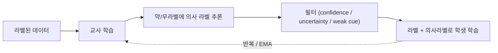

# Weak & Semi-Supervised Learning (약지도·준지도 학습)

> [!NOTE] 이 챕터의 목표
> 딥러닝은 라벨(정답)을 먹고 자랍니다. 그런데 이미지의 **모든 픽셀에 정답 마스크를 그리는 일**은 엄청나게 비쌉니다(이미지 한 장에 수십 분). 이 챕터는 "정답을 조금만, 혹은 값싼 형태로만 주고도 잘 학습시키는" 방법들을 그림과 직관으로 잡습니다. [이미지 분류](#/cv/classification)·[Segmentation](#/cv/segmentation)을 먼저 보고 오면 매끄럽습니다.

## §0 · 왜 "약지도/준지도"인가

완전 지도학습(fully supervised)은 모든 학습 이미지에 **빽빽한 정답**(픽셀 마스크, 박스)을 요구합니다. 하지만 현실에서 라벨링 예산은 유한합니다. 그래서 두 방향으로 아낍니다:

- **약지도(weak supervision):** 라벨의 *종류*를 싸게. 픽셀 마스크 대신 → 이미지 태그("고양이 있음"), 점(point) 하나, 낙서(scribble), 박스(box).
- **준지도(semi-supervised):** 라벨의 *비율*을 작게. 소수만 완전 라벨 + 다수는 **라벨 없음(unlabeled)**.
- **weakly-semi(WSS):** 둘의 혼합 — 소수 완전 라벨 + 다수 값싼 약라벨.

<figure>
<svg viewBox="0 0 640 150" xmlns="http://www.w3.org/2000/svg" font-family="Inter, sans-serif" font-size="11">
  <text x="320" y="16" text-anchor="middle" fill="#98a3b2">라벨 비용 (왼쪽=비쌈 · 오른쪽=쌈)</text>
  <!-- mask -->
  <rect x="20" y="35" width="110" height="70" rx="6" fill="none" stroke="#e0533f" stroke-width="1.8"/>
  <path d="M40 90 Q60 45 80 60 Q100 75 115 55 L115 100 L40 100 Z" fill="rgba(224,83,63,.35)" stroke="#e0533f"/>
  <text x="75" y="125" text-anchor="middle" fill="#e0533f">full mask</text><text x="75" y="140" text-anchor="middle" fill="#98a3b2">~분 단위</text>
  <!-- box -->
  <rect x="160" y="35" width="110" height="70" rx="6" fill="none" stroke="#6366f1" stroke-width="1.8"/>
  <rect x="185" y="55" width="60" height="40" fill="none" stroke="#6366f1" stroke-width="2" stroke-dasharray="4 2"/>
  <text x="215" y="125" text-anchor="middle" fill="#6366f1">box</text>
  <!-- scribble -->
  <rect x="300" y="35" width="110" height="70" rx="6" fill="none" stroke="#0ea5e9" stroke-width="1.8"/>
  <path d="M320 80 Q345 60 370 78 T395 70" fill="none" stroke="#0ea5e9" stroke-width="2.5"/>
  <text x="355" y="125" text-anchor="middle" fill="#0ea5e9">scribble</text>
  <!-- point -->
  <rect x="440" y="35" width="90" height="70" rx="6" fill="none" stroke="#12a150" stroke-width="1.8"/>
  <circle cx="485" cy="70" r="6" fill="#12a150"/>
  <text x="485" y="125" text-anchor="middle" fill="#12a150">point</text>
  <!-- tag -->
  <rect x="545" y="35" width="80" height="70" rx="6" fill="none" stroke="#12a150" stroke-width="1.8"/>
  <text x="585" y="74" text-anchor="middle" fill="#12a150" font-size="10">"고양이"</text>
  <text x="585" y="125" text-anchor="middle" fill="#12a150">tag</text>
  <text x="585" y="140" text-anchor="middle" fill="#98a3b2">~초</text>
</svg>
<figcaption>같은 객체를 가르치는 라벨의 스펙트럼. 왼쪽일수록 정보는 많지만 비싸고, 오른쪽일수록 싸지만 모호합니다. 핵심 질문은 "고정된 예산을 어디에 쓸까?"입니다.</figcaption>
</figure>

| 방식 | 라벨 | 대표 방법 |
| --- | --- | --- |
| 완전 지도 (fully) | 빽빽한 마스크/박스 | Mask R-CNN, Mask2Former |
| **약지도 (weak, WS)** | 이미지 태그 / point / scribble / box | DRS, BESTIE, BoxInst |
| **준지도 (semi, SS)** | 소수 완전 + 다수 *unlabeled* | Mean-Teacher, CCT, FixMatch-seg |
| **weakly-semi (WSS)** | 소수 완전 + 다수 *약라벨* | **PointWSSIS**, **WSSHM** |
| 자기지도 (self, SSL) | 라벨 없음 (pretext/contrastive) | DINO, MAE → [자기지도학습](#/cv/self-supervised) |

> [!TIP] 면접 한 줄
> 세 구분을 또렷하게: **weak**은 라벨 *종류*가 저렴, **semi**는 라벨 *비율*이 작음, **weakly-semi**는 둘의 혼합. 그리고 instance segmentation의 **proposal bottleneck**을 값싼 point 하나가 어떻게 깨는지(§5)를 말할 수 있으면 강합니다. (지원자 연구 축: DRS → BESTIE → PointWSSIS → WSSHM)

## 1 · 라벨 비용은 protocol과 함께 논하라

Annotation 비용 순서는 객체 수·도구·품질 기준·annotator 숙련도에 따라 달라집니다. 보통 정밀 mask가 point/tag보다 비싸지만 box와 scribble의 상대 비용도 고정되어 있지 않습니다. Pilot annotation에서 **시간, 재작업률, inter-annotator agreement, QA 비용**을 측정하고 총 예산으로 정규화하세요.

> [!QUESTION] "고정된 라벨링 예산을 어떻게 쓸 건가요?"
> 출처가 다른 초 단위를 그대로 비교하지 말고 동일 annotation tool로 **예산–정확도 곡선**을 그리세요. 소수의 full mask는 모양을, 다수의 point는 위치·instance count 단서를 줄 수 있습니다. Mixed allocation이 한쪽 극단보다 낫다는 것은 가설이며, PointWSSIS의 해당 설정처럼 budget sweep으로 확인해야 합니다.

## 2 · CAM과 그 한계

**CAM(Class Activation Mapping):** Global average pooling 뒤 linear classifier인 원래 CAM 구조에서는 마지막 conv feature map을 class weight로 가중해 spatial evidence map을 만듭니다. 이것은 “모델이 인과적으로 본 영역”의 완전한 설명이 아니라 class score에 기여하는 한 시각화입니다. 임의 architecture의 Grad-CAM은 gradient weight를 쓰므로 아래 식과 구분합니다.

$$M_c(x,y) = \sum_k w_k^c\, f_k(x,y)$$

이 히트맵을 대충의 정답 마스크(의사 라벨)로 삼아 segmenter를 학습합니다: **이미지 태그 → CAM → 정제 → 의사 마스크 → 학습.**

<figure>
<svg viewBox="0 0 640 170" xmlns="http://www.w3.org/2000/svg" font-family="Inter, sans-serif" font-size="11">
  <defs>
    <radialGradient id="heat" cx="50%" cy="50%" r="50%">
      <stop offset="0%" stop-color="#e0533f" stop-opacity="0.85"/>
      <stop offset="55%" stop-color="#d97706" stop-opacity="0.5"/>
      <stop offset="100%" stop-color="#6366f1" stop-opacity="0.05"/>
    </radialGradient>
  </defs>
  <!-- object outline (a "dog": body + head) -->
  <text x="120" y="20" text-anchor="middle" fill="#98a3b2">이상: 객체 전체</text>
  <ellipse cx="120" cy="95" rx="70" ry="35" fill="none" stroke="#12a150" stroke-width="2"/>
  <circle cx="180" cy="75" r="22" fill="none" stroke="#12a150" stroke-width="2"/>
  <text x="120" y="150" text-anchor="middle" fill="#12a150">완전한 마스크</text>
  <!-- CAM: only head lights up -->
  <text x="440" y="20" text-anchor="middle" fill="#98a3b2">실제 CAM: 가장 특징적인 부분만</text>
  <ellipse cx="400" cy="95" rx="70" ry="35" fill="none" stroke="#98a3b2" stroke-width="1.5" stroke-dasharray="4 3"/>
  <circle cx="460" cy="75" r="22" fill="none" stroke="#98a3b2" stroke-width="1.5" stroke-dasharray="4 3"/>
  <circle cx="460" cy="75" r="34" fill="url(#heat)"/>
  <text x="440" y="150" text-anchor="middle" fill="#e0533f">머리(discriminative)만 뜨겁고 몸통은 놓침</text>
</svg>
<figcaption>CAM은 "개"를 알아본 근거가 된 <b>가장 특징적인 부분(주로 얼굴)</b>만 뜨겁게 표시하고 몸통은 놓치기 쉽습니다. 이 편향을 고치는 것이 WSSS(약지도 semantic segmentation) 연구의 핵심입니다.</figcaption>
</figure>

CAM의 세 가지 실패 모드가 하나의 하위 분야를 이끕니다:

1. **Sparse / discriminative-only** — 가장 특징적인 부분에만 반응(개의 얼굴, 몸통 아님).
2. **Co-occurrence bias(동시출현 편향)** — 상관된 배경에 활성화(boat ↔ water).
3. **No instance information** — 같은 클래스 객체 둘을 분리 못 함.

<div class="proscons"><div><div class="pros-t">DRS (지원자, AAAI 2021)</div>
<b>Discriminative Region Suppression</b>: 가장 두드러진 부분을 능동적으로 <i>억제</i>해 활성화가 객체 전체로 퍼지게 함 → 더 dense하고 완전한 의사 마스크.
</div><div><div class="cons-t">BESTIE의 PAM</div>
반대 방향의 수: peak를 <i>강조</i>해 per-instance 단서를 뽑는 <b>Peak Attention Module</b>. "채우려면 억제" vs "분리하려면 peak" — 깔끔한 대칭.
</div></div>

## 3 · 의사 라벨(pseudo-label) & 자기학습(self-training)

**교사–학생(teacher–student) 루프:** 라벨된 데이터로 교사를 학습 → 교사가 라벨 없는 데이터에 예측(=의사 라벨) → 그걸로 학생을 학습. 핵심 위험은 **확증 편향(confirmation bias)**:



- **확증 편향(confirmation bias):** 학생이 교사의 체계적 오류를 그대로 증폭합니다.
- **완화책:** confidence/uncertainty 필터링, **EMA teacher**(가중치를 천천히 평균낸 교사, Mean-Teacher), strong–weak **일관성(consistency)**(FixMatch: 약증강 예측이 강증강 예측을 supervise), 그리고 결정적으로 라벨을 고정해줄 **값싼 사람 단서**(point).

<details class="concept-code"><summary>개념 코드로 보기</summary>

> **PyTorch식 pseudocode — segmentation FixMatch의 좌표 정렬**

```python
weak, weak_geom = weak_augment(unlabeled)
strong, strong_geom = strong_augment(unlabeled)
teacher.eval(); student.train()

with torch.no_grad():
    prob = teacher(weak).softmax(dim=1)             # [B,C,Hw,Ww]
    confidence, pseudo = prob.max(dim=1)
    pseudo = map_mask(pseudo, weak_geom, strong_geom)  # strong 좌표계로 이동
    valid = map_mask(confidence >= tau, weak_geom, strong_geom)

student_logits = student(strong)                    # [B,C,Hs,Ws]
pixel_loss = cross_entropy(student_logits, pseudo, reduction="none")
unsup_loss = (pixel_loss * valid).sum() / valid.sum().clamp_min(1)
loss = supervised_loss(student, labeled) + weight * unsup_loss
optimizer.zero_grad(set_to_none=True)
loss.backward(); optimizer.step()
ema_update(teacher, student)                        # teacher에는 gradient 없음
```

</details>

> [!NOTE] 준지도 segmentation의 고질병
> 클래스 불균형과 **noisy boundary**: 의사 마스크는 경계·작은 객체에서 불확실한 경우가 많아 순진한 self-training이 오류를 증폭할 수 있습니다. Confidence가 실제 correctness와 보정되어 있는지 확인하고, ignore band·uncertainty filtering·boundary loss를 ablation합니다.

<figure>
<svg viewBox="0 0 640 120" xmlns="http://www.w3.org/2000/svg" font-family="Inter, sans-serif" font-size="11">
  <rect x="20" y="45" width="90" height="34" rx="6" fill="#6366f1"/><text x="65" y="66" text-anchor="middle" fill="#fff">image</text>
  <path d="M110 55 C 150 40, 160 40, 190 40" stroke="#0ea5e9" stroke-width="1.5" fill="none" marker-end="url(#w)"/>
  <path d="M110 70 C 150 85, 160 85, 190 85" stroke="#e0533f" stroke-width="1.5" fill="none" marker-end="url(#w)"/>
  <text x="150" y="30" fill="#0ea5e9">약증강(weak)</text><text x="150" y="108" fill="#e0533f">강증강(strong)</text>
  <rect x="190" y="24" width="110" height="32" rx="6" fill="none" stroke="#0ea5e9" stroke-width="2"/><text x="245" y="44" text-anchor="middle" fill="#0ea5e9">confident 예측</text>
  <rect x="190" y="70" width="110" height="32" rx="6" fill="none" stroke="#e0533f" stroke-width="2"/><text x="245" y="90" text-anchor="middle" fill="#e0533f">예측</text>
  <path d="M300 40 C 360 40, 360 78, 300 86" stroke="#12a150" stroke-width="2" fill="none" marker-end="url(#w)"/>
  <text x="430" y="66" fill="#12a150">약증강 의사라벨이 강증강 예측을 supervise</text>
  <defs><marker id="w" markerWidth="8" markerHeight="8" refX="6" refY="3" orient="auto"><path d="M0 0 L6 3 L0 6" fill="#98a3b2"/></marker></defs>
</svg>
<figcaption>FixMatch식 일관성 정칙화: 약하게 증강한 뷰의 thresholded 예측을 강한 뷰의 target으로 사용합니다. Segmentation에서는 crop/flip 좌표를 target mask에도 맞춰야 합니다. 저밀도 결정경계 해석은 cluster assumption에 의존합니다.</figcaption>
</figure>

## 4 · weak vs semi vs weakly-semi

- **이미지 태그만으로 하는 weak instance seg**는 구조적으로 instance 정보가 없음 → 역사적으로 기성 proposal(MCG)에 기댔는데, BESTIE는 이것이 정직하게 "image-level only"가 *아니라고* 지적합니다.
- **Semi instance seg**는 소수 full mask로 마스크 *표현*은 배우지만, unlabeled에서 proposal confidence threshold를 튜닝해야 함(FN↔FP 트레이드오프).
- **Weakly-semi (PointWSSIS)는** 소수 full mask의 *마스크 사전지식*과 값싼 *point 위치*를 결합 — 주장되는 예산 최적점.

## 5 · Proposal bottleneck (PointWSSIS)

> [!QUESTION] "왜 point 하나가 준지도 instance segmentation을 푸는가?"
> **짧게:** proposal 기반 방법에서는 proposal miss가 mask miss가 됩니다. 객체마다 정확한 point가 하나 있다는 annotation contract라면 point–proposal matching으로 candidate를 강하게 걸러낼 수 있습니다. **깊게:** confidence threshold의 FP/FN trade-off에 spatial cue를 더하는 것입니다. 그러나 point 누락·중복·경계 click, 한 point를 포함하는 여러 객체, 잘못된 proposal이면 true-positive를 보장하지 않습니다. PointWSSIS는 이 설정에서 Adaptive Pyramid-Level Selection과 MaskRefineNet으로 scale/boundary ambiguity를 다룹니다.

전체 방법·결과·FN/FP 분석은 **[PointWSSIS & BESTIE 딥다이브](#/resume/pointwssis-bestie)**.

## 6 · BESTIE — semantic→instance 전이

**B**eyond **Se**mantic **t**o **I**nstance: 같은 클래스 객체가 겹치지 않는다면 semantic mask가 곧 instance mask입니다. BESTIE는:

1. semantic 의사 마스크 생성(saliency-free WSSS).
2. PAM peak로 instance 단서 추출; connected-component ∧ (단서 개수 == 1)인 곳을 instance 의사 마스크로 승격.
3. instance를 center + offset으로 표현(Panoptic-DeepLab 방식).
4. **Self-refinement**으로 온라인 발견 instance를 soft confidence로 down-weight해 반영.

이로써 외부 proposal 생성기를 피합니다(아래 fairness 논점).

## 7 · Semantic drift(약지도) vs Background shift(continual)

같은 증상 어휘, 다른 원인:

<dl class="kv">
<dt>Semantic drift (BESTIE)</dt><dd><b>의사 라벨에서 누락된</b> instance가 background로 학습됨 → 같은 외형이 FG와 BG로 동시에 끌려가 gradient 충돌. 해법: 확신 있게 라벨된 영역에만 instance loss 적용; self-refine으로 누락분 복구.</dd>
<dt>Background shift (continual)</dt><dd>새 클래스가 오면서 step마다 <b>"background"의 의미가 변함</b> — [Continual Learning](#/cv/continual-learning)의 다른 메커니즘.</dd>
</dl>

## 8 · Box·scribble과 open-vocab 연결

- **Box supervision:** tightness/projection prior(BoxInst) — 마스크는 박스 안에 맞고 변에 닿아야 함. 마스크보다 싸고 point보다 풍부.
- **Scribble:** sparse seed + 전파/일관성.
- **Foundation teacher:** 텍스트 조건 detector와 promptable segmenter로 box/mask 후보를 자동 생성할 수 있습니다. 그러나 inference compute·license·prompt engineering·human QA 비용과 teacher의 domain bias가 남으므로 “공짜 label”이 아닙니다. 자동 약라벨의 출처와 confidence calibration을 명시하세요. [Detection](#/cv/detection)·[Foundation Models](#/cv/foundation-models).

## 9 · WSSS의 saliency — 양날의 검

Saliency map은 FG/BG 분리를 돕지만, 도메인 이동에서 실패하고 "이게 정말 얼마나 weak한가?"를 흐리는 **외부 모델 의존성**을 들여옵니다. **Rethinking Saliency-Guided WSSS**(지원자, arXiv 2024)는 saliency가 실제 언제 도움이 되는지 실험으로 재검토합니다; BESTIE는 의도적으로 saliency-free 경로를 썼습니다. "benchmark에 숨은 가정" 류 질문의 좋은 소재.

## 10 · Q&A

<details class="qa"><summary>의사 라벨 비교를 어떻게 공정하게 하나요?</summary>
<div class="qa-body">

**짧게:** 같은 backbone, 같은 이미지 풀, 예산으로 정규화, 모든 외부 모델 공개.

**깊게:** MCG proposal이나 pretrained saliency model을 쓰더라도 target dataset의 annotation protocol은 image-level일 수 있습니다. 다만 외부 데이터·label·model prior라는 추가 자원을 쓴 비교이므로 “동일 자원”은 아닙니다. Helper의 pretraining data, frozen 여부, inference cost를 공개하고 annotation/compute budget을 함께 보고하세요.
</div></details>

<details class="qa"><summary>일관성 정칙화는 준지도 seg에서 왜 통하나요?</summary>
<div class="qa-body">

**짧게:** Cluster/smoothness 가정을 주입합니다. 분류 출력은 label-preserving perturbation에 불변, spatial mask는 기하 변환에 등변이어야 합니다.

**깊게:** Strong–weak 증강은 confident한 weak-view 예측을 strong-view target으로 씁니다. Geometric transform이면 teacher mask도 같은 좌표계로 warp하고 invalid crop 영역은 ignore해야 합니다. CCT처럼 decoder/feature perturbation 간 consistency를 둘 수도 있습니다. Threshold가 낮으면 noise가, 높으면 coverage·rare-class recall 저하가 커집니다.
</div></details>

<details class="qa"><summary>point supervision의 숨은 실패 모드?</summary>
<div class="qa-body">

**짧게:** 잘못된 FPN level, 모호한 instance, point 배치 편향.

**깊게:** point는 scale이 없음 → adaptive level selection; 맞닿은 두 객체가 proposal을 공유할 수 있음 → 매칭은 one-to-one; annotator가 객체 중심 근처에 몰아두는 경향 → 중심 feature 과의존 가능. PointWSSIS의 MaskRefineNet이 level/boundary noise를 부분 교정합니다.
</div></details>

### Follow-ups
- *"WSSHM?"* Weakly-semi trimap-free **human matting** — seg에서 matting으로 이식한 동일 recipe. [Matting](#/cv/matting).
- *"확증 편향 한 문장?"* 학생이 교사를 과신해 오류를 증폭 — 의사 라벨을 절대 ground truth처럼 다루지 말 것.
- *"self-sup vs weakly-sup?"* Self-sup은 *라벨 없이* 표현을 배워(DINO/MAE) 전이; weakly-sup은 값싼 라벨로 *task*를 직접 겨냥. 2026년엔 결합: SSL backbone + weak task 라벨.

## Cheat-sheet

| 용어 | 한 줄 |
| --- | --- |
| CAM | 분류기 weight로 가중한 feature 히트맵; sparse·동시출현 편향 |
| DRS | discriminative 영역 억제 → 더 dense한 CAM |
| 의사 라벨(pseudo-label) | 교사 예측을 학습 target으로 사용 |
| 확증 편향 | 학생이 교사 오류를 증폭 |
| EMA teacher | 천천히 평균낸 교사(Mean-Teacher) |
| 일관성(FixMatch) | 약증강 의사라벨이 강증강을 supervise |
| Proposal bottleneck | proposal 없으면 instance mask 없음 |
| WSSIS | weakly-semi instance seg(소수 full + points) |
| Semantic drift | 누락된 의사 instance가 background로 학습됨 |

**다음:** [Continual Learning](#/cv/continual-learning) · [Segmentation](#/cv/segmentation) · [Object Detection](#/cv/detection) · [Image Matting](#/cv/matting) · [Vision Foundation Models](#/cv/foundation-models) · [PointWSSIS & BESTIE 딥다이브](#/resume/pointwssis-bestie)
