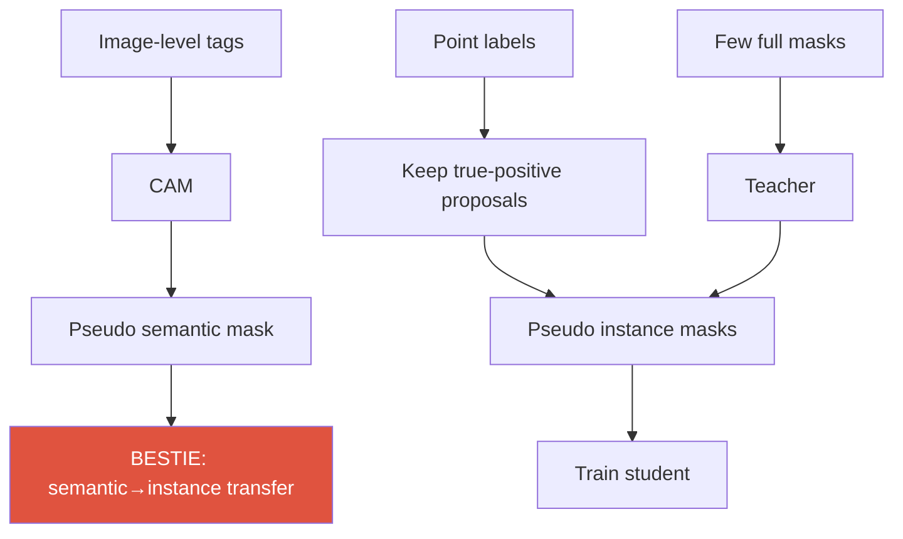
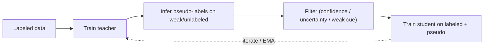

# Weak & Semi-Supervised Learning

CAMpseudo-labelspoint / box / scribbleteacher–studentconsistencylabel budget

> [!TIP] Why this chapter matters
> This is the candidate's mid-career backbone: **DRS → BESTIE → PointWSSIS → WSSHM / Rethinking-Saliency**. The interview story is *"performance per label dollar."* Own three distinctions crisply: **weak** (label *type* is cheap) vs **semi** (label *fraction* is small) vs **weakly-semi** (mix), and why instance segmentation has a **proposal bottleneck** that a cheap point can break.

## The supervision spectrum

| Setting | Labels | Representatives |
| --- | --- | --- |
| Fully supervised | dense masks / boxes | Mask R-CNN, Mask2Former |
| **Weakly (WS)** | image-level / point / scribble / box | DRS, BESTIE, BoxInst |
| **Semi (SS)** | few full + many *unlabeled* | Mean-Teacher, CCT, FixMatch-seg |
| **Weakly-semi (WSS)** | few full + many *weak* | **PointWSSIS**, **WSSHM** |
| Self-supervised | no labels (pretext / contrastive) | DINO, MAE → see [Foundation Models](#/cv/foundation-models) |

## 1 · Label cost — always argue in ratios

Absolute seconds vary by dataset; the *ratio* is the point. Rough per-image annotation cost (COCO-scale estimates, PointWSSIS appendix): full mask ≫ box > point ≈ image-level.

> [!QUESTION] "How would you spend a fixed labeling budget?"
> Don't quote seconds — sketch the **budget-vs-accuracy curve**. A few full masks teach *mask shape*; many cheap points teach *localization/coverage*. The weakly-semi sweet spot beats spending everything on either extreme (the core PointWSSIS Table-1 argument).

## 2 · CAM and its limits

Class Activation Mapping: weight the final conv feature maps by the classifier's class weights → a coarse localization heatmap.

$$M_c(x,y) = \sum_k w_k^c\, f_k(x,y)$$

The WSSS pipeline: **image tags → CAM → refine → pseudo mask → train a segmenter**. CAM's three failure modes drive an entire subfield:

1. **Sparse / discriminative-only** — fires on the most distinctive part (a dog's face, not its body).
2. **Co-occurrence bias** — activates on correlated background (boat ↔ water).
3. **No instance information** — cannot separate two same-class objects.

DRS (candidate, AAAI 2021)

<b>Discriminative Region Suppression</b>: actively suppress the peak discriminative region so activation <i>spreads</i> to the whole object → denser, more complete pseudo-masks.

BESTIE's PAM

The mirror move: a <b>Peak Attention Module</b> that <i>emphasizes</i> peaks to extract per-instance cues. "Suppress to fill" vs "peak to separate" — a clean symmetric framing.

## 3 · Pseudo-labeling & self-training

The teacher–student loop and its central risk (confirmation bias):

- **Confirmation bias:** the student amplifies the teacher's systematic errors.
- **Mitigations:** confidence/uncertainty filtering, **EMA teacher** (Mean-Teacher), strong-weak **consistency** (FixMatch: weak-aug pseudo-label supervises strong-aug prediction), curriculum, and — crucially — a **cheap human oracle** (a point) to anchor the label.

> [!NOTE] Semi-seg's characteristic pain
> Class imbalance and **noisy boundaries**: pseudo-masks are least reliable exactly at edges, so naive self-training degrades boundary quality. Boundary-aware filtering / separate boundary loss help.

<figure>
<svg viewBox="0 0 640 120" xmlns="http://www.w3.org/2000/svg" font-family="Inter, sans-serif" font-size="11">
  <rect x="20" y="45" width="90" height="34" rx="6" fill="#6366f1"/><text x="65" y="66" text-anchor="middle" fill="#fff">image</text>
  <path d="M110 55 C 150 40, 160 40, 190 40" stroke="#0ea5e9" stroke-width="1.5" fill="none" marker-end="url(#w)"/>
  <path d="M110 70 C 150 85, 160 85, 190 85" stroke="#e0533f" stroke-width="1.5" fill="none" marker-end="url(#w)"/>
  <text x="150" y="30" fill="#0ea5e9">weak aug</text><text x="150" y="108" fill="#e0533f">strong aug</text>
  <rect x="190" y="24" width="110" height="32" rx="6" fill="none" stroke="#0ea5e9" stroke-width="2"/><text x="245" y="44" text-anchor="middle" fill="#0ea5e9">confident pred</text>
  <rect x="190" y="70" width="110" height="32" rx="6" fill="none" stroke="#e0533f" stroke-width="2"/><text x="245" y="90" text-anchor="middle" fill="#e0533f">prediction</text>
  <path d="M300 40 C 360 40, 360 78, 300 86" stroke="#12a150" stroke-width="2" fill="none" marker-end="url(#w)"/>
  <text x="430" y="66" fill="#12a150">pseudo-label supervises the strong-aug view</text>
  <defs><marker id="w" markerWidth="8" markerHeight="8" refX="6" refY="3" orient="auto"><path d="M0 0 L6 3 L0 6" fill="#98a3b2"/></marker></defs>
</svg>
<figcaption>Consistency regularization (FixMatch-style): a confident prediction on a weakly-augmented view becomes the target for the strongly-augmented view, pushing the decision boundary into low-density regions.</figcaption>
</figure>

## 4 · Weak vs semi vs weakly-semi

- **Weak instance seg from image tags only** structurally lacks instance information → historically leaned on off-the-shelf proposals (MCG) — which BESTIE argues is *not* honestly "image-level only."
- **Semi instance seg** can learn mask *representation* from the few full masks but must tune a proposal confidence threshold on unlabeled data (FN↔FP trade-off).
- **Weakly-semi (PointWSSIS)** combines the *mask prior* from a few full masks with cheap *point localization* — the argued budget optimum.

## 5 · The proposal bottleneck (PointWSSIS)

> [!QUESTION] "Why does a single point unlock semi-supervised instance segmentation?"
> **Short:** instance masks only exist for detected proposals; a point is a near-free true-positive filter. **Deep:** lowering the confidence threshold raises FP, raising it raises FN — you can't win globally. A point **matches** each real object to a proposal, keeping only true positives, so the well-trained mask branch is applied precisely where objects are. It also drives **Adaptive Pyramid-Level Selection** (a point has no scale, so pick the FPN level by arg-max confidence) and **MaskRefineNet** (image + rough mask + point heatmap → clean boundary), which matters most in the extreme low-full-label regime.

Full method, results, and the FN/FP analysis in the **[PointWSSIS & BESTIE deep-dive](#/resume/pointwssis-bestie)**.

## 6 · BESTIE — semantic-to-instance transfer

**B**eyond **Se**mantic to **I**nstance: if same-class objects don't overlap, a semantic mask *is* an instance mask. BESTIE:

1. Generates a semantic pseudo-mask (saliency-free WSSS).
2. Extracts instance cues via PAM peaks; where connected-component ∧ cue-count == 1, promote to an instance pseudo-mask.
3. Represents instances as center + offset (Panoptic-DeepLab style).
4. **Self-refinement** re-incorporates instances the network discovers online, down-weighted by a soft confidence.

This avoids external proposal generators — the fairness point below.

## 7 · Semantic drift (weak) vs background shift (continual)

Same symptom vocabulary, different cause:

<dl class="kv">
<dt>Semantic drift (BESTIE)</dt><dd>An instance <b>missing from the pseudo-labels</b> gets trained as background → the same appearance is pulled toward FG and BG, conflicting gradients. Fix: apply instance-aware losses only in confidently-labeled regions; self-refine to recover misses.</dd>
<dt>Background shift (continual)</dt><dd>The <b>meaning of "background" changes per step</b> as new classes arrive — a different mechanism handled by [Continual Learning](#/cv/continual-learning).</dd>
</dl>

## 8 · Box, scribble, and the open-vocab connection

- **Box supervision:** tightness / projection priors (BoxInst) — the mask must fit inside the box and touch its sides. Cheaper than masks, richer than points.
- **Scribble:** sparse seeds + propagation/consistency.
- **2026 twist:** in the open-vocabulary era, "boxes" can come *free* from a text-prompted detector (Grounding DINO) or masks from SAM — **foundation models as automatic weak labelers**, blurring the line between weak supervision and distillation. See [Detection](#/cv/detection) and [Foundation Models](#/cv/foundation-models).

## 9 · Saliency in WSSS — a double-edged sword

Saliency maps help separate FG/BG but introduce an **external model dependency** that fails under domain shift and muddies "how weak is this really?" **Rethinking Saliency-Guided WSSS** (candidate, arXiv 2024) experimentally re-examines when saliency actually helps; BESTIE deliberately used a saliency-free route. Good material for a "hidden assumptions in benchmarks" question.

## 10 · Q&A

How do you keep a pseudo-label comparison fair?

**Short:** same backbone, same image pool, budget-normalized, and disclose every external model.

**Deep:** a method using MCG proposals or a saliency net is *not* "image-level only" — its supervision leaks through a pretrained helper. BESTIE's critique of PRM/LIID is exactly this. If an interviewer asks about fairness, frame it as "count all sources of supervision, normalize by annotation cost."

Consistency regularization — why does it work in semi-supervised seg?

**Short:** it enforces the cluster/smoothness assumption — predictions should be invariant to label-preserving perturbations.

**Deep:** strong-weak augmentation (FixMatch) uses a confident weak-aug prediction as the target for a strong-aug view, so the decision boundary is pushed into low-density regions. In seg you also add cross-consistency across decoders/perturbed features (CCT). The risk is confirmation bias if the confidence threshold is too low.

Point supervision's hidden failure modes?

**Short:** wrong FPN level, ambiguous instances, and point placement bias.

**Deep:** a point lacks scale → adaptive level selection; two touching objects may share a proposal → matching must be one-to-one; annotators cluster points near object centers → the model can over-rely on central features. PointWSSIS's MaskRefineNet exists partly to correct level/boundary noise.

### Follow-ups
- *"WSSHM?"* Weakly-semi trimap-free **human matting** — the same few-full + many-weak recipe, ported from segmentation to matting. See [Matting](#/cv/matting).
- *"Confirmation bias in one sentence?"* The student trusts the teacher too much and amplifies its errors — so never treat pseudo-labels as ground truth.
- *"Self-supervised vs weakly-supervised?"* Self-sup learns representations with *no* labels (DINO/MAE) then transfers; weakly-sup targets the *task* directly with cheap labels. In 2026 they combine: SSL backbone + weak task labels.

## Cheat-sheet

| Term | One-liner |
| --- | --- |
| CAM | classifier-weighted feature heatmap; sparse, co-occurrence-biased |
| DRS | suppress discriminative region → denser CAM |
| Pseudo-label | teacher prediction used as training target |
| Confirmation bias | student amplifies teacher errors |
| EMA teacher | slowly-averaged teacher (Mean-Teacher) |
| Consistency (FixMatch) | weak-aug pseudo-label supervises strong-aug |
| Proposal bottleneck | no proposal → no instance mask |
| WSSIS | weakly-semi instance seg (few full + points) |
| Semantic drift | missing pseudo-instance trained as background |

**Related:** [Segmentation](#/cv/segmentation) · [Object Detection](#/cv/detection) · [Image Matting](#/cv/matting) · [Continual Learning](#/cv/continual-learning) · [Vision Foundation Models](#/cv/foundation-models) · [PointWSSIS & BESTIE deep-dive](#/resume/pointwssis-bestie)
