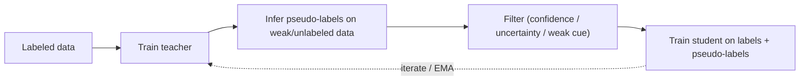

# Weak & Semi-Supervised Learning

> [!NOTE] Goal of this chapter
> Deep learning thrives on labels. Drawing a ground-truth mask for **every pixel in an image**, however, is extraordinarily expensive and can take tens of minutes per image. This chapter builds a visual and intuitive understanding of how to learn effectively with only a small amount of ground truth or with cheaper forms of supervision. It will read most smoothly after [Image Classification](#/cv/classification) and [Segmentation](#/cv/segmentation).

## §0 · Why weak or semi-supervision?

Fully supervised learning requires **dense ground truth**, such as pixel masks or boxes, for every training image. Real labeling budgets are finite, so there are two main ways to economize:

- **Weak supervision:** make the *type* of label cheaper. Replace a pixel mask with an image tag such as “cat present,” one point, a scribble, or a box.
- **Semi-supervised learning:** reduce the *fraction* of labeled examples. Keep a few fully labeled images and leave many **unlabeled**.
- **Weakly-semi supervision (WSS):** combine the two—a few fully labeled examples plus many cheap weak labels.

<figure>
<svg viewBox="0 0 640 150" xmlns="http://www.w3.org/2000/svg" font-family="Inter, sans-serif" font-size="11">
  <text x="320" y="16" text-anchor="middle" fill="#98a3b2">labeling cost (left = expensive · right = cheap)</text>
  <!-- mask -->
  <rect x="20" y="35" width="110" height="70" rx="6" fill="none" stroke="#e0533f" stroke-width="1.8"/>
  <path d="M40 90 Q60 45 80 60 Q100 75 115 55 L115 100 L40 100 Z" fill="rgba(224,83,63,.35)" stroke="#e0533f"/>
  <text x="75" y="125" text-anchor="middle" fill="#e0533f">full mask</text><text x="75" y="140" text-anchor="middle" fill="#98a3b2">~minutes</text>
  <!-- box -->
  <rect x="160" y="35" width="110" height="70" rx="6" fill="none" stroke="#6366f1" stroke-width="1.8"/>
  <rect x="185" y="55" width="60" height="40" fill="none" stroke="#6366f1" stroke-width="2" stroke-dasharray="4 2"/>
  <text x="215" y="125" text-anchor="middle" fill="#6366f1">box</text>
  <!-- scribble -->
  <rect x="300" y="35" width="110" height="70" rx="6" fill="none" stroke="#0ea5e9" stroke-width="1.8"/>
  <path d="M320 80 Q345 60 370 78 T395 70" fill="none" stroke="#0ea5e9" stroke-width="2.5"/>
  <text x="355" y="125" text-anchor="middle" fill="#0ea5e9">scribble</text>
  <!-- point -->
  <rect x="440" y="35" width="90" height="70" rx="6" fill="none" stroke="#12a150" stroke-width="1.8"/>
  <circle cx="485" cy="70" r="6" fill="#12a150"/>
  <text x="485" y="125" text-anchor="middle" fill="#12a150">point</text>
  <!-- tag -->
  <rect x="545" y="35" width="80" height="70" rx="6" fill="none" stroke="#12a150" stroke-width="1.8"/>
  <text x="585" y="74" text-anchor="middle" fill="#12a150" font-size="10">“cat”</text>
  <text x="585" y="125" text-anchor="middle" fill="#12a150">tag</text>
  <text x="585" y="140" text-anchor="middle" fill="#98a3b2">~seconds</text>
</svg>
<figcaption>A spectrum of labels for the same object. Labels on the left are informative but expensive; those on the right are cheap but ambiguous. The central question is, “Where should a fixed budget be spent?”</figcaption>
</figure>

| Setting | Labels | Representatives |
| --- | --- | --- |
| Fully supervised | dense masks / boxes | Mask R-CNN, Mask2Former |
| **Weakly supervised (weak, WS)** | image tag / point / scribble / box | DRS, BESTIE, BoxInst |
| **Semi-supervised (semi, SS)** | few fully labeled + many *unlabeled* | Mean-Teacher, CCT, FixMatch-seg |
| **Weakly-semi (WSS)** | few fully labeled + many *weakly labeled* | **PointWSSIS**, **WSSHM** |
| Self-supervised (self, SSL) | no labels (pretext/contrastive) | DINO, MAE → [Self-Supervised Learning](#/cv/self-supervised) |

> [!TIP] Interview one-liner
> Keep the distinctions crisp: **weak** makes the label *type* cheaper; **semi** reduces the labeled *fraction*; **weakly-semi** combines both. A strong answer also explains how one cheap point breaks the **proposal bottleneck** in instance segmentation (§5). The candidate's research arc is DRS → BESTIE → PointWSSIS → WSSHM.

## 1 · Discuss labeling cost together with the protocol

The ordering of annotation costs depends on object count, tooling, quality criteria, and annotator experience. A precise mask is usually more expensive than a point or tag, but even the relative cost of boxes and scribbles is not fixed. Run a pilot annotation study, measure **time, rework rate, inter-annotator agreement, and QA cost**, and normalize by the total budget.

> [!QUESTION] “How would you spend a fixed labeling budget?”
> Do not compare seconds quoted from unrelated sources. Build a **budget–accuracy curve** with the same annotation tool. A small number of full masks can teach shape, while many points can provide localization and instance-count cues. The claim that a mixed allocation beats either extreme is a hypothesis; verify it with a budget sweep, as in the relevant PointWSSIS setting.

## 2 · CAM and its limits

**CAM (Class Activation Mapping):** in the original CAM architecture—a linear classifier after global average pooling—the class weights combine the final convolutional feature maps into a spatial evidence map. This is one visualization of evidence contributing to the class score, not a complete causal account of “where the model looked.” Grad-CAM for arbitrary architectures uses gradient-derived weights and should be distinguished from the equation below.

$$M_c(x,y) = \sum_k w_k^c\, f_k(x,y)$$

Use the heatmap as a rough ground-truth mask, or pseudo-label, for a segmenter: **image tag → CAM → refinement → pseudo-mask → training.**

<figure>
<svg viewBox="0 0 640 170" xmlns="http://www.w3.org/2000/svg" font-family="Inter, sans-serif" font-size="11">
  <defs>
    <radialGradient id="heat" cx="50%" cy="50%" r="50%">
      <stop offset="0%" stop-color="#e0533f" stop-opacity="0.85"/>
      <stop offset="55%" stop-color="#d97706" stop-opacity="0.5"/>
      <stop offset="100%" stop-color="#6366f1" stop-opacity="0.05"/>
    </radialGradient>
  </defs>
  <!-- object outline (a "dog": body + head) -->
  <text x="120" y="20" text-anchor="middle" fill="#98a3b2">ideal: the whole object</text>
  <ellipse cx="120" cy="95" rx="70" ry="35" fill="none" stroke="#12a150" stroke-width="2"/>
  <circle cx="180" cy="75" r="22" fill="none" stroke="#12a150" stroke-width="2"/>
  <text x="120" y="150" text-anchor="middle" fill="#12a150">complete mask</text>
  <!-- CAM: only head lights up -->
  <text x="440" y="20" text-anchor="middle" fill="#98a3b2">typical CAM: only the most distinctive part</text>
  <ellipse cx="400" cy="95" rx="70" ry="35" fill="none" stroke="#98a3b2" stroke-width="1.5" stroke-dasharray="4 3"/>
  <circle cx="460" cy="75" r="22" fill="none" stroke="#98a3b2" stroke-width="1.5" stroke-dasharray="4 3"/>
  <circle cx="460" cy="75" r="34" fill="url(#heat)"/>
  <text x="440" y="150" text-anchor="middle" fill="#e0533f">hot on the discriminative head; misses the body</text>
</svg>
<figcaption>A CAM tends to highlight only the <b>most distinctive region</b>, often a dog's face, that supported recognition and can miss the body. Correcting this bias is central to weakly supervised semantic segmentation (WSSS).</figcaption>
</figure>

Three recurring CAM failure modes have driven an entire subfield:

1. **Sparse / discriminative-only**—responds only to the most distinctive part, such as a dog's face rather than its body.
2. **Co-occurrence bias**—activates on correlated background, such as boat ↔ water.
3. **No instance information**—cannot separate two objects of the same class.

<div class="proscons"><div><div class="pros-t">DRS (candidate, AAAI 2021)</div>
<b>Discriminative Region Suppression</b> actively <i>suppresses</i> the most salient part so activation spreads over the whole object, producing a denser and more complete pseudo-mask.
</div><div><div class="cons-t">BESTIE's PAM</div>
The opposite move: <i>emphasize</i> peaks to extract per-instance cues with a <b>Peak Attention Module</b>. Suppress to fill; peak to separate—a clean symmetry.
</div></div>

## 3 · Pseudo-labeling & self-training

**Teacher–student loop:** train a teacher on labeled data → have it predict on weakly labeled or unlabeled data to create pseudo-labels → train a student on those targets. The central risk is **confirmation bias**:



- **Confirmation bias:** the student amplifies the teacher's systematic errors.
- **Mitigations:** confidence or uncertainty filtering; an **EMA teacher**, whose weights are slowly averaged as in Mean-Teacher; strong–weak **consistency**, where FixMatch uses a weak-view prediction to supervise the strong view; and, critically, a **cheap human cue** such as a point to anchor the label.

<details class="concept-code"><summary>View the concept in code</summary>

> **PyTorch-style pseudocode—coordinate alignment for segmentation FixMatch**

```python
weak, weak_geom = weak_augment(unlabeled)
strong, strong_geom = strong_augment(unlabeled)
teacher.eval(); student.train()

with torch.no_grad():
    prob = teacher(weak).softmax(dim=1)             # [B,C,Hw,Ww]
    confidence, pseudo = prob.max(dim=1)
    pseudo = map_mask(pseudo, weak_geom, strong_geom)  # move to strong-view coords
    valid = map_mask(confidence >= tau, weak_geom, strong_geom)

student_logits = student(strong)                    # [B,C,Hs,Ws]
pixel_loss = cross_entropy(student_logits, pseudo, reduction="none")
unsup_loss = (pixel_loss * valid).sum() / valid.sum().clamp_min(1)
loss = supervised_loss(student, labeled) + weight * unsup_loss
optimizer.zero_grad(set_to_none=True)
loss.backward(); optimizer.step()
ema_update(teacher, student)                        # no gradient through teacher
```

</details>

> [!NOTE] The characteristic pain point in semi-supervised segmentation
> Class imbalance and **noisy boundaries**: pseudo-masks are often uncertain near boundaries and small objects, so naive self-training can amplify errors. Check whether confidence is calibrated against actual correctness, and ablate an ignore band, uncertainty filtering, and a boundary loss.

<figure>
<svg viewBox="0 0 640 120" xmlns="http://www.w3.org/2000/svg" font-family="Inter, sans-serif" font-size="11">
  <rect x="20" y="45" width="90" height="34" rx="6" fill="#6366f1"/><text x="65" y="66" text-anchor="middle" fill="#fff">image</text>
  <path d="M110 55 C 150 40, 160 40, 190 40" stroke="#0ea5e9" stroke-width="1.5" fill="none" marker-end="url(#w)"/>
  <path d="M110 70 C 150 85, 160 85, 190 85" stroke="#e0533f" stroke-width="1.5" fill="none" marker-end="url(#w)"/>
  <text x="150" y="30" fill="#0ea5e9">weak augmentation</text><text x="150" y="108" fill="#e0533f">strong augmentation</text>
  <rect x="190" y="24" width="110" height="32" rx="6" fill="none" stroke="#0ea5e9" stroke-width="2"/><text x="245" y="44" text-anchor="middle" fill="#0ea5e9">confident prediction</text>
  <rect x="190" y="70" width="110" height="32" rx="6" fill="none" stroke="#e0533f" stroke-width="2"/><text x="245" y="90" text-anchor="middle" fill="#e0533f">prediction</text>
  <path d="M300 40 C 360 40, 360 78, 300 86" stroke="#12a150" stroke-width="2" fill="none" marker-end="url(#w)"/>
  <text x="430" y="66" fill="#12a150">weak-view pseudo-label supervises strong view</text>
  <defs><marker id="w" markerWidth="8" markerHeight="8" refX="6" refY="3" orient="auto"><path d="M0 0 L6 3 L0 6" fill="#98a3b2"/></marker></defs>
</svg>
<figcaption>FixMatch-style consistency regularization uses a thresholded prediction from the weakly augmented view as the target for the strong view. In segmentation, crop and flip coordinates must also be applied to the target mask. The low-density decision-boundary interpretation depends on the cluster assumption.</figcaption>
</figure>

## 4 · Weak vs semi vs weakly-semi

- **Weak instance segmentation from image tags alone** structurally lacks instance information. It historically relied on off-the-shelf proposals such as MCG, which BESTIE argues is not honestly “image-level only.”
- **Semi-supervised instance segmentation** can learn the mask *representation* from a few full masks, but it still has to tune a proposal-confidence threshold on unlabeled data, creating a false-negative/false-positive trade-off.
- **Weakly-semi PointWSSIS** combines the *mask prior* from a few full masks with cheap *point localization*, the proposed budget sweet spot.

## 5 · The proposal bottleneck (PointWSSIS)

> [!QUESTION] “Why does one point unlock semi-supervised instance segmentation?”
> **Short:** in a proposal-based method, a missed proposal becomes a missed mask. Under an annotation contract with exactly one correct point per object, point–proposal matching can filter candidates strongly. **Deep:** the spatial cue supplements the false-positive/false-negative trade-off of a confidence threshold. It does not guarantee a true positive, however, when points are missing, duplicated, or clicked near a boundary; several objects contain one point; or the proposal itself is wrong. Under this setting, PointWSSIS addresses scale and boundary ambiguity with Adaptive Pyramid-Level Selection and MaskRefineNet.

The full method, results, and false-negative/false-positive analysis are in the **[PointWSSIS & BESTIE deep dive](#/resume/pointwssis-bestie)**.

## 6 · BESTIE—semantic-to-instance transfer

**B**eyond **Se**mantic **t**o **I**nstance: if objects of the same class do not overlap, a semantic mask can serve as an instance mask. BESTIE:

1. Generates semantic pseudo-masks with saliency-free WSSS.
2. Extracts instance cues with PAM peaks; promotes a connected component to an instance pseudo-mask when the number of cues equals one.
3. Represents instances as center plus offset, following Panoptic-DeepLab.
4. Uses **self-refinement** to feed online-discovered instances back with soft confidence down-weighting.

This avoids an external proposal generator, connecting directly to the fairness issue below.

## 7 · Semantic drift (weak supervision) vs background shift (continual learning)

Similar vocabulary, different causes:

<dl class="kv">
<dt>Semantic drift (BESTIE)</dt><dd>An instance <b>missing from the pseudo-label</b> is trained as background, so the same appearance is pulled toward foreground and background simultaneously, creating conflicting gradients. Apply the instance-aware loss only to confidently labeled regions and recover omissions through self-refinement.</dd>
<dt>Background shift (continual)</dt><dd>The meaning of <b>“background” changes</b> at every step as new classes arrive—a different mechanism covered in [Continual Learning](#/cv/continual-learning).</dd>
</dl>

## 8 · Boxes, scribbles, and the open-vocabulary connection

- **Box supervision:** tightness or projection priors, as in BoxInst—the mask should fit within the box and touch its sides. It is cheaper than a mask and richer than a point.
- **Scribble:** sparse seeds plus propagation or consistency.
- **Foundation teacher:** a text-conditioned detector and promptable segmenter can generate candidate boxes and masks automatically. Inference compute, licensing, prompt engineering, human QA cost, and the teacher's domain bias remain, so these are not “free labels.” State the source and confidence calibration of automatic weak labels. See [Detection](#/cv/detection) and [Foundation Models](#/cv/foundation-models).

## 9 · Saliency in WSSS—a double-edged sword

A saliency map can help separate foreground from background, but it can fail under domain shift and introduces an **external-model dependency** that obscures how weak the supervision really is. **Rethinking Saliency-Guided WSSS** (candidate, arXiv 2024) experimentally revisits when saliency actually helps; BESTIE intentionally uses a saliency-free path. This is a useful example for questions about hidden benchmark assumptions.

## 10 · Q&A

<details class="qa"><summary>How do you keep a pseudo-label comparison fair?</summary>
<div class="qa-body">

**Short:** use the same backbone and image pool, normalize by budget, and disclose every external model.

**Deep:** even when a method uses MCG proposals or a pretrained saliency model, the target dataset's annotation protocol may still be image-level. It nevertheless uses extra resources in the form of outside data, labels, or model priors, so the comparison is not resource-equivalent. Disclose the helper's pretraining data, whether it is frozen, and its inference cost; report annotation and compute budgets together.
</div></details>

<details class="qa"><summary>Why does consistency regularization work in semi-supervised segmentation?</summary>
<div class="qa-body">

**Short:** it injects cluster and smoothness assumptions. Classification output should be invariant to label-preserving perturbations, while a spatial mask should be equivariant to geometric transformations.

**Deep:** strong–weak augmentation uses a confident weak-view prediction as the strong-view target. Under a geometric transform, warp the teacher mask into the same coordinate system and ignore invalid cropped regions. One can also impose consistency across decoder or feature perturbations, as in CCT. A low confidence threshold adds noise; a high one reduces coverage and rare-class recall.
</div></details>

<details class="qa"><summary>What are the hidden failure modes of point supervision?</summary>
<div class="qa-body">

**Short:** the wrong FPN level, ambiguous instances, and point-placement bias.

**Deep:** a point has no scale, motivating adaptive level selection. Two touching objects can share a proposal, so matching should be one-to-one. Annotators also tend to click near object centers, which can make the model over-rely on center features. PointWSSIS's MaskRefineNet partly corrects level and boundary noise.
</div></details>

### Follow-ups
- *“WSSHM?”* Weakly-semi, trimap-free **human matting**—the same recipe transferred from segmentation to matting. See [Matting](#/cv/matting).
- *“Confirmation bias in one sentence?”* The student over-trusts the teacher and amplifies its errors, so never treat a pseudo-label exactly like ground truth.
- *“Self-supervised vs weakly supervised?”* Self-supervision learns a representation *without labels*, as in DINO or MAE, and transfers it; weak supervision directly targets the task with cheap labels. They can be combined: an SSL backbone plus weak task labels.

## Cheat-sheet

| Term | One-liner |
| --- | --- |
| CAM | classifier-weighted feature heatmap; sparse and co-occurrence-biased |
| DRS | suppress discriminative region → denser CAM |
| Pseudo-label | teacher prediction used as a training target |
| Confirmation bias | student amplifies teacher errors |
| EMA teacher | slowly averaged teacher, as in Mean-Teacher |
| Consistency (FixMatch) | weak-view pseudo-label supervises the strong view |
| Proposal bottleneck | no proposal → no instance mask |
| WSSIS | weakly-semi instance segmentation: few full masks + points |
| Semantic drift | missing pseudo-instance is trained as background |

**Next:** [Continual Learning](#/cv/continual-learning) · [Segmentation](#/cv/segmentation) · [Object Detection](#/cv/detection) · [Image Matting](#/cv/matting) · [Vision Foundation Models](#/cv/foundation-models) · [PointWSSIS & BESTIE deep dive](#/resume/pointwssis-bestie)
