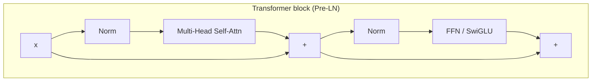
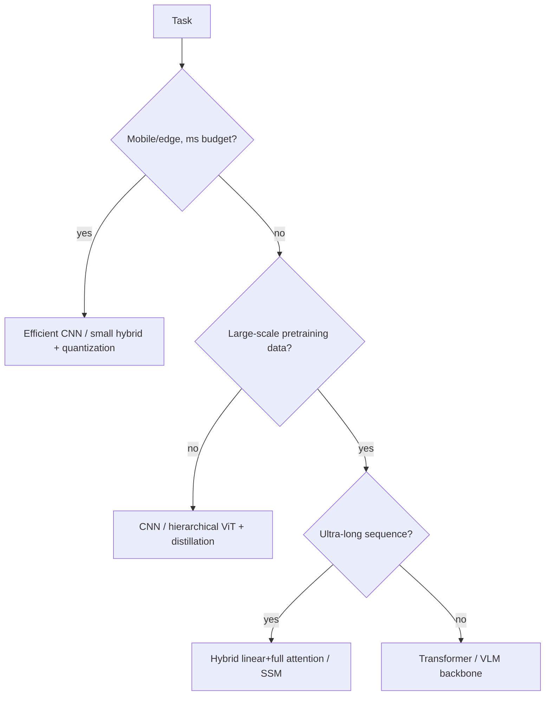

# CNNs, RNNs & Transformers

inductive biasreceptive fieldself-attentionRoPEViThybrid attention

> [!TIP] 이것부터 말하세요
> 아키텍처 질문은 "다이어그램 외워서 읊기"인 경우가 거의 없습니다. **inductive bias vs. scale**, 복잡도, data efficiency, 그리고 *언제 무엇을 고를지*를 추론할 수 있는지를 봅니다. 방을 사로잡는 한 문장: *"데이터와 연산이 충분하면 Transformer는 직접 설계한 bias를 학습된 bias로 대체합니다. 데이터나 latency가 빡빡하면 CNN에 내장된 bias가 여전히 이깁니다."*

## 멘탈 모델: bias ↔ scale

모든 backbone은 구조에 대한 베팅입니다. CNN은 **locality + translation equivariance**를 하드코딩하고, RNN은 **sequential recurrence**를 하드코딩하며, Transformer는 **거의 아무것도** 하드코딩하지 않고 그 대가를 데이터와 $O(n^2)$ attention으로 치릅니다. 2026년의 프론티어(아래)는 이들을 의도적으로 섞습니다.

<dl class="kv">
<dt>CNN</dt><dd>강한 locality, translation equivariance, parameter sharing. Data-efficient하고, grid 데이터와 on-device에 탁월합니다.</dd>
<dt>RNN/LSTM</dt><dd>Sequential state, $O(n)$ 메모리, streaming 친화적. 병렬화가 어렵고 long-range gradient 문제가 있습니다.</dd>
<dt>Transformer</dt><dd>Attention을 통한 global token mixing, 시퀀스에 대해 완전 병렬, spatial bias가 약함 → scale + positional encoding이 필요합니다.</dd>
</dl>

---

## 1 · Convolutional networks

### Receptive field & dilation

**Receptive field (RF)**는 하나의 출력 단위가 의존하는 입력 영역입니다. 쌓기(stacking), striding, dilation이 이를 키웁니다. kernel $k$, dilation $d$인 1-D dilated conv의 경우 유효 커버리지는 $\approx d(k-1)+1$입니다:

$$
y_i=\sum_{m} w_m\, x_{i+d\cdot m}
$$

Dilated(atrous) conv(DeepLab/ASPP)는 해상도를 잃거나 파라미터를 추가하지 **않고** RF를 키웁니다 — 하지만 너무 과격한 dilation은 *gridding artifact*(kernel tap이 입력을 너무 성기게 샘플링)를 유발합니다. 참고로 **effective** RF는 이론값보다 작고 더 Gaussian에 가까우므로, "큰 RF" ≠ "전부 다 본다"입니다.

### Depthwise-separable convolution

표준 conv를 채널별 spatial conv(**depthwise**) + $1\times1$ 채널 mixing(**pointwise**)으로 분리합니다. 표준 $K\times K$ conv 대비 비용 비율은 대략 $\tfrac{1}{C_{out}}+\tfrac{1}{K^2}$로, MobileNet 계열 on-device 모델의 핵심 트릭입니다([Mixed Precision & Efficiency](#/foundations/mixed-precision-efficiency) 참고).

### Residual connections — 깊이가 학습 가능해진 이유

ResNet의 $y=x+F(x)$는 **identity path**를 더해 gradient가 직접 흐르게 하고, 각 block은 *residual correction*만 학습하면 됩니다. 이것이 **degradation** 문제(더 깊은 plain net이 더 얕은 것보다 못한 현상)를 해결했고 이제는 보편적입니다 — Transformer의 residual stream도 같은 아이디어입니다.

> [!NOTE] Activation function이 여기 관련됩니다
> 비선형성 선택은 depth 및 normalization과 상호작용합니다. 아래에서 saturation과 dead-ReLU 동작을 직접 만져보세요.

Receptive field를 키우는 데 있어 dilation이 stride/pooling 대비 무엇을 주나요?

**짧게:** dilation은 spatial resolution을 *유지하면서* RF를 키우고, stride/pooling은 resolution을 *버리면서* RF를 키웁니다.

**깊게:** dense prediction(segmentation, matting)에서는 픽셀별 출력이 필요하므로 downsampling이 경계 품질을 해칩니다. Dilated conv(여러 rate의 ASPP)는 full resolution에서 multi-scale context를 잡아냅니다. 대가: gridding artifact와 불규칙한 메모리 접근입니다. Stride/pooling은 더 싸고 classification에 유용한 invariance를 더하지만, dense task에 필요한 미세 디테일을 버립니다. **후속 질문:** *Deformable conv?* — sampling offset을 학습해 RF를 객체 모양에 맞춥니다. *왜 effective RF가 이론값보다 작은가?* — center tap이 지배적이고, 기여가 바깥으로 갈수록 감쇠합니다.

---

## 2 · RNNs, LSTMs, 그리고 attention이 이들을 밀어낸 이유

바닐라 RNN $h_t=\tanh(W_h h_{t-1}+W_x x_t+b)$는 $W_h$를 반복 곱하며 gradient를 전파합니다. Spectral radius $<1$ → **vanishing**, $>1$ → **exploding**. LSTM은 additive path를 가진 gated **cell state**를 추가합니다:

$$
\begin{aligned}
f_t&=\sigma(W_f[h_{t-1},x_t]) & i_t&=\sigma(W_i[h_{t-1},x_t])\\
\tilde c_t&=\tanh(W_c[h_{t-1},x_t]) & c_t&=f_t\odot c_{t-1}+i_t\odot\tilde c_t\\
o_t&=\sigma(W_o[h_{t-1},x_t]) & h_t&=o_t\odot\tanh(c_t)
\end{aligned}
$$

$f_t\approx1$일 때 cell은 residual highway처럼 작동해 gradient를 보존합니다. GRU는 gate를 합쳐 파라미터를 줄입니다. **왜 분야가 attention으로 옮겨갔나:** (1) recurrence는 본질적으로 *sequential*이라 GPU 활용도가 낮음 → Transformer는 시퀀스 전체를 병렬 처리. (2) LSTM은 매우 긴 range와 고정 크기 state를 통한 information bottleneck에 여전히 취약. (3) Attention은 모든 token이 한 hop 만에 다른 모든 token에 직접 접근하게 함. RNN/SSM 아이디어는 **streaming, low latency, $O(n)$ 메모리**가 중요한 곳에서 살아남으며 — 이것이 아래 2026년 하이브리드의 동기입니다.

---

## 3 · The Transformer

### Block structure

*(원 논문은 Post-LN이고, 현대 LLM은 Pre-LN입니다 — [Normalization & Stability](#/foundations/normalization-stability) 참고.)*

### Scaled dot-product attention

$$
\mathrm{Attention}(Q,K,V)=\mathrm{softmax}\!\Big(\frac{QK^\top}{\sqrt{d_k}}\Big)V
$$

$\sqrt{d_k}$ 분모는 logit이 차원에 따라 커지는 것을 막아줍니다(커지면 softmax가 saturate되어 gradient를 죽입니다). **Multi-head attention**은 $h$개의 독립 projection을 병렬로 돌려 concat하며, 서로 다른 head가 서로 다른 관계를 잡게 합니다. 복잡도는 시퀀스 길이 $n$에 대해 시간·메모리 모두 $O(n^2 d)$로, 핵심적인 scaling 고통 지점입니다.

### FFN and modern recipe

$$
\mathrm{FFN}(x)=\phi(xW_1+b_1)W_2+b_2
$$

프론티어 LLM decoder는 거의 표준화된 레시피로 수렴합니다: **RMSNorm + Pre-LN + RoPE + SwiGLU + GQA**, 그리고 logit 안정화를 위해 QK-Norm을 자주 씁니다. 변종은 attention 범위로 나뉩니다: **encoder-only**(BERT — bidirectional, 이해), **decoder-only**(GPT/LLaMA — causal, 생성), **encoder–decoder**(T5 — encoder memory에 대한 cross-attention). [LLM Fundamentals](#/llm/fundamentals) 참고.

### Positional encodings

Self-attention은 **permutation-equivariant**하므로 위치를 주입해야 합니다.

| Scheme | 아이디어 | Extrapolation |
| --- | --- | --- |
| Sinusoidal (abs) | 위치의 고정된 $\sin/\cos$ | 제한적 |
| Learned absolute | 위치별 학습 벡터 (ViT) | 학습 길이 초과 시 나쁨 |
| **RoPE** | 위치 의존 각도로 Q/K 회전 → dot product가 *relative* offset을 인코딩 | 좋고, 확장 가능 (NTK/YaRN scaling) |
| **ALiBi** | attention logit에 선형 거리 페널티 추가 (embedding 없음) | 강한 length extrapolation |

RoPE는 LLaMA 시대의 기본값이고, ALiBi는 약간의 모델링 능력을 내주는 대신 깔끔한 long-context extrapolation을 얻습니다. Sinusoidal absolute:

$$
PE_{(pos,2i)}=\sin(pos/10000^{2i/d}),\quad PE_{(pos,2i+1)}=\cos(pos/10000^{2i/d})
$$

왜 attention logit을 √d_k로 나누고, 왜 multi-head가 큰 head 하나보다 나은가요?

**짧게:** 분모는 logit variance를 조절해 softmax가 well-conditioned 영역에 머물게 하고, 여러 head는 모델이 서로 다른 subspace에서 여러 관계에 *동시에* attend하게 합니다.

**깊게:** $q,k$가 unit-variance 원소를 가지면 $q\cdot k$의 variance는 $\approx d_k$입니다. scaling이 없으면 큰 $d_k$의 logit이 softmax를 one-hot 쪽으로 밀어 gradient를 줄입니다. 크기 $d$의 head 하나는 query당 하나의 attention 분포만 만들 수 있지만, 크기 $d/h$의 head $h$개는 *같은* 파라미터/FLOP 예산으로 $h$개의 분포를 만듭니다 — 예를 들어 한 head는 syntax를, 다른 head는 coreference를 추적합니다. **후속 질문:** *GQA/MQA?* — inference 시 KV cache를 줄이려고 query head 간에 K/V를 공유합니다([Efficiency](#/foundations/mixed-precision-efficiency) 참고). *Attention map을 설명(explanation)으로 쓸 수 있나?* — 조심스럽게. attention weight ≠ causal importance.

RoPE vs ALiBi — 각각 언제 고르고, context는 어떻게 확장하나요?

**짧게:** RoPE는 Q/K를 회전해 relative position을 인코딩하는 범용 기본값이고, ALiBi는 거리로 logit을 bias해 미지의 길이로 거의 공짜로 extrapolate합니다.

**깊게:** RoPE는 완전한 표현력을 유지하면서 base frequency의 **NTK-aware / YaRN** scaling으로 4K에서 학습된 모델을 *사후적으로* 훨씬 긴 context로 확장합니다 — 128K–1M-token 모델의 표준 레시피입니다. ALiBi는 positional embedding이 필요 없고 더 긴 시퀀스로 자연스럽게 일반화되지만, 고정된 선형 bias는 더 약한 prior입니다. 실제로 2025–2026년 대부분의 LLM은 RoPE + scaling scheme을 씁니다. **후속 질문:** *왜 CNN은 명시적 PE가 필요 없나?* — local kernel + weight sharing이 translation 구조와 relative position을 암묵적으로 내장합니다.

---

## 4 · Vision Transformers (ViT)

ViT는 이미지를 $P\times P$ patch로 tokenize → linear embedding → `[CLS]` + position → Transformer encoder → head로 처리합니다. locality bias를 scale과 맞바꿉니다.

| | CNN | ViT |
| --- | --- | --- |
| Locality bias | 강함 | 초기엔 약함 |
| Translation equivariance | 강함 | 약함 (학습됨) |
| Global context | depth 필요 | layer 1 |
| 소량 데이터 환경 | 강함 | 약함 (pretraining/distillation 필요) |
| Resolution 유연성 | 자연스러움 | patch/memory에 묶임 |

계층적 후속 모델들은 유용한 bias를 다시 넣습니다: **Swin**(shifted-window local attention), **ConvNeXt**(ViT에 필적하는 현대화된 순수 CNN), **CoAtNet/hybrid stem**(초기엔 conv, 후반엔 attention). CV foundation 작업에서 실전 선택지는 **resolution × latency × pretraining-data** 예산 하의 **순수 ViT vs. hybrid**입니다 — 정확히 고해상도 segmentation/matting과 SAM 스타일의 무거운 encoder + 가벼운 decoder 설계에서의 트레이드오프입니다.

ViT가 소량 데이터셋에서 ResNet보다 못합니다. 무슨 일이고 어떻게 하나요?

**짧게:** ViT는 CNN의 내장 locality/translation bias가 없어서 데이터가 적으면 overfit하거나 spatial 구조를 학습하지 못합니다. 해법: pretrain/distill, convolutional bias 추가, 또는 hierarchical 변종 사용.

**깊게:** 구체적으로 — (1) 처음부터 학습하는 대신 큰 pretrained ViT(ImageNet-21k/LAION)로 초기화, (2) CNN teacher로부터 **DeiT 스타일 distillation**, (3) **convolutional stem** 추가 또는 **Swin/hybrid** 사용으로 locality 재도입, (4) 강한 augmentation/regularization. 더 깊은 요점: ViT의 이점은 데이터 측면에서 *asymptotic*합니다 — crossover 지점 아래에서는 CNN의 inductive bias가 진짜로 더 낫고, 이를 인정하는 것이 성숙함을 보여줍니다. **후속 질문:** *Patch size 효과?* — 작은 patch → 더 많은 token → 높은 정확도지만 quadratic 비용.

---

## 5 · 2026년 방향 — hybrid linear/full attention 2026

순수 Transformer는 $O(n^2)$를 치르고, 순수 state-space model(SSM)은 $O(n)$이지만 정밀한 recall이 약합니다. 2026년의 합의는 **순수 Transformer도 순수 Mamba도 아닌 — 섞어라**입니다.

<dl class="kv">
<dt>Mamba / Mamba-2</dt><dd>Selective state-space model, linear-time sequence mixing. Mamba-2의 <b>SSD</b> 프레임워크는 SSM과 attention을 형식적으로 연결합니다. verifiable</dd>
<dt>Nemotron-H</dt><dd>NVIDIA hybrid: 대부분의 self-attention layer를 Mamba-2로 교체하고 일부만 full로 유지. long context에서 최대 ~3× throughput 보고. verifiable</dd>
<dt>Qwen3-Next</dt><dd>~3:1 hybrid — Gated DeltaNet(linear attention) + 주기적 full attention, 초희소 MoE, multi-token prediction.</dd>
<dt>MiniMax-01</dt><dd>초장문 context를 위한 ~7:1 linear:full 비율의 "Lightning attention".</dd>
</dl>

**왜 full attention을 *조금이라도* 유지하나?** Linear/SSM layer는 history를 고정 state로 압축해 정확한 long-range *recall*(복사, retrieval, in-context lookup)을 잃습니다. 소수의 full-attention layer를 끼워 넣으면 정확한 token-to-token 접근을 복원하고, 다수의 linear layer가 $O(n)$ throughput 이득을 담당합니다. 이것은 *(방어 가능)* 한 층 위의 bias-vs-scale 트레이드와 같습니다: 어디서나 싼 sequence mixing을 사고, recall이 요구하는 곳에만 비싼 global attention을 씁니다. [LLM Fundamentals](#/llm/fundamentals)와 [Efficiency](#/foundations/mixed-precision-efficiency) 참고.

왜 랩들이 순수 Mamba 대신 3:1 / 7:1 hybrid 레이아웃을 내놓나요?

**짧게:** linear-attention/SSM layer는 $O(n)$이고 빠르지만 정확한 long-range recall을 잃습니다. 소수의 full-attention layer가 이를 복원해, attention 비용의 일부만으로 Transformer에 근접한 품질을 냅니다.

**깊게:** SSM은 과거를 bounded state로 요약해 locality와 throughput에는 좋지만 "40K 위치 뒤의 token을 찾아 복사하라"에는 약합니다. 경험적으로 소수의 full-attention layer가 retrieval/in-context 능력을 회복하고, 다수의 linear layer가 FLOP을 지배합니다 — 그래서 3:1(Qwen3-Next)에서 7:1(MiniMax) 비율입니다. 명시적인 efficiency-vs-capability 노브입니다. **후속 질문:** *KV cache와 어떻게 상호작용하나?* — full-attention layer만 커지는 KV cache를 갖고, linear layer는 고정 크기 state를 유지하므로 long-context에서 큰 메모리 절약이 됩니다.

---

## 아키텍처 선택 (decision guide)

## Cheat-sheet

| 질문 | 한 줄 요약 |
| --- | --- |
| Receptive field | 출력이 의존하는 영역. stack/stride/dilation으로 키움. effective RF < 이론값. |
| Depthwise-separable | Depthwise + pointwise. 표준 conv 비용의 ~$1/C_{out}+1/K^2$. |
| Residual | $y=x+F(x)$ — identity gradient path가 degradation 문제 해결. 보편적. |
| LSTM gate | $f\!\approx\!1$인 additive cell state가 gradient highway 역할. |
| Attention이 이긴 이유 | 시퀀스에 대해 병렬, one-hop global 접근. RNN은 sequential + bottleneck. |
| Attention | $\mathrm{softmax}(QK^\top/\sqrt{d_k})V$. $O(n^2)$. MHA = 병렬 관계. |
| RoPE vs ALiBi | RoPE는 Q/K 회전(relative, YaRN 확장 가능). ALiBi = distance-bias, 공짜 extrapolation. |
| ViT vs CNN | ViT는 scale에서 이김. CNN의 locality bias는 소량 데이터/low-latency 환경에서 이김. |
| 2026 hybrid | 3:1–7:1 linear+full attention (Nemotron-H, Qwen3-Next, MiniMax) — recall + throughput. |

**관련:** [Normalization & Stability](#/foundations/normalization-stability) · [Distributed Training](#/foundations/distributed-training) · [Mixed Precision & Efficiency](#/foundations/mixed-precision-efficiency) · [LLM Fundamentals](#/llm/fundamentals) · [Optimization](#/foundations/optimization)
