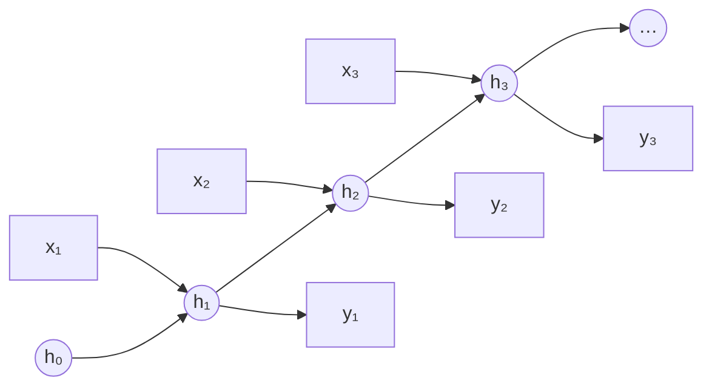
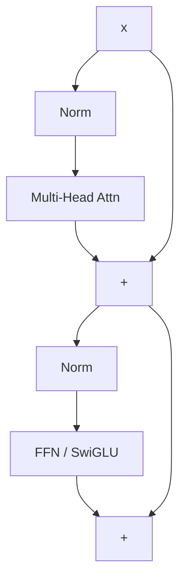
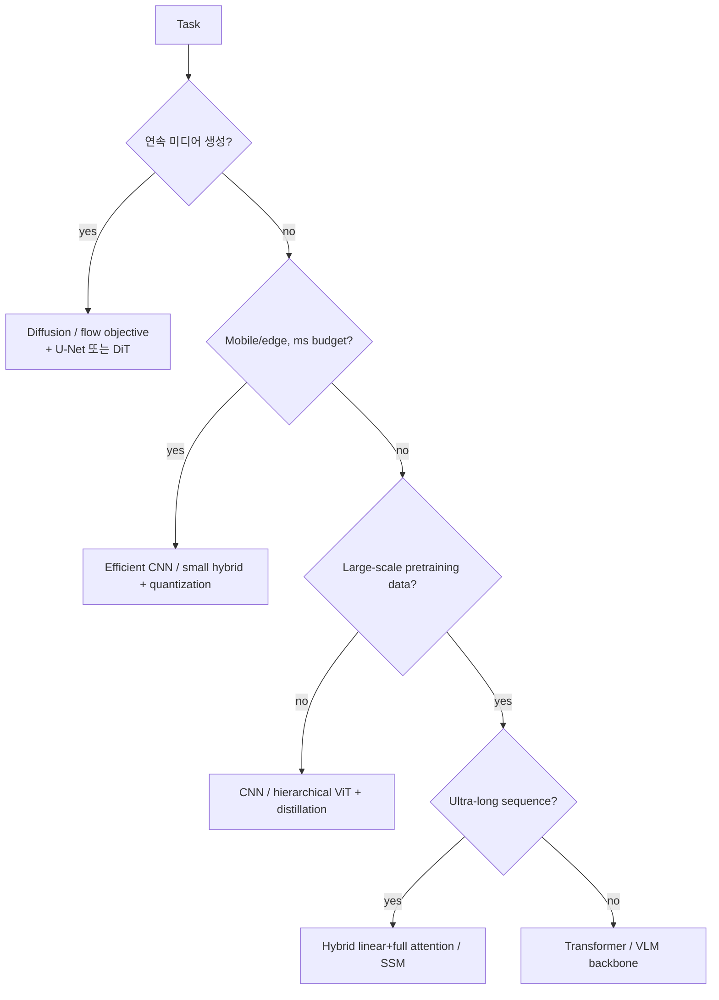

# CNNs, RNNs & Transformers

<div class="tag-row"><span class="tag">inductive bias</span><span class="tag">receptive field</span><span class="tag">self-attention</span><span class="tag">RoPE</span><span class="tag">ViT</span><span class="tag">hybrid attention</span></div>

> [!NOTE] 이 챕터의 목표
> [신경망 첫걸음](#/foundations/neural-networks-basics)의 MLP는 "모든 입력을 똑같이" 봅니다. 하지만 현실 데이터는 저마다 **구조**가 있습니다 — 이미지는 이웃한 픽셀이 관련되고(공간), 문장은 순서가 있고(시간), 긴 글은 멀리 떨어진 단어끼리 연결됩니다. 이 챕터는 각 구조에 맞춘 세 가지 대표 아키텍처(**CNN · RNN · Transformer**)를 직관 → 그림 → 수식 순서로 잡습니다.

## 어떤 데이터에 어떤 아키텍처?

한 문장 직관부터 잡고 가세요. **데이터의 구조를 아키텍처에 "내장"할수록 데이터가 적어도 잘 배우고, 내장을 줄이고 유연하게 둘수록 더 많은 데이터·연산이 필요하지만 더 강력합니다.** 이 내장된 가정을 **inductive bias(귀납 편향)** 라고 부릅니다.

<dl class="kv">
<dt>CNN (이미지·격자)</dt><dd><b>locality(국소성)</b>와 <b>translation equivariance(위치 이동에 대한 동등성)</b>를 하드코딩. 파라미터를 공유해 data-efficient하고 on-device에 강함.</dd>
<dt>RNN/LSTM (순차·스트리밍)</dt><dd><b>recurrence(순환)</b>를 하드코딩 — 한 번에 한 스텝, $O(n)$ 메모리. 병렬화가 어렵고 아주 긴 의존성엔 약함.</dd>
<dt>Transformer (범용·장문)</dt><dd>거의 아무것도 하드코딩하지 않고 <b>attention</b>으로 모든 위치를 직접 연결. 완전 병렬이지만 $O(n^2)$ 비용 + 위치 정보 주입이 필요.</dd>
</dl>

> [!TIP] 면접 한 줄
> *"데이터와 연산이 충분하면 Transformer는 직접 설계한 bias를 학습된 bias로 대체합니다. 데이터나 latency가 빡빡하면 CNN에 내장된 bias가 여전히 이깁니다."* — 아키텍처 질문은 다이어그램 암송이 아니라 **inductive bias vs. scale** 트레이드오프를 추론하는지를 봅니다.

> [!NOTE] 움직이는 걸로 보세요
> 많은 개념이 애니메이션으로 보면 훨씬 빨리 이해됩니다: [convolution GIFs](https://github.com/vdumoulin/conv_arithmetic) · [CNN Explainer](https://poloclub.github.io/cnn-explainer/) · [The Illustrated Transformer](https://jalammar.github.io/illustrated-transformer/) · [Transformer Explainer (live)](https://poloclub.github.io/transformer-explainer/) · [Understanding LSTMs](https://colah.github.io/posts/2015-08-Understanding-LSTMs/) · [A Visual Guide to Mamba](https://newsletter.maartengrootendorst.com/p/a-visual-guide-to-mamba-and-state). 큐레이션 목록 → [Visual explainers](#/resources/open-source).

---

## 1 · CNN (합성곱 신경망)

### 직관: 작은 필터를 이미지 위로 미끄러뜨리기

이미지에서 "고양이 귀"는 그림 어디에 있든 고양이 귀입니다. MLP처럼 픽셀마다 따로 가중치를 두는 대신, CNN은 **작은 필터(kernel, 커널) 하나를 이미지 전체 위로 미끄러뜨리며** 같은 패턴을 찾습니다. 이 "가중치 공유(parameter sharing)" 덕분에 파라미터가 훨씬 적고, 위치가 바뀌어도 같은 특징을 잡습니다.

<figure>
<svg viewBox="0 0 460 240" xmlns="http://www.w3.org/2000/svg" font-family="Inter, sans-serif" font-size="12">
  <text x="115" y="28" text-anchor="middle" fill="#0ea5e9" font-weight="700">입력 (5×5)</text>
  <text x="365" y="28" text-anchor="middle" fill="#12a150" font-weight="700">출력 (3×3)</text>
  <!-- input grid 5x5, cell 30, origin 40,40 -->
  <rect x="40" y="40" width="150" height="150" fill="none" stroke="#3a4657" stroke-width="1.2"/>
  <g stroke="#3a4657" stroke-width="1">
    <line x1="70" y1="40" x2="70" y2="190"/><line x1="100" y1="40" x2="100" y2="190"/><line x1="130" y1="40" x2="130" y2="190"/><line x1="160" y1="40" x2="160" y2="190"/>
    <line x1="40" y1="70" x2="190" y2="70"/><line x1="40" y1="100" x2="190" y2="100"/><line x1="40" y1="130" x2="190" y2="130"/><line x1="40" y1="160" x2="190" y2="160"/>
  </g>
  <!-- sliding kernel 3x3 = 90px -->
  <rect width="90" height="90" rx="3" fill="rgba(224,83,63,.20)" stroke="#e0533f" stroke-width="2.5">
    <animate attributeName="x" calcMode="discrete" dur="4.5s" repeatCount="indefinite" values="40;70;100;40;70;100;40;70;100"/>
    <animate attributeName="y" calcMode="discrete" dur="4.5s" repeatCount="indefinite" values="40;40;40;70;70;70;100;100;100"/>
  </rect>
  <!-- arrow -->
  <path d="M200 115 H285" stroke="#98a3b2" stroke-width="1.5" marker-end="url(#cv)"/>
  <text x="242" y="106" text-anchor="middle" fill="#98a3b2" font-size="10">Σ(필터·영역)</text>
  <!-- output grid 3x3, cell 26, origin 300,72 -->
  <rect x="300" y="72" width="78" height="78" fill="none" stroke="#3a4657" stroke-width="1.2"/>
  <g stroke="#3a4657" stroke-width="1"><line x1="326" y1="72" x2="326" y2="150"/><line x1="352" y1="72" x2="352" y2="150"/><line x1="300" y1="98" x2="378" y2="98"/><line x1="300" y1="124" x2="378" y2="124"/></g>
  <rect width="26" height="26" fill="rgba(18,161,80,.55)">
    <animate attributeName="x" calcMode="discrete" dur="4.5s" repeatCount="indefinite" values="300;326;352;300;326;352;300;326;352"/>
    <animate attributeName="y" calcMode="discrete" dur="4.5s" repeatCount="indefinite" values="72;72;72;98;98;98;124;124;124"/>
  </rect>
  <defs><marker id="cv" markerWidth="8" markerHeight="8" refX="6" refY="3" orient="auto"><path d="M0 0 L6 3 L0 6" fill="#98a3b2"/></marker></defs>
</svg>
<figcaption>3×3 커널(빨강)이 입력 위를 미끄러지며, 매 위치에서 <b>겹친 영역과 필터의 내적</b>을 계산해 출력(초록) 한 칸을 만듭니다. 같은 필터를 재사용하므로 파라미터가 적습니다.</figcaption>
</figure>

각 출력 픽셀은 자기 아래 영역과 필터의 내적입니다(1-D 예):

$$
y_i=\sum_{m} w_m\, x_{i+d\cdot m}
$$

### 직접 돌려보기 — 1D 합성곱

미끄러지며 내적하는 감각을 코드로 확인해 봅시다. 아래 랩에서 짧은 두 배열의 1D 교차상관(valid)을 구현하세요. 출력 길이는 `len(x) - len(w) + 1`입니다. (2D 전체 구현은 [Conv & Pooling 직접 구현](#/ml-coding/conv-pooling)에서 이어집니다.)

<div class="widget" data-widget="code">
<script type="application/json" class="code-config">
{"func":"conv1d","packages":["numpy"],"approx":true,"starter":"def conv1d(x, w):\n    # x, w 는 숫자 리스트. 필터 w 를 x 위로 한 칸씩 미끄러뜨리며\n    # 각 위치에서 겹친 부분과 w 의 내적을 계산해 리스트로 반환.\n    # 출력 길이 = len(x) - len(w) + 1\n    pass","tests":[{"args":[[1,2,3,4],[1,0]],"expect":[1.0,2.0,3.0]},{"args":[[1,2,3,4],[1,1]],"expect":[3.0,5.0,7.0]},{"args":[[1,2,3],[1,-1]],"expect":[-1.0,-1.0]},{"args":[[0,1,0,0,1],[1,1,1]],"expect":[1.0,1.0,1.0]}],"solution":"import numpy as np\n\ndef conv1d(x, w):\n    x = np.asarray(x, float); w = np.asarray(w, float)\n    n = len(x) - len(w) + 1\n    return [float(np.dot(x[i:i+len(w)], w)) for i in range(n)]"}
</script>
</div>

### Receptive field & dilation

**Receptive field(수용 영역, RF)** 는 하나의 출력 단위가 의존하는 입력 영역입니다. 층을 쌓거나(stacking), stride를 키우거나, dilation을 주면 RF가 커집니다. kernel $k$, dilation $d$인 1-D dilated conv의 유효 커버리지는 $\approx d(k-1)+1$입니다.

Dilated(atrous) conv(DeepLab/ASPP)는 해상도를 잃거나 파라미터를 추가하지 **않고** RF를 키웁니다 — 하지만 너무 과격한 dilation은 *gridding artifact*(kernel tap이 입력을 너무 성기게 샘플링)를 유발합니다. 참고로 **effective** RF는 이론값보다 작고 더 Gaussian에 가까우므로, "큰 RF" ≠ "전부 다 본다"입니다.

### Depthwise-separable convolution — 절감이 어디서 나오는가

표준 $K\times K$ conv를 두 개의 더 싼 단계로 나눕니다:
1. **Depthwise**: *입력 채널마다* $K\times K$ 필터 하나 — 채널이 아니라 **공간**을 mixing합니다.
2. **Pointwise**: 채널을 $C_{in}\to C_{out}$로 mixing하는 $1\times1$ conv — 공간이 아니라 **채널**을 mixing합니다.

$H\times W$ 출력에 대한 multiply–add를 세어 보면:

$$
\underbrace{H W\, C_{in} C_{out} K^2}_{\text{standard}}
\;\longrightarrow\;
\underbrace{H W\, C_{in} K^2}_{\text{depthwise}}+\underbrace{H W\, C_{in} C_{out}}_{\text{pointwise}}
= H W\, C_{in}\,(K^2+C_{out})
$$

따라서 비용(및 파라미터) 비율은

$$
\frac{C_{in}(K^2+C_{out})}{C_{in} C_{out} K^2}=\frac{1}{C_{out}}+\frac{1}{K^2}.
$$

**왜 더 싼가 (직관):** 표준 conv는 공간 *과* 채널을 **동시에** mixing해서 픽셀당 $C_{in}C_{out}K^2$의 비용이 듭니다. Depthwise-separable은 이를 "공간 mixing 후 채널 mixing"으로 **factorize**하고, $K^2+C_{out}$은 $K^2 C_{out}$보다 훨씬 작습니다. $K=3$이고 $C_{out}$이 크면 비율이 $\to \tfrac19$ — 대략 **8–9배 적은 FLOPs와 params**입니다. MobileNet/EfficientNet 같은 on-device 모델의 핵심 트릭입니다. **주의:** layer당 표현력이 약간 떨어지고, depthwise/pointwise 연산은 실제 하드웨어에서 종종 **memory-bandwidth-bound**입니다(낮은 FLOPs ≠ 자동으로 빠름) — [Mixed Precision & Efficiency](#/foundations/mixed-precision-efficiency) 참고.

### Residual connections — vanishing이 멈추는 이유를 gradient 관점에서

**Residual connection(잔차 연결)** — ResNet의 $y=x+F(x)$는 **identity path(항등 경로)** 를 더합니다. 그 효과는 **backward pass**에서 드러납니다. 한 block에 대해,

$$
\frac{\partial \mathcal L}{\partial x}=\frac{\partial \mathcal L}{\partial y}\Big(I+\frac{\partial F}{\partial x}\Big)
$$

— 입력에 도달하는 gradient는 upstream gradient에 $\big(I+\partial F/\partial x\big)$를 곱한 것입니다. 그 $I$는 block의 Jacobian이 **곱해지지 않는** 항입니다. 이제 $L$개의 block을 쌓아 보면:

- **Plain net:** $\dfrac{\partial \mathcal L}{\partial x_0}=\dfrac{\partial \mathcal L}{\partial x_L}\prod_{\ell=1}^{L}\dfrac{\partial F_\ell}{\partial x_{\ell-1}}$ — $L$개 Jacobian의 곱입니다. 이들의 singular value가 1보다 작으면 곱이 **기하급수적으로 줄어들어 → vanishing gradient**, 1보다 크면 → exploding.
- **Residual net:** $\dfrac{\partial \mathcal L}{\partial x_0}=\dfrac{\partial \mathcal L}{\partial x_L}\prod_{\ell=1}^{L}\Big(I+\dfrac{\partial F_\ell}{\partial x_{\ell-1}}\Big)$ — 곱을 전개하면 **identity 항 $I$**와 residual Jacobian의 보정항들이 나옵니다.

이 identity contribution은 깊은 plain net보다 gradient propagation과 conditioning을 개선하는 경향이 있고, ResNet의 **degradation** 문제(더 깊은 plain net이 더 얕은 것보다 *못한* 현상)를 크게 완화했습니다. 다만 다른 Jacobian 항과의 상쇄·증폭이 가능하므로 gradient 크기를 항상 보존한다는 보장은 아닙니다. Transformer의 **residual stream**도 같은 설계 원리를 쓰며, Pre-LN의 안정성에는 residual 경로뿐 아니라 normalization 위치와 초기화·residual scaling도 함께 작용합니다 — [Normalization & Stability](#/foundations/normalization-stability) 참고.

> **PyTorch식 pseudocode — residual 경로의 데이터 흐름**

```python
def pre_norm_block(x):                 # x: [batch, tokens, d_model]
    skip = x                           # 복사가 아니라 같은 identity 경로
    x = skip + attention(norm1(x))     # shape가 같아야 더할 수 있음
    skip = x
    x = skip + mlp(norm2(x))
    return x                           # gradient는 두 add 경로로 흐름
```

> [!NOTE] Activation function
> 비선형성 선택은 depth·normalization과 상호작용합니다 — Transformer는 smooth한 **GELU/SiLU**를, 속도가 중요한 곳은 **ReLU**를 씁니다(saturating한 sigmoid/tanh는 깊은 hidden layer에선 피함). ReLU·LeakyReLU·Sigmoid·Tanh·GELU의 공식·saturation·dead-ReLU 동작과 인터랙티브 위젯은 [신경망 첫걸음](#/foundations/neural-networks-basics) 참고.

<details class="qa"><summary>Receptive field를 키우는 데 있어 dilation이 stride/pooling 대비 무엇을 주나요?</summary>
<div class="qa-body">

**짧게:** dilation은 spatial resolution을 *유지하면서* RF를 키우고, stride/pooling은 resolution을 *버리면서* RF를 키웁니다.

**깊게:** dense prediction(segmentation, matting)에서는 픽셀별 출력이 필요하므로 downsampling이 경계 품질을 해칩니다. Dilated conv(여러 rate의 ASPP)는 full resolution에서 multi-scale context를 잡아냅니다. 대가: gridding artifact와 불규칙한 메모리 접근입니다. Stride/pooling은 더 싸고 classification에 유용한 invariance를 더하지만, dense task에 필요한 미세 디테일을 버립니다. **후속 질문:** *Deformable conv?* — sampling offset을 학습해 RF를 객체 모양에 맞춥니다. *왜 effective RF가 이론값보다 작은가?* — center tap이 지배적이고, 기여가 바깥으로 갈수록 감쇠합니다.
</div></details>

---

## 2 · RNN / LSTM / GRU — 그리고 attention이 이들을 밀어낸 이유

### 직관: 기억을 이어 나르기

문장을 읽을 때 우리는 앞 단어들을 **기억**하며 다음 단어를 이해합니다. RNN(순환 신경망)은 이 아이디어를 그대로 흉내 냅니다 — **hidden state(은닉 상태)** 라는 작은 기억을 들고, 단어를 하나씩 읽으며 그 기억을 갱신합니다. 문제는 스텝이 길어지면 초반 기억이 흐려지고(vanishing), 한 스텝씩만 갈 수 있어 느리다는 것입니다.

### Vanilla RNN
단일 hidden state를 한 번에 한 스텝씩 앞으로 나릅니다:

$$h_t=\tanh(W_h h_{t-1}+W_x x_t+b),\qquad y_t=W_y h_t$$



Backprop-through-time의 gradient에는 매 step의 recurrent weight뿐 아니라 activation Jacobian도 연속해서 곱해집니다. 이 곱의 singular-value 구조가 vanishing/exploding을 만들며, $W_h$의 spectral radius 하나만으로 모든 경우를 판정할 수는 없습니다. vanilla RNN이 긴 의존성을 배우기 어려운 경향은 분명하지만 기억 길이를 "수십 step"으로 고정할 수는 없습니다.

### LSTM — gated cell-state highway
additive path를 가진 gated **cell state(셀 상태)** 를 추가합니다:

$$
\begin{aligned}
f_t&=\sigma(W_f[h_{t-1},x_t]) & i_t&=\sigma(W_i[h_{t-1},x_t])\\
\tilde c_t&=\tanh(W_c[h_{t-1},x_t]) & c_t&=f_t\odot c_{t-1}+i_t\odot\tilde c_t\\
o_t&=\sigma(W_o[h_{t-1},x_t]) & h_t&=o_t\odot\tanh(c_t)
\end{aligned}
$$

핵심은 **additive** 업데이트 $c_t=f_t\odot c_{t-1}+i_t\odot\tilde c_t$입니다: forget gate $f_t\approx1$일 때 cell(과 그 gradient)은 거의 변하지 않고 앞으로 흐릅니다 — **시간축을 따라가는 residual highway**로, 위 ResNet과 같은 트릭입니다.

<figure>
<svg viewBox="0 0 500 168" font-family="Inter, sans-serif" font-size="12">
  <line x1="34" y1="52" x2="466" y2="52" stroke="#e0533f" stroke-width="2.6"/>
  <text x="30" y="42" fill="#f4917f">cₜ₋₁</text><text x="452" y="42" fill="#f4917f">cₜ</text>
  <circle cx="165" cy="52" r="15" fill="none" stroke="#6366f1" stroke-width="1.8"/><text x="165" y="57" text-anchor="middle" fill="#a5b4fc">×</text>
  <text x="165" y="26" text-anchor="middle" fill="#98a3b2">forget fₜ</text>
  <circle cx="300" cy="52" r="15" fill="none" stroke="#12a150" stroke-width="1.8"/><text x="300" y="58" text-anchor="middle" fill="#34d399">+</text>
  <text x="300" y="26" text-anchor="middle" fill="#98a3b2">input iₜ⊙c̃ₜ</text>
  <line x1="385" y1="52" x2="385" y2="108" stroke="#98a3b2"/>
  <rect x="348" y="108" width="74" height="26" rx="5" fill="none" stroke="#0ea5e9"/><text x="385" y="125" text-anchor="middle" fill="#7dd3fc">tanh · oₜ</text>
  <text x="385" y="156" text-anchor="middle" fill="#f2f6fb">hₜ (output)</text>
  <text x="232" y="86" text-anchor="middle" fill="#6b7686">cell state passes through mostly-additively → gradient preserved</text>
</svg>
<figcaption>상단의 <b>cell state</b>는 곱셈(forget) 하나와 덧셈(input) 하나만 만납니다. <code>fₜ≈1</code>이면 시간축을 따라가는 residual highway가 됩니다.</figcaption>
</figure>

### GRU — 더 가벼운 gate 세트
$$
\begin{aligned}
z_t&=\sigma(W_z[h_{t-1},x_t]) & r_t&=\sigma(W_r[h_{t-1},x_t])\\
\tilde h_t&=\tanh\!\big(W_h[\,r_t\odot h_{t-1},\,x_t]\big) & h_t&=(1-z_t)\odot h_{t-1}+z_t\odot\tilde h_t
\end{aligned}
$$

GRU는 cell과 hidden state를 합치고 LSTM의 3개 대신 **2개 gate**(update $z$, reset $r$)를 씁니다 → 파라미터 ~25% 감소, 종종 비슷한 정확도, 약간 더 빠름.

### Pros / cons
| | Vanilla RNN | LSTM | GRU |
| --- | --- | --- | --- |
| Gates | 0 | 3 (forget/input/output) | 2 (update/reset) |
| Long-range memory | 나쁨 | 강함 | 강함 |
| Params / speed | 최소 / — | 최다 / 가장 느림 | 중간 / 더 빠름 |
| 언제 쓰나 | 거의 안 씀 | 긴 의존성, 더 많은 capacity | 유사하되 데이터/연산이 적을 때 |

### 왜 분야가 attention으로 옮겨갔나
1. Recurrence는 본질적으로 **sequential** → GPU 활용도가 낮음. Transformer는 시퀀스 전체를 **병렬**로 돌립니다.
2. **고정 크기 state**가 long context에 병목이 됩니다. LSTM조차 매우 긴 range에서는 흐려집니다.
3. Attention은 모든 token이 다른 모든 token에 **직접, 한 hop 만에 접근**하게 합니다.

RNN/SSM 아이디어는 **streaming, low latency, $O(n)$ 메모리**가 중요한 곳에서 살아남으며 — 이것이 아래 2026년 하이브리드와 **Mamba**(§5)의 동기입니다.

---

## 3 · Transformer

### 직관: 모든 단어가 모든 단어를 직접 본다

RNN이 기억을 한 스텝씩 이어 나른다면, Transformer는 **모든 token이 다른 모든 token을 한 번에 직접 쳐다봅니다.** "그것(it)"이 무엇을 가리키는지 알려면, "it"이 문장 속 모든 단어와의 관련도(attention weight)를 계산해 관련 높은 단어의 정보를 더 많이 가져옵니다. 이게 **self-attention(자기 주의)** 입니다 — 순차 처리가 없어 전부 병렬이고, 거리가 멀어도 한 번에 연결됩니다.

<figure>
<svg viewBox="0 0 560 150" xmlns="http://www.w3.org/2000/svg" font-family="Inter, sans-serif" font-size="12">
  <!-- tokens -->
  <g text-anchor="middle">
    <rect x="30" y="90" width="70" height="30" rx="6" fill="none" stroke="#0ea5e9" stroke-width="1.5"/><text x="65" y="110" fill="currentColor">The</text>
    <rect x="150" y="90" width="70" height="30" rx="6" fill="#6366f1"/><text x="185" y="110" fill="#fff">animal</text>
    <rect x="270" y="90" width="70" height="30" rx="6" fill="none" stroke="#0ea5e9" stroke-width="1.5"/><text x="305" y="110" fill="currentColor">was</text>
    <rect x="390" y="90" width="70" height="30" rx="6" fill="none" stroke="#0ea5e9" stroke-width="1.5"/><text x="425" y="110" fill="currentColor">tired</text>
    <rect x="480" y="90" width="60" height="30" rx="6" fill="#e0533f"/><text x="510" y="110" fill="#fff">it</text>
  </g>
  <!-- attention arrows from "it" to all, thickness = weight -->
  <path d="M500 90 C 430 30, 250 30, 185 88" fill="none" stroke="#e0533f" stroke-width="3.2" marker-end="url(#at)"/>
  <path d="M498 90 C 440 45, 120 45, 65 88" fill="none" stroke="#e0533f" stroke-width="1" opacity="0.5" marker-end="url(#at)"/>
  <path d="M504 90 C 470 55, 340 55, 305 88" fill="none" stroke="#e0533f" stroke-width="1" opacity="0.5" marker-end="url(#at)"/>
  <path d="M508 90 C 490 60, 450 60, 425 88" fill="none" stroke="#e0533f" stroke-width="1.4" opacity="0.5" marker-end="url(#at)"/>
  <text x="185" y="20" text-anchor="middle" fill="#e0533f" font-size="11">굵을수록 강한 attention → "it" = "animal"</text>
  <defs><marker id="at" markerWidth="7" markerHeight="7" refX="5" refY="3" orient="auto"><path d="M0 0 L5 3 L0 6" fill="#e0533f"/></marker></defs>
</svg>
<figcaption>"it"(빨강)이 모든 token을 쳐다보며 관련도를 계산합니다 — "animal"과의 연결이 가장 굵습니다. 이 all-to-all 연결이 self-attention의 핵심이며, 직접 만져보려면 아래 [Attention 직접 구현](#/ml-coding/attention)의 인터랙티브 위젯을 보세요.</figcaption>
</figure>

### Architecture (원 논문의 그림 재현)

*Attention Is All You Need*의 encoder–decoder 스택 — 입력은 좌하단으로 들어가고 출력 확률은 우상단으로 나옵니다. **encoder의 출력이 decoder의 cross-attention에 K, V로 공급됩니다.**

<figure>
<svg viewBox="0 0 540 520" font-family="Inter, sans-serif" font-size="10.5">
  <defs><marker id="ah" markerWidth="8" markerHeight="8" refX="6" refY="3" orient="auto"><path d="M0 0 L6 3 L0 6" fill="#98a3b2"/></marker></defs>
  <!-- ENCODER outer -->
  <rect x="70" y="150" width="170" height="185" rx="8" fill="none" stroke="#3a4657" stroke-dasharray="4 3"/>
  <text x="60" y="245" fill="#98a3b2" transform="rotate(-90 60,245)">N×</text>
  <rect x="88" y="163" width="134" height="20" rx="4" fill="rgba(217,119,6,.14)" stroke="#d97706"/><text x="155" y="177" text-anchor="middle" fill="#fbbf24">Add &amp; Norm</text>
  <rect x="88" y="190" width="134" height="26" rx="4" fill="rgba(18,161,80,.16)" stroke="#12a150"/><text x="155" y="207" text-anchor="middle" fill="#34d399">Feed Forward</text>
  <rect x="88" y="224" width="134" height="20" rx="4" fill="rgba(217,119,6,.14)" stroke="#d97706"/><text x="155" y="238" text-anchor="middle" fill="#fbbf24">Add &amp; Norm</text>
  <rect x="88" y="251" width="134" height="26" rx="4" fill="rgba(99,102,241,.18)" stroke="#6366f1"/><text x="155" y="268" text-anchor="middle" fill="#a5b4fc">Multi-Head Attention</text>
  <!-- DECODER outer -->
  <rect x="300" y="90" width="170" height="245" rx="8" fill="none" stroke="#3a4657" stroke-dasharray="4 3"/>
  <text x="484" y="215" fill="#98a3b2" transform="rotate(-90 484,215)">N×</text>
  <rect x="318" y="103" width="134" height="20" rx="4" fill="rgba(217,119,6,.14)" stroke="#d97706"/><text x="385" y="117" text-anchor="middle" fill="#fbbf24">Add &amp; Norm</text>
  <rect x="318" y="130" width="134" height="26" rx="4" fill="rgba(18,161,80,.16)" stroke="#12a150"/><text x="385" y="147" text-anchor="middle" fill="#34d399">Feed Forward</text>
  <rect x="318" y="164" width="134" height="20" rx="4" fill="rgba(217,119,6,.14)" stroke="#d97706"/><text x="385" y="178" text-anchor="middle" fill="#fbbf24">Add &amp; Norm</text>
  <rect x="318" y="191" width="134" height="26" rx="4" fill="rgba(99,102,241,.18)" stroke="#6366f1"/><text x="385" y="208" text-anchor="middle" fill="#a5b4fc">Multi-Head Attention</text>
  <rect x="318" y="225" width="134" height="20" rx="4" fill="rgba(217,119,6,.14)" stroke="#d97706"/><text x="385" y="239" text-anchor="middle" fill="#fbbf24">Add &amp; Norm</text>
  <rect x="318" y="252" width="134" height="26" rx="4" fill="rgba(99,102,241,.18)" stroke="#6366f1"/><text x="385" y="269" text-anchor="middle" fill="#a5b4fc">Masked Multi-Head Attn</text>
  <!-- embeddings + PE -->
  <rect x="88" y="360" width="134" height="24" rx="4" fill="none" stroke="#0ea5e9"/><text x="155" y="376" text-anchor="middle" fill="#7dd3fc">Input Embedding</text>
  <rect x="318" y="360" width="134" height="24" rx="4" fill="none" stroke="#0ea5e9"/><text x="385" y="376" text-anchor="middle" fill="#7dd3fc">Output Embedding</text>
  <circle cx="155" cy="330" r="10" fill="none" stroke="#e0533f"/><text x="155" y="334" text-anchor="middle" fill="#f4917f">+</text>
  <circle cx="385" cy="330" r="10" fill="none" stroke="#e0533f"/><text x="385" y="334" text-anchor="middle" fill="#f4917f">+</text>
  <text x="250" y="333" text-anchor="middle" fill="#6b7686" font-size="9.5">Positional Encoding</text>
  <text x="155" y="405" text-anchor="middle" fill="#d6dde6">Inputs</text>
  <text x="385" y="405" text-anchor="middle" fill="#d6dde6">Outputs (shifted right)</text>
  <rect x="335" y="55" width="100" height="22" rx="4" fill="none" stroke="#e0533f"/><text x="385" y="70" text-anchor="middle" fill="#f4917f">Linear</text>
  <rect x="335" y="26" width="100" height="22" rx="4" fill="none" stroke="#e0533f"/><text x="385" y="41" text-anchor="middle" fill="#f4917f">Softmax</text>
  <text x="385" y="14" text-anchor="middle" fill="#d6dde6">Output Probabilities</text>
  <line x1="155" y1="398" x2="155" y2="386" stroke="#98a3b2" marker-end="url(#ah)"/>
  <line x1="155" y1="360" x2="155" y2="342" stroke="#98a3b2" marker-end="url(#ah)"/>
  <line x1="155" y1="320" x2="155" y2="279" stroke="#98a3b2" marker-end="url(#ah)"/>
  <line x1="385" y1="398" x2="385" y2="386" stroke="#98a3b2" marker-end="url(#ah)"/>
  <line x1="385" y1="360" x2="385" y2="342" stroke="#98a3b2" marker-end="url(#ah)"/>
  <line x1="385" y1="320" x2="385" y2="280" stroke="#98a3b2" marker-end="url(#ah)"/>
  <line x1="385" y1="90" x2="385" y2="79" stroke="#98a3b2" marker-end="url(#ah)"/>
  <line x1="385" y1="55" x2="385" y2="50" stroke="#98a3b2" marker-end="url(#ah)"/>
  <path d="M240,255 C 270,255 270,205 316,204" fill="none" stroke="#e0533f" stroke-width="1.6" stroke-dasharray="4 3" marker-end="url(#ah)"/>
  <text x="270" y="228" fill="#f4917f" font-size="9.5">K, V</text>
  <line x1="155" y1="150" x2="155" y2="150" stroke="#98a3b2"/>
</svg>
<figcaption>Encoder(왼쪽, ×N)와 decoder(오른쪽, ×N). 각 sublayer는 residual <b>Add &amp; Norm</b>으로 감싸집니다. Decoder는 앞을 훔쳐볼 수 없는 <b>masked</b> self-attention과, encoder 출력을 K, V로 읽는 <b>cross-attention</b>을 추가합니다. Decoder-only LLM(GPT/LLaMA)은 cross-attention 없이 오른쪽 열만 유지합니다.</figcaption>
</figure>

**하나의** sublayer의 residual wrapper 내부(현대의 **Pre-LN** 배치):



*(원 논문은 residual add **뒤에** Norm을 둡니다(Post-LN). 현대 LLM은 안정성을 위해 **Pre-LN**을 씁니다 — [Normalization & Stability](#/foundations/normalization-stability) 참고.)*

### Scaled dot-product attention

$$
\mathrm{Attention}(Q,K,V)=\mathrm{softmax}\!\Big(\frac{QK^\top}{\sqrt{d_k}}\Big)V
$$

직관: 각 token은 **query(질문) $q$**, **key(열쇠) $k$**, **value(값) $v$** 세 벡터를 모두 만듭니다. 내 query와 남의 key의 내적이 관련도이고 softmax 가중치로 value를 섞습니다. 표준 dense attention의 계산량은 projection까지 포함해 $O(nd^2+n^2d)$이고, score/weight를 그대로 저장하는 naive 구현의 추가 메모리는 $O(n^2)$입니다. FlashAttention은 같은 attention을 타일링해 quadratic score matrix를 HBM에 저장하지 않습니다. 코드 구현은 [Attention From Scratch](#/ml-coding/attention)을 보세요.

### FFN and modern recipe

$$
\mathrm{FFN}(x)=\phi(xW_1+b_1)W_2+b_2
$$

프론티어 LLM decoder는 거의 표준화된 레시피로 수렴합니다: **RMSNorm + Pre-LN + RoPE + SwiGLU + GQA**, 그리고 logit 안정화를 위해 QK-Norm을 자주 씁니다. 변종은 attention 범위로 나뉩니다: **encoder-only**(BERT — bidirectional, 이해), **decoder-only**(GPT/LLaMA — causal, 생성), **encoder–decoder**(T5 — encoder memory에 대한 cross-attention). [LLM Fundamentals](#/llm/fundamentals) 참고.

### Positional encodings

Self-attention은 **permutation-equivariant**(순서를 바꿔도 결과가 따라 바뀔 뿐, 순서 자체를 모름)하므로 위치를 명시적으로 주입해야 합니다 — 없으면 "the cat sat"과 "sat cat the"가 동일한 표현이 됩니다. 크게 **absolute**(각 위치에 고유 벡터 — sinusoidal/learned)와 **relative**(query–key offset $i-j$를 인코딩 — 언어와 잘 맞고 extrapolation이 좋음)로 나뉘며, 현대 LLM은 **RoPE**(위치 의존 각도로 Q/K를 회전해 dot product가 relative offset을 인코딩; NTK/YaRN으로 확장)와 **ALiBi**(거리 기반 logit bias)가 지배적입니다. sinusoidal·RoPE·ALiBi의 공식·표·유도와 인터랙티브 구현은 [Positional Encoding & RoPE](#/ml-coding/positional-encoding-rope) 참고.

<details class="qa"><summary>왜 attention logit을 √d_k로 나누고, 왜 multi-head가 큰 head 하나보다 나은가요?</summary>
<div class="qa-body">

**짧게:** 분모는 logit variance를 조절해 softmax가 well-conditioned 영역에 머물게 하고, 여러 head는 모델이 서로 다른 subspace에서 여러 관계에 *동시에* attend하게 합니다.

**깊게:** √d scaling의 variance 유도는 [Attention (밑바닥)](#/ml-coding/attention)에 있습니다 — 요지는 scaling이 없으면 큰 $d_k$의 logit이 softmax를 one-hot 쪽으로 밀어 gradient를 죽인다는 것입니다. 크기 $d$의 head 하나는 query당 하나의 attention 분포만 만들 수 있지만, 크기 $d/h$의 head $h$개는 *같은* 파라미터/FLOP 예산으로 $h$개의 분포를 만듭니다 — 예를 들어 한 head는 syntax를, 다른 head는 coreference를 추적합니다. **후속 질문:** *GQA/MQA?* — inference 시 KV cache를 줄이려고 query head 간에 K/V를 공유합니다([Efficiency](#/foundations/mixed-precision-efficiency) 참고). *Attention map을 설명(explanation)으로 쓸 수 있나?* — 조심스럽게. attention weight ≠ causal importance.
</div></details>

---

## 4 · Vision Transformers (ViT)

ViT는 이미지를 $P\times P$ patch(패치)로 tokenize → linear embedding → `[CLS]` + position → Transformer encoder → head로 처리합니다. 즉 **이미지 조각을 "단어"처럼 취급**해 Transformer에 넣는 것입니다. locality bias를 scale과 맞바꿉니다.

| | CNN | ViT |
| --- | --- | --- |
| Locality bias | 강함 | 초기엔 약함 |
| Translation equivariance | 강함 | 약함 (학습됨) |
| Global context | depth 필요 | layer 1 |
| 소량 데이터 환경 | 강함 | 약함 (pretraining/distillation 필요) |
| Resolution 유연성 | 자연스러움 | patch/memory에 묶임 |

계층적 후속 모델들은 유용한 bias를 다시 넣습니다: **Swin**(shifted-window local attention), **ConvNeXt**(ViT에 필적하는 현대화된 순수 CNN), **CoAtNet/hybrid stem**(초기엔 conv, 후반엔 attention). CV foundation 작업에서 실전 선택지는 **resolution × latency × pretraining-data** 예산 하의 **순수 ViT vs. hybrid**입니다 — 정확히 고해상도 segmentation/matting과 SAM 스타일의 무거운 encoder + 가벼운 decoder 설계에서의 트레이드오프입니다.

<details class="qa"><summary>ViT가 소량 데이터셋에서 ResNet보다 못합니다. 무슨 일이고 어떻게 하나요?</summary>
<div class="qa-body">

**짧게:** ViT는 CNN의 내장 locality/translation bias가 없어서 데이터가 적으면 overfit하거나 spatial 구조를 학습하지 못합니다. 해법: pretrain/distill, convolutional bias 추가, 또는 hierarchical 변종 사용.

**깊게:** 구체적으로 — (1) 처음부터 학습하는 대신 큰 pretrained ViT(ImageNet-21k/LAION)로 초기화, (2) CNN teacher로부터 **DeiT 스타일 distillation**, (3) **convolutional stem** 추가 또는 **Swin/hybrid** 사용으로 locality 재도입, (4) 강한 augmentation/regularization. 더 깊은 요점: ViT의 이점은 데이터 측면에서 *asymptotic*합니다 — crossover 지점 아래에서는 CNN의 inductive bias가 진짜로 더 낫고, 이를 인정하는 것이 성숙함을 보여줍니다. **후속 질문:** *Patch size 효과?* — 작은 patch → 더 많은 token → 높은 정확도지만 quadratic 비용.
</div></details>

---

## 5 · Diffusion과 Flow Matching — 생성 과정을 배우기

CNN·Transformer는 **함수의 뼈대(backbone)** 이고, diffusion·flow matching은 노이즈에서 데이터로 가는 **학습 목표와 생성 경로**입니다. 따라서 “Diffusion인가 Transformer인가?”는 잘못된 양자택일입니다. 이미지 diffusion의 denoiser는 U-Net일 수도 있고, patch token을 처리하는 DiT(Diffusion Transformer)일 수도 있습니다.

### Diffusion: 노이즈를 단계적으로 되돌리기

DDPM의 forward process는 깨끗한 표본 $x_0$에 시각 $t$만큼 Gaussian noise를 섞습니다. 누적 noise schedule을 $\bar\alpha_t$라 하면 임의의 시각을 한 번에 샘플링할 수 있습니다.

$$
x_t=\sqrt{\bar\alpha_t}\,x_0+\sqrt{1-\bar\alpha_t}\,\epsilon,
\qquad \epsilon\sim\mathcal N(0,I)
$$

네트워크 $\epsilon_\theta(x_t,t,c)$는 시간 $t$와 선택적 condition $c$(텍스트·클래스 등)를 받아 주입된 noise를 예측하도록 학습합니다.

$$
\mathcal L_{\text{simple}}
=\mathbb E_{x_0,t,\epsilon}\left[\|\epsilon-\epsilon_\theta(x_t,t,c)\|_2^2\right]
$$

실제 구현은 noise($\epsilon$), clean sample($x_0$), 또는 둘을 섞은 **$v$-prediction** 중 하나를 target으로 쓸 수 있습니다. 이들은 parameterization과 weighting이 다르므로 checkpoint·scheduler가 기대하는 설정을 맞춰야 합니다. 생성할 때는 noise에서 시작해 learned reverse SDE/Markov chain 또는 그에 대응하는 ODE를 여러 step 적분합니다. DDIM·고차 ODE solver·distillation은 step 수와 품질의 trade-off를 바꿉니다.

> **PyTorch식 pseudocode — diffusion의 train과 sample은 방향이 다릅니다**

```python
# train: 임의의 noise level 하나를 뽑아 target을 회귀
x0, cond = next(batch)                         # x0: [B, C, H, W]
t = sample_timesteps(B)                        # t: [B]
noise = torch.randn_like(x0)
xt = scheduler.add_noise(x0, noise, t)
loss = mse(denoiser(xt, t, cond), noise)       # epsilon-prediction 예
loss.backward()                                # scheduler와 noise에는 grad 불필요

# sample: eval/no_grad에서 T -> 0으로 반복
denoiser.eval()
with torch.no_grad():
    x = torch.randn(B, C, H, W, device=device)
    for t in scheduler.timesteps:
        pred = denoiser(x, t, cond)
        x = scheduler.step(pred, t, x).prev_sample
```

<dl class="kv">
<dt>Pixel vs latent diffusion</dt><dd>Pixel space는 직접적이지만 고해상도 비용이 큽니다. Latent diffusion은 먼저 autoencoder로 압축한 latent에서 생성한 뒤 decode해 비용을 줄이며, autoencoder의 손실·편향도 최종 품질에 들어옵니다.</dd>
<dt>U-Net vs DiT</dt><dd>U-Net은 multi-scale skip connection과 convolutional locality가 강점입니다. DiT는 latent patch를 Transformer로 처리해 scale에 따른 이점을 노립니다. 둘 다 diffusion 학습 목표를 담는 backbone입니다.</dd>
<dt>Classifier-free guidance</dt><dd>조건/무조건 예측을 $\hat\epsilon=\epsilon_{\emptyset}+s(\epsilon_c-\epsilon_{\emptyset})$처럼 섞습니다. $s$를 키우면 조건 일치가 좋아질 수 있지만 다양성·자연스러움이 악화되고 계산도 두 번 필요할 수 있습니다.</dd>
</dl>

### Flow matching: velocity field를 직접 맞추기

가장 단순한 직선 경로를 잡아 봅시다. $x_0\sim p_{\text{noise}}$, $x_1\sim p_{\text{data}}$를 짝짓고

$$
x_t=(1-t)x_0+t x_1,\qquad u_t=x_1-x_0
$$

로 두면, 네트워크는 중간점에서의 velocity를 회귀합니다.

$$
\mathcal L_{\text{FM}}=\mathbb E_{t,x_0,x_1}
\left[\|v_\theta(x_t,t,c)-u_t\|_2^2\right]
$$

생성 시 $x(0)\sim p_{\text{noise}}$에서 시작해 ODE $\frac{dx}{dt}=v_\theta(x,t,c)$를 $t=0\to1$로 적분합니다. 실전의 **conditional flow matching**은 단순한 독립 pair보다 학습 가능한 확률 경로·coupling을 택하고, rectified-flow 계열은 경로를 더 곧게 만들어 적은 solver step을 노립니다. Diffusion의 score model도 probability-flow ODE로 표현할 수 있어 연결되지만, **학습 target과 경로가 자동으로 동일한 것은 아닙니다**.

> [!TIP] 면접 답변의 축
> “무엇을 예측하나($\epsilon/x_0/v$/velocity), 어느 공간에서 학습하나(pixel/latent), 어떤 backbone인가(U-Net/DiT), 어떤 sampler와 step 수인가, condition과 guidance는 무엇인가”를 분리해 설명하세요. FID 같은 분포 지표만으로 prompt alignment·diversity·인물/텍스트 오류·latency를 모두 대표할 수 없으므로 task별 human/semantic/safety 평가를 함께 둡니다.

---

## 6 · Hybrid linear/full attention과 state-space model

긴 시퀀스에서는 full attention의 score 행렬이 길이에 대해 이차적으로 커집니다. State-space model(SSM)과 linear attention은 선형 시간·고정 크기 recurrent state 같은 다른 비용점을 제공하고, 일부 모델은 이 층들과 full attention을 섞어 throughput과 content lookup 능력을 절충합니다. 이것은 하나의 유력한 설계군이지 모든 작업에 대한 단일한 합의는 아닙니다.

### state-space model(Mamba)은 어떻게 작동하나

**SSM(state-space model, 상태공간 모델)** 은 작은 recurrent hidden state $h_t$를 통해 시퀀스를 처리합니다 — RNN과 비슷하지만 *linear*합니다:

$$
h_t = A\,h_{t-1} + B\,x_t,\qquad y_t = C\,h_t
$$

- 고전적 SSM은 **linear time-invariant**($A,B,C$ 고정)이기 때문에, 같은 연산을 convolution 형태로 펼쳐 병렬 학습하거나 inference에서 recurrence로 실행할 수 있습니다. S4 계열은 HiPPO에서 유도된 구조화된 state matrix를 활용해 긴 의존성 학습을 돕습니다.
- **Mamba의 핵심 아이디어 — selectivity.** $B$, $C$, 그리고 step size $\Delta$를 입력 의존적으로 만들어 token마다 상태에 무엇을 쓰고 읽을지 조절합니다. 이는 time-invariance를 깨뜨리므로 단순한 고정 convolution으로 계산할 수 없고, GPU 효율을 위해 hardware-aware scan을 사용합니다.

**비용 프로파일:** sequence-mixing 연산은 길이 $n$에 대해 선형이며 parallel scan으로 학습할 수 있습니다. Autoregressive inference의 per-layer recurrent state는 context 길이에 무관한 고정 크기이고 attention KV cache는 없습니다. 다만 전체 모델 메모리·시간은 batch, layer, state dimension, kernel 구현에도 의존합니다.

<div class="proscons">
<div><div class="pros-t">Mamba / SSM — Pros</div>
Linear time, 상수 inference 메모리, KV cache 없음 → 싼 초장문 context + streaming. audio, DNA, 긴 신호 시퀀스에 강함.
</div>
<div><div class="cons-t">Cons vs Transformer</div>
<b>정확한 recall</b> / 복사 / in-context retrieval에 약함(history가 고정 크기 state로 압축됨). 생태계 성숙도 낮음. attention이 손쉽게 하는 one-hop content lookup이 어렵습니다.
</div>
</div>

정확한 복사·검색이 중요한 작업에서 일부 설계가 **full-attention layer를 끼워 넣는** 이유가 이 trade-off입니다. 아래 비율은 특정 공개 모델의 설계 예시이지 보편적 최적값이 아닙니다.

<dl class="kv">
<dt>Mamba / Mamba-2</dt><dd>Selective state-space model, linear-time sequence mixing. Mamba-2의 <b>SSD</b> 프레임워크는 구조화된 state-space layer와 특정 형태의 linear attention 사이의 수학적 연결을 설명합니다.</dd>
<dt>Nemotron-H 계열</dt><dd>다수의 Mamba 계열 layer와 일부 attention layer를 조합한 hybrid 예시. 보고된 throughput 수치는 모델 크기·하드웨어·batch·context 조건과 함께 읽어야 합니다.</dd>
<dt>Qwen3-Next</dt><dd>~3:1 hybrid — Gated DeltaNet(linear attention) + 주기적 full attention, 초희소 MoE, multi-token prediction.</dd>
<dt>MiniMax-01</dt><dd>초장문 context를 위한 ~7:1 linear:full 비율의 "Lightning attention".</dd>
</dl>

**왜 full attention을 *조금이라도* 유지하나?** 고정 크기 상태로 과거를 압축하는 방식은 정확한 token-to-token lookup에 병목이 생길 수 있습니다. Full attention은 모든 이전 token 표현에 직접 접근하는 경로를 제공하고, 선형 mixing layer가 나머지 계산을 맡습니다. 다만 recall 열세와 hybrid의 이득은 데이터·학습·모델 규모에 따라 실험으로 확인해야 합니다. [LLM Fundamentals](#/llm/fundamentals)와 [Efficiency](#/foundations/mixed-precision-efficiency) 참고.

<details class="qa"><summary>왜 랩들이 순수 Mamba 대신 3:1 / 7:1 hybrid 레이아웃을 내놓나요?</summary>
<div class="qa-body">

**짧게:** linear-attention/SSM layer는 $O(n)$이고 빠르지만 정확한 long-range recall을 잃습니다. 소수의 full-attention layer가 이를 복원해, attention 비용의 일부만으로 Transformer에 근접한 품질을 냅니다.

**깊게:** SSM은 과거를 bounded state로 요약하므로 정확한 먼 위치 복사에서는 병목이 생길 수 있습니다. 일부 hybrid 모델은 소수의 full-attention layer로 retrieval 경로를 보완하고, 다수의 선형 layer로 계산량을 낮춥니다. Layer 비율은 모델별 설계 변수입니다. **후속 질문:** *KV cache와 어떻게 상호작용하나?* — full-attention layer는 context와 함께 커지는 KV cache를 갖고, recurrent SSM layer는 고정 크기 state를 유지합니다.
</div></details>

---

## 아키텍처 선택 (decision guide)



## Cheat-sheet

| 질문 | 한 줄 요약 |
| --- | --- |
| 어떤 아키텍처? | 격자→CNN, 순차→RNN, 장문/범용→Transformer. bias↑=data-efficient, bias↓=강력하지만 data-hungry. |
| Receptive field | 출력이 의존하는 영역. stack/stride/dilation으로 키움. effective RF < 이론값. |
| Depthwise-separable | Depthwise + pointwise. 표준 conv 비용의 ~$1/C_{out}+1/K^2$. |
| Residual | $y=x+F(x)$ — identity gradient path가 degradation 문제 해결. 보편적. |
| LSTM gate | $f\!\approx\!1$인 additive cell state가 gradient highway 역할. |
| Attention이 이긴 이유 | 시퀀스에 대해 병렬, one-hop global 접근. RNN은 sequential + bottleneck. |
| Attention | $\mathrm{softmax}(QK^\top/\sqrt{d_k})V$. $O(n^2)$. MHA = 병렬 관계. |
| RoPE vs ALiBi | RoPE는 Q/K 회전(relative, YaRN 확장 가능). ALiBi = distance-bias, 공짜 extrapolation. |
| ViT vs CNN | ViT는 대규모 사전학습에서 강하고, CNN의 locality bias는 소량 데이터·low-latency 환경에서 유리할 수 있음. 실제 예산에서 비교. |
| Positional encoding | Attention은 순서를 못 봄. 위치를 주입. Absolute(sinusoidal/learned) vs relative(RoPE/ALiBi). |
| Diffusion | $x_0$에 noise를 섞고 $\epsilon/x_0/v$를 예측해 reverse process로 생성. U-Net/DiT는 backbone. |
| Flow matching | noise→data 확률 경로의 velocity field를 회귀하고 ODE를 적분. 경로·coupling·solver가 핵심. |
| Mamba / SSM | Linear recurrence $h_t=Ah_{t-1}+Bx_t$. **selective**(입력 의존 $B,C,\Delta$). $O(1)$ inference 메모리, KV cache 없음. 정확한 recall 약함. |
| Hybrid sequence model | recurrent/linear layer와 일부 full attention을 섞어 state 비용과 직접 lookup을 절충. 비율은 모델별 변수. |

**다음:** [Normalization & Stability](#/foundations/normalization-stability) · [Attention 직접 구현](#/ml-coding/attention) · [Conv & Pooling 직접 구현](#/ml-coding/conv-pooling) · [LLM Fundamentals](#/llm/fundamentals) · [Mixed Precision & Efficiency](#/foundations/mixed-precision-efficiency)

**관련:** [Optimization](#/foundations/optimization) · [Distributed Training](#/foundations/distributed-training)
