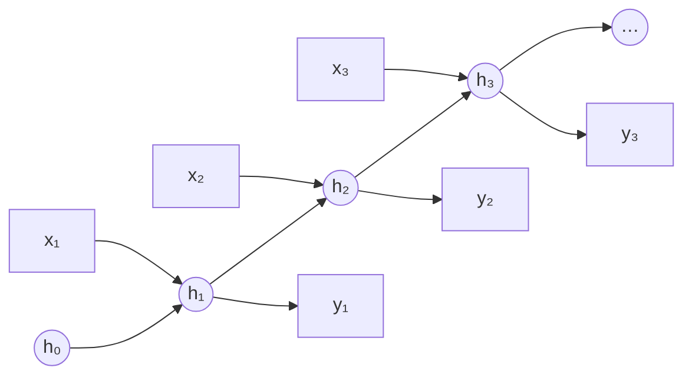
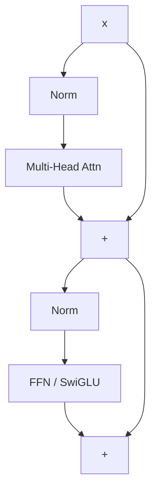
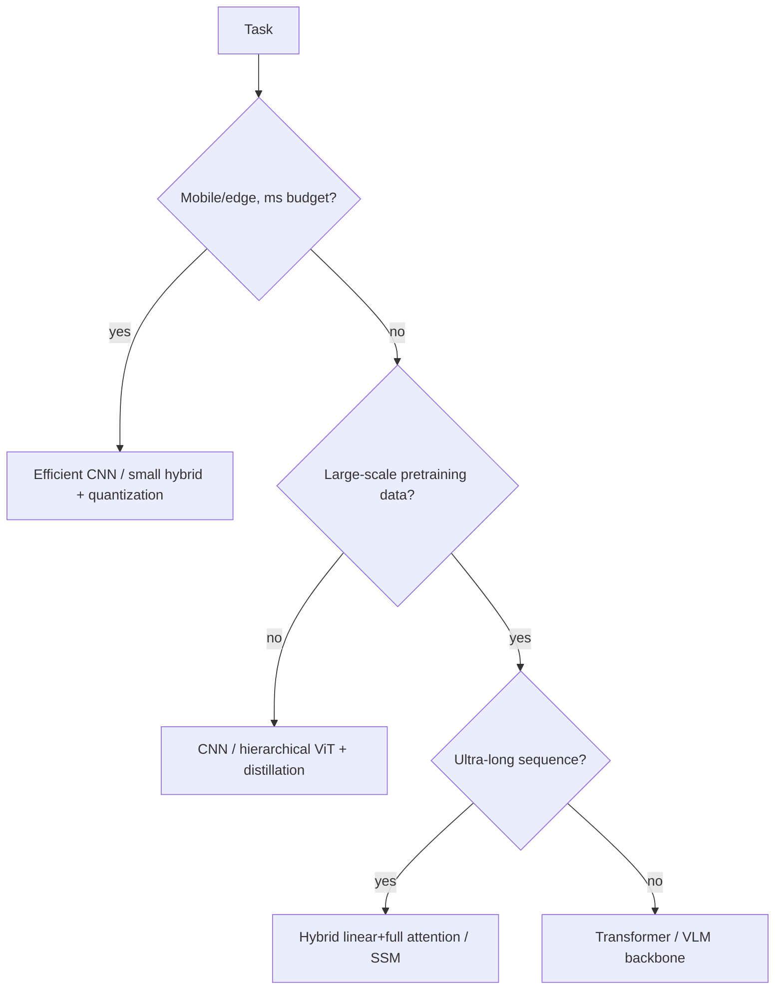

# CNNs, RNNs & Transformers

inductive biasreceptive fieldself-attentionRoPEViThybrid attention

> [!TIP] 이것부터 말하세요
> 아키텍처 질문은 "다이어그램 외워서 읊기"인 경우가 거의 없습니다. **inductive bias vs. scale**, 복잡도, data efficiency, 그리고 *언제 무엇을 고를지*를 추론할 수 있는지를 봅니다. 방을 사로잡는 한 문장: *"데이터와 연산이 충분하면 Transformer는 직접 설계한 bias를 학습된 bias로 대체합니다. 데이터나 latency가 빡빡하면 CNN에 내장된 bias가 여전히 이깁니다."*

> [!NOTE] 움직이는 걸로 보세요
> 많은 부분이 애니메이션으로 보면 더 빨리 이해됩니다. 참고 자료: [convolution GIFs](https://github.com/vdumoulin/conv_arithmetic) · [CNN Explainer](https://poloclub.github.io/cnn-explainer/) · [The Illustrated Transformer](https://jalammar.github.io/illustrated-transformer/) · [Transformer Explainer (live)](https://poloclub.github.io/transformer-explainer/) · [Understanding LSTMs](https://colah.github.io/posts/2015-08-Understanding-LSTMs/) · [A Visual Guide to Mamba](https://newsletter.maartengrootendorst.com/p/a-visual-guide-to-mamba-and-state). 큐레이션된 전체 목록 → [Visual explainers](#/resources/open-source).

## 멘탈 모델: bias ↔ scale

모든 backbone은 구조에 대한 베팅입니다. CNN은 **locality + translation equivariance**를 하드코딩하고, RNN은 **sequential recurrence**를 하드코딩하며, Transformer는 **거의 아무것도** 하드코딩하지 않고 그 대가를 데이터와 $O(n^2)$ attention으로 치릅니다. 2026년의 프론티어(아래)는 이들을 의도적으로 섞습니다.

<dl class="kv">
<dt>CNN</dt><dd>강한 locality, translation equivariance, parameter sharing. Data-efficient하고, grid 데이터와 on-device에 탁월합니다.</dd>
<dt>RNN/LSTM</dt><dd>Sequential state, $O(n)$ 메모리, streaming 친화적. 병렬화가 어렵고 long-range gradient 문제가 있습니다.</dd>
<dt>Transformer</dt><dd>Attention을 통한 global token mixing, 시퀀스에 대해 완전 병렬, spatial bias가 약함 → scale + positional encoding이 필요합니다.</dd>
</dl>

---

## 1 · Convolutional networks

### Receptive field & dilation

**Receptive field (RF)**는 하나의 출력 단위가 의존하는 입력 영역입니다. 쌓기(stacking), striding, dilation이 이를 키웁니다. kernel $k$, dilation $d$인 1-D dilated conv의 경우 유효 커버리지는 $\approx d(k-1)+1$입니다:

$$
y_i=\sum_{m} w_m\, x_{i+d\cdot m}
$$

Dilated(atrous) conv(DeepLab/ASPP)는 해상도를 잃거나 파라미터를 추가하지 **않고** RF를 키웁니다 — 하지만 너무 과격한 dilation은 *gridding artifact*(kernel tap이 입력을 너무 성기게 샘플링)를 유발합니다. 참고로 **effective** RF는 이론값보다 작고 더 Gaussian에 가까우므로, "큰 RF" ≠ "전부 다 본다"입니다.

### Depthwise-separable convolution — 절감이 어디서 나오는가

표준 $K\times K$ conv를 두 개의 더 싼 단계로 나눕니다:
1. **Depthwise**: *입력 채널마다* $K\times K$ 필터 하나 — 채널이 아니라 **공간**을 mixing합니다.
2. **Pointwise**: 채널을 $C_{in}\to C_{out}$로 mixing하는 $1\times1$ conv — 공간이 아니라 **채널**을 mixing합니다.

$H\times W$ 출력에 대한 multiply–add를 세어 보면:

$$
\underbrace{H W\, C_{in} C_{out} K^2}_{\text{standard}}
\;\longrightarrow\;
\underbrace{H W\, C_{in} K^2}_{\text{depthwise}}+\underbrace{H W\, C_{in} C_{out}}_{\text{pointwise}}
= H W\, C_{in}\,(K^2+C_{out})
$$

따라서 비용(및 파라미터) 비율은

$$
\frac{C_{in}(K^2+C_{out})}{C_{in} C_{out} K^2}=\frac{1}{C_{out}}+\frac{1}{K^2}.
$$

**왜 더 싼가 (직관):** 표준 conv는 공간 *과* 채널을 **동시에** mixing해서 픽셀당 $C_{in}C_{out}K^2$의 비용이 듭니다. Depthwise-separable은 이를 "공간 mixing 후 채널 mixing"으로 **factorize**하고, $K^2+C_{out}$은 $K^2 C_{out}$보다 훨씬 작습니다. $K=3$이고 $C_{out}$이 크면 비율이 $\to \tfrac19$ — 대략 **8–9배 적은 FLOPs와 params**입니다. MobileNet/EfficientNet 같은 on-device 모델의 핵심 트릭입니다. **주의:** layer당 표현력이 약간 떨어지고, depthwise/pointwise 연산은 실제 하드웨어에서 종종 **memory-bandwidth-bound**입니다(낮은 FLOPs ≠ 자동으로 빠름) — [Mixed Precision & Efficiency](#/foundations/mixed-precision-efficiency) 참고.

### Residual connections — vanishing이 멈추는 이유를 gradient 관점에서

ResNet의 $y=x+F(x)$는 **identity path**를 더합니다. 그 효과는 **backward pass**에서 드러납니다. 한 block에 대해,

$$
\frac{\partial \mathcal L}{\partial x}=\frac{\partial \mathcal L}{\partial y}\Big(I+\frac{\partial F}{\partial x}\Big)
$$

— 입력에 도달하는 gradient는 upstream gradient에 $\big(I+\partial F/\partial x\big)$를 곱한 것입니다. 그 $I$는 block의 Jacobian이 **곱해지지 않는** 항입니다. 이제 $L$개의 block을 쌓아 보면:

- **Plain net:** $\dfrac{\partial \mathcal L}{\partial x_0}=\dfrac{\partial \mathcal L}{\partial x_L}\prod_{\ell=1}^{L}\dfrac{\partial F_\ell}{\partial x_{\ell-1}}$ — $L$개 Jacobian의 곱입니다. 이들의 singular value가 1보다 작으면 곱이 **기하급수적으로 줄어들어 → vanishing gradient**, 1보다 크면 → exploding.
- **Residual net:** $\dfrac{\partial \mathcal L}{\partial x_0}=\dfrac{\partial \mathcal L}{\partial x_L}\prod_{\ell=1}^{L}\Big(I+\dfrac{\partial F_\ell}{\partial x_{\ell-1}}\Big)$ — 곱을 전개하면 항상 **identity 항 $I$**(깨끗한 "1" 경로)와 고차 보정항이 나옵니다.

그래서 깊이에 상관없이 loss에서 임의의 초기 layer로 gradient를 나르는 **직접적이고 희석되지 않은 highway**가 항상 존재합니다. 이것이 **degradation** 문제(더 깊은 plain net이 더 얕은 것보다 *못한* 현상)를 해결했고 이제는 보편적입니다 — Transformer의 **residual stream**도 같은 메커니즘입니다(그리고 그 경로를 깨끗하게 유지하는 Pre-LN이 더 안정적으로 학습되는 이유이기도 합니다 — [Normalization & Stability](#/foundations/normalization-stability) 참고).

> [!NOTE] Activation function이 여기 관련됩니다
> 비선형성 선택은 depth 및 normalization과 상호작용합니다. 아래에서 saturation과 dead-ReLU 동작을 직접 만져보세요.

위 곡선들의 공식(위젯에서 토글할 수 있습니다):

| Activation | Formula | Notes |
| --- | --- | --- |
| ReLU | $\max(0,x)$ | 싸고 sparse함. "죽을" 수 있음(영원히 0에 갇힘) |
| LeakyReLU | $\max(\alpha x, x),\ \alpha\approx0.01$ | 작은 음의 기울기가 dead ReLU를 해결 |
| Sigmoid | $\sigma(x)=\dfrac{1}{1+e^{-x}}$ | 출력이 $(0,1)$. saturate → vanishing grad |
| Tanh | $\dfrac{e^{x}-e^{-x}}{e^{x}+e^{-x}}$ | zero-centered sigmoid. 여전히 saturate |
| GELU | $x\,\Phi(x)$, $\Phi=$ normal CDF | smooth함. Transformer 기본값 |
| SiLU / Swish | $x\,\sigma(x)$ | smooth, self-gated. GELU 유사 |
| Softmax | $\dfrac{e^{x_i}}{\sum_j e^{x_j}}$ | 벡터 → probability simplex (출력 layer) |

현대 기본값: Transformer에서는 **GELU/SiLU**(smooth하고 0 근처에서 non-monotonic), 속도가 중요한 곳에서는 **ReLU**. Saturating unit(sigmoid/tanh)은 flat tail이 gradient를 0으로 만들기 때문에 깊은 *hidden* layer에서는 피합니다. sigmoid/softmax는 확률을 만들기 위해 **출력**에 남습니다.

Receptive field를 키우는 데 있어 dilation이 stride/pooling 대비 무엇을 주나요?

**짧게:** dilation은 spatial resolution을 *유지하면서* RF를 키우고, stride/pooling은 resolution을 *버리면서* RF를 키웁니다.

**깊게:** dense prediction(segmentation, matting)에서는 픽셀별 출력이 필요하므로 downsampling이 경계 품질을 해칩니다. Dilated conv(여러 rate의 ASPP)는 full resolution에서 multi-scale context를 잡아냅니다. 대가: gridding artifact와 불규칙한 메모리 접근입니다. Stride/pooling은 더 싸고 classification에 유용한 invariance를 더하지만, dense task에 필요한 미세 디테일을 버립니다. **후속 질문:** *Deformable conv?* — sampling offset을 학습해 RF를 객체 모양에 맞춥니다. *왜 effective RF가 이론값보다 작은가?* — center tap이 지배적이고, 기여가 바깥으로 갈수록 감쇠합니다.

---

## 2 · RNNs, LSTMs, GRUs — 그리고 attention이 이들을 밀어낸 이유

### Vanilla RNN
단일 hidden state를 한 번에 한 스텝씩 앞으로 나릅니다:

$$h_t=\tanh(W_h h_{t-1}+W_x x_t+b),\qquad y_t=W_y h_t$$

Backprop-through-time는 *매* 스텝마다 $W_h$를 곱하므로 gradient는 $\lVert W_h\rVert^{t}$처럼 스케일됩니다: spectral radius가 1보다 작으면 → **vanishing**, 1보다 크면 → **exploding**. 실사용 가능한 메모리는 고작 수십 스텝 정도입니다.

### LSTM — gated cell-state highway
additive path를 가진 gated **cell state**를 추가합니다:

$$
\begin{aligned}
f_t&=\sigma(W_f[h_{t-1},x_t]) & i_t&=\sigma(W_i[h_{t-1},x_t])\\
\tilde c_t&=\tanh(W_c[h_{t-1},x_t]) & c_t&=f_t\odot c_{t-1}+i_t\odot\tilde c_t\\
o_t&=\sigma(W_o[h_{t-1},x_t]) & h_t&=o_t\odot\tanh(c_t)
\end{aligned}
$$

핵심은 **additive** 업데이트 $c_t=f_t\odot c_{t-1}+i_t\odot\tilde c_t$입니다: forget gate $f_t\approx1$일 때 cell(과 그 gradient)은 거의 변하지 않고 앞으로 흐릅니다 — **시간축을 따라가는 residual highway**로, 위 ResNet과 같은 트릭입니다.

<figure>
<svg viewBox="0 0 500 168" font-family="Inter, sans-serif" font-size="12">
  <line x1="34" y1="52" x2="466" y2="52" stroke="#e0533f" stroke-width="2.6"/>
  <text x="30" y="42" fill="#f4917f">cₜ₋₁</text><text x="452" y="42" fill="#f4917f">cₜ</text>
  <circle cx="165" cy="52" r="15" fill="none" stroke="#6366f1" stroke-width="1.8"/><text x="165" y="57" text-anchor="middle" fill="#a5b4fc">×</text>
  <text x="165" y="26" text-anchor="middle" fill="#98a3b2">forget fₜ</text>
  <circle cx="300" cy="52" r="15" fill="none" stroke="#12a150" stroke-width="1.8"/><text x="300" y="58" text-anchor="middle" fill="#34d399">+</text>
  <text x="300" y="26" text-anchor="middle" fill="#98a3b2">input iₜ⊙c̃ₜ</text>
  <line x1="385" y1="52" x2="385" y2="108" stroke="#98a3b2"/>
  <rect x="348" y="108" width="74" height="26" rx="5" fill="none" stroke="#0ea5e9"/><text x="385" y="125" text-anchor="middle" fill="#7dd3fc">tanh · oₜ</text>
  <text x="385" y="156" text-anchor="middle" fill="#f2f6fb">hₜ (output)</text>
  <text x="232" y="86" text-anchor="middle" fill="#6b7686">cell state passes through mostly-additively → gradient preserved</text>
</svg>
<figcaption>상단의 <b>cell state</b>는 곱셈(forget) 하나와 덧셈(input) 하나만 만납니다. <code>fₜ≈1</code>이면 시간축을 따라가는 residual highway가 됩니다.</figcaption>
</figure>

### GRU — 더 가벼운 gate 세트
$$
\begin{aligned}
z_t&=\sigma(W_z[h_{t-1},x_t]) & r_t&=\sigma(W_r[h_{t-1},x_t])\\
\tilde h_t&=\tanh\!\big(W_h[\,r_t\odot h_{t-1},\,x_t]\big) & h_t&=(1-z_t)\odot h_{t-1}+z_t\odot\tilde h_t
\end{aligned}
$$

GRU는 cell과 hidden state를 합치고 LSTM의 3개 대신 **2개 gate**(update $z$, reset $r$)를 씁니다 → 파라미터 ~25% 감소, 종종 비슷한 정확도, 약간 더 빠름.

### Pros / cons
| | Vanilla RNN | LSTM | GRU |
| --- | --- | --- | --- |
| Gates | 0 | 3 (forget/input/output) | 2 (update/reset) |
| Long-range memory | 나쁨 | 강함 | 강함 |
| Params / speed | 최소 / — | 최다 / 가장 느림 | 중간 / 더 빠름 |
| 언제 쓰나 | 거의 안 씀 | 긴 의존성, 더 많은 capacity | 유사하되 데이터/연산이 적을 때 |

### 왜 분야가 attention으로 옮겨갔나
1. Recurrence는 본질적으로 **sequential** → GPU 활용도가 낮음. Transformer는 시퀀스 전체를 **병렬**로 돌립니다.
2. **고정 크기 state**가 long context에 병목이 됩니다. LSTM조차 매우 긴 range에서는 흐려집니다.
3. Attention은 모든 token이 다른 모든 token에 **직접, 한 hop 만에 접근**하게 합니다.

RNN/SSM 아이디어는 **streaming, low latency, $O(n)$ 메모리**가 중요한 곳에서 살아남으며 — 이것이 아래 2026년 하이브리드와 **Mamba**(§5)의 동기입니다.

---

## 3 · The Transformer

### Architecture (원 논문의 그림 재현)

*Attention Is All You Need*의 encoder–decoder 스택 — 입력은 좌하단으로 들어가고 출력 확률은 우상단으로 나옵니다. **encoder의 출력이 decoder의 cross-attention에 K, V로 공급됩니다.**

<figure>
<svg viewBox="0 0 540 520" font-family="Inter, sans-serif" font-size="10.5">
  <defs><marker id="ah" markerWidth="8" markerHeight="8" refX="6" refY="3" orient="auto"><path d="M0 0 L6 3 L0 6" fill="#98a3b2"/></marker></defs>
  <!-- helper styles inline -->
  <!-- ENCODER outer -->
  <rect x="70" y="150" width="170" height="185" rx="8" fill="none" stroke="#3a4657" stroke-dasharray="4 3"/>
  <text x="60" y="245" fill="#98a3b2" transform="rotate(-90 60,245)">N×</text>
  <!-- encoder inner boxes (top→bottom) -->
  <rect x="88" y="163" width="134" height="20" rx="4" fill="rgba(217,119,6,.14)" stroke="#d97706"/><text x="155" y="177" text-anchor="middle" fill="#fbbf24">Add &amp; Norm</text>
  <rect x="88" y="190" width="134" height="26" rx="4" fill="rgba(18,161,80,.16)" stroke="#12a150"/><text x="155" y="207" text-anchor="middle" fill="#34d399">Feed Forward</text>
  <rect x="88" y="224" width="134" height="20" rx="4" fill="rgba(217,119,6,.14)" stroke="#d97706"/><text x="155" y="238" text-anchor="middle" fill="#fbbf24">Add &amp; Norm</text>
  <rect x="88" y="251" width="134" height="26" rx="4" fill="rgba(99,102,241,.18)" stroke="#6366f1"/><text x="155" y="268" text-anchor="middle" fill="#a5b4fc">Multi-Head Attention</text>
  <!-- DECODER outer -->
  <rect x="300" y="90" width="170" height="245" rx="8" fill="none" stroke="#3a4657" stroke-dasharray="4 3"/>
  <text x="484" y="215" fill="#98a3b2" transform="rotate(-90 484,215)">N×</text>
  <rect x="318" y="103" width="134" height="20" rx="4" fill="rgba(217,119,6,.14)" stroke="#d97706"/><text x="385" y="117" text-anchor="middle" fill="#fbbf24">Add &amp; Norm</text>
  <rect x="318" y="130" width="134" height="26" rx="4" fill="rgba(18,161,80,.16)" stroke="#12a150"/><text x="385" y="147" text-anchor="middle" fill="#34d399">Feed Forward</text>
  <rect x="318" y="164" width="134" height="20" rx="4" fill="rgba(217,119,6,.14)" stroke="#d97706"/><text x="385" y="178" text-anchor="middle" fill="#fbbf24">Add &amp; Norm</text>
  <rect x="318" y="191" width="134" height="26" rx="4" fill="rgba(99,102,241,.18)" stroke="#6366f1"/><text x="385" y="208" text-anchor="middle" fill="#a5b4fc">Multi-Head Attention</text>
  <rect x="318" y="225" width="134" height="20" rx="4" fill="rgba(217,119,6,.14)" stroke="#d97706"/><text x="385" y="239" text-anchor="middle" fill="#fbbf24">Add &amp; Norm</text>
  <rect x="318" y="252" width="134" height="26" rx="4" fill="rgba(99,102,241,.18)" stroke="#6366f1"/><text x="385" y="269" text-anchor="middle" fill="#a5b4fc">Masked Multi-Head Attn</text>
  <!-- embeddings + PE -->
  <rect x="88" y="360" width="134" height="24" rx="4" fill="none" stroke="#0ea5e9"/><text x="155" y="376" text-anchor="middle" fill="#7dd3fc">Input Embedding</text>
  <rect x="318" y="360" width="134" height="24" rx="4" fill="none" stroke="#0ea5e9"/><text x="385" y="376" text-anchor="middle" fill="#7dd3fc">Output Embedding</text>
  <circle cx="155" cy="330" r="10" fill="none" stroke="#e0533f"/><text x="155" y="334" text-anchor="middle" fill="#f4917f">+</text>
  <circle cx="385" cy="330" r="10" fill="none" stroke="#e0533f"/><text x="385" y="334" text-anchor="middle" fill="#f4917f">+</text>
  <text x="250" y="333" text-anchor="middle" fill="#6b7686" font-size="9.5">Positional Encoding</text>
  <!-- bottom labels -->
  <text x="155" y="405" text-anchor="middle" fill="#d6dde6">Inputs</text>
  <text x="385" y="405" text-anchor="middle" fill="#d6dde6">Outputs (shifted right)</text>
  <!-- top: Linear / Softmax / Probs -->
  <rect x="335" y="55" width="100" height="22" rx="4" fill="none" stroke="#e0533f"/><text x="385" y="70" text-anchor="middle" fill="#f4917f">Linear</text>
  <rect x="335" y="26" width="100" height="22" rx="4" fill="none" stroke="#e0533f"/><text x="385" y="41" text-anchor="middle" fill="#f4917f">Softmax</text>
  <text x="385" y="14" text-anchor="middle" fill="#d6dde6">Output Probabilities</text>
  <!-- arrows -->
  <line x1="155" y1="398" x2="155" y2="386" stroke="#98a3b2" marker-end="url(#ah)"/>
  <line x1="155" y1="360" x2="155" y2="342" stroke="#98a3b2" marker-end="url(#ah)"/>
  <line x1="155" y1="320" x2="155" y2="279" stroke="#98a3b2" marker-end="url(#ah)"/>
  <line x1="385" y1="398" x2="385" y2="386" stroke="#98a3b2" marker-end="url(#ah)"/>
  <line x1="385" y1="360" x2="385" y2="342" stroke="#98a3b2" marker-end="url(#ah)"/>
  <line x1="385" y1="320" x2="385" y2="280" stroke="#98a3b2" marker-end="url(#ah)"/>
  <line x1="385" y1="90" x2="385" y2="79" stroke="#98a3b2" marker-end="url(#ah)"/>
  <line x1="385" y1="55" x2="385" y2="50" stroke="#98a3b2" marker-end="url(#ah)"/>
  <!-- encoder output → decoder cross-attention (K,V) -->
  <path d="M240,255 C 270,255 270,205 316,204" fill="none" stroke="#e0533f" stroke-width="1.6" stroke-dasharray="4 3" marker-end="url(#ah)"/>
  <text x="270" y="228" fill="#f4917f" font-size="9.5">K, V</text>
  <line x1="155" y1="150" x2="155" y2="150" stroke="#98a3b2"/>
</svg>
<figcaption>Encoder(왼쪽, ×N)와 decoder(오른쪽, ×N). 각 sublayer는 residual <b>Add &amp; Norm</b>으로 감싸집니다. Decoder는 앞을 훔쳐볼 수 없는 <b>masked</b> self-attention과, encoder 출력을 K, V로 읽는 <b>cross-attention</b>을 추가합니다. Decoder-only LLM(GPT/LLaMA)은 cross-attention 없이 오른쪽 열만 유지합니다.</figcaption>
</figure>

**하나의** sublayer의 residual wrapper 내부(현대의 **Pre-LN** 배치):

*(원 논문은 residual add **뒤에** Norm을 둡니다(Post-LN). 현대 LLM은 안정성을 위해 **Pre-LN**을 씁니다 — [Normalization & Stability](#/foundations/normalization-stability) 참고.)*

### Scaled dot-product attention

$$
\mathrm{Attention}(Q,K,V)=\mathrm{softmax}\!\Big(\frac{QK^\top}{\sqrt{d_k}}\Big)V
$$

$\sqrt{d_k}$ 분모는 logit이 차원에 따라 커지는 것을 막아줍니다(커지면 softmax가 saturate되어 gradient를 죽입니다). **Multi-head attention**은 $h$개의 독립 projection을 병렬로 돌려 concat하며, 서로 다른 head가 서로 다른 관계를 잡게 합니다. 복잡도는 시퀀스 길이 $n$에 대해 시간·메모리 모두 $O(n^2 d)$로, 핵심적인 scaling 고통 지점입니다.

### FFN and modern recipe

$$
\mathrm{FFN}(x)=\phi(xW_1+b_1)W_2+b_2
$$

프론티어 LLM decoder는 거의 표준화된 레시피로 수렴합니다: **RMSNorm + Pre-LN + RoPE + SwiGLU + GQA**, 그리고 logit 안정화를 위해 QK-Norm을 자주 씁니다. 변종은 attention 범위로 나뉩니다: **encoder-only**(BERT — bidirectional, 이해), **decoder-only**(GPT/LLaMA — causal, 생성), **encoder–decoder**(T5 — encoder memory에 대한 cross-attention). [LLM Fundamentals](#/llm/fundamentals) 참고.

### Positional encodings

Self-attention은 **permutation-equivariant**하므로 위치를 주입해야 합니다.

**왜 중요한가:** attention은 *집합(set)* 연산입니다 — 내용에 따라 token을 섞을 뿐 **순서 개념이 내장되어 있지 않습니다**. 그래서 positional 정보가 없으면 "the cat sat"과 "sat cat the"가 *동일한* 표현을 만들어 버립니다. PE는 각 token에게 "내가 어디에 있는가"를 알려주어 어순, 구문, 거리를 되살립니다. 설계 축:
- **Absolute PE** — 각 위치에 고유 벡터(sinusoidal 또는 learned)를 주고 token embedding에 *더합니다*. 간단하지만 학습 길이를 넘어서면 일반화가 잘 안 됩니다.
- **Relative PE** — query와 key 사이의 *offset* $i-j$를 인코딩합니다. 언어가 작동하는 방식("바로 앞 단어")과 맞고 훨씬 잘 extrapolate합니다 — **RoPE/ALiBi**가 지배적인 이유입니다.

| Scheme | 아이디어 | Extrapolation |
| --- | --- | --- |
| Sinusoidal (abs) | 위치의 고정된 $\sin/\cos$ | 제한적 |
| Learned absolute | 위치별 학습 벡터 (ViT) | 학습 길이 초과 시 나쁨 |
| **RoPE** | 위치 의존 각도로 Q/K 회전 → dot product가 *relative* offset을 인코딩 | 좋고, 확장 가능 (NTK/YaRN scaling) |
| **ALiBi** | attention logit에 선형 거리 페널티 추가 (embedding 없음) | 강한 length extrapolation |

RoPE는 LLaMA 시대의 기본값이고, ALiBi는 약간의 모델링 능력을 내주는 대신 깔끔한 long-context extrapolation을 얻습니다. Sinusoidal absolute:

$$
PE_{(pos,2i)}=\sin(pos/10000^{2i/d}),\quad PE_{(pos,2i+1)}=\cos(pos/10000^{2i/d})
$$

**Sinusoid에 대한 직관:** 각 차원 $i$는 서로 다른 파장의 sine/cosine입니다(기하급수적으로, $2\pi$부터 $\sim\!10000\cdot2\pi$까지). 그래서 한 위치의 벡터는 고유한 multi-frequency **fingerprint**가 됩니다 — 낮은 주파수는 coarse한 위치를, 높은 주파수는 fine한 위치를 인코딩합니다. 또한 sine/cosine은 shift 항등식을 갖기 때문에, 고정된 offset $k$는 encoding에 대해 **선형(회전) 변환**으로 작용합니다. 그래서 attention이 dot product에서 곧바로 *relative* 거리를 읽어낼 수 있습니다 — RoPE 아이디어의 씨앗입니다.

왜 attention logit을 √d_k로 나누고, 왜 multi-head가 큰 head 하나보다 나은가요?

**짧게:** 분모는 logit variance를 조절해 softmax가 well-conditioned 영역에 머물게 하고, 여러 head는 모델이 서로 다른 subspace에서 여러 관계에 *동시에* attend하게 합니다.

**깊게:** $q,k$가 unit-variance 원소를 가지면 $q\cdot k$의 variance는 $\approx d_k$입니다. scaling이 없으면 큰 $d_k$의 logit이 softmax를 one-hot 쪽으로 밀어 gradient를 줄입니다. 크기 $d$의 head 하나는 query당 하나의 attention 분포만 만들 수 있지만, 크기 $d/h$의 head $h$개는 *같은* 파라미터/FLOP 예산으로 $h$개의 분포를 만듭니다 — 예를 들어 한 head는 syntax를, 다른 head는 coreference를 추적합니다. **후속 질문:** *GQA/MQA?* — inference 시 KV cache를 줄이려고 query head 간에 K/V를 공유합니다([Efficiency](#/foundations/mixed-precision-efficiency) 참고). *Attention map을 설명(explanation)으로 쓸 수 있나?* — 조심스럽게. attention weight ≠ causal importance.

RoPE vs ALiBi — 각각 언제 고르고, context는 어떻게 확장하나요?

**짧게:** RoPE는 Q/K를 회전해 relative position을 인코딩하는 범용 기본값이고, ALiBi는 거리로 logit을 bias해 미지의 길이로 거의 공짜로 extrapolate합니다.

**깊게:** RoPE는 완전한 표현력을 유지하면서 base frequency의 **NTK-aware / YaRN** scaling으로 4K에서 학습된 모델을 *사후적으로* 훨씬 긴 context로 확장합니다 — 128K–1M-token 모델의 표준 레시피입니다. ALiBi는 positional embedding이 필요 없고 더 긴 시퀀스로 자연스럽게 일반화되지만, 고정된 선형 bias는 더 약한 prior입니다. 실제로 2025–2026년 대부분의 LLM은 RoPE + scaling scheme을 씁니다. **후속 질문:** *왜 CNN은 명시적 PE가 필요 없나?* — local kernel + weight sharing이 translation 구조와 relative position을 암묵적으로 내장합니다.

---

## 4 · Vision Transformers (ViT)

ViT는 이미지를 $P\times P$ patch로 tokenize → linear embedding → `[CLS]` + position → Transformer encoder → head로 처리합니다. locality bias를 scale과 맞바꿉니다.

| | CNN | ViT |
| --- | --- | --- |
| Locality bias | 강함 | 초기엔 약함 |
| Translation equivariance | 강함 | 약함 (학습됨) |
| Global context | depth 필요 | layer 1 |
| 소량 데이터 환경 | 강함 | 약함 (pretraining/distillation 필요) |
| Resolution 유연성 | 자연스러움 | patch/memory에 묶임 |

계층적 후속 모델들은 유용한 bias를 다시 넣습니다: **Swin**(shifted-window local attention), **ConvNeXt**(ViT에 필적하는 현대화된 순수 CNN), **CoAtNet/hybrid stem**(초기엔 conv, 후반엔 attention). CV foundation 작업에서 실전 선택지는 **resolution × latency × pretraining-data** 예산 하의 **순수 ViT vs. hybrid**입니다 — 정확히 고해상도 segmentation/matting과 SAM 스타일의 무거운 encoder + 가벼운 decoder 설계에서의 트레이드오프입니다.

ViT가 소량 데이터셋에서 ResNet보다 못합니다. 무슨 일이고 어떻게 하나요?

**짧게:** ViT는 CNN의 내장 locality/translation bias가 없어서 데이터가 적으면 overfit하거나 spatial 구조를 학습하지 못합니다. 해법: pretrain/distill, convolutional bias 추가, 또는 hierarchical 변종 사용.

**깊게:** 구체적으로 — (1) 처음부터 학습하는 대신 큰 pretrained ViT(ImageNet-21k/LAION)로 초기화, (2) CNN teacher로부터 **DeiT 스타일 distillation**, (3) **convolutional stem** 추가 또는 **Swin/hybrid** 사용으로 locality 재도입, (4) 강한 augmentation/regularization. 더 깊은 요점: ViT의 이점은 데이터 측면에서 *asymptotic*합니다 — crossover 지점 아래에서는 CNN의 inductive bias가 진짜로 더 낫고, 이를 인정하는 것이 성숙함을 보여줍니다. **후속 질문:** *Patch size 효과?* — 작은 patch → 더 많은 token → 높은 정확도지만 quadratic 비용.

---

## 5 · 2026년 방향 — hybrid linear/full attention 2026

순수 Transformer는 $O(n^2)$를 치르고, 순수 state-space model(SSM)은 $O(n)$이지만 정밀한 recall이 약합니다. 2026년의 합의는 **순수 Transformer도 순수 Mamba도 아닌 — 섞어라**입니다.

### state-space model(Mamba)은 어떻게 작동하나

**SSM**은 작은 recurrent hidden state $h_t$를 통해 시퀀스를 처리합니다 — RNN과 비슷하지만 *linear*합니다:

$$
h_t = A\,h_{t-1} + B\,x_t,\qquad y_t = C\,h_t
$$

- 고전적 SSM은 **linear time-invariant**($A,B,C$ 고정)이기 때문에, 같은 연산을 **convolution**으로 펼칠 수 있습니다 → CNN처럼 **병렬로** 학습 가능하면서도, inference에서는 RNN처럼 **$O(1)$-메모리 recurrence**로 돌릴 수 있습니다. (S4는 state가 긴 history를 확실히 기억하도록 $A$에 **HiPPO** 초기화를 더했습니다.)
- **Mamba의 핵심 아이디어 — selectivity.** $B$, $C$, 그리고 step size $\Delta$를 **입력 의존적**(현재 token의 함수)으로 만듭니다. 이제 모델은 token마다 무엇을 유지하거나 버릴지 *선택*할 수 있습니다(content-based gating) — 순수 SSM과 linear attention이 못 하던 바로 그것입니다. 이는 time-invariance를 깨뜨리므로(더 이상 단순 convolution이 아님), Mamba는 GPU에서 빠르게 유지하기 위해 **hardware-aware parallel scan**을 씁니다.

**비용 프로파일:** 학습은 $O(n)$(parallel scan). inference는 **$O(1)$ 메모리, $O(n)$ 시간, KV cache 없음**(state가 고정 크기 요약) — Transformer의 $O(n^2)$ attention 및 context에 따라 커지는 KV cache와 대비됩니다.

Mamba / SSM — Pros

Linear time, 상수 inference 메모리, KV cache 없음 → 싼 초장문 context + streaming. audio, DNA, 긴 신호 시퀀스에 강함.

Cons vs Transformer

<b>정확한 recall</b> / 복사 / in-context retrieval에 약함(history가 고정 크기 state로 압축됨). 생태계 성숙도 낮음. attention이 손쉽게 하는 one-hop content lookup이 어렵습니다.

그 recall 격차가 바로 2026년 모델들이 순수 Mamba로 가는 대신 **소수의 full-attention layer를 끼워 넣는** 이유입니다:

<dl class="kv">
<dt>Mamba / Mamba-2</dt><dd>Selective state-space model, linear-time sequence mixing. Mamba-2의 <b>SSD</b> 프레임워크는 SSM과 attention을 형식적으로 연결합니다. verifiable</dd>
<dt>Nemotron-H</dt><dd>NVIDIA hybrid: 대부분의 self-attention layer를 Mamba-2로 교체하고 일부만 full로 유지. long context에서 최대 ~3× throughput 보고. verifiable</dd>
<dt>Qwen3-Next</dt><dd>~3:1 hybrid — Gated DeltaNet(linear attention) + 주기적 full attention, 초희소 MoE, multi-token prediction.</dd>
<dt>MiniMax-01</dt><dd>초장문 context를 위한 ~7:1 linear:full 비율의 "Lightning attention".</dd>
</dl>

**왜 full attention을 *조금이라도* 유지하나?** Linear/SSM layer는 history를 고정 state로 압축해 정확한 long-range *recall*(복사, retrieval, in-context lookup)을 잃습니다. 소수의 full-attention layer를 끼워 넣으면 정확한 token-to-token 접근을 복원하고, 다수의 linear layer가 $O(n)$ throughput 이득을 담당합니다. 이것은 *(방어 가능)* 한 층 위의 bias-vs-scale 트레이드와 같습니다: 어디서나 싼 sequence mixing을 사고, recall이 요구하는 곳에만 비싼 global attention을 씁니다. [LLM Fundamentals](#/llm/fundamentals)와 [Efficiency](#/foundations/mixed-precision-efficiency) 참고.

왜 랩들이 순수 Mamba 대신 3:1 / 7:1 hybrid 레이아웃을 내놓나요?

**짧게:** linear-attention/SSM layer는 $O(n)$이고 빠르지만 정확한 long-range recall을 잃습니다. 소수의 full-attention layer가 이를 복원해, attention 비용의 일부만으로 Transformer에 근접한 품질을 냅니다.

**깊게:** SSM은 과거를 bounded state로 요약해 locality와 throughput에는 좋지만 "40K 위치 뒤의 token을 찾아 복사하라"에는 약합니다. 경험적으로 소수의 full-attention layer가 retrieval/in-context 능력을 회복하고, 다수의 linear layer가 FLOP을 지배합니다 — 그래서 3:1(Qwen3-Next)에서 7:1(MiniMax) 비율입니다. 명시적인 efficiency-vs-capability 노브입니다. **후속 질문:** *KV cache와 어떻게 상호작용하나?* — full-attention layer만 커지는 KV cache를 갖고, linear layer는 고정 크기 state를 유지하므로 long-context에서 큰 메모리 절약이 됩니다.

---

## 아키텍처 선택 (decision guide)

## Cheat-sheet

| 질문 | 한 줄 요약 |
| --- | --- |
| Receptive field | 출력이 의존하는 영역. stack/stride/dilation으로 키움. effective RF < 이론값. |
| Depthwise-separable | Depthwise + pointwise. 표준 conv 비용의 ~$1/C_{out}+1/K^2$. |
| Residual | $y=x+F(x)$ — identity gradient path가 degradation 문제 해결. 보편적. |
| LSTM gate | $f\!\approx\!1$인 additive cell state가 gradient highway 역할. |
| Attention이 이긴 이유 | 시퀀스에 대해 병렬, one-hop global 접근. RNN은 sequential + bottleneck. |
| Attention | $\mathrm{softmax}(QK^\top/\sqrt{d_k})V$. $O(n^2)$. MHA = 병렬 관계. |
| RoPE vs ALiBi | RoPE는 Q/K 회전(relative, YaRN 확장 가능). ALiBi = distance-bias, 공짜 extrapolation. |
| ViT vs CNN | ViT는 scale에서 이김. CNN의 locality bias는 소량 데이터/low-latency 환경에서 이김. |
| Positional encoding | Attention은 순서를 못 봄. 위치를 주입. Absolute(sinusoidal/learned) vs relative(RoPE/ALiBi). |
| Mamba / SSM | Linear recurrence $h_t=Ah_{t-1}+Bx_t$. **selective**(입력 의존 $B,C,\Delta$). $O(1)$ inference 메모리, KV cache 없음. 정확한 recall 약함. |
| 2026 hybrid | 3:1–7:1 linear+full attention (Nemotron-H, Qwen3-Next, MiniMax) — recall + throughput. |

**관련:** [Normalization & Stability](#/foundations/normalization-stability) · [Distributed Training](#/foundations/distributed-training) · [Mixed Precision & Efficiency](#/foundations/mixed-precision-efficiency) · [LLM Fundamentals](#/llm/fundamentals) · [Optimization](#/foundations/optimization)
